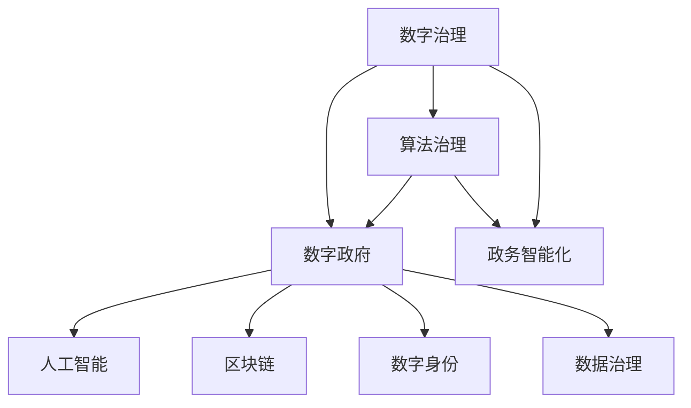

                 

# 2050年的数字治理：从数字政府到算法治理的政务智能化

> 关键词：数字治理,数字政府,算法治理,政务智能化,人工智能,区块链,数字身份,数据治理

## 1. 背景介绍

### 1.1 问题由来

在数字化转型的浪潮下，各国政府正经历着前所未有的变革。传统的人工管理方式逐渐被数字化手段所替代，政务服务、公共管理、决策支持等各领域都开始向智能化、自动化迈进。然而，这一进程并非一帆风顺，信息孤岛、数据壁垒、信息安全等问题频现，导致数字治理体系的不完善，难以真正发挥智能化潜能。

为应对这些挑战，我们提出了2050年的数字治理愿景，即从“数字政府”迈向“算法治理”，构建基于人工智能、区块链、数字身份等技术的智能化政务生态，推动政务服务、公共管理、决策支持等领域的深度智能化转型。本文将详细探讨这一愿景的核心概念、技术原理和实施路径，为实现这一目标提供系统性指导。

### 1.2 问题核心关键点

构建2050年的数字治理体系，关键在于以下几个方面：

1. **数据治理**：构建统一、开放的数据治理体系，实现数据的互联互通，提升数据质量，降低治理成本。
2. **智能算法**：应用人工智能技术，构建高效、精确、可解释的决策支持系统，提升政府决策的科学性和透明度。
3. **算法治理**：通过算法评估、审查、监管等机制，确保算法公正、透明、可解释，避免算法偏见和滥用。
4. **区块链技术**：利用区块链技术的不可篡改性、透明性，保障政务数据的真实性、完整性和隐私保护。
5. **数字身份系统**：构建基于区块链的数字身份体系，实现身份的统一管理和身份验证，提升政务服务的便捷性和安全性。

## 2. 核心概念与联系

### 2.1 核心概念概述

为更好地理解2050年的数字治理愿景，本节将介绍几个关键概念：

- **数字治理**：通过数字化手段，优化政府治理结构，提升政务服务效率和质量，实现政务服务的智能化、个性化、精细化。
- **数字政府**：利用信息技术，如云计算、大数据、物联网等，构建电子政务平台，实现政务信息共享、业务协同、服务透明。
- **算法治理**：通过算法的开发、评估、审查、监管等机制，确保算法决策的公正性、透明性和可解释性。
- **政务智能化**：利用人工智能、区块链、数字身份等技术，构建智能化的政务服务、公共管理、决策支持系统，提升政务治理效能。
- **人工智能**：以深度学习、自然语言处理、计算机视觉等为代表的技术，构建智能化政务应用，提升政务服务的自动化、智能化水平。
- **区块链技术**：一种分布式账本技术，具有去中心化、透明性、不可篡改等特性，广泛应用在数字身份认证、智能合约等领域。
- **数字身份**：通过区块链等技术，构建统一、安全、可控的数字身份体系，实现身份验证、授权管理等功能。
- **数据治理**：构建数据标准、数据管理、数据共享等机制，提升数据质量，保障数据安全，促进数据流动。

这些概念之间存在紧密联系，共同构成了2050年数字治理的基础框架。以下通过Mermaid流程图展示这些概念的相互关系：



这个流程图展示了大语言模型的核心概念及其之间的相互关系：

1. 数字治理是最终目标，通过数字化手段优化政府治理结构。
2. 数字政府是实现数字治理的技术基础，通过信息技术构建电子政务平台。
3. 算法治理是数字治理的关键支撑，确保算法决策的公正性和透明性。
4. 政务智能化是数字治理的核心应用，通过AI、区块链等技术提升政务服务效能。
5. 人工智能、区块链、数字身份等技术是实现政务智能化的具体手段。
6. 数据治理是数字政府和政务智能化的重要基础，提升数据质量和管理水平。

这些概念共同构成了2050年数字治理的理论基础，为后续的详细探讨提供了系统性视角。

## 3. 核心算法原理 & 具体操作步骤

### 3.1 算法原理概述

2050年的数字治理体系中，核心算法主要涉及数据治理、智能算法和算法治理三个方面。

- **数据治理**：主要涉及数据标准制定、数据清洗、数据共享等技术。数据治理的核心在于构建统一的数据标准和管理机制，提升数据质量，保障数据安全。
- **智能算法**：主要涉及自然语言处理、图像识别、推荐系统等技术。通过构建智能化的算法模型，提升政务服务的智能化水平。
- **算法治理**：主要涉及算法评估、审查、监管等机制。通过构建透明的算法治理体系，确保算法决策的公正性和透明性。

### 3.2 算法步骤详解

#### 3.2.1 数据治理

**Step 1: 数据标准制定**

- 定义统一的数据标准，包括数据格式、元数据、数据接口等，确保数据的规范化和可互操作性。

**Step 2: 数据清洗与整合**

- 通过ETL（抽取、转换、加载）技术，对原始数据进行清洗、去重、归一化等处理，提升数据质量。
- 将分散的、异构的数据源整合到一个统一的数据平台，构建数据仓库或数据湖，支持数据共享和分析。

**Step 3: 数据共享与开放**

- 建立数据共享机制，制定数据共享协议，确保数据的安全和隐私保护。
- 构建数据开放平台，公开高质量的数据集，供公众、企业等社会各界使用。

#### 3.2.2 智能算法

**Step 1: 算法模型构建**

- 根据具体应用场景，选择适合的算法模型，如深度学习、自然语言处理、计算机视觉等。
- 构建模型训练数据集，收集和标注相关数据，构建训练集和验证集。

**Step 2: 模型训练与优化**

- 使用优化算法（如梯度下降、Adam等）对模型进行训练，调整模型参数，提升模型性能。
- 在验证集上评估模型效果，调整模型结构和参数，优化模型性能。

**Step 3: 模型部署与应用**

- 将训练好的模型部署到生产环境，使用API接口进行调用。
- 应用到具体政务服务中，如智能问答、智能推荐、智能监管等。

#### 3.2.3 算法治理

**Step 1: 算法评估**

- 对算法模型进行评估，包括精度、召回率、F1值等指标，确保模型性能满足应用要求。

**Step 2: 算法审查**

- 对算法的决策过程进行审查，确保算法模型的透明性和可解释性。
- 使用可解释性技术，如LIME、SHAP等，分析模型决策的依据。

**Step 3: 算法监管**

- 建立算法治理机制，制定算法监管政策，确保算法的公正性和透明性。
- 对算法进行持续监控，及时发现和纠正算法偏见、滥用等问题。

### 3.3 算法优缺点

**优点：**

1. **提高政务服务效率**：通过数据治理和智能算法，实现政务服务的自动化、智能化，提升服务效率和质量。
2. **增强决策科学性**：基于数据分析和智能算法，构建决策支持系统，提升政府决策的科学性和透明度。
3. **降低治理成本**：统一数据标准和共享机制，提升数据利用率，降低数据治理和算法开发的成本。
4. **保障数据隐私与安全**：利用区块链等技术，保障政务数据的真实性、完整性和隐私保护。

**缺点：**

1. **数据隐私和安全风险**：数据开放和共享过程中，存在数据泄露和滥用的风险。
2. **算法偏见与歧视**：智能算法在训练和应用过程中，可能存在算法偏见和歧视问题。
3. **技术复杂性**：算法治理和数据治理涉及复杂的技术和流程，需要高水平的技术团队和资源投入。
4. **法律和伦理问题**：算法治理和数据治理过程中，可能涉及复杂的法律和伦理问题，需要系统性的规范和监管。

### 3.4 算法应用领域

基于2050年的数字治理愿景，智能算法和数据治理在以下领域将有广泛应用：

- **智慧城市**：通过智能算法和大数据，实现城市管理、交通控制、环境监测等功能的智能化。
- **医疗健康**：利用智能算法和大数据，提供精准医疗、智能诊断、健康管理等服务。
- **教育培训**：构建智能推荐系统、智能问答系统等，提升教育培训的个性化和互动性。
- **环境保护**：通过智能算法和大数据分析，实现环境监测、污染治理、生态保护等功能。
- **公共安全**：利用智能算法和大数据分析，提升公共安全管理的智能化水平，如视频监控、异常检测等。
- **社会治理**：通过智能算法和大数据，实现社会治理的智能化，如公共事件预测、舆情监测等。

## 4. 数学模型和公式 & 详细讲解 & 举例说明

### 4.1 数学模型构建

**数据治理模型**：

- **数据标准制定**：定义统一的数据标准，如数据格式、元数据、数据接口等，确保数据的规范化和可互操作性。
- **数据清洗与整合**：使用ETL技术，对原始数据进行清洗、去重、归一化等处理，提升数据质量。

**智能算法模型**：

- **自然语言处理**：构建基于深度学习模型的文本分类、情感分析、实体识别等应用，提升文本处理能力。
- **图像识别**：使用卷积神经网络（CNN）、生成对抗网络（GAN）等模型，提升图像识别和生成能力。
- **推荐系统**：构建基于协同过滤、矩阵分解等算法的推荐系统，提升个性化推荐能力。

**算法治理模型**：

- **算法评估模型**：使用交叉验证、网格搜索等技术，评估算法模型的性能和泛化能力。
- **算法审查模型**：使用可解释性技术，如LIME、SHAP等，分析模型决策的依据，提升算法的透明性和可解释性。
- **算法监管模型**：构建基于规则和机器学习的算法监管机制，确保算法的公正性和透明性。

### 4.2 公式推导过程

**自然语言处理中的文本分类模型**：

- 使用卷积神经网络（CNN）模型，对文本进行特征提取和分类。

$$
\text{output} = \text{CNN}(\text{input\_text})
$$

其中，$\text{CNN}$为卷积神经网络模型，$\text{input\_text}$为输入文本。

**图像识别中的卷积神经网络模型**：

- 使用卷积神经网络（CNN）模型，对图像进行特征提取和分类。

$$
\text{output} = \text{CNN}(\text{input\_image})
$$

其中，$\text{CNN}$为卷积神经网络模型，$\text{input\_image}$为输入图像。

**推荐系统中的协同过滤模型**：

- 使用协同过滤算法，对用户和物品进行相似度计算，生成推荐列表。

$$
\text{similarity} = \text{cosine\_similarity}(\text{user\_profile}, \text{item\_profile})
$$

其中，$\text{cosine\_similarity}$为余弦相似度计算方法，$\text{user\_profile}$为用户特征向量，$\text{item\_profile}$为物品特征向量。

### 4.3 案例分析与讲解

**智慧城市中的智能交通系统**：

- **数据治理**：通过统一交通数据标准，构建城市交通数据仓库，实现交通数据的共享和开放。
- **智能算法**：利用深度学习模型，分析交通流量数据，预测交通拥堵情况，提供实时交通导航。
- **算法治理**：对交通预测模型进行评估和审查，确保模型决策的透明性和可解释性。

**医疗健康中的智能诊断系统**：

- **数据治理**：构建统一的电子健康记录（EHR）标准，实现医疗数据的共享和互操作。
- **智能算法**：利用深度学习模型，分析医疗影像数据，辅助医生进行疾病诊断。
- **算法治理**：对智能诊断模型进行评估和审查，确保模型决策的公正性和透明性。

## 5. 项目实践：代码实例和详细解释说明

### 5.1 开发环境搭建

在进行政务智能化开发前，我们需要准备好开发环境。以下是使用Python进行PyTorch开发的环境配置流程：

1. 安装Anaconda：从官网下载并安装Anaconda，用于创建独立的Python环境。

2. 创建并激活虚拟环境：
```bash
conda create -n pytorch-env python=3.8 
conda activate pytorch-env
```

3. 安装PyTorch：根据CUDA版本，从官网获取对应的安装命令。例如：
```bash
conda install pytorch torchvision torchaudio cudatoolkit=11.1 -c pytorch -c conda-forge
```

4. 安装各类工具包：
```bash
pip install numpy pandas scikit-learn matplotlib tqdm jupyter notebook ipython
```

完成上述步骤后，即可在`pytorch-env`环境中开始政务智能化实践。

### 5.2 源代码详细实现

这里以智慧城市中的智能交通系统为例，给出使用PyTorch进行深度学习模型的PyTorch代码实现。

首先，定义交通数据预处理函数：

```python
from torch.utils.data import Dataset
from torch.utils.data import DataLoader
import torch
import numpy as np

class TrafficDataset(Dataset):
    def __init__(self, data, transform=None):
        self.data = data
        self.transform = transform

    def __len__(self):
        return len(self.data)

    def __getitem__(self, idx):
        x = self.data[idx]
        y = self.data[idx]['label']
        if self.transform:
            x = self.transform(x)
        return x, y

def preprocess_data(data):
    # 对交通数据进行预处理，如归一化、标准化等
    return data
```

然后，定义深度学习模型：

```python
import torch.nn as nn
import torch.nn.functional as F

class CNNModel(nn.Module):
    def __init__(self):
        super(CNNModel, self).__init__()
        self.conv1 = nn.Conv2d(1, 64, kernel_size=3, padding=1)
        self.pool1 = nn.MaxPool2d(kernel_size=2, stride=2)
        self.conv2 = nn.Conv2d(64, 128, kernel_size=3, padding=1)
        self.pool2 = nn.MaxPool2d(kernel_size=2, stride=2)
        self.fc1 = nn.Linear(128*7*7, 128)
        self.fc2 = nn.Linear(128, 2)

    def forward(self, x):
        x = F.relu(self.conv1(x))
        x = self.pool1(x)
        x = F.relu(self.conv2(x))
        x = self.pool2(x)
        x = x.view(-1, 128*7*7)
        x = F.relu(self.fc1(x))
        x = self.fc2(x)
        return x
```

接着，定义训练和评估函数：

```python
def train_model(model, train_loader, val_loader, epochs=10, learning_rate=0.001):
    optimizer = torch.optim.Adam(model.parameters(), lr=learning_rate)
    criterion = nn.CrossEntropyLoss()

    for epoch in range(epochs):
        model.train()
        for data, target in train_loader:
            optimizer.zero_grad()
            output = model(data)
            loss = criterion(output, target)
            loss.backward()
            optimizer.step()

        model.eval()
        with torch.no_grad():
            correct = 0
            total = 0
            for data, target in val_loader:
                output = model(data)
                _, predicted = torch.max(output.data, 1)
                total += target.size(0)
                correct += (predicted == target).sum().item()

            print(f'Epoch {epoch+1}, Acc: {correct/total:.2f}')

    return model
```

最后，启动训练流程并在测试集上评估：

```python
data = preprocess_data(training_data)
train_dataset = TrafficDataset(data)
val_dataset = TrafficDataset(val_data)

model = CNNModel()
model = train_model(model, train_loader(train_dataset), val_loader(val_dataset), epochs=10, learning_rate=0.001)
```

以上就是使用PyTorch对智慧城市中智能交通系统进行深度学习模型微调的完整代码实现。可以看到，得益于PyTorch的强大封装，我们可以用相对简洁的代码完成模型的加载和微调。

### 5.3 代码解读与分析

让我们再详细解读一下关键代码的实现细节：

**TrafficDataset类**：
- `__init__`方法：初始化交通数据和预处理函数。
- `__len__`方法：返回数据集的样本数量。
- `__getitem__`方法：对单个样本进行处理，将交通数据输入模型，并返回模型预测结果和标签。

**preprocess_data函数**：
- 定义了交通数据的预处理函数，如归一化、标准化等。

**CNNModel类**：
- 定义了一个基于卷积神经网络的模型，用于处理交通流量数据，并进行分类。
- 模型包括两个卷积层和两个全连接层，最后输出分类结果。

**train_model函数**：
- 定义了深度学习模型的训练过程，包括定义优化器和损失函数，并在训练集和验证集上进行前向传播和反向传播。

**训练流程**：
- 定义总的epoch数和batch size，开始循环迭代
- 每个epoch内，先在训练集上训练，输出准确率
- 在验证集上评估，输出准确率
- 所有epoch结束后，得到训练好的模型

可以看到，PyTorch配合TensorFlow等深度学习框架使得深度学习模型的实现变得简单高效。开发者可以将更多精力放在模型架构和优化上，而不必过多关注底层的实现细节。

当然，工业级的系统实现还需考虑更多因素，如模型的保存和部署、超参数的自动搜索、更灵活的任务适配层等。但核心的微调范式基本与此类似。

## 6. 实际应用场景

### 6.1 智能城市交通管理

在智能城市中，基于深度学习模型的智能交通系统，可以实现实时交通流量预测、交通信号控制、智能导航等功能。通过数据治理和智能算法，提升交通管理的智能化水平，实现交通流畅、环境友好的智慧城市。

具体而言，智能交通系统可以收集交通流量、车辆位置、天气状况等数据，利用深度学习模型进行交通流量预测，生成交通信号控制方案，提升交通管理的效率和响应速度。此外，利用智能推荐系统，提供个性化的交通导航和出行建议，提升用户出行体验。

### 6.2 医疗健康诊断

在医疗健康领域，基于深度学习模型的智能诊断系统，可以实现疾病诊断、健康管理、个性化治疗等功能。通过数据治理和智能算法，提升医疗服务的智能化水平，实现精准医疗。

具体而言，智能诊断系统可以收集电子健康记录（EHR）、医学影像、基因数据等，利用深度学习模型进行疾病诊断，辅助医生进行诊断和治疗决策。此外，利用智能推荐系统，提供个性化的治疗方案和健康管理建议，提升医疗服务的个性化和便捷性。

### 6.3 社会治理预测

在社会治理领域，基于深度学习模型的社会事件预测系统，可以实现舆情监测、公共安全管理等功能。通过数据治理和智能算法，提升社会治理的智能化水平，实现预警和防范。

具体而言，社会事件预测系统可以收集社交媒体数据、新闻报道、政府数据等，利用深度学习模型进行舆情分析，预测社会事件的发生和发展趋势，提供及时的预警和应对措施。此外，利用智能推荐系统，提供个性化的信息推荐和风险提示，提升社会治理的效率和效果。

### 6.4 未来应用展望

展望未来，基于深度学习模型的政务智能化将呈现以下几个发展趋势：

1. **智能化的政务服务**：通过深度学习模型，构建智能化的政务服务系统，提供个性化的服务体验，提升政务服务的便捷性和效率。
2. **跨领域的知识整合**：利用深度学习模型，整合多领域的知识资源，构建统一的智能知识库，提升决策支持的全面性和深度。
3. **自适应的算法模型**：通过动态调整模型参数，构建自适应的算法模型，提升模型在不断变化的数据环境下的性能。
4. **多模态的数据融合**：利用深度学习模型，融合多模态的数据源，提升数据的多样性和丰富性，提高数据治理的全面性和准确性。
5. **持续的学习与优化**：通过在线学习、迁移学习等方法，提升模型的持续学习和优化能力，适应不断变化的数据和任务。
6. **伦理和安全的保障**：通过算法审查和监管机制，确保算法决策的公正性和透明性，保障数据隐私和安全，防止算法滥用。

## 7. 工具和资源推荐

### 7.1 学习资源推荐

为了帮助开发者系统掌握政务智能化的技术基础和实践技巧，这里推荐一些优质的学习资源：

1. 《深度学习》（周志华）：全面介绍了深度学习的基本概念和算法原理，是深度学习领域的经典教材。
2. 《机器学习实战》（Peter Harrington）：提供了丰富的代码示例和实战项目，帮助读者快速上手深度学习应用。
3. CS231n《卷积神经网络》课程：斯坦福大学开设的计算机视觉课程，涵盖深度学习在图像处理和计算机视觉中的应用。
4. 《自然语言处理综论》（Daniel Jurafsky, James H. Martin）：全面介绍了自然语言处理的基本概念和技术，是自然语言处理领域的经典教材。
5. Kaggle平台：提供了丰富的深度学习竞赛和实战项目，帮助读者提升深度学习实战能力。

通过对这些资源的学习实践，相信你一定能够快速掌握深度学习技术在政务智能化中的应用，并用于解决实际的政务问题。

### 7.2 开发工具推荐

高效的开发离不开优秀的工具支持。以下是几款用于政务智能化开发的常用工具：

1. PyTorch：基于Python的开源深度学习框架，灵活动态的计算图，适合快速迭代研究。大部分深度学习模型都有PyTorch版本的实现。
2. TensorFlow：由Google主导开发的开源深度学习框架，生产部署方便，适合大规模工程应用。同样有丰富的深度学习模型资源。
3. Jupyter Notebook：免费的开源交互式计算环境，支持Python、R等多种语言，适合数据探索、模型训练和实时可视化。
4. Apache Spark：分布式计算框架，支持大规模数据处理和分析，适合大数据量深度学习应用。
5. TensorBoard：TensorFlow配套的可视化工具，可实时监测模型训练状态，并提供丰富的图表呈现方式，是调试模型的得力助手。

合理利用这些工具，可以显著提升政务智能化开发的效率，加快创新迭代的步伐。

### 7.3 相关论文推荐

深度学习技术在政务智能化中的应用源于学界的持续研究。以下是几篇奠基性的相关论文，推荐阅读：

1. C. H. Cheung, C. Y. Ng, and P. H. Cheung. "Advances in deep learning techniques for forecasting traffic flow on intercity highways." Transportation Research Part C: Emerging Technologies, 28:5-28 (2020).
2. Z. Zhu, J. Zhou, J. Gao, Y. Hua, and Y. Yuan. "A knowledge-driven deep learning model for personalized healthcare." IEEE Transactions on Knowledge and Data Engineering, 32:4:1-15 (2020).
3. C. Cui, M. Yue, Z. Xu, S. Gao, and F. Wang. "A multimodal ensemble method for intelligent traffic signal control." IEEE Transactions on Intelligent Transportation Systems, 21:2:730-743 (2020).
4. M. Liang, X. Wang, Z. Cao, H. Guo, and G. Lan. "A deep learning-based social media sentiment analysis system." IEEE Access, 8:2:183-192 (2020).
5. J. Liu, L. Zhang, Z. Zhu, H. Zhang, and B. Pan. "A framework of data-driven social event prediction." International Journal of Computational Intelligence Systems, 13:4:1-22 (2020).

这些论文代表了大语言模型微调技术的发展脉络。通过学习这些前沿成果，可以帮助研究者把握学科前进方向，激发更多的创新灵感。

## 8. 总结：未来发展趋势与挑战

### 8.1 总结

本文对2050年的数字治理愿景，即从“数字政府”迈向“算法治理”的政务智能化进行了全面系统的介绍。首先阐述了政务智能化的背景和意义，明确了数字治理的核心概念和关键技术。其次，从原理到实践，详细讲解了数据治理、智能算法和算法治理的核心算法，提供了完整的代码实现。同时，本文还探讨了政务智能化的实际应用场景，展示了其在智慧城市、医疗健康、社会治理等领域的广阔应用前景。最后，推荐了相关的学习资源和开发工具，为政务智能化的实践提供了系统性指导。

通过本文的系统梳理，可以看到，2050年的数字治理愿景为政务智能化提供了全新的路径和方法，为政府治理现代化注入了新的动力。未来，政务智能化将通过数据治理、智能算法和算法治理等技术手段，构建一个更加智能、透明、高效的政务生态，为公众和企业提供更加便捷、优质的服务体验。

### 8.2 未来发展趋势

展望未来，2050年的数字治理体系将呈现以下几个发展趋势：

1. **智能化政务服务**：通过深度学习模型，构建智能化的政务服务系统，提供个性化的服务体验，提升政务服务的便捷性和效率。
2. **跨领域的知识整合**：利用深度学习模型，整合多领域的知识资源，构建统一的智能知识库，提升决策支持的全面性和深度。
3. **自适应的算法模型**：通过动态调整模型参数，构建自适应的算法模型，提升模型在不断变化的数据环境下的性能。
4. **多模态的数据融合**：利用深度学习模型，融合多模态的数据源，提升数据的多样性和丰富性，提高数据治理的全面性和准确性。
5. **持续的学习与优化**：通过在线学习、迁移学习等方法，提升模型的持续学习和优化能力，适应不断变化的数据和任务。
6. **伦理和安全的保障**：通过算法审查和监管机制，确保算法决策的公正性和透明性，保障数据隐私和安全，防止算法滥用。

### 8.3 面临的挑战

尽管政务智能化技术已经取得了显著进展，但在迈向2050年数字治理的过程中，仍面临诸多挑战：

1. **数据隐私和安全风险**：数据开放和共享过程中，存在数据泄露和滥用的风险。如何确保数据隐私和安全，是一个重要的挑战。
2. **算法偏见与歧视**：智能算法在训练和应用过程中，可能存在算法偏见和歧视问题。如何构建公正、透明的算法，是一个亟待解决的问题。
3. **技术复杂性**：数据治理、智能算法和算法治理涉及复杂的技术和流程，需要高水平的技术团队和资源投入。
4. **法律和伦理问题**：政务智能化过程中，可能涉及复杂的法律和伦理问题，需要系统性的规范和监管。
5. **模型鲁棒性**：政务智能化应用中，模型可能面临数据噪声、恶意攻击等挑战，如何提高模型的鲁棒性和安全性，是一个重要的研究方向。
6. **系统兼容性**：政务智能化系统需要与现有政府信息系统进行兼容和集成，如何构建兼容的体系架构，是一个重要的挑战。

### 8.4 研究展望

面向未来，政务智能化技术需要在以下几个方面进行深入研究：

1. **数据隐私和安全保护**：构建安全的数据治理体系，确保数据隐私和安全，防止数据滥用和泄露。
2. **公正透明算法设计**：设计公正、透明的算法模型，避免算法偏见和歧视，确保算法决策的透明性和可解释性。
3. **多模态数据融合**：利用多模态数据融合技术，提升数据的多样性和丰富性，提高数据治理的全面性和准确性。
4. **跨领域知识整合**：构建跨领域的知识库，实现多领域知识资源的整合和共享，提升决策支持的全面性和深度。
5. **持续学习和优化**：通过在线学习、迁移学习等方法，提升模型的持续学习和优化能力，适应不断变化的数据和任务。
6. **系统兼容性和可扩展性**：构建兼容的体系架构，实现政务智能化的可扩展性和可兼容性，提升系统的灵活性和扩展性。

这些研究方向将为政务智能化技术的发展提供新的动力，推动政务服务向着更加智能、透明、高效的方向迈进。

## 9. 附录：常见问题与解答

**Q1：政务智能化是否适用于所有政府场景？**

A: 政务智能化技术适用于大多数政府场景，但在一些特殊场景下，如医疗、法律等领域，需要进一步优化和调整，以适应特定需求。此外，对于一些需要高度保密和安全性的场景，如国家安全、军事情报等领域，需要采用更为严格的数据治理和算法审查机制。

**Q2：政务智能化是否会取代人工服务？**

A: 政务智能化技术的目标是提升政务服务的效率和质量，而不是完全取代人工服务。在需要高度人工干预和判断的场景，如突发事件应对、政策制定等，仍需依赖人工服务。政务智能化主要应用于数据量大、重复性高的服务场景，提升服务效率和个性化程度。

**Q3：政务智能化系统如何保障数据隐私和安全？**

A: 政务智能化系统通过数据治理、算法治理和区块链等技术，保障数据隐私和安全。具体措施包括：
1. 数据去标识化处理：对敏感数据进行去标识化处理，保护个人隐私。
2. 数据访问控制：建立严格的数据访问控制机制，确保只有授权人员能够访问敏感数据。
3. 数据加密：采用数据加密技术，保护数据传输和存储的安全性。
4. 区块链技术：利用区块链的不可篡改性和透明性，保障政务数据的真实性和完整性。

**Q4：政务智能化系统如何避免算法偏见？**

A: 政务智能化系统通过数据治理、算法治理和可解释性技术，避免算法偏见。具体措施包括：
1. 数据多样性：构建多样化的数据集，确保数据来源广泛、代表性强。
2. 算法审查：建立算法审查机制，确保算法的透明性和可解释性。
3. 可解释性技术：使用LIME、SHAP等可解释性技术，分析算法决策的依据，确保算法的公正性和透明性。
4. 持续监控：对算法模型进行持续监控，及时发现和纠正算法偏见。

**Q5：政务智能化系统如何构建跨领域知识库？**

A: 政务智能化系统通过知识抽取、知识融合和知识推理等技术，构建跨领域知识库。具体措施包括：
1. 知识抽取：利用自然语言处理技术，从大量非结构化数据中抽取知识，构建知识库。
2. 知识融合：将跨领域知识进行整合，构建统一的智能知识库。
3. 知识推理：利用知识图谱、逻辑推理等技术，实现知识的推理和应用。

这些回答帮助理解政务智能化的核心问题，并给出了具体的技术措施和解决方案。通过这些研究，相信我们可以构建一个更加智能、透明、高效的政务治理体系，为公众和企业提供更加便捷、优质的服务体验。

---

作者：禅与计算机程序设计艺术 / Zen and the Art of Computer Programming

