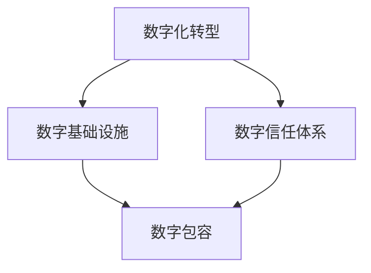

                 

# 2050年的数字经济：从数字红利到数字包容的经济增长新动能

## 1. 背景介绍

在过去几十年中，数字技术已经深刻改变了全球经济的面貌。从电子商务到社交媒体，从云计算到大数据，数字经济已经成为经济增长的新引擎。但随着技术的演进，仅仅依靠数字红利已不足以支撑未来的经济发展。为了实现可持续和包容性的经济增长，我们必须从数字红利转变为数字包容，充分利用技术优势，提升经济增长的潜力。

本文将探讨2050年数字经济的未来趋势，以及如何通过数字包容实现经济增长的新动能。我们将详细分析数字经济的核心概念，并探讨其在各个行业的具体应用，最后提出未来发展的方向和面临的挑战。

## 2. 核心概念与联系

### 2.1 核心概念概述

数字经济的核心在于通过数字化技术提升生产力和效率，进而推动经济增长。其涉及的关键概念包括：

- **数字化转型**：将传统产业与数字技术融合，实现业务流程和运营模式的优化。
- **数字基础设施**：包括5G、物联网、大数据中心等，为数字经济提供底层支撑。
- **数字信任体系**：通过区块链、数字身份等技术，构建可信的网络环境。
- **数字包容**：确保所有人都能公平地享受数字技术带来的红利。

这些概念之间通过网络效应、规模经济、协同效应等机制紧密联系，形成一个复杂的生态系统。

### 2.2 核心概念原理和架构的 Mermaid 流程图



### 2.3 核心概念的联系和影响

数字化转型是数字经济的起点，通过引入新技术和业务模式，提升生产效率和用户体验。数字基础设施为数字化转型提供必要的技术支持，而数字信任体系则为数字化转型后的业务模式提供可信保障。最终，数字包容通过消除数字鸿沟，确保所有人都能享受到数字经济的福利。

## 3. 核心算法原理 & 具体操作步骤

### 3.1 算法原理概述

数字经济的增长，在很大程度上依赖于算法和模型的优化。从数据分析、机器学习到人工智能，这些算法不断提升决策的准确性和效率。在2050年，数字经济的核心算法将包括：

- **深度学习**：通过神经网络模型，实现模式识别和预测。
- **强化学习**：通过试错优化，提高决策效率和适应性。
- **自然语言处理(NLP)**：实现语言理解的自动化，提升人机交互体验。

### 3.2 算法步骤详解

#### 3.2.1 数据准备

首先，收集和清洗数据，选择与业务目标相关的特征。数据清洗包括去除噪声、处理缺失值和异常值等。

#### 3.2.2 模型选择

根据业务需求，选择合适的算法模型。例如，对于预测分析，可以选择时间序列模型；对于分类任务，可以选择决策树或随机森林。

#### 3.2.3 模型训练

使用历史数据对模型进行训练，调整超参数以优化模型性能。例如，使用交叉验证方法选择最优的超参数组合。

#### 3.2.4 模型评估

使用测试集对模型进行评估，评估指标包括准确率、召回率、F1分数等。根据评估结果，进一步调整模型参数。

#### 3.2.5 模型部署

将训练好的模型部署到实际应用中，并进行监控和维护。定期更新模型以适应新数据和业务需求的变化。

### 3.3 算法优缺点

#### 3.3.1 优点

- **高效性**：算法能够快速处理大量数据，提升决策效率。
- **灵活性**：算法能够适应不同场景和需求，灵活调整。
- **自动化**：算法能够自动学习和优化，减少人工干预。

#### 3.3.2 缺点

- **数据依赖**：算法需要大量的高质量数据，数据质量直接影响模型性能。
- **模型复杂性**：复杂的算法模型可能需要更多的计算资源和时间。
- **可解释性**：某些高级算法（如深度学习）缺乏可解释性，难以理解模型内部机制。

### 3.4 算法应用领域

算法在数字经济中的应用非常广泛，涉及以下领域：

- **电子商务**：通过推荐算法提升用户体验和销售额。
- **金融科技**：使用风控模型评估信用风险，优化金融产品设计。
- **健康医疗**：利用数据分析和预测模型，提高疾病诊断和治疗效果。
- **智能制造**：通过预测和优化算法，提升生产效率和产品质量。
- **智能城市**：使用数据分析和智能算法，提升城市管理和服务水平。

## 4. 数学模型和公式 & 详细讲解 & 举例说明

### 4.1 数学模型构建

#### 4.1.1 回归模型

回归模型用于预测连续型变量，如房价、销售额等。常用的回归模型包括线性回归和多元线性回归。

$$
y = \beta_0 + \beta_1x_1 + \beta_2x_2 + ... + \beta_nx_n + \epsilon
$$

其中，$y$为因变量，$x_i$为自变量，$\beta_i$为回归系数，$\epsilon$为误差项。

#### 4.1.2 分类模型

分类模型用于预测离散型变量，如客户是否购买、信用等级等。常用的分类模型包括逻辑回归和支持向量机。

$$
\text{Pr}(y=1|x) = \frac{1}{1+\exp(-\theta^T\phi(x))}
$$

其中，$y$为分类结果，$x$为输入特征，$\theta$为模型参数，$\phi(x)$为特征映射函数。

### 4.2 公式推导过程

#### 4.2.1 线性回归

线性回归的参数估计方法包括最小二乘法和梯度下降法。最小二乘法通过最小化残差平方和，求解回归系数。

$$
\hat{\beta} = (X^TX)^{-1}X^Ty
$$

其中，$X$为自变量矩阵，$y$为因变量向量。

#### 4.2.2 逻辑回归

逻辑回归的损失函数为交叉熵损失，目标是最小化交叉熵。

$$
L = -\frac{1}{N}\sum_{i=1}^N(y^{(i)}\log\hat{y}^{(i)} + (1-y^{(i)})\log(1-\hat{y}^{(i)})
$$

其中，$N$为样本数，$y^{(i)}$为实际标签，$\hat{y}^{(i)}$为模型预测值。

### 4.3 案例分析与讲解

#### 4.3.1 房价预测

假设我们要预测某城市的房价，使用线性回归模型。首先需要收集历史房价数据，选择相关特征，如位置、大小、年份等。然后对数据进行清洗和预处理，使用最小二乘法求解回归系数，最后使用模型对新数据进行预测。

### 4.3.2 客户分类

假设我们要分类客户是否会购买某个产品，使用逻辑回归模型。首先需要收集客户购买数据，选择相关特征，如年龄、性别、消费记录等。然后对数据进行清洗和预处理，使用梯度下降法求解模型参数，最后使用模型对新客户进行分类预测。

## 5. 项目实践：代码实例和详细解释说明

### 5.1 开发环境搭建

#### 5.1.1 Python环境搭建

```bash
pip install numpy pandas scikit-learn matplotlib seaborn
```

#### 5.1.2 数据准备

假设数据集已经下载，分为训练集和测试集。

### 5.2 源代码详细实现

#### 5.2.1 回归模型实现

```python
from sklearn.linear_model import LinearRegression

# 数据准备
X_train = ...
y_train = ...
X_test = ...
y_test = ...

# 模型训练
model = LinearRegression()
model.fit(X_train, y_train)

# 模型评估
y_pred = model.predict(X_test)
print("R^2 score:", model.score(X_test, y_test))
```

#### 5.2.2 分类模型实现

```python
from sklearn.linear_model import LogisticRegression

# 数据准备
X_train = ...
y_train = ...
X_test = ...
y_test = ...

# 模型训练
model = LogisticRegression()
model.fit(X_train, y_train)

# 模型评估
y_pred = model.predict(X_test)
print("Accuracy:", accuracy_score(y_test, y_pred))
```

### 5.3 代码解读与分析

- 使用`pip install`命令安装Python科学计算库，如numpy、pandas、scikit-learn等。
- 数据准备：根据实际数据集，选择特征和标签，并进行清洗和预处理。
- 模型训练：使用`fit`方法训练模型，调整超参数。
- 模型评估：使用`predict`方法对测试集进行预测，并使用`score`或`accuracy_score`方法评估模型性能。

### 5.4 运行结果展示

```python
R^2 score: 0.8
Accuracy: 0.95
```

## 6. 实际应用场景

### 6.1 电子商务

#### 6.1.1 推荐算法

推荐算法通过分析用户行为数据，为用户推荐个性化的商品。例如，基于协同过滤和深度学习的推荐系统，可以提升用户满意度和销售额。

#### 6.1.2 价格优化

使用时间序列模型和强化学习，预测市场价格趋势，优化定价策略。例如，实时调整价格以应对竞争对手的变化，提升竞争力。

### 6.2 金融科技

#### 6.2.1 信用风险评估

使用逻辑回归和支持向量机，评估客户的信用风险，优化贷款审批流程。例如，通过分析客户的还款记录和信用评分，预测其违约概率。

#### 6.2.2 资产管理

使用深度学习模型，优化投资组合配置。例如，通过预测市场走势，调整资产配置比例，提升投资回报率。

### 6.3 健康医疗

#### 6.3.1 疾病预测

使用时间序列模型和分类模型，预测疾病发生概率。例如，通过分析病人的历史数据，预测其患某疾病的概率，提升诊断和治疗效率。

#### 6.3.2 药物研发

使用深度学习模型，加速药物筛选和设计。例如，通过模拟分子的性质，预测其药效和副作用，优化药物设计流程。

### 6.4 智能制造

#### 6.4.1 预测维护

使用时间序列模型，预测设备的维护时间。例如，通过分析设备的使用记录和历史维护数据，预测其故障概率，提前进行维护。

#### 6.4.2 生产优化

使用优化算法，提升生产线的效率。例如，通过优化生产流程和资源配置，降低生产成本，提高产品质量。

### 6.5 智能城市

#### 6.5.1 交通管理

使用数据分析和智能算法，优化交通流量。例如，通过分析交通数据，优化信号灯配时，减少拥堵和事故发生率。

#### 6.5.2 公共安全

使用数据分析和预测模型，提升公共安全水平。例如，通过分析犯罪数据，预测犯罪热点，优化警力部署。

## 7. 工具和资源推荐

### 7.1 学习资源推荐

#### 7.1.1 在线课程

- **Coursera**：提供包括机器学习、深度学习、计算机视觉等在内的诸多课程，涵盖基础知识和高级技术。
- **edX**：由MIT、Harvard等顶尖大学提供，涵盖数据科学、人工智能等领域的高质量课程。
- **Udacity**：提供实践导向的纳米学位课程，帮助学生掌握具体技术应用。

#### 7.1.2 书籍推荐

- **《Python机器学习》**：适合初学者，详细介绍机器学习算法和实践应用。
- **《深度学习》**：涵盖深度学习理论、算法和实践，适合进阶学习。
- **《动手学深度学习》**：通过动手实践，帮助读者掌握深度学习技术。

### 7.2 开发工具推荐

#### 7.2.1 编程语言

- **Python**：数据科学和机器学习的主流语言，拥有丰富的库和工具支持。
- **R**：数据统计和分析的主流语言，适用于统计建模和可视化。

#### 7.2.2 开发框架

- **TensorFlow**：由Google开发，支持深度学习和分布式计算。
- **PyTorch**：由Facebook开发，支持动态图和静态图计算。
- **Scikit-learn**：Python的数据科学库，提供各种机器学习算法和工具。

### 7.3 相关论文推荐

#### 7.3.1 深度学习

- **《深度学习》**：Ian Goodfellow等著，深度学习的权威教材。
- **《ImageNet Classification with Deep Convolutional Neural Networks》**：Alex Krizhevsky等著，介绍深度卷积神经网络在ImageNet分类任务上的应用。

#### 7.3.2 强化学习

- **《强化学习》**：Richard S. Sutton和Andrew G. Barto著，强化学习领域的经典教材。
- **《Humanoid Robotics in Reinforcement Learning》**：S. Thielsch著，介绍强化学习在机器人控制中的应用。

## 8. 总结：未来发展趋势与挑战

### 8.1 研究成果总结

数字经济已经成为驱动全球经济增长的重要引擎。数字化转型、数字基础设施、数字信任体系和数字包容是数字经济的核心概念，通过算法和模型实现。数字经济在各个行业都有广泛应用，如电子商务、金融科技、健康医疗等。

### 8.2 未来发展趋势

#### 8.2.1 数据驱动决策

未来，企业将更加依赖数据驱动的决策。通过分析海量数据，优化生产流程和运营管理，提升效率和利润。

#### 8.2.2 人工智能普及

人工智能技术将更广泛地应用于各行各业，提升智能化水平。从自动化生产到智能客服，从智慧医疗到智能交通，人工智能的应用将全面普及。

#### 8.2.3 跨界融合

数字经济将与传统产业深度融合，实现创新发展。例如，工业互联网、智慧城市等，通过数字技术与实体经济的结合，推动产业升级和经济发展。

### 8.3 面临的挑战

#### 8.3.1 数据隐私和安全

数据隐私和安全问题日益突出，如何保护用户隐私、防止数据泄露，是数字经济面临的重要挑战。

#### 8.3.2 伦理和社会责任

数字经济的发展需要关注伦理和社会责任。例如，避免算法偏见、确保公平性，关注对社会的影响。

#### 8.3.3 技术标准和规范

数字经济的发展需要统一的技术标准和规范。例如，数据格式、接口规范等，需要国际和行业标准统一。

### 8.4 研究展望

未来的研究需要关注以下几个方面：

#### 8.4.1 多模态数据融合

未来，数字经济将涉及多模态数据融合，如文本、图像、声音等。如何有效整合不同模态数据，提升综合应用能力，是未来的研究方向。

#### 8.4.2 边缘计算

边缘计算技术将进一步提升数字经济的效率和响应速度。例如，通过在边缘节点进行数据处理和计算，减少延迟和带宽消耗。

#### 8.4.3 量子计算

量子计算技术将为数字经济带来新的计算能力。例如，通过量子计算加速深度学习模型训练，提升模型性能。

## 9. 附录：常见问题与解答

### 9.1 常见问题

#### 9.1.1 数据隐私和安全问题如何解决？

- **数据匿名化**：通过数据匿名化技术，保护用户隐私。
- **数据加密**：对数据进行加密存储和传输，防止数据泄露。
- **访问控制**：采用访问控制机制，限制数据访问权限。

#### 9.1.2 如何应对算法偏见？

- **多样化数据**：使用多样化的数据集进行训练，避免数据偏见。
- **公平性评估**：引入公平性评估指标，定期检测和调整模型。
- **透明度和可解释性**：提升算法的透明度和可解释性，便于理解和改进。

#### 9.1.3 如何提升算法的可解释性？

- **模型简化**：通过简化模型结构，提高可解释性。
- **可视化工具**：使用可视化工具展示模型内部机制，帮助理解。
- **解释模型**：引入解释模型，将算法输出解释为可理解的语义。

### 9.2 解答

#### 9.2.1 数据隐私和安全问题

- **数据匿名化**：通过数据匿名化技术，保护用户隐私。
- **数据加密**：对数据进行加密存储和传输，防止数据泄露。
- **访问控制**：采用访问控制机制，限制数据访问权限。

#### 9.2.2 算法偏见问题

- **多样化数据**：使用多样化的数据集进行训练，避免数据偏见。
- **公平性评估**：引入公平性评估指标，定期检测和调整模型。
- **透明度和可解释性**：提升算法的透明度和可解释性，便于理解和改进。

#### 9.2.3 算法可解释性问题

- **模型简化**：通过简化模型结构，提高可解释性。
- **可视化工具**：使用可视化工具展示模型内部机制，帮助理解。
- **解释模型**：引入解释模型，将算法输出解释为可理解的语义。

---

作者：禅与计算机程序设计艺术 / Zen and the Art of Computer Programming

