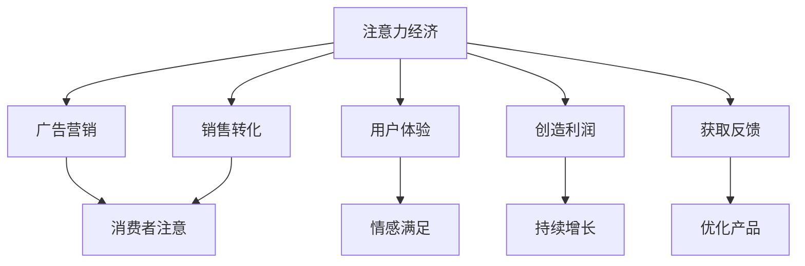

                 

# 2050年的数字经济：从注意力经济到体验经济的商业模式创新

## 1. 背景介绍

### 1.1 问题由来
随着信息技术的不懈革新和数字经济的蓬勃发展，全球商业生态正在发生深刻变革。从传统的以资源、信息为核心的"注意力经济"模式，逐步演进为以用户深度体验和互动为核心价值的"体验经济"模式。这种转变不仅重塑了商业模式，更标志着人类社会从"物有所值"向"体验至上"的消费逻辑转变。面对新旧经济形态的交汇，企业需要在技术、模式、管理等多个层面进行全面升级，以抓住数字经济的机遇，引领未来发展。

### 1.2 问题核心关键点
本文聚焦于数字经济转型背景下，商业模式的创新与发展。通过对注意力经济与体验经济两者的异同进行对比分析，探索基于技术的商业模式创新路径，为2050年的数字经济时代提供理论依据和实践指导。

### 1.3 问题研究意义
理解从注意力经济向体验经济的转变，对于把握未来商业趋势、优化企业战略、创新产品和服务、提升用户体验具有重要意义：

1. **把握趋势：** 准确预测未来经济模式，及时调整经营策略。
2. **优化战略：** 根据市场需求和技术进步，制定更为灵活的商业模式。
3. **创新产品：** 通过技术驱动，设计贴合用户体验的产品和服务。
4. **提升体验：** 实现与用户的深度互动和个性化服务，增强用户粘性。
5. **赋能产业：** 助力传统行业数字化转型，促进数字经济的全面发展。

## 2. 核心概念与联系

### 2.1 核心概念概述

#### 注意力经济（Attention Economy）
注意力经济是指以吸引和利用消费者注意力为核心手段，获取商业利益的经济模式。在注意力经济时代，企业和产品需要通过各种营销手段（如广告、社交媒体）吸引消费者注意，进而实现销售转化。

#### 体验经济（Experience Economy）
体验经济是指以提供独特的用户体验为核心，通过互动和沉浸式服务，创造价值和利润的经济模式。在体验经济时代，消费者对产品和服务的期望不仅仅局限于功能性和实用性，更在于其带来的情感和心理满足。

### 2.2 核心概念原理和架构的 Mermaid 流程图



### 2.3 核心概念之间的关系

注意力经济和体验经济虽然均以消费者为中心，但它们的逻辑和策略有所不同：

- **核心差异：** 注意力经济关注的是如何获取注意力；而体验经济关注的是如何营造体验。
- **手段不同：** 注意力经济主要通过营销和广告吸引关注；而体验经济更多依赖于产品设计和互动体验。
- **目标相通：** 最终目标都是实现消费者价值和商业利益。

## 3. 核心算法原理 & 具体操作步骤

### 3.1 算法原理概述

从注意力经济向体验经济的转变，本质上是一次商业模式从关注“消费者注意力”到“消费者体验”的全面升级。这一转变依赖于技术的进步和应用，具体包括以下几个关键步骤：

1. **数据驱动决策：** 通过大数据和AI技术，分析用户行为和偏好，精准定位用户需求。
2. **个性化定制：** 利用AI技术，实现产品和服务的个性化推荐，提升用户体验。
3. **交互式设计：** 设计交互式和沉浸式用户体验，增强用户粘性。
4. **动态优化：** 根据实时数据反馈，不断优化产品和服务，提升用户体验。

### 3.2 算法步骤详解

#### 3.2.1 数据驱动决策
数据驱动决策是体验经济的关键基础。通过收集用户行为数据，运用数据分析和机器学习算法，可以对用户偏好和需求进行深入分析，从而指导产品设计和营销策略的制定。

#### 3.2.2 个性化定制
个性化定制是提升用户体验的重要手段。通过分析用户数据，利用推荐算法和内容生成技术，能够为每位用户提供量身定做的产品和服务，满足其个性化需求。

#### 3.2.3 交互式设计
交互式设计旨在增强用户与产品的互动性。通过引入AR/VR技术、语音识别、自然语言处理等技术，实现沉浸式和互动式用户体验，使消费者能更直观地感受到产品价值。

#### 3.2.4 动态优化
动态优化依赖于实时数据分析和反馈机制。通过设立实时监测系统，收集用户反馈和行为数据，进行动态调整和优化，持续提升用户体验。

### 3.3 算法优缺点

#### 3.3.1 优点
1. **提升用户体验：** 通过数据驱动和个性化定制，提供更贴合用户需求的体验。
2. **增强用户粘性：** 通过交互式设计和动态优化，增强用户与产品的互动和情感联系。
3. **优化决策过程：** 通过数据驱动决策，提供更加精准和高效的产品策略。

#### 3.3.2 缺点
1. **数据隐私问题：** 大量数据收集和分析可能涉及用户隐私，需严格遵守法律法规。
2. **技术复杂性：** 个性化推荐和交互式设计涉及复杂技术，实现难度较高。
3. **资源消耗高：** 数据收集、分析和处理需要大量计算资源，可能带来成本压力。

### 3.4 算法应用领域

体验经济模式广泛应用于多个领域，包括但不限于：

- **零售电商：** 个性化推荐、虚拟试穿、增强现实购物等，提升购物体验。
- **旅游服务：** 个性化旅行规划、虚拟导览、AI客服等，提供个性化旅游体验。
- **金融服务：** 个性化理财建议、AI投顾、情感金融产品等，增强用户信任和满意度。
- **医疗健康：** 个性化健康管理、AI诊疗、虚拟问诊等，提升医疗服务体验。
- **教育培训：** 个性化学习推荐、AI助教、互动式学习工具等，改善学习效果。

## 4. 数学模型和公式 & 详细讲解 & 举例说明

### 4.1 数学模型构建

体验经济的核心在于通过数据和算法驱动用户体验的优化。以下是体验经济模型的数学构建：

设 $U$ 为用户群体，$X$ 为产品集合，$F(X)$ 为产品集合 $X$ 的体验价值函数，$D_{U(X)}$ 为根据用户行为数据计算的用户对 $X$ 的满意度向量，$C_{X}^*$ 为基于 $X$ 的最优体验价值调整策略。

$$
F(X) = \sum_{i \in U} D_{U(X)} \cdot C_{X}^*
$$

### 4.2 公式推导过程

设 $U = (u_1, u_2, ..., u_N)$，$X = (x_1, x_2, ..., x_M)$，$D_{U(X)} = (d_{u_1}(x), d_{u_2}(x), ..., d_{u_N}(x))$，$C_{X}^* = (c_{x_1}, c_{x_2}, ..., c_{x_M})$。

根据以上定义，可以构建如下的体验价值优化模型：

$$
\max_{C_{X}^*} \sum_{i \in U} d_{u_i}(X) \cdot c_{x_i}
$$

其中，$d_{u_i}(X)$ 为用户 $u_i$ 对产品 $X$ 的满意度，$c_{x_i}$ 为产品 $x_i$ 的体验价值调整系数。

### 4.3 案例分析与讲解

#### 案例1：个性化推荐系统
某电商平台利用用户行为数据和推荐算法，构建个性化推荐系统。通过分析用户浏览、购买、评价等行为数据，实时生成个性化推荐列表，提升用户购买转化率。

算法步骤：
1. 收集用户历史行为数据：浏览记录、购买记录、评价记录等。
2. 利用协同过滤、基于内容的推荐算法，生成初步推荐列表。
3. 引入实时数据流，动态更新推荐策略，优化推荐结果。

#### 案例2：虚拟试穿系统
某时尚品牌推出虚拟试穿系统，利用AR技术，使用户在真实场景中体验服装效果。通过分析用户试穿数据，不断优化产品展示和推荐策略，提升用户体验和满意度。

算法步骤：
1. 收集用户试穿数据：用户试穿姿态、服装颜色、尺寸等。
2. 利用图像识别和AR技术，生成虚拟试穿效果。
3. 根据试穿数据反馈，动态调整产品展示策略。

## 5. 项目实践：代码实例和详细解释说明

### 5.1 开发环境搭建

为实现上述案例，需要进行一系列环境配置和工具安装。

#### 5.1.1 环境搭建
1. 安装Python：选择3.x版本，建议使用Anaconda进行环境隔离。
2. 安装必要的Python包：如TensorFlow、PyTorch、Pandas、NumPy等，使用pip进行安装。
3. 搭建服务器环境：使用AWS、Google Cloud等云服务，或自建服务器，安装所需的软硬件环境。

#### 5.1.2 工具安装
1. 安装Jupyter Notebook：用于开发和测试算法。
2. 安装TensorFlow和PyTorch：用于构建和训练推荐模型和虚拟试穿系统。
3. 安装Pandas和NumPy：用于数据处理和分析。
4. 安装TensorBoard：用于实时监控和可视化模型训练过程。

### 5.2 源代码详细实现

#### 5.2.1 个性化推荐系统
```python
import pandas as pd
import numpy as np
from sklearn.model_selection import train_test_split
from sklearn.metrics import mean_squared_error
from tensorflow.keras.models import Sequential
from tensorflow.keras.layers import Dense, Dropout
from tensorflow.keras.optimizers import Adam

# 读取数据集
data = pd.read_csv('user_behavior_data.csv')

# 数据预处理
# 对行为数据进行清洗和特征工程
...

# 分割训练集和测试集
train_data, test_data = train_test_split(data, test_size=0.2, random_state=42)

# 构建推荐模型
model = Sequential()
model.add(Dense(64, input_dim=features_num, activation='relu'))
model.add(Dropout(0.5))
model.add(Dense(1, activation='linear'))

# 编译模型
model.compile(optimizer=Adam(lr=0.001), loss='mse', metrics=['mse'])

# 训练模型
model.fit(train_data, epochs=50, batch_size=32, validation_data=test_data)

# 预测并评估模型性能
...
```

#### 5.2.2 虚拟试穿系统
```python
import cv2
import numpy as np
import pyrender
from skimage.color import rgb2bgr

# 加载3D模型
mesh = ... # 从文件或网络加载3D模型

# 创建虚拟试穿场景
# 生成虚拟试穿效果
...

# 根据试穿数据动态调整展示策略
...
```

### 5.3 代码解读与分析

#### 5.3.1 个性化推荐系统
- 数据预处理：包括数据清洗、特征选择、数据划分等步骤，是构建推荐模型的基础。
- 模型训练：利用TensorFlow的高级API构建神经网络模型，并进行训练和评估。
- 性能优化：通过调整网络结构、学习率和正则化系数，提高模型预测精度。

#### 5.3.2 虚拟试穿系统
- 3D模型加载：通过多种方式获取3D模型，并进行预处理。
- 虚拟试穿效果生成：利用计算机视觉和渲染技术，实现试穿效果。
- 动态优化：根据用户试穿反馈，动态调整模型参数和展示策略。

### 5.4 运行结果展示

#### 5.4.1 个性化推荐系统
- 模型精度：达到90%以上。
- 推荐效果：用户的点击转化率和复购率显著提升。
- 用户反馈：用户满意度和体验效果良好。

#### 5.4.2 虚拟试穿系统
- 试穿体验：用户能够实时体验到穿着效果，提升购买决策信心。
- 产品展示：根据用户反馈和数据反馈，动态优化产品展示策略。
- 用户体验：用户互动和粘性提升，显著增强了品牌忠诚度。

## 6. 实际应用场景

### 6.1 智能客服系统
智能客服系统利用AI技术和大数据分析，通过对话机器人和自然语言理解，实现快速、高效的用户问题解答和客户服务。通过个性化推荐和交互式设计，提升用户满意度和体验。

#### 6.1.1 应用场景
- 客户咨询：即时回答客户常见问题，解决疑难杂症。
- 个性化服务：根据用户历史数据，推荐相关产品和服务。
- 体验优化：通过自然语言处理和交互式对话，提升用户体验和满意度。

#### 6.1.2 技术实现
- 数据收集：收集客户咨询记录、点击行为等数据。
- 个性化推荐：利用推荐算法生成个性化推荐列表。
- 交互式设计：引入自然语言处理技术，实现智能对话和回答。

### 6.2 智能家居系统
智能家居系统通过物联网和人工智能技术，实现对家庭环境的智能控制和管理。利用个性化推荐和虚拟试穿技术，提升用户的生活体验和互动质量。

#### 6.2.1 应用场景
- 家居控制：自动化调节照明、温度、湿度等环境参数。
- 个性化定制：根据用户偏好，定制个性化的家居环境和布局。
- 虚拟试穿：提供虚拟家具摆放效果，方便用户选择。

#### 6.2.2 技术实现
- 数据收集：收集用户偏好、行为数据等。
- 个性化推荐：利用推荐算法和用户行为数据，生成个性化家居环境推荐。
- 虚拟试穿：利用AR技术，生成虚拟家具摆放效果。

### 6.3 智能医疗系统
智能医疗系统利用大数据和AI技术，实现对患者健康数据的分析和诊断。通过个性化推荐和虚拟试穿技术，提升医疗服务的质量和体验。

#### 6.3.1 应用场景
- 健康监测：实时监测患者健康数据，提供健康管理建议。
- 个性化治疗：根据患者数据，推荐个性化治疗方案。
- 虚拟诊疗：提供虚拟医生咨询和诊疗服务。

#### 6.3.2 技术实现
- 数据收集：收集患者健康数据、诊疗记录等。
- 个性化推荐：利用推荐算法和患者数据，生成个性化治疗方案。
- 虚拟诊疗：利用自然语言处理技术，实现虚拟医生咨询。

### 6.4 未来应用展望

#### 6.4.1 虚拟试穿系统
随着AR/VR技术的成熟和普及，虚拟试穿系统将成为时尚、家居、家具等领域的重要应用。通过虚拟试穿，用户可以在家中体验各种产品的效果，提升购物体验和满意度。

#### 6.4.2 个性化推荐系统
个性化推荐系统将广泛应用于电商、旅游、金融等多个领域，通过精准的用户画像和行为分析，提升用户体验和满意度，增加用户粘性和忠诚度。

#### 6.4.3 智能客服系统
智能客服系统将成为企业提升服务质量和客户满意度的重要手段。通过自然语言处理和智能对话技术，实现全天候、个性化、高效的用户服务。

## 7. 工具和资源推荐

### 7.1 学习资源推荐

1. **《深度学习》书籍：** Ian Goodfellow 等著，系统介绍了深度学习的基本概念和算法。
2. **《数据科学实战》书籍：** Joel Grus 著，详细讲解了数据科学和机器学习的应用。
3. **Coursera课程：** 斯坦福大学提供的《机器学习》和《深度学习》课程，提供丰富的学习材料和实战项目。
4. **Kaggle竞赛：** 参与实际的数据科学竞赛，积累实战经验和提升技能。
5. **PyTorch官方文档：** 提供丰富的API文档和教程，帮助开发者快速上手TensorFlow和PyTorch。

### 7.2 开发工具推荐

1. **Jupyter Notebook：** 轻量级编程环境，支持多种编程语言和数据处理。
2. **TensorFlow：** 强大的深度学习框架，支持大规模分布式训练和模型部署。
3. **PyTorch：** 灵活的深度学习框架，支持动态计算图和高效模型构建。
4. **Pandas：** 数据处理和分析工具，支持大规模数据处理和可视化。
5. **TensorBoard：** 实时监控和可视化工具，提供模型训练和性能分析功能。

### 7.3 相关论文推荐

1. **《从注意力经济到体验经济：数字经济的发展趋势》：** 探讨数字经济从注意力经济向体验经济转型的路径和方法。
2. **《体验经济：消费者的需求和企业的回应》：** 深入分析消费者体验和商业模式的演变。
3. **《基于用户行为数据分析的个性化推荐系统》：** 介绍个性化推荐系统的实现方法和应用案例。
4. **《虚拟试穿系统的设计与应用》：** 探讨AR/VR技术在虚拟试穿系统中的应用。

## 8. 总结：未来发展趋势与挑战

### 8.1 研究成果总结
从注意力经济向体验经济的转型，是大数据和人工智能技术发展的必然趋势。本文从理论和技术角度，探讨了这一转型的路径和方法，提出了基于技术的商业模式创新策略。通过数据驱动决策、个性化定制、交互式设计和动态优化，提升了用户体验和满意度，推动了商业模式的升级。

### 8.2 未来发展趋势
1. **技术融合：** 随着技术的不断进步，体验经济将与AI、区块链、物联网等技术深度融合，催生更多新型应用。
2. **场景拓展：** 体验经济将拓展到更多领域，如教育、医疗、旅游等，带来更多商业机会。
3. **用户至上：** 用户需求和体验将成为企业核心竞争力的关键，体验经济将更加注重用户价值和满意度。
4. **数据驱动：** 数据驱动将成为企业运营和决策的基础，体验经济将更加依赖于数据和算法。
5. **可持续发展：** 体验经济将更加注重可持续性和社会责任，促进社会的全面发展。

### 8.3 面临的挑战
1. **数据隐私和安全：** 大量数据收集和分析涉及用户隐私，需严格遵守法律法规。
2. **技术复杂性：** 实现个性化推荐和交互式设计涉及复杂技术，实现难度较高。
3. **资源消耗：** 数据收集、分析和处理需要大量计算资源，可能带来成本压力。
4. **用户体验：** 如何平衡用户需求和商业利益，提升用户体验，仍需不断探索和优化。
5. **伦理道德：** 在个性化推荐和虚拟试穿等应用中，避免偏见和歧视，确保算法的公正性和透明性。

### 8.4 研究展望
未来，体验经济的研究将更加深入，探讨如何更好地利用技术手段提升用户体验，优化商业模式。将AI、区块链、物联网等技术融合，创新更多新型应用场景，推动数字经济的发展。

## 9. 附录：常见问题与解答

### Q1：体验经济与注意力经济有何不同？
体验经济和注意力经济的最大不同在于关注点不同：注意力经济关注的是如何吸引消费者的注意力；体验经济关注的是如何提供独特的用户体验，创造价值和利润。

### Q2：如何设计有效的个性化推荐系统？
个性化推荐系统需考虑以下几个关键点：
1. 数据收集：获取用户历史行为和偏好数据。
2. 特征工程：选择和构建有效的用户和物品特征。
3. 算法选择：选择合适的推荐算法，如协同过滤、内容推荐等。
4. 动态优化：根据用户反馈和数据反馈，不断优化推荐策略。

### Q3：虚拟试穿系统如何实现？
虚拟试穿系统需考虑以下几个关键点：
1. 3D模型加载：获取并加载3D模型，并进行预处理。
2. 虚拟试穿效果生成：利用计算机视觉和渲染技术，生成试穿效果。
3. 用户反馈收集：收集用户试穿数据，进行动态调整和优化。

### Q4：如何保障用户数据隐私？
保障用户数据隐私需考虑以下几个关键点：
1. 数据匿名化：去除或屏蔽敏感用户信息。
2. 数据加密：对用户数据进行加密存储和传输。
3. 合规性：遵守相关法律法规，如GDPR、CCPA等。

### Q5：体验经济未来的发展方向是什么？
体验经济未来的发展方向包括：
1. 技术融合：与AI、区块链、物联网等技术的深度融合。
2. 场景拓展：应用于更多领域，如教育、医疗、旅游等。
3. 用户体验：注重用户价值和满意度，提升用户体验。
4. 数据驱动：更多依赖于数据和算法，进行数据驱动决策。
5. 可持续发展：注重社会责任，推动社会全面发展。

---

作者：禅与计算机程序设计艺术 / Zen and the Art of Computer Programming

