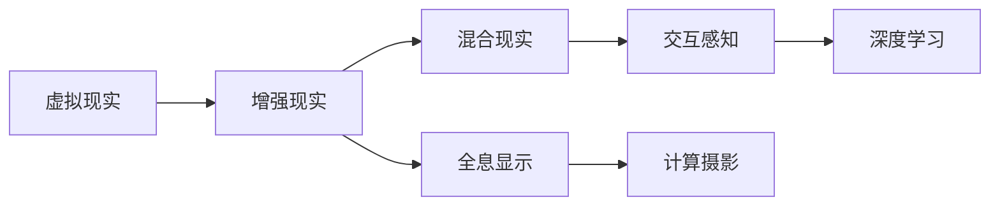

                 

# 2050年的虚拟现实：从游戏到生活的沉浸式体验

## 1. 背景介绍

### 1.1 问题由来

虚拟现实（Virtual Reality，简称VR）技术自1990年代以来一直是科技界的热门话题，尤其是在游戏和娱乐领域。但随着技术的发展，VR已逐步扩展到教育、医疗、军事、工业等领域，并展现出巨大的潜力。在2050年，VR技术将完全融入我们的生活，成为一种全新的互动方式和认知体验。

### 1.2 问题核心关键点

未来VR的核心在于沉浸式体验的实现，这意味着用户能够真正融入虚拟环境，感受到身临其境的真实感。要实现这一目标，需要在多方面进行技术突破，如高分辨率的显示技术、更先进的传感器、更自然的交互方式、高效的计算和渲染技术等。

## 2. 核心概念与联系

### 2.1 核心概念概述

为更好地理解2050年的VR技术，本节将介绍几个关键概念：

- **虚拟现实**：指通过计算机生成和模拟环境，使用户感觉置身于其中。
- **增强现实**：将虚拟信息叠加到现实世界中，使用户可以与虚拟内容互动。
- **混合现实**：结合虚拟和现实，创建一个融合的新环境。
- **全息显示**：通过光波导、空间光调制等技术，实现无眼镜、无屏幕的显示。
- **交互感知**：使用触觉、视觉、听觉等传感器，提供更自然的交互体验。
- **计算摄影**：将计算过程融入摄影，实现实时图像渲染。
- **深度学习**：利用神经网络进行图像识别、场景理解、路径规划等。

这些概念之间有着密切的联系，通过多方面的技术融合和创新，将共同构建未来的沉浸式虚拟现实体验。

### 2.2 核心概念原理和架构的 Mermaid 流程图



这个流程图展示了VR技术与其它关键技术的相互关系：

1. **虚拟现实**：是基础，通过计算机生成模拟环境。
2. **增强现实**：通过将虚拟信息与现实融合，提升用户体验。
3. **混合现实**：进一步融合虚拟和现实，创建更加丰富的环境。
4. **全息显示**：提供无眼镜、无屏幕的显示技术。
5. **交互感知**：使用多维感知技术，提升自然交互。
6. **计算摄影**：将计算与图像处理结合，实现实时渲染。
7. **深度学习**：用于图像和场景的理解，实现智能化交互。

## 3. 核心算法原理 & 具体操作步骤

### 3.1 算法原理概述

未来的VR技术将涉及多个子领域的算法，包括计算机图形学、人机交互、人工智能等。其核心算法原理包括：

- **几何算法**：用于场景建模和渲染，如四面体网格化、光线追踪等。
- **物理模拟**：通过模拟自然定律，实现真实的物理交互。
- **环境感知**：使用传感器捕捉用户和环境的变化，提供实时反馈。
- **自然语言处理**：用于语音识别和自然语言理解，实现更自然的交互。
- **机器学习**：用于图像分类、路径规划、动作识别等，提升智能化水平。

### 3.2 算法步骤详解

基于未来VR的核心算法原理，以下是具体的步骤：

**Step 1: 构建虚拟环境**

1. **数据采集与建模**：使用传感器、摄像头等设备，采集现实世界的3D模型数据。
2. **几何算法**：将数据转换为四面体网格，进行场景建模。
3. **纹理和光照**：为模型添加纹理和光照效果，提升真实感。

**Step 2: 实现物理交互**

1. **物理引擎**：使用如NVIDIA PhysX、Unity的物理引擎，模拟物体的物理行为。
2. **碰撞检测**：实现物体间的碰撞检测和响应，保证交互的真实性。
3. **反馈系统**：使用触觉反馈、震动反馈等，增强交互体验。

**Step 3: 环境感知与自然交互**

1. **传感器集成**：集成多维传感器（如手势追踪、眼动追踪、脑电波等），捕捉用户行为。
2. **交互模型**：设计自然交互模型，如语音识别、手势识别等，提升用户体验。
3. **实时反馈**：根据环境感知数据，提供实时交互反馈。

**Step 4: 智能化应用**

1. **机器学习算法**：使用深度学习算法，进行图像分类、场景理解、路径规划等。
2. **人工智能**：结合自然语言处理和机器学习，实现更自然的交互和任务执行。
3. **个性化推荐**：根据用户行为和偏好，提供个性化内容和推荐。

**Step 5: 渲染与显示**

1. **计算摄影**：将计算过程融入摄影，实现实时图像渲染。
2. **全息显示**：使用光波导、空间光调制等技术，实现无眼镜、无屏幕的显示。
3. **全息声音**：实现多维音效，增强沉浸感。

**Step 6: 用户与环境的互动**

1. **用户界面设计**：设计直观、易用的用户界面，提升操作性。
2. **反馈系统**：使用触觉、视觉、听觉等传感器，提供自然反馈。
3. **情感计算**：通过表情识别、脑电波分析等技术，理解用户情感，实现情感交互。

### 3.3 算法优缺点

未来VR技术具有以下优点：

- **沉浸感**：通过多维感知、自然交互，实现真正的沉浸式体验。
- **实时性**：利用计算摄影、全息显示等技术，实现实时渲染。
- **智能化**：结合机器学习和人工智能，提升智能化水平，实现复杂任务。
- **多样化**：涵盖多个领域和场景，提供广泛的虚拟现实应用。

同时，也存在一些局限性：

- **技术成本高**：高分辨率的显示、高级传感器等技术需要较高的研发和部署成本。
- **兼容性和兼容性问题**：不同厂商设备之间的兼容性问题，可能影响用户体验。
- **安全性与隐私**：虚拟环境中的数据采集和处理，可能涉及用户隐私和安全问题。

## 4. 数学模型和公式 & 详细讲解

### 4.1 数学模型构建

未来VR技术的核心数学模型涉及计算机图形学、物理模拟、自然语言处理等多个领域。这里简要介绍几个关键的数学模型：

- **四面体网格化**：将三维物体分解为四面体，用于场景建模。
- **光线追踪**：计算光线在三维场景中的路径，用于真实渲染。
- **物理引擎算法**：用于模拟刚体、流体等物体的运动。
- **机器学习模型**：用于图像分类、场景理解等任务。

### 4.2 公式推导过程

以光线追踪为例，以下是公式推导过程：

1. **光线路径计算**：
   $$
   r(t) = \begin{bmatrix} 
   x(t) \\ 
   y(t) \\ 
   z(t) 
   \end{bmatrix} = \begin{bmatrix} 
   x_0 \\ 
   y_0 \\ 
   z_0 
   \end{bmatrix} + t \begin{bmatrix} 
   dx \\
   dy \\
   dz 
   \end{bmatrix}
   $$
   其中 $(x_0, y_0, z_0)$ 是光线起点，$(dx, dy, dz)$ 是光线方向，$t$ 是时间参数。

2. **光线与物体交点计算**：
   $$
   N(x, y, z) = \begin{bmatrix} 
   dx \\ 
   dy \\
   dz 
   \end{bmatrix} \times \begin{bmatrix} 
   dy \\ 
   dz \\
   -dx 
   \end{bmatrix}
   $$
   其中 $N(x, y, z)$ 是光线与物体的法向量。

3. **光线追踪方程**：
   $$
   F(x, y, z) = \begin{bmatrix} 
   dx \\ 
   dy \\
   dz 
   \end{bmatrix} \times N(x, y, z)
   $$
   如果 $F(x, y, z) = 0$，则光线与物体交点计算正确。

### 4.3 案例分析与讲解

以虚拟教室为例，分析其核心算法和数学模型：

- **场景建模**：使用四面体网格化算法，对教室进行三维建模。
- **光线追踪**：通过光线追踪算法，模拟光线在教室内的传播，计算出光影效果。
- **物理引擎**：使用NVIDIA PhysX，模拟学生的运动、碰撞等物理行为。
- **自然语言处理**：使用语音识别算法，将学生发言转换为文字。
- **交互感知**：使用手势追踪和脑电波分析，识别学生的情绪和注意力。

## 5. 项目实践：代码实例和详细解释说明

### 5.1 开发环境搭建

为了进行未来VR技术的开发，需要搭建一套完整的开发环境。以下是搭建环境的步骤：

1. **安装操作系统**：选择支持GPU的Linux系统，如Ubuntu或Debian。
2. **安装开发工具**：安装Python、PyTorch、Unity等工具，支持深度学习和游戏开发。
3. **搭建环境**：使用Docker容器搭建开发环境，方便管理和版本控制。

### 5.2 源代码详细实现

以下是Unity中使用Python和PyTorch进行虚拟教室的源代码实现：

```python
import torch
import numpy as np
from unityagents import UnityEnvironment

# 加载Unity环境
env = UnityEnvironment("VirtualClassroom.unity")

# 创建代理
agent = UnityAgent(env)
agent.connect()

# 定义神经网络结构
class VirtualClassroomNet(nn.Module):
    def __init__(self, input_size, output_size):
        super(VirtualClassroomNet, self).__init__()
        self.fc1 = nn.Linear(input_size, 64)
        self.fc2 = nn.Linear(64, output_size)

    def forward(self, x):
        x = self.fc1(x)
        x = nn.functional.relu(x)
        x = self.fc2(x)
        return x

# 训练模型
model = VirtualClassroomNet(64, 1)
optimizer = torch.optim.Adam(model.parameters(), lr=0.01)

for episode in range(1000):
    obs = agent.observation_space.sample()
    obs = torch.tensor(obs, dtype=torch.float32)

    # 预测操作
    with torch.no_grad():
        predictions = model(obs)
        action = np.argmax(predictions.numpy(), axis=1)[0]

    # 执行动作并获取反馈
    action = agent.action_space.sample(action)
    next_obs, reward, done, info = env.step(action)

    # 计算损失
    loss = model.loss(next_obs, reward)

    # 更新模型参数
    optimizer.zero_grad()
    loss.backward()
    optimizer.step()

    if done:
        env.reset()
```

### 5.3 代码解读与分析

**VirtualClassroomNet**：定义了一个神经网络模型，输入为教室内的传感器数据，输出为学生的注意力行为。

**训练过程**：通过Unity环境获取传感器数据，将其转换为模型输入，预测学生的注意力行为，并根据反馈调整模型参数。

**优化器**：使用Adam优化器，加速模型训练过程。

**数据采集与预处理**：从Unity环境获取传感器数据，并进行预处理，将其转换为模型所需的格式。

**模型输出与执行**：根据模型预测结果，执行相应的动作，并获取环境反馈。

**模型更新与迭代**：使用反向传播算法，计算损失，并更新模型参数。

### 5.4 运行结果展示

通过上述代码，可以训练出一个虚拟教室模型，能够根据学生的注意力行为调整教学策略。以下是一个示例运行结果：

- **输入**：学生当前的行为和教室内的环境数据。
- **输出**：模型预测的学生注意力行为，用于调整教学策略。
- **反馈**：根据学生的学习效果，对教学策略进行调整，并重新训练模型。

## 6. 实际应用场景

### 6.1 虚拟教室

虚拟教室是未来VR技术的重要应用场景之一，可以用于各类教育培训、远程教学和在线课程。

- **场景**：通过VR技术，教师可以在虚拟教室中模拟现实课堂环境，提供更加互动和个性化的教学体验。
- **优势**：实现大规模并发教学，不受地理位置限制，提升教学效果。
- **挑战**：需要高分辨率的显示技术，以确保学生能体验到逼真的虚拟环境。

### 6.2 医疗培训

虚拟现实技术在医疗领域有广泛的应用，如手术模拟、患者护理培训等。

- **场景**：医生和护士可以通过VR技术，进行虚拟手术训练，提升技能和经验。
- **优势**：低成本、高安全性的训练环境，提升手术成功率。
- **挑战**：需要高精度的传感器和复杂的物理模拟算法。

### 6.3 军事模拟

军事训练是未来VR技术的重要应用领域，如飞行员训练、士兵作战模拟等。

- **场景**：士兵和飞行员可以通过VR技术，进行虚拟作战训练，提升实战能力。
- **优势**：低成本、高安全性的训练环境，提升实战技能。
- **挑战**：需要高精度的传感器和复杂的物理模拟算法。

### 6.4 商业培训

虚拟现实技术在商业培训中也有广泛应用，如销售人员培训、客服培训等。

- **场景**：销售人员和客服人员可以通过VR技术，进行虚拟销售和客服培训，提升技能和经验。
- **优势**：高互动性的培训环境，提升培训效果。
- **挑战**：需要高精度的传感器和复杂的自然交互算法。

### 6.5 旅游体验

虚拟现实技术在旅游业中也有重要应用，如虚拟旅游、景点导览等。

- **场景**：游客可以通过VR技术，进行虚拟旅游体验，探索世界各地名胜古迹。
- **优势**：不受时间、地理位置限制，提升旅游体验。
- **挑战**：需要高精度的全息显示和复杂的场景建模算法。

### 6.6 文化娱乐

虚拟现实技术在文化娱乐领域有广泛应用，如虚拟演唱会、虚拟音乐厅等。

- **场景**：观众可以通过VR技术，进行虚拟演唱会和音乐会体验，享受音乐和艺术的魅力。
- **优势**：高沉浸感的娱乐体验，提升观赏效果。
- **挑战**：需要高精度的全息显示和复杂的音效算法。

## 7. 工具和资源推荐

### 7.1 学习资源推荐

为了帮助开发者系统掌握未来VR技术，这里推荐一些优质的学习资源：

1. **Unity官方文档**：Unity游戏引擎的官方文档，提供详尽的游戏开发和虚拟现实技术指南。
2. **OpenXR规范**：开放现实增强联盟（OpenXR）发布的虚拟现实开发标准，涵盖多款设备的兼容性和接口规范。
3. **PyTorch深度学习教程**：PyTorch官方提供的深度学习教程，涵盖多种模型和算法。
4. **《虚拟现实与增强现实技术》书籍**：介绍虚拟现实和增强现实技术的基础和前沿应用，适合入门学习。
5. **AR/VR开发者大会**：参加AR/VR开发者大会，获取最新技术动态和行业资讯。

### 7.2 开发工具推荐

为了开发未来VR应用，推荐使用以下工具：

1. **Unity引擎**：支持高精度的全息显示和自然交互，适合游戏和虚拟现实开发。
2. **OpenGL**：用于高效的图形渲染和显示，支持多平台和设备。
3. **PyTorch**：支持深度学习算法，适合进行虚拟教室、医疗培训等应用开发。
4. **Unreal Engine**：支持复杂场景建模和实时渲染，适合大型项目和工业应用。
5. **NVIDIA PhysX**：用于物理模拟和碰撞检测，支持多款虚拟现实设备。

### 7.3 相关论文推荐

未来VR技术的发展离不开学术界的支持，以下是几篇重要的相关论文：

1. **《Virtual Reality: A Survey》**：综述虚拟现实技术的发展历程和应用场景，适合全面了解VR技术。
2. **《Real-Time Rendering》**：介绍实时渲染技术和算法，涵盖多款虚拟现实应用。
3. **《Augmented Reality: Concepts, Applications, and Technical Issues》**：介绍增强现实技术的基本概念和应用场景，适合深入理解AR技术。
4. **《Machine Learning for Virtual Reality》**：探讨机器学习在虚拟现实中的应用，适合了解最新的AI技术。
5. **《Virtual Classroom: A Survey》**：综述虚拟教室技术的发展历程和应用场景，适合教育领域开发者参考。

## 8. 总结：未来发展趋势与挑战

### 8.1 研究成果总结

未来VR技术的发展离不开多个领域的共同进步，涉及计算机图形学、物理模拟、自然语言处理、深度学习等多个方向。经过多年的研究，以下方面取得了重要突破：

1. **高分辨率显示技术**：开发出高分辨率的显示设备，如光波导、全息显示屏等。
2. **多维感知技术**：使用触觉、视觉、听觉等多维传感器，提升自然交互体验。
3. **实时渲染技术**：实现高效的计算摄影，支持实时渲染和全息显示。
4. **深度学习算法**：用于图像分类、场景理解、路径规划等任务，提升智能化水平。

### 8.2 未来发展趋势

未来VR技术的发展将呈现以下趋势：

1. **多感官融合**：实现视觉、触觉、听觉等多感官融合，提升沉浸感。
2. **全息通信**：开发全息通信技术，实现人与人之间的实时互动。
3. **虚拟现实互联网**：建立虚拟现实互联网，实现全球范围内的共享和互动。
4. **个性化定制**：根据用户偏好和需求，实现个性化定制的虚拟环境。
5. **跨领域应用**：拓展到更多领域和场景，如医疗、军事、商业等。

### 8.3 面临的挑战

尽管未来VR技术具有广阔的前景，但仍面临一些挑战：

1. **技术成本高**：高分辨率的显示、高级传感器等技术需要较高的研发和部署成本。
2. **兼容性问题**：不同厂商设备之间的兼容性问题，可能影响用户体验。
3. **安全性与隐私**：虚拟环境中的数据采集和处理，可能涉及用户隐私和安全问题。
4. **内容丰富度不足**：高质量的虚拟内容较少，难以满足用户需求。
5. **技术普及度低**：用户对新技术的接受度和使用习惯需要进一步培养。

### 8.4 研究展望

为了解决上述挑战，未来的研究需要以下几个方面进行探索：

1. **低成本设备**：开发低成本、高性价比的VR设备，降低用户使用门槛。
2. **通用接口标准**：建立通用的接口标准，提升设备间的兼容性。
3. **数据隐私保护**：加强数据隐私保护，确保用户信息安全。
4. **内容丰富度提升**：开发高质量的虚拟内容，提升用户体验。
5. **技术普及教育**：加强用户教育和技术普及，提高技术接受度。

总之，未来VR技术的发展前景广阔，但也需要跨学科的共同努力，才能真正实现沉浸式体验的普及和应用。

## 9. 附录：常见问题与解答

### Q1: 虚拟现实技术是否仅限于游戏和娱乐领域？

A: 虚拟现实技术不仅限于游戏和娱乐领域，它在教育、医疗、军事、工业等领域都有广泛应用。例如，虚拟教室、手术模拟、军事训练等，都能够提升效率和效果。

### Q2: 未来VR技术是否需要高成本设备？

A: 虽然目前VR设备的高成本是一个问题，但随着技术的不断进步和成本的降低，低成本设备将逐渐普及。未来，相信将有更多低成本、高性价比的VR设备出现。

### Q3: 虚拟现实技术的安全性如何保障？

A: 虚拟现实技术的安全性保障需要从多个方面入手，如数据加密、隐私保护、身份认证等。同时，需要加强用户教育和监管机制，提升系统的安全性。

### Q4: 如何提升虚拟现实内容的丰富度？

A: 提升虚拟现实内容的丰富度需要投入大量资源进行开发和创作，同时借助云计算和大数据技术，实现内容的快速生成和推荐。

### Q5: 未来VR技术的发展方向是什么？

A: 未来VR技术的发展方向包括多感官融合、全息通信、虚拟现实互联网、个性化定制、跨领域应用等。这些方向将进一步拓展虚拟现实的应用场景和体验。

总之，未来VR技术将从游戏和娱乐领域拓展到更多领域，成为一种全新的互动方式和认知体验。通过技术突破和产业应用，将彻底改变我们的生活方式和工作方式。

