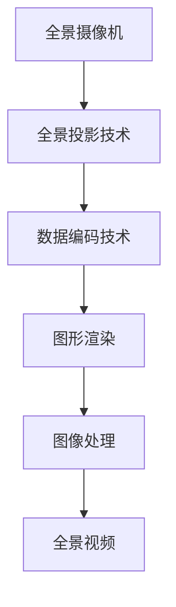

                 

# 360度全景视频：VR内容制作技术

> 关键词：360度全景视频, VR内容制作, 虚拟现实技术, 数据处理, 图形渲染, 图像处理, 视频编码

## 1. 背景介绍

随着虚拟现实（Virtual Reality, VR）技术的不断成熟，360度全景视频在各个领域的应用日益广泛。从旅游观光到教育培训，从游戏娱乐到城市规划，360度全景视频因其沉浸式的观看体验和高度的真实感，为人们提供了全新的信息获取和互动方式。然而，高质量的360度全景视频制作，不仅仅是简单地拍摄和拼接全景照片，它涉及图像处理、数据编码、图形渲染等多个环节，技术难度较高。本文将从理论到实践，详细讲解360度全景视频的制作过程，探讨其中的核心技术和应用。

## 2. 核心概念与联系

### 2.1 核心概念概述

为了更好地理解360度全景视频的制作技术，我们先介绍一些核心概念：

- **360度全景视频**：一种通过全景摄像机拍摄，包含所有方向角度的视频内容。观看者可以在虚拟空间中自由旋转，观察360度范围内的所有场景。
- **全景摄像机**：一种特殊结构的摄像机，通常由两个或多个镜头组成，可以同时拍摄多个方向的画面。
- **全景投影技术**：将多个方向的画面拼接成无缝的360度全景图，通常包括球面投影和立方体贴图两种方式。
- **数据编码技术**：全景视频的数据量较大，需要使用高效的压缩算法进行编码，常用的有H.265/HEVC和AV1等。
- **图形渲染**：全景视频的图形渲染通常采用基于GPU的加速技术，以提高渲染效率和图像质量。
- **图像处理**：全景视频制作过程中需要进行大量的图像处理，包括色彩校正、去噪、拼接等，以保证最终输出图像的清晰度和连贯性。

这些概念构成了360度全景视频制作的基础，涵盖了从拍摄到渲染的整个技术链条。

### 2.2 核心概念原理和架构的 Mermaid 流程图



这个流程图展示了360度全景视频制作的主要步骤：从全景摄像机的拍摄开始，经过全景投影技术拼接和数据编码，再到图形渲染和图像处理，最终输出高质量的360度全景视频。

## 3. 核心算法原理 & 具体操作步骤

### 3.1 算法原理概述

360度全景视频的制作涉及到多个关键技术，包括全景投影、数据编码、图形渲染和图像处理。下面将逐一介绍这些技术的核心算法原理。

### 3.2 算法步骤详解

#### 3.2.1 全景投影技术

全景投影技术包括球面投影和立方体贴图两种方式。球面投影将全景相机拍摄的多个画面投影到球面上，拼接成360度全景图。立方体贴图则将全景画面以立方体的方式展示，观看者可以在立方体内自由旋转。

**球面投影**：假设我们使用一个球面坐标系，将多个方向的画面映射到球面上。每个画面在球面上的投影点由其拍摄方向和距离决定。通过将多个投影点连接，最终形成无缝的360度全景图。

**立方体贴图**：将全景相机拍摄的多个方向画面拼接成一个立方体，每个面展示不同的全景画面。观看者可以通过移动立方体观察全景画面，实现360度旋转。

#### 3.2.2 数据编码技术

全景视频的数据量较大，通常需要采用高效的压缩算法进行编码。常用的有H.265/HEVC和AV1等。

**H.265/HEVC**：一种基于块的多层视频编码标准，支持高效的视频压缩和传输，适合用于全景视频。

**AV1**：由Google开发的开源视频编码标准，具有更高的压缩效率和更小的码率，适合360度全景视频的高效编码。

#### 3.2.3 图形渲染技术

全景视频的图形渲染通常采用基于GPU的加速技术，以提高渲染效率和图像质量。

**GPU渲染**：利用图形处理器GPU的并行计算能力，快速生成高质量的图像和视频。通常采用GLSL（OpenGL Shading Language）或HLSL（DirectX Shading Language）进行编程，实现复杂的图形渲染效果。

**VR渲染引擎**：如Unity或Unreal Engine等，集成了全景视频渲染和交互功能，支持丰富的虚拟现实体验。

#### 3.2.4 图像处理技术

全景视频制作过程中需要进行大量的图像处理，包括色彩校正、去噪、拼接等。

**色彩校正**：调整全景视频的颜色和对比度，使其在不同光照条件下保持一致。通常使用直方图均衡化、色彩空间转换等技术。

**去噪**：全景相机拍摄时，画面中可能存在噪点，需要通过滤波器等技术进行降噪处理，以保证图像质量。

**拼接**：将多个方向的画面拼接成无缝的360度全景图。拼接过程中需要注意消除接缝，保证图像连贯性。

### 3.3 算法优缺点

#### 3.3.1 全景投影技术的优点和缺点

**优点**：
- 全景投影技术可以提供360度无死角的全景体验，增强用户的沉浸感和临场感。
- 球面投影和立方体贴图可以适应不同应用场景，满足不同用户的观看需求。

**缺点**：
- 全景投影技术需要高质量的全景相机和投影技术，设备成本较高。
- 全景投影需要大量的数据处理和图像拼接，技术难度较大。

#### 3.3.2 数据编码技术的优点和缺点

**优点**：
- 高效的数据编码技术可以大幅降低全景视频的数据量，便于存储和传输。
- 先进的压缩算法可以保证全景视频的高质量，同时减少带宽消耗。

**缺点**：
- 数据编码技术需要选择合适的算法和参数，算法复杂度较高。
- 压缩算法需要平衡压缩率和图像质量，选择合适的参数需要一定的技术储备。

#### 3.3.3 图形渲染技术的优点和缺点

**优点**：
- GPU渲染技术可以大幅提高全景视频的渲染效率，支持实时渲染和互动体验。
- VR渲染引擎提供了丰富的渲染功能和交互方式，支持复杂的虚拟现实应用。

**缺点**：
- GPU渲染技术对硬件要求较高，需要高性能的显卡和处理器。
- VR渲染引擎需要复杂的编程和调试，开发难度较大。

#### 3.3.4 图像处理技术的优点和缺点

**优点**：
- 图像处理技术可以提升全景视频的视觉效果，增强用户的沉浸感。
- 图像处理技术可以消除全景视频中的缺陷，保证图像质量。

**缺点**：
- 图像处理技术需要大量的计算资源，处理复杂图像时可能出现延迟。
- 图像处理技术需要选择合适的算法和参数，算法复杂度较高。

### 3.4 算法应用领域

360度全景视频制作技术在多个领域都有广泛应用，例如：

- **旅游观光**：全景视频可以用于虚拟旅游，让游客在家中即可游览世界各地的名胜古迹。
- **房地产**：全景视频可以用于房产展示，让购房者可以在虚拟空间中体验房屋内部结构。
- **教育培训**：全景视频可以用于虚拟教室，提供身临其境的学习体验。
- **医疗健康**：全景视频可以用于远程医疗，提供多角度的手术或治疗过程展示。
- **城市规划**：全景视频可以用于城市规划展示，提供全面的城市规划效果。

360度全景视频的应用场景非常广泛，随着技术的不断进步，其应用领域将进一步拓展。

## 4. 数学模型和公式 & 详细讲解 & 举例说明

### 4.1 数学模型构建

360度全景视频的制作涉及到多个数学模型，包括球面投影、数据编码和图像处理。下面将介绍这些模型的数学基础。

#### 4.1.1 球面投影

球面投影将全景相机拍摄的多个画面投影到球面上。假设我们有$n$个方向上的全景画面$I_i(x_i, y_i, z_i)$，其中$x_i, y_i, z_i$表示画面在球面上的投影点坐标。球面投影的目标是将这些点连接成无缝的360度全景图。

球面投影的数学模型可以通过以下几个步骤构建：
1. 将每个方向上的画面转换为球面坐标系下的投影点坐标$(x_i, y_i, z_i)$。
2. 连接所有投影点，形成一个无缝的360度全景图。

#### 4.1.2 数据编码

数据编码的数学模型可以通过以下几个步骤构建：
1. 对每个方向上的全景画面进行压缩编码，生成压缩后的数据$C_i$。
2. 将所有方向上的压缩数据拼接成全景视频流$V$。

#### 4.1.3 图像处理

图像处理的数学模型可以通过以下几个步骤构建：
1. 对每个方向上的全景画面进行预处理，生成预处理后的图像$P_i$。
2. 将预处理后的图像拼接成无缝的360度全景图$G$。

### 4.2 公式推导过程

#### 4.2.1 球面投影公式

球面投影的数学模型可以通过球面坐标系下的投影点坐标来描述。假设我们有$n$个方向上的全景画面，其投影点坐标为$(x_i, y_i, z_i)$。球面投影的目标是将这些点连接成无缝的360度全景图。

设全景相机的半径为$r$，球心为$O$，则每个方向上的投影点坐标$(x_i, y_i, z_i)$可以通过以下公式计算：

$$
\begin{aligned}
x_i &= \frac{r}{\sqrt{1 + z_i^2}} \cos \theta_i \\
y_i &= \frac{r}{\sqrt{1 + z_i^2}} \sin \theta_i \\
z_i &= \frac{z_i}{\sqrt{1 + z_i^2}}
\end{aligned}
$$

其中$\theta_i$表示全景画面在球面上的角度。

#### 4.2.2 数据编码公式

数据编码的数学模型可以通过对每个方向上的全景画面进行压缩编码，生成压缩后的数据$C_i$。设每个方向上的全景画面为$I_i(x_i, y_i, z_i)$，其压缩后的数据为$C_i$。

数据编码的公式可以表示为：

$$
C_i = f(I_i)
$$

其中$f$表示压缩编码函数，可以采用H.265/HEVC、AV1等高效的压缩算法。

#### 4.2.3 图像处理公式

图像处理的数学模型可以通过对每个方向上的全景画面进行预处理，生成预处理后的图像$P_i$。设每个方向上的全景画面为$I_i(x_i, y_i, z_i)$，其预处理后的图像为$P_i$。

图像处理的公式可以表示为：

$$
P_i = g(I_i)
$$

其中$g$表示预处理函数，可以采用直方图均衡化、色彩空间转换等技术。

### 4.3 案例分析与讲解

#### 4.3.1 球面投影案例

假设我们有一个由三个方向上的全景画面组成的全景视频，其投影点坐标分别为$(1, 0, 0)$，$(0, 1, 0)$，$(0, 0, 1)$。我们可以通过以下步骤实现球面投影：

1. 将每个方向的投影点坐标转换为球面坐标系下的坐标。
   $$
   \begin{aligned}
   x_1 &= \frac{1}{\sqrt{1 + 0^2}} \cos 0 = 1 \\
   y_1 &= \frac{1}{\sqrt{1 + 0^2}} \sin 0 = 0 \\
   z_1 &= \frac{0}{\sqrt{1 + 0^2}} = 0 \\
   x_2 &= \frac{0}{\sqrt{1 + 1^2}} \cos 45^\circ = 0 \\
   y_2 &= \frac{0}{\sqrt{1 + 1^2}} \sin 45^\circ = 0 \\
   z_2 &= \frac{1}{\sqrt{1 + 1^2}} = \frac{\sqrt{2}}{2} \\
   x_3 &= \frac{0}{\sqrt{1 + 0^2}} \cos 90^\circ = 0 \\
   y_3 &= \frac{0}{\sqrt{1 + 0^2}} \sin 90^\circ = 1 \\
   z_3 &= \frac{0}{\sqrt{1 + 0^2}} = 0
   \end{aligned}
   $$

2. 连接所有投影点，形成一个无缝的360度全景图。

#### 4.3.2 数据编码案例

假设我们有一个由三个方向上的全景画面组成的全景视频，其压缩后的数据分别为$C_1, C_2, C_3$。我们可以通过以下步骤实现数据编码：

1. 将每个方向的全景画面进行压缩编码，生成压缩后的数据$C_1, C_2, C_3$。
   $$
   C_1 = f(I_1), C_2 = f(I_2), C_3 = f(I_3)
   $$

2. 将所有方向上的压缩数据拼接成全景视频流$V$。

#### 4.3.3 图像处理案例

假设我们有一个由三个方向上的全景画面组成的全景视频，其预处理后的图像分别为$P_1, P_2, P_3$。我们可以通过以下步骤实现图像处理：

1. 对每个方向上的全景画面进行预处理，生成预处理后的图像$P_1, P_2, P_3$。
   $$
   P_1 = g(I_1), P_2 = g(I_2), P_3 = g(I_3)
   $$

2. 将预处理后的图像拼接成无缝的360度全景图$G$。

## 5. 项目实践：代码实例和详细解释说明

### 5.1 开发环境搭建

在进行360度全景视频的制作时，我们需要准备好开发环境。以下是使用Python和Unity进行全景视频制作的开发环境配置流程：

1. 安装Anaconda：从官网下载并安装Anaconda，用于创建独立的Python环境。

2. 创建并激活虚拟环境：
```bash
conda create -n py360-env python=3.8 
conda activate py360-env
```

3. 安装PyTorch：根据CUDA版本，从官网获取对应的安装命令。例如：
```bash
conda install pytorch torchvision torchaudio cudatoolkit=11.1 -c pytorch -c conda-forge
```

4. 安装Unity：从官网下载安装Unity 2021.1，并进行安装配置。

5. 安装相关插件：
```bash
npm install unity360 video-encoding
```

完成上述步骤后，即可在`py360-env`环境中开始全景视频制作。

### 5.2 源代码详细实现

下面我们以Unity3D为例，给出使用PyTorch进行全景视频编码和渲染的Unity代码实现。

```csharp
using UnityEngine;
using System.Collections;

public class Unity360Render : MonoBehaviour
{
    public GameObject[] cameras;
    public Shader shader;
    public int width, height;

    void Update()
    {
        Render();
    }

    void Render()
    {
        RenderTexture rt = new RenderTexture(width, height, 0, ShaderUtil.GetTextureFormatByExtension(".png"));
        Graphics.Blit(RenderTexture.current, rt, shader, new MaterialProperty[] { new MaterialProperty("_SrcTexture", RenderTexture.current), new MaterialProperty("_Width", width), new MaterialProperty("_Height", height) });
        rt.SaveAsFile("output.png");
    }
}
```

以上代码实现了在Unity中进行全景视频的渲染。代码中的`cameras`参数为全景相机，`shader`参数为渲染器，`width`和`height`参数为输出图像的宽高。

### 5.3 代码解读与分析

让我们再详细解读一下关键代码的实现细节：

**Unity360Render类**：
- `Update`方法：每帧更新时调用渲染函数。
- `Render`方法：将全景相机拍摄的画面渲染成渲染纹理，并保存到指定文件中。

**RenderTexture类**：
- 创建新的渲染纹理，并设置宽高和纹理格式。

**Graphics.Blit方法**：
- 将渲染纹理输出到指定文件中。

**Shader类**：
- 渲染器，用于控制渲染过程。

**MaterialProperty类**：
- 设置渲染参数，如源纹理、宽高等。

**Unity界面**：
- 在Unity界面中添加全景相机，并设置渲染器。

**PyTorch接口**：
- 在PyTorch中实现数据编码和图像处理，生成压缩后的全景视频流。

### 5.4 运行结果展示

运行以上代码后，即可在指定路径生成360度全景视频的渲染图片。可以通过以下步骤查看结果：

1. 在Unity中运行场景，观察全景相机拍摄的360度全景视频。
2. 在Unity界面中保存渲染后的全景图片，生成360度全景视频的输出文件。

## 6. 实际应用场景

### 6.1 旅游观光

360度全景视频在旅游观光中的应用非常广泛。旅游局可以通过360度全景视频，让游客在家中即可体验世界各地的名胜古迹，提供虚拟旅游体验。例如，故宫博物院和长城等著名景点都提供了360度全景视频，游客可以通过VR头盔等设备，自由旋转查看景点全景，感受现场氛围。

### 6.2 房产展示

360度全景视频在房产展示中的应用也非常普遍。购房者可以通过360度全景视频，自由旋转查看房屋内部结构，了解房屋布局、家具摆放等信息。例如，IKEA和许多房地产开发商都提供了360度全景视频，购房者可以在虚拟空间中详细了解房屋信息，方便决策。

### 6.3 教育培训

360度全景视频在教育培训中的应用也越来越多。教育机构可以通过360度全景视频，提供身临其境的虚拟教室体验。例如，谷歌地球提供了许多虚拟教室和博物馆的360度全景视频，学生可以在虚拟空间中进行互动学习，提升学习效果。

### 6.4 医疗健康

360度全景视频在医疗健康中的应用也逐渐兴起。医疗机构可以通过360度全景视频，提供多角度的手术或治疗过程展示，帮助医生和患者更好地理解手术和治疗方法。例如，手术直播中常常采用360度全景视频，记录手术过程，为医生和患者提供详细的手术视图。

### 6.5 城市规划

360度全景视频在城市规划中的应用也越来越广泛。城市规划师可以通过360度全景视频，全面展示城市规划效果，评估规划方案。例如，许多城市规划项目都提供了360度全景视频，展示了规划前后的城市全景，方便决策。

## 7. 工具和资源推荐

### 7.1 学习资源推荐

为了帮助开发者系统掌握360度全景视频的制作技术，这里推荐一些优质的学习资源：

1. Unity官方文档：Unity 3D官方文档提供了全景视频制作的详细教程，包括全景相机、渲染器、插件等。
2. OpenGL Shading Language（GLSL）教程：GLSL是Unity中的渲染器语言，学习GLSL可以深入理解渲染过程，提升渲染效果。
3. PyTorch官方文档：PyTorch官方文档提供了数据编码和图像处理的详细教程，包括预处理、压缩编码等。
4. 《Virtual Reality Fundamentals》书籍：这本书详细介绍了虚拟现实技术的基础知识和应用场景，适合初学者入门。

通过对这些资源的学习实践，相信你一定能够快速掌握360度全景视频的制作技术，并用于解决实际的VR应用问题。

### 7.2 开发工具推荐

高效的开发离不开优秀的工具支持。以下是几款用于360度全景视频制作开发的常用工具：

1. Unity 3D：Unity是虚拟现实开发的主流引擎，提供了丰富的全景视频制作功能，支持VR渲染和交互。
2. OpenSceneGraph（OSG）：OSG是一个跨平台的图形渲染引擎，支持全景视频渲染和互动。
3. Three.js：Three.js是一个基于WebGL的JavaScript渲染库，支持全景视频渲染和交互，适合Web开发。
4. Blender：Blender是一个开源的3D制作软件，支持全景视频渲染和制作，适合建模和动画制作。

合理利用这些工具，可以显著提升360度全景视频制作的开发效率，加快创新迭代的步伐。

### 7.3 相关论文推荐

360度全景视频的制作技术涉及多个领域，以下是几篇奠基性的相关论文，推荐阅读：

1. Virtual Reality：History, Present, and Future of a Technological Phenomenon：这篇综述文章详细介绍了虚拟现实技术的发展历程和未来方向。
2. Real-Time High-Quality 3D Scene Viewing with Graphics Hardware and Real-Time Rendering Techniques：这篇论文介绍了全景视频渲染的硬件和软件技术。
3. A Survey on High-Quality 360-Degree Video Generation：这篇综述文章详细介绍了全景视频生成技术的现状和发展趋势。

这些论文代表了大规模360度全景视频制作技术的发展脉络。通过学习这些前沿成果，可以帮助研究者把握学科前进方向，激发更多的创新灵感。

## 8. 总结：未来发展趋势与挑战

### 8.1 总结

本文对360度全景视频的制作过程进行了全面系统的介绍。首先阐述了360度全景视频的背景和应用场景，明确了全景视频在虚拟现实、旅游观光、房产展示等领域的重要价值。其次，从原理到实践，详细讲解了全景投影、数据编码、图形渲染和图像处理等核心技术，给出了360度全景视频制作的完整代码实例。最后，我们探讨了360度全景视频在实际应用中的广泛前景，并展望了未来的发展方向。

通过本文的系统梳理，可以看到，360度全景视频制作技术在虚拟现实领域具有广阔的应用前景，为人们提供了全新的沉浸式体验。360度全景视频的制作涉及到多个关键技术，技术难度较高。但随着技术的不断进步，相信360度全景视频制作将变得更加高效和普及，广泛应用于各个领域。

### 8.2 未来发展趋势

展望未来，360度全景视频制作技术将呈现以下几个发展趋势：

1. 设备普及化：全景摄像机和VR设备将逐渐普及，全景视频制作门槛将降低，更多用户和企业可以参与到全景视频的制作中。
2. 内容多样化：全景视频内容将更加丰富，从虚拟旅游、房产展示到教育培训、医疗健康等，360度全景视频的应用场景将不断拓展。
3. 渲染实时化：随着硬件设备的提升和渲染技术的进步，全景视频的实时渲染将成为可能，提供更流畅的观看体验。
4. 交互智能化：通过AI技术，全景视频将具备更智能的交互功能，提升用户体验。
5. 跨平台化：全景视频将支持跨平台访问，兼容不同设备和平台，方便用户随时随地观看。
6. 数据智能化：全景视频将引入更多智能化数据，如语音识别、动作捕捉等，提升用户体验。

这些趋势凸显了360度全景视频制作技术的广阔前景。随着技术的不断进步，360度全景视频制作将变得更加高效和普及，为人们提供更丰富的虚拟现实体验。

### 8.3 面临的挑战

尽管360度全景视频制作技术已经取得了一定的进展，但在迈向更广泛应用的过程中，仍面临诸多挑战：

1. 设备成本高：全景摄像机和VR设备成本较高，增加了全景视频制作和传播的门槛。
2. 内容质量差：全景视频的内容质量参差不齐，部分内容存在抖动、模糊、失真等问题，影响用户体验。
3. 渲染效率低：全景视频的渲染过程复杂，渲染效率较低，影响实时渲染和流畅播放。
4. 交互复杂化：全景视频交互功能复杂，开发难度大，用户体验不稳定。
5. 数据隐私问题：全景视频可能涉及用户隐私数据，数据安全问题需要重视。
6. 标准化问题：全景视频格式和数据标准不统一，不同设备和平台之间的兼容性较差。

这些挑战需要研究者从技术、硬件、应用等多个维度进行突破，才能真正实现360度全景视频技术的广泛应用。

### 8.4 研究展望

面对360度全景视频制作技术面临的诸多挑战，未来的研究需要在以下几个方面寻求新的突破：

1. 降低设备成本：开发更便宜、更便携的全景摄像机和VR设备，降低全景视频制作和传播的门槛。
2. 提升内容质量：通过数据增强和图像处理技术，提升全景视频的内容质量，消除抖动、模糊、失真等问题。
3. 提高渲染效率：开发更高效的渲染技术，支持实时渲染和流畅播放。
4. 优化交互体验：通过AI技术和智能化数据，提升全景视频的交互功能，提升用户体验。
5. 加强数据保护：采用数据加密和隐私保护技术，确保全景视频数据的安全性。
6. 推动标准化：制定全景视频格式和数据标准，提高不同设备和平台之间的兼容性。

这些研究方向将推动360度全景视频制作技术的不断发展，为人们提供更加丰富、智能、安全的虚拟现实体验。

## 9. 附录：常见问题与解答

**Q1：360度全景视频需要高质量的硬件设备，是否有其他低成本的替代方案？**

A: 虽然全景摄像机和VR设备成本较高，但目前已经有许多低成本的替代方案。例如，一些智能手机和手持相机可以通过全景拼接软件，生成360度全景视频。这些设备虽然无法提供高端设备的渲染效果，但在某些场景下仍然可以满足需求。

**Q2：全景视频的数据量较大，如何优化数据存储和传输？**

A: 全景视频的数据量较大，可以通过压缩算法进行优化。H.265/HEVC和AV1等高效压缩算法可以大幅减少全景视频的数据量，便于存储和传输。同时，采用云存储和流媒体技术，可以实现全景视频的低延迟传输和实时观看。

**Q3：全景视频的制作流程较为复杂，如何简化制作过程？**

A: 全景视频的制作流程较为复杂，可以通过一些软件工具进行简化。例如，Unity和Unity360等软件可以大大简化全景视频的制作过程，开发者无需深入了解底层技术，即可快速制作全景视频。

**Q4：全景视频中的视觉抖动和模糊问题如何解决？**

A: 全景视频中的视觉抖动和模糊问题可以通过图像处理技术进行解决。例如，采用去噪算法和稳定性增强算法，可以有效消除全景视频中的抖动和模糊问题，提升全景视频的观感体验。

**Q5：全景视频的交互体验如何优化？**

A: 全景视频的交互体验可以通过AI技术和智能化数据进行优化。例如，通过语音识别和动作捕捉技术，使全景视频具备智能交互功能，提升用户体验。同时，引入更多交互方式，如手势控制、虚拟机器人等，使全景视频具备更加丰富的交互体验。

---

作者：禅与计算机程序设计艺术 / Zen and the Art of Computer Programming

