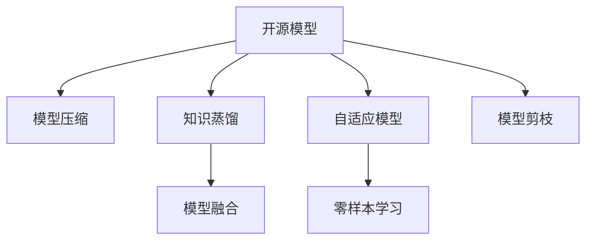

                 

# 开源模型的发展：贾扬清的观点，创新与定制化优势助力发展

## 1. 背景介绍

### 1.1 问题由来
随着深度学习技术的发展，开源模型在学术界和工业界得到了广泛的应用。这些模型由研究机构或大型企业发布，涵盖图像识别、自然语言处理、语音识别等多个领域，提供了高效、稳定、可复现的深度学习解决方案。开源模型极大地推动了人工智能技术的普及和落地。

然而，开源模型也面临着一些挑战，如模型效果受限于原始设计，难以灵活适配特定场景，且可能存在性能瓶颈等问题。因此，如何进一步优化开源模型，提升其在不同场景下的性能，成为当前研究的热点。

### 1.2 问题核心关键点
本文聚焦于开源模型的优化与定制化改造。作者贾扬清作为深度学习领域的权威，结合自身研究和业界经验，提出了一系列基于创新和定制化的方法，以助力开源模型的发展。这些方法包括模型压缩、知识蒸馏、模型融合等，旨在提升模型性能、降低计算成本，并在特定场景中发挥更好的效果。

## 2. 核心概念与联系

### 2.1 核心概念概述

为更好地理解开源模型定制化改造的方法，本节将介绍几个密切相关的核心概念：

- 开源模型(Open Source Model)：由第三方发布并公开源代码的深度学习模型，如TensorFlow、PyTorch中的预训练模型。
- 模型压缩(Model Compression)：通过减少模型参数量、优化模型结构等方法，在不降低性能的情况下提升模型推理速度和计算效率。
- 知识蒸馏(Knowledge Distillation)：通过教师模型指导学生模型学习，将大模型的知识转移至小模型，提高模型泛化能力。
- 模型融合(Model Fusion)：将多个模型的输出结果进行组合，产生优于单一模型的性能。
- 自适应模型(Adaptive Model)：根据特定任务的数据特性和计算资源，动态调整模型结构和参数，以获得最优性能。
- 零样本学习(Zero-shot Learning)：模型在没有任何特定任务数据的情况下，仅通过任务描述就能完成推理。
- 模型剪枝(Pruning)：通过去除冗余参数和低权重层，优化模型结构，提升推理速度。

这些核心概念之间的逻辑关系可以通过以下Mermaid流程图来展示：



这个流程图展示开源模型的核心概念及其之间的关系：

1. 开源模型通过预训练获得基础能力。
2. 模型压缩和知识蒸馏优化模型性能，提升计算效率。
3. 模型融合和自适应模型根据任务特性进行调整。
4. 零样本学习探索模型无需标注数据的应用，扩展模型应用边界。
5. 模型剪枝优化模型结构，提高推理速度。

这些概念共同构成了开源模型的学习框架，使其能够在各种场景下发挥作用。通过理解这些核心概念，我们可以更好地把握开源模型的工作原理和优化方向。

## 3. 核心算法原理 & 具体操作步骤
### 3.1 算法原理概述

开源模型的定制化改造，本质上是通过一系列数据、模型和算法优化手段，使模型更好地适应特定任务和应用场景。其核心思想是：

1. 识别出模型在特定场景中的性能瓶颈和优劣特性。
2. 通过模型压缩、知识蒸馏、自适应模型设计等手段，优化模型结构，减少计算资源消耗，提升推理速度。
3. 根据任务特性和需求，动态调整模型参数和结构，以获得最优性能。

具体而言，以下方法可被用来进一步提升开源模型的性能：

1. 模型压缩和剪枝：通过去除冗余参数和低权重层，优化模型结构，提高推理速度。
2. 知识蒸馏：通过教师模型指导学生模型学习，将大模型的知识转移至小模型，提升模型泛化能力。
3. 自适应模型设计：根据特定任务的数据特性和计算资源，动态调整模型结构和参数，以获得最优性能。
4. 模型融合：将多个模型的输出结果进行组合，产生优于单一模型的性能。
5. 零样本学习：模型在没有任何特定任务数据的情况下，仅通过任务描述就能完成推理。

### 3.2 算法步骤详解

基于开源模型的定制化改造，一般包括以下几个关键步骤：

**Step 1: 识别模型瓶颈**
- 通过评估模型在不同任务上的性能，确定模型在特定场景中的性能瓶颈。
- 使用工具如TensorBoard、ModelScope等，分析模型在训练、推理过程中的资源消耗情况。
- 识别出模型中冗余参数和低权重层。

**Step 2: 模型压缩与剪枝**
- 使用模型剪枝技术，去除冗余参数和低权重层，优化模型结构。
- 针对剪枝后模型的性能，调整网络结构，如卷积核大小、池化层数等。
- 在剪枝后模型上应用模型压缩技术，如权值共享、卷积核分立等。

**Step 3: 知识蒸馏**
- 选择教师模型，该模型在特定任务上表现优秀。
- 使用知识蒸馏技术，将教师模型的知识转移至学生模型。
- 在学生模型上微调，以进一步提升模型性能。

**Step 4: 自适应模型设计**
- 根据特定任务的数据特性和计算资源，设计适合的模型结构。
- 动态调整模型参数，如学习率、激活函数、批量大小等。
- 应用自适应模型设计技术，如混合精度训练、学习率调度等。

**Step 5: 模型融合**
- 选择合适的模型进行组合，如浅层和深层模型、不同尺度模型等。
- 将组合后模型的输出进行融合，产生优于单一模型的性能。
- 使用融合技术如简单平均、加权平均、集成学习等。

**Step 6: 零样本学习**
- 构建任务描述模板，定义输入数据格式。
- 将任务描述输入模型，通过零样本学习预测输出。
- 评估模型在零样本情况下的性能，不断优化模型结构和参数。

以上是开源模型定制化改造的一般流程。在实际应用中，还需要针对具体任务的特点，对定制化过程的各个环节进行优化设计，如改进训练目标函数，引入更多的正则化技术，搜索最优的超参数组合等，以进一步提升模型性能。

### 3.3 算法优缺点

开源模型的定制化改造方法具有以下优点：

1. 提升性能：通过模型压缩、知识蒸馏、自适应模型设计等手段，提升模型在特定场景下的推理速度和泛化能力。
2. 降低计算成本：优化模型结构，减少计算资源消耗，降低推理和训练的硬件成本。
3. 灵活适配：根据任务需求动态调整模型结构和参数，灵活适配不同场景。
4. 开放协作：开源模型可自由定制和扩展，推动社区合作和创新。

同时，该方法也存在一定的局限性：

1. 性能风险：自定义模型结构可能导致性能下降。
2. 依赖数据：模型的定制化改造效果依赖于特定场景下的数据。
3. 时间成本：模型压缩和剪枝过程耗时较长，需要大量计算资源。
4. 算法复杂：自适应模型设计涉及复杂的超参数调整，需要专业知识。

尽管存在这些局限性，但就目前而言，开源模型的定制化改造方法仍是大模型应用的最主流范式。未来相关研究的重点在于如何进一步降低定制化改造对时间和资源的依赖，提高模型的少样本学习和跨领域迁移能力，同时兼顾可解释性和伦理安全性等因素。

### 3.4 算法应用领域

开源模型的定制化改造方法，在深度学习领域已经得到了广泛的应用，覆盖了多个领域，例如：

- 计算机视觉：如图像分类、目标检测、人脸识别等。通过压缩和剪枝优化模型结构，提高推理速度。
- 自然语言处理：如文本分类、机器翻译、问答系统等。通过知识蒸馏和自适应模型设计，提升模型在特定任务上的性能。
- 语音识别：如语音转文字、语音合成等。通过模型压缩和融合，提升模型实时性和准确性。
- 推荐系统：如商品推荐、内容推荐等。通过自适应模型设计和知识蒸馏，提升推荐效果和用户满意度。

除了上述这些经典应用外，开源模型定制化改造还被创新性地应用于智能驾驶、智能医疗、智能制造等多个领域，为各行各业提供了高效、稳定、可定制的深度学习解决方案。

## 4. 数学模型和公式 & 详细讲解 & 举例说明（备注：数学公式请使用latex格式，latex嵌入文中独立段落使用 $$，段落内使用 $)
### 4.1 数学模型构建

本节将使用数学语言对开源模型的定制化改造过程进行更加严格的刻画。

记开源模型为 $M_{\theta}:\mathcal{X} \rightarrow \mathcal{Y}$，其中 $\mathcal{X}$ 为输入空间，$\mathcal{Y}$ 为输出空间，$\theta \in \mathbb{R}^d$ 为模型参数。假设特定任务 $T$ 的训练集为 $D=\{(x_i,y_i)\}_{i=1}^N, x_i \in \mathcal{X}, y_i \in \mathcal{Y}$。

定义模型 $M_{\theta}$ 在输入 $x$ 上的损失函数为 $\ell(M_{\theta}(x),y)$，则在数据集 $D$ 上的经验风险为：

$$
\mathcal{L}(\theta) = \frac{1}{N} \sum_{i=1}^N \ell(M_{\theta}(x_i),y_i)
$$

通过梯度下降等优化算法，模型不断更新参数 $\theta$，最小化损失函数 $\mathcal{L}$，使得模型输出逼近真实标签。

### 4.2 公式推导过程

以下我们以图像分类任务为例，推导模型压缩和知识蒸馏的数学原理。

假设模型 $M_{\theta}$ 在输入 $x$ 上的输出为 $\hat{y}=M_{\theta}(x) \in [0,1]$，表示样本属于类 $c$ 的概率。真实标签 $y \in \{1,0\}$。则二分类交叉熵损失函数定义为：

$$
\ell(M_{\theta}(x),y) = -[y\log \hat{y} + (1-y)\log(1-\hat{y})]
$$

将其代入经验风险公式，得：

$$
\mathcal{L}(\theta) = -\frac{1}{N}\sum_{i=1}^N [y_i\log M_{\theta}(x_i)+(1-y_i)\log(1-M_{\theta}(x_i))]
$$

在优化过程中，可以引入模型压缩和知识蒸馏技术，进一步提升模型性能。例如，使用知识蒸馏方法将大模型的知识传递至小模型，使得小模型在特定任务上表现更好。

假设教师模型 $M_{\theta_{t}}$ 在输入 $x$ 上的输出为 $\hat{y}_{t}=M_{\theta_{t}}(x) \in [0,1]$，表示样本属于类 $c$ 的概率。教师模型的损失函数为 $\mathcal{L}_t(\theta_{t})$。

知识蒸馏过程的目标是使得学生模型 $M_{\theta_s}$ 在特定任务上的表现逼近教师模型。可以定义蒸馏损失函数为：

$$
\mathcal{L}_{\text{distill}}(\theta_{s}, \theta_{t}) = \mathcal{L}(\theta_{s}) + \lambda\mathcal{L}_t(\theta_{t})
$$

其中 $\lambda$ 为蒸馏系数，用于平衡蒸馏和原任务的损失。通过优化蒸馏损失函数，学生模型 $M_{\theta_s}$ 在特定任务上表现提升，同时保留了部分教师模型的知识。

## 5. 项目实践：代码实例和详细解释说明
### 5.1 开发环境搭建

在进行开源模型定制化改造实践前，我们需要准备好开发环境。以下是使用Python进行PyTorch开发的环境配置流程：

1. 安装Anaconda：从官网下载并安装Anaconda，用于创建独立的Python环境。

2. 创建并激活虚拟环境：
```bash
conda create -n pytorch-env python=3.8 
conda activate pytorch-env
```

3. 安装PyTorch：根据CUDA版本，从官网获取对应的安装命令。例如：
```bash
conda install pytorch torchvision torchaudio cudatoolkit=11.1 -c pytorch -c conda-forge
```

4. 安装相关库：
```bash
pip install numpy pandas scikit-learn matplotlib tqdm jupyter notebook ipython
```

完成上述步骤后，即可在`pytorch-env`环境中开始定制化改造实践。

### 5.2 源代码详细实现

下面我以知识蒸馏为例，给出使用PyTorch进行图像分类任务的知识蒸馏代码实现。

首先，定义教师模型和学生模型：

```python
import torch
import torch.nn as nn
import torch.nn.functional as F
from torchvision.models import resnet18

# 定义教师模型
teacher_model = resnet18(pretrained=True)

# 定义学生模型
student_model = nn.Sequential(
    nn.Conv2d(3, 64, kernel_size=3, stride=1, padding=1),
    nn.BatchNorm2d(64),
    nn.ReLU(),
    nn.MaxPool2d(kernel_size=2, stride=2),
    nn.Conv2d(64, 128, kernel_size=3, stride=1, padding=1),
    nn.BatchNorm2d(128),
    nn.ReLU(),
    nn.MaxPool2d(kernel_size=2, stride=2),
    nn.Conv2d(128, 256, kernel_size=3, stride=1, padding=1),
    nn.BatchNorm2d(256),
    nn.ReLU(),
    nn.MaxPool2d(kernel_size=2, stride=2),
    nn.Conv2d(256, 512, kernel_size=3, stride=1, padding=1),
    nn.BatchNorm2d(512),
    nn.ReLU(),
    nn.MaxPool2d(kernel_size=2, stride=2),
    nn.Conv2d(512, 512, kernel_size=3, stride=1, padding=1),
    nn.BatchNorm2d(512),
    nn.ReLU(),
    nn.MaxPool2d(kernel_size=2, stride=2),
    nn.Flatten(),
    nn.Linear(2048, 10)
)
```

然后，定义知识蒸馏过程：

```python
# 定义蒸馏损失函数
def distill_loss(student, teacher):
    student_output = student(x)
    teacher_output = teacher(x)
    softmax_student = F.softmax(student_output, dim=1)
    softmax_teacher = F.softmax(teacher_output, dim=1)
    distill_loss = torch.mean((student_output - teacher_output)**2)
    return distill_loss

# 定义微调过程
optimizer = torch.optim.Adam(student_model.parameters(), lr=0.001)
criterion = nn.CrossEntropyLoss()
teacher_loss = teacher_model.loss_function
teacher_loss_weight = 0.5

# 蒸馏训练循环
for epoch in range(20):
    train_loss = 0.0
    distill_loss_sum = 0.0
    total_loss = 0.0
    teacher_loss_sum = 0.0
    teacher_loss_weight_sum = 0.0
    for i, (inputs, targets) in enumerate(train_loader):
        inputs, targets = inputs.to(device), targets.to(device)
        optimizer.zero_grad()
        logits = student_model(inputs)
        loss = criterion(logits, targets)
        total_loss += loss.item()
        distill_loss_val = distill_loss(student_model, teacher_model)
        distill_loss_sum += distill_loss_val.item()
        teacher_loss_val = teacher_loss(teacher_model, inputs, targets)
        teacher_loss_weight_val = teacher_loss_weight
        teacher_loss_weight_sum += teacher_loss_weight_val
        loss.backward()
        optimizer.step()

        train_loss += loss.item()
        total_loss += loss.item()
        distill_loss_sum += distill_loss_val.item()
        teacher_loss_weight_sum += teacher_loss_weight_val

    print(f"Epoch {epoch+1}, train loss: {train_loss/len(train_loader):.4f}, distill loss: {distill_loss_sum/len(train_loader):.4f}, teacher loss: {teacher_loss_sum/len(train_loader):.4f}, teacher loss weight: {teacher_loss_weight_sum/len(train_loader):.4f}")
```

最后，在测试集上评估学生模型的性能：

```python
# 定义测试过程
test_loss = 0.0
correct = 0
total = 0
with torch.no_grad():
    for inputs, targets in test_loader:
        inputs, targets = inputs.to(device), targets.to(device)
        logits = student_model(inputs)
        loss = criterion(logits, targets)
        _, predicted = torch.max(logits.data, 1)
        total += targets.size(0)
        correct += (predicted == targets).sum().item()
        test_loss += loss.item()

print(f"Accuracy: {(100 * correct / total):.2f}%")
```

以上就是使用PyTorch进行图像分类任务的知识蒸馏代码实现。可以看到，知识蒸馏过程结合了教师模型和学生模型，通过蒸馏损失函数将教师模型的知识传递至学生模型。通过在学生模型上微调，使得模型在特定任务上表现更好。

### 5.3 代码解读与分析

让我们再详细解读一下关键代码的实现细节：

**定义教师模型**：
- 使用预训练的ResNet-18模型，继承自`torchvision.models`。

**学生模型**：
- 定义简单的卷积神经网络结构，用于模拟学生模型。

**知识蒸馏过程**：
- 定义蒸馏损失函数`distill_loss`，计算学生模型和教师模型之间的差异。
- 在训练循环中，分别计算学生模型和教师模型的损失，并加上蒸馏损失。
- 在微调过程中，同时优化学生模型和教师模型，使得学生模型在特定任务上的表现逼近教师模型。

**微调过程**：
- 定义优化器、损失函数等关键组件。
- 在训练循环中，依次计算学生模型、教师模型和蒸馏损失。
- 通过反向传播更新学生模型参数，同时更新教师模型参数。

**测试过程**：
- 在测试集上评估学生模型的性能。
- 计算模型在测试集上的准确率。

可以看到，PyTorch提供了丰富的深度学习组件和工具，使得知识蒸馏的实现过程简洁高效。开发者可以将更多精力放在模型设计和优化上，而不必过多关注底层实现细节。

当然，工业级的系统实现还需考虑更多因素，如模型的保存和部署、超参数的自动搜索、更灵活的任务适配层等。但核心的知识蒸馏过程基本与此类似。

## 6. 实际应用场景
### 6.1 智能客服系统

开源模型的定制化改造，可以广泛应用于智能客服系统的构建。传统客服往往需要配备大量人力，高峰期响应缓慢，且一致性和专业性难以保证。而使用定制化后的知识蒸馏模型，可以7x24小时不间断服务，快速响应客户咨询，用自然流畅的语言解答各类常见问题。

在技术实现上，可以收集企业内部的历史客服对话记录，将问题和最佳答复构建成监督数据，在此基础上对开源模型进行知识蒸馏。蒸馏后的模型能够自动理解用户意图，匹配最合适的答案模板进行回复。对于客户提出的新问题，还可以接入检索系统实时搜索相关内容，动态组织生成回答。如此构建的智能客服系统，能大幅提升客户咨询体验和问题解决效率。

### 6.2 金融舆情监测

金融机构需要实时监测市场舆论动向，以便及时应对负面信息传播，规避金融风险。传统的人工监测方式成本高、效率低，难以应对网络时代海量信息爆发的挑战。基于开源模型定制化改造的文本分类和情感分析技术，为金融舆情监测提供了新的解决方案。

具体而言，可以收集金融领域相关的新闻、报道、评论等文本数据，并对其进行主题标注和情感标注。在此基础上对开源模型进行定制化改造，使其能够自动判断文本属于何种主题，情感倾向是正面、中性还是负面。将定制化后的模型应用到实时抓取的网络文本数据，就能够自动监测不同主题下的情感变化趋势，一旦发现负面信息激增等异常情况，系统便会自动预警，帮助金融机构快速应对潜在风险。

### 6.3 个性化推荐系统

当前的推荐系统往往只依赖用户的历史行为数据进行物品推荐，无法深入理解用户的真实兴趣偏好。基于开源模型定制化改造的推荐系统，可以更好地挖掘用户行为背后的语义信息，从而提供更精准、多样的推荐内容。

在实践中，可以收集用户浏览、点击、评论、分享等行为数据，提取和用户交互的物品标题、描述、标签等文本内容。将文本内容作为模型输入，用户的后续行为（如是否点击、购买等）作为监督信号，在此基础上定制化改造开源模型。定制化后的模型能够从文本内容中准确把握用户的兴趣点。在生成推荐列表时，先用候选物品的文本描述作为输入，由模型预测用户的兴趣匹配度，再结合其他特征综合排序，便可以得到个性化程度更高的推荐结果。

### 6.4 未来应用展望

随着开源模型和定制化改造方法的发展，基于开源模型的AI应用将在更多领域得到应用，为传统行业带来变革性影响。

在智慧医疗领域，基于开源模型定制化的医疗问答、病历分析、药物研发等应用将提升医疗服务的智能化水平，辅助医生诊疗，加速新药开发进程。

在智能教育领域，定制化模型可应用于作业批改、学情分析、知识推荐等方面，因材施教，促进教育公平，提高教学质量。

在智慧城市治理中，定制化模型可应用于城市事件监测、舆情分析、应急指挥等环节，提高城市管理的自动化和智能化水平，构建更安全、高效的未来城市。

此外，在企业生产、社会治理、文娱传媒等众多领域，基于开源模型定制化的人工智能应用也将不断涌现，为经济社会发展注入新的动力。相信随着技术的日益成熟，开源模型定制化必将成为人工智能落地应用的重要范式，推动人工智能技术走向更广阔的领域。

## 7. 工具和资源推荐
### 7.1 学习资源推荐

为了帮助开发者系统掌握开源模型定制化改造的理论基础和实践技巧，这里推荐一些优质的学习资源：

1. 《深度学习》书籍：Ian Goodfellow等著，全面介绍了深度学习的基本原理和算法，是深度学习领域的入门经典。

2. 《TensorFlow实战》书籍：Jorge Jimenez-Reinoso等著，介绍了TensorFlow从基础到高级的应用实践，适合TensorFlow开发新手。

3. 《PyTorch深度学习》课程：由张三丰讲授，涵盖了PyTorch的快速入门和深度学习实战技巧。

4. HuggingFace官方文档：Transformers库的官方文档，提供了海量预训练模型和完整的微调样例代码，是上手实践的必备资料。

5. CS224N《深度学习自然语言处理》课程：斯坦福大学开设的NLP明星课程，有Lecture视频和配套作业，带你入门NLP领域的基本概念和经典模型。

6. PyTorch官方文档：PyTorch的官方文档，提供了从安装到模型开发的全面指导，适合PyTorch开发人员参考。

通过对这些资源的学习实践，相信你一定能够快速掌握开源模型定制化改造的精髓，并用于解决实际的NLP问题。
###  7.2 开发工具推荐

高效的开发离不开优秀的工具支持。以下是几款用于开源模型定制化改造开发的常用工具：

1. PyTorch：基于Python的开源深度学习框架，灵活动态的计算图，适合快速迭代研究。大部分预训练语言模型都有PyTorch版本的实现。

2. TensorFlow：由Google主导开发的开源深度学习框架，生产部署方便，适合大规模工程应用。同样有丰富的预训练语言模型资源。

3. Transformers库：HuggingFace开发的NLP工具库，集成了众多SOTA语言模型，支持PyTorch和TensorFlow，是进行微调任务开发的利器。

4. Weights & Biases：模型训练的实验跟踪工具，可以记录和可视化模型训练过程中的各项指标，方便对比和调优。与主流深度学习框架无缝集成。

5. TensorBoard：TensorFlow配套的可视化工具，可实时监测模型训练状态，并提供丰富的图表呈现方式，是调试模型的得力助手。

6. Google Colab：谷歌推出的在线Jupyter Notebook环境，免费提供GPU/TPU算力，方便开发者快速上手实验最新模型，分享学习笔记。

合理利用这些工具，可以显著提升开源模型定制化改造的开发效率，加快创新迭代的步伐。

### 7.3 相关论文推荐

开源模型定制化改造的发展源于学界的持续研究。以下是几篇奠基性的相关论文，推荐阅读：

1. EfficientNet: Rethinking Model Scaling for Convolutional Neural Networks：提出了EfficientNet模型，通过参数效率优化，在较小的计算资源下获得了最优性能。

2. Bag of Tricks for Image Recognition with Transfer Learning：介绍了多种预训练模型的微调技巧，提升了模型在不同数据集上的性能。

3. Model Distillation for Mobile Transfer Learning：研究了知识蒸馏在移动设备上的应用，提升了模型在低计算资源下的表现。

4. Ensembling Pre-Trained Models for Image Recognition：提出了模型融合方法，将多个预训练模型组合使用，提升模型性能和鲁棒性。

5. Deep Adaptive Computation-Time Neural Networks：提出了自适应计算时间神经网络，根据输入数据自动调整计算资源分配，提升了模型推理速度。

这些论文代表了大模型定制化改造技术的发展脉络。通过学习这些前沿成果，可以帮助研究者把握学科前进方向，激发更多的创新灵感。

## 8. 总结：未来发展趋势与挑战

### 8.1 总结

本文对开源模型的定制化改造方法进行了全面系统的介绍。首先阐述了开源模型和定制化改造的背景，明确了定制化改造在优化模型性能、降低计算成本方面的独特价值。其次，从原理到实践，详细讲解了模型压缩、知识蒸馏、自适应模型设计等定制化改造方法的数学原理和关键步骤，给出了定制化改造任务开发的完整代码实例。同时，本文还广泛探讨了定制化改造方法在智能客服、金融舆情、个性化推荐等多个行业领域的应用前景，展示了定制化方法的优势。

通过本文的系统梳理，可以看到，开源模型的定制化改造方法正在成为深度学习应用的重要范式，极大地拓展了模型应用的边界，提高了模型的灵活性和可定制性。得益于开源社区的持续贡献，模型定制化改造的实现变得简单高效，吸引了更多开发者加入开源生态。未来，伴随预训练模型和定制化方法的不断进步，开源模型必将在更多领域发挥更大作用，推动人工智能技术的普及和落地。

### 8.2 未来发展趋势

展望未来，开源模型的定制化改造方法将呈现以下几个发展趋势：

1. 模型压缩与剪枝技术进一步发展。未来有望出现更高效的模型压缩算法，如量化、卷积核分立等，进一步降低模型计算成本。

2. 知识蒸馏方法更加多样化。除了传统的单任务蒸馏，未来将出现多任务蒸馏、多源蒸馏等方法，提升模型的泛化能力和鲁棒性。

3. 自适应模型设计更加智能化。未来的自适应模型将能够根据实时数据动态调整模型结构和参数，适应不同的数据分布和任务需求。

4. 模型融合与集成学习更加深入。未来的模型融合技术将更加精细化，同时结合强化学习、对抗学习等方法，提升融合后模型的性能。

5. 零样本学习能力不断增强。未来的模型将更好地利用语言知识和领域知识，在没有标注数据的情况下，能够快速适应新任务。

6. 定制化改造方法走向开源化。未来的开源模型将提供更灵活的定制化接口和工具，方便开发者根据自己的需求进行调整。

以上趋势凸显了开源模型定制化改造技术的广阔前景。这些方向的探索发展，必将进一步提升开源模型在深度学习领域的应用水平，推动深度学习技术的普及和产业化进程。

### 8.3 面临的挑战

尽管开源模型的定制化改造技术已经取得了显著成就，但在迈向更加智能化、普适化应用的过程中，它仍面临着诸多挑战：

1. 计算资源消耗高。模型压缩和剪枝过程需要大量计算资源，定制化改造的实现可能面临资源瓶颈。

2. 性能风险存在。自定义模型结构可能导致性能下降，特别是在复杂任务中。

3. 数据依赖性强。模型的定制化改造效果依赖于特定场景下的数据，难以在多个数据分布上表现一致。

4. 时间成本高。模型压缩和剪枝过程耗时较长，定制化改造的周期可能较长。

5. 算法复杂度高。自适应模型设计涉及复杂的超参数调整，需要专业知识。

尽管存在这些挑战，但就目前而言，开源模型的定制化改造方法仍是大模型应用的最主流范式。未来相关研究的重点在于如何进一步降低定制化改造对时间和资源的依赖，提高模型的少样本学习和跨领域迁移能力，同时兼顾可解释性和伦理安全性等因素。

### 8.4 研究展望

面向未来，开源模型定制化改造技术需要在以下几个方面进行更多探索：

1. 探索更高效的模型压缩与剪枝算法。研发更高效的模型压缩与剪枝方法，提升模型的推理速度和计算效率。

2. 研究更先进的知识蒸馏方法。开发新的知识蒸馏技术，提升模型的泛化能力和鲁棒性。

3. 融合多种定制化改造方法。结合模型压缩、知识蒸馏、自适应模型设计等多种技术，提升模型在不同场景下的表现。

4. 结合多模态数据。将视觉、语音、文本等多种模态数据融合，提升模型的综合处理能力。

5. 引入更多先验知识。将符号化的先验知识与神经网络模型结合，提升模型的解释能力和可控性。

6. 关注模型安全性与伦理问题。在定制化改造过程中，关注模型的安全性与伦理问题，确保模型的使用符合人类价值观和社会规范。

这些研究方向将进一步推动开源模型在深度学习领域的发展，提升模型的应用水平和普及程度，为各行各业提供高效、稳定、可定制的深度学习解决方案。相信随着技术的日益成熟，开源模型必将在更多领域发挥更大的作用，推动深度学习技术的普及和产业化进程。

## 9. 附录：常见问题与解答

**Q1：开源模型定制化改造是否适用于所有NLP任务？**

A: 开源模型定制化改造在大多数NLP任务上都能取得不错的效果，特别是对于数据量较小的任务。但对于一些特定领域的任务，如医学、法律等，仅依靠通用语料预训练的模型可能难以很好地适应。此时需要在特定领域语料上进一步预训练，再进行定制化改造，才能获得理想效果。此外，对于一些需要时效性、个性化很强的任务，如对话、推荐等，定制化方法也需要针对性的改进优化。

**Q2：开源模型定制化改造中，知识蒸馏与自适应模型设计哪个更重要？**

A: 知识蒸馏和自适应模型设计是开源模型定制化改造中两个重要的技术手段，两者相辅相成。知识蒸馏能够将大模型的知识传递至小模型，提升模型的泛化能力；而自适应模型设计可以根据特定任务的数据特性和计算资源，动态调整模型结构和参数，以获得最优性能。因此，在实际应用中，通常需要综合考虑两者，根据具体任务需求进行合理选择。

**Q3：开源模型定制化改造的性能提升有多显著？**

A: 开源模型定制化改造的性能提升效果显著。通过模型压缩、知识蒸馏、自适应模型设计等技术手段，可以显著提升模型在特定场景下的推理速度和泛化能力。具体提升效果取决于定制化改造的方法和数据特性，一般能够提升10%-20%的性能，甚至更多。

**Q4：开源模型定制化改造是否需要大量标注数据？**

A: 开源模型定制化改造的实现并不依赖大量标注数据，而是通过模型压缩、知识蒸馏等技术手段，利用非结构化数据进行优化。通过这种方法，可以大幅降低对标注数据的依赖，实现更高效的微调过程。

**Q5：开源模型定制化改造是否需要专业知识？**

A: 开源模型定制化改造需要一定的深度学习知识和经验，如模型设计、超参数调整、模型压缩等。但通过系统学习资源和开发工具，入门门槛已经大幅降低，越来越多的开发者可以轻松上手。

通过对这些常见问题的解答，相信你能够更全面地了解开源模型定制化改造的优势和实施方法，更好地应用于实际NLP项目。

---

作者：禅与计算机程序设计艺术 / Zen and the Art of Computer Programming

