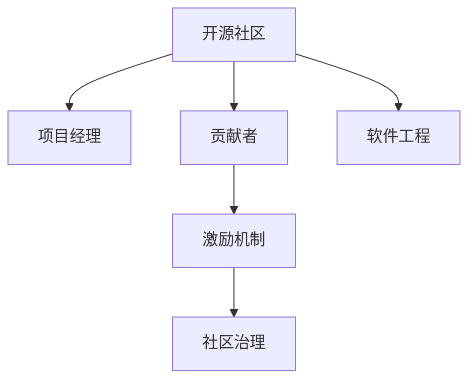

                 

# 开源社区管理：从义务到职业的转变

> 关键词：开源社区, 项目管理, 开发者, 贡献者, 激励机制, 社区治理, 软件工程, 开源文化

## 1. 背景介绍

### 1.1 问题由来

随着开源软件的发展，越来越多的企业和开发者参与到开源社区的建设中。开源社区的管理不再是少数几位核心成员的义务，而成为了一个需要专业化和规范化的工作。如何提高社区的组织效率，增强开发者参与度，保持项目健康持续发展，成为摆在开源社区管理者面前的重要课题。

### 1.2 问题核心关键点

开源社区管理的核心在于如何构建一个高效、透明的治理结构，吸引和保持高质量的开发者贡献，同时维护社区的文化和价值观。本文将从以下几个方面进行探讨：

- 如何建立社区治理机制。
- 如何设计有效的贡献者激励机制。
- 如何提升社区透明度和开放性。
- 如何平衡贡献者与管理者之间的关系。

通过深入分析这些问题，本文旨在为开源社区管理者提供一套系统的解决方案，助力社区的良性发展。

### 1.3 问题研究意义

在开源软件迅速发展的今天，开源社区已经成为创新和协作的重要平台。开源社区的顺利运行，不仅对企业带来技术上的竞争优势，也促进了全球范围内技术的交流和共享。开源社区管理的好坏，直接关系到项目的健康成长和社区的健康生态，因此具有重要的研究意义。

## 2. 核心概念与联系

### 2.1 核心概念概述

为更好地理解开源社区管理的核心概念，本节将介绍几个密切相关的核心概念：

- **开源社区(Open Source Community)**：指由开发者、用户、贡献者、管理者等共同组成的软件开发和维护社区。社区成员自愿贡献代码、文档、测试、维护等资源，共同推动项目的发展。
- **项目经理(Project Manager)**：负责开源项目的整体规划、进度管理和团队协作，确保项目按时高质量交付。
- **贡献者(Contributor)**：指积极参与项目开发、文档编写、测试、设计等活动的开发者。贡献者的积极参与是开源项目成功的重要保障。
- **激励机制(Incentive Mechanism)**：指通过奖励、荣誉、社区认证等方式，鼓励和激励贡献者积极参与项目建设。
- **社区治理(COMMUNITY GOVERNANCE)**：指社区内部成员间的相互作用和决策过程，通过制度化、规范化的方式管理社区事务。
- **软件工程(Software Engineering)**：指使用系统化的方法和工具，以高效、高质量地开发和维护软件产品的实践。

这些核心概念之间的逻辑关系可以通过以下Mermaid流程图来展示：



这个流程图展示了开源社区的核心概念及其之间的关系：

1. 开源社区是软件工程实践的集合。
2. 项目经理负责管理软件工程实践。
3. 贡献者是软件工程实践的核心参与者。
4. 激励机制通过各种方式鼓励贡献者参与。
5. 社区治理确保社区内部的和谐有序。

## 3. 核心算法原理 & 具体操作步骤

### 3.1 算法原理概述

开源社区管理涉及到多个方面，包括项目规划、资源管理、团队协作、社区治理等。本文将从开源社区的治理机制、激励机制、透明度提升等角度，探讨如何通过系统化的方法，提升社区管理的效率和效果。

### 3.2 算法步骤详解

#### 3.2.1 建立社区治理机制

社区治理机制是开源社区管理的基石。其核心在于明确社区的决策流程、资源分配规则和冲突解决机制。以下是一个简单的治理机制设计步骤：

1. **明确社区章程**：定义社区的目标、原则、规则和责任。
2. **建立决策委员会**：由社区成员推选，负责决策重大事项。
3. **设立项目管理办公室(PMO)**：负责项目日常管理、资源分配和团队协作。
4. **制定项目管理流程**：包括需求评审、任务分配、代码评审等环节。
5. **建立社区反馈机制**：定期收集社区成员的意见和建议。

#### 3.2.2 设计有效的激励机制

激励机制是开源社区管理的动力源泉。其目的是通过合理的设计，鼓励开发者积极参与项目建设。以下是一些常见的激励措施：

1. **贡献认可**：通过开源社区认证、公开表扬等方式，认可贡献者的努力。
2. **技术奖励**：提供技术培训、访问特定技术资源的机会。
3. **社区贡献点卡**：设立社区积分系统，记录贡献者的贡献点数，可用于兑换奖励。
4. **商业合作机会**：为有商业需求的开发者提供合作机会。
5. **开源英雄榜**：定期发布社区贡献榜单，激励贡献者持续贡献。

#### 3.2.3 提升社区透明度和开放性

透明度和开放性是开源社区的生命线。其目的是通过公开透明的管理方式，增强社区成员的信任和参与度。以下是一些提升透明度的措施：

1. **公开信息**：在官方网站、社交媒体等渠道公开项目进展、贡献者名单、项目里程碑等。
2. **会议记录**：定期召开项目会议，并记录会议内容和决策结果。
3. **代码开放**：所有代码和文档均对公众开放，方便查看和贡献。
4. **问题跟踪**：使用问题跟踪系统，记录和解决社区成员反馈的问题。
5. **审计机制**：定期对项目的财务和资源使用情况进行审计，确保公正透明。

### 3.3 算法优缺点

开源社区管理具有以下优点：

1. **社区自治**：通过社区章程和治理机制，增强社区成员的归属感和责任感。
2. **多样化资源**：汇聚全球各地的开发者和用户，形成多样化的资源集合。
3. **快速迭代**：通过开放透明的方式，快速响应社区需求和反馈。

同时，开源社区管理也存在一些局限性：

1. **管理复杂**：社区成员分布广泛，管理难度较大。
2. **决策效率低**：社区成员数量众多，决策过程可能较慢。
3. **资源分配困难**：不同成员的需求和优先级可能不一致，资源分配难度较大。
4. **文化差异**：来自不同国家和文化背景的成员可能存在价值观和习惯上的差异。

### 3.4 算法应用领域

开源社区管理的应用领域广泛，以下是几个典型案例：

1. **Apache Foundation**：作为开源社区的标杆，Apache Foundation通过明确的章程、透明的决策机制和多样化的激励措施，成功地吸引了全球大量的开发者参与。
2. **Linux Kernel**：作为最具影响力的开源项目之一，Linux Kernel通过社区治理和激励机制，确保了项目的稳定和持续发展。
3. **Mozilla Foundation**：通过创新的激励机制和社区参与模式，Mozilla Foundation成功地推动了Firefox浏览器的广泛应用。
4. **GitLab**：作为流行的开源代码托管平台，GitLab通过现代化的管理工具和透明的治理机制，吸引了全球开发者的广泛使用。

## 4. 数学模型和公式 & 详细讲解 & 举例说明

### 4.1 数学模型构建

开源社区管理涉及到多个方面的问题，可以通过数学模型来进行量化分析和优化。以下是一个简单的社区治理模型的构建步骤：

1. **建立社区规模模型**：定义社区成员数量、分布、贡献度等变量，建立社区规模的数学模型。
2. **设计激励函数**：定义激励机制对贡献者的影响，建立激励效果的数学函数。
3. **建立贡献度模型**：通过数学模型计算贡献者的贡献度，衡量其对项目的贡献大小。
4. **设计透明化模型**：通过数学模型量化社区透明度对成员参与度的影响。
5. **建立冲突解决模型**：通过数学模型分析冲突发生的原因和解决方式。

### 4.2 公式推导过程

以下是一个简单的贡献度计算公式：

$$
C_i = \sum_{j=1}^n P_{ij} * F_j
$$

其中，$C_i$ 表示成员 $i$ 的贡献度，$P_{ij}$ 表示成员 $j$ 对成员 $i$ 的正面影响系数，$F_j$ 表示成员 $j$ 的正面影响因子。

### 4.3 案例分析与讲解

假设有一个开源社区，包含10个核心成员和20个活跃贡献者。每个核心成员和活跃贡献者对其他成员的影响系数不同，贡献因子也不同。通过上述公式，可以计算出每个成员的贡献度。

## 5. 项目实践：代码实例和详细解释说明

### 5.1 开发环境搭建

在进行开源社区管理实践前，我们需要准备好开发环境。以下是使用Python进行Flask开发的环境配置流程：

1. 安装Anaconda：从官网下载并安装Anaconda，用于创建独立的Python环境。

2. 创建并激活虚拟环境：
```bash
conda create -n flask-env python=3.8 
conda activate flask-env
```

3. 安装Flask：
```bash
pip install flask
```

4. 安装Flask的扩展库：
```bash
pip install flask-sqlalchemy flask-restful flask-httpauth flask-login flask-migrate
```

完成上述步骤后，即可在`flask-env`环境中开始社区管理系统的开发。

### 5.2 源代码详细实现

下面我们以一个简单的社区管理系统为例，给出使用Flask框架实现社区治理功能的Python代码实现。

```python
from flask import Flask, request, jsonify
from flask_sqlalchemy import SQLAlchemy
from flask_login import LoginManager, UserMixin, login_user, login_required, logout_user, current_user
from flask_httpauth import HTTPBasicAuth
from werkzeug.security import generate_password_hash, check_password_hash

app = Flask(__name__)
app.config['SQLALCHEMY_DATABASE_URI'] = 'sqlite:///users.db'
app.config['SECRET_KEY'] = 'super-secret'
db = SQLAlchemy(app)
login_manager = LoginManager()
login_manager.init_app(app)
auth = HTTPBasicAuth()

class User(db.Model, UserMixin):
    id = db.Column(db.Integer, primary_key=True)
    username = db.Column(db.String(64), unique=True, nullable=False)
    password = db.Column(db.String(128), nullable=False)
    is_admin = db.Column(db.Boolean, default=False)

@login_manager.user_loader
def load_user(username):
    return User.query.filter_by(username=username).first()

@auth.verify_password
def verify_password(username, password):
    user = User.query.filter_by(username=username).first()
    if not user:
        return False
    return check_password_hash(user.password, password)

@app.route('/login', methods=['POST'])
def login():
    data = request.get_json()
    username = data.get('username')
    password = data.get('password')
    user = User.query.filter_by(username=username).first()
    if not user or not check_password_hash(user.password, password):
        return jsonify({'message': 'Invalid username or password'}), 401
    login_user(user)
    return jsonify({'message': 'Logged in'})

@app.route('/logout')
@login_required
def logout():
    logout_user()
    return jsonify({'message': 'Logged out'})

@app.route('/admin')
@login_required
def admin():
    if current_user.is_admin:
        return jsonify({'message': 'Welcome, admin'})
    return jsonify({'message': 'You are not authorized to access this page'})

if __name__ == '__main__':
    app.run(debug=True)
```

这是一个简单的社区管理系统，包括了用户认证、管理员权限和用户权限控制等功能。通过使用Flask框架，可以方便地实现上述功能，同时支持HTTP认证和数据库操作。

### 5.3 代码解读与分析

让我们再详细解读一下关键代码的实现细节：

**User类**：
- `__init__`方法：初始化用户的基本信息，包括用户名、密码和管理员权限。
- `is_admin`属性：标记用户是否为管理员。
- `load_user`函数：用于从数据库中加载用户信息。
- `verify_password`函数：用于验证用户密码的正确性。

**login和logout函数**：
- `/login`路由：接收用户提交的用户名和密码，验证成功后登录用户。
- `/logout`路由：注销当前用户。

**admin函数**：
- `/admin`路由：只有管理员才能访问，用于展示管理员界面。

**运行结果展示**：
- 通过上述代码，可以构建一个简单的社区管理系统，用户可以通过HTTP请求进行登录、注销和管理操作。管理员可以查看和管理社区成员的信息。

## 6. 实际应用场景

### 6.1 智能制造系统

在智能制造系统中，开源社区管理技术可以应用于设备维护、生产调度、质量监控等领域。通过建立设备维护社区，吸引专业工程师和技术人员参与设备维护和故障排查，提升设备运行效率和产品质量。

在技术实现上，可以搭建设备维护社区平台，提供设备维护指南、故障案例、技术交流等资源，同时设立贡献者激励机制，吸引更多专业人士参与。

### 6.2 智慧农业平台

在智慧农业平台中，开源社区管理技术可以应用于种植方案、农机设备、病虫害防治等领域。通过建立智慧农业社区，吸引农业专家和技术人员参与知识共享和实践交流，提升农业生产的科学性和效率。

在技术实现上，可以搭建智慧农业社区平台，提供农业技术文章、农机设备介绍、病虫害防治案例等资源，同时设立贡献者激励机制，吸引更多农业专家参与。

### 6.3 公共安全管理系统

在公共安全管理系统中，开源社区管理技术可以应用于应急响应、灾害预警、安全监控等领域。通过建立公共安全社区，吸引志愿者和专业人员参与灾害预防和应急响应，提升公共安全水平。

在技术实现上，可以搭建公共安全社区平台，提供应急预案、灾害预警信息、安全监控视频等资源，同时设立贡献者激励机制，吸引更多志愿者和专业人员参与。

### 6.4 未来应用展望

随着开源社区管理技术的不断进步，未来其在各个领域的应用前景将更加广阔。

在医疗领域，开源社区管理技术可以应用于医疗资源共享、医疗知识库建设、医生协作等领域。通过建立医疗社区，吸引更多医生和医疗专家参与，提升医疗服务的质量和效率。

在教育领域，开源社区管理技术可以应用于在线教育资源共享、教学方法讨论、教育技术交流等领域。通过建立教育社区，吸引更多教师和教育工作者参与，提升教育水平和教学质量。

在公共服务领域，开源社区管理技术可以应用于城市管理、环保治理、交通优化等领域。通过建立公共服务社区，吸引更多志愿者和专业技术人员参与，提升公共服务水平和效率。

## 7. 工具和资源推荐

### 7.1 学习资源推荐

为了帮助开发者系统掌握开源社区管理的技术基础和实践技巧，这里推荐一些优质的学习资源：

1. **《开源社区管理实践》系列书籍**：全面介绍了开源社区管理的理论和实践，涵盖社区治理、贡献者激励、项目管理等多个方面。
2. **《开源社区运营手册》**：详细介绍了开源社区运营的各个环节，包括社区建设、资源整合、成员管理等。
3. **《社区运营实战》课程**：由开源社区专家开设的实战课程，涵盖社区管理、项目管理、问题解决等多个主题。
4. **GitHub社区指南**：GitHub官方提供的社区管理指南，详细介绍了GitHub社区的建设和管理方法。
5. **Apache Foundation社区运营手册**：Apache Foundation提供的社区管理手册，介绍了Apache社区的成功运营经验。

通过对这些资源的学习实践，相信你一定能够快速掌握开源社区管理的精髓，并用于解决实际的社区管理问题。

### 7.2 开发工具推荐

高效的开发离不开优秀的工具支持。以下是几款用于开源社区管理开发的常用工具：

1. **Flask**：Python Web框架，简单易用，支持HTTP认证和数据库操作。
2. **SQLAlchemy**：Python ORM工具，支持数据库的CRUD操作和复杂查询。
3. **Flask-Login**：Flask认证扩展，支持用户登录、注销和权限控制等功能。
4. **Flask-HTTPAuth**：Flask HTTP认证扩展，支持基本认证、token认证等多种认证方式。
5. **Flask-SQLAlchemy**：Flask SQLAlchemy扩展，支持数据库事务管理。

合理利用这些工具，可以显著提升开源社区管理任务的开发效率，加快创新迭代的步伐。

### 7.3 相关论文推荐

开源社区管理技术的发展源于学界的持续研究。以下是几篇奠基性的相关论文，推荐阅读：

1. **《开源社区管理和治理》**：探讨开源社区的管理和治理机制，分析社区管理面临的挑战和解决方案。
2. **《开源社区激励机制设计》**：研究如何通过激励机制，提高社区成员的贡献度。
3. **《开源社区透明度提升》**：探讨如何通过透明度提升，增强社区成员的信任和参与度。
4. **《开源社区冲突解决》**：分析开源社区中的冲突来源和解决策略，提出有效的冲突管理机制。

这些论文代表了大规模社区管理技术的发展脉络。通过学习这些前沿成果，可以帮助研究者把握学科前进方向，激发更多的创新灵感。

## 8. 总结：未来发展趋势与挑战

### 8.1 总结

本文对开源社区管理的技术和方法进行了全面系统的介绍。首先阐述了开源社区管理的重要性和核心关键点，明确了管理机制、激励机制、透明度提升等在开源社区中的重要性。其次，从原理到实践，详细讲解了开源社区管理的数学模型和具体操作步骤，给出了社区管理系统的代码实现。同时，本文还广泛探讨了开源社区管理技术在多个行业领域的应用前景，展示了其广泛的应用价值。最后，本文精选了开源社区管理的各类学习资源，力求为开发者提供全方位的技术指引。

通过本文的系统梳理，可以看到，开源社区管理技术已经在各个领域得到了广泛的应用，对项目的健康成长和社区的良性发展起到了重要的推动作用。未来，伴随开源社区管理技术的持续演进，相信开源社区将迎来更加规范化、高效化的管理模式，为全球的开发者和用户提供更加优质的服务。

### 8.2 未来发展趋势

展望未来，开源社区管理技术将呈现以下几个发展趋势：

1. **自动化管理**：随着人工智能技术的发展，自动化管理工具将成为开源社区管理的重要手段。通过智能分析和管理，提升社区运营的效率和效果。
2. **数据驱动决策**：社区管理者将更多地依赖数据驱动的决策，通过数据分析和机器学习，优化资源配置和项目进展。
3. **开源生态扩展**：开源社区将更多地与其他开源项目、社区、企业等进行合作，构建更广泛的开源生态系统。
4. **跨领域应用**：开源社区管理技术将更多地应用于工业互联网、智慧城市、智慧农业等领域，推动跨领域技术创新和应用。
5. **社区成员培养**：社区管理者将更多地关注社区成员的培养和成长，提升社区整体的技术水平和参与度。

这些趋势凸显了开源社区管理技术的广阔前景。这些方向的探索发展，必将进一步提升开源社区的管理效率，增强社区成员的归属感和责任感。

### 8.3 面临的挑战

尽管开源社区管理技术已经取得了显著进展，但在迈向更加智能化、规范化的过程中，它仍面临诸多挑战：

1. **管理复杂性**：随着社区规模的扩大，管理复杂性将显著增加。社区管理者需要具备更强的管理能力和技术水平。
2. **资源分配困难**：社区成员的需求和优先级可能不一致，资源分配难度较大。需要设计更有效的资源分配策略。
3. **文化差异**：来自不同国家和文化背景的成员可能存在价值观和习惯上的差异。需要设计更包容的社区文化。
4. **技术差距**：社区成员的技术水平可能参差不齐，需要提供更多的技术培训和支持。
5. **安全风险**：社区管理过程中可能面临安全风险，如代码注入、数据泄露等。需要加强安全防护和风险控制。

### 8.4 研究展望

面对开源社区管理所面临的挑战，未来的研究需要在以下几个方面寻求新的突破：

1. **自动化管理工具**：开发更加智能的社区管理工具，通过自动化的手段提升管理效率和效果。
2. **数据驱动决策**：引入数据科学和机器学习技术，优化社区资源的配置和分配。
3. **跨领域应用**：探索开源社区管理技术在更多领域的应用，推动技术创新和应用拓展。
4. **社区文化建设**：设计更加包容和多元的社区文化，增强社区成员的归属感和责任感。
5. **安全防护**：引入更先进的安全技术和策略，保障社区的安全和稳定。

这些研究方向将引领开源社区管理技术的进一步发展，为全球开源社区带来更加高效、健康和可持续的管理模式。面向未来，开源社区管理技术需要更多跨学科的协作和创新，共同推动开源社区的良性发展。

## 9. 附录：常见问题与解答

**Q1：如何衡量开源社区的管理效果？**

A: 开源社区的管理效果可以通过以下几个指标来衡量：
1. 社区活跃度：社区成员的参与程度，包括代码贡献、问题提交、讨论参与等。
2. 社区贡献度：社区成员对项目的贡献，包括代码质量、贡献量、文档编写等。
3. 社区满意度：社区成员对社区管理和服务的满意度，通过调查问卷等方式进行评估。
4. 社区增长率：社区成员数量和项目的增长速度，反映社区的吸引力和影响力。
5. 社区贡献激励效果：激励机制对社区成员的积极影响，通过贡献点数、荣誉奖励等方式进行评估。

通过这些指标，可以综合评估开源社区的管理效果，及时发现和解决管理中存在的问题。

**Q2：社区激励机制应该如何设计？**

A: 社区激励机制的设计应该考虑到社区成员的多样性和需求差异，以下是一些设计原则：
1. **多样性激励**：设计多样化的激励方式，涵盖技术奖励、荣誉表彰、商业合作等多个方面。
2. **透明性激励**：设计透明的激励机制，公开激励标准和流程，增强激励效果。
3. **分级激励**：设计分级激励机制，根据贡献度不同，提供不同级别的激励，鼓励更多成员参与。
4. **长期激励**：设计长期激励机制，如社区认证、技术贡献者奖等，提升社区成员的归属感和责任感。
5. **实时激励**：设计实时激励机制，及时反馈和奖励社区成员的贡献，增强激励效果。

通过这些原则，可以设计出符合社区特点和需求的激励机制，激发社区成员的积极性，提升社区的活力和凝聚力。

**Q3：社区管理中的冲突应该如何解决？**

A: 社区管理中的冲突可以通过以下方式解决：
1. **建立冲突解决机制**：设立专门的冲突解决委员会，负责处理社区中的冲突和纠纷。
2. **引导性沟通**：通过社区管理员引导，促进成员之间的沟通和理解，减少误解和冲突。
3. **客观评价**：通过客观的数据和证据，公正地评估冲突双方的行为，避免主观偏见。
4. **中立调解**：社区管理员应保持中立，不偏袒任何一方，公正地处理冲突。
5. **公开透明**：处理冲突的过程和结果应公开透明，增强社区成员的信任和满意度。

通过这些措施，可以有效地解决社区中的冲突，维护社区的和谐和稳定。

---

作者：禅与计算机程序设计艺术 / Zen and the Art of Computer Programming

