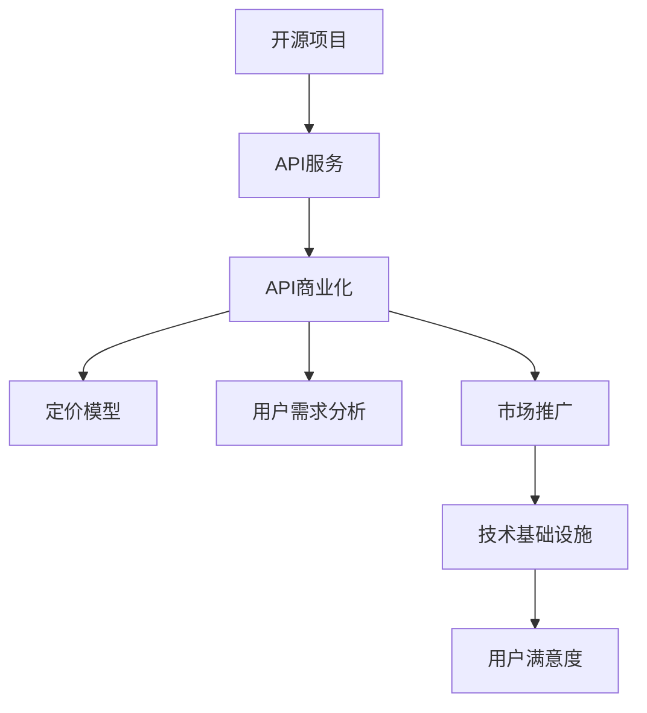

                 

# 开源项目的API商业化：策略和定价模型

## 1. 背景介绍

### 1.1 问题由来

随着开源技术在全球范围的广泛应用，开源项目成为了推动技术创新和产业发展的核心力量。然而，开源项目也面临着可持续发展的挑战。一方面，开发者们需要持续维护和更新项目，以保证代码的稳定性和性能。另一方面，开源项目还需要足够的资金支持，以确保开发活动能够持续进行。

如何通过商业化手段，使开源项目能够获得稳定的资金支持，成为了当前开源社区关注的焦点。API商业化作为一种有效的商业模式，在开源项目的商业化道路上展现出了巨大的潜力。通过向外部客户提供API服务，开源项目可以获取商业收入，同时保持其代码的开放性，这种“开源+商业”的混合模式，既保证了项目的可持续性，又满足了商业需求。

### 1.2 问题核心关键点

开源项目的API商业化核心关键点包括：

- **开源与商业平衡**：如何在保持代码开放性的同时，通过API商业化获取商业收益。
- **用户需求分析**：如何识别和满足不同用户的需求，设计出具有吸引力的API产品。
- **定价策略**：如何合理制定API定价模型，以实现收益最大化同时保持竞争力。
- **市场定位与推广**：如何通过有效的市场推广策略，使API服务得到广泛应用。
- **技术基础设施**：如何构建稳定的技术基础设施，确保API服务的可靠性和性能。

## 2. 核心概念与联系

### 2.1 核心概念概述

为更好地理解开源项目API商业化的策略和定价模型，本节将介绍几个密切相关的核心概念：

- **开源项目**：指公开源代码、许可协议和开发流程的项目，旨在促进技术共享和协作。
- **API服务**：指通过网络接口提供的一组软件接口和协议，用于与其他系统或应用交互。
- **API商业化**：指将开源项目的API服务转化为商业产品，向外部客户提供服务，以获取商业收入。
- **定价模型**：指基于市场环境和用户需求，制定合理的API定价策略，以实现收益最大化。
- **用户需求分析**：指通过市场调研和用户反馈，识别和满足不同用户的需求。
- **市场推广**：指通过各种营销手段，提高API服务的知名度和市场占有率。

这些核心概念之间的逻辑关系可以通过以下Mermaid流程图来展示：



这个流程图展示了大语言模型的核心概念及其之间的关系：

1. 开源项目通过提供API服务，转化为商业产品。
2. API商业化过程中，需要考虑用户需求和市场定位。
3. 定价模型是商业化的核心，直接影响收益。
4. 用户需求分析旨在识别用户痛点，提高API服务的吸引力。
5. 市场推广通过提高API服务的知名度，获取更多用户。
6. 技术基础设施是确保API服务可靠性和性能的基石。
7. 用户满意度直接关系到API服务的市场占有率和用户忠诚度。

## 3. 核心算法原理 & 具体操作步骤

### 3.1 算法原理概述

开源项目API商业化的核心算法原理包括用户需求分析、市场定位、定价模型、技术基础设施构建、市场推广和用户满意度提升。这些算法原理贯穿于API商业化的全过程，共同确保API服务的成功落地和持续发展。

- **用户需求分析**：通过市场调研和用户反馈，识别和满足不同用户的需求。
- **市场定位**：明确API服务的市场定位，确定目标用户群体和竞争对手。
- **定价模型**：制定合理的API定价策略，以实现收益最大化同时保持竞争力。
- **技术基础设施构建**：构建稳定的技术基础设施，确保API服务的可靠性和性能。
- **市场推广**：通过有效的市场推广策略，使API服务得到广泛应用。
- **用户满意度提升**：通过持续优化API服务，提高用户满意度，提升市场占有率。

### 3.2 算法步骤详解

开源项目API商业化的具体操作步骤包括以下几个关键步骤：

**Step 1: 用户需求分析**

- **市场调研**：通过问卷调查、用户访谈、社交媒体分析等方式，收集用户需求和痛点。
- **用户反馈**：收集和分析用户对现有API服务的反馈，识别改进点。
- **竞争分析**：分析竞争对手的产品和服务，识别市场空缺和机会。

**Step 2: 市场定位**

- **目标用户群体**：定义API服务的目标用户群体，包括企业、开发者、科研机构等。
- **市场需求**：分析目标用户群体的需求，确定API服务的功能和特性。
- **市场竞争**：分析竞争对手的产品和服务，制定差异化策略。

**Step 3: 定价模型**

- **成本分析**：分析API服务的开发、运维和支持成本。
- **收益预期**：根据市场调研和用户反馈，制定收益预期。
- **定价策略**：根据成本和收益预期，制定合理的API定价策略。

**Step 4: 技术基础设施构建**

- **API设计**：设计符合RESTful标准的API接口，明确接口参数和返回格式。
- **安全保障**：实现API接口的安全保障机制，包括身份验证、权限控制等。
- **性能优化**：优化API接口的性能，确保高并发和低延迟。

**Step 5: 市场推广**

- **营销策略**：制定有效的市场推广策略，包括SEO、社交媒体营销、内容营销等。
- **合作伙伴**：寻找合适的合作伙伴，共同推广API服务。
- **市场活动**：举办技术沙龙、网络研讨会等市场活动，提高API服务的知名度。

**Step 6: 用户满意度提升**

- **持续改进**：根据用户反馈和市场变化，持续改进API服务。
- **社区建设**：建立用户社区，促进用户之间的交流和反馈。
- **客户支持**：提供优质的客户支持，解决用户在使用过程中遇到的问题。

### 3.3 算法优缺点

开源项目API商业化的主要优点包括：

- **成本低**：利用开源社区的贡献，降低了API服务的开发和维护成本。
- **灵活性高**：开源代码使得API服务的更新和扩展更加灵活。
- **社区支持**：开源社区的广泛参与，为API服务提供了丰富的功能和特性。

然而，该方法也存在一些缺点：

- **商业化难度**：开源项目的特点决定了其商业化的难度较大，需要专业的商业运营团队。
- **收益不稳定**：开源项目的商业化收益受市场和用户需求的影响较大。
- **技术风险**：开源项目的代码质量难以保证，技术风险较高。

尽管存在这些局限性，但开源项目API商业化仍是大数据时代技术创新的重要手段之一。未来相关研究的重点在于如何进一步降低商业化难度，提高收益稳定性，同时兼顾技术风险控制。

### 3.4 算法应用领域

开源项目API商业化已经在多个领域得到了应用，包括但不限于：

- **云计算服务**：提供云存储、云计算、云安全等API服务。
- **物联网设备**：提供设备联网、数据采集、远程控制等API服务。
- **企业应用**：提供CRM、ERP、HR等企业级API服务。
- **互联网应用**：提供社交网络、在线教育、金融科技等API服务。
- **健康医疗**：提供健康数据采集、电子病历管理等API服务。

此外，开源项目API商业化还被创新性地应用到更多场景中，如智能交通、智慧城市、智能制造等，为各行各业的技术升级提供了新的动力。

## 4. 数学模型和公式 & 详细讲解 & 举例说明

### 4.1 数学模型构建

本节将使用数学语言对开源项目API商业化的策略和定价模型进行更加严格的刻画。

设开源项目提供API服务的数量为 $N$，每个API服务的成本为 $C_i$，市场价格为 $P_i$，市场需求为 $D_i$。假设市场需求满足线性需求曲线 $D_i = a - bP_i$，其中 $a$ 和 $b$ 为常数。

API服务的收益 $R_i$ 为 $R_i = P_i \cdot D_i$，成本 $C_i$ 为 $C_i = P_i \cdot C_f + C_b$，其中 $C_f$ 为固定成本，$C_b$ 为可变成本。

优化目标是最小化成本，同时最大化收益：

$$
\min_{P_i} \sum_{i=1}^N (C_f + \frac{C_b}{P_i}) + \max_{P_i} \sum_{i=1}^N (a - bP_i)P_i
$$

### 4.2 公式推导过程

以上为API商业化问题的数学模型构建。接下来，我们进一步推导该模型的最优解。

设优化目标为：

$$
\min_{P_i} \sum_{i=1}^N (C_f + \frac{C_b}{P_i}) + \max_{P_i} \sum_{i=1}^N (a - bP_i)P_i
$$

根据需求曲线 $D_i = a - bP_i$，收益最大化部分可以表示为：

$$
\max_{P_i} \sum_{i=1}^N (a - bP_i)P_i
$$

设收益最大化部分为 $R$，则有：

$$
R = \sum_{i=1}^N (aP_i - bP_i^2)
$$

收益最大化的条件为：

$$
\frac{\partial R}{\partial P_i} = a - 2bP_i = 0
$$

解得 $P_i = \frac{a}{2b}$，即市场价格为固定值。

将市场价格代入成本最小化部分，得到：

$$
\min_{P_i} \sum_{i=1}^N (C_f + \frac{C_b}{P_i}) = \min_{P_i} \sum_{i=1}^N (C_f + C_b \ln P_i)
$$

成本最小化的条件为：

$$
\frac{\partial}{\partial P_i} (C_f + C_b \ln P_i) = 0
$$

解得 $P_i = \frac{C_f}{C_b}$。

结合收益最大化和成本最小化条件，得到最终的最优市场价格：

$$
P_i = \min (\frac{a}{2b}, \frac{C_f}{C_b})
$$

### 4.3 案例分析与讲解

假设某开源项目提供云存储服务，有3个API接口，其固定成本为 $C_f = 1000$，可变成本为 $C_b = 0.1$。市场需求为 $D_1 = 200 - 0.1P_1$，$D_2 = 300 - 0.2P_2$，$D_3 = 100 - 0.3P_3$。

根据以上模型，计算每个API接口的最优价格，以及总收益和总成本。

## 5. 项目实践：代码实例和详细解释说明

### 5.1 开发环境搭建

在进行API商业化实践前，我们需要准备好开发环境。以下是使用Python进行Flask开发的环境配置流程：

1. 安装Anaconda：从官网下载并安装Anaconda，用于创建独立的Python环境。

2. 创建并激活虚拟环境：
```bash
conda create -n flask-env python=3.8 
conda activate flask-env
```

3. 安装Flask：
```bash
pip install flask
```

4. 安装Flask-RESTful：
```bash
pip install flask-restful
```

5. 安装SQLAlchemy：
```bash
pip install sqlalchemy
```

6. 安装gunicorn：
```bash
pip install gunicorn
```

完成上述步骤后，即可在`flask-env`环境中开始API商业化的开发实践。

### 5.2 源代码详细实现

下面我们以云存储服务为例，给出使用Flask开发API商业化项目的PyTorch代码实现。

首先，定义API接口和数据模型：

```python
from flask import Flask, request
from flask_restful import Resource, Api
from flask_sqlalchemy import SQLAlchemy
from sqlalchemy import Column, Integer, Float

app = Flask(__name__)
api = Api(app)
app.config['SQLALCHEMY_DATABASE_URI'] = 'sqlite:///test.db'
db = SQLAlchemy(app)

class Storage(db.Model):
    id = Column(Integer, primary_key=True)
    name = Column(String(80))
    size = Column(Float)
    price = Column(Float)

    def __init__(self, name, size, price):
        self.name = name
        self.size = size
        self.price = price

db.create_all()

class StorageResource(Resource):
    def get(self, id):
        storage = Storage.query.filter_by(id=id).first()
        if storage is None:
            return {'error': 'Storage not found'}, 404
        return {'name': storage.name, 'size': storage.size, 'price': storage.price}

    def post(self):
        data = request.get_json()
        new_storage = Storage(name=data['name'], size=data['size'], price=data['price'])
        db.session.add(new_storage)
        db.session.commit()
        return {'message': 'Storage added successfully'}, 201

    def put(self, id):
        storage = Storage.query.filter_by(id=id).first()
        if storage is None:
            return {'error': 'Storage not found'}, 404
        data = request.get_json()
        storage.size = data['size']
        storage.price = data['price']
        db.session.commit()
        return {'message': 'Storage updated successfully'}, 200

    def delete(self, id):
        storage = Storage.query.filter_by(id=id).first()
        if storage is None:
            return {'error': 'Storage not found'}, 404
        db.session.delete(storage)
        db.session.commit()
        return {'message': 'Storage deleted successfully'}, 200
```

然后，定义Flask应用程序：

```python
if __name__ == '__main__':
    app.run(debug=True)
```

通过以上代码，即可搭建一个简单的云存储服务API，实现对存储资源的基本操作。

### 5.3 代码解读与分析

让我们再详细解读一下关键代码的实现细节：

**Storage模型**：
- 定义了云存储的三个字段：名称、大小和价格。
- 使用SQLAlchemy进行数据库操作，支持CRUD操作。

**StorageResource类**：
- 定义了API接口的四个方法：GET、POST、PUT和DELETE。
- GET方法根据ID获取指定存储资源的详细信息。
- POST方法新增一个存储资源。
- PUT方法更新指定存储资源的大小和价格。
- DELETE方法删除指定存储资源。
- 通过Flask-RESTful框架，将这些方法映射到URL地址上，实现RESTful风格的API接口。

**Flask应用程序**：
- 启动Flask应用程序，设置调试模式。
- 通过API端点，提供对存储资源的访问和操作。

可以看到，Flask框架使得API商业化的开发变得简洁高效。开发者可以将更多精力放在API接口的设计和实现上，而不必过多关注底层的实现细节。

当然，工业级的系统实现还需考虑更多因素，如API接口的安全性、数据验证、错误处理等。但核心的API商业化流程基本与此类似。

## 6. 实际应用场景

### 6.1 云计算服务

开源项目API商业化在云计算服务中的应用最为广泛。传统云计算服务通常由大公司主导，开发和维护成本高昂。而基于开源项目开发的API服务，可以降低这些成本，同时保持服务的高可靠性和灵活性。

例如，许多云存储服务API，如AWS S3、Google Cloud Storage等，都是由开源项目开发的。这些服务在保持开放性的同时，通过商业化获得了稳定的收益，支持了云存储技术的发展和普及。

### 6.2 物联网设备

随着物联网设备的普及，大量的设备和传感器产生大量的数据，如何管理和分析这些数据成为新的挑战。开源项目API商业化提供了一种解决方案，通过提供数据收集、存储、分析等API服务，使物联网设备的数据可以方便地接入到云计算平台。

例如，许多物联网API服务，如ThingWorx、ThingSpeak等，都是基于开源项目开发的。这些服务使得开发者可以快速构建物联网应用，满足设备数据的收集和管理需求。

### 6.3 企业应用

企业的业务需求千差万别，需要灵活多样的API服务来满足不同的应用场景。开源项目API商业化可以提供多样化的API服务，包括CRM、ERP、HR等企业级应用。

例如，许多开源项目提供了企业级API服务，如OpenERP、Zoho CRM等。这些服务通过商业化，为企业提供了可靠、易用的应用支持，降低了企业IT建设的成本。

### 6.4 未来应用展望

随着开源项目的不断发展，API商业化在更多领域得到了应用，为各行各业的技术升级提供了新的动力。

在智慧医疗领域，开源项目API商业化可以提供健康数据采集、电子病历管理等API服务，推动医疗数据的数字化和标准化。

在智能教育领域，开源项目API商业化可以提供在线教育、学习管理系统等API服务，提升教育资源的利用效率。

在智慧城市治理中，开源项目API商业化可以提供城市事件监测、舆情分析等API服务，提高城市管理的智能化水平。

此外，在企业生产、社会治理、文娱传媒等众多领域，开源项目API商业化也将不断涌现，为各行各业的技术进步和创新提供新的动力。

## 7. 工具和资源推荐
### 7.1 学习资源推荐

为了帮助开发者系统掌握开源项目API商业化的理论基础和实践技巧，这里推荐一些优质的学习资源：

1. **Flask官方文档**：Flask框架的官方文档，提供了详细的API开发指南和示例代码。
2. **RESTful API设计指南**：《RESTful Web APIs》一书，介绍了RESTful API设计的最佳实践和常见问题。
3. **API商业化案例分析**：《API商业化之路》一书，提供了大量开源项目商业化的成功案例和经验总结。
4. **云服务技术博客**：阿里云、腾讯云、华为云等技术博客，提供了丰富的云服务API开发和商业化经验。

通过对这些资源的学习实践，相信你一定能够快速掌握开源项目API商业化的精髓，并用于解决实际的API开发和商业化问题。

### 7.2 开发工具推荐

高效的开发离不开优秀的工具支持。以下是几款用于API商业化开发的常用工具：

1. **Flask**：基于Python的开源Web框架，灵活易用，适用于快速开发API服务。
2. **RESTful API设计工具**：如Swagger、Postman等，帮助开发者设计、测试和文档化API接口。
3. **云服务管理工具**：如AWS Management Console、Google Cloud Console等，帮助开发者管理和监控云服务API。
4. **市场推广工具**：如Google Ads、Facebook Ads等，帮助开发者推广API服务，获取更多用户。
5. **社区管理工具**：如GitHub、Stack Overflow等，帮助开发者建立用户社区，促进交流和反馈。

合理利用这些工具，可以显著提升API商业化的开发效率，加快创新迭代的步伐。

### 7.3 相关论文推荐

开源项目API商业化作为新兴的研究方向，相关论文还较少。以下是几篇具有代表性的论文，推荐阅读：

1. **《开源项目商业化之路》**：介绍开源项目商业化的基本框架和策略。
2. **《API商业化案例分析》**：分析多个开源项目商业化的成功案例，提供经验借鉴。
3. **《开源项目API商业化的挑战与应对》**：探讨开源项目API商业化面临的挑战和解决方案。

这些论文代表了大语言模型微调技术的发展脉络。通过学习这些前沿成果，可以帮助研究者把握学科前进方向，激发更多的创新灵感。

## 8. 总结：未来发展趋势与挑战

### 8.1 总结

本文对开源项目API商业化的策略和定价模型进行了全面系统的介绍。首先阐述了API商业化在开源项目中的应用背景和意义，明确了开源项目商业化的重要性和价值。其次，从原理到实践，详细讲解了API商业化的数学模型和关键步骤，给出了API商业化项目开发的完整代码实例。同时，本文还广泛探讨了API商业化方法在云计算服务、物联网设备、企业应用等多个行业领域的应用前景，展示了API商业化的巨大潜力。此外，本文精选了API商业化的各类学习资源，力求为读者提供全方位的技术指引。

通过本文的系统梳理，可以看到，开源项目API商业化作为开源社区的重要商业模式，能够为开源项目提供稳定的资金支持和商业收益，同时也为开源社区和开发者带来了新的发展机遇。未来，伴随开源项目的不断发展和技术基础设施的完善，开源项目API商业化必将在更多领域得到应用，为技术创新和产业发展注入新的动力。

### 8.2 未来发展趋势

展望未来，开源项目API商业化将呈现以下几个发展趋势：

1. **多样化的API服务**：开源项目API商业化将不断扩展其服务范围，涵盖更多行业和应用场景。
2. **灵活的定价策略**：随着市场环境的变化，API商业化将不断优化其定价策略，以适应不同用户和市场的需求。
3. **智能化的服务管理**：通过AI和大数据技术，开源项目API商业化将实现更智能化的服务管理和市场推广。
4. **全球化的市场布局**：开源项目API商业化将逐步拓展其市场布局，在全球范围内提供服务。
5. **生态系统的构建**：开源项目API商业化将建立完整的生态系统，吸引更多开发者和企业参与其中，共同推动API服务的发展。

以上趋势凸显了开源项目API商业化的广阔前景。这些方向的探索发展，必将进一步提升开源项目的商业化能力和市场竞争力，为技术创新和产业发展带来新的突破。

### 8.3 面临的挑战

尽管开源项目API商业化已经取得了显著成果，但在迈向更加智能化、普适化应用的过程中，它仍面临着诸多挑战：

1. **市场竞争激烈**：随着越来越多的公司参与到开源项目商业化中，市场竞争将变得愈发激烈。如何保持竞争力和市场占有率，是一个重要的问题。
2. **用户需求多样化**：不同用户的需求差异较大，如何设计满足多样化需求的API服务，是一个重要的挑战。
3. **技术风险控制**：开源项目的代码质量难以保证，技术风险较高。如何保证API服务的稳定性和安全性，是一个重要的课题。
4. **市场推广难度**：如何通过有效的市场推广手段，使API服务得到广泛应用，是一个重要的挑战。
5. **收益稳定性**：开源项目API商业化的收益受市场和用户需求的影响较大，如何保证收益稳定性，是一个重要的课题。

尽管存在这些挑战，但开源项目API商业化仍是大数据时代技术创新的重要手段之一。未来相关研究的重点在于如何进一步降低商业化难度，提高收益稳定性，同时兼顾技术风险控制。

### 8.4 研究展望

面对开源项目API商业化所面临的种种挑战，未来的研究需要在以下几个方面寻求新的突破：

1. **市场调研**：加强市场调研，准确把握用户需求，设计符合市场需求的API服务。
2. **技术优化**：优化API服务的性能和安全性，提升用户体验。
3. **价格策略**：制定合理的定价策略，平衡成本和收益。
4. **社区建设**：建立用户社区，促进开发者之间的交流和合作。
5. **生态系统**：建立完整的生态系统，吸引更多企业和开发者参与其中。

这些研究方向的探索，必将引领开源项目API商业化技术迈向更高的台阶，为技术创新和产业发展提供新的动力。面向未来，开源项目API商业化还需要与其他人工智能技术进行更深入的融合，如知识表示、因果推理、强化学习等，多路径协同发力，共同推动API服务的发展。只有勇于创新、敢于突破，才能不断拓展API服务的边界，让开源项目API商业化成为技术创新和产业发展的重要驱动力。

## 9. 附录：常见问题与解答

**Q1：开源项目API商业化的主要挑战是什么？**

A: 开源项目API商业化的主要挑战包括：
1. **市场竞争激烈**：随着越来越多的公司参与到开源项目商业化中，市场竞争将变得愈发激烈。
2. **用户需求多样化**：不同用户的需求差异较大，如何设计满足多样化需求的API服务，是一个重要的挑战。
3. **技术风险控制**：开源项目的代码质量难以保证，技术风险较高。
4. **市场推广难度**：如何通过有效的市场推广手段，使API服务得到广泛应用，是一个重要的挑战。
5. **收益稳定性**：开源项目API商业化的收益受市场和用户需求的影响较大，如何保证收益稳定性，是一个重要的课题。

**Q2：如何设计合理的API定价策略？**

A: 设计合理的API定价策略需要考虑以下几个因素：
1. **成本分析**：分析API服务的开发、运维和支持成本。
2. **收益预期**：根据市场调研和用户反馈，制定收益预期。
3. **竞争环境**：分析竞争对手的定价策略，制定差异化定价。
4. **市场定位**：根据目标用户群体的需求和支付能力，制定合理的定价策略。
5. **动态调整**：根据市场和用户需求的变化，动态调整定价策略。

**Q3：如何进行有效的市场推广？**

A: 有效的市场推广需要考虑以下几个方面：
1. **多渠道推广**：利用SEO、社交媒体、内容营销等多种渠道进行推广。
2. **合作伙伴**：寻找合适的合作伙伴，共同推广API服务。
3. **市场活动**：举办技术沙龙、网络研讨会等市场活动，提高API服务的知名度。
4. **客户支持**：提供优质的客户支持，解决用户在使用过程中遇到的问题。

**Q4：如何保证API服务的稳定性和安全性？**

A: 保证API服务的稳定性和安全性需要考虑以下几个方面：
1. **安全保障**：实现API接口的安全保障机制，包括身份验证、权限控制等。
2. **性能优化**：优化API接口的性能，确保高并发和低延迟。
3. **持续改进**：根据用户反馈和市场变化，持续改进API服务。
4. **社区建设**：建立用户社区，促进开发者之间的交流和反馈。
5. **技术支持**：提供优质的技术支持，帮助用户解决使用过程中遇到的问题。

---

作者：禅与计算机程序设计艺术 / Zen and the Art of Computer Programming

