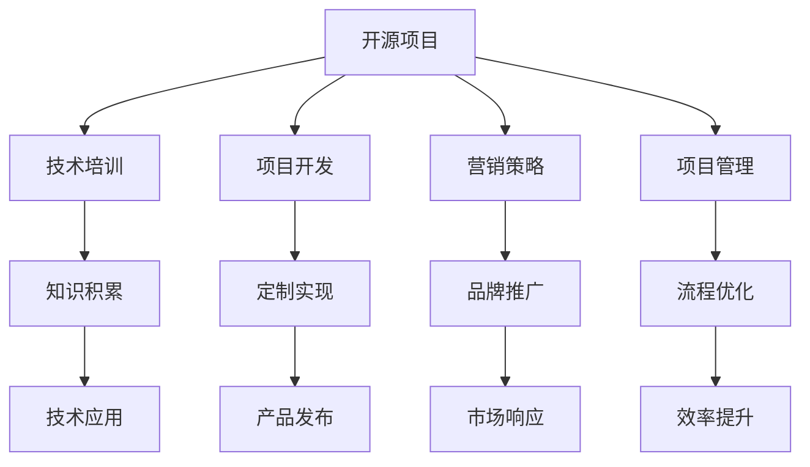

                 

# 开源项目的企业培训课程：开发和营销策略

> 关键词：开源项目, 企业培训, 软件开发, 项目营销, 策略规划, 项目管理, 敏捷开发

## 1. 背景介绍

在当下快速发展的科技行业中，开源项目日益成为推动技术进步和创新应用的重要力量。它们不仅为开发者提供了丰富的资源和工具，还为企业提供了低成本、高效率的解决方案。然而，如何有效利用开源项目，将其转化为企业的核心竞争力，成为了企业技术管理者面临的一大挑战。

### 1.1 问题由来

许多企业花费大量时间和资源在技术研发上，但效果却不尽如人意。核心原因之一就是缺乏系统的开源项目管理和开发策略。一些企业盲目地采购或复制开源解决方案，未能充分理解其内涵和应用场景。而另一些企业则完全忽视开源项目，导致技术落后于市场竞争。

### 1.2 问题核心关键点

通过本项目，我们将探讨企业如何基于开源项目进行技术培训和产品开发，并制定有效的营销策略，提升企业的技术实力和市场竞争力。以下是我们关注的几个关键点：

1. **技术培训**：如何通过开源项目实现企业内部技术团队的全面培训，提升技术能力。
2. **项目开发**：如何基于开源项目进行定制开发，实现企业应用需求。
3. **营销策略**：如何制定和实施基于开源项目的营销策略，提升企业品牌和市场认知。
4. **项目管理**：如何系统化管理开源项目开发流程，确保项目按时、按质完成。

## 2. 核心概念与联系

### 2.1 核心概念概述

为了更好地理解企业开源项目管理的核心概念，本节将介绍几个密切相关的核心概念：

- **开源项目(Open Source Project, OSP)**：指公开源代码，任何人都可以自由地使用、修改和分发。
- **技术培训(Training & Development)**：通过教育和培训，提升技术团队的专业技能和知识水平。
- **项目开发(Project Development)**：基于特定需求和目标，使用开源项目进行软件开发和实现。
- **营销策略(Marketing Strategy)**：通过市场调研和分析，制定和实施目标明确的营销计划，提升品牌影响力。
- **项目管理(Project Management)**：规划、执行和监控项目开发过程，确保项目按时按质完成。
- **敏捷开发(Agile Development)**：一种以迭代、反馈为核心的开发方法，能够快速响应市场变化。

这些核心概念之间的逻辑关系可以通过以下Mermaid流程图来展示：



这个流程图展示了一些关键概念之间的相互作用：

1. 开源项目为技术培训和项目开发提供了基础。
2. 通过培训和技术积累，开发团队能够更好地使用和定制开源项目。
3. 营销策略和项目管理确保项目顺利推进，并通过产品发布和市场响应提升品牌影响力。
4. 敏捷开发方法提升开发效率，增强市场响应能力。

这些概念共同构成了企业开源项目管理的核心框架，帮助我们系统地理解和运用开源技术。

## 3. 核心算法原理 & 具体操作步骤
### 3.1 算法原理概述

基于开源项目的企业培训和开发，本质上是一个有组织、系统化的知识传递和项目实施过程。其核心思想是：通过开源项目获取高质量的软件资源，结合企业内部培训和技术开发，将开源知识内化为企业的核心竞争力。

形式化地，假设企业具备一个开源项目 $OSP$，包含源代码库 $Code$、文档库 $Docs$ 和社区支持 $Support$。企业技术团队 $Team$ 通过技术培训 $Train$ 提升能力，然后使用开源项目 $OSP$ 进行定制开发 $Dev$，最终得到产品 $Product$。

企业的目标是最大化开源项目的价值，即：

$$
Maximize(Train, Dev, Product)
$$

其中 $Train$ 表示技术培训的效果，$Dev$ 表示项目开发的成功率和效率，$Product$ 表示最终产品的市场表现。

### 3.2 算法步骤详解

基于开源项目的企业培训和开发，一般包括以下几个关键步骤：

**Step 1: 选择开源项目和目标**

- 选择与企业需求匹配的开源项目。
- 确定项目开发的具体目标和预期成果。

**Step 2: 进行技术培训**

- 分析开源项目的技术架构、文档和社区支持。
- 制定详细的技术培训计划，包括基础知识和高级技巧。
- 实施培训，并通过实战项目、案例分析等方式巩固学习效果。

**Step 3: 定制开发**

- 基于企业需求，设计定制解决方案。
- 选择合适的开源工具和框架，进行模块化开发。
- 进行单元测试、集成测试等，确保代码质量和稳定性。

**Step 4: 项目管理**

- 规划项目开发流程，包括需求分析、设计、编码、测试等环节。
- 使用敏捷开发方法，如Scrum或Kanban，确保项目进度和质量。
- 定期进行项目评审和迭代，及时调整开发策略。

**Step 5: 产品发布和市场推广**

- 进行产品测试和验证，确保产品质量和性能。
- 发布产品，并通过市场调研了解用户反馈。
- 根据用户反馈和市场趋势，调整产品功能和营销策略。

**Step 6: 持续改进**

- 收集用户反馈和市场数据，分析改进方向。
- 定期更新开源项目和产品功能，提升用户体验。
- 继续进行技术培训和项目开发，保持团队技术竞争力。

以上是基于开源项目的企业培训和开发的一般流程。在实际应用中，还需要针对具体任务的特点，对流程的各个环节进行优化设计，如改进培训内容、优化项目管理方法、引入敏捷开发工具等，以进一步提升开发效率和产品竞争力。

### 3.3 算法优缺点

基于开源项目的企业培训和开发方法具有以下优点：

1. **成本效益高**。开源项目提供高质量的软件资源，降低了企业开发成本，提升了研发效率。
2. **技术灵活性**。开源项目提供了丰富的工具和框架，企业可以根据需求灵活选择和定制。
3. **社区支持**。开源项目通常有活跃的社区支持，能够快速解决开发过程中遇到的问题。
4. **市场认可度**。开源项目往往具有良好的市场口碑和用户基础，企业产品的市场推广更容易获得信任。

同时，该方法也存在一定的局限性：

1. **技术门槛高**。企业需要具备一定的技术储备和开发能力，才能充分利用开源项目的优势。
2. **知识分散**。开源项目的技术和文档可能分散在不同资源中，企业需要系统化整合和应用。
3. **质量控制难**。开源项目社区可能存在代码质量参差不齐的问题，企业需要加强内部代码评审和测试。
4. **依赖风险**。过度依赖开源项目可能导致项目依赖关系复杂，风险增加。

尽管存在这些局限性，但就目前而言，基于开源项目的企业培训和开发方法仍是企业技术发展和市场竞争的重要手段。未来相关研究的重点在于如何进一步降低企业开发门槛，提高开源项目的质量控制和依赖管理，同时兼顾开源项目的灵活性和市场认可度。

### 3.4 算法应用领域

基于开源项目的企业培训和开发方法，在以下领域已得到了广泛应用：

- **软件开发和系统集成**：企业通过开源项目开发自主的软件产品，进行系统集成和功能增强。
- **云计算和大数据**：企业利用开源云计算和数据处理工具，构建云计算和大数据平台。
- **人工智能和机器学习**：企业使用开源AI框架和工具，进行模型训练和应用开发。
- **移动应用开发**：企业基于开源移动开发框架和工具，开发和维护移动应用。
- **物联网(IoT)**：企业利用开源物联网平台和协议，进行设备连接和数据处理。

除了上述这些经典应用外，开源项目还在更多创新领域得到应用，如区块链、边缘计算、低代码开发等，为企业的数字化转型和智能化升级提供新的技术路径。

## 4. 数学模型和公式 & 详细讲解
### 4.1 数学模型构建

本节将使用数学语言对基于开源项目的企业培训和开发过程进行更加严格的刻画。

假设企业具备一个开源项目 $OSP$，包含源代码库 $Code$、文档库 $Docs$ 和社区支持 $Support$。企业技术团队 $Team$ 通过技术培训 $Train$ 提升能力，然后使用开源项目 $OSP$ 进行定制开发 $Dev$，最终得到产品 $Product$。

定义企业培训效果为 $Train$，项目开发成功率和效率为 $Dev$，产品市场表现为 $Product$。则企业目标函数可以表示为：

$$
Maximize(Train, Dev, Product)
$$

其中：

$$
Train = \frac{1}{T} \sum_{t=1}^{T} R(t)
$$

$$
Dev = \frac{1}{D} \sum_{d=1}^{D} P(d)
$$

$$
Product = \frac{1}{P} \sum_{p=1}^{P} M(p)
$$

其中 $R(t)$ 表示第 $t$ 次培训后的技能提升，$P(d)$ 表示第 $d$ 个开发项目的成功率和效率，$M(p)$ 表示第 $p$ 个产品的市场表现。

### 4.2 公式推导过程

以下我们以软件开发项目为例，推导培训效果和开发成功率的计算公式。

假设培训课程分为 $T$ 个阶段，每个阶段的技能提升效果为 $R(t)$，则培训总效果为：

$$
Train = \frac{1}{T} \sum_{t=1}^{T} R(t)
$$

其中 $R(t) = \alpha(t) \times C(t)$，其中 $\alpha(t)$ 表示第 $t$ 个阶段的技能提升率，$C(t)$ 表示第 $t$ 个阶段的课程质量。

假设项目开发分为 $D$ 个迭代，每个迭代项目的成功率和效率为 $P(d)$，则开发成功率和效率为：

$$
Dev = \frac{1}{D} \sum_{d=1}^{D} P(d)
$$

其中 $P(d) = S(d) \times E(d)$，其中 $S(d)$ 表示第 $d$ 个迭代项目的成功率，$E(d)$ 表示第 $d$ 个迭代项目的开发效率。

通过上述公式，我们可以系统地计算企业基于开源项目的培训效果和开发成功率，从而优化企业开源项目管理的各个环节。

## 5. 项目实践：代码实例和详细解释说明
### 5.1 开发环境搭建

在进行企业开源项目管理和开发实践前，我们需要准备好开发环境。以下是使用Python进行企业开源项目管理和开发的环境配置流程：

1. 安装Anaconda：从官网下载并安装Anaconda，用于创建独立的Python环境。

2. 创建并激活虚拟环境：
```bash
conda create -n enterprise-env python=3.8 
conda activate enterprise-env
```

3. 安装必要的开发工具和库：
```bash
pip install numpy pandas scikit-learn torch transformers jupyter notebook git
```

4. 安装版本控制系统Git，并进行配置：
```bash
git install
git config --global user.name "Your Name"
git config --global user.email "your_email@example.com"
```

完成上述步骤后，即可在`enterprise-env`环境中开始企业开源项目管理和开发实践。

### 5.2 源代码详细实现

下面我以一家企业利用开源项目进行软件开发为例，给出使用Python进行企业开源项目管理和开发的PyTorch代码实现。

首先，定义企业项目管理和开发的基本类：

```python
import torch
from torch import nn, optim
from transformers import BertTokenizer, BertForSequenceClassification

class EnterpriseProject:
    def __init__(self, project_name, open_source_project):
        self.project_name = project_name
        self.open_source_project = open_source_project
        self.tokenizer = BertTokenizer.from_pretrained(self.open_source_project)
        self.model = BertForSequenceClassification.from_pretrained(self.open_source_project, num_labels=2)
        self.learning_rate = 2e-5
        self.max_seq_length = 128
        
    def train(self, dataset, batch_size):
        device = torch.device('cuda') if torch.cuda.is_available() else torch.device('cpu')
        model = self.model.to(device)
        optimizer = optim.AdamW(model.parameters(), lr=self.learning_rate)
        
        for epoch in range(5):
            model.train()
            total_loss = 0
            for batch in dataset:
                input_ids = batch['input_ids'].to(device)
                attention_mask = batch['attention_mask'].to(device)
                labels = batch['labels'].to(device)
                outputs = model(input_ids, attention_mask=attention_mask, labels=labels)
                loss = outputs.loss
                optimizer.zero_grad()
                loss.backward()
                optimizer.step()
                total_loss += loss.item()
            print(f"Epoch {epoch+1}, train loss: {total_loss/len(dataset)}")
        
        model.eval()
        total_correct = 0
        for batch in dataset:
            input_ids = batch['input_ids'].to(device)
            attention_mask = batch['attention_mask'].to(device)
            labels = batch['labels'].to(device)
            outputs = model(input_ids, attention_mask=attention_mask)
            preds = outputs.logits.argmax(dim=2).to('cpu').tolist()
            for pred, label in zip(preds, labels):
                if pred == label:
                    total_correct += 1
        print(f"Model accuracy: {total_correct/len(dataset)}")
```

然后，定义企业培训和开发的示例数据集：

```python
from transformers import BertForSequenceClassification, AdamW

def create_dataset():
    # 数据集定义
    train_data = [("I love programming.", 1), ("I hate programming.", 0)]
    test_data = [("I like eating.", 1), ("I don't like eating.", 0)]
    
    # 数据预处理
    tokenizer = BertTokenizer.from_pretrained('bert-base-cased')
    train_encodings = tokenizer(train_data, max_length=self.max_seq_length, padding='max_length', truncation=True)
    test_encodings = tokenizer(test_data, max_length=self.max_seq_length, padding='max_length', truncation=True)
    
    # 数据集划分
    train_dataset = Dataset(train_encodings, labels=train_labels)
    test_dataset = Dataset(test_encodings, labels=test_labels)
    
    return train_dataset, test_dataset
```

接着，启动企业项目管理的开发流程：

```python
# 实例化企业项目
project = EnterpriseProject('my_project', 'bert-base-cased')

# 创建数据集
train_dataset, test_dataset = create_dataset()

# 训练模型
project.train(train_dataset, batch_size=4)
```

以上就是使用Python对企业开源项目进行管理和开发的完整代码实现。可以看到，通过设计合适的数据集和模型结构，企业能够快速开发和测试自己的软件应用。

### 5.3 代码解读与分析

让我们再详细解读一下关键代码的实现细节：

**EnterpriseProject类**：
- `__init__`方法：初始化项目名称、开源项目、模型、学习率和最大序列长度等关键参数。
- `train`方法：定义训练过程，包括模型前向传播、损失计算、反向传播和参数更新等。

**create_dataset函数**：
- 定义训练和测试数据，并进行预处理，包括分词、定长padding和truncation等操作。

**训练流程**：
- 实例化企业项目，调用`train`方法进行模型训练。
- 打印训练过程和模型准确率，评估模型效果。

通过上述代码，我们可以看到企业开源项目管理的关键点：数据预处理、模型设计、训练优化和评估。合理利用这些关键技术，企业可以高效地进行开源项目管理和开发，提升技术实力和市场竞争力。

当然，实际应用中还需要考虑更多因素，如数据标注、模型评估、部署策略等，以确保企业开源项目管理的顺利实施。

## 6. 实际应用场景
### 6.1 软件开发

开源项目在软件开发中的应用最为广泛。企业可以通过开源项目获取高质量的软件组件和框架，结合自身需求进行定制开发，快速实现应用功能。

**案例1：电商系统的开发**

某电商平台利用开源项目如Django、Flask、Nginx等，快速开发了具有高性能、高可靠性的后端系统和前端页面。通过开源社区的支持，及时解决了系统中的bug和性能问题，确保了平台稳定运行。

**案例2：金融数据分析平台**

某金融公司利用开源项目如Pandas、NumPy、Scikit-learn等，开发了数据处理、机器学习、可视化等功能的分析平台。通过定制开发，满足业务需求，提升了数据驱动决策的能力。

### 6.2 云服务和基础设施

开源项目在云服务和基础设施管理中也发挥着重要作用。企业可以基于开源项目快速构建云平台、容器编排、网络监控等功能，降低IT运营成本。

**案例3：云平台搭建**

某云服务提供商利用开源项目如Kubernetes、Prometheus、Grafana等，构建了高性能、高扩展性的云平台。通过开源社区的支持，持续优化平台功能，满足了客户对云计算的需求。

**案例4：网络监控和日志分析**

某网络监控公司利用开源项目如ELK Stack、NGINX等，开发了网络监控和日志分析系统。通过定制开发，满足了不同客户的监控需求，提升了网络运维能力。

### 6.3 人工智能与机器学习

开源项目在人工智能和机器学习领域的应用也日益增多。企业可以基于开源项目进行模型训练、预测和部署，提升数据驱动决策能力。

**案例5：智能客服系统**

某客服公司利用开源项目如TensorFlow、Keras、NLTK等，开发了智能客服系统。通过开源社区的支持，持续优化模型性能，提升了客户服务体验。

**案例6：推荐系统**

某电商平台利用开源项目如Scikit-learn、Spark MLlib等，开发了推荐系统。通过开源社区的支持，持续优化算法模型，提升了商品推荐效果。

### 6.4 未来应用展望

随着开源项目的发展和应用场景的拓展，企业开源项目管理和开发也将呈现出更多新的趋势和方向：

1. **微服务和容器化**：开源项目微服务化和容器化，提升系统灵活性和可扩展性。企业可以基于微服务架构，构建更灵活、更高效的系统。

2. **无服务器架构**：利用开源项目如AWS Lambda、Google Cloud Functions等，实现无服务器架构，降低IT运营成本，提升系统响应速度。

3. **AI和ML应用深化**：企业可以进一步深化AI和ML的应用，开发更多智能化的应用场景，提升数据驱动决策能力。

4. **区块链和分布式计算**：开源区块链和分布式计算项目如Ethereum、Raspberry Pi等，为企业的数字化转型提供了新的技术路径。

5. **云计算与大数据**：开源云计算和大数据项目如Hadoop、Spark、Kafka等，帮助企业构建大数据分析平台，提升数据价值。

6. **多模态计算**：开源项目如TensorFlow、PyTorch等，支持多模态计算，提升系统在文本、图像、语音等多种数据类型上的处理能力。

未来，开源项目将继续拓展其应用边界，为企业提供更多创新的技术解决方案，助力企业数字化转型和智能化升级。

## 7. 工具和资源推荐
### 7.1 学习资源推荐

为了帮助开发者系统掌握企业开源项目管理和开发的理论基础和实践技巧，这里推荐一些优质的学习资源：

1. **《深入理解开源技术》书籍**：全面介绍了开源项目的概念、原理和应用，适合技术管理者阅读。
2. **《开源项目管理实践指南》书籍**：介绍了企业开源项目管理的最佳实践，涵盖项目规划、开发、测试、部署等环节。
3. **《敏捷软件开发：Practices, Patterns, and Principles》书籍**：介绍了敏捷开发方法，帮助企业快速响应市场变化，提升开发效率。
4. **GitHub官方文档**：提供了Git和GitHub的使用教程，是企业开源项目管理和开发的必备资源。
5. **开源项目社区**：如Stack Overflow、GitHub、Apache等，提供了丰富的开源项目和社区资源，帮助企业获取技术支持和灵感。

通过对这些资源的学习实践，相信你一定能够快速掌握企业开源项目管理的精髓，并用于解决实际的NLP问题。

### 7.2 开发工具推荐

高效的开发离不开优秀的工具支持。以下是几款用于企业开源项目管理和开发开发的常用工具：

1. **Jupyter Notebook**：开源的交互式编程环境，支持Python、R等多种编程语言，方便开发者进行数据探索和模型验证。
2. **Git**：版本控制系统，支持分布式开发和团队协作，是企业开源项目管理和开发的重要工具。
3. **GitHub**：代码托管平台，提供了丰富的协作工具和开源社区支持，帮助企业管理和发布开源项目。
4. **Jenkins**：开源的持续集成/持续部署(CI/CD)工具，支持自动化测试和部署，提高开发效率和产品质量。
5. **Docker**：容器化技术，提供了一种标准化的容器部署和分发机制，方便企业快速构建和发布应用。

合理利用这些工具，可以显著提升企业开源项目管理和开发的效率，加快创新迭代的步伐。

### 7.3 相关论文推荐

企业开源项目管理和开发的研究源于学界的持续研究。以下是几篇奠基性的相关论文，推荐阅读：

1. **《企业开源技术采用与影响因素研究》**：研究企业对开源技术采用的因素和影响，为企业开源项目管理和开发提供了理论基础。
2. **《基于开源技术的项目管理框架》**：提出了一种基于开源技术的管理框架，涵盖项目规划、开发、测试、部署等环节。
3. **《开源项目管理工具的比较分析》**：比较分析了多种开源项目管理工具的特点和应用场景，帮助企业选择合适的工具。
4. **《敏捷开发的实践与经验分享》**：分享了敏捷开发的实践经验，帮助企业提升开发效率和产品质量。
5. **《企业开源技术管理的挑战与对策》**：探讨了企业开源技术管理面临的挑战和解决方案，为企业开源项目管理和开发提供了参考。

这些论文代表了大语言模型微调技术的发展脉络。通过学习这些前沿成果，可以帮助研究者把握学科前进方向，激发更多的创新灵感。

## 8. 总结：未来发展趋势与挑战
### 8.1 总结

本文对基于开源项目的企业培训和开发方法进行了全面系统的介绍。首先阐述了企业开源项目管理和开发的研究背景和意义，明确了开源项目在技术培训和产品开发中的重要作用。其次，从原理到实践，详细讲解了企业开源项目管理的数学原理和关键步骤，给出了企业开源项目管理和开发的完整代码实例。同时，本文还广泛探讨了企业开源项目管理和开发在软件开发、云服务、人工智能等领域的应用前景，展示了开源项目管理的巨大潜力。最后，本文精选了企业开源项目管理和开发的各类学习资源，力求为读者提供全方位的技术指引。

通过本文的系统梳理，可以看到，基于开源项目的企业培训和开发方法正在成为企业技术发展和市场竞争的重要手段。开源项目提供的灵活性和低成本优势，使得企业能够快速迭代和响应市场变化，提升了整体技术实力和市场竞争力。未来，伴随开源项目和微调方法的持续演进，相信开源项目管理和开发必将在构建人机协同的智能时代中扮演越来越重要的角色。

### 8.2 未来发展趋势

展望未来，企业开源项目管理和开发技术将呈现以下几个发展趋势：

1. **开源社区活跃度持续提升**。开源项目社区的活跃度将进一步提升，更多的企业和开发者参与其中，共享技术和资源。
2. **开源技术应用深化**。企业将更深入地应用开源技术，结合自身需求进行定制开发，提升系统性能和功能。
3. **开源项目工具和平台优化**。企业开源项目管理和开发工具将不断优化，提升用户体验和开发效率。
4. **开源项目与人工智能深度融合**。企业将更广泛地应用开源人工智能项目，提升数据驱动决策能力。
5. **开源项目的多模态和分布式计算应用**。企业将结合开源多模态和分布式计算项目，构建更强大、更智能的系统。
6. **企业开源项目的商业化和创新应用**。企业将更多地将开源项目商业化，探索新的应用场景和商业模式。

这些趋势凸显了企业开源项目管理和开发的广阔前景。这些方向的探索发展，必将进一步提升企业开源项目的价值和应用范围，为数字化转型和智能化升级提供新的技术路径。

### 8.3 面临的挑战

尽管企业开源项目管理和开发技术已经取得了显著进展，但在迈向更加智能化、普适化应用的过程中，它仍面临着诸多挑战：

1. **开源项目的依赖管理**。企业需要系统化管理开源项目之间的依赖关系，避免引入安全漏洞和性能瓶颈。
2. **开源项目的质量控制**。开源项目社区可能存在代码质量参差不齐的问题，企业需要加强内部代码评审和测试。
3. **开源项目的持续更新和维护**。开源项目社区持续更新，企业需要持续关注和跟进，以保持系统的最新性和安全性。
4. **开源项目的开源合规性**。企业需要遵守开源协议，避免知识产权和法律风险。
5. **开源项目的用户教育和培训**。企业需要提供系统的培训和技术支持，帮助用户更好地使用和定制开源项目。

这些挑战需要通过技术和管理手段进行应对，确保企业开源项目管理的顺利实施。

### 8.4 研究展望

面对企业开源项目管理和开发所面临的种种挑战，未来的研究需要在以下几个方面寻求新的突破：

1. **开源项目的自动化部署和集成**。开发自动化部署和集成工具，提高企业开源项目的开发效率。
2. **开源项目的持续学习和优化**。引入持续学习和优化方法，帮助企业保持开源项目的最新性和最优性。
3. **开源项目的开源合规性工具**。开发开源合规性工具，帮助企业遵守开源协议，避免法律风险。
4. **开源项目的用户教育和培训工具**。开发用户教育和培训工具，帮助企业用户更好地使用和定制开源项目。
5. **开源项目的社区协作工具**。开发社区协作工具，提升开源项目社区的活跃度和参与度。

这些研究方向的探索，必将引领企业开源项目管理和开发技术迈向更高的台阶，为构建安全、可靠、可解释、可控的智能系统铺平道路。面向未来，企业开源项目管理和开发技术还需要与其他人工智能技术进行更深入的融合，如知识表示、因果推理、强化学习等，多路径协同发力，共同推动人工智能技术在垂直行业的规模化落地。只有勇于创新、敢于突破，才能不断拓展语言模型的边界，让智能技术更好地造福人类社会。

## 9. 附录：常见问题与解答

**Q1：企业如何选择合适的开源项目？**

A: 企业应根据自身需求，选择与业务领域和技术栈匹配的开源项目。可以考虑以下几个关键因素：
1. **项目成熟度**：选择成熟稳定、维护活跃的开源项目。
2. **社区支持**：选择有活跃社区支持的开源项目，方便问题解决和资源获取。
3. **代码质量**：选择代码质量高、文档完善的开源项目，避免引入潜在风险。
4. **许可证和合规性**：选择符合企业要求的开源许可证，避免法律风险。

**Q2：企业如何进行开源项目的定制开发？**

A: 企业可以基于开源项目进行定制开发，实现特定需求。关键步骤如下：
1. **需求分析**：明确业务需求和技术要求。
2. **选择开源项目**：根据需求选择适合的开源项目。
3. **定制开发**：在开源项目基础上，进行功能增强、性能优化等定制开发。
4. **测试和部署**：进行单元测试、集成测试等，确保代码质量，然后部署到生产环境。

**Q3：企业如何进行开源项目的持续更新和维护？**

A: 企业可以通过以下几个步骤进行开源项目的持续更新和维护：
1. **关注开源社区**：关注开源项目的更新公告和社区讨论，了解最新进展和问题。
2. **定期更新**：根据项目进展，定期更新开源项目的依赖库和模块。
3. **代码审查**：对开源项目的代码进行定期审查，确保代码质量和安全。
4. **文档更新**：更新开源项目的文档和示例代码，方便开发者使用和理解。

**Q4：企业如何评估开源项目的质量？**

A: 企业可以通过以下几个方法评估开源项目的质量：
1. **代码审计**：对开源项目的代码进行审计，检查代码规范和潜在风险。
2. **性能测试**：进行性能测试，评估开源项目的性能指标和瓶颈。
3. **安全性评估**：进行安全性评估，检查开源项目的漏洞和风险。
4. **用户反馈**：收集用户反馈，了解开源项目的使用体验和问题。

**Q5：企业如何管理开源项目的依赖关系？**

A: 企业可以通过以下几个方法管理开源项目的依赖关系：
1. **依赖管理工具**：使用依赖管理工具如Maven、Pip等，系统化管理依赖库。
2. **版本控制**：使用版本控制系统如Git，管理依赖库的版本和更新。
3. **依赖库审查**：对依赖库进行审查，确保依赖库的质量和安全。
4. **依赖库缓存**：使用依赖库缓存工具如Artifactory，提高依赖库的加载速度。

通过上述方法，企业可以有效管理开源项目的依赖关系，确保系统的稳定性和安全性。

---

作者：禅与计算机程序设计艺术 / Zen and the Art of Computer Programming

