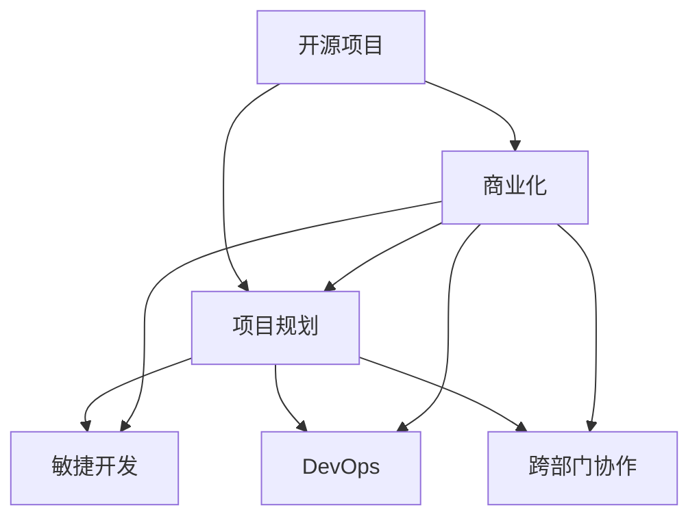

                 

# 开源项目的商业化项目管理：项目规划与执行

> 关键词：开源项目,商业化管理,项目规划,项目管理,敏捷开发,DevOps,跨部门协作

## 1. 背景介绍

### 1.1 问题由来

在当下快速变化的数字化时代，开源项目在软件开发和创新中扮演着越来越重要的角色。然而，许多开源项目在开发和维护过程中，面临着项目规模扩大、需求变动频繁、技术栈复杂化等挑战。如何将开源项目的核心价值转化为商业化的商业模式，同时实现高质量、高效率的项目管理，成为众多开发者和公司共同关心的议题。

### 1.2 问题核心关键点

开源项目的商业化项目管理涉及多个关键问题，包括：
- 如何定义和识别项目的商业价值。
- 如何平衡开源的开放透明与商业化的封闭性。
- 如何在开源社区和商业团队之间实现良好的协作。
- 如何通过敏捷开发和DevOps实践提高项目管理效率。
- 如何确保项目的质量和稳定性。

这些问题构成了开源项目商业化管理的基础框架，需要通过系统化的方法和工具加以解决。

### 1.3 问题研究意义

开源项目商业化管理不仅关系到项目的成功与否，更是公司实现长期价值的重要手段。通过合理的项目管理，可以有效提升开发效率，缩短产品上市时间，增强客户满意度，最终推动企业商业价值的实现。

此外，开源项目的成功商业化，还能促进开源社区的健康发展，推动技术创新，为社会带来更多积极影响。因此，深入研究开源项目商业化项目管理方法，对提升技术产业整体水平具有重要意义。

## 2. 核心概念与联系

### 2.1 核心概念概述

为更好地理解开源项目商业化管理方法，本节将介绍几个关键概念：

- 开源项目(Open Source Project)：指以开源许可证发布的软件项目，其代码和文档公开，允许任何人使用、修改和分发。
- 商业化(Commercialization)：指将开源项目的知识产权转化为商业模式，通过合理的管理和营销手段，实现项目的商业价值。
- 项目规划(Project Planning)：指通过需求分析、风险评估等手段，制定详细的项目实施计划。
- 项目管理(Project Management)：指运用科学的项目管理方法，协调资源，监控进度，确保项目按时、按质、按预算完成。
- 敏捷开发(Agile Development)：一种以用户需求为导向、持续交付为核心的开发方法，强调灵活、快速、协作。
- DevOps：结合开发和运维的跨学科文化和技术，提升软件的交付速度和质量。
- 跨部门协作(Cross-Department Collaboration)：指在软件开发过程中，不同部门（如开发、测试、运维、市场）之间的有效沟通和协作。

这些概念之间的逻辑关系可以通过以下Mermaid流程图来展示：



这个流程图展示了开源项目商业化管理的基本流程：

1. 开源项目通过项目规划、敏捷开发、DevOps和跨部门协作等手段进行管理。
2. 在管理过程中，项目规划、敏捷开发、DevOps和跨部门协作互相配合，确保项目顺利实施。
3. 最终，项目规划、敏捷开发、DevOps和跨部门协作的结合，使得项目能够高效地商业化。

## 3. 核心算法原理 & 具体操作步骤

### 3.1 算法原理概述

开源项目商业化管理，本质上是一个复杂的项目管理过程，涉及多方面的决策和执行。其核心思想是通过系统化的项目管理方法，协调项目资源，确保项目按时、按质、按预算完成。

形式化地，假设开源项目 $P$ 的目标为 $G$，包括时间、成本、质量等关键指标。设 $M$ 为项目管理方法集，则最优管理策略为：

$$
\mathop{\arg\min}_{M} \sum_{i \in G} W_i \times F_i(M)
$$

其中 $W_i$ 为指标 $i$ 的权重，$F_i(M)$ 为项目管理方法 $M$ 对指标 $i$ 的影响函数。在实际应用中，通常使用组合优化、多目标优化等方法来求解上述最优化问题，找到最适合项目的管理方法。

### 3.2 算法步骤详解

开源项目商业化管理的一般流程包括以下几个关键步骤：

**Step 1: 确定项目目标和范围**

- 定义项目愿景、目标和成功标准。
- 识别项目的关键需求和交付物。
- 确定项目的范围，包括功能、非功能需求等。

**Step 2: 制定项目计划**

- 进行需求分析和风险评估，确定项目的可行性。
- 制定详细的时间表和预算计划，包括里程碑和交付阶段。
- 确定项目的质量标准和交付标准。

**Step 3: 实施项目管理**

- 采用敏捷开发和Scrum等敏捷方法，进行迭代开发和持续集成。
- 使用DevOps工具链，实现自动化测试、部署和监控。
- 确保跨部门协作，通过沟通和协作工具，促进信息共享和任务协同。

**Step 4: 监控和评估**

- 定期对项目进度和质量进行监控，确保项目按计划进行。
- 使用指标体系评估项目的绩效，如代码质量、用户满意度等。
- 及时发现和解决项目风险，确保项目顺利进行。

**Step 5: 交付和反馈**

- 根据项目计划，按时交付项目成果。
- 对用户反馈进行收集和分析，持续改进项目。
- 完成项目的评估和复盘，总结经验教训。

以上是开源项目商业化管理的一般流程。在实际应用中，还需要针对具体项目的特点，对各个环节进行优化设计，如改进敏捷开发实践，引入更多的DevOps工具，设计更有效的跨部门协作机制等，以进一步提升项目管理效率。

### 3.3 算法优缺点

开源项目商业化管理方法具有以下优点：
1. 系统化管理：通过明确的项目规划和项目管理方法，确保项目目标的实现。
2. 灵活迭代：采用敏捷开发和Scrum等方法，能够灵活应对需求变化和用户反馈。
3. 自动化提升：通过DevOps工具链，提升开发和运维的效率和质量。
4. 跨部门协同：促进不同部门之间的协作，确保项目的整体协调。
5. 透明化管理：通过开放和透明的项目管理，提升项目的可控性和可信度。

同时，该方法也存在一定的局限性：
1. 依赖人员素质：需要高素质的项目管理人员和开发团队，以确保项目顺利进行。
2. 成本和资源消耗大：高质量的项目管理需要大量的资源投入，可能导致成本上升。
3. 复杂度高：项目管理涉及多方面的决策和执行，容易出现协调和沟通困难。
4. 缺乏灵活性：严格的计划和流程可能导致对变化的响应速度较慢。

尽管存在这些局限性，但就目前而言，开源项目商业化管理方法仍是大规模软件项目开发的重要范式。未来相关研究的重点在于如何进一步降低管理成本，提高项目管理的灵活性和适应性，同时兼顾项目管理的系统性和透明性等因素。

### 3.4 算法应用领域

开源项目商业化管理方法已经在软件开发和创新的多个领域得到了广泛应用，例如：

- 互联网企业：如谷歌、亚马逊、阿里巴巴等，通过开源项目推动技术创新和产品迭代，提升商业竞争力。
- 开源社区：如Apache、Linux等，通过开源项目的商业化管理，实现项目的多样化和可持续发展。
- 技术咨询公司：如Accenture、IBM等，通过开源项目实现技术输出和市场推广。
- 初创企业：通过开源项目积累技术能力和用户基础，实现快速增长。

除了上述这些经典应用外，开源项目商业化管理也被创新性地应用到更多场景中，如平台化运营、生态系统构建、全球协作等，为技术产业发展提供了新的动力。

## 4. 数学模型和公式 & 详细讲解 & 举例说明

### 4.1 数学模型构建

本节将使用数学语言对开源项目商业化管理过程进行更加严格的刻画。

设开源项目 $P$ 的目标为 $G$，包括时间、成本、质量等关键指标。设 $M$ 为项目管理方法集，则项目管理的优化目标是最小化指标差距，即：

$$
\mathop{\arg\min}_{M} \sum_{i \in G} W_i \times |F_i(M) - T_i|
$$

其中 $W_i$ 为指标 $i$ 的权重，$T_i$ 为项目期望达到的目标值。

在实践中，我们通常使用组合优化、多目标优化等方法来求解上述最优化问题。常见的优化方法包括遗传算法、粒子群算法、模拟退火等。

### 4.2 公式推导过程

以下我们以一个具体的项目管理案例为例，推导项目管理方法的选择。

假设项目 $P$ 的目标包括时间 $T$、成本 $C$ 和质量 $Q$，分别有指标 $T_{\text{target}}$、$C_{\text{target}}$ 和 $Q_{\text{target}}$。设项目管理方法 $M$ 能够对这三个指标产生影响，即 $F_M(T)$、$F_M(C)$ 和 $F_M(Q)$。

项目管理方法的选择可以通过求解目标函数：

$$
\mathop{\arg\min}_{M} W_T \times |F_M(T) - T_{\text{target}}| + W_C \times |F_M(C) - C_{\text{target}}| + W_Q \times |F_M(Q) - Q_{\text{target}}|
$$

其中 $W_T$、$W_C$、$W_Q$ 分别为时间、成本和质量的权重，可以基于项目的优先级和重要性进行调整。

通过求解上述最优化问题，可以得到最优的项目管理方法 $M^*$。

### 4.3 案例分析与讲解

假设有一个开源项目 $P$，目标是开发一款安全监控系统。项目组确定了以下三个关键指标：时间 $T$、成本 $C$ 和质量 $Q$。项目组期望在6个月内完成，成本不超过100万，质量达到行业标准。

项目组准备了以下几种项目管理方法：

- Scrum：敏捷开发方法，注重迭代开发和持续集成，适合需求频繁变化的项目。
- Kanban：看板管理方法，适合任务量较大、任务依赖性较低的项目。
- DevOps：结合开发和运维的方法，提升开发和运维的效率和质量。

项目组对这些项目管理方法进行了评估，采用遗传算法求解上述最优化问题，得到最优的项目管理方法 $M^*$ 为Scrum结合DevOps。具体步骤为：

1. 定义每个指标的目标值：$T_{\text{target}}=6$ 个月，$C_{\text{target}}=100$ 万，$Q_{\text{target}}=行业标准$。
2. 对每个项目管理方法的影响进行建模：假设Scrum对时间的影响为 $F_{\text{Scrum}}(T)=\frac{T_{\text{target}}-T}{6}$，对成本和质量的影响为 $F_{\text{Scrum}}(C)=0.8$，$F_{\text{Scrum}}(Q)=0.9$。假设Kanban对时间的影响为 $F_{\text{Kanban}}(T)=\frac{T_{\text{target}}-T}{6}$，对成本和质量的影响为 $F_{\text{Kanban}}(C)=0.9$，$F_{\text{Kanban}}(Q)=0.8$。假设DevOps对时间、成本和质量的影响分别为 $F_{\text{DevOps}}(T)=0.95$、$F_{\text{DevOps}}(C)=0.9$、$F_{\text{DevOps}}(Q)=1$。
3. 对指标进行权重分配：假设时间、成本和质量的权重分别为 $W_T=0.3$、$W_C=0.4$、$W_Q=0.3$。
4. 通过求解目标函数，得到最优项目管理方法 $M^*=(\text{Scrum}, \text{DevOps})$。

项目组最终采用了Scrum结合DevOps的方法，对项目进行了管理。通过采用敏捷开发和DevOps工具，项目组能够及时响应需求变化，提高开发和运维的效率和质量，最终按时、按质、按预算完成了项目。

## 5. 项目实践：代码实例和详细解释说明

### 5.1 开发环境搭建

在进行项目管理实践前，我们需要准备好开发环境。以下是使用JIRA进行开源项目商业化管理的环境配置流程：

1. 安装JIRA：从官网下载并安装JIRA，用于项目管理和任务跟踪。
2. 创建项目：在JIRA中创建项目，并配置项目类型、工作流程、项目负责人等信息。
3. 添加团队：将项目成员添加到JIRA团队，并分配相应的角色和权限。
4. 配置敏捷板：在JIRA中创建敏捷板，用于迭代和任务管理。

完成上述步骤后，即可在JIRA平台上进行项目管理实践。

### 5.2 源代码详细实现

这里我们以一个具体的敏捷开发案例为例，展示如何使用JIRA进行开源项目商业化管理。

**项目背景**：

项目组接到了一个商业客户的需求，需要开发一款企业级云服务管理系统。项目目标是在6个月内完成，成本不超过100万，质量达到行业标准。

**项目规划**：

1. 创建项目：在JIRA中创建一个新项目，名称为"云服务管理系统"，项目类型为敏捷项目，选择Scrum方法。
2. 添加团队成员：将项目成员添加到JIRA团队，并分配相应的角色和权限。
3. 配置敏捷板：在JIRA中创建一个敏捷板，用于迭代和任务管理。

**敏捷开发**：

1. 迭代计划：每个迭代为2周，包含5个故事。每个故事包含详细的任务和责任人，确保任务可控、责任明确。
2. 每日站会：每天早上进行10分钟的站会，确保团队成员了解当天的工作进度和障碍。
3. 持续集成：使用JIRA的持续集成功能，对每个迭代的任务进行持续集成和代码审查。
4. 迭代评审：每个迭代结束时，进行迭代评审，确保任务交付符合预期。

**DevOps实践**：

1. 自动化测试：使用JIRA的自动化测试功能，对每个迭代的任务进行自动化测试，确保代码质量。
2. 持续部署：使用JIRA的持续部署功能，对每个迭代的任务进行持续部署和环境测试。
3. 监控反馈：使用JIRA的监控功能，对代码质量和任务进度进行实时监控，确保项目按时完成。

**项目监控和评估**：

1. 项目跟踪：使用JIRA的项目跟踪功能，实时了解项目进度和任务状态。
2. 风险管理：使用JIRA的风险管理功能，识别和处理项目风险，确保项目顺利进行。
3. 绩效评估：使用JIRA的绩效评估功能，对项目组成员的工作表现进行评估，确保团队高效协作。

完成上述步骤后，即可在JIRA平台上进行项目管理和任务跟踪，实现开源项目的商业化管理。

### 5.3 代码解读与分析

让我们再详细解读一下关键代码的实现细节：

**创建项目**：

```python
from jira import JIRA
jira = JIRA('https://jira.example.com', auth=('user', 'password'))

project_key = 'CloudServiceManagement'
project = jira.create_project(key=project_key, name='Cloud Service Management', type='scrum', projectTemplate=None)
```

**配置敏捷板**：

```python
board_key = 'CloudServiceManagement-1'
board = jira.create_board(key=board_key, name='Cloud Service Management Backlog', project=project)

list_1 = board.create_list(name='Backlog')
list_2 = board.create_list(name='In Progress')
list_3 = board.create_list(name='Done')

board.add_list(list_1)
board.add_list(list_2)
board.add_list(list_3)
```

**迭代计划**：

```python
sprint_key = 'CloudServiceManagement-2'
sprint = jira.create_sprint(key=sprint_key, name='Sprint 2', board=board, start_date='2022-07-01', end_date='2022-07-15')

for i in range(5):
    story_id = f'CloudServiceManagement-STORY-{i+1}'
    issue = jira.create_issue(project=project, summary=f'故事{i+1}', description=f'详细描述故事{i+1}的内容', issuetype='IssueType Story', sprint=sprint)
    task_id = f'CloudServiceManagement-TASK-{i+1}'
    jira.add_subtask(issue, subtask_key=task_id, summary=f'任务{i+1}', description=f'详细描述任务{i+1}的内容')
```

**每日站会**：

```python
for issue in board.all_issues():
    jira.update_field(issue.key, 'Status', 'In Progress')
```

**持续集成**：

```python
for issue in board.all_issues():
    if 'Backlog' in issue.fields['Status']:
        continue
    if 'Code Review' in issue.fields['Status']:
        continue
    jira.add_subtask(issue, subtask_key=f'CloudServiceManagement-CODE_REVIEW-{issue.key}', summary='代码审查', description=f'对任务{issue.key}进行代码审查')
    jira.add_subtask(issue, subtask_key=f'CloudServiceManagement-CONTINUOUS_INTEGRATION-{issue.key}', summary='持续集成', description=f'对任务{issue.key}进行持续集成')
```

**迭代评审**：

```python
for issue in board.all_issues():
    if 'Code Review' in issue.fields['Status']:
        continue
    if 'Done' in issue.fields['Status']:
        continue
    jira.add_subtask(issue, subtask_key=f'CloudServiceManagement-ITERATION_REVIEW-{issue.key}', summary='迭代评审', description=f'对任务{issue.key}进行迭代评审')
```

通过这些代码，可以在JIRA平台上实现敏捷开发和DevOps实践，确保开源项目的商业化管理高效进行。

## 6. 实际应用场景

### 6.1 开源社区

开源社区中，许多大型项目通过商业化管理方法实现了项目的持续发展。例如，Linux基金会通过管理工具如JIRA、Confluence等，对项目进行规划、执行和评估，确保项目按时完成。在实际应用中，社区成员可以根据项目的进展情况，灵活调整管理方法和任务分配，确保项目的整体协调和进度控制。

### 6.2 企业级项目

企业级项目中，商业化管理方法同样具有广泛应用。例如，亚马逊AWS云平台通过敏捷开发和DevOps实践，实现了项目的高效管理和交付。AWS团队采用Scrum和Kanban等敏捷方法，对项目进行迭代开发和持续集成，确保系统稳定可靠。同时，AWS还引入了DevOps工具链，实现了自动化测试、持续部署和实时监控，大幅提高了项目交付效率。

### 6.3 初创企业

初创企业中，商业化管理方法同样是项目成功的关键。例如，GitLab公司通过敏捷开发和DevOps实践，实现了项目的高效管理和快速迭代。GitLab团队采用Scrum和Kanban等敏捷方法，对项目进行迭代开发和持续集成，确保产品按时上线。同时，GitLab还引入了DevOps工具链，实现了自动化测试、持续部署和实时监控，大大提升了产品交付效率和质量。

### 6.4 未来应用展望

随着开源项目商业化管理方法的不断演进，未来将在更多领域得到应用，为技术产业发展提供新的动力。

在智慧医疗领域，开源项目商业化管理可以帮助医院提升运营效率，提高医疗服务的质量。通过敏捷开发和DevOps实践，医院可以实现快速的系统升级和数据整合，提升医疗服务的智能化和自动化水平。

在智能制造领域，开源项目商业化管理可以帮助企业实现生产线自动化和智能化。通过敏捷开发和DevOps实践，企业可以实现系统的快速迭代和部署，提升生产效率和质量。

在城市管理领域，开源项目商业化管理可以帮助政府实现数字化转型。通过敏捷开发和DevOps实践，政府可以实现城市管理的智能化和精细化，提升城市治理水平。

此外，在金融、教育、能源等多个领域，开源项目商业化管理都将发挥重要作用，为技术产业发展注入新的活力。

## 7. 工具和资源推荐

### 7.1 学习资源推荐

为了帮助开发者系统掌握开源项目商业化管理的方法，这里推荐一些优质的学习资源：

1. 《敏捷软件开发实践》一书：详细介绍了敏捷开发的核心原则和方法，是敏捷开发的经典之作。
2. DevOps文化与实践课程：由Udacity开设的课程，介绍了DevOps的核心概念和方法，是DevOps学习的绝佳资源。
3. JIRA官方文档：提供了JIRA的详细使用说明和教程，是JIRA学习的必备资源。
4. GitLab DevOps学习资源：GitLab社区提供了丰富的学习资源，包括文档、教程、课程等，是DevOps学习的宝贵财富。

通过对这些资源的学习实践，相信你一定能够快速掌握开源项目商业化管理的精髓，并用于解决实际的开源项目问题。

### 7.2 开发工具推荐

高效的开发离不开优秀的工具支持。以下是几款用于开源项目商业化管理的常用工具：

1. JIRA：项目管理和任务跟踪工具，支持敏捷开发和DevOps实践，广泛应用于开源项目的管理。
2. Confluence：协作工具，用于文档管理和知识共享，是开源项目团队协作的重要工具。
3. GitLab：代码托管和DevOps工具，支持版本控制、持续集成、持续部署等，广泛应用于开源项目开发。
4. Jenkins：开源的自动化工具，支持持续集成和持续部署，是DevOps实践的重要工具。
5. Docker：容器化技术，支持应用和服务的快速部署和迁移，是DevOps实践的关键工具。

合理利用这些工具，可以显著提升开源项目商业化管理的效率，加快创新迭代的步伐。

### 7.3 相关论文推荐

开源项目商业化管理的发展源于学界的持续研究。以下是几篇奠基性的相关论文，推荐阅读：

1. "Scrum: How to Make Things Right"：Scrum方法的经典著作，详细介绍了Scrum的核心原则和方法。
2. "Continuous Delivery: Automating Software Release and Deployment"：介绍DevOps文化和方法的著名书籍，是DevOps学习的必读书籍。
3. "DevOps: The Maturity Model for Organizational Transformation"：介绍DevOps成熟度模型的经典论文，是理解DevOps的关键文献。
4. "Agile Software Development: Principles, Patterns, and Practices"：介绍敏捷开发核心原则和实践的经典著作，是敏捷开发学习的必读书籍。
5. "The Pragmatic Programmer"：介绍软件开发实践的经典著作，其中包含敏捷开发和DevOps的实践方法。

这些论文代表了大规模软件项目管理的最新发展，通过学习这些前沿成果，可以帮助研究者把握学科前进方向，激发更多的创新灵感。

## 8. 总结：未来发展趋势与挑战

### 8.1 总结

本文对开源项目商业化项目管理方法进行了全面系统的介绍。首先阐述了开源项目和商业化管理的核心概念，明确了项目管理的科学方法和管理框架。其次，从原理到实践，详细讲解了项目管理方法的选择、实施和优化，给出了项目管理的完整代码实例。同时，本文还广泛探讨了项目管理方法在开源社区和商业团队中的应用前景，展示了项目管理方法的重要价值。

通过本文的系统梳理，可以看到，开源项目商业化管理方法不仅涉及项目管理、敏捷开发、DevOps等多个领域，还涵盖了跨部门协作、绩效评估等多个环节。通过合理的项目管理，可以最大化地提升开源项目的商业价值，推动技术产业的快速发展。

### 8.2 未来发展趋势

展望未来，开源项目商业化管理技术将呈现以下几个发展趋势：

1. 敏捷化：随着敏捷开发的普及，越来越多的开源项目采用敏捷方法，实现快速迭代和高效交付。
2. DevOps化：DevOps文化和方法将在开源项目中得到广泛应用，实现开发和运维的紧密结合。
3. 数据化：通过引入数据分析和可视化工具，优化项目管理和绩效评估，提升项目管理效率和质量。
4. 自动化：引入自动化工具和技术，减少手工操作，提升项目管理的效率和可靠性。
5. 跨部门协同：通过跨部门协作工具，促进不同部门之间的沟通和协作，提升项目的整体协调性。

以上趋势凸显了开源项目商业化管理技术的广阔前景。这些方向的探索发展，必将进一步提升开源项目的商业价值和开发效率，为技术产业发展带来新的突破。

### 8.3 面临的挑战

尽管开源项目商业化管理技术已经取得了显著成就，但在实际应用中，仍然面临诸多挑战：

1. 人员素质：需要高素质的项目管理者和开发团队，以确保项目顺利进行。
2. 资源消耗：高质量的项目管理需要大量的资源投入，可能导致成本上升。
3. 复杂度高：项目管理涉及多方面的决策和执行，容易出现协调和沟通困难。
4. 灵活性不足：严格的计划和流程可能导致对变化的响应速度较慢。
5. 技术和工具的选用：需要选择合适的技术和工具，才能实现项目的高效管理和交付。

尽管存在这些挑战，但通过不断优化项目管理方法和引入先进的工具和技术，可以克服这些挑战，实现开源项目的商业化管理。

### 8.4 研究展望

面对开源项目商业化管理所面临的挑战，未来的研究需要在以下几个方面寻求新的突破：

1. 探索更加灵活的项目管理方法：开发更加灵活的项目管理方法，适应需求变化和技术进步。
2. 引入先进的工具和技术：引入先进的项目管理工具和技术，提升项目管理效率和质量。
3. 跨学科融合：将项目管理与软件开发、运维、测试、质量管理等多个学科进行融合，提升项目管理的系统性和协调性。
4. 持续改进和优化：持续改进和优化项目管理方法，提升项目管理效率和效果。
5. 开源项目生态系统的构建：构建开源项目生态系统，促进开源项目和商业项目之间的合作和协同，提升项目的整体价值。

这些研究方向将引领开源项目商业化管理技术的进一步发展，为开源项目和商业项目提供更高效、更灵活、更系统的管理方法，推动技术产业的持续创新和进步。

## 9. 附录：常见问题与解答

**Q1：开源项目商业化管理是否适用于所有项目？**

A: 开源项目商业化管理方法适用于大部分大规模软件项目，特别是那些需要多部门协作、复杂迭代和高质量交付的项目。但对于一些特定领域的项目，如医疗、法律等，需要结合具体的行业特点进行调整。

**Q2：如何选择合适的项目管理方法？**

A: 选择合适的项目管理方法需要考虑项目的特点和需求。一般而言，敏捷开发适合需求频繁变化的项目，DevOps适合需要快速交付和高度自动化的项目。根据项目的具体情况，灵活选择和管理方法，是成功的关键。

**Q3：敏捷开发和DevOps如何进行有效结合？**

A: 敏捷开发和DevOps的有效结合需要引入自动化工具和技术，如持续集成、持续部署、自动化测试等。通过这些工具，实现开发和运维的紧密结合，提高项目交付效率和质量。同时，需要进行跨部门协作，确保开发、测试、运维等环节的高效协同。

**Q4：如何优化项目管理过程？**

A: 项目管理过程的优化需要引入数据分析和可视化工具，对项目进展和绩效进行实时监控和评估。通过数据分析，可以及时发现和解决问题，提升项目管理的效率和效果。同时，需要引入项目管理工具，如JIRA、Confluence等，提升项目管理的系统性和可控性。

**Q5：如何处理项目风险？**

A: 处理项目风险需要建立风险管理体系，识别和评估项目中的风险因素，制定应对策略。通过及时的风险预警和处理，确保项目顺利进行。同时，需要引入敏捷开发方法，灵活应对变化，减少风险带来的影响。

以上问题的答案，展示了开源项目商业化管理方法的实际应用和优化建议，帮助开发者在实际项目中更好地理解和应用项目管理知识。通过合理利用开源项目商业化管理方法，可以实现项目的高效管理和成功交付，推动技术产业的健康发展。总之，开源项目商业化管理方法的实践和优化，是开源项目成功的重要保障。

