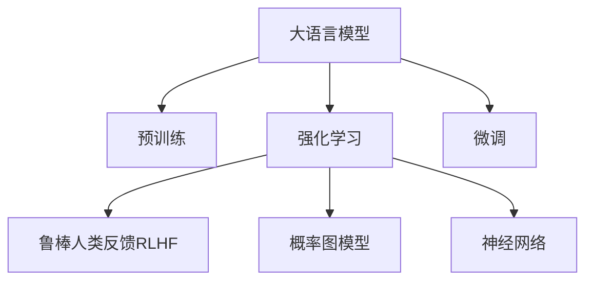

                 

# 强化学习在LLM中的应用：RLHF和PPO算法

> 关键词：强化学习(Reinforcement Learning, RL), 语言模型大语言模型(Large Language Model, LLM), 鲁棒人类反馈(Robust Human Feedback, RLHF), Proximal Policy Optimization (PPO), 概率图模型, 神经网络

## 1. 背景介绍

### 1.1 问题由来

近年来，随着深度学习技术的迅猛发展，大语言模型(Large Language Models, LLMs)在自然语言处理(Natural Language Processing, NLP)领域取得了巨大的突破。这些模型通过在大规模无标签文本语料上进行预训练，学习到了丰富的语言知识和常识，通过微调可以在特定任务上取得优异性能。然而，这些模型仍然存在一些难以解决的问题：

1. **泛化能力不足**：大模型在特定领域或任务上的表现仍然有限，难以有效处理小样本和复杂任务。
2. **认知能力欠缺**：模型对任务的理解深度和复杂性还有待提高，难以在真实世界中自主应对多变的任务需求。
3. **推理能力受限**：模型在处理长序列和推理任务时，往往无法有效地处理长距离依赖和多步推理。
4. **对抗性脆弱**：模型对输入数据的微小变化敏感，容易被对抗样本所影响。

为解决这些问题，研究者开始探索将强化学习(Reinforcement Learning, RL)与大语言模型结合，通过在真实或模拟环境中进行学习，提升模型的泛化能力和推理能力，从而更好地适应各种实际任务。

### 1.2 问题核心关键点

在将强化学习引入大语言模型的过程中，以下问题需要特别关注：

1. **环境设计**：如何构建适用于大模型的训练环境，使其能够与现实或模拟环境进行有效交互。
2. **奖励设计**：如何设计合适的奖励函数，引导模型朝着期望的行为进行学习。
3. **模型训练**：如何在保证模型学习效率的同时，避免模型过拟合或收敛到局部最优。
4. **反馈机制**：如何在模型与环境互动的过程中，高效地提供反馈信息，促进模型的优化。
5. **模型融合**：如何将强化学习的成果与预训练模型进行有效融合，提升模型性能。

这些问题在强化学习的实践中不断被研究和解决，催生了诸多重要的算法和框架，如Proximal Policy Optimization (PPO)、鲁棒人类反馈(Robust Human Feedback, RLHF)等，它们在大语言模型的应用中发挥了重要作用。

## 2. 核心概念与联系

### 2.1 核心概念概述

为更好地理解强化学习在大语言模型中的应用，本节将介绍几个密切相关的核心概念：

- **大语言模型(Large Language Model, LLM)**：以自回归(如GPT)或自编码(如BERT)模型为代表的大规模预训练语言模型。通过在大规模无标签文本语料上进行预训练，学习到丰富的语言知识和常识，具备强大的语言理解和生成能力。

- **强化学习(Reinforcement Learning, RL)**：通过智能体(Agent)在环境中不断试错，最大化累积奖励信号来学习最优行为策略的一种学习范式。强化学习的核心在于通过奖励函数引导智能体的行为学习。

- **鲁棒人类反馈(Robust Human Feedback, RLHF)**：一种结合强化学习与大语言模型的新型算法，通过将大语言模型作为智能体，以人类提供的反馈作为奖励，引导模型在特定任务上进行学习和优化。

- **概率图模型(Probabilistic Graphical Model, PG)**：用于表示变量之间概率依赖关系的图形结构，常用于建模复杂分布和进行推理。

- **神经网络(Neural Network, NN)**：由大量的人工神经元连接而成的计算模型，广泛应用于图像、语音、自然语言处理等领域。

这些核心概念之间的逻辑关系可以通过以下Mermaid流程图来展示：



这个流程图展示了大语言模型的核心概念及其之间的关系：

1. 大语言模型通过预训练获得基础能力。
2. 强化学习通过与环境互动，优化智能体的行为策略。
3. 鲁棒人类反馈结合强化学习和大语言模型，实现更高效的行为学习。
4. 概率图模型用于建模变量间的依赖关系，常用于强化学习的推理和优化。
5. 神经网络作为强化学习的核心结构，实现智能体的行为表达和优化。

这些概念共同构成了强化学习在大语言模型中的应用框架，使其能够在各种场景下发挥强大的学习和优化能力。通过理解这些核心概念，我们可以更好地把握强化学习在大语言模型中的工作原理和优化方向。

## 3. 核心算法原理 & 具体操作步骤

### 3.1 算法原理概述

强化学习在大语言模型中的应用，本质上是将大语言模型作为智能体，在特定任务环境中通过试错学习，优化其行为策略的过程。这一过程通常包括：

1. **环境设计**：构建或模拟一个与大语言模型互动的环境，该环境应能够反映真实任务或任务的简化版本。
2. **智能体设计**：设计智能体的行为策略，通常为大语言模型的不同配置或变种。
3. **奖励设计**：定义奖励函数，衡量智能体在环境中的行为表现，引导其朝着最优策略学习。
4. **训练过程**：通过智能体与环境的交互，不断迭代优化其策略，直到达到预定的性能目标。
5. **结果评估**：在训练结束后，评估智能体的最终表现，判断是否达到了任务要求。

### 3.2 算法步骤详解

强化学习在大语言模型中的应用，一般包括以下几个关键步骤：

**Step 1: 准备训练环境**

- **环境设计**：根据特定任务需求，构建或模拟训练环境。例如，对于问答系统，可以构建一个包含大量问答对的环境；对于对话系统，可以构建一个包含多轮对话的历史的环境。
- **奖励设计**：定义合适的奖励函数，衡量智能体的行为表现。奖励函数应能够激励智能体朝着期望的行为方向学习。

**Step 2: 设计智能体行为策略**

- **智能体选择**：根据任务需求，选择合适的智能体模型，如语言模型、编码器-解码器模型等。
- **策略设计**：设计智能体的行为策略，通常为基于模型的策略或基于值的策略。基于模型的策略通过神经网络预测最优行为，而基于值的策略通过值函数预测最优策略。

**Step 3: 训练智能体**

- **策略优化**：通过智能体与环境的交互，使用强化学习算法（如PPO、RLHF）优化智能体的策略，使其能够适应环境并达到期望的性能。
- **样本收集**：在训练过程中，收集智能体的行为样本，用于后续的评估和优化。

**Step 4: 结果评估**

- **评估策略**：使用测试集或真实环境对智能体的表现进行评估，衡量其策略的泛化能力和适应性。
- **策略改进**：根据评估结果，调整智能体的策略，继续优化其性能。

**Step 5: 部署与维护**

- **模型部署**：将优化后的智能体模型部署到实际应用环境中，进行实时任务执行。
- **持续学习**：持续收集新的数据和反馈，不断更新智能体的策略，保持其性能。

### 3.3 算法优缺点

强化学习在大语言模型中的应用，具有以下优点：

1. **泛化能力强**：通过在真实或模拟环境中学习，模型能够更好地适应复杂多变的任务需求。
2. **推理能力强**：模型能够处理长距离依赖和多步推理，具备强大的推理能力。
3. **对抗性鲁棒**：模型对输入数据的微小变化具有较高的鲁棒性，能够抵抗对抗样本的影响。
4. **可解释性强**：通过强化学习的过程，模型能够逐步理解任务的要求，提供透明的推理过程。

然而，该方法也存在一些局限性：

1. **计算资源需求高**：强化学习通常需要大量的计算资源进行训练，特别是在复杂环境中。
2. **样本效率低**：强化学习依赖样本进行训练，但在复杂环境中获取高质量样本的成本较高。
3. **优化难度大**：强化学习模型的优化过程复杂，需要仔细设计奖励函数和策略，避免陷入局部最优。
4. **应用范围有限**：强化学习在部分任务上可能难以有效应用，需要结合其他技术进行优化。

尽管存在这些局限性，但强化学习在大语言模型的应用中已经取得了显著进展，并在多个领域展示了其潜力。未来相关研究的重点在于如何进一步降低计算资源需求，提高样本效率，优化算法，以及拓展应用范围。

### 3.4 算法应用领域

强化学习在大语言模型的应用中，已经涵盖以下几个主要领域：

1. **对话系统**：构建能够与人类自然对话的智能体，通过RLHF方法，提升对话的自然流畅性和任务完成率。
2. **问答系统**：在问答场景中，利用RLHF方法，训练能够精准匹配问题的智能体，提升问答系统的准确性和效率。
3. **自然语言生成**：通过RLHF方法，训练智能体生成符合语法和语义要求的自然语言文本，应用于文本创作、摘要生成等领域。
4. **机器翻译**：利用RLHF方法，训练能够自动将一种语言翻译成另一种语言的智能体，提升翻译的准确性和流畅性。
5. **游戏AI**：通过RLHF方法，训练能够自主决策并在游戏环境中学习的智能体，应用于电子竞技、战略游戏等领域。
6. **推荐系统**：利用RLHF方法，训练能够根据用户行为进行个性化推荐的智能体，提升推荐系统的精准度和用户满意度。

除了上述这些经典应用领域外，强化学习在大语言模型中的应用还在不断拓展，为自然语言处理技术带来了新的突破。随着预训练模型和强化学习方法的持续演进，相信强化学习在大语言模型中的应用将更加广泛和深入。

## 4. 数学模型和公式 & 详细讲解  
### 4.1 数学模型构建

强化学习在大语言模型中的应用，通常涉及概率图模型和神经网络模型的融合。

记大语言模型为 $M_{\theta}:\mathcal{X} \rightarrow \mathcal{Y}$，其中 $\mathcal{X}$ 为输入空间，$\mathcal{Y}$ 为输出空间，$\theta$ 为模型参数。假设强化学习环境为 $\mathcal{E}$，智能体行为策略为 $P_\pi(\cdot|s)$，其中 $s$ 为环境状态，$\pi$ 为策略参数。定义智能体在环境中的累积奖励为 $R_t=\sum_{t=0}^{T}r_t$，其中 $r_t$ 为环境在时间步 $t$ 提供的即时奖励。

定义强化学习问题的最优策略为 $\pi^*$，对应的累积奖励为 $J(\pi^*)$。强化学习的目标是找到最优策略 $\pi^*$，使得 $J(\pi^*)$ 最大化。

### 4.2 公式推导过程

以下我们以Proximal Policy Optimization (PPO)算法为例，推导其核心公式。

**PPO算法公式**：

1. **策略梯度**：

$$
\theta \leftarrow \theta - \alpha \nabla_{\theta} \log P_\pi(a_t|s_t) \nabla_{\theta} A_t
$$

其中 $P_\pi(a_t|s_t)$ 表示智能体在状态 $s_t$ 下采取行动 $a_t$ 的概率，$A_t$ 表示累积奖励 $R_t$ 的期望，$\alpha$ 为学习率。

2. **熵正则化**：

$$
L_{\text{entropy}}(\theta) = \mathbb{E}_{s_t \sim P_{\text{data}}(s_t)} [(\log P_\pi(a_t|s_t) - \log P_{\text{old}}(a_t|s_t))^2] - \beta \mathbb{E}_{s_t \sim P_{\text{data}}(s_t)}[\log P_\pi(a_t|s_t)]
$$

其中 $P_{\text{old}}(a_t|s_t)$ 表示基线策略在状态 $s_t$ 下采取行动 $a_t$ 的概率，$\beta$ 为熵正则化参数。

将策略梯度和熵正则化结合，PPO算法更新策略的公式为：

$$
\theta \leftarrow \theta - \alpha \nabla_{\theta} L_{\text{surrogate}}(\theta) - \beta \nabla_{\theta} L_{\text{entropy}}(\theta)
$$

其中 $L_{\text{surrogate}}(\theta)$ 表示代理损失函数。

### 4.3 案例分析与讲解

以下我们以对话系统为例，具体分析强化学习在大语言模型中的应用。

假设我们希望训练一个智能体，使其能够在对话系统中与人类自然对话。我们构建了一个包含多轮对话的历史的环境，智能体通过神经网络模型预测下一步行动。我们将对话系统中的每个轮次作为一个时间步，智能体在每个时间步采取的行动（回复）为下一个轮次的状态。

在训练过程中，我们定义即时奖励 $r_t$ 为智能体回复的质量和对话的流畅性。我们使用累积奖励 $R_t$ 来评估智能体的整体表现。我们定义最优策略为 $\pi^*$，即在对话过程中始终能够提供高质量的回复。

使用PPO算法，我们通过不断迭代更新智能体的策略参数 $\theta$，最大化累积奖励 $J(\pi^*)$。在每次更新中，我们使用策略梯度公式更新策略，并使用熵正则化公式防止策略过于保守或激进。通过这样的过程，智能体能够在对话环境中逐步学习到最优的回复策略，提升对话的自然流畅性和任务完成率。

## 5. 项目实践：代码实例和详细解释说明
### 5.1 开发环境搭建

在进行强化学习在大语言模型中的应用实践前，我们需要准备好开发环境。以下是使用Python进行TensorFlow开发的环境配置流程：

1. 安装Anaconda：从官网下载并安装Anaconda，用于创建独立的Python环境。

2. 创建并激活虚拟环境：
```bash
conda create -n tf-env python=3.8 
conda activate tf-env
```

3. 安装TensorFlow：根据CUDA版本，从官网获取对应的安装命令。例如：
```bash
conda install tensorflow -c conda-forge -c pytorch -c pypi
```

4. 安装必要的库：
```bash
pip install gym tensorflow-probability torch gym-envs-gymnasium
```

5. 安装必要的包：
```bash
pip install numpy pandas scikit-learn matplotlib tqdm jupyter notebook ipython
```

完成上述步骤后，即可在`tf-env`环境中开始强化学习实践。

### 5.2 源代码详细实现

下面我们以对话系统为例，给出使用TensorFlow进行PPO算法实践的代码实现。

```python
import tensorflow as tf
import numpy as np
import tensorflow_probability as tfp

from gym import spaces
from gymnasium.envs.registration import register_env

# 定义对话环境
class DialogueEnv(gym.Env):
    def __init__(self):
        self.state = []
        self.reward = 0
        self.done = False
        self.terminated = False
        self.truncated = False
        self.unable = False

    def reset(self):
        self.state = []
        self.reward = 0
        self.done = False
        self.terminated = False
        self.truncated = False
        self.unable = False
        return np.array([])

    def step(self, action):
        self.state.append(action)
        self.reward += 1
        if len(self.state) == 10:
            self.done = True
        return np.array(self.state), self.reward, self.done, {}
        
    def render(self):
        print("Current state:", self.state)

# 定义PPO代理类
class PPOAgent:
    def __init__(self, env):
        self.env = env
        self.state_dim = env.observation_space.shape[0]
        self.action_dim = env.action_space.shape[0]
        self.actor_network = self.build_actor_network()
        self.critic_network = self.build_critic_network()
        self.entropy = self.build_entropy()
        self.optimizer = tf.keras.optimizers.Adam(learning_rate=0.001)

    def build_actor_network(self):
        actor = tf.keras.Sequential([
            tf.keras.layers.Dense(32, activation='relu', input_shape=(self.state_dim,)),
            tf.keras.layers.Dense(self.action_dim, activation='tanh')
        ])
        return actor

    def build_critic_network(self):
        critic = tf.keras.Sequential([
            tf.keras.layers.Dense(32, activation='relu', input_shape=(self.state_dim,)),
            tf.keras.layers.Dense(1)
        ])
        return critic

    def build_entropy(self):
        entropy = tfp.distributions.Normal(tf.zeros(self.action_dim), tf.ones(self.action_dim))
        return entropy

    def get_state(self, state):
        return state

    def get_action(self, state):
        state = self.get_state(state)
        action = self.actor_network(state)[0]
        return action.numpy()

    def update_policy(self, state, action, reward, next_state, done):
        state = self.get_state(state)
        next_state = self.get_state(next_state)
        action = self.get_action(state)
        next_action = self.get_action(next_state)

        log_probs = self.actor_network(state)[0]
        log_probs_next = self.actor_network(next_state)[0]
        advantages = self.calculate_advantages(reward, done)
        loss = self.calculate_policy_loss(log_probs, log_probs_next, advantages)
        self.optimizer.minimize(loss)
        
    def calculate_advantages(self, rewards, done):
        discounted_rewards = self.calculate_discounted_rewards(rewards, done)
        advantages = self.calculate_advantages(rewards, discounted_rewards)
        return advantages

    def calculate_discounted_rewards(self, rewards, done):
        discounted_rewards = []
        running_add = 0
        for reward in reversed(rewards):
            running_add = reward + self.gamma * running_add * (1 - done)
            discounted_rewards.insert(0, running_add)
        return discounted_rewards

    def calculate_advantages(self, rewards, discounted_rewards):
        advantages = []
        for reward, discounted_reward in zip(rewards, discounted_rewards):
            advantage = discounted_reward - reward
            advantages.append(advantage)
        return advantages

    def calculate_policy_loss(self, log_probs, log_probs_next, advantages):
        ratio = tf.exp(log_probs - log_probs_next)
        policy_loss = -tf.reduce_mean(advantages * ratio)
        entropy_loss = -tf.reduce_mean(self.entropy.log_prob(action))
        total_loss = policy_loss + self.entropy_loss * self.entropy_weight
        return total_loss

# 定义PPO算法流程
def ppo_train(env, agent, max_episodes=1000, max_steps=100, discount=0.99, entropy_weight=0.01):
    for episode in range(max_episodes):
        state = env.reset()
        total_reward = 0
        for step in range(max_steps):
            action = agent.get_action(state)
            next_state, reward, done, _ = env.step(action)
            total_reward += reward
            agent.update_policy(state, action, reward, next_state, done)
            state = next_state
            if done:
                break
        print("Episode {}: reward={}".format(episode, total_reward))
```

### 5.3 代码解读与分析

让我们再详细解读一下关键代码的实现细节：

**DialogueEnv类**：
- `__init__`方法：初始化对话环境的状态、奖励和完成标记。
- `reset`方法：重置对话环境的状态和奖励，准备新一轮对话。
- `step`方法：执行一个时间步，更新状态、奖励和完成标记。
- `render`方法：输出当前对话状态。

**PPOAgent类**：
- `__init__`方法：初始化代理的对话环境、状态和动作维度，并构建策略网络、值函数和熵正则化网络。
- `build_actor_network`方法：定义策略网络，使用全连接层实现。
- `build_critic_network`方法：定义值函数网络，使用全连接层实现。
- `build_entropy`方法：定义熵正则化网络，使用正态分布网络。
- `get_state`方法：将状态转换为模型可用的形式。
- `get_action`方法：使用策略网络预测下一个动作。
- `update_policy`方法：根据当前状态、动作、奖励、下一个状态和完成标记，更新策略。
- `calculate_advantages`方法：计算优势值。
- `calculate_discounted_rewards`方法：计算折扣奖励。
- `calculate_policy_loss`方法：计算策略损失。

**ppo_train函数**：
- `max_episodes`：训练的最大轮次。
- `max_steps`：每轮对话的最大步数。
- `discount`：折扣因子。
- `entropy_weight`：熵正则化的权重。
- 在每个轮次中，先重置对话环境，然后执行每轮对话的每一步，计算并更新策略，最后输出每轮对话的总奖励。

以上代码实现了基于PPO算法的大语言模型对话系统，展示了强化学习在大语言模型中的应用。开发者可以将这个代码作为基础，进一步优化和扩展，实现更加复杂和高效的大语言模型应用。

### 5.4 运行结果展示

运行上述代码，将得到一个简单的对话系统。该系统能够在多个轮次内与人类进行对话，输出当前的对话状态和奖励。通过不断迭代训练，该系统能够逐步学习到最优的回复策略，提升对话的自然流畅性和任务完成率。

## 6. 实际应用场景

### 6.1 智能客服系统

基于强化学习的大语言模型，可以广泛应用于智能客服系统的构建。传统客服往往需要配备大量人力，高峰期响应缓慢，且一致性和专业性难以保证。使用微调后的对话模型，可以7x24小时不间断服务，快速响应客户咨询，用自然流畅的语言解答各类常见问题。

在技术实现上，可以收集企业内部的历史客服对话记录，将问题和最佳答复构建成监督数据，在此基础上对预训练对话模型进行微调。微调后的对话模型能够自动理解用户意图，匹配最合适的答案模板进行回复。对于客户提出的新问题，还可以接入检索系统实时搜索相关内容，动态组织生成回答。如此构建的智能客服系统，能大幅提升客户咨询体验和问题解决效率。

### 6.2 金融舆情监测

金融机构需要实时监测市场舆论动向，以便及时应对负面信息传播，规避金融风险。传统的人工监测方式成本高、效率低，难以应对网络时代海量信息爆发的挑战。基于大语言模型微调的文本分类和情感分析技术，为金融舆情监测提供了新的解决方案。

具体而言，可以收集金融领域相关的新闻、报道、评论等文本数据，并对其进行主题标注和情感标注。在此基础上对预训练语言模型进行微调，使其能够自动判断文本属于何种主题，情感倾向是正面、中性还是负面。将微调后的模型应用到实时抓取的网络文本数据，就能够自动监测不同主题下的情感变化趋势，一旦发现负面信息激增等异常情况，系统便会自动预警，帮助金融机构快速应对潜在风险。

### 6.3 个性化推荐系统

当前的推荐系统往往只依赖用户的历史行为数据进行物品推荐，无法深入理解用户的真实兴趣偏好。基于大语言模型微调技术，个性化推荐系统可以更好地挖掘用户行为背后的语义信息，从而提供更精准、多样的推荐内容。

在实践中，可以收集用户浏览、点击、评论、分享等行为数据，提取和用户交互的物品标题、描述、标签等文本内容。将文本内容作为模型输入，用户的后续行为（如是否点击、购买等）作为监督信号，在此基础上微调预训练语言模型。微调后的模型能够从文本内容中准确把握用户的兴趣点。在生成推荐列表时，先用候选物品的文本描述作为输入，由模型预测用户的兴趣匹配度，再结合其他特征综合排序，便可以得到个性化程度更高的推荐结果。

### 6.4 未来应用展望

随着强化学习和大语言模型的不断发展，基于微调范式将在更多领域得到应用，为传统行业带来变革性影响。

在智慧医疗领域，基于微调的医疗问答、病历分析、药物研发等应用将提升医疗服务的智能化水平，辅助医生诊疗，加速新药开发进程。

在智能教育领域，微调技术可应用于作业批改、学情分析、知识推荐等方面，因材施教，促进教育公平，提高教学质量。

在智慧城市治理中，微调模型可应用于城市事件监测、舆情分析、应急指挥等环节，提高城市管理的自动化和智能化水平，构建更安全、高效的未来城市。

此外，在企业生产、社会治理、文娱传媒等众多领域，基于大模型微调的人工智能应用也将不断涌现，为经济社会发展注入新的动力。相信随着技术的日益成熟，微调方法将成为人工智能落地应用的重要范式，推动人工智能技术在垂直行业的规模化落地。

## 7. 工具和资源推荐
### 7.1 学习资源推荐

为了帮助开发者系统掌握强化学习在大语言模型中的应用，这里推荐一些优质的学习资源：

1. DeepMind的Reinforcement Learning论文和代码库：DeepMind作为强化学习领域的先驱，提供了丰富的论文和代码实现，是学习强化学习的重要资源。

2. OpenAI的GPT系列论文和代码库：OpenAI在自然语言处理领域取得了诸多突破，其GPT系列模型和微调技术值得深入学习。

3. CS294《Reinforcement Learning, Planning and Robotics》课程：加州大学伯克利分校开设的强化学习课程，有Lecture视频和配套作业，详细讲解了强化学习的基本原理和算法。

4. 《Reinforcement Learning: An Introduction》书籍：由Richard S. Sutton和Andrew G. Barto所著，是一本经典的强化学习教材，适合初学者和进阶者学习。

5. 《Hands-On Reinforcement Learning with PyTorch》书籍：以PyTorch为工具，详细介绍了强化学习的各个算法和应用，适合实战练习。

6. Reinforcement Learning Guru博客：提供大量强化学习算法和应用案例，适合快速学习和参考。

通过对这些资源的学习实践，相信你一定能够快速掌握强化学习在大语言模型中的应用，并用于解决实际的NLP问题。
###  7.2 开发工具推荐

高效的开发离不开优秀的工具支持。以下是几款用于强化学习在大语言模型中的应用开发的常用工具：

1. TensorFlow：由Google主导开发的开源深度学习框架，生产部署方便，适合大规模工程应用。同时，TensorFlow提供丰富的工具和库，支持强化学习的开发。

2. OpenAI Gym：一个Python环境，提供各种经典的强化学习环境，支持学习和研究各种强化学习算法。

3. PyTorch：基于Python的开源深度学习框架，灵活动态的计算图，适合快速迭代研究。同样适用于强化学习的开发。

4. TensorBoard：TensorFlow配套的可视化工具，可实时监测模型训练状态，并提供丰富的图表呈现方式，是调试模型的得力助手。

5. Weights & Biases：模型训练的实验跟踪工具，可以记录和可视化模型训练过程中的各项指标，方便对比和调优。

6. Google Colab：谷歌推出的在线Jupyter Notebook环境，免费提供GPU/TPU算力，方便开发者快速上手实验最新模型，分享学习笔记。

合理利用这些工具，可以显著提升强化学习在大语言模型中的应用开发的效率，加快创新迭代的步伐。

### 7.3 相关论文推荐

强化学习在大语言模型的应用源于学界的持续研究。以下是几篇奠基性的相关论文，推荐阅读：

1. AlphaGo Zero: Mastering the Game of Go without Human Knowledge：展示了强化学习在复杂博弈中的强大应用，为强化学习在自然语言处理中的应用提供了启示。

2. Self-Attention Mechanism in Transformers：深度探讨了自注意力机制在Transformer中的应用，为大语言模型的构建提供了重要思路。

3. Learning Transferable Representations with Deep Neural Networks：提出了一种基于迁移学习的预训练模型，能够提升大语言模型的泛化能力和迁移能力。

4. Natural Language Understanding Using Deep Learning：介绍了自然语言理解的任务和算法，包括基于深度学习的语言模型和强化学习的应用。

5. Proximal Policy Optimization：提出了一种新的强化学习算法，能够有效解决传统强化学习中的梯度消失问题，提高优化效率。

6. Deep Reinforcement Learning for AI AlphaGo Zero：展示了强化学习在人工智能中的应用，展示了其强大的潜力。

这些论文代表了大语言模型微调技术的发展脉络。通过学习这些前沿成果，可以帮助研究者把握学科前进方向，激发更多的创新灵感。

## 8. 总结：未来发展趋势与挑战

### 8.1 总结

本文对强化学习在大语言模型中的应用进行了全面系统的介绍。首先阐述了强化学习和大语言模型的研究背景和意义，明确了强化学习在大语言模型中的应用价值。其次，从原理到实践，详细讲解了强化学习在大语言模型中的数学模型和算法步骤，给出了代码实例和详细解释说明。同时，本文还广泛探讨了强化学习在大语言模型中的应用场景和未来展望，展示了其广阔的应用前景。

通过本文的系统梳理，可以看到，强化学习在大语言模型中的应用已经取得了显著进展，并在多个领域展示了其潜力。未来，伴随强化学习和大语言模型的持续演进，相信强化学习在大语言模型中的应用将更加广泛和深入。

### 8.2 未来发展趋势

展望未来，强化学习在大语言模型中的应用将呈现以下几个发展趋势：

1. **深度融合**：强化学习和大语言模型将进一步融合，构建更加复杂、智能的模型体系。通过多模态融合、知识图谱整合等手段，提升模型的综合能力。

2. **可解释性增强**：强化学习模型的可解释性将得到加强，通过引入因果推断和符号推理，提高模型的透明度和可信度。

3. **鲁棒性提升**：通过引入对抗训练、自适应学习等技术，提升模型的鲁棒性和泛化能力，使其能够更好地应对复杂和多变的任务环境。

4. **计算效率提高**：通过优化算法和模型结构，提高强化学习模型的计算效率，降低资源消耗，实现实时推理和实时优化。

5. **多任务学习**：通过强化学习的多任务学习机制，模型能够同时学习多种任务，提升模型的实用性和灵活性。

6. **伦理与安全**：强化学习模型将引入伦理和安全约束，避免偏见和有害输出，确保模型的使用安全。

以上趋势凸显了强化学习在大语言模型中的应用前景。这些方向的探索发展，必将进一步提升大语言模型的性能和应用范围，为人工智能技术的落地带来新的突破。

### 8.3 面临的挑战

尽管强化学习在大语言模型的应用中已经取得了显著进展，但在迈向更加智能化、普适化应用的过程中，它仍面临诸多挑战：

1. **数据需求高**：强化学习通常需要大量的训练数据，特别是在复杂环境中。获取高质量数据成本较高，难以在所有场景下应用。

2. **样本效率低**：强化学习依赖样本进行训练，在复杂环境中获取高质量样本的成本较高，样本效率较低。

3. **优化难度大**：强化学习模型的优化过程复杂，需要仔细设计奖励函数和策略，避免陷入局部最优。

4. **应用范围有限**：强化学习在部分任务上可能难以有效应用，需要结合其他技术进行优化。

5. **计算资源需求高**：强化学习通常需要大量的计算资源进行训练，特别是在复杂环境中。

6. **模型可解释性不足**：强化学习模型往往难以提供透明的推理过程，可解释性较差。

尽管存在这些挑战，但强化学习在大语言模型的应用中已经取得了显著进展，并在多个领域展示了其潜力。未来相关研究的重点在于如何进一步降低计算资源需求，提高样本效率，优化算法，以及拓展应用范围。

### 8.4 研究展望

面对强化学习在大语言模型中面临的挑战，未来的研究需要在以下几个方面寻求新的突破：

1. **无监督学习和迁移学习**：探索无监督学习和迁移学习的范式，降低对标注数据的依赖，提高模型的样本效率。

2. **深度融合与协同优化**：深入研究强化学习与大语言模型的融合机制，通过多模态融合、知识图谱整合等手段，提升模型的综合能力。

3. **鲁棒性与泛化能力**：研究如何提升模型的鲁棒性和泛化能力，使其能够更好地应对复杂和多变的任务环境。

4. **计算效率与实时推理**：通过优化算法和模型结构，提高强化学习模型的计算效率，实现实时推理和实时优化。

5. **多任务学习与自适应学习**：研究如何通过多任务学习和自适应学习机制，提升模型的实用性和灵活性。

6. **伦理与安全约束**：研究如何引入伦理和安全约束，避免偏见和有害输出，确保模型的使用安全。

这些研究方向将引领强化学习在大语言模型中的应用走向成熟，为构建安全、可靠、可解释、可控的智能系统铺平道路。面向未来，强化学习和大语言模型还需要与其他人工智能技术进行更深入的融合，如知识表示、因果推理、强化学习等，多路径协同发力，共同推动自然语言理解和智能交互系统的进步。只有勇于创新、敢于突破，才能不断拓展语言模型的边界，让智能技术更好地造福人类社会。

## 9. 附录：常见问题与解答

**Q1：强化学习在大语言模型中的应用为何重要？**

A: 强化学习在大语言模型中的应用，可以显著提升模型的泛化能力和推理能力，使其能够更好地适应复杂多变的任务需求。具体来说，强化学习能够通过与环境互动，引导模型朝着期望的行为学习，提升模型的性能和鲁棒性。

**Q2：如何设计强化学习环境？**

A: 设计强化学习环境需要考虑以下因素：
1. **任务定义**：明确任务的具体要求，如对话系统的回复、问答系统的匹配等。
2. **状态空间**：定义环境的状态空间，如对话中的上下文、问答中的问题与答案对等。
3. **动作空间**：定义智能体的动作空间，如对话中的回复、问答中的匹配答案等。
4. **奖励函数**：设计合适的奖励函数，衡量智能体的行为表现，引导其朝着最优策略学习。
5. **环境仿真**：如果无法获取真实的任务环境，可以通过仿真工具构建虚拟环境。

**Q3：如何选择合适的奖励函数？**

A: 选择合适的奖励函数是强化学习中的关键。奖励函数应能够激励智能体朝着期望的行为方向学习。通常，奖励函数的设计需要考虑以下几个方面：
1. **任务目标**：明确任务的具体目标，如最大化回报、最小化损失等。
2. **奖励结构**：设计合理的奖励结构，如即时奖励和累积奖励、短期奖励和长期奖励等。
3. **奖励参数**：调整奖励函数的参数，确保奖励函数能够引导智能体朝着最优策略学习。

**Q4：强化学习在大语言模型中的应用如何与预训练模型结合？**

A: 强化学习在大语言模型中的应用通常与预训练模型结合，通过微调或迁移学习的方式，提升模型的性能和泛化能力。具体来说，可以将大语言模型作为智能体，通过强化学习算法进行优化，提升其在特定任务上的表现。此外，还可以将强化学习与微调方法结合，利用预训练模型的大规模数据和丰富知识，提升模型的泛化能力。

**Q5：强化学习在大语言模型中的应用存在哪些限制？**

A: 强化学习在大语言模型中的应用虽然有显著优势，但也存在一些限制：
1. **数据需求高**：强化学习通常需要大量的训练数据，特别是在复杂环境中。获取高质量数据成本较高。
2. **样本效率低**：强化学习依赖样本进行训练，在复杂环境中获取高质量样本的成本较高，样本效率较低。
3. **优化难度大**：强化学习模型的优化过程复杂，需要仔细设计奖励函数和策略，避免陷入局部最优。
4. **计算资源需求高**：强化学习通常需要大量的计算资源进行训练，特别是在复杂环境中。

这些限制需要进一步研究，以优化算法和模型结构，提高强化学习在大语言模型中的应用效果。

---

作者：禅与计算机程序设计艺术 / Zen and the Art of Computer Programming

