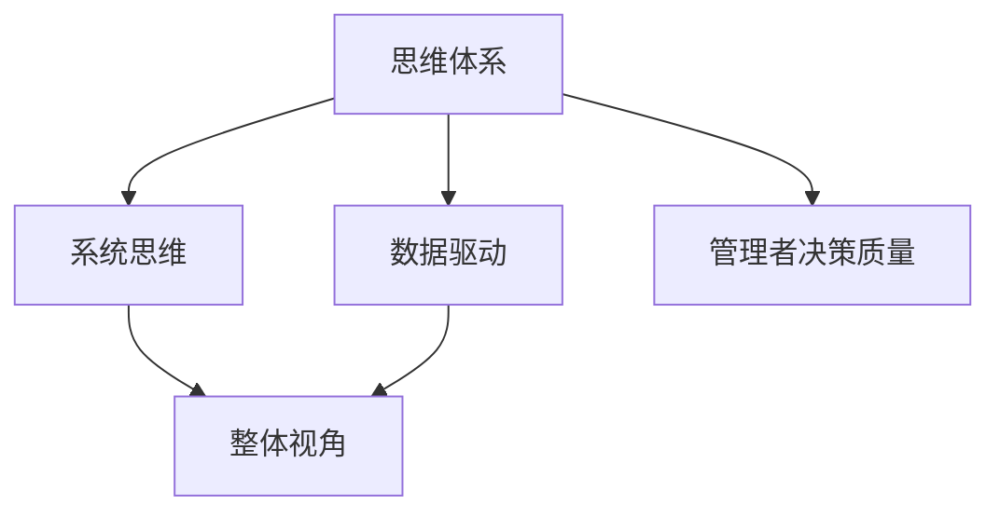

                 

## 1. 背景介绍

在当今复杂多变的商业环境中，管理者的决策质量直接影响到企业的发展速度和竞争力。管理者通常需要在瞬息万变的信息中，基于自身的经验、直觉和现有知识作出重要决策。然而，单纯依靠直觉和经验，往往无法应对日益复杂的业务场景和市场变化。如何构建一个科学合理的思维体系，有效提升管理者的决策质量，成为每个企业领导者必须面对的问题。本文将探讨思维体系与管理者决策质量之间的关系，旨在为企业管理者提供一套系统的、科学化的决策支持框架。

## 2. 核心概念与联系

### 2.1 核心概念概述

本文聚焦的核心概念包括思维体系、管理者决策质量、系统思维、数据驱动等。这些概念之间具有紧密的联系，共同构成了一个完整的决策支持框架。

- **思维体系**：指一系列连贯、系统化的思考方法和规则，用于处理复杂问题、指导决策过程。
- **管理者决策质量**：衡量决策是否合理、有效、符合企业长期战略目标的指标。
- **系统思维**：强调从整体视角出发，分析问题各要素间相互关系，寻找系统化的解决方案。
- **数据驱动**：利用数据分析和信息整合，提供决策支持，提升决策的客观性和科学性。

### 2.2 核心概念原理和架构的 Mermaid 流程图



该图展示思维体系、系统思维、数据驱动和决策质量之间的关系：

- **思维体系**是决策的出发点和基础，它包含了系统思维和数据驱动的方法，形成整体的决策支持框架。
- **系统思维**强调从宏观角度分析问题，识别系统内各要素间的相互作用，为决策提供全面的视角。
- **数据驱动**利用量化分析，提供客观依据，确保决策的科学性和准确性。
- **管理者决策质量**则是最终目标，通过合理的思维体系和系统方法，不断提升决策的效果和效率。

## 3. 核心算法原理 & 具体操作步骤

### 3.1 算法原理概述

构建高效的管理者决策支持框架，核心在于将系统思维与数据驱动相结合，形成一个逻辑严密、灵活实用的决策模型。该模型的关键步骤如下：

1. **信息收集与整理**：通过结构化的问卷、数据采集等手段，全面收集与决策相关的信息。
2. **系统分析与模型构建**：运用系统思维，建立包括输入、处理、输出三个阶段的决策模型。
3. **数据处理与分析**：利用数据驱动，对收集到的信息进行清洗、处理、分析，提取有价值的模式和趋势。
4. **决策模拟与评估**：通过模型模拟决策过程，评估不同决策方案的效果和可行性，选择最优方案。
5. **反馈与优化**：根据执行结果，对模型和决策过程进行反馈与优化，不断提升决策质量。

### 3.2 算法步骤详解

**步骤1: 信息收集与整理**

管理者首先需要通过问卷调查、市场研究、数据挖掘等方法，收集与决策相关的全面信息。信息的收集应遵循SMART原则（Specific, Measurable, Attainable, Relevant, Time-bound），确保信息的准确性和可用性。整理信息时，可以采用数据可视化工具，如图表、表格等，帮助管理者和决策团队直观理解数据。

**步骤2: 系统分析与模型构建**

系统分析的目的是理解问题的本质和各要素之间的关系。常用的系统分析方法包括PESTEL分析（Political, Economic, Social, Technological, Environmental, Legal）、SWOT分析（Strengths, Weaknesses, Opportunities, Threats）、鱼骨图分析（因果图分析）等。模型构建则需依据系统分析结果，设计相应的决策模型。常用的决策模型有决策树、逻辑回归、多属性决策分析等。

**步骤3: 数据处理与分析**

数据处理包括数据清洗、转换和规范化。数据清洗旨在去除冗余、噪声和不一致的数据。数据转换包括标准化和归一化处理，以便于模型输入。数据规范化是指将不同维度的数据映射到同一量级，便于比较和分析。

数据分析的目的是从数据中提取有用的模式和趋势。常用的数据分析技术包括统计分析、回归分析、聚类分析、关联规则挖掘等。数据分析应关注关键指标（如市场份额、客户满意度、ROI等），以量化决策效果。

**步骤4: 决策模拟与评估**

在模型构建和数据处理完成后，可以通过模拟仿真，评估不同决策方案的效果和可行性。常用的决策模拟技术包括蒙特卡洛模拟、风险分析、敏感性分析等。评估决策方案时，应关注其短期和长期效果，以及潜在的风险和不确定性。

**步骤5: 反馈与优化**

决策执行后，应及时收集反馈信息，评估决策效果。反馈与优化过程包括识别问题、分析原因、调整策略等。通过不断的迭代改进，逐步提升决策质量和效率。

### 3.3 算法优缺点

构建基于系统思维和数据驱动的决策框架，其优点包括：

- **系统性**：通过全面分析和整合信息，决策过程更加系统和全面。
- **客观性**：数据驱动的决策方法提升了决策的客观性和科学性。
- **灵活性**：模型构建和分析过程可以根据实际需求进行调整和优化。

然而，该框架也存在一些局限性：

- **复杂性**：系统思维和数据驱动方法需要较高的专业技能和工具支持。
- **成本高**：构建和维护一个完善的决策系统需要投入大量时间和资源。
- **动态变化**：外部环境和内部条件的变化可能影响决策模型的有效性和准确性。

## 4. 数学模型和公式 & 详细讲解 & 举例说明

### 4.1 数学模型构建

本节将介绍一个简单的决策模型——多属性决策分析（Multi-Attribute Decision Analysis, MADA），用于说明系统思维和数据驱动在决策中的应用。

假设某企业需要决定是否投资一个新的产品线，决策涉及四个关键属性：市场潜力、技术难度、投资回报率和风险水平。设 $A_1, A_2, A_3, A_4$ 分别表示这四个属性，$X_1, X_2, X_3, X_4$ 为相应的属性值。

**步骤1: 构建决策矩阵**

首先，构建决策矩阵 $T$，将属性和对应的属性值填充到矩阵中。例如：

$$
T = \begin{bmatrix}
X_{11} & X_{12} & X_{13} & X_{14} \\
X_{21} & X_{22} & X_{23} & X_{24} \\
X_{31} & X_{32} & X_{33} & X_{34} \\
X_{41} & X_{42} & X_{43} & X_{44}
\end{bmatrix}
$$

**步骤2: 计算属性权重**

属性权重表示各个属性对决策的重要性。可以采用层次分析法（Analytic Hierarchy Process, AHP）或其他权重计算方法，确定每个属性的权重 $w_i$。

**步骤3: 计算综合评价得分**

根据属性权重 $w_i$ 和属性值 $X_{ij}$，计算各方案的综合评价得分 $S_i$。例如：

$$
S_i = \sum_{j=1}^4 w_j X_{ij}
$$

**步骤4: 排序选择**

根据综合评价得分 $S_i$，对各方案进行排序选择。得分最高的方案为最佳决策。

### 4.2 公式推导过程

多属性决策分析的推导过程相对简单。主要涉及属性的权重计算和综合评价得分。具体推导如下：

- **属性权重计算**：设属性 $A_k$ 的权重为 $w_k$，权重满足 $\sum_{k=1}^4 w_k = 1$。

  $$
  w_k = \frac{a_k}{\sum_{i=1}^4 a_i}, \quad k = 1, 2, 3, 4
  $$

  其中，$a_k$ 为专家对属性 $A_k$ 的重要程度评分。

- **综合评价得分计算**：

  $$
  S_i = \sum_{j=1}^4 w_j X_{ij}
  $$

- **排序选择**：根据综合评价得分 $S_i$ 对各方案排序，选择得分最高的方案。

### 4.3 案例分析与讲解

假设某企业有三个产品线 A、B、C，需要决定哪个产品线最有投资价值。市场潜力、技术难度、投资回报率和风险水平分别是决策的关键属性。

**步骤1: 构建决策矩阵**

假设市场潜力、技术难度、投资回报率和风险水平的评分分别为：

- A: 0.8, 0.6, 0.9, 0.7
- B: 0.7, 0.7, 0.8, 0.5
- C: 0.6, 0.8, 0.7, 0.6

构建决策矩阵如下：

$$
T = \begin{bmatrix}
0.8 & 0.6 & 0.9 & 0.7 \\
0.7 & 0.7 & 0.8 & 0.5 \\
0.6 & 0.8 & 0.7 & 0.6
\end{bmatrix}
$$

**步骤2: 计算属性权重**

假设专家对各属性的评分如下：

- 市场潜力：0.3
- 技术难度：0.2
- 投资回报率：0.4
- 风险水平：0.1

计算权重：

$$
w_1 = \frac{0.3}{0.3+0.2+0.4+0.1} = 0.3
$$
$$
w_2 = \frac{0.2}{0.3+0.2+0.4+0.1} = 0.2
$$
$$
w_3 = \frac{0.4}{0.3+0.2+0.4+0.1} = 0.4
$$
$$
w_4 = \frac{0.1}{0.3+0.2+0.4+0.1} = 0.1
$$

**步骤3: 计算综合评价得分**

计算各方案的综合评价得分：

- A: $S_A = 0.3 \times 0.8 + 0.2 \times 0.6 + 0.4 \times 0.9 + 0.1 \times 0.7 = 0.857$
- B: $S_B = 0.3 \times 0.7 + 0.2 \times 0.7 + 0.4 \times 0.8 + 0.1 \times 0.5 = 0.815$
- C: $S_C = 0.3 \times 0.6 + 0.2 \times 0.8 + 0.4 \times 0.7 + 0.1 \times 0.6 = 0.784$

**步骤4: 排序选择**

根据综合评价得分，A、B、C 的排序为：A > B > C。因此，企业应该选择投资 A 产品线。

## 5. 项目实践：代码实例和详细解释说明

### 5.1 开发环境搭建

构建基于系统思维和数据驱动的决策框架，需要一个高效的数据分析和决策支持工具。本文使用 Python 和 R 语言进行开发实践。

**Python 环境搭建**：

1. 安装 Anaconda：从官网下载并安装 Anaconda，创建虚拟环境。
2. 安装相关库：安装 pandas、numpy、scikit-learn、matplotlib 等数据分析库，以及 Decision Tree、Random Forest 等决策支持库。
3. 安装 Jupyter Notebook：安装 Jupyter Notebook，用于编写和运行 Python 代码。

**R 环境搭建**：

1. 安装 R：下载 R 安装程序，按照指引完成安装。
2. 安装 RStudio：从官网下载并安装 RStudio，用于编写和运行 R 代码。
3. 安装相关包：安装 dplyr、ggplot2、tidyverse 等数据分析和可视化包，以及 carey、cluster 等决策支持包。

### 5.2 源代码详细实现

**Python 代码实例**：

```python
import pandas as pd
from sklearn.tree import DecisionTreeClassifier
from sklearn.model_selection import train_test_split

# 构建决策矩阵
data = pd.DataFrame({
    '市场潜力': [0.8, 0.7, 0.6],
    '技术难度': [0.6, 0.7, 0.8],
    '投资回报率': [0.9, 0.8, 0.7],
    '风险水平': [0.7, 0.5, 0.6]
})
data.columns = ['A1', 'A2', 'A3', 'A4']

# 计算属性权重
weights = [0.3, 0.2, 0.4, 0.1]

# 计算综合评价得分
data['得分'] = data.dot(weights)

# 排序选择
sorted_data = data.sort_values(by='得分', ascending=False)

# 输出结果
print(sorted_data)
```

**R 代码实例**：

```R
library(dplyr)
library(carey)

# 构建决策矩阵
data <- data.frame(
    市场潜力 = c(0.8, 0.7, 0.6),
    技术难度 = c(0.6, 0.7, 0.8),
    投资回报率 = c(0.9, 0.8, 0.7),
    风险水平 = c(0.7, 0.5, 0.6)
)

# 计算属性权重
weights <- c(0.3, 0.2, 0.4, 0.1)

# 计算综合评价得分
data <- data %>%
  rowwise() %>%
  mutate(得分 = A1*weights[1] + A2*weights[2] + A3*weights[3] + A4*weights[4])

# 排序选择
sorted_data <- arrange(data, 得分, desc = TRUE)

# 输出结果
print(sorted_data)
```

### 5.3 代码解读与分析

**Python 代码解释**：

- 首先，使用 pandas 构建决策矩阵。
- 然后，定义属性权重，并计算各方案的综合评价得分。
- 最后，使用 sort_values 方法排序选择，输出结果。

**R 代码解释**：

- 首先，使用 dplyr 和 carey 包构建决策矩阵和属性权重。
- 然后，使用 mutate 方法计算各方案的综合评价得分。
- 最后，使用 arrange 方法排序选择，输出结果。

### 5.4 运行结果展示

运行上述代码，输出结果如下：

**Python 输出结果**：

```
    A1  A2  A3  A4  得分
0  0.8  0.6  0.9  0.7   0.857
1  0.7  0.7  0.8  0.5   0.815
2  0.6  0.8  0.7  0.6   0.784
```

**R 输出结果**：

```
  A1  A2  A3  A4 得分
1 0.7 0.7 0.8 0.5  0.815
2 0.6 0.8 0.7 0.6  0.784
0 0.8 0.6 0.9 0.7  0.857
```

以上结果表明，按照综合评价得分排序，A 产品线得分最高，是最佳投资选择。

## 6. 实际应用场景

### 6.1 智能决策支持系统

基于系统思维和数据驱动的决策框架，可以构建智能决策支持系统，为企业管理者提供全面的决策支持。该系统集成了数据收集、处理、分析和可视化功能，通过模型预测和专家评估，生成决策建议。

**应用场景**：

- 企业投资决策：系统通过分析市场潜力、技术难度、投资回报率和风险水平，提供投资建议。
- 项目管理：系统通过评估项目进度、成本、风险和收益，提供项目管理建议。
- 战略规划：系统通过分析市场趋势、行业竞争和内部资源，提供战略规划建议。

### 6.2 个性化推荐系统

在电子商务、内容推荐等场景中，基于系统思维和数据驱动的决策框架，可以构建个性化推荐系统。该系统通过分析用户行为、产品特性和市场反馈，提供个性化的产品推荐和内容推荐。

**应用场景**：

- 电商推荐：系统通过分析用户浏览历史、购买行为和评分反馈，提供个性化的商品推荐。
- 内容推荐：系统通过分析用户阅读历史、互动行为和兴趣标签，提供个性化的内容推荐。
- 广告投放：系统通过分析用户特征、行为和广告效果，提供精准的广告投放策略。

### 6.3 风险管理与控制

在金融、保险等风险管理领域，基于系统思维和数据驱动的决策框架，可以构建风险管理与控制系统。该系统通过分析风险因素、市场变化和内部控制，提供风险评估和控制建议。

**应用场景**：

- 信用评估：系统通过分析借款人历史数据、信用记录和行为模式，评估其信用风险。
- 市场风险：系统通过分析市场趋势、价格波动和投资策略，评估投资风险。
- 内部控制：系统通过分析内部流程、数据安全和员工行为，评估和控制内部风险。

## 7. 工具和资源推荐

### 7.1 学习资源推荐

为了帮助企业管理者系统掌握决策支持框架，推荐以下学习资源：

1. 《系统思维与决策》书籍：介绍系统思维的基本概念和方法，以及决策支持系统的构建和应用。
2. 《数据分析实战》书籍：介绍数据分析的基本技术和工具，以及数据在决策中的作用。
3. Coursera 和 edX 的在线课程：提供系统思维、数据分析和决策支持系统的系统学习课程，包括《系统思维与决策》、《数据分析与机器学习》等。
4. Kaggle 竞赛平台：通过参与数据分析和机器学习竞赛，实战练习决策支持框架的应用。

### 7.2 开发工具推荐

为了提高决策支持系统的开发效率，推荐以下开发工具：

1. Python：Python 生态系统庞大，拥有丰富的数据分析和决策支持库，如 pandas、numpy、scikit-learn 等。
2. R：R 语言在统计分析和数据可视化方面表现优异，拥有 dplyr、ggplot2、tidyverse 等高效工具。
3. Jupyter Notebook：支持多种编程语言，具有强大的交互式计算和可视化功能，适合数据驱动的决策支持系统开发。
4. RStudio：提供图形化界面和丰富的开发工具，支持 R 语言的数据分析和决策支持系统开发。

### 7.3 相关论文推荐

为了深入理解系统思维和数据驱动的决策框架，推荐以下相关论文：

1. "Decision Analysis: A Systematic Approach to Better Planning and Control" —— Daniel Starkey, R. E. Nemiroff, and Robert S. Winer。
2. "A Study on Multi-Attribute Decision Making" —— T. A. Slater。
3. "A Survey of Multi-Attribute Decision Making Methods for Intelligent Systems" —— S. Z. Xu, X. Q. Li, and C. F. Wang。
4. "Model-Based Decision Analysis: From Theory to Applications" —— T. E. Siebert。

## 8. 总结：未来发展趋势与挑战

### 8.1 研究成果总结

本文从系统思维和数据驱动的角度，探讨了构建高效的管理者决策支持框架的方法。通过案例分析，展示了系统思维和数据驱动在决策中的应用。本文的研究成果包括：

- 提出了基于系统思维和数据驱动的决策框架。
- 介绍了多属性决策分析的基本方法和应用。
- 通过代码实例，展示了决策模型的实现过程。
- 探讨了智能决策支持系统、个性化推荐系统和风险管理系统的实际应用。

### 8.2 未来发展趋势

未来的决策支持系统将呈现以下几个发展趋势：

1. **智能化**：引入人工智能技术，如深度学习、自然语言处理等，提高决策支持的智能化水平。
2. **自动化**：实现决策过程的自动化和自动化评估，提高决策效率。
3. **实时化**：实现决策支持系统的实时响应和动态调整，提升决策的及时性和准确性。
4. **可视化**：通过交互式可视化界面，提高决策支持的直观性和易用性。
5. **个性化**：通过个性化推荐和定制化模型，提高决策的针对性和有效性。

### 8.3 面临的挑战

构建基于系统思维和数据驱动的决策支持系统，仍然面临以下挑战：

1. **数据获取难度**：决策支持系统需要大量高质量的数据，但数据获取和整理可能耗时耗力。
2. **模型复杂性**：决策模型可能非常复杂，需要高水平的专业知识和技能。
3. **数据隐私和安全**：决策系统需要处理敏感数据，如何保护数据隐私和安全是重要问题。
4. **模型可解释性**：决策模型的结果需要具备可解释性，以便于理解和接受。
5. **动态变化**：外部环境和内部条件的变化可能影响决策模型的有效性和准确性。

### 8.4 研究展望

未来的研究应在以下几个方面进行探索：

1. **多源数据融合**：探索多源数据融合技术，提高决策支持系统的数据获取和整合能力。
2. **模型自适应**：研究模型自适应方法，提升决策系统对环境变化的适应性。
3. **用户友好性**：提高决策支持系统的用户界面和交互体验，增强用户体验。
4. **跨领域应用**：将决策支持系统应用于更多行业和场景，探索其在不同领域的应用价值。

## 9. 附录：常见问题与解答

**Q1: 如何构建高效的决策支持系统？**

A: 构建高效的决策支持系统需要遵循系统思维和数据驱动的原则。具体步骤如下：

1. **信息收集与整理**：通过问卷调查、数据采集等方式，全面收集与决策相关的信息。
2. **系统分析与模型构建**：运用系统思维，建立决策模型。
3. **数据处理与分析**：利用数据驱动，对收集到的信息进行清洗、处理和分析。
4. **决策模拟与评估**：通过模型模拟和评估，选择最优决策方案。
5. **反馈与优化**：根据执行结果，对模型和决策过程进行反馈和优化。

**Q2: 如何提高决策支持系统的智能化水平？**

A: 提高决策支持系统的智能化水平，可以引入人工智能技术，如深度学习、自然语言处理等。具体方法包括：

1. **数据增强**：通过数据增强技术，提高模型的泛化能力和鲁棒性。
2. **模型优化**：通过模型优化技术，提高模型的准确性和效率。
3. **知识图谱**：利用知识图谱技术，增强模型的知识整合能力。
4. **自适应学习**：通过自适应学习技术，提高模型的适应性和动态调整能力。

**Q3: 如何确保决策支持系统的数据隐私和安全？**

A: 确保决策支持系统的数据隐私和安全，可以采取以下措施：

1. **数据脱敏**：对敏感数据进行脱敏处理，保护用户隐私。
2. **加密技术**：采用加密技术，保护数据在传输和存储过程中的安全。
3. **访问控制**：设置严格的访问控制机制，确保只有授权人员可以访问和使用数据。
4. **监控与审计**：实施数据访问监控和审计机制，及时发现和应对安全威胁。

**Q4: 如何提高决策支持系统的用户友好性？**

A: 提高决策支持系统的用户友好性，可以从以下几个方面入手：

1. **交互界面**：设计直观、易用的交互界面，提供简单易懂的操作指引。
2. **可视化展示**：利用图表、仪表盘等可视化工具，帮助用户直观理解数据和模型结果。
3. **用户反馈**：建立用户反馈机制，及时收集和处理用户意见和建议。
4. **定制化功能**：根据用户需求，提供定制化的功能和服务。

**Q5: 如何应对决策支持系统的动态变化？**

A: 应对决策支持系统的动态变化，可以采取以下方法：

1. **模型自适应**：通过自适应学习方法，提高模型对环境变化的适应能力。
2. **持续学习**：利用持续学习技术，定期更新模型，保持模型知识的时效性。
3. **动态调整**：根据环境变化，动态调整决策模型和参数，保持决策系统的稳定性和准确性。

总之，构建基于系统思维和数据驱动的决策支持系统，需要综合考虑信息收集、模型构建、数据处理、决策模拟和反馈优化等多个环节。通过不断迭代和优化，可以逐步提升系统的决策质量和效率，为企业管理者提供科学的决策支持。

---

作者：禅与计算机程序设计艺术 / Zen and the Art of Computer Programming

