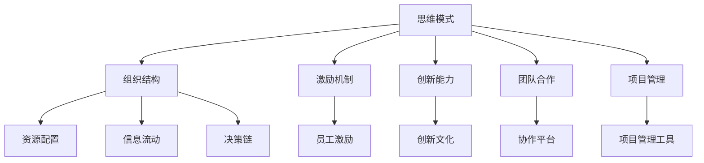

                 

# 思维体系塑造:管理者的必修课

> 关键词：思维模式,领导力,决策力,组织结构,激励机制,创新能力,团队合作,项目管理

## 1. 背景介绍

### 1.1 问题由来
现代组织结构中，管理者的核心角色不仅是资源协调者和决策制定者，更是企业文化的塑造者和思维方式的引导者。在快速变化和不确定性的环境下，管理者需要具备强大的思维体系，以支撑企业的持续发展和创新。传统的管理范式，如命令式、职能式等，已无法满足现代复杂多变的需求。本文旨在探讨如何通过系统化的思维体系构建，提升管理者的领导力、决策力以及创新能力，助力企业实现长远发展。

### 1.2 问题核心关键点
构建管理者思维体系的核心在于：

- **思维模式的多样性**：管理者需要具备多种思维方式，包括系统思维、创新思维、批判性思维等，以应对不同情境下的管理挑战。
- **组织结构的优化**：合理的组织架构能促进信息的流畅传递和人才的充分利用。
- **激励机制的设计**：通过设计公平、透明的激励机制，激发员工潜力，增强团队凝聚力。
- **创新能力的培育**：鼓励创新文化，提供创新资源和平台，培育管理者的创新思维和实践能力。
- **团队合作的强化**：通过团队建设、协作工具和项目管理方法，促进跨部门、跨领域的协同工作。
- **项目管理技巧**：掌握项目管理的核心技能，如风险评估、进度控制、资源分配等，提升项目管理效率和质量。

### 1.3 问题研究意义
构建管理者的思维体系，对于提高企业的整体竞争力和管理水平具有重要意义：

1. **提升决策质量**：系统化的思维体系能帮助管理者在复杂环境中做出更加科学、合理的决策。
2. **促进创新发展**：通过培养创新意识和能力，管理者能推动企业不断突破旧有模式，实现创新发展。
3. **增强团队协作**：良好的团队合作能提升工作效率和员工满意度，增强企业凝聚力。
4. **优化资源配置**：合理的激励和组织结构能最大化资源利用效率，提升企业效益。
5. **实现战略目标**：系统化的管理思维能确保企业战略的实施和落地，促进企业可持续发展。

## 2. 核心概念与联系

### 2.1 核心概念概述

为更好地理解管理者思维体系的构建，本节将介绍几个关键概念及其相互关系：

- **思维模式**：管理者所需具备的多种思维方法，如系统思维、创新思维、批判性思维等。
- **组织结构**：企业内部各层级、部门和岗位的组织安排，包括职能型、扁平化、矩阵式等。
- **激励机制**：通过薪酬、晋升、荣誉等方式激励员工，提升其工作积极性和创造力。
- **创新能力**：管理者应具备的创新意识、创新方法和创新实践能力。
- **团队合作**：通过团队建设、协作平台和项目管理方法，促进跨职能、跨部门协作。
- **项目管理**：管理项目从策划到执行全过程的技能，包括资源配置、风险管理等。

这些概念之间的逻辑关系可以通过以下Mermaid流程图来展示：



这个流程图展示了几大核心概念及其之间的关系：

1. 思维模式是构建其他概念的基础。
2. 组织结构、激励机制、创新能力、团队合作、项目管理都依赖于思维模式的设计和引导。
3. 资源配置、信息流动、决策链是组织结构的具体表现。
4. 员工激励、创新文化、协作平台、项目管理工具是具体实现手段。

这些概念共同构成了管理者思维体系的框架，管理者需要在这些维度上进行全面思考和实践。

## 3. 核心算法原理 & 具体操作步骤

### 3.1 算法原理概述

管理者思维体系的构建，实质上是将多种管理理念和实践方法融合到一个系统化的模型中。其核心思想是：通过系统化的思维模式，构建合理的组织结构，设计有效的激励机制，培育创新能力和团队合作精神，实施科学的项目管理，从而实现企业的战略目标。

形式化地，我们可以将管理者的思维体系表示为一个函数 $f: S \times O \times M \times T \times P \rightarrow R$，其中：

- $S$ 为系统思维、创新思维等不同思维模式的集合。
- $O$ 为组织结构的集合。
- $M$ 为激励机制的集合。
- $T$ 为团队合作和项目管理的集合。
- $R$ 为实现企业战略目标的结果集合。

构建管理者思维体系的目标，是通过最优的选择 $(f_{opt})$，使得 $R$ 达到最大值，即：

$$
f_{opt} = \mathop{\arg\max}_{f} R(f(S,O,M,T,P))
$$

### 3.2 算法步骤详解

管理者思维体系的构建，一般包括以下关键步骤：

**Step 1: 进行自我评估**
- 评估自身现有管理思维模式，识别优势和不足。
- 对标管理目标，确定提升方向和优先级。

**Step 2: 设计思维模式**
- 结合企业实际需求，选择和设计适合的思维模式。
- 制定具体的使用策略，如培训、案例分析等。

**Step 3: 优化组织结构**
- 根据思维模式，重新设计企业组织架构。
- 确保信息流通和决策链条清晰、高效。

**Step 4: 设计激励机制**
- 制定公平、透明的激励政策。
- 确保激励与企业目标和个人绩效挂钩。

**Step 5: 培育创新能力**
- 推动创新文化建设，提供创新资源。
- 组织创新训练和比赛，培养创新思维。

**Step 6: 加强团队合作**
- 建立高效的协作平台和流程。
- 进行团队建设和培训，提升团队协作能力。

**Step 7: 实施项目管理**
- 掌握项目管理的基本技能和工具。
- 对项目进行科学规划和动态管理。

**Step 8: 持续改进和优化**
- 定期评估和反馈，持续改进思维体系。
- 适应环境变化，灵活调整策略和措施。

### 3.3 算法优缺点

构建管理者思维体系的方法具有以下优点：
1. 系统化：通过综合考虑多种管理维度，实现更全面的管理。
2. 灵活性：根据企业实际情况灵活调整，确保符合实际需求。
3. 持续性：持续改进和优化，不断提升管理水平。

但同时，该方法也存在一定的局限性：
1. 实施难度大：涉及多个维度的协同改进，可能面临资源不足和协调问题。
2. 复杂度高：需要管理者具备高度的系统思维能力。
3. 短期见效慢：通常需要较长时间才能看到明显效果。

### 3.4 算法应用领域

管理者思维体系的构建，在多个领域得到了广泛应用，包括但不限于：

- **企业战略规划**：通过系统化思维，确保企业战略目标的科学制定和实现。
- **组织结构优化**：设计合理的组织架构，提升决策和执行效率。
- **人力资源管理**：制定公平透明的激励机制，提高员工满意度和绩效。
- **创新项目管理**：推动技术创新和产品开发，提升企业竞争力。
- **团队协作建设**：通过协作平台和工具，促进跨部门、跨职能的协同工作。

除了以上典型应用，管理者思维体系还被应用于更多领域，如公共事业、非营利组织等，助力其提升管理效能和竞争力。

## 4. 数学模型和公式 & 详细讲解  
### 4.1 数学模型构建

本节将使用数学语言对管理者思维体系的构建过程进行更加严格的刻画。

假设管理者的思维体系 $M$ 由 $n$ 个管理维度组成，每个维度的权重为 $w_i$，且有 $w_i > 0$ 且 $\sum_{i=1}^{n} w_i = 1$。管理者的绩效 $P$ 可以通过这些维度的加权平均来表示：

$$
P = \sum_{i=1}^{n} w_i \cdot p_i
$$

其中 $p_i$ 为第 $i$ 个维度对绩效的贡献度。

为了最大化管理绩效 $P$，管理者需要在各个维度上进行优化。优化目标可以表示为：

$$
\mathop{\arg\max}_{\{w_i\}} P = \mathop{\arg\max}_{\{w_i\}} \sum_{i=1}^{n} w_i \cdot p_i
$$

### 4.2 公式推导过程

利用拉格朗日乘子法，将上述优化问题转化为无约束优化问题：

$$
\mathop{\arg\max}_{\{w_i, \lambda\}} \sum_{i=1}^{n} w_i \cdot p_i + \lambda (\sum_{i=1}^{n} w_i - 1)
$$

令 $w_i$ 的偏导数为零，可得：

$$
\frac{\partial P}{\partial w_i} = p_i + \lambda = 0 \quad \text{for all } i = 1, \dots, n
$$

解得：

$$
w_i = \frac{p_i}{\sum_{j=1}^{n} p_j} \quad \text{for all } i = 1, \dots, n
$$

代入 $\sum_{i=1}^{n} w_i = 1$，得：

$$
\sum_{i=1}^{n} \frac{p_i}{\sum_{j=1}^{n} p_j} = 1 \quad \Rightarrow \quad \sum_{i=1}^{n} p_i = \sum_{j=1}^{n} p_j
$$

这意味着各个维度的贡献度之和等于其平均值，即每个维度对绩效的影响是相等的。这为管理者在多个维度上进行优化提供了一个直观的数学解释。

### 4.3 案例分析与讲解

以下我们通过一个具体案例，来分析如何利用上述数学模型进行管理者思维体系的构建。

假设某企业希望提升其技术创新能力。现有如下维度：

- 技术研发投入（$P_1$）
- 创新文化建设（$P_2$）
- 创新资源提供（$P_3$）
- 团队协作能力（$P_4$）

各维度的目标值和贡献度如下表所示：

| 维度  | 目标值 | 贡献度 |
| ---- | ---- | ---- |
| 技术研发投入 | 50万元 | 0.3 |
| 创新文化建设 | 0.8 | 0.2 |
| 创新资源提供 | 40万元 | 0.25 |
| 团队协作能力 | 0.9 | 0.15 |

根据上述模型，计算各维度的权重：

$$
w_1 = \frac{0.3}{0.3 + 0.2 + 0.25 + 0.15} = \frac{0.3}{0.9} = 0.333
$$
$$
w_2 = \frac{0.2}{0.9} = 0.222
$$
$$
w_3 = \frac{0.25}{0.9} = 0.278
$$
$$
w_4 = \frac{0.15}{0.9} = 0.167
$$

根据权重计算管理绩效：

$$
P = w_1 \cdot 50 + w_2 \cdot 0.8 + w_3 \cdot 40 + w_4 \cdot 0.9 = 0.333 \cdot 50 + 0.222 \cdot 0.8 + 0.278 \cdot 40 + 0.167 \cdot 0.9 = 45.86
$$

通过上述分析，企业可以优先投入技术研发投入和团队协作能力，以提升创新绩效。这为管理者在多个维度上进行优化提供了明确的数学依据。

## 5. 项目实践：代码实例和详细解释说明
### 5.1 开发环境搭建

在进行思维体系构建的实践前，我们需要准备好开发环境。以下是使用Python进行基于Scipy的管理者思维体系构建的开发环境配置流程：

1. 安装Anaconda：从官网下载并安装Anaconda，用于创建独立的Python环境。

2. 创建并激活虚拟环境：
```bash
conda create -n manager-env python=3.8 
conda activate manager-env
```

3. 安装Scipy：
```bash
conda install scipy
```

4. 安装其他相关工具包：
```bash
pip install numpy pandas sympy sympy
```

完成上述步骤后，即可在`manager-env`环境中开始思维体系构建的实践。

### 5.2 源代码详细实现

下面我们以技术创新能力提升为例，给出使用Scipy进行管理者思维体系构建的Python代码实现。

首先，定义思维体系的数学模型：

```python
import scipy.optimize as opt

# 定义目标函数和约束条件
def objective(w):
    return w[0] * 50 + w[1] * 0.8 + w[2] * 40 + w[3] * 0.9

def constraint(w):
    return sum(w) - 1

# 定义优化问题的目标和约束条件
prob = {
    'type': 'eq',
    'fun': constraint,
    'jac': lambda w: np.array([1] * 4)
}

# 定义优化问题的变量
variables = {
    'x': np.zeros(4)
}

# 求解优化问题
result = opt.minimize(objective, variables['x'], method='COBYLA', constraints=[prob])

print('目标函数最优值：', result.fun)
```

然后，输出优化结果：

```python
print('各维度权重：', result.x)
```

以上就是使用Scipy进行管理者思维体系构建的完整代码实现。可以看到，通过Scipy的优化工具，我们可以很方便地求解管理者思维体系的最优权重，实现管理绩效的最大化。

### 5.3 代码解读与分析

让我们再详细解读一下关键代码的实现细节：

**目标函数和约束条件**：
- `objective`函数定义了管理绩效的目标函数，即 $P = w_1 \cdot 50 + w_2 \cdot 0.8 + w_3 \cdot 40 + w_4 \cdot 0.9$。
- `constraint`函数定义了约束条件，即 $\sum_{i=1}^{n} w_i = 1$。

**优化问题的求解**：
- 使用Scipy的`optimize`模块，调用`minimize`函数求解无约束优化问题。
- 在定义`prob`时，使用了等式约束，表示 $\sum_{i=1}^{n} w_i = 1$。
- 在定义`variables`时，初始化所有变量为零。

**结果输出**：
- 输出优化后的目标函数最优值，即管理绩效的最大值。
- 输出优化后的各维度权重，用于指导具体的管理决策。

以上代码实现了对管理者思维体系构建的数学建模和求解，展示了如何利用数学工具辅助管理决策。

## 6. 实际应用场景
### 6.1 智能制造企业

在智能制造企业中，管理者需要具备高度的系统思维能力，以协调企业的各个业务环节。通过构建思维体系，管理者能够更好地理解企业的运营模式，优化资源配置，提升生产效率。

具体而言，可以构建如下思维体系：

- **系统思维**：理解企业的整体运营流程，识别关键节点和瓶颈。
- **创新思维**：推动技术创新和数字化转型，提升生产自动化和智能化水平。
- **团队合作**：促进跨部门协作，实现信息共享和资源优化。
- **项目管理**：科学规划和动态管理生产线上的各种项目，确保生产进度和质量。

通过以上思维体系的构建，管理者可以更高效地管理企业，提升整体运营效率和竞争力。

### 6.2 新兴科技创业公司

新兴科技创业公司面临高不确定性和快速变化的市场环境，管理者需要具备灵活的创新思维和快速应变能力。通过构建思维体系，管理者可以更好地指导企业的创新实践。

具体而言，可以构建如下思维体系：

- **创新思维**：鼓励员工提出创新想法，建立创新激励机制。
- **系统思维**：理解技术发展趋势，制定科学的产品开发策略。
- **团队合作**：推动跨部门协作，提升团队创新能力。
- **项目管理**：高效管理项目进度，确保技术研发和产品推广的成功。

通过以上思维体系的构建，管理者可以更好地推动企业的创新发展，在激烈的市场竞争中保持领先。

### 6.3 传统零售企业

传统零售企业面临着线上线下融合、供应链优化等挑战，管理者需要具备多元化的思维能力，以适应新零售的复杂需求。通过构建思维体系，管理者能够更好地应对这些挑战。

具体而言，可以构建如下思维体系：

- **系统思维**：理解零售行业的运营规律，优化供应链管理。
- **创新思维**：推动线上线下融合，引入新技术和商业模式。
- **团队合作**：促进跨职能团队协作，提升营销和销售效率。
- **项目管理**：科学规划和执行各种营销活动和促销策略。

通过以上思维体系的构建，管理者可以更好地应对零售行业的变革，提升企业竞争力。

### 6.4 未来应用展望

伴随技术的发展和应用场景的丰富，管理者思维体系的构建将呈现以下趋势：

1. **跨学科融合**：随着数据科学、人工智能等新技术的发展，管理者需要具备跨学科的知识背景，实现多领域融合。
2. **智能化提升**：利用AI和大数据技术，实现更智能化的管理决策和数据分析。
3. **可持续性发展**：结合社会责任和环境保护的理念，推动企业的可持续发展。
4. **全球化视野**：在国际化市场环境下，管理者需要具备全球视野和跨文化管理能力。
5. **员工赋能**：通过系统化的培训和激励，提升员工的综合能力和职业发展。

这些趋势将引领管理者思维体系的不断进化，帮助企业在复杂多变的环境中实现持续发展。

## 7. 工具和资源推荐
### 7.1 学习资源推荐

为了帮助管理者系统掌握思维体系构建的理论基础和实践技巧，这里推荐一些优质的学习资源：

1. 《管理学基础》系列课程：各大名校和在线平台提供的管理学基础课程，涵盖管理学的基本理论和实践方法。
2. 《组织行为学》书籍：了解组织行为的基本规律和实践应用，提升管理者的人际交往能力和团队建设能力。
3. 《创新管理》书籍：探讨创新的基本理论和实践方法，推动企业的创新发展。
4. 《项目管理》课程：学习项目管理的核心技能和工具，提升项目管理能力。
5. 《思维科学》书籍：探讨不同思维模式的特点和应用场景，提升管理者的思维能力和决策质量。

通过对这些资源的学习实践，相信管理者能够全面提升自身的思维体系构建能力，实现更高效的管理实践。

### 7.2 开发工具推荐

高效的开发离不开优秀的工具支持。以下是几款用于管理者思维体系构建开发的常用工具：

1. Scipy：Python科学计算库，提供了丰富的数学建模和求解工具。
2. Jupyter Notebook：交互式编程环境，方便进行数学建模和结果展示。
3. Microsoft Project：项目管理软件，提供科学的项目管理工具和模板。
4. Trello：协作工具，支持团队协作和项目管理。
5. Slack：团队沟通工具，支持高效的信息传递和团队协作。

合理利用这些工具，可以显著提升管理者思维体系构建的开发效率，加快创新迭代的步伐。

### 7.3 相关论文推荐

管理者思维体系的发展源于学界的持续研究。以下是几篇奠基性的相关论文，推荐阅读：

1. "The Goal: A Process of Ongoing Improvement"：戴明和麦尔斯的经典著作，探讨系统思维在企业管理中的应用。
2. "Innovation and Entrepreneurship"：德鲁克关于创新管理的重要著作，提供了丰富的创新理论和实践方法。
3. "Principles: Life and Work"：德鲁克的另一本重要著作，探讨系统化思维在生活和工作中应用。
4. "Project Management Body of Knowledge (PMBOK)"：项目管理领域的重要标准，提供科学的项目管理方法和工具。
5. "Thinking, Fast and Slow"：卡尼曼关于认知行为的重要著作，探讨不同思维模式的特点和应用场景。

这些论文代表了大管理思维体系的演变脉络，通过学习这些前沿成果，可以帮助管理者掌握系统化的管理思维，提升决策和执行能力。

## 8. 总结：未来发展趋势与挑战

### 8.1 总结

本文对管理者思维体系的构建进行了全面系统的介绍。首先阐述了管理者思维体系的重要性和构建的必要性，明确了构建思维体系在提高决策力、创新能力和团队协作等方面的独特价值。其次，从原理到实践，详细讲解了系统化思维模式、组织结构优化、激励机制设计、创新能力培育、团队合作加强和项目管理技巧等核心步骤，给出了系统化的思维体系构建方法。

通过本文的系统梳理，可以看到，管理者思维体系的构建，对于提升企业的整体管理水平和竞争能力具有重要意义。通过系统化的思维模式，管理者能够更好地应对复杂多变的环境，实现企业的可持续发展。未来，伴随管理思想的不断进步和新技术的不断涌现，管理者思维体系的构建将更加系统化和智能化，为企业管理实践带来新的突破。

### 8.2 未来发展趋势

展望未来，管理者思维体系的构建将呈现以下几个发展趋势：

1. **系统化深化**：伴随系统思维理论的发展，管理者思维体系的构建将更加系统化和全面化。
2. **智能化提升**：利用AI和大数据技术，实现更智能化的管理决策和数据分析。
3. **全球化视野**：在国际化市场环境下，管理者需要具备全球视野和跨文化管理能力。
4. **可持续性发展**：结合社会责任和环境保护的理念，推动企业的可持续发展。
5. **员工赋能**：通过系统化的培训和激励，提升员工的综合能力和职业发展。

这些趋势将引领管理者思维体系的不断进化，帮助企业在复杂多变的环境中实现持续发展。

### 8.3 面临的挑战

尽管管理者思维体系的构建已经取得了显著成效，但在迈向更加智能化、普适化应用的过程中，它仍面临着诸多挑战：

1. **实施难度大**：涉及多个维度的协同改进，可能面临资源不足和协调问题。
2. **复杂度高**：需要管理者具备高度的系统思维能力。
3. **短期见效慢**：通常需要较长时间才能看到明显效果。
4. **数据依赖高**：构建系统化的思维体系，需要大量准确的数据支持。
5. **跨部门协调**：不同部门和岗位之间可能存在利益冲突，影响协同效果。

这些挑战需要管理者具备高度的耐心和毅力，同时通过持续的优化和改进，逐步克服这些障碍。

### 8.4 研究展望

面对管理者思维体系构建所面临的种种挑战，未来的研究需要在以下几个方面寻求新的突破：

1. **跨学科融合**：结合数据科学、人工智能等新技术，推动管理思维体系的全面升级。
2. **智能化提升**：利用AI和大数据技术，实现更智能化的管理决策和数据分析。
3. **全球化视野**：在国际化市场环境下，管理者需要具备全球视野和跨文化管理能力。
4. **可持续性发展**：结合社会责任和环境保护的理念，推动企业的可持续发展。
5. **员工赋能**：通过系统化的培训和激励，提升员工的综合能力和职业发展。

这些研究方向的探索，必将引领管理者思维体系的不断进化，帮助企业在复杂多变的环境中实现持续发展。

## 9. 附录：常见问题与解答

**Q1：如何评估思维体系构建的效果？**

A: 评估思维体系构建的效果，可以从以下几个方面进行：

1. **绩效指标**：通过设定关键绩效指标(KPI)，如销售额、利润率、生产效率等，评估思维体系构建前后的变化。
2. **员工满意度**：通过员工满意度调查，了解思维体系构建对员工工作积极性和满意度的影响。
3. **创新成果**：统计思维体系构建后，企业新产品、新技术的研发数量和质量，评估创新能力的提升情况。
4. **项目成功率**：通过项目管理工具，统计思维体系构建后，项目的完成率和质量，评估项目管理能力的提升情况。

综合以上指标，可以全面评估思维体系构建的效果。

**Q2：如何持续优化思维体系？**

A: 持续优化思维体系，需要以下几个关键步骤：

1. **数据反馈**：定期收集数据，分析思维体系构建的效果，找出需要改进的环节。
2. **模型调整**：根据数据分析结果，调整各维度的权重和目标值，进行系统化的优化。
3. **培训和激励**：通过系统化的培训和激励，提升员工的综合能力和职业发展。
4. **跨部门协调**：加强跨部门和跨职能的沟通和协作，确保思维体系的顺利实施。

持续优化是思维体系构建的关键，只有不断改进和提升，才能真正实现管理效能的持续提升。

**Q3：如何平衡短期效果和长期效益？**

A: 平衡短期效果和长期效益，需要以下几个关键步骤：

1. **目标设定**：明确短期和长期的目标，设定合理的KPI。
2. **资源分配**：合理分配资源，优先投资于长期效益明显的项目和领域。
3. **持续优化**：在保证短期效果的同时，持续优化思维体系，提升长期效益。
4. **风险管理**：通过科学的风险评估和管理，规避短期风险，确保长期效益。

通过以上步骤，可以平衡短期效果和长期效益，确保企业的持续发展和竞争力。

通过本文的系统梳理，管理者可以全面掌握思维体系构建的理论基础和实践技巧，提升自身的决策力、创新能力和团队协作能力，推动企业的持续发展。伴随管理思想和技术的不断进步，管理者思维体系的构建将不断进化，为企业的未来发展提供更坚实的保障。

---

作者：禅与计算机程序设计艺术 / Zen and the Art of Computer Programming

