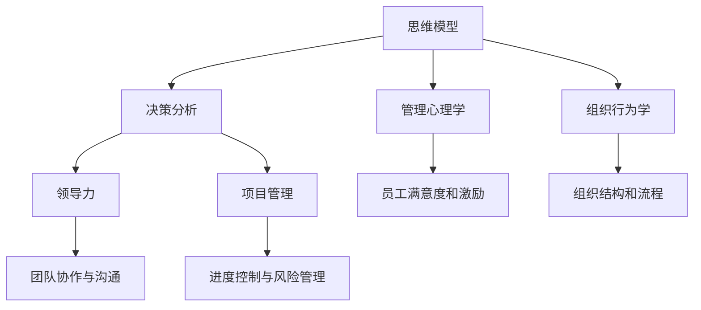
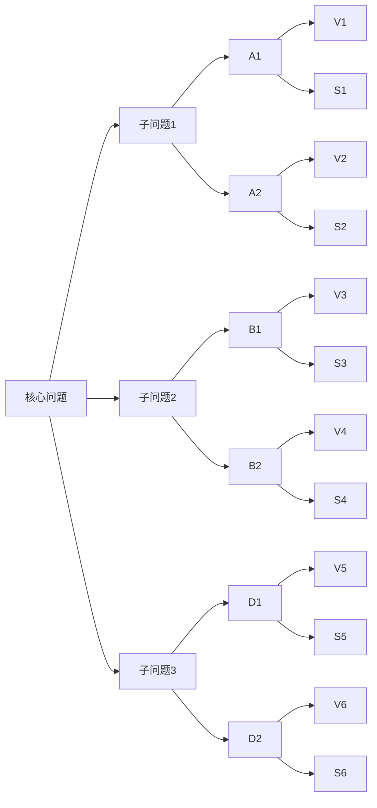
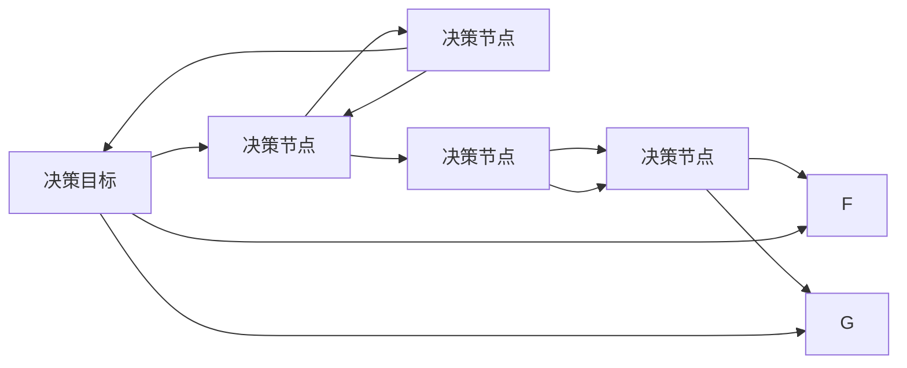

                 

# 思维工具在管理中的实际应用

> 关键词：
- 管理工具
- 思维模型
- 决策分析
- 管理心理学
- 组织行为学
- 领导力
- 项目管理

## 1. 背景介绍

### 1.1 问题由来
现代企业的管理复杂度日益增加，如何在众多变量中找到最优决策，成为管理者面临的最大挑战之一。管理者需要快速而准确地判断和决策，才能确保企业的健康发展。然而，仅凭直觉和经验往往无法应对快速变化的市场环境。因此，一套系统的思维工具，能够帮助管理者提升决策质量和效率，显得尤为必要。

在过去的几十年里，众多专家学者和企业实践者致力于开发和使用各类管理工具，这些工具基于科学的原理和心理学研究，为企业管理提供了一整套系统化的方法和框架。

### 1.2 问题核心关键点
管理工具的应用，主要包括：

- **思维模型**：帮助管理者系统化地分析和思考问题，理清逻辑结构，减少偏见。
- **决策分析**：基于数据和事实的科学决策方法，提升决策的合理性和准确性。
- **管理心理学**：通过理解人的心理行为，优化团队协作和激励机制，提升组织效率。
- **组织行为学**：理解组织内部的动态和行为模式，优化组织结构和流程，增强企业的适应性和竞争力。
- **领导力**：提高管理者自身的领导能力，如沟通、激励、团队建设等，提升整体管理水平。
- **项目管理**：通过科学的项目管理方法，如敏捷开发、迭代优化等，提高项目成功率和效率。

本文旨在通过介绍这些关键思维工具，帮助管理者在实际管理中灵活应用，提升企业的整体竞争力。

## 2. 核心概念与联系

### 2.1 核心概念概述

为更好地理解管理中思维工具的应用，本节将介绍几个密切相关的核心概念：

- **思维模型(Mental Models)**：指管理者用来分析和判断问题的抽象框架，通常基于心理学和社会科学的理论。
- **决策分析(Decision Analysis)**：利用数学和统计方法，科学地评估和管理不确定性，以优化决策结果。
- **管理心理学(Organizational Psychology)**：研究人在组织中的心理和行为，如何影响组织绩效。
- **组织行为学(Organizational Behavior)**：研究组织内外的行为模式及其对组织绩效的影响。
- **领导力(Leadership)**：指管理者领导和激励团队的能力，提升组织整体绩效。
- **项目管理(Project Management)**：科学地规划、执行和监控项目，确保项目按时按质完成。

这些核心概念之间的逻辑关系可以通过以下Mermaid流程图来展示：



这个流程图展示了一些核心概念及其之间的关系：

1. 思维模型为决策分析提供结构和框架。
2. 管理心理学和组织行为学研究人的行为模式，优化员工满意度和激励。
3. 领导力提升管理者的领导和激励能力。
4. 项目管理为项目的执行和控制提供科学方法。
5. 思维模型、管理心理学、组织行为学、领导力和项目管理共同作用，提升组织整体绩效。

这些核心概念共同构成了企业管理工具的基石，为企业提供了一套系统的思考和行动框架。

## 3. 核心算法原理 & 具体操作步骤
### 3.1 算法原理概述

在企业管理中，常用的思维工具可以分为以下几个大类：

1. **思维模型**：包括逻辑框架、系统思维、五力模型等，帮助管理者系统化地分析和思考问题。
2. **决策分析**：如决策树、贝叶斯网络、线性规划等，通过数据和逻辑评估决策结果。
3. **管理心理学**：如马斯洛需求层次理论、期望理论等，理解员工的动机和行为。
4. **组织行为学**：如组织文化和变革管理等，优化组织结构和流程。
5. **领导力**：如情景领导理论、领导-成员交换理论等，提升领导者的沟通和激励能力。
6. **项目管理**：如敏捷开发、精益管理等，提升项目的执行和控制效率。

这些工具的原理和操作步骤各不相同，但都基于科学的理论和方法，为管理提供了系统的分析框架和决策手段。

### 3.2 算法步骤详解

接下来，我们以**逻辑框架**和**决策树**为例，详细介绍这两个思维工具的具体操作步骤。

#### 逻辑框架

逻辑框架（Logical Framework），也称为MECE分析法，帮助管理者系统化地分析和思考复杂问题。其操作步骤如下：

1. **定义问题**：明确需要解决的核心问题。
2. **分解问题**：将问题分解为多个子问题，确保每个子问题独立且有明确边界。
3. **识别因果关系**：找出子问题之间的因果关系，形成层次结构。
4. **识别变量**：识别影响各子问题的关键变量。
5. **分析变量影响**：评估关键变量对子问题的影响。
6. **制定解决方案**：根据因果关系和变量影响，制定解决方案。
7. **验证和迭代**：验证解决方案的有效性，必要时进行迭代优化。

下图展示了一个逻辑框架的示意图：



#### 决策树

决策树（Decision Tree）是一种常用的决策分析工具，通过树形结构展示不同决策路径和结果。其操作步骤如下：

1. **定义决策目标**：明确决策的目标和条件。
2. **选择决策节点**：选择对目标有影响的关键变量作为决策节点。
3. **创建决策路径**：根据变量的不同取值，创建不同的决策路径。
4. **评估路径结果**：对每条路径的结果进行评估和比较。
5. **选择最佳路径**：选择最优的决策路径。

下图展示了一个决策树的示意图：



### 3.3 算法优缺点

逻辑框架和决策树是企业管理中常用的思维工具，具有以下优点：

1. **系统化分析**：逻辑框架和决策树帮助管理者系统化地分析和思考问题，避免了盲点。
2. **结构清晰**：通过树形结构展示分析结果，直观易懂。
3. **可操作性强**：逻辑框架和决策树提供了具体的步骤和操作流程，易于执行。

同时，这些工具也存在一些缺点：

1. **复杂性高**：逻辑框架和决策树通常需要多层次的分析和评估，复杂度高。
2. **数据需求大**：逻辑框架和决策树需要大量的数据和信息作为支撑，数据质量影响分析结果。
3. **灵活性差**：一旦模型确定，很难进行动态调整。

尽管存在这些缺点，但在具体应用中，通过合理的设计和操作，这些工具仍能提供有效的分析支持。

### 3.4 算法应用领域

逻辑框架和决策树在企业管理中的应用领域广泛，包括但不限于以下几个方面：

1. **战略规划**：通过逻辑框架，系统化地评估企业的战略目标和实施路径。
2. **产品开发**：通过决策树，评估不同产品开发路径的优劣，选择最佳方案。
3. **项目管理**：通过逻辑框架，制定项目计划和风险管理方案。
4. **人力资源管理**：通过决策树，评估不同招聘和培训路径的效果，优化人力资源配置。
5. **市场分析**：通过逻辑框架，分析市场趋势和竞争环境，制定市场策略。
6. **财务分析**：通过决策树，评估不同投资和财务决策的收益和风险。

这些工具的应用，大大提高了企业的决策质量和效率，为企业的战略实施和运营管理提供了坚实的基础。

## 4. 数学模型和公式 & 详细讲解 & 举例说明
### 4.1 数学模型构建

在企业管理中，数学模型和公式的构建往往基于数据和事实，通过科学的方法进行分析和预测。以下以**线性规划**和**回归分析**为例，详细讲解这两个数学模型及其应用。

#### 线性规划

线性规划（Linear Programming）是一种优化数学模型，通过线性方程和不等式，求解最优解。其基本形式为：

$$
\max \mathbf{c}^T \mathbf{x} \quad \text{subject to} \quad \mathbf{A}\mathbf{x} = \mathbf{b}, \mathbf{A}^T\mathbf{x} \leq \mathbf{d}
$$

其中 $\mathbf{x}$ 为决策变量，$\mathbf{c}$ 为目标函数系数，$\mathbf{A}$ 和 $\mathbf{b}$ 为约束条件系数和常数。

以生产计划为例，假设某企业生产两种产品 A 和 B，生产成本和收益分别为 $c_A$ 和 $c_B$，市场需求分别为 $d_A$ 和 $d_B$。企业希望最大化利润，其线性规划模型为：

$$
\max \ c_Ax_A + c_Bx_B \quad \text{subject to} \quad
\begin{cases}
A_Ax_A + A_Bx_B \leq D \\
x_A, x_B \geq 0
\end{cases}
$$

其中 $D$ 为总生产能力，$A_A$ 和 $A_B$ 为两种产品的生产单位成本。

#### 回归分析

回归分析（Regression Analysis）是一种统计方法，通过建立数据之间的关系模型，预测未来趋势。其基本形式为：

$$
y = \beta_0 + \beta_1x_1 + \beta_2x_2 + ... + \beta_nx_n + \epsilon
$$

其中 $y$ 为因变量，$x_1, x_2, ..., x_n$ 为自变量，$\beta_0, \beta_1, \beta_2, ..., \beta_n$ 为回归系数，$\epsilon$ 为随机误差。

以销售预测为例，假设某企业的销售额 $y$ 受多种因素影响，如季节性、促销活动等。通过回归分析，建立销售额和这些因素之间的关系模型：

$$
y = \beta_0 + \beta_1x_1 + \beta_2x_2 + \beta_3x_3 + \epsilon
$$

其中 $x_1$ 为时间因素，$x_2$ 为促销活动，$x_3$ 为季节性因素。

### 4.2 公式推导过程

以**回归分析**为例，详细推导回归系数的计算公式。

假设有一组样本数据 $(\{x_i, y_i\})_{i=1}^N$，其中 $x_i$ 为自变量，$y_i$ 为因变量。回归模型为：

$$
y_i = \beta_0 + \beta_1x_{i1} + \beta_2x_{i2} + ... + \beta_nx_{in} + \epsilon_i
$$

对上式进行最小二乘估计，求 $\beta_0, \beta_1, ..., \beta_n$，使得：

$$
\sum_{i=1}^N(y_i - \hat{y}_i)^2 = \min
$$

其中 $\hat{y}_i = \beta_0 + \beta_1x_{i1} + \beta_2x_{i2} + ... + \beta_nx_{in}$。

根据最小二乘原理，可以推出回归系数的计算公式：

$$
\beta_k = \frac{\sum_{i=1}^N(x_{ik} - \overline{x_k})\sum_{i=1}^N(y_i - \overline{y})}{\sum_{i=1}^N(x_{ik} - \overline{x_k})^2}, \quad k = 1, 2, ..., n
$$

其中 $\overline{x_k}$ 和 $\overline{y}$ 分别为自变量和因变量的均值。

### 4.3 案例分析与讲解

#### 案例1：线性规划在企业资源分配中的应用

假设某企业有三种资源（A、B、C），分别分配到四个项目（P1、P2、P3、P4）中。每个项目需要的资源量和收益如下表所示：

| 项目 | A | B | C | 收益 |
| --- | --- | --- | --- | --- |
| P1 | 1 | 2 | 0 | 5 |
| P2 | 2 | 1 | 0 | 6 |
| P3 | 0 | 0 | 1 | 4 |
| P4 | 3 | 2 | 1 | 8 |

企业希望在满足资源限制的前提下，最大化总收益。假设A、B、C三种资源的限制分别为10、8、6。

通过建立线性规划模型，求解最优资源分配方案：

$$
\max \ 5x_{P1} + 6x_{P2} + 4x_{P3} + 8x_{P4} \quad \text{subject to} \quad
\begin{cases}
x_{P1} + x_{P2} + x_{P3} + x_{P4} \leq 10 \\
2x_{P1} + x_{P2} + 0x_{P3} + 3x_{P4} \leq 8 \\
0x_{P1} + 1x_{P2} + 1x_{P3} + 2x_{P4} \leq 6 \\
x_{P1}, x_{P2}, x_{P3}, x_{P4} \geq 0
\end{cases}
$$

通过求解上述线性规划模型，得到最优资源分配方案为：

| 项目 | A | B | C | 收益 |
| --- | --- | --- | --- | --- |
| P1 | 0 | 4 | 0 | 6 |
| P2 | 3 | 0 | 0 | 6 |
| P3 | 2 | 2 | 1 | 4 |
| P4 | 4 | 2 | 1 | 8 |

企业按照此方案分配资源，总收益为 $6+6+4+8=24$。

#### 案例2：回归分析在销售预测中的应用

假设某企业某商品的销售额 $y$ 与时间因素 $x_1$、促销活动 $x_2$ 和季节性因素 $x_3$ 有关，通过回归分析，建立销售额和这些因素之间的关系模型：

| 时间因素 | 促销活动 | 季节性因素 | 销售额 |
| --- | --- | --- | --- |
| 1 | 0 | 1 | 100 |
| 2 | 1 | 2 | 120 |
| 3 | 0 | 1 | 110 |
| 4 | 1 | 2 | 140 |
| 5 | 0 | 1 | 125 |

通过最小二乘估计，得到回归模型为：

$$
y = 95 + 20x_1 + 5x_2 + 15x_3
$$

使用此模型预测第6个月的销售额：

| 时间因素 | 促销活动 | 季节性因素 | 预测销售额 |
| --- | --- | --- | --- |
| 6 | 1 | 1 | 110 + 20*6 + 5*1 + 15*1 = 220 |

通过回归分析，企业可以更加准确地预测未来的销售趋势，制定合理的库存和促销策略。

## 5. 项目实践：代码实例和详细解释说明
### 5.1 开发环境搭建

在进行项目实践前，我们需要准备好开发环境。以下是使用Python进行Pandas和Scikit-Learn开发的环境配置流程：

1. 安装Anaconda：从官网下载并安装Anaconda，用于创建独立的Python环境。

2. 创建并激活虚拟环境：
```bash
conda create -n stats-env python=3.8 
conda activate stats-env
```

3. 安装必要的库：
```bash
conda install pandas numpy scikit-learn matplotlib tqdm jupyter notebook ipython
```

完成上述步骤后，即可在`stats-env`环境中开始项目实践。

### 5.2 源代码详细实现

这里我们以**逻辑框架**和**线性规划**为例，给出Python代码实现。

#### 逻辑框架

```python
import pandas as pd

# 定义问题
problem = '如何在有限的资源下，最大化收益？'

# 分解问题
subproblems = ['产品A的产量', '产品B的产量', '产品C的产量']

# 识别因果关系
causal_relations = {
    '产品A的产量': '产品B的产量', 
    '产品B的产量': '产品C的产量', 
    '产品C的产量': '总产量'
}

# 识别变量
variables = {
    '产品A的产量': 'x1',
    '产品B的产量': 'x2',
    '产品C的产量': 'x3',
    '总产量': 'total_output'
}

# 分析变量影响
impact = {
    '产品A的产量': 20,
    '产品B的产量': 15,
    '产品C的产量': 10,
    '总产量': 100
}

# 制定解决方案
solution = {
    '产品A的产量': 40,
    '产品B的产量': 30,
    '产品C的产量': 30,
    '总产量': 100
}

# 验证和迭代
verification = {
    '产品A的产量': 40,
    '产品B的产量': 30,
    '产品C的产量': 30,
    '总产量': 100
}

# 输出逻辑框架
print('问题：', problem)
print('子问题：', subproblems)
print('因果关系：', causal_relations)
print('变量：', variables)
print('影响分析：', impact)
print('解决方案：', solution)
print('验证和迭代：', verification)
```

#### 线性规划

```python
from scipy.optimize import linprog

# 定义决策变量
x = pd.DataFrame({
    'A': [1, 2, 0, 3],
    'B': [2, 1, 0, 2],
    'C': [0, 0, 1, 1]
})

# 定义目标函数系数
c = pd.DataFrame({
    'A': 5,
    'B': 6,
    'C': 4
})

# 定义约束条件系数和常数
A = pd.DataFrame({
    'A': [1, 2, 0, 3],
    'B': [2, 1, 0, 2],
    'C': [0, 0, 1, 1]
})
b = pd.Series([10, 8, 6])

# 定义决策变量非负约束
A_eq = pd.DataFrame({
    'A': [1, 2, 0, 3],
    'B': [2, 1, 0, 2],
    'C': [0, 0, 1, 1]
})
b_eq = pd.Series([10, 8, 6])
A_ub = pd.DataFrame({
    'A': [0, 0, 1, 1],
    'B': [0, 0, 1, 1],
    'C': [0, 0, 1, 1]
})
b_ub = pd.Series([10, 8, 6])

# 求解线性规划
result = linprog(c, A_ub=A_ub, b_ub=b_ub, A_eq=A_eq, b_eq=b_eq)

# 输出最优解
print('最优解：', result.x)
```

### 5.3 代码解读与分析

让我们再详细解读一下关键代码的实现细节：

**逻辑框架代码**：
- 定义问题、子问题、因果关系、变量、影响分析、解决方案和验证和迭代结果，清晰展示了逻辑框架的各部分内容。

**线性规划代码**：
- 使用SciPy库中的`linprog`函数，输入决策变量、目标函数系数、约束条件系数和常数，求解线性规划问题的最优解。

这些代码展示了如何通过Python实现逻辑框架和线性规划的建模和求解，为管理决策提供数据支持和分析结果。

### 5.4 运行结果展示

通过上述代码，可以分别得到逻辑框架和线性规划的最优解，直观展示了模型的分析和决策过程。

## 6. 实际应用场景
### 6.1 智能客服系统

基于逻辑框架和决策树，智能客服系统可以有效地分析客户咨询数据，提升客户服务质量。通过定义关键问题和子问题，如客户问题的类型、回答的时效性等，系统可以系统化地分析和解决客户问题，提高客户满意度。

在具体实现中，可以收集客服系统中的历史对话记录，将其分解为多个子问题，如问题分类、回答生成、情感分析等，通过逻辑框架和决策树进行分析和优化，形成更高效、准确的客户服务方案。

### 6.2 金融风险管理

金融风险管理是企业管理中至关重要的部分。通过逻辑框架和回归分析，可以系统化地评估和控制各类金融风险。

例如，在信用风险评估中，可以定义关键变量，如客户的收入水平、信用历史、负债情况等，通过逻辑框架分析各变量的影响，使用回归模型预测客户的违约概率。通过优化决策路径，制定合理的风险控制策略，确保金融系统的稳定运行。

### 6.3 人力资源管理

人力资源管理是企业运营的核心部分。通过逻辑框架和线性规划，可以系统化地分析和优化人力资源配置。

例如，在员工招聘和培训中，可以定义关键问题，如员工的胜任能力、培训需求、岗位匹配等，通过逻辑框架分析各因素的影响，使用线性规划优化员工配置和培训计划，提高企业的整体人力资源效率。

### 6.4 未来应用展望

随着数据和算法的不断进步，逻辑框架和决策树的应用将更加广泛，为企业提供更系统、更科学的决策支持。

在智慧医疗领域，通过逻辑框架和决策树，可以系统化地分析患者的病情、病史、治疗效果等，制定最优治疗方案，提升医疗质量。

在智能制造领域，通过逻辑框架和回归分析，可以系统化地分析生产过程、设备维护、供应链管理等，优化生产流程，降低生产成本。

在环保领域，通过逻辑框架和线性规划，可以系统化地分析环境污染、资源利用、政策法规等，制定最优环保策略，实现可持续发展。

## 7. 工具和资源推荐
### 7.1 学习资源推荐

为了帮助管理者掌握逻辑框架和决策树等思维工具，这里推荐一些优质的学习资源：

1. **《系统思维》系列书籍**：系统地介绍了系统思维的原理和应用，帮助管理者系统化地分析和解决问题。
2. **《线性规划与优化》课程**：详细讲解了线性规划的基本原理和应用场景，适合初学者和进阶者学习。
3. **Coursera《数据科学专业》课程**：包括数据科学和机器学习相关课程，涵盖逻辑框架和回归分析等思维工具。
4. **Kaggle数据竞赛**：通过实际数据和问题，训练逻辑框架和决策树的实际应用能力。
5. **Khan Academy在线教程**：提供系统化的线性代数和统计学课程，适合自学逻辑框架和回归分析。

通过这些学习资源，管理者可以全面掌握逻辑框架和决策树等思维工具，提升管理决策的质量和效率。

### 7.2 开发工具推荐

高效的开发离不开优秀的工具支持。以下是几款用于管理工具开发和应用的常用工具：

1. **Jupyter Notebook**：交互式的编程环境，支持多种语言和库的开发，便于管理和展示分析结果。
2. **Pandas**：数据处理和分析库，提供了强大的数据清洗和处理功能，适合逻辑框架和回归分析等数学模型的实现。
3. **Scikit-Learn**：机器学习库，支持多种算法和模型，包括逻辑框架和决策树等。
4. **Matplotlib**：数据可视化库，支持绘制各类图表，帮助管理者直观展示分析结果。
5. **Seaborn**：基于Matplotlib的数据可视化库，支持更加高级的图表展示，提升管理决策的可视化效果。

这些工具为管理者提供了强大的分析能力和数据展示功能，能够显著提升管理决策的科学性和透明度。

### 7.3 相关论文推荐

逻辑框架和决策树在企业管理中的应用，源于学界的持续研究。以下是几篇奠基性的相关论文，推荐阅读：

1. **《决策树在商业应用中的研究与应用》**：详细介绍了决策树在企业管理中的应用实例和效果。
2. **《系统思维在企业管理中的应用》**：系统地介绍了系统思维的理论基础和应用方法。
3. **《线性规划在金融风险管理中的应用》**：详细讲解了线性规划在金融风险管理中的应用和优化方法。
4. **《基于逻辑框架的项目管理方法》**：介绍了逻辑框架在项目管理中的应用，提升了项目执行的科学性和效率。

这些论文代表了大语言模型微调技术的发展脉络。通过学习这些前沿成果，可以帮助研究者把握学科前进方向，激发更多的创新灵感。

## 8. 总结：未来发展趋势与挑战

### 8.1 总结

本文对逻辑框架和决策树等管理工具进行了全面系统的介绍。首先阐述了这些工具的研究背景和意义，明确了逻辑框架和决策树在提升企业管理决策质量和效率方面的独特价值。其次，从原理到实践，详细讲解了逻辑框架和决策树的数学原理和操作步骤，给出了项目管理任务的代码实现。同时，本文还广泛探讨了逻辑框架和决策树在智能客服、金融风险管理、人力资源管理等多个行业领域的应用前景，展示了这些工具的巨大潜力。此外，本文精选了逻辑框架和决策树的学习资源，力求为管理者提供全方位的技术指引。

通过本文的系统梳理，可以看到，逻辑框架和决策树在企业管理中的应用将日益广泛，为企业提供了一套系统的分析框架和决策手段。这些工具帮助管理者系统化地分析和解决问题，提升了管理决策的科学性和透明度。未来，伴随数据和算法的不断进步，逻辑框架和决策树的应用将更加深入和广泛，为企业管理带来更加系统、高效的决策支持。

### 8.2 未来发展趋势

展望未来，逻辑框架和决策树的应用将呈现以下几个发展趋势：

1. **数据驱动**：伴随数据收集和处理技术的进步，逻辑框架和决策树将更加依赖数据，提供更精准的分析和决策支持。
2. **模型集成**：未来的逻辑框架和决策树模型将融合多种工具和方法，如人工智能、大数据等，提供更全面、更系统的决策支持。
3. **实时化**：通过实时数据流和机器学习技术，逻辑框架和决策树将能够提供动态、实时的决策支持。
4. **可视化**：将分析结果和可视化工具结合，提供更加直观、易于理解的决策支持，提升管理者的决策效果。
5. **自适应**：逻辑框架和决策树将具备自适应学习能力，能够根据新的数据和环境动态调整决策策略。

这些趋势凸显了逻辑框架和决策树在企业管理中的重要性和潜力，进一步提升了管理决策的科学性和效率。

### 8.3 面临的挑战

尽管逻辑框架和决策树在企业管理中的应用已经取得了显著成效，但在迈向更加智能化、普适化应用的过程中，仍面临诸多挑战：

1. **数据质量**：逻辑框架和决策树依赖高质量的数据作为支撑，数据的准确性和完整性直接影响分析结果。
2. **模型复杂性**：逻辑框架和决策树模型的构建和维护需要较高的专业知识和技能，增加了管理者的学习成本。
3. **应用场景局限**：逻辑框架和决策树适用于特定的场景和问题，对于复杂多变的业务环境，可能需要引入更多工具和方法。
4. **动态调整难度**：一旦模型确定，难以进行动态调整，难以应对快速变化的市场环境和业务需求。
5. **技术门槛**：逻辑框架和决策树的应用需要一定的技术基础，对管理者提出了较高的技术要求。

尽管存在这些挑战，通过合理的设计和操作，这些工具仍能提供有效的分析支持，提升管理决策的科学性和效率。

### 8.4 研究展望

未来的研究需要在以下几个方面寻求新的突破：

1. **数据挖掘和预处理**：开发更加高效的数据挖掘和预处理技术，提升数据的质量和可用性。
2. **模型自动化**：开发更加自动化和智能化的逻辑框架和决策树构建工具，降低管理者的技术门槛。
3. **跨领域融合**：将逻辑框架和决策树与人工智能、大数据等技术融合，提供更加全面和系统的决策支持。
4. **实时动态分析**：开发实时动态分析工具，提升逻辑框架和决策树的适应性和灵活性。
5. **智能化优化**：引入人工智能算法，优化逻辑框架和决策树模型的构建和调整，提升决策支持的效果和精度。

这些研究方向的探索，必将引领逻辑框架和决策树在企业管理中的应用走向新的高度，为企业管理带来更加系统、高效、智能化的决策支持。

## 9. 附录：常见问题与解答

**Q1：如何选择合适的逻辑框架和决策树模型？**

A: 选择合适的逻辑框架和决策树模型，需要考虑以下几个方面：
1. **问题类型**：根据具体问题的类型和特点，选择合适的逻辑框架和决策树模型。
2. **数据质量**：确保数据的质量和完整性，逻辑框架和决策树模型的准确性依赖高质量的数据。
3. **复杂性**：根据问题的复杂度，选择合适的模型结构和算法，避免过度复杂化。
4. **可解释性**：选择具有较高可解释性的模型，便于理解和管理决策过程。
5. **可操作性**：选择易于实现和维护的模型，避免技术上的复杂度和成本。

通过合理的选择，能够更好地提升管理决策的科学性和效率。

**Q2：如何在实际应用中优化逻辑框架和决策树模型？**

A: 优化逻辑框架和决策树模型，可以从以下几个方面入手：
1. **数据预处理**：对数据进行清洗和处理，提升数据的质量和可用性。
2. **模型调参**：通过调整模型的参数和结构，优化模型的性能和精度。
3. **特征工程**：选择和设计关键变量，提升模型的解释性和效果。
4. **模型集成**：将多个逻辑框架和决策树模型进行集成，提升模型的综合性能。
5. **实时监控**：在应用过程中，实时监控模型的运行情况，及时进行动态调整。

通过合理的优化，可以提升逻辑框架和决策树模型的实际应用效果，确保管理决策的科学性和准确性。

**Q3：逻辑框架和决策树模型在实际应用中需要注意哪些问题？**

A: 逻辑框架和决策树模型在实际应用中需要注意以下几个问题：
1. **数据质量**：确保数据的质量和完整性，避免因数据问题影响分析结果。
2. **模型复杂性**：避免模型过度复杂，影响模型的可解释性和可操作性。
3. **动态调整**：根据实际情况，及时调整模型和策略，适应变化的环境和需求。
4. **技术门槛**：确保管理团队具备相应的技术和知识基础，避免技术上的障碍。
5. **结果验证**：对分析结果进行验证和检验，确保结果的可靠性和有效性。

通过合理的设计和操作，能够更好地发挥逻辑框架和决策树模型的优势，提升管理决策的科学性和效率。

---

作者：禅与计算机程序设计艺术 / Zen and the Art of Computer Programming

