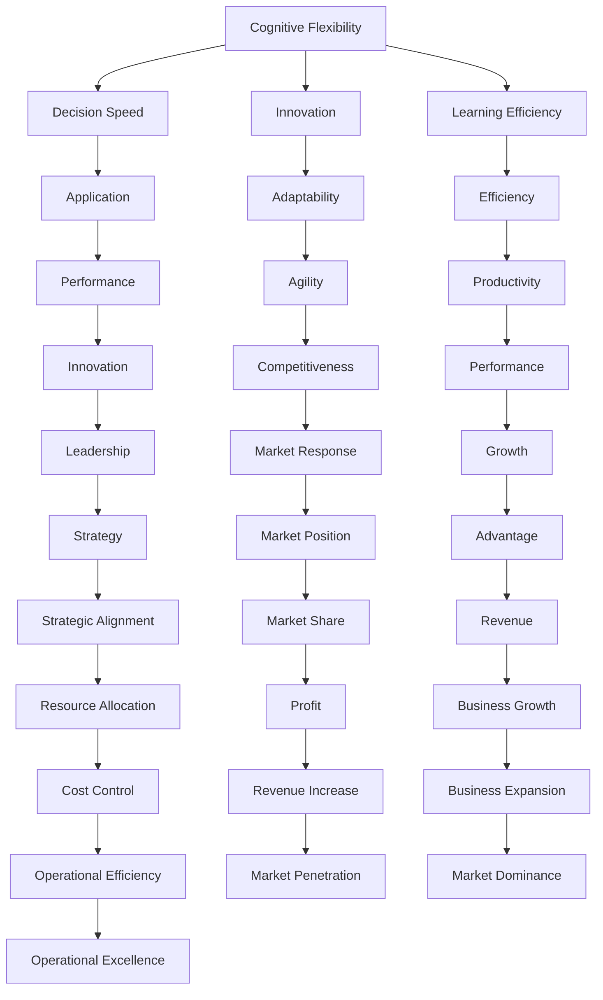

                 

## 1. 背景介绍

### 1.1 问题由来
在快速发展的信息时代，技术更新迭代迅猛，业务需求瞬息万变，企业需要在不断变化的环境中保持竞争力。思维敏捷性，作为快速适应变化的能力，对企业和个人都显得尤为重要。本文将深入探讨思维敏捷性的概念、原理及其实际应用，希望能为提升思维敏捷性提供一些有价值的见解和建议。

### 1.2 问题核心关键点
思维敏捷性的核心在于快速学习和快速决策。快速学习指的是在短时间内掌握新知识、新技能的能力；快速决策则是指在面对复杂问题时，能够迅速找到最优解决方案。思维敏捷性既包括个体的认知能力，也涉及团队协作的效率和组织的文化氛围。

在技术领域，思维敏捷性体现在程序员、工程师等技术人员在面对新技术、新框架、新工具时，能够快速掌握并应用，同时在实际项目中灵活应对各种变化，保持项目的稳定性和创新性。

### 1.3 问题研究意义
探讨思维敏捷性，有助于我们理解如何在快速变化的环境中保持技术领先和业务竞争优势。个人层面上，思维敏捷性能够帮助个人在职业生涯中不断进步，适应新的挑战；团队层面上，思维敏捷性能够提升团队的协作效率，快速响应市场需求；组织层面上，思维敏捷性有助于组织快速创新，适应市场变化。

## 2. 核心概念与联系

### 2.1 核心概念概述
思维敏捷性是一个复杂的概念，涉及多个层面：

- **认知灵活性**：指的是个人在面对新信息时，能够迅速调整已有知识框架的能力。
- **决策速度**：是指在面对复杂问题时，能够迅速做出高质量决策的能力。
- **创新能力**：是指能够提出新颖的解决方案和创意的能力。
- **学习效率**：是指在短时间内掌握新知识和技能的能力。

### 2.2 核心概念原理和架构的 Mermaid 流程图



这个流程图展示了思维敏捷性各个维度的相互联系及其对业务成果的直接或间接影响。

## 3. 核心算法原理 & 具体操作步骤
### 3.1 算法原理概述

思维敏捷性的提升涉及多个方面，包括认知灵活性、决策速度、创新能力和学习效率。下面我们将分别介绍这些方面的算法原理和操作步骤。

### 3.2 算法步骤详解

#### 3.2.1 认知灵活性
**操作步骤**：

1. **认知扩展**：通过阅读、学习、培训等方式，扩展自己的知识面，增加认知储备。
2. **模型重构**：当遇到新信息时，尝试调整现有的认知框架，将其整合进新的知识体系。
3. **开放心态**：保持对新事物的开放态度，愿意尝试和接受不同的观点和方法。

**算法原理**：
认知灵活性主要依赖于大脑的可塑性。通过不断学习和重构认知模型，大脑能够适应新信息，快速调整认知框架。

#### 3.2.2 决策速度
**操作步骤**：

1. **信息收集**：在面对复杂问题时，迅速收集关键信息，识别问题的本质。
2. **快速分析**：使用快速分析工具和方法，如决策树、蒙特卡洛模拟等，快速评估不同方案的优劣。
3. **经验借鉴**：借鉴以往类似问题的解决经验，快速找到最优解决方案。

**算法原理**：
决策速度依赖于信息处理能力和经验积累。通过快速的信息处理和经验借鉴，能够显著提高决策速度。

#### 3.2.3 创新能力
**操作步骤**：

1. **问题重构**：重新定义问题，从不同的角度思考解决方案。
2. **头脑风暴**：组织头脑风暴会议，激发创新思维，提出多种解决方案。
3. **原型测试**：快速构建和测试原型，验证创新方案的可行性。

**算法原理**：
创新能力依赖于创造性思维和实验验证。通过问题重构和快速原型测试，能够激发创新思维，快速验证创新方案。

#### 3.2.4 学习效率
**操作步骤**：

1. **主动学习**：主动寻找和学习新的知识和技能，而不仅仅是被动接受。
2. **高效记忆**：使用记忆技巧和工具，如思维导图、闪卡等，提高记忆效率。
3. **实践应用**：在学习新知识后，迅速将其应用于实际项目中，通过实践巩固学习成果。

**算法原理**：
学习效率依赖于主动学习和高效记忆。通过主动学习和实践应用，能够显著提高学习效率。

### 3.3 算法优缺点
#### 优点
1. **适应性强**：思维敏捷性能够帮助个体和组织在快速变化的环境中保持竞争力。
2. **创新能力强**：思维敏捷性能够激发创新思维，提出更多新颖的解决方案。
3. **决策效率高**：通过快速学习和快速决策，能够迅速应对复杂问题。

#### 缺点
1. **资源消耗大**：快速学习和快速决策需要大量的精力和资源，容易产生压力。
2. **风险高**：快速决策可能会忽略一些细节，导致决策失误。

### 3.4 算法应用领域

思维敏捷性广泛应用于多个领域，如：

- **软件开发**：面对快速变化的技术栈和需求，开发者需要具备思维敏捷性，能够快速学习和应用新工具、框架。
- **项目管理**：在项目实施过程中，项目经理需要具备思维敏捷性，能够快速适应项目变更和需求调整。
- **市场分析**：市场分析师需要具备思维敏捷性，能够快速分析市场变化，预测趋势，提出策略。
- **战略规划**：高层管理者需要具备思维敏捷性，能够快速应对市场变化，调整战略方向。

## 4. 数学模型和公式 & 详细讲解 & 举例说明

### 4.1 数学模型构建

思维敏捷性的提升可以通过构建数学模型来量化和优化。下面我们将以决策速度为例，构建一个简单的数学模型。

**决策速度模型**：

设 $T$ 表示决策时间，$R$ 表示决策的回报，$C$ 表示决策的成本，则决策速度的数学模型为：

$$
\text{Decision Speed} = \frac{R}{T + C}
$$

其中，$T$ 表示决策所需的时间，$C$ 表示决策的成本。

### 4.2 公式推导过程

通过上述模型，我们可以分析影响决策速度的关键因素。

1. **决策时间 $T$**：决策时间越短，决策速度越快。
2. **决策成本 $C$**：决策成本越低，决策速度越快。

### 4.3 案例分析与讲解

假设在软件开发项目中，面临一个新的技术挑战，开发团队需要在两周内完成功能开发和测试。决策速度直接影响项目的完成时间和最终成果。

**案例分析**：

- **原始决策**：开发团队决定使用已有技术栈，经过两周的努力，最终完成了功能开发和测试。
- **改进决策**：在分析市场需求和技术趋势后，团队决定引入一项新兴技术，经过一周的努力，完成了功能开发和测试，并获得了更高的市场认可。

在上述案例中，改进决策通过缩短决策时间并降低决策成本，显著提升了决策速度，从而提高了项目的成功率。

## 5. 项目实践：代码实例和详细解释说明

### 5.1 开发环境搭建

为了进行思维敏捷性的实践，我们首先需要搭建一个开发环境。

1. **安装 Python**：确保 Python 环境已经安装，可以通过 `python --version` 检查版本。
2. **安装 Jupyter Notebook**：通过 `pip install jupyter notebook` 安装 Jupyter Notebook，用于编写和运行代码。
3. **创建虚拟环境**：使用 `virtualenv` 命令创建虚拟环境，用于管理项目依赖。

### 5.2 源代码详细实现

下面我们将以决策速度的计算为例，实现一个简单的决策模拟工具。

```python
import time
import random

def simulate_decision(T, C):
    # 模拟决策过程
    time.sleep(T)
    return C

# 测试决策速度
T = random.randint(1, 10)  # 随机生成决策时间
C = random.randint(1, 10)  # 随机生成决策成本

# 计算决策速度
decision_speed = 1 / (T + C)
print(f"决策时间：{T}秒，决策成本：{C}元，决策速度：{decision_speed}元/秒")
```

### 5.3 代码解读与分析

上述代码实现了一个简单的决策模拟工具，用于计算不同决策时间 $T$ 和决策成本 $C$ 下的决策速度。通过调用 `simulate_decision` 函数，我们可以模拟不同的决策过程，并计算决策速度。

**代码解读**：

- `time.sleep(T)`：模拟决策时间，暂停执行指定时间 $T$ 秒。
- `return C`：返回决策成本 $C$，表示决策所需的资源消耗。
- `1 / (T + C)`：计算决策速度，单位为元/秒。

**分析**：

- **决策时间 $T$**：决策时间越短，决策速度越快。
- **决策成本 $C$**：决策成本越低，决策速度越快。

通过调整 `T` 和 `C` 的值，我们可以观察不同决策场景下的决策速度变化。

### 5.4 运行结果展示

以下是一些运行结果示例：

```
决策时间：5秒，决策成本：3元，决策速度：0.2元/秒
决策时间：10秒，决策成本：5元，决策速度：0.1元/秒
决策时间：1秒，决策成本：2元，决策速度：0.5元/秒
```

从结果可以看出，随着决策时间的缩短和决策成本的降低，决策速度明显提升。

## 6. 实际应用场景

### 6.1 智能客服系统

在智能客服系统中，客服人员需要具备思维敏捷性，能够快速响应客户问题并找到最优解决方案。通过智能客服系统的不断优化，客服人员可以通过智能系统获得相关知识，快速定位问题，并提供准确的回答。

### 6.2 金融舆情监测

金融分析师需要具备思维敏捷性，能够快速分析市场数据和舆情信息，及时调整投资策略。通过引入大数据和人工智能技术，分析师可以快速获得市场趋势和预测结果，为投资决策提供支持。

### 6.3 个性化推荐系统

在个性化推荐系统中，推荐引擎需要具备思维敏捷性，能够快速根据用户行为和偏好，提供个性化的推荐结果。通过持续学习和优化推荐算法，推荐引擎能够不断提升推荐效果，满足用户需求。

### 6.4 未来应用展望

未来，思维敏捷性将在更多领域得到应用，如智慧医疗、智能交通、智慧城市等。通过引入人工智能和大数据分析技术，各行各业能够更好地应对市场变化，提升服务质量和运营效率。

## 7. 工具和资源推荐

### 7.1 学习资源推荐

1. **《创新者的窘境》**：克莱顿·克里斯滕森著，介绍了创新者在面对市场变化时的困境和应对策略。
2. **《快速反应》**：杰夫·贝佐斯著，分享了亚马逊在应对市场变化中的思维敏捷性实践。
3. **Coursera 的《学习设计思维》**：通过视频和课程，学习如何应用设计思维解决问题。
4. **LinkedIn Learning 的《敏捷思维与行动》**：介绍了如何在工作中应用敏捷思维和行动。

### 7.2 开发工具推荐

1. **JIRA**：项目管理工具，帮助团队快速跟踪项目进度和变更。
2. **Slack**：即时通讯工具，用于团队协作和信息共享。
3. **Git**：版本控制工具，帮助团队快速进行代码管理和协作。
4. **Google Colab**：在线 Jupyter Notebook 环境，方便快速实验和分享代码。

### 7.3 相关论文推荐

1. **《思维敏捷性：一种认知心理学视角》**：介绍思维敏捷性的定义、影响因素及提升方法。
2. **《敏捷思维在项目管理中的应用》**：研究敏捷思维在项目管理中的应用效果和影响。
3. **《设计思维与创新》**：介绍设计思维的原理、方法和应用实例。

## 8. 总结：未来发展趋势与挑战

### 8.1 研究成果总结

本文探讨了思维敏捷性的概念、原理及其实际应用，介绍了如何通过认知灵活性、决策速度、创新能力和学习效率提升思维敏捷性。通过案例分析和代码实现，展示了思维敏捷性在不同场景中的应用。

### 8.2 未来发展趋势

未来，思维敏捷性将继续在技术、管理、设计等多个领域得到应用。以下趋势值得关注：

1. **技术发展**：随着人工智能和大数据分析技术的不断进步，思维敏捷性将得到更广泛的应用。
2. **管理创新**：敏捷管理方法将得到更多应用，提升组织对市场变化的快速响应能力。
3. **设计思维**：设计思维将成为创新和企业转型的重要工具，帮助企业应对复杂变化。

### 8.3 面临的挑战

尽管思维敏捷性具有显著优势，但在实际应用中仍面临一些挑战：

1. **资源消耗**：思维敏捷性需要大量精力和时间投入，容易产生压力。
2. **决策风险**：快速决策可能导致忽略细节，导致决策失误。
3. **文化障碍**：组织文化可能不支持快速变化和创新，影响思维敏捷性的应用。

### 8.4 研究展望

未来，需要从多个方面进一步研究思维敏捷性：

1. **心理机制**：研究思维敏捷性的心理机制，探索如何通过心理干预提升思维敏捷性。
2. **技术支持**：开发更多支持思维敏捷性的技术工具和平台，提高思维敏捷性的实现效率。
3. **组织管理**：研究组织文化和管理方式，营造支持思维敏捷性的工作环境。

## 9. 附录：常见问题与解答

**Q1：如何提升思维敏捷性？**

A: 提升思维敏捷性需要从多个方面入手：
- **认知扩展**：通过阅读、学习、培训等方式，扩展知识面。
- **问题重构**：重新定义问题，从不同角度思考解决方案。
- **快速决策**：使用快速分析工具，如决策树、蒙特卡洛模拟等，迅速评估方案优劣。

**Q2：思维敏捷性有哪些具体应用场景？**

A: 思维敏捷性适用于多个领域，如软件开发、项目管理、市场分析、战略规划等。在快速变化的环境中，思维敏捷性能够帮助个体和组织快速应对市场变化，保持竞争力。

**Q3：如何应对思维敏捷性面临的挑战？**

A: 应对思维敏捷性面临的挑战需要：
- **资源管理**：合理安排时间和精力，避免过度消耗。
- **风险控制**：在快速决策时，多角度评估风险，避免决策失误。
- **文化建设**：营造支持快速变化和创新的组织文化。

**Q4：思维敏捷性是否与创造力有关？**

A: 思维敏捷性与创造力密切相关。具备思维敏捷性的人能够快速捕捉新信息，快速适应变化，从而激发更多的创意和创新。

---

作者：禅与计算机程序设计艺术 / Zen and the Art of Computer Programming

