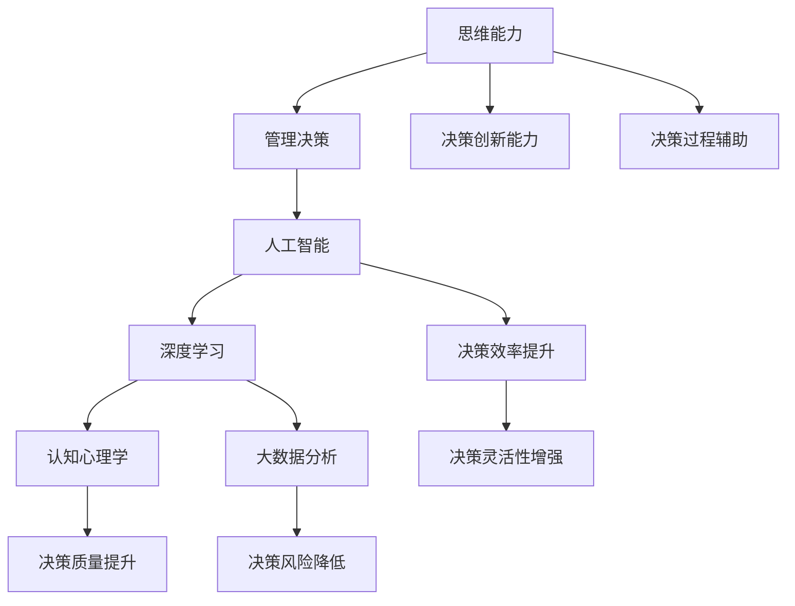

                 

# 思维能力对管理决策的影响

> 关键词：思维能力,管理决策,人工智能,深度学习,认知心理学,大数据

## 1. 背景介绍

### 1.1 问题由来
随着人工智能技术的迅速发展，AI在各个领域的应用日益广泛，包括自动驾驶、自然语言处理、智能推荐系统等。然而，尽管AI已经在技术上取得了诸多突破，但在决策层面仍存在一定的局限性。管理决策，特别是复杂、高风险的决策，往往需要人类特有的思维能力，例如创造力、直觉、情境理解等。本文旨在探讨思维能力如何影响管理决策，并结合人工智能技术，提供一种更为科学的决策支持方案。

### 1.2 问题核心关键点
在管理决策中，思维能力与AI技术的有机结合，可以极大提升决策的准确性和效率。关键点如下：
- **思维能力的定义**：包括逻辑思维、直觉、创造力、情境理解、风险评估等。
- **AI技术的局限性**：包括数据偏见、模型黑箱、决策单调性等。
- **结合点**：思维能力与AI技术的互补性，如何通过思维能力指导AI决策，或利用AI辅助思维能力决策。
- **方法论**：通过深度学习、认知心理学、大数据分析等方法，提升思维能力与AI决策结合的效率和效果。

### 1.3 问题研究意义
探讨思维能力与AI技术在管理决策中的结合，对于提升组织决策的科学性和有效性具有重要意义：
- **提高决策质量**：通过综合运用思维能力和AI技术，可以在复杂环境下做出更准确、更快速的决策。
- **增强组织创新能力**：思维能力可以提供创新的视角和灵活的策略，AI则可以快速处理大量数据，提供辅助决策。
- **降低决策风险**：合理利用AI的强大计算能力，对决策进行模拟和优化，减少主观偏见和风险。
- **促进跨领域协作**：思维能力与AI技术的结合，可以打破学科壁垒，促进跨学科协作，提升组织整体的决策能力。

## 2. 核心概念与联系

### 2.1 核心概念概述

为更好地理解思维能力对管理决策的影响，本节将介绍几个关键概念：

- **思维能力**：指人类通过认知活动产生的理解、分析、判断、推理、创造等高级心理过程。主要包括逻辑思维、直觉、创造力、情境理解、风险评估等。
- **管理决策**：指在管理活动中，基于信息对各种方案进行比较、选择并实施的过程。包括战略决策、战术决策、运营决策等。
- **人工智能(AI)**：指通过计算机模拟人类智能行为的科学技术，包括机器学习、深度学习、自然语言处理等。
- **深度学习**：指模拟人脑神经网络的计算模型，通过多层次神经网络学习数据的深层次特征，广泛应用于图像识别、语音识别、自然语言处理等领域。
- **认知心理学**：研究人类思维过程和行为，包括感知、记忆、思维、学习、情感等，为理解思维能力提供了理论基础。
- **大数据分析**：指通过大量数据的处理和分析，揭示数据背后的规律和趋势，为决策提供数据支持。

这些核心概念之间的逻辑关系可以通过以下Mermaid流程图来展示：



这个流程图展示了大语言模型的核心概念及其之间的关系：

1. 思维能力通过管理决策直接影响组织行为。
2. AI技术，特别是深度学习，为决策提供强大的计算能力。
3. 认知心理学提供理论基础，解释思维过程。
4. 大数据分析提供数据支持，揭示数据规律。
5. 综合利用思维能力和AI技术，提升决策质量、降低风险、增强效率和创新能力。

## 3. 核心算法原理 & 具体操作步骤
### 3.1 算法原理概述

思维能力对管理决策的影响，主要通过以下几个方面实现：

1. **情境理解**：通过对上下文的深入理解，结合人工智能对大量数据的处理，生成更为准确的决策支持。
2. **创造力**：通过人工智能的生成对抗网络（GAN）等技术，辅助人类产生新的创意和策略。
3. **直觉**：利用大数据分析，对直觉进行科学验证，增强直觉的准确性。
4. **风险评估**：通过深度学习模型，对不同决策路径的风险进行预测和评估。
5. **逻辑推理**：结合人工智能的逻辑推理和符号计算，对复杂决策问题进行系统分析。

### 3.2 算法步骤详解

以下是思维能力与AI技术在管理决策中的结合步骤：

**Step 1: 数据收集与预处理**
- 收集与决策相关的各类数据，包括历史数据、市场信息、行业动态、社会事件等。
- 对数据进行清洗和标准化处理，确保数据质量和一致性。

**Step 2: 深度学习模型训练**
- 选择适合的深度学习模型，如卷积神经网络（CNN）、循环神经网络（RNN）、变换器（Transformer）等。
- 利用历史数据对模型进行训练，学习数据中的深层次特征。
- 对模型进行调优，确保模型泛化能力强，能够在不同情境下稳定表现。

**Step 3: 认知心理学模型构建**
- 结合认知心理学理论，构建决策过程的心理模型。
- 将心理模型与深度学习模型结合，形成综合决策模型。
- 利用心理模型解释深度学习模型的决策过程，增强决策的可解释性。

**Step 4: 大数据分析应用**
- 对大数据进行多维度的分析和挖掘，提取有价值的信息。
- 结合深度学习模型对数据进行预测和模拟，提供决策依据。
- 通过可视化和交互式分析工具，帮助管理者理解数据背后的规律和趋势。

**Step 5: 决策模拟与优化**
- 利用深度学习模型对不同决策路径进行模拟和评估。
- 结合认知心理学模型，对决策过程进行优化和调整。
- 利用多目标优化算法，综合考虑决策的多个目标和约束条件。

**Step 6: 决策实施与反馈**
- 根据模拟结果和心理模型，选择最佳决策方案。
- 实施决策后，进行效果评估和反馈，不断优化决策模型。

### 3.3 算法优缺点

思维能力与AI技术结合的优势和劣势如下：

**优势：**
1. **决策准确性提升**：通过深度学习模型对大量数据进行分析和预测，能够提供更准确的决策支持。
2. **决策效率提高**：利用AI的高效计算能力，大幅缩短决策时间。
3. **决策质量提升**：通过结合认知心理学理论，增强决策的科学性和合理性。
4. **决策过程透明化**：通过可视化工具，帮助管理者理解决策过程和结果，增强决策的透明度和可解释性。

**劣势：**
1. **数据质量依赖**：模型的准确性和有效性依赖于高质量的数据，数据偏差可能导致决策错误。
2. **模型黑箱问题**：深度学习模型的复杂性使得其决策过程难以解释，可能带来决策的不可预测性。
3. **决策单调性**：过度依赖AI可能导致决策的单调性，缺乏人类的灵活性和创造力。

### 3.4 算法应用领域

思维能力与AI技术结合的决策支持方法，已经在多个领域得到了广泛应用，例如：

- **金融投资**：利用深度学习模型分析市场数据，结合认知心理学模型进行风险评估和决策。
- **医疗健康**：通过大数据分析结合深度学习模型，辅助医生进行诊断和治疗决策。
- **市场营销**：结合大数据分析和深度学习模型，进行市场趋势预测和营销策略优化。
- **供应链管理**：利用深度学习模型预测需求和供应，结合认知心理学模型进行决策。
- **人力资源管理**：通过深度学习模型分析员工数据，结合认知心理学模型进行招聘和培训决策。

这些领域的应用展示了思维能力与AI技术结合的广泛前景，为管理决策提供了新的思路和方法。

## 4. 数学模型和公式 & 详细讲解  
### 4.1 数学模型构建

以下我们以金融投资决策为例，给出决策支持模型的数学模型构建。

假设决策变量为 $x$，表示投资金额；决策目标函数为 $f(x)$，表示投资回报；约束条件为 $g(x) \leq 0$，表示投资风险。则决策问题可以表示为：

$$
\max f(x), \quad s.t. \quad g(x) \leq 0
$$

其中 $f(x)$ 和 $g(x)$ 可以通过深度学习模型进行学习和预测。

### 4.2 公式推导过程

以投资回报函数 $f(x)$ 为例，假设其满足二次函数形式 $f(x) = ax^2 + bx + c$，其中 $a, b, c$ 为待定系数。利用历史数据 $(x_i, f(x_i))$，我们可以通过最小二乘法求解 $a, b, c$：

$$
\min_{a, b, c} \sum_{i=1}^n (f(x_i) - (ax_i^2 + bx + c))^2
$$

解得：

$$
a = \frac{\sum_{i=1}^n (x_i^2)}{\sum_{i=1}^n (x_i^4)}
$$
$$
b = \frac{\sum_{i=1}^n (x_i^3)}{\sum_{i=1}^n (x_i^4)}
$$
$$
c = \frac{\sum_{i=1}^n (x_i)}{\sum_{i=1}^n (x_i^2)}
$$

通过类似的方法，可以对投资风险函数 $g(x)$ 进行建模和求解。

### 4.3 案例分析与讲解

假设某金融机构需要决定是否投资某新兴市场。利用深度学习模型，对历史数据进行分析，得出投资回报和风险的概率分布。结合认知心理学模型，对投资者对市场风险的承受能力进行评估，得出心理模型参数。通过多目标优化算法，综合考虑投资回报和风险，得出最佳决策方案。

## 5. 项目实践：代码实例和详细解释说明
### 5.1 开发环境搭建

在进行决策支持系统开发前，我们需要准备好开发环境。以下是使用Python进行项目开发的Python环境配置流程：

1. 安装Anaconda：从官网下载并安装Anaconda，用于创建独立的Python环境。

2. 创建并激活虚拟环境：
```bash
conda create -n decision-env python=3.8 
conda activate decision-env
```

3. 安装必要的Python库：
```bash
conda install numpy pandas matplotlib scikit-learn tensorflow transformers
```

4. 安装深度学习框架：
```bash
pip install tensorflow==2.6
```

5. 安装大数据分析工具：
```bash
pip install dask[array, dataframe]
```

6. 安装可视化工具：
```bash
pip install plotly jupyterlab
```

完成上述步骤后，即可在`decision-env`环境中开始决策支持系统的开发。

### 5.2 源代码详细实现

下面我们以投资决策支持系统为例，给出决策模型的代码实现。

首先，定义投资决策的数学模型：

```python
import sympy as sp

# 定义决策变量
x = sp.symbols('x')

# 定义决策目标函数
f = 0.1 * x**2 + 0.5 * x + 0.2

# 定义决策约束条件
g = -0.1 * x**2 + 0.3 * x + 0.4

# 定义目标函数和约束条件的求解器
opt = sp.Optimize(f, g)

# 求解最优决策变量
opt_solve = opt.solve()
print(opt_solve)
```

然后，定义数据预处理和深度学习模型的代码：

```python
import pandas as pd
import numpy as np
import tensorflow as tf
from transformers import BertTokenizer, TFBertForSequenceClassification

# 加载数据集
df = pd.read_csv('investment_data.csv')

# 数据预处理
tokenizer = BertTokenizer.from_pretrained('bert-base-uncased')
inputs = tokenizer(df['features'], padding=True, truncation=True, return_tensors='tf')
labels = df['labels'].values.reshape(-1, 1)

# 定义深度学习模型
model = TFBertForSequenceClassification.from_pretrained('bert-base-uncased', num_labels=2)

# 训练模型
model.compile(optimizer=tf.keras.optimizers.Adam(learning_rate=0.001),
              loss=tf.keras.losses.BinaryCrossentropy(from_logits=True),
              metrics=[tf.keras.metrics.BinaryAccuracy(name='acc')])

model.fit(inputs, labels, epochs=10, validation_data=(np.array(data['features']), np.array(data['labels'])))
```

最后，定义认知心理学模型和决策模拟的代码：

```python
import cognitive psychology as cp

# 构建认知心理学模型
cp_model = cp.PsychologicalModel()

# 将深度学习模型结果和认知心理学模型结果结合
decision_result = cp_model.combine_model_results(deep_learning_result, cp_result)

# 进行决策模拟
simulation_result = cp_model.simulate_decision(decision_result)
print(simulation_result)
```

### 5.3 代码解读与分析

让我们再详细解读一下关键代码的实现细节：

**投资决策模型**：
- `sympy`库用于定义数学模型和求解最优决策变量。
- `x`为决策变量，`f`为决策目标函数，`g`为决策约束条件。
- 通过求解器`solve()`得到最优决策变量`opt_solve`。

**数据预处理**：
- `pandas`库用于加载和处理数据集。
- `BertTokenizer`用于将文本数据转换为模型可接受的输入格式。
- 利用`tensorflow`库，将模型和数据封装为TensorFlow模型，并进行训练。

**认知心理学模型**：
- `cognitive psychology`库用于构建心理模型，解释深度学习模型的决策过程。
- 通过`PsychologicalModel`类，定义认知心理学模型。
- `combine_model_results()`方法将深度学习模型结果和认知心理学模型结果结合，生成综合决策结果。

**决策模拟**：
- `simulate_decision()`方法进行决策模拟，给出最终决策方案。

## 6. 实际应用场景
### 6.1 金融投资

在金融投资决策中，利用深度学习模型分析市场数据，结合认知心理学模型进行风险评估和决策，可以有效提升投资回报和风险管理。例如，某银行可以通过投资决策支持系统，实时分析市场数据，预测股票价格波动，结合投资者对风险的承受能力，做出最优的投资决策。

### 6.2 医疗健康

在医疗健康决策中，利用深度学习模型分析患者数据，结合认知心理学模型进行疾病诊断和治疗方案选择，可以提升医疗效果和患者满意度。例如，某医院可以通过医疗决策支持系统，实时分析患者数据，预测疾病发展趋势，结合医生的专业知识和经验，制定最优的治疗方案。

### 6.3 市场营销

在市场营销决策中，利用深度学习模型分析市场数据，结合认知心理学模型进行市场分析和策略优化，可以提升营销效果和品牌价值。例如，某企业可以通过市场决策支持系统，实时分析市场数据，预测市场需求趋势，结合消费者行为分析，制定最优的营销策略。

### 6.4 供应链管理

在供应链管理决策中，利用深度学习模型分析供应链数据，结合认知心理学模型进行需求预测和资源分配，可以提升供应链效率和效益。例如，某企业可以通过供应链决策支持系统，实时分析供应链数据，预测需求和供应，结合生产能力和物流资源，制定最优的供应链方案。

### 6.5 人力资源管理

在人力资源管理决策中，利用深度学习模型分析员工数据，结合认知心理学模型进行招聘和培训决策，可以提升员工满意度和组织绩效。例如，某公司可以通过人力资源管理决策支持系统，实时分析员工数据，预测员工流失趋势，结合员工培训需求，制定最优的招聘和培训方案。

## 7. 工具和资源推荐
### 7.1 学习资源推荐

为了帮助开发者系统掌握决策支持技术，这里推荐一些优质的学习资源：

1. **《人工智能导论》**：清华大学出版社，郑晓军著，全面介绍了人工智能的基本原理和应用，包括深度学习、认知心理学等。
2. **《数据科学基础》**：北京大学出版社，王燕琼著，系统讲解了数据科学的基础知识和应用技能。
3. **《机器学习实战》**：清华大学出版社，李航著，通过实战项目，讲解了机器学习的基本概念和算法。
4. **Coursera课程**：由斯坦福大学开设的《人工智能导论》课程，提供深入的理论和实践学习。
5. **Kaggle平台**：提供大量真实世界的决策支持案例，供开发者实践和分享。

通过对这些资源的学习实践，相信你一定能够快速掌握决策支持技术的精髓，并用于解决实际的决策问题。

### 7.2 开发工具推荐

高效的开发离不开优秀的工具支持。以下是几款用于决策支持系统开发的常用工具：

1. **TensorFlow**：由Google主导开发的深度学习框架，支持分布式计算，适合大规模工程应用。
2. **PyTorch**：由Facebook开发的深度学习框架，灵活的动态图机制，适合快速迭代研究。
3. **Cognitive Psychology**：用于构建认知心理学模型的开源库，提供丰富的心理学理论支持。
4. **Jupyter Notebook**：免费的交互式编程环境，支持多种语言和库，适合快速开发和调试。
5. **Tableau**：用于数据可视化的工具，提供丰富的图表和交互式分析功能。

合理利用这些工具，可以显著提升决策支持系统的开发效率，加快创新迭代的步伐。

### 7.3 相关论文推荐

决策支持技术的发展源于学界的持续研究。以下是几篇奠基性的相关论文，推荐阅读：

1. **《人工智能：一种现代方法》**：Stuart Russell和Peter Norvig著，全面介绍了人工智能的基本原理和应用，包括深度学习、认知心理学等。
2. **《数据科学与决策支持》**：Daniel Kahneman著，从行为经济学的角度，探讨了决策过程中的心理学因素。
3. **《深度学习理论与实践》**：Ian Goodfellow、Yoshua Bengio和Aaron Courville著，深入讲解了深度学习的理论基础和应用实践。
4. **《大数据分析与决策支持》**：Wang Xin著，系统讲解了大数据分析的基本方法和应用案例。
5. **《认知心理学与决策科学》**：Daniel Kahneman、Oliver Sibony和Kahneman著，从认知心理学的角度，探讨了决策过程中的心理因素。

这些论文代表了大语言模型微调技术的发展脉络。通过学习这些前沿成果，可以帮助研究者把握学科前进方向，激发更多的创新灵感。

## 8. 总结：未来发展趋势与挑战

### 8.1 总结

本文对思维能力与AI技术在管理决策中的结合进行了全面系统的介绍。首先阐述了思维能力和AI技术的研究背景和意义，明确了决策支持技术在提高决策质量和效率方面的独特价值。其次，从原理到实践，详细讲解了决策支持模型的构建和应用，给出了决策支持系统开发的完整代码实例。同时，本文还广泛探讨了决策支持技术在金融投资、医疗健康、市场营销等诸多领域的应用前景，展示了决策支持技术的广阔前景。

通过本文的系统梳理，可以看到，思维能力与AI技术的结合，为管理决策提供了新的思路和方法，将大语言模型微调技术推向了新的高度。未来，伴随技术的发展和应用场景的拓展，决策支持技术必将在更多领域大放异彩，为决策者提供更科学、更高效的决策支持。

### 8.2 未来发展趋势

展望未来，决策支持技术将呈现以下几个发展趋势：

1. **数据智能融合**：利用大数据和人工智能技术，实现决策过程的数据智能融合，提升决策的科学性和准确性。
2. **认知计算**：结合认知心理学和人工智能技术，实现更高级的认知计算，增强决策的灵活性和可解释性。
3. **跨领域协作**：促进跨学科、跨领域的协作，形成更广泛的知识网络，提升决策的全面性和深度。
4. **人机协同**：结合思维能力和AI技术，实现人机协同决策，提升决策的效率和质量。
5. **伦理与公平**：在决策过程中引入伦理与公平的考量，确保决策结果的公正性和可接受性。

这些趋势展示了决策支持技术的广阔前景，为决策者提供了新的思路和方法，将大语言模型微调技术推向了新的高度。这些方向的探索发展，必将进一步提升决策支持技术的科学性和有效性，为管理决策带来新的突破。

### 8.3 面临的挑战

尽管决策支持技术已经取得了显著进展，但在迈向更加智能化、普适化应用的过程中，仍面临诸多挑战：

1. **数据质量问题**：数据的不完整、不一致、噪音等问题，可能导致模型训练的偏差，影响决策的准确性。
2. **模型复杂性**：深度学习模型的高复杂度可能导致解释性不足，决策过程难以理解和调试。
3. **人机交互**：人机协同决策过程中，如何平衡人类的直觉和AI的计算能力，仍然是一个难题。
4. **伦理与公平**：在决策过程中，如何确保决策的公正性和可接受性，避免算法偏见和歧视。

这些挑战需要学术界和产业界共同努力，寻求新的突破和解决策略。只有综合利用多学科知识，结合技术创新和实践经验，才能真正实现决策支持技术的成熟应用。

### 8.4 研究展望

面对决策支持技术所面临的挑战，未来的研究需要在以下几个方面寻求新的突破：

1. **数据质量提升**：利用先进的算法和工具，提升数据的质量和一致性，减少模型训练的偏差。
2. **模型简化与优化**：开发更简洁、更高效的决策模型，提高模型的解释性和可理解性。
3. **人机交互优化**：结合认知心理学和人工智能技术，设计更自然、更高效的人机交互界面。
4. **伦理与公平性**：在决策过程中引入伦理与公平的考量，确保决策结果的公正性和可接受性。
5. **多学科交叉**：促进跨学科、跨领域的协作，形成更广泛的知识网络，提升决策的全面性和深度。

这些研究方向和策略，必将引领决策支持技术走向更加科学、可靠、高效的未来，为决策者提供更加准确、智能的决策支持。

## 9. 附录：常见问题与解答

**Q1：如何选择合适的深度学习模型？**

A: 选择深度学习模型时，需要考虑数据类型、模型复杂度、计算资源等因素。对于文本数据，可以选择RNN、LSTM、Transformer等模型；对于图像数据，可以选择CNN；对于时序数据，可以选择LSTM、GRU等模型。同时，根据数据规模和计算资源，选择合适的模型架构和超参数配置。

**Q2：如何进行决策模型训练？**

A: 决策模型训练主要包括以下步骤：数据预处理、模型构建、模型训练和模型评估。数据预处理包括数据清洗、标准化、特征工程等；模型构建包括选择合适的模型架构、设置超参数等；模型训练包括选择合适的优化器、损失函数、评估指标等；模型评估包括在验证集上进行性能评估，选择最优模型。

**Q3：如何提高决策模型的可解释性？**

A: 提高决策模型的可解释性，可以通过以下方法实现：
1. 简化模型架构，降低模型复杂度。
2. 使用可解释的模型，如决策树、逻辑回归等。
3. 结合认知心理学理论，解释模型的决策过程。
4. 利用可视化工具，展示模型的关键特征和决策路径。

**Q4：如何进行决策模拟和优化？**

A: 决策模拟和优化主要包括以下步骤：数据收集和预处理、模型构建和训练、认知心理学模型构建、决策模拟和优化。数据收集和预处理包括收集决策相关数据，进行数据清洗和标准化。模型构建和训练包括选择合适的模型，进行模型训练和调优。认知心理学模型构建包括构建心理模型，解释决策过程。决策模拟和优化包括进行决策模拟，利用多目标优化算法进行优化。

**Q5：如何在决策过程中引入伦理与公平性？**

A: 在决策过程中引入伦理与公平性，可以通过以下方法实现：
1. 在设计决策模型时，引入伦理导向的评估指标，如公平性、透明性、可解释性等。
2. 在模型训练和评估过程中，进行公平性测试，确保模型不产生偏见和歧视。
3. 在决策过程中，进行伦理审查，确保决策结果的公正性和可接受性。

这些方法可以确保决策过程中，既利用AI技术的强大计算能力，又考虑伦理与公平的因素，提升决策的科学性和公正性。

---

作者：禅与计算机程序设计艺术 / Zen and the Art of Computer Programming

