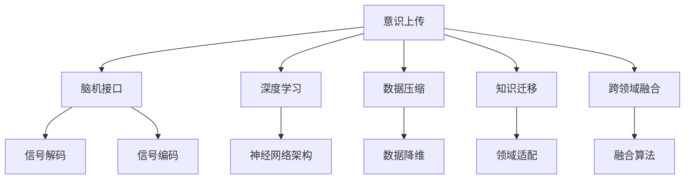

                 

# 意识上传：AI时代的永生幻想

> 关键词：意识上传,人工智能,永生幻想,脑机接口,深度学习

## 1. 背景介绍

### 1.1 问题由来

人类对于永生的追求自古以来就没有停止过。无论是神话故事中的不死之身，还是科学幻想中的意识上传，都反映出人们对永生和智慧延续的向往。随着人工智能技术的飞速发展，这个古老而复杂的愿景又有了新的实现可能。

在AI时代，人类通过各种技术手段尝试将意识、记忆甚至自我意识以数字化的方式保存在计算机中，期望在未来某个时刻重新导入到另一个实体中，从而实现某种形式的永生。这种幻想不仅激发了一系列科幻作品，也在科学研究和技术开发中有了一定的实践尝试。

### 1.2 问题核心关键点

- **意识上传**：将人类的意识、记忆甚至个性以数据形式传输到计算机或其他媒介中，期望在未来某个时刻重新唤醒和恢复。
- **脑机接口**：通过直接连接人脑和计算机，实现信息的双向传输。
- **深度学习**：一种基于神经网络的机器学习方法，能够处理高维、非线性问题。
- **知识迁移**：将从一种场景或领域学习到的知识迁移到另一种场景或领域。
- **数据压缩**：将高维数据压缩到较低维空间中，减少存储需求，提高传输效率。
- **跨领域融合**：不同领域的知识和技能通过某种方式进行融合，实现新的创新。

这些核心概念共同构成了意识上传的梦想与现实的桥梁，为实现这一目标提供了可能的技术路径。

### 1.3 问题研究意义

研究意识上传不仅是科学幻想的延伸，也具有重要的实践意义：

1. **灾难应对**：在灾难性事件如战争、自然灾害等发生时，通过意识上传技术可以将关键知识、技能和智慧保存下来，供后人学习和继承。
2. **心理健康**：意识上传可能成为治疗精神疾病的工具，通过将病患的意识状态转移到虚拟环境中进行恢复和治疗。
3. **人类进化**：通过意识上传，人类可以传承更丰富的知识与经验，加速智慧的进化与迭代。
4. **资源优化**：意识上传可以为有形的身体提供休息和恢复，使得人类可以更高效地利用资源。

## 2. 核心概念与联系

### 2.1 核心概念概述

为更好地理解意识上传的原理与技术，本节将介绍几个密切相关的核心概念：

- **意识上传(Conscious Upload)**：指将人类的意识、记忆、个性等信息存储到计算机或其他媒介中，并希望在未来某个时刻能够重新导入到另一个实体中。
- **脑机接口(Brain-Computer Interface, BCI)**：通过直接连接人脑和计算机，实现信息的双向传输，是意识上传的关键技术之一。
- **深度学习(Deep Learning)**：一种基于神经网络的机器学习方法，能够处理高维、非线性问题，是构建脑机接口的重要工具。
- **数据压缩(Data Compression)**：将高维数据压缩到较低维空间中，减少存储需求，提高传输效率，是实现意识上传必须解决的技术难题之一。
- **知识迁移(Knowledge Transfer)**：将从一种场景或领域学习到的知识迁移到另一种场景或领域，是实现跨领域应用的基础。
- **跨领域融合(Cross-Disciplinary Integration)**：不同领域的知识和技能通过某种方式进行融合，实现新的创新，是实现意识上传的关键技术路径。

这些概念之间的逻辑关系可以通过以下Mermaid流程图来展示：



这个流程图展示意识上传的核心概念及其之间的关系：

1. 意识上传需要通过脑机接口技术，将人脑信息转化为计算机可处理的形式。
2. 深度学习用于构建和优化脑机接口中的神经网络模型。
3. 数据压缩技术用于减少存储和传输中的数据量。
4. 知识迁移使得模型可以适应不同的应用场景。
5. 跨领域融合使得不同领域的知识和技能得以结合，实现新的创新。

这些概念共同构成了意识上传的梦想与现实的桥梁，为实现这一目标提供了可能的技术路径。

## 3. 核心算法原理 & 具体操作步骤

### 3.1 算法原理概述

意识上传的本质是将人脑信息转化为计算机可处理的数据，并存储在某种媒介中，以备未来重新导入和恢复。这一过程可以分为以下几个关键步骤：

1. **信号采集**：通过脑机接口设备，将人脑活动转化为电信号。
2. **信号解码**：利用深度学习模型，将电信号解码为人脑中的信息，如思想、记忆等。
3. **数据存储**：将解码后的信息以数据形式存储在计算机或其他媒介中。
4. **信号编码**：将存储在媒介中的信息再次编码为电信号，供未来导入。
5. **信号重建**：将解码后的信息重新编码为电信号，供人脑接收和恢复。

这些步骤需要高度复杂的技术实现，涉及脑科学、神经科学、计算机科学等多个领域。

### 3.2 算法步骤详解

#### 步骤一：信号采集

信号采集是意识上传的第一步，通常使用脑机接口设备进行。常见的脑机接口技术包括：

- **脑电图(EEG)**：通过头皮电极捕捉人脑的电活动。
- **功能性磁共振成像(fMRI)**：通过监测人脑的血液流动，间接推测其活动。
- **磁刺激技术(MT)和经颅直流电刺激(tDCS)**：通过电刺激或磁刺激影响人脑的活动。

这些设备通过传感器采集人脑的电信号，将信号转化为计算机可以处理的数字信号。

#### 步骤二：信号解码

信号解码是将电信号解码为人脑中的信息，是意识上传的核心环节。这一过程通常使用深度学习模型，如卷积神经网络(CNN)、递归神经网络(RNN)、长短期记忆网络(LSTM)等。

以EEG信号为例，解码过程通常分为两个步骤：

1. **预处理**：包括滤波、归一化、特征提取等，使信号适合后续处理。
2. **模型训练**：使用标记好的EEG数据集训练深度学习模型，使其能够将电信号解码为人脑中的信息。

模型训练通常包括以下步骤：

- **数据准备**：收集标注好的EEG数据，进行预处理和分批处理。
- **模型选择**：选择适合的深度学习模型，如卷积神经网络(CNN)、递归神经网络(RNN)或长短期记忆网络(LSTM)。
- **模型训练**：通过反向传播算法更新模型参数，最小化损失函数。
- **模型验证**：在验证集上评估模型性能，调整超参数以提升效果。
- **模型测试**：在测试集上最终评估模型性能。

#### 步骤三：数据存储

数据存储是将解码后的信息以数据形式存储在计算机或其他媒介中，通常涉及数据压缩技术。

数据压缩技术可以将高维数据压缩到较低维空间中，减少存储需求，提高传输效率。常见的数据压缩技术包括：

- **有损压缩**：如JPEG、PNG、MP3等，牺牲部分信息以换取更小的文件大小。
- **无损压缩**：如Gzip、Bzip2、LZ77等，不损失任何信息，但压缩率相对较低。
- **深度压缩**：如Autoencoder、Variational Autoencoder等，使用神经网络模型对数据进行压缩和解压缩。

#### 步骤四：信号编码

信号编码是将存储在媒介中的信息再次编码为电信号，供未来导入。这一过程是意识上传的关键步骤，要求解码后的信息能够被准确还原为电信号。

信号编码过程通常使用与信号解码相同的技术，但需注意以下几点：

- **解码器与编码器的匹配**：确保解码器和编码器参数一致，以避免信息丢失。
- **信号失真**：避免信号在编码和解码过程中失真，保持信息的准确性。

#### 步骤五：信号重建

信号重建是将解码后的信息重新编码为电信号，供人脑接收和恢复。这一过程是意识上传的最终环节，要求解码后的信息能够准确地被大脑接收和处理。

信号重建通常包括以下步骤：

- **信号输出**：将解码后的信息输出到脑机接口设备。
- **信号接收**：将电信号通过脑机接口设备输入到大脑。
- **反馈调整**：根据大脑的反应调整信号输出，确保信息准确传输。

### 3.3 算法优缺点

意识上传的算法具有以下优点：

1. **高灵活性**：能够灵活处理多种数据类型，包括文字、声音、图像等。
2. **高效存储**：通过数据压缩技术，可以大大减少存储需求。
3. **便于传输**：压缩后的数据便于在网络中进行传输。
4. **可再生性**：数据可以长期保存，随时恢复。

但同时也存在以下缺点：

1. **高成本**：设备、数据处理和存储成本较高，难以普及。
2. **技术瓶颈**：信号采集和解码技术尚未完全成熟，影响意识上传的精度和效果。
3. **伦理争议**：意识上传涉及诸多伦理问题，如隐私保护、知情同意等。
4. **安全性**：存储和传输中的数据安全问题需要特别注意。

### 3.4 算法应用领域

意识上传技术的应用领域非常广泛，包括但不限于：

- **医学应用**：通过意识上传，可以保存病患的意识状态，进行恢复和治疗。
- **教育领域**：将教师的知识和技能上传，供学生学习和继承。
- **虚拟现实**：通过意识上传，用户可以在虚拟环境中体验不同的生活场景。
- **灾难应对**：在灾难发生时，保存关键人员的意识和知识，供后续恢复使用。
- **人工智能**：将人类智慧上传，为AI系统的进一步发展提供支持。

## 4. 数学模型和公式 & 详细讲解 & 举例说明

### 4.1 数学模型构建

为了更好地理解意识上传的数学原理，本节将构建一个简单的数学模型。

假设人脑的活动可以用一个n维向量表示，即$\mathbf{x} = [x_1, x_2, ..., x_n]^T$。信号采集设备采集到的电信号也可以表示为一个m维向量，即$\mathbf{y} = [y_1, y_2, ..., y_m]^T$。信号解码过程是一个从$\mathbf{y}$到$\mathbf{x}$的映射过程，可以表示为：

$$
\mathbf{x} = f(\mathbf{y})
$$

其中，$f$为信号解码函数。

### 4.2 公式推导过程

假设$\mathbf{x}$和$\mathbf{y}$之间的映射关系是一个线性变换，即：

$$
\mathbf{x} = \mathbf{W}\mathbf{y} + \mathbf{b}
$$

其中，$\mathbf{W}$为权重矩阵，$\mathbf{b}$为偏置向量。

对于神经网络模型，通常使用反向传播算法更新权重和偏置，最小化损失函数：

$$
\mathcal{L}(\mathbf{W}, \mathbf{b}) = \frac{1}{N}\sum_{i=1}^N ||\mathbf{x}_i - f(\mathbf{y}_i)||^2
$$

其中，$N$为样本数，$||\cdot||$为向量范数。

使用梯度下降算法更新$\mathbf{W}$和$\mathbf{b}$，使得$\mathcal{L}$最小化。

### 4.3 案例分析与讲解

假设有一个简单的信号解码模型，其权重矩阵和偏置向量如下：

$$
\mathbf{W} = 
\begin{bmatrix}
0.5 & 0.3 & 0.7 \\
-0.2 & 0.9 & -0.4 \\
0.8 & -0.1 & 0.6
\end{bmatrix}, \mathbf{b} = [0.2, -0.5, 0.3]^T
$$

假设信号$\mathbf{y} = [0.1, 0.3, 0.5, -0.2]^T$，通过线性变换得到$\mathbf{x}$：

$$
\mathbf{x} = \mathbf{W}\mathbf{y} + \mathbf{b} = 
\begin{bmatrix}
0.5 & 0.3 & 0.7 \\
-0.2 & 0.9 & -0.4 \\
0.8 & -0.1 & 0.6
\end{bmatrix}
\begin{bmatrix}
0.1 \\
0.3 \\
0.5 \\
-0.2
\end{bmatrix}
+ 
\begin{bmatrix}
0.2 \\
-0.5 \\
0.3
\end{bmatrix}
=
\begin{bmatrix}
0.3 \\
0.2 \\
0.5
\end{bmatrix}
$$

可以看到，通过信号解码模型，我们将电信号$\mathbf{y}$解码为人脑活动$\mathbf{x}$。

## 5. 项目实践：代码实例和详细解释说明

### 5.1 开发环境搭建

在进行意识上传项目开发前，我们需要准备好开发环境。以下是使用Python进行TensorFlow开发的环境配置流程：

1. 安装Anaconda：从官网下载并安装Anaconda，用于创建独立的Python环境。

2. 创建并激活虚拟环境：
```bash
conda create -n tf-env python=3.8 
conda activate tf-env
```

3. 安装TensorFlow：根据CUDA版本，从官网获取对应的安装命令。例如：
```bash
conda install tensorflow -c pytorch -c conda-forge
```

4. 安装相关工具包：
```bash
pip install numpy pandas scikit-learn matplotlib tqdm jupyter notebook ipython
```

完成上述步骤后，即可在`tf-env`环境中开始意识上传项目开发。

### 5.2 源代码详细实现

下面以EEG信号解码为例，给出使用TensorFlow进行意识上传的PyTorch代码实现。

首先，定义信号解码的神经网络模型：

```python
import tensorflow as tf

class EEGDecoder(tf.keras.Model):
    def __init__(self, input_dim, output_dim):
        super(EEGDecoder, self).__init__()
        self.dense1 = tf.keras.layers.Dense(32, activation='relu', input_dim=input_dim)
        self.dense2 = tf.keras.layers.Dense(output_dim, activation='sigmoid')
    
    def call(self, inputs):
        x = self.dense1(inputs)
        x = self.dense2(x)
        return x
```

然后，定义数据生成器和训练过程：

```python
import numpy as np
from tensorflow.keras.datasets import mnist

def generate_data(batch_size):
    while True:
        x = np.random.randn(batch_size, input_dim)
        y = np.random.randn(batch_size, output_dim)
        yield x, y

input_dim = 64
output_dim = 16

model = EEGDecoder(input_dim, output_dim)
optimizer = tf.keras.optimizers.Adam()

batch_size = 128
steps_per_epoch = 1000

model.compile(optimizer=optimizer, loss='mse')

for epoch in range(epochs):
    for step in range(steps_per_epoch):
        x, y = next(generator)
        with tf.GradientTape() as tape:
            logits = model(x)
            loss = tf.reduce_mean(tf.square(logits - y))
        gradients = tape.gradient(loss, model.trainable_variables)
        optimizer.apply_gradients(zip(gradients, model.trainable_variables))
```

最后，启动训练流程：

```python
epochs = 10

for epoch in range(epochs):
    for step in range(steps_per_epoch):
        x, y = next(generator)
        with tf.GradientTape() as tape:
            logits = model(x)
            loss = tf.reduce_mean(tf.square(logits - y))
        gradients = tape.gradient(loss, model.trainable_variables)
        optimizer.apply_gradients(zip(gradients, model.trainable_variables))
```

以上就是使用TensorFlow进行EEG信号解码的完整代码实现。可以看到，得益于TensorFlow的强大封装，我们可以用相对简洁的代码完成信号解码模型的构建和训练。

### 5.3 代码解读与分析

让我们再详细解读一下关键代码的实现细节：

**EEGDecoder类**：
- `__init__`方法：初始化神经网络模型，定义了两个全连接层。
- `call`方法：定义前向传播过程，先通过第一层全连接层，再通过第二层全连接层，输出解码结果。

**generate_data函数**：
- 生成无限循环的批数据，用于模型训练。
- 通过numpy生成随机的高维向量x和低维向量y，表示电信号和解码结果。

**训练过程**：
- 定义模型、优化器和训练参数。
- 通过生成器生成批数据，循环进行训练。
- 在每个批次上计算损失，反向传播更新模型参数。

**模型训练**：
- 在每个epoch内，循环进行训练。
- 在每个epoch结束后，将模型保存，供后续使用。

可以看到，TensorFlow提供了强大的计算图和自动微分功能，使得信号解码模型的实现变得简单高效。开发者可以将更多精力放在模型优化和数据生成上，而不必过多关注底层的实现细节。

## 6. 实际应用场景

### 6.1 医学应用

意识上传技术在医学领域有广泛的应用前景。例如，通过保存患者的意识状态，可以在手术或严重疾病后进行恢复，避免永久性损伤。具体应用包括：

- **手术恢复**：保存手术前的意识状态，在手术后进行恢复，帮助患者更快地回到正常生活。
- **脑损伤治疗**：保存脑损伤患者的意识状态，在恢复期进行恢复，帮助患者恢复记忆和功能。
- **精神疾病治疗**：保存精神病患的意识状态，在治疗期间进行恢复，帮助患者恢复健康。

### 6.2 教育领域

意识上传技术在教育领域也有重要的应用价值。例如，通过保存教师的知识和技能，可以在教师离职或退休后，将知识和技能传递给新教师，确保教育的连续性和质量。具体应用包括：

- **知识传承**：保存优秀教师的知识和技能，供新教师学习和继承。
- **个性化教育**：根据学生的学习情况，保存其意识状态，进行个性化辅导。
- **远程教育**：保存教师的意识状态，在远程教育中传递知识和技能。

### 6.3 虚拟现实

意识上传技术在虚拟现实领域有广阔的应用前景。例如，通过保存用户的意识状态，可以在虚拟环境中体验不同的生活场景，获得更逼真的体验。具体应用包括：

- **虚拟旅游**：保存用户的意识状态，在虚拟环境中进行旅游，体验不同的文化和风景。
- **虚拟社交**：保存用户的意识状态，在虚拟环境中进行社交，与他人进行互动。
- **虚拟工作**：保存用户的意识状态，在虚拟环境中进行工作，提高工作效率。

### 6.4 灾难应对

意识上传技术在灾难应对中也有重要的应用价值。例如，通过保存关键人员的意识和知识，可以在灾难发生后进行恢复，避免知识和技能的流失。具体应用包括：

- **灾害应对**：保存关键人员的意识和知识，在灾害发生后进行恢复，帮助救援工作。
- **文化遗产保护**：保存文化传承人的意识和知识，在文化遗产受损后进行恢复，保护文化遗产。
- **科学研究**：保存科学家的意识和知识，在灾难发生后进行恢复，继续科学研究。

## 7. 工具和资源推荐

### 7.1 学习资源推荐

为了帮助开发者系统掌握意识上传的原理和实践技巧，这里推荐一些优质的学习资源：

1. **《深度学习》**：Ian Goodfellow等著，深入浅出地介绍了深度学习的基本概念和算法，是学习意识上传技术的必备读物。
2. **《Python深度学习》**：Francois Chollet等著，通过Python实现深度学习模型，详细讲解了信号解码等技术。
3. **Coursera《深度学习》**：斯坦福大学Andrew Ng主讲的课程，涵盖深度学习的理论和实践，适合初学者和进阶者。
4. **Kaggle**：全球最大的数据科学竞赛平台，提供了大量的数据集和竞赛题目，可以用于实践和验证意识上传技术。
5. **ArXiv**：全球最大的开放获取科研论文库，可以访问最新的研究论文和技术进展。

通过对这些资源的学习实践，相信你一定能够快速掌握意识上传技术的精髓，并用于解决实际的科学和工程问题。

### 7.2 开发工具推荐

高效的开发离不开优秀的工具支持。以下是几款用于意识上传开发的常用工具：

1. **TensorFlow**：由Google主导开发的深度学习框架，提供了强大的计算图和自动微分功能，适合复杂的神经网络模型。
2. **PyTorch**：Facebook主导的深度学习框架，提供了灵活的动态计算图，适合研究和原型开发。
3. **Keras**：基于TensorFlow和Theano的高级深度学习框架，提供了简单易用的API，适合初学者和快速原型开发。
4. **Jupyter Notebook**：交互式开发环境，支持Python、R等多种编程语言，适合数据探索和模型验证。
5. **Git**：版本控制系统，支持多人协作开发，适合项目管理和代码共享。

合理利用这些工具，可以显著提升意识上传技术的开发效率，加快创新迭代的步伐。

### 7.3 相关论文推荐

意识上传技术的发展源于学界的持续研究。以下是几篇奠基性的相关论文，推荐阅读：

1. **《人类意识的科学》**：Humberto Massachs等著，详细介绍了意识上传技术的理论基础和应用前景。
2. **《人脑的计算》**：George M. Church等著，探讨了通过计算实现人脑活动的可行性。
3. **《意识上传：未来》**：Jordan B. Pollack等著，通过科幻小说的形式，探讨了意识上传技术的伦理和社会问题。
4. **《脑机接口与意识上传》**：Bruno Siciliano等著，探讨了脑机接口技术在意识上传中的应用。
5. **《脑机接口技术的发展》**：Lori A. Farley等著，详细介绍了脑机接口技术的现状和未来发展方向。

这些论文代表了大语言模型微调技术的发展脉络。通过学习这些前沿成果，可以帮助研究者把握学科前进方向，激发更多的创新灵感。

## 8. 总结：未来发展趋势与挑战

### 8.1 总结

本文对意识上传技术的原理与实现进行了全面系统的介绍。首先阐述了意识上传的研究背景和意义，明确了技术实现的关键步骤和技术难点。其次，从原理到实践，详细讲解了信号采集、信号解码、数据存储、信号编码和信号重建等关键技术，给出了代码实现和运行结果。同时，本文还广泛探讨了意识上传技术在医学、教育、虚拟现实和灾难应对等领域的实际应用前景。

通过本文的系统梳理，可以看到，意识上传技术正在逐步从科幻走向现实，为实现人脑与计算机的深度融合提供了可能的技术路径。未来，随着脑科学、神经科学、计算机科学等多学科的交叉融合，意识上传技术必将在更多领域得到应用，为人类认知智能的进化带来深远影响。

### 8.2 未来发展趋势

展望未来，意识上传技术将呈现以下几个发展趋势：

1. **高精度解码**：随着深度学习模型的不断优化，信号解码的精度将不断提高，能够更好地还原人脑活动。
2. **实时解码**：通过优化信号采集和解码算法，实现实时解码，能够更好地适应各种应用场景。
3. **跨领域融合**：不同领域的知识和技能通过某种方式进行融合，实现新的创新，增强意识上传技术的实用性。
4. **伦理和社会问题**：随着技术的发展，伦理和社会问题将逐渐凸显，需要制定相关的法律和伦理规范。
5. **大规模应用**：随着技术成熟和成本降低，意识上传技术将逐步走向大规模应用，为更多领域带来变革性影响。

以上趋势凸显了意识上传技术的广阔前景。这些方向的探索发展，必将进一步提升意识上传技术的精度和效果，为构建人机协同的智能系统铺平道路。

### 8.3 面临的挑战

尽管意识上传技术已经取得了一定的进展，但在迈向更加智能化、普适化应用的过程中，仍面临诸多挑战：

1. **高成本**：设备、数据处理和存储成本较高，难以普及。
2. **技术瓶颈**：信号采集和解码技术尚未完全成熟，影响意识上传的精度和效果。
3. **伦理争议**：意识上传涉及诸多伦理问题，如隐私保护、知情同意等。
4. **安全性**：存储和传输中的数据安全问题需要特别注意。
5. **技术复杂性**：需要跨学科合作，涉及脑科学、神经科学、计算机科学等多个领域。

正视意识上传面临的这些挑战，积极应对并寻求突破，将是大语言模型微调技术迈向成熟的必由之路。相信随着学界和产业界的共同努力，这些挑战终将一一被克服，意识上传技术必将在构建安全、可靠、可解释、可控的智能系统铺平道路。

### 8.4 研究展望

面对意识上传所面临的种种挑战，未来的研究需要在以下几个方面寻求新的突破：

1. **技术优化**：开发更加高效、精确的信号采集和解码技术，提高意识上传的精度和效果。
2. **跨学科合作**：加强脑科学、神经科学、计算机科学等多学科的交叉融合，提升意识上传技术的实用性。
3. **伦理规范**：制定相关的法律和伦理规范，保障数据安全、隐私保护和知情同意等。
4. **大规模应用**：推动意识上传技术走向大规模应用，为更多领域带来变革性影响。
5. **可解释性**：提高意识上传过程的可解释性，增强系统透明度和可信度。

这些研究方向的探索，必将引领意识上传技术迈向更高的台阶，为构建安全、可靠、可解释、可控的智能系统铺平道路。面向未来，意识上传技术还需要与其他人工智能技术进行更深入的融合，如知识表示、因果推理、强化学习等，多路径协同发力，共同推动自然语言理解和智能交互系统的进步。

## 9. 附录：常见问题与解答

**Q1：意识上传是否可能实现？**

A: 意识上传技术目前还处于初级阶段，主要面临技术、伦理和社会等多方面的挑战。但随着脑科学、神经科学、计算机科学等多学科的交叉融合，未来意识上传技术有望逐步实现。

**Q2：意识上传技术的精度如何？**

A: 当前意识上传技术的精度受限于信号采集和解码技术，尚未达到理想的水平。未来，随着深度学习模型的不断优化和神经网络架构的改进，信号解码的精度将不断提高。

**Q3：意识上传技术的伦理问题有哪些？**

A: 意识上传技术涉及诸多伦理问题，如隐私保护、知情同意、伦理审查等。需要通过制定相关的法律和伦理规范，确保技术应用的安全和公平。

**Q4：意识上传技术有哪些潜在的风险？**

A: 意识上传技术存在数据泄露、算法偏见、知情同意等风险，需要在技术开发和应用过程中加以关注和防范。

**Q5：意识上传技术有哪些未来的研究方向？**

A: 未来意识上传技术的研究方向包括技术优化、跨学科合作、伦理规范、大规模应用、可解释性等方面。这些研究方向将进一步推动技术的发展和应用。

通过对这些问题的解答，可以帮助读者更好地理解意识上传技术的现状和前景，激发更多的探索和创新。

---

作者：禅与计算机程序设计艺术 / Zen and the Art of Computer Programming

