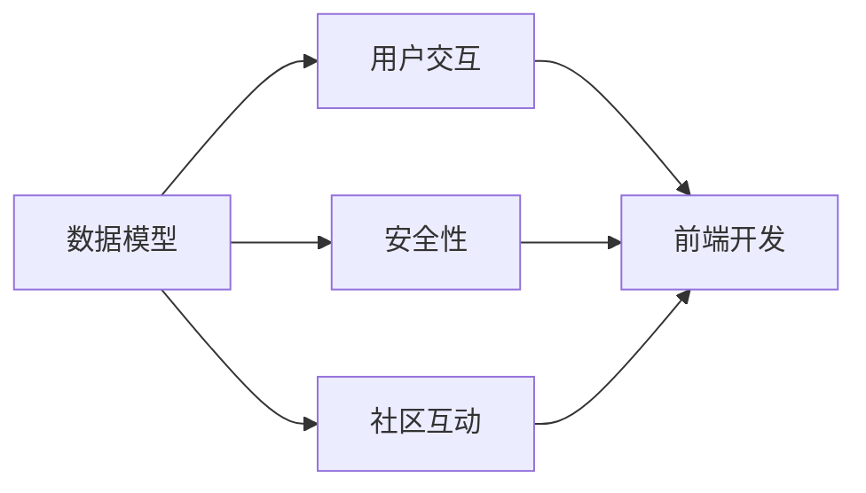

                 

# 打造个人知识管理的移动应用

> 关键词：知识管理,移动应用,数据模型,用户交互,安全性,社区互动,未来展望

## 1. 背景介绍

### 1.1 问题由来

在信息爆炸的时代，个人知识管理（Knowledge Management, KM）成为现代人获取知识、提升工作效率、优化学习路径的关键。随着数字化办公和移动设备的普及，传统的纸质笔记本、桌面工具已无法满足人们的实时、便捷、智能化的知识管理需求。因此，构建一个高效、智能、易用的移动知识管理应用，已成为很多用户和开发者关注的焦点。

### 1.2 问题核心关键点

本文将从知识管理的角度出发，探讨如何通过移动应用帮助用户高效存储、组织、检索和共享知识。我们关注的核心关键点包括：

- 数据模型设计：如何设计高效的数据模型，支持知识结构化和检索。
- 用户交互设计：如何设计直观易用的用户界面，提升用户体验。
- 安全性保障：如何在知识共享和协作时保障用户数据的安全性。
- 社区互动功能：如何通过社区功能增强知识分享和协作的氛围。
- 未来展望：未来的知识管理移动应用将具备哪些新功能和趋势。

## 2. 核心概念与联系

### 2.1 核心概念概述

构建个人知识管理的移动应用，需要考虑多个核心概念，包括：

- **数据模型**：用于存储和管理知识内容的数据结构。
- **用户交互**：应用界面和交互方式，直接影响用户体验。
- **安全性**：保护用户数据的隐私和安全。
- **社区互动**：促进用户之间的知识交流和协作。
- **技术栈选择**：选择合适的技术栈实现应用，包括后端、前端和数据库等。

这些核心概念通过合理的架构设计和技术实现，紧密联系在一起，共同构成了知识管理应用的基石。

### 2.2 核心概念原理和架构的 Mermaid 流程图



这个流程图展示了数据模型、用户交互、安全性、社区互动等核心概念之间的联系。

## 3. 核心算法原理 & 具体操作步骤

### 3.1 算法原理概述

知识管理应用的核心算法主要涉及数据模型设计、搜索算法和社区推荐算法。

- **数据模型设计**：采用文档模型（Document Model）或图模型（Graph Model）来存储和管理知识内容。
- **搜索算法**：利用倒排索引、TF-IDF等算法实现高效检索。
- **社区推荐算法**：基于用户行为和兴趣模型，推荐知识内容给用户。

### 3.2 算法步骤详解

**步骤1：数据模型设计**

设计数据模型是知识管理应用的基础。常用的数据模型包括：

- **文档模型**：将知识内容以文档的形式存储，每个文档可以包含多个段落，每个段落包含多个句子，每个句子包含多个词。文档之间通过关键词或标签进行关联。
- **图模型**：将知识内容表示为节点和边，节点表示知识点，边表示知识点之间的关系。

**步骤2：用户交互设计**

用户交互设计涉及界面设计和交互方式设计，常用的交互方式包括：

- **笔记编辑**：支持富文本编辑，使用Markdown语法。
- **标签管理**：通过标签对知识内容进行分类和组织。
- **搜索和筛选**：提供高级搜索功能，支持全文搜索、关键词搜索和分类搜索。

**步骤3：安全性保障**

安全性是知识管理应用的重要保障，包括：

- **数据加密**：对敏感数据进行加密存储和传输。
- **访问控制**：根据用户角色分配权限，保障数据安全。
- **审计日志**：记录所有操作，便于追溯和审计。

**步骤4：社区互动功能**

社区互动功能旨在增强用户之间的知识交流和协作，常用的功能包括：

- **讨论区**：用户可以在讨论区发布问题和答案，与其他用户互动。
- **知识共享**：支持用户将自己的知识内容分享给其他用户。
- **协作编辑**：多人协作编辑同一文档或知识库。

### 3.3 算法优缺点

**优点**：

- **用户友好**：直观易用的用户界面，提升用户体验。
- **高效检索**：先进的搜索算法，支持快速检索。
- **社区协作**：社区互动功能增强知识分享和协作。

**缺点**：

- **复杂性高**：数据模型设计复杂，实现难度大。
- **安全性风险**：用户数据存在被攻击的风险。
- **性能瓶颈**：大量数据可能导致性能瓶颈。

### 3.4 算法应用领域

知识管理应用可以应用于多个领域，包括但不限于：

- **学术研究**：帮助研究人员整理和管理学术论文、笔记和数据。
- **教育培训**：帮助教师和学生组织和管理教学资源。
- **个人成长**：帮助个人整理和管理个人知识、技能和经验。
- **企业知识管理**：帮助企业组织和共享内部知识资源。

## 4. 数学模型和公式 & 详细讲解 & 举例说明

### 4.1 数学模型构建

知识管理应用的数据模型设计可以使用文档模型或图模型。以下是文档模型的详细设计：

**文档模型**

一个文档包含多个段落，每个段落包含多个句子，每个句子包含多个词。假设文档总数为 $N$，段落总数为 $M$，句子总数为 $K$，词汇总数为 $W$，文档、段落、句子和词之间的关系可以表示为：

$$
\text{Doc} \rightarrow \text{Para}, \quad \text{Para} \rightarrow \text{Sentence}, \quad \text{Sentence} \rightarrow \text{Word}
$$

**图模型**

图模型将知识点表示为节点，知识点之间的关系表示为边。节点和边的属性包括：

- 节点：知识点的属性，如标题、内容、标签等。
- 边：知识点的关系属性，如引用关系、分类关系等。

### 4.2 公式推导过程

**搜索算法**

倒排索引（Inverted Index）是常用的搜索引擎算法，其基本思想是将文档中的每个词与其出现的文档列表建立映射关系。假设倒排索引为 $I$，其中 $I=\{(w, d)\}$，$w$ 表示词，$d$ 表示包含该词的文档列表。则文档 $D$ 中包含词 $w$ 的文档数可以表示为：

$$
\text{Count}_{D}(w) = \sum_{d \in D} \delta_{d \in I(w)}
$$

其中 $\delta$ 为指示函数。

**社区推荐算法**

社区推荐算法通常使用协同过滤（Collaborative Filtering）和内容推荐（Content-Based Filtering）相结合的方式。协同过滤通过分析用户行为和兴趣，推荐相似用户喜欢的内容。内容推荐通过分析内容特征，推荐与用户兴趣相似的内容。

假设用户 $U$ 对内容 $C$ 的兴趣度为 $I_{U,C}$，内容 $C$ 的特征向量为 $F_C$，用户 $U$ 的特征向量为 $F_U$。则协同过滤推荐算法可以表示为：

$$
I_{U,C} \propto \langle F_U, F_C \rangle \times \langle F_U, F_C \rangle
$$

其中 $\langle \cdot, \cdot \rangle$ 表示向量点积。

### 4.3 案例分析与讲解

以学术研究应用为例，分析如何构建知识管理应用。假设一个学术研究人员需要对大量学术论文进行管理和分析。可以使用文档模型设计知识管理应用，将所有学术论文表示为文档，段落表示论文的不同部分，句子表示段落的不同段落，词表示句子的关键词。通过标签管理功能，可以对论文进行分类和组织，如按主题、作者等进行划分。

在搜索算法方面，可以使用倒排索引算法，通过输入关键词快速定位到相关论文。在社区推荐算法方面，可以通过分析研究人员的行为和兴趣，推荐相关的论文和会议。

## 5. 项目实践：代码实例和详细解释说明

### 5.1 开发环境搭建

1. 选择技术栈
   - 后端：Node.js + Express
   - 前端：React Native
   - 数据库：MongoDB

2. 环境配置
   - 安装Node.js和MongoDB
   - 安装React Native开发工具

### 5.2 源代码详细实现

以下是使用Node.js和React Native构建知识管理应用的示例代码：

**后端代码**

```javascript
const express = require('express');
const mongodb = require('mongodb');

const app = express();
const port = 3000;
const url = 'mongodb://localhost:27017';

app.use(express.json());

const db = mongodb.MongoClient.connect(url);

app.post('/notes', async (req, res) => {
  const { title, content, tags } = req.body;
  const note = { title, content, tags };
  const collection = db.collection('notes');
  await collection.insertOne(note);
  res.json({ message: 'Note created successfully' });
});

app.get('/notes', async (req, res) => {
  const collection = db.collection('notes');
  const notes = await collection.find().toArray();
  res.json(notes);
});

app.listen(port, () => {
  console.log(`Server running on port ${port}`);
});
```

**前端代码**

```javascript
import React, { useState, useEffect } from 'react';
import { Text, View, TextInput, Button, FlatList } from 'react-native';

const NotesList = () => {
  const [notes, setNotes] = useState([]);
  const [newNote, setNewNote] = useState('');

  useEffect(() => {
    fetch('http://localhost:3000/notes')
      .then(response => response.json())
      .then(data => setNotes(data))
      .catch(error => console.error(error));
  }, []);

  const handleCreateNote = () => {
    if (newNote) {
      fetch('http://localhost:3000/notes', {
        method: 'POST',
        headers: { 'Content-Type': 'application/json' },
        body: JSON.stringify({ title: newNote, content: '', tags: [] }),
      })
        .then(response => response.json())
        .then(data => {
          setNotes([...notes, data]);
          setNewNote('');
        })
        .catch(error => console.error(error));
    }
  };

  const renderNote = ({ item }) => (
    <View>
      <Text>{item.title}</Text>
      <Text>{item.content}</Text>
      <Text>{item.tags.join(', ')}</Text>
      <Button title="Delete" onPress={() => {}} />
    </View>
  );

  return (
    <View>
      <TextInput value={newNote} onChangeText={setNewNote} />
      <Button title="Create Note" onPress={handleCreateNote} />
      <FlatList data={notes} renderItem={renderNote} keyExtractor={item => item.id} />
    </View>
  );
};

export default NotesList;
```

### 5.3 代码解读与分析

**后端代码**

- `express`：用于构建HTTP服务器，处理路由和请求。
- `mongodb`：用于连接MongoDB数据库，进行CRUD操作。
- `/json`：解析请求体和返回JSON格式的数据。

**前端代码**

- `react-native`：用于构建跨平台移动应用。
- `TextInput`：文本输入框，用于输入笔记标题和内容。
- `Button`：按钮，用于提交笔记。
- `FlatList`：列表，用于显示笔记列表。

### 5.4 运行结果展示

- 在后端运行代码后，可以使用 `http://localhost:3000/notes` 访问 API，查看和管理笔记。
- 在前端运行代码后，可以使用模拟器或真机进行测试，创建和查看笔记。

## 6. 实际应用场景

### 6.1 学术研究

学术研究应用可以帮助研究人员高效管理和组织学术论文、笔记和数据。研究人员可以将自己的研究成果保存在应用中，通过标签和分类功能进行组织和检索，方便未来查找和引用。

### 6.2 教育培训

教育培训应用可以帮助教师和学生整理和管理教学资源。教师可以将自己的课件、教学视频、参考资料等保存在应用中，通过分组和标签功能进行组织和共享。学生可以方便地获取所需的教学资源，提高学习效率。

### 6.3 个人成长

个人成长应用可以帮助个人整理和管理个人知识、技能和经验。用户可以将自己的读书笔记、学习笔记、生活感悟等保存在应用中，通过标签和分类功能进行组织和分享。

### 6.4 企业知识管理

企业知识管理应用可以帮助企业组织和共享内部知识资源。企业可以将内部的技术文档、项目资料、客户案例等保存在应用中，通过权限控制和协作功能进行管理。员工可以方便地获取所需的知识资源，提升工作效率。

## 7. 工具和资源推荐

### 7.1 学习资源推荐

- **《知识管理理论与实践》**：一本介绍知识管理理论和实践的经典书籍，适合全面了解知识管理的基础概念和技术。
- **Coursera《知识管理》课程**：由哥伦比亚大学开设的知识管理在线课程，涵盖了知识管理的理论和应用。
- **Google Scholar**：一个强大的学术搜索工具，可以帮助用户获取最新的学术论文和研究成果。

### 7.2 开发工具推荐

- **Git**：版本控制工具，适合团队协作和代码管理。
- **JIRA**：项目管理工具，适合跟踪和管理项目进度。
- **Slack**：即时通讯工具，适合团队沟通和协作。

### 7.3 相关论文推荐

- **Knowledge Management: A Contemporary Overview and Critical Evaluation**：一篇综述性论文，介绍了知识管理的最新进展和应用案例。
- **Understanding Users’ Knowledge Sharing Intentions and Behaviors**：一篇研究用户知识共享行为的论文，提供了丰富的数据分析和用户行为模型。
- **A Survey on Collaborative Knowledge Sharing Systems**：一篇综述性论文，介绍了协同知识共享系统的最新研究成果和应用场景。

## 8. 总结：未来发展趋势与挑战

### 8.1 研究成果总结

本文从数据模型设计、用户交互设计、安全性保障、社区互动功能等角度，探讨了如何构建高效、智能、易用的个人知识管理移动应用。通过分析现有应用的优缺点，提出了一些改进建议。

### 8.2 未来发展趋势

未来，知识管理应用将具备以下发展趋势：

- **实时同步**：实现多端实时同步，支持用户在多个设备上无缝协作。
- **语音输入**：支持语音输入，提高用户输入效率。
- **图像识别**：通过图像识别技术，自动提取图片中的知识信息。
- **增强现实**：结合增强现实技术，在真实场景中展示知识信息。
- **AI辅助**：引入AI技术，自动生成笔记摘要和标签。

### 8.3 面临的挑战

尽管知识管理应用有诸多优点，但在实际应用中仍面临以下挑战：

- **用户粘性**：如何设计界面和功能，提升用户使用粘性。
- **数据隐私**：如何保障用户数据的安全性和隐私性。
- **跨平台兼容性**：如何保证应用在不同平台上的兼容性。
- **扩展性**：如何应对大规模数据和用户增长的需求。

### 8.4 研究展望

未来的知识管理应用将融合更多前沿技术，如AI、物联网、区块链等，构建更全面、智能、安全的应用场景。这些技术的应用，将极大地提升知识管理应用的性能和用户体验，推动知识管理领域的进一步发展。

## 9. 附录：常见问题与解答

**Q1：如何设计高效的数据模型？**

A: 设计高效的数据模型需要考虑数据类型、数据关系和数据冗余。常用的数据模型包括文档模型和图模型。文档模型适用于存储和检索结构化文本数据，图模型适用于存储和检索关系型数据。

**Q2：如何进行高效的搜索算法？**

A: 高效的搜索算法包括倒排索引和TF-IDF。倒排索引将文档中的每个词与其出现的文档列表建立映射关系，可以快速定位到包含关键词的文档。TF-IDF通过计算词频和逆文档频率，评估词的重要性，提升搜索结果的相关性。

**Q3：如何保障社区互动的安全性？**

A: 保障社区互动的安全性需要设计合适的权限控制机制，如用户角色管理、访问控制和数据加密。同时，需要记录所有操作，生成审计日志，便于追溯和审计。

**Q4：如何提升用户粘性？**

A: 提升用户粘性需要设计直观易用的界面和功能，如笔记编辑、标签管理、搜索和筛选等。同时，需要提供丰富的社区互动功能，如讨论区、知识共享和协作编辑等，增强用户之间的互动和协作。

**Q5：如何应对大规模数据和用户增长的需求？**

A: 应对大规模数据和用户增长的需求需要设计高效的算法和架构，如分布式存储和计算、缓存机制和负载均衡等。同时，需要设计合适的数据迁移策略，确保数据的可靠性和完整性。

---

作者：禅与计算机程序设计艺术 / Zen and the Art of Computer Programming

