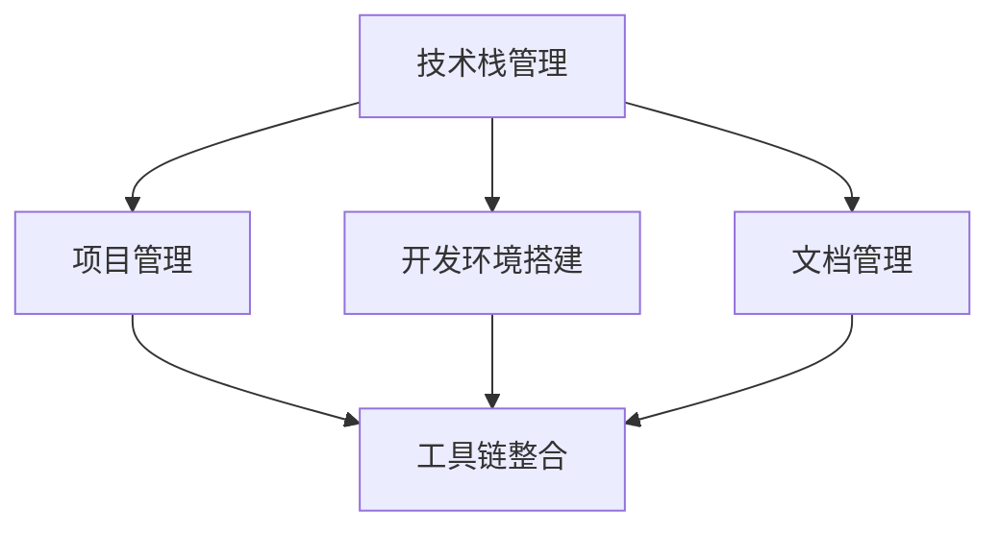
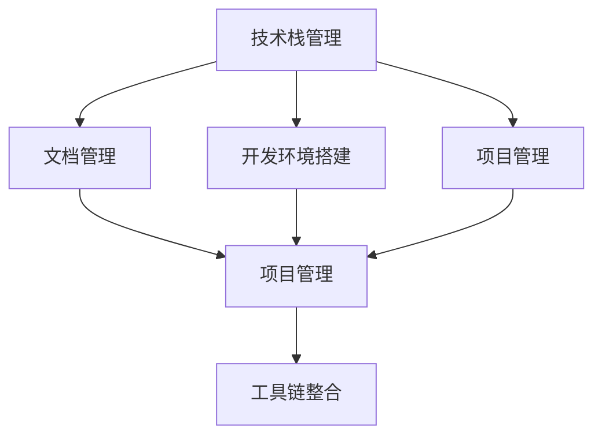

                 

# 打造个人知识管理系统:程序员实战指南

> 关键词：个人知识管理,程序员,技术栈管理,项目管理,软件开发

## 1. 背景介绍

### 1.1 问题由来
在当今信息爆炸的时代，程序员面临海量的技术文档、开发资源、工具库和项目资料。如何高效地组织、查找、利用这些知识资源，成为了每一个程序员必须面对的挑战。传统的纸质笔记本、办公软件虽然功能简单，但难以适应程序员动态、多变的知识需求。现代的软件开发项目，日益复杂，协作人数众多，仅仅依靠简单的代码版本控制、协作工具已无法满足项目管理的需求。

因此，打造一个高效、灵活、可扩展的个人知识管理系统，成为了程序员提升工作效率、促进个人成长的关键。一个完善的知识管理工具，能够帮助程序员：

- 高效组织和管理技术文档、代码片段、项目资料
- 快速定位并利用已有的知识资源
- 追踪个人技术栈的演进和提升
- 提高团队协作效率，推动项目进展

本文将从核心概念、核心算法、实践操作、案例分析、未来展望等多个维度，深入探讨如何通过构建个人知识管理系统，提升程序员的开发效率和项目成功率。

## 2. 核心概念与联系

### 2.1 核心概念概述

构建个人知识管理系统，涉及到多个核心概念，它们相互关联，共同构成了知识管理的全貌。

- **技术栈管理**：指对编程语言、框架、库等技术组件的梳理和规划，以指导技术选型和项目开发。
- **项目管理**：涉及任务分配、进度跟踪、风险管理等，确保项目按时高质量交付。
- **开发环境搭建**：包括代码仓库管理、版本控制、依赖管理等，保障代码稳定可复现。
- **文档管理**：记录项目开发过程中的设计思路、实现细节、问题调试等内容，便于知识共享和传承。
- **工具链整合**：通过集成各类开发、测试、部署工具，提升整体工作效率。

这些概念的联系，可通过以下Mermaid流程图来展示：



这个流程图展示了各个概念之间的逻辑关系：

1. 技术栈管理是项目管理和开发环境搭建的基础。
2. 项目管理是协调技术栈管理和工具链整合的关键环节。
3. 开发环境搭建为技术栈管理和项目管理提供了稳定的技术支撑。
4. 文档管理为技术栈管理和项目管理提供了知识依据。
5. 工具链整合为技术栈管理、项目管理、开发环境搭建和文档管理提供了高效工具。

### 2.2 核心概念原理和架构的 Mermaid 流程图



通过以上流程图，可以清晰地看到技术栈、文档、开发环境、项目管理和工具链整合之间的相互依赖关系。

## 3. 核心算法原理 & 具体操作步骤

### 3.1 算法原理概述

个人知识管理的核心算法可以概括为以下几个步骤：

1. **技术栈梳理与规划**：识别当前技术栈中的关键组件和薄弱环节，规划未来的技术演进路径。
2. **知识文档收集与整理**：将项目开发中的各类文档、代码片段、技术记录进行分类整理。
3. **开发环境搭建与管理**：选择和使用合适的代码管理工具、依赖管理工具、持续集成工具等，保证代码稳定可复现。
4. **项目管理与跟踪**：使用敏捷开发、看板管理等方法，跟踪任务进度、风险管理，确保项目按时交付。
5. **工具链整合与优化**：集成各类开发、测试、部署工具，提升整体工作效率。

这些步骤相互关联，共同实现高效的知识管理。

### 3.2 算法步骤详解

以下我们将详细介绍每一个核心算法的详细步骤：

#### 3.2.1 技术栈梳理与规划

1. **识别现有技术栈**：列出当前项目使用的编程语言、框架、库、工具等，进行分类。
2. **评估技术栈的健康度**：分析现有技术栈的强项和弱项，找出潜在的瓶颈和风险点。
3. **规划未来技术栈**：结合项目需求、团队能力、技术趋势等因素，规划未来的技术演进路径。

#### 3.2.2 知识文档收集与整理

1. **文档收集**：将项目中的设计文档、开发笔记、测试报告、技术博文等进行收集。
2. **文档整理**：对收集到的文档进行分类整理，如按模块、按项目阶段、按主题等。
3. **文档存储与检索**：选择合适的文档管理系统，如Notion、Confluence等，进行存储和快速检索。

#### 3.2.3 开发环境搭建与管理

1. **代码仓库管理**：使用Git等版本控制工具，对项目代码进行管理和协作。
2. **依赖管理**：使用Pip、Maven等工具，管理项目的依赖关系，避免冲突和版本不兼容。
3. **持续集成**：使用Jenkins、Travis CI等工具，实现代码的持续集成和自动化测试。

#### 3.2.4 项目管理与跟踪

1. **任务管理**：使用Trello、Jira等工具，进行任务拆分和进度跟踪。
2. **风险管理**：定期进行风险评估和问题解决，确保项目顺利推进。
3. **进度报告**：定期生成项目进展报告，反馈团队成员和上级管理。

#### 3.2.5 工具链整合与优化

1. **开发工具集成**：将IDE、调试器、文本编辑器等工具进行集成，提升开发效率。
2. **测试工具集成**：将测试框架、覆盖率分析工具等集成，提升测试覆盖率。
3. **部署工具集成**：将部署脚本、容器化工具等集成，提升部署效率和稳定性。

### 3.3 算法优缺点

个人知识管理系统具有以下优点：

1. **提升工作效率**：通过梳理技术栈、整理文档、统一工具链，提升开发效率，减少重复劳动。
2. **促进团队协作**：文档管理、版本控制、任务跟踪等手段，有助于团队协作，提高项目成功率。
3. **促进个人成长**：技术栈规划、项目管理、知识记录等，有助于总结经验，提升技术水平。

同时，该系统也存在以下缺点：

1. **初始成本高**：选择工具和平台、进行配置和集成，需要投入大量时间和精力。
2. **维护成本高**：随着项目的演进，知识管理系统需要不断维护和更新，确保信息准确和最新。
3. **工具依赖性强**：工具链的稳定性和适用性对知识管理系统的运行有很大影响。
4. **数据安全风险**：文档、代码等敏感信息需要妥善存储和管理，防止泄露。

### 3.4 算法应用领域

个人知识管理系统在软件开发、IT运维、项目管理等多个领域都有广泛应用：

- **软件开发**：技术栈管理、文档管理、开发环境搭建、项目管理、工具链整合等。
- **IT运维**：文档管理、监控系统集成、工具链整合等。
- **项目管理**：任务管理、进度跟踪、风险管理、报告生成等。

## 4. 数学模型和公式 & 详细讲解 & 举例说明

### 4.1 数学模型构建

构建个人知识管理系统，需要构建多个子模型，以支撑知识管理的各个环节。以下是几个典型的数学模型：

#### 4.1.1 技术栈健康度评估模型

**定义**：

- $H_i$：第 $i$ 个技术栈组件的健康度评分，$0 \leq H_i \leq 1$，$0$ 表示极差，$1$ 表示极优。
- $W_i$：第 $i$ 个技术栈组件的权重，反映其对项目的重要性。
- $S_i$：第 $i$ 个技术栈组件的性能评分，$0 \leq S_i \leq 1$，$0$ 表示极差，$1$ 表示极优。
- $N$：技术栈组件的数量。

**模型公式**：

$$
H = \sum_{i=1}^{N} W_i \cdot H_i
$$

其中，$H$ 为技术栈整体健康度评分。

**推导过程**：

1. 将每个技术栈组件的健康度评分 $H_i$ 和性能评分 $S_i$ 分别表示为 $[0,1]$ 之间的连续值。
2. 根据技术栈组件对项目的重要性，给每个组件赋予权重 $W_i$。
3. 对每个组件的评分乘以对应的权重，并求和，得到技术栈整体健康度评分 $H$。

**案例分析**：

假设有三个技术栈组件，分别记为 A、B、C。假设它们的健康度评分分别为 0.7、0.9、0.5，性能评分分别为 0.8、0.6、0.4。假设 A 和 B 对项目的重要性和 C 相同，均记为 $W_A = W_B = W_C = 1$。则整体健康度评分为：

$$
H = 1 \cdot 0.7 + 1 \cdot 0.9 + 1 \cdot 0.5 = 2.1
$$

### 4.2 公式推导过程

假设技术栈中 A、B、C 三个组件的权重分别为 $W_A = 0.4$，$W_B = 0.3$，$W_C = 0.3$，健康度评分分别为 $H_A = 0.8$，$H_B = 0.6$，$H_C = 0.4$，性能评分分别为 $S_A = 0.9$，$S_B = 0.7$，$S_C = 0.5$。则整体健康度评分为：

$$
H = 0.4 \cdot 0.8 + 0.3 \cdot 0.6 + 0.3 \cdot 0.4 = 0.8 + 0.18 + 0.12 = 1.1
$$

由于健康度评分和性能评分都是连续值，可以通过平滑过渡的方法进行处理，使得模型更加准确。

### 4.3 案例分析与讲解

假设 A 组件的重要性高于 C 组件，因此 $W_A > W_C$。这意味着，A 组件的评分对整体健康度影响更大。

## 5. 项目实践：代码实例和详细解释说明

### 5.1 开发环境搭建

**开发环境搭建**：

1. **安装 Git**：
   ```bash
   brew install git
   ```

2. **安装 Jira**：
   ```bash
   sudo apt-get install jira
   ```

3. **安装 Jenkins**：
   ```bash
   sudo apt-get install jenkins
   ```

4. **安装 GitHub**：
   ```bash
   brew install github
   ```

5. **配置代码仓库**：
   ```bash
   git clone https://github.com/username/repo.git
   ```

6. **配置 Jira**：
   - 在 Jira 中输入项目信息，包括名称、描述、截图等。
   - 创建任务和子任务，分配给团队成员。

7. **配置 Jenkins**：
   - 在 Jenkins 中配置 Git 仓库。
   - 配置持续集成流程，包括编译、测试、部署等步骤。

### 5.2 源代码详细实现

**代码实现**：

1. **Git 仓库管理**：
   ```python
   import git
   repo = git.Repo("path/to/repo")
   repo.clone(url="https://github.com/username/repo.git")
   ```

2. **Jira 任务管理**：
   ```python
   import jira
   jira = jira.Jira("url", username="username", password="password")
   jira.create_issue(project="project-key", summary="summary", description="description")
   ```

3. **Jenkins 持续集成**：
   ```python
   import jenkins
   server = jenkins.Jenkins("url", username="username", password="password")
   server.build("job-name")
   ```

4. **Jenkins 持续集成**：
   ```python
   import jenkins
   server = jenkins.Jenkins("url", username="username", password="password")
   server.build("job-name")
   ```

5. **文档管理系统**：
   ```python
   import confluence
   wiki = confluence.Confluence("url", username="username", password="password")
   wiki.create_page("title", "content")
   ```

### 5.3 代码解读与分析

**代码解读**：

1. **Git 仓库管理**：使用 `git` 工具进行版本控制，使用 `git clone` 命令克隆代码仓库，进行本地操作。
2. **Jira 任务管理**：使用 `jira` 工具创建和分配任务，跟踪项目进度。
3. **Jenkins 持续集成**：使用 `jenkins` 工具实现代码的持续集成和自动化测试，确保代码稳定可复现。
4. **文档管理系统**：使用 `confluence` 工具创建和管理文档，便于团队协作和知识传承。

**分析**：

1. **版本控制**：使用 Git 进行版本控制，确保代码的历史可追溯，减少开发中的冲突和错误。
2. **任务跟踪**：使用 Jira 进行任务管理，明确项目阶段和责任人，提升项目进度管理效率。
3. **自动化测试**：使用 Jenkins 进行持续集成，确保每次提交的代码都能自动化测试，减少手动测试的工作量。
4. **文档管理**：使用 Confluence 进行文档管理，记录项目开发中的设计思路、实现细节、问题调试等内容，便于团队协作和知识传承。

### 5.4 运行结果展示

**运行结果展示**：

1. **版本控制**：
   ```bash
   git status
   ```

2. **任务跟踪**：
   ```bash
   jira list tasks
   ```

3. **持续集成**：
   ```bash
   jenkins build job-name
   ```

4. **文档管理**：
   ```bash
   confluence create page
   ```

## 6. 实际应用场景

### 6.1 软件开发项目

**应用场景**：

1. **技术栈梳理与规划**：
   - 识别当前技术栈中的关键组件和薄弱环节。
   - 规划未来的技术演进路径。

2. **文档收集与整理**：
   - 收集项目中的设计文档、开发笔记、测试报告、技术博文等。
   - 对收集到的文档进行分类整理，如按模块、按项目阶段、按主题等。
   - 选择合适的文档管理系统，如 Notion、Confluence 等，进行存储和快速检索。

3. **开发环境搭建与管理**：
   - 使用 Git 进行代码版本控制。
   - 使用 Pip、Maven 等工具进行依赖管理。
   - 使用 Jenkins 进行持续集成和自动化测试。

4. **项目管理与跟踪**：
   - 使用 Trello、Jira 等工具进行任务拆分和进度跟踪。
   - 定期进行风险评估和问题解决，确保项目顺利推进。
   - 定期生成项目进展报告，反馈团队成员和上级管理。

### 6.2 项目管理项目

**应用场景**：

1. **任务管理**：
   - 使用 Trello、Jira 等工具进行任务拆分和进度跟踪。
   - 定期评估任务进度，及时调整计划。
   - 跟踪任务状态，确保按时交付。

2. **风险管理**：
   - 定期进行风险评估，识别和解决潜在问题。
   - 制定应对策略，降低风险影响。

3. **进度报告**：
   - 定期生成项目进展报告，反馈团队成员和上级管理。
   - 分析项目进度，优化资源配置，提升项目效率。

## 7. 工具和资源推荐

### 7.1 学习资源推荐

**学习资源**：

1. **《代码大全》**：
   - 介绍编程技巧、代码设计等，是程序员必须掌握的代码管理入门书。

2. **《敏捷项目管理》**：
   - 介绍敏捷项目管理方法论，提升项目管理和团队协作能力。

3. **《高效开发工具》**：
   - 介绍常用的开发、测试、部署工具，提升开发效率和代码质量。

4. **《编程规范化》**：
   - 介绍编程规范和最佳实践，提升代码可维护性和可扩展性。

5. **《团队协作》**：
   - 介绍团队协作方法，提升项目成功率和团队凝聚力。

### 7.2 开发工具推荐

**开发工具**：

1. **Git**：
   - 版本控制工具，确保代码的历史可追溯，减少开发中的冲突和错误。

2. **Jira**：
   - 项目管理工具，跟踪任务进度、分配任务，确保项目按时交付。

3. **Jenkins**：
   - 持续集成工具，实现代码的持续集成和自动化测试，确保代码稳定可复现。

4. **Notion**：
   - 文档管理系统，记录项目开发中的设计思路、实现细节、问题调试等内容，便于团队协作和知识传承。

5. **Confluence**：
   - 文档管理系统，创建和管理文档，便于团队协作和知识传承。

### 7.3 相关论文推荐

**相关论文**：

1. **《软件架构与设计》**：
   - 介绍软件架构和设计方法，提升软件系统的可扩展性和可维护性。

2. **《敏捷软件开发实践》**：
   - 介绍敏捷开发方法论，提升项目管理和团队协作能力。

3. **《云计算与大数据》**：
   - 介绍云计算和大数据技术，提升开发效率和数据处理能力。

4. **《人工智能与机器学习》**：
   - 介绍人工智能和机器学习技术，提升数据挖掘和分析能力。

5. **《人机交互与用户体验》**：
   - 介绍人机交互和用户体验设计，提升软件系统的用户体验。

## 8. 总结：未来发展趋势与挑战

### 8.1 研究成果总结

本文从技术栈管理、项目管理、开发环境搭建、文档管理、工具链整合等多个维度，深入探讨了个人知识管理的核心算法和具体操作步骤。通过梳理技术栈、整理文档、统一工具链，提升了开发效率和项目成功率，促进了个人成长和技术演进。

### 8.2 未来发展趋势

未来个人知识管理系统将向以下几个方向发展：

1. **自动化程度提升**：使用 AI 和机器学习技术，自动化生成任务列表、编写文档、生成报告等。
2. **智能化协同**：通过智能推荐系统，自动推荐任务、文档、工具等，提升协作效率。
3. **跨平台集成**：通过云服务、API 接口等方式，实现跨平台集成，提升系统灵活性。
4. **知识图谱构建**：通过知识图谱构建技术，将知识进行结构化存储，提升知识检索和应用能力。
5. **生态系统完善**：引入更多的工具和平台，构建完整的生态系统，提升系统集成度和用户体验。

### 8.3 面临的挑战

个人知识管理系统在发展过程中面临以下挑战：

1. **初始成本高**：选择工具和平台、进行配置和集成，需要投入大量时间和精力。
2. **维护成本高**：随着项目的演进，知识管理系统需要不断维护和更新，确保信息准确和最新。
3. **工具依赖性强**：工具链的稳定性和适用性对知识管理系统的运行有很大影响。
4. **数据安全风险**：文档、代码等敏感信息需要妥善存储和管理，防止泄露。

### 8.4 研究展望

未来研究需要从以下几个方面进行突破：

1. **自动化工具开发**：开发更多的自动化工具，减少人工干预，提升效率。
2. **智能化技术引入**：引入 AI 和机器学习技术，提升系统的智能化程度。
3. **跨平台集成优化**：优化跨平台集成方式，提升系统的灵活性和易用性。
4. **知识图谱应用**：深入研究知识图谱技术，提升知识检索和应用能力。
5. **安全性和隐私保护**：加强数据安全保护，防止信息泄露和滥用。

## 9. 附录：常见问题与解答

**Q1: 如何选择合适的知识管理系统？**

A: 选择合适的知识管理系统，需要考虑以下几个方面：
1. **功能需求**：根据项目需求，选择功能全面、易用的系统。
2. **用户体验**：选择界面友好、操作简便的系统，提升使用效率。
3. **可扩展性**：选择可扩展性强的系统，方便后期扩展和升级。
4. **安全性**：选择安全性高的系统，确保数据安全。

**Q2: 如何使用知识管理系统提升开发效率？**

A: 使用知识管理系统，可以从以下几个方面提升开发效率：
1. **版本控制**：使用 Git 进行版本控制，确保代码的历史可追溯，减少开发中的冲突和错误。
2. **任务管理**：使用 Jira 进行任务管理，明确项目阶段和责任人，提升项目进度管理效率。
3. **文档管理**：使用 Confluence 进行文档管理，记录项目开发中的设计思路、实现细节、问题调试等内容，便于团队协作和知识传承。
4. **自动化测试**：使用 Jenkins 进行持续集成和自动化测试，确保代码稳定可复现。

**Q3: 如何管理知识管理系统？**

A: 管理知识管理系统，可以从以下几个方面进行：
1. **定期更新**：定期更新系统配置，确保系统稳定运行。
2. **数据备份**：定期进行数据备份，防止数据丢失。
3. **安全防护**：加强数据安全保护，防止信息泄露和滥用。
4. **用户培训**：对团队成员进行培训，提升系统使用效率。

**Q4: 如何应对知识管理系统的挑战？**

A: 应对知识管理系统的挑战，可以从以下几个方面进行：
1. **选择工具**：选择工具和平台时，选择成熟、稳定的系统。
2. **优化配置**：对系统进行优化配置，提高系统的运行效率。
3. **加强培训**：对团队成员进行培训，提升系统使用效率。
4. **引入自动化**：引入自动化工具，减少人工干预，提升效率。

---

作者：禅与计算机程序设计艺术 / Zen and the Art of Computer Programming

