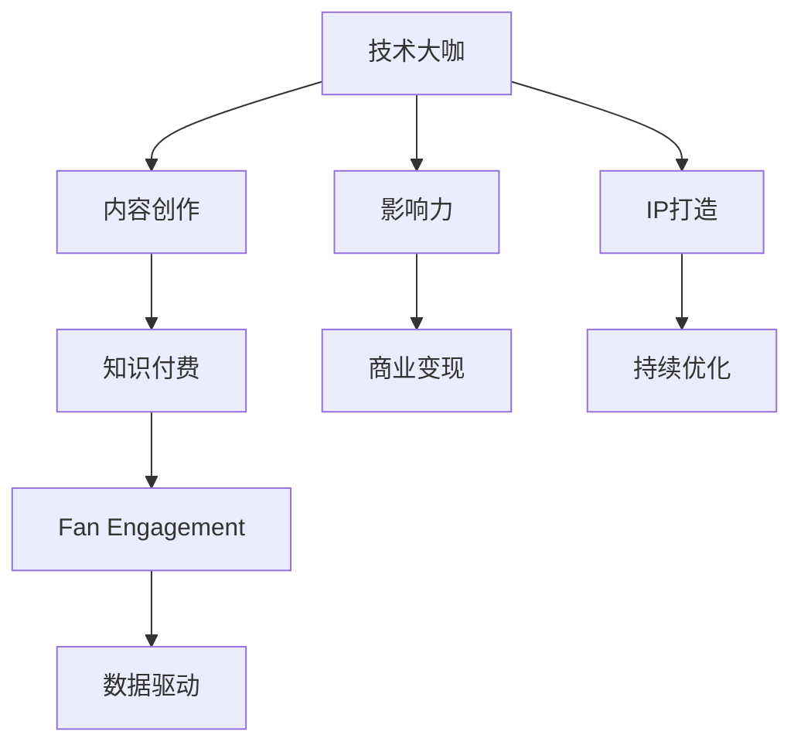

                 

# 打造技术大咖知识付费IP:方法与案例

> 关键词：知识付费,IP打造,技术大咖,内容创作,粉丝运营

## 1. 背景介绍

### 1.1 问题由来
随着互联网和移动互联网的普及，知识付费市场快速增长，越来越多的人通过订阅付费课程、购买书籍、听专家讲座等方式获取知识。技术大咖们凭借其深厚的专业知识和技术背景，成为知识付费领域的一股重要力量。他们通过撰写技术文章、录制技术视频、开设在线课程等方式，分享自身的技术见解和实战经验，帮助开发者提升技术水平，解决实际问题。

然而，随着技术大咖数量的激增，如何打造出具有独特价值和广泛影响力的IP，成为技术大咖们面临的共同挑战。本文将从IP打造的全流程出发，结合多个成功案例，详细介绍打造技术大咖知识付费IP的可行方法。

## 2. 核心概念与联系

### 2.1 核心概念概述

为更好地理解打造技术大咖知识付费IP的方法，本节将介绍几个密切相关的核心概念：

- 技术大咖(Tech Guru)：具备深厚技术积累，在特定领域内具有较高知名度和影响力的人。他们通常具有丰富的工程实践经验、卓越的编程技能和独特的技术视角。
- IP(Influential Personality)：具有鲜明个性、独特风格和广泛影响力的公众人物，能够吸引特定受众群体并产生强烈共鸣。
- 知识付费(Knowledge-Based Monetization)：指通过提供高质量的内容服务，以付费形式获取回报的商业模式。用户为获取深度专业知识和技能而支付相应费用。
- 内容创作(Content Creation)：指创作和发布有价值、有吸引力且能够满足受众需求的内容。内容创作是IP打造的重要环节。
- 粉丝运营(Fan Engagement)：通过社交媒体、社区平台等渠道与粉丝互动，建立和维护稳定的粉丝群体，增强IP的黏性和影响力。
- 数据驱动(Framework-Driven)：利用数据分析方法指导内容创作和粉丝运营策略，提升IP的影响力和商业价值。

这些核心概念之间的逻辑关系可以通过以下Mermaid流程图来展示：



这个流程图展示了大咖IP打造的全流程：

1. 大咖通过技术积累和工程经验，创作高质量的内容。
2. 将内容发布到知识付费平台，获取受众付费支持。
3. 通过社交媒体等渠道，与粉丝互动，增强粉丝黏性。
4. 利用数据分析技术，指导内容和运营策略的持续优化。
5. IP不断提升影响力，实现商业变现。
6. 在IP打造过程中，进行持续优化，提升商业价值。

## 3. 核心算法原理 & 具体操作步骤
### 3.1 算法原理概述

打造技术大咖知识付费IP，本质上是一个内容创作、粉丝运营和商业变现的闭环过程。其核心思想是：通过高质量的内容创作和有效的粉丝运营策略，构建一个具有高度黏性和影响力的IP，进而通过知识付费平台实现商业变现。

### 3.2 算法步骤详解

打造技术大咖IP的过程可以分解为以下几个关键步骤：

**Step 1: 确定目标受众和领域**
- 分析现有市场和竞争环境，确定目标受众群体。
- 明确自己的专业领域和知识储备，确定内容创作方向。

**Step 2: 创作高质量内容**
- 选择合适的平台和发布方式，如博客、视频、课程等。
- 结合自身的技术经验，创作有价值、有深度、易理解的内容。
- 保持内容的持续性和稳定性，定期更新内容，保持粉丝的关注和兴趣。

**Step 3: 粉丝互动与运营**
- 利用社交媒体平台，如微博、微信、LinkedIn等，与粉丝互动。
- 建立粉丝社区，鼓励用户提问、评论和分享。
- 定期举办技术沙龙、线上讲座等活动，增加粉丝黏性。

**Step 4: 数据驱动优化**
- 使用数据分析工具，监测内容的表现和粉丝的反馈。
- 根据数据反馈，调整内容创作策略和粉丝运营方案。
- 利用机器学习算法，预测用户行为，优化内容发布计划。

**Step 5: 商业变现**
- 将内容发布到付费平台，如知乎live、B站付费课程、网易云课堂等。
- 提供个性化的知识付费服务，如一对一咨询、定制化解决方案等。
- 定期分析收入和支出，优化商业变现策略。

以上是打造技术大咖知识付费IP的一般流程。在实际应用中，还需要根据自身特点和市场需求，对各环节进行优化设计，如内容多样化、粉丝互动频繁化、商业变现多元化等，以进一步提升IP的影响力和商业价值。

### 3.3 算法优缺点

打造技术大咖IP的方法具有以下优点：
1. 高效积累粉丝。通过高质量的内容创作，可以迅速吸引并稳定目标受众。
2. 增强品牌影响力。高质量的内容和技术背景，能够提升IP的专业性和权威性。
3. 提供多样化服务。结合多种付费模式，满足不同用户的需求，增加商业变现的渠道。
4. 数据驱动优化。利用数据分析指导内容创作和运营策略，提升IP的商业价值。

同时，该方法也存在一定的局限性：
1. 需要大量时间和精力。创作高质量内容，维护粉丝互动，都需要持续投入。
2. 依赖粉丝忠诚度。如果粉丝流失，IP的影响力和商业价值将受到较大影响。
3. 市场竞争激烈。技术大咖众多，如何脱颖而出，获取更多用户关注，是一个挑战。
4. 内容需要持续更新。需要不断创作新内容，才能保持粉丝的持续关注和兴趣。
5. 商业变现方式有限。尽管多样化，但不同平台和模式的效果差异较大。

尽管存在这些局限性，但就目前而言，高质量内容创作和有效粉丝运营是打造IP的核心要素，值得持续投入和优化。

### 3.4 算法应用领域

打造技术大咖知识付费IP的方法，在技术领域已经得到了广泛应用，涵盖了许多常见领域，例如：

- 软件开发：通过分享编程技巧、架构设计、技术栈选择等内容，提升开发者的技术水平。
- 数据科学：分享数据清洗、模型训练、数据分析等内容，帮助数据科学家解决实际问题。
- 人工智能：讲解机器学习算法、深度学习模型、数据增强等内容，促进AI技术的普及和应用。
- 区块链：分享区块链技术原理、智能合约开发、安全防护等内容，帮助企业应用区块链技术。
- 云计算：讲解云计算平台使用、容器化部署、云原生架构等内容，提升企业云化水平。
- 物联网：分享物联网设备开发、边缘计算、安全通信等内容，推动物联网技术的应用。
- 安全领域：讲解安全漏洞分析、加密算法、威胁情报等内容，帮助企业和用户提升安全防护能力。
- 教育培训：通过在线课程、直播讲座等方式，传授软件开发、数据科学、人工智能等领域的知识和技能。

除了上述这些经典领域外，技术大咖的知识付费IP也在不断拓展到更多场景中，如可穿戴设备、机器人技术、生物计算等，为技术应用带来了新的方向。

## 4. 数学模型和公式 & 详细讲解  
### 4.1 数学模型构建

本节将使用数学语言对打造技术大咖知识付费IP的方法进行更加严格的刻画。

设目标受众数为 $N$，内容质量为 $Q$，内容创作频率为 $F$，粉丝互动频率为 $I$，数据分析能力为 $A$，商业变现能力为 $M$。则目标函数为最大化IP的商业价值：

$$
\max_{N, Q, F, I, A, M} V = N \times F \times I \times A \times M
$$

其中，$N$、$Q$、$F$、$I$、$A$、$M$ 均为非负变量，表示IP在不同维度上的能力和表现。

### 4.2 公式推导过程

在实践中，目标函数的具体计算方式需要根据实际情况进行调整。例如，对于内容创作，可以通过点击率、浏览量、点赞数等指标来衡量内容质量 $Q$；对于粉丝互动，可以通过评论数、分享数、参与度等指标来衡量互动频率 $I$；对于数据分析，可以通过用户反馈、流量分析、内容互动等指标来衡量数据分析能力 $A$；对于商业变现，可以通过付费用户数、付费金额、转化率等指标来衡量变现能力 $M$。

通过建立目标函数，我们可以系统地衡量和优化IP的各项指标，提升商业价值。

### 4.3 案例分析与讲解

以下通过几个成功案例，分析技术大咖知识付费IP的打造方法：

**案例一：Kaggle的LakeData**

Kaggle作为全球最大的数据科学竞赛平台，拥有众多数据科学大咖和数据集。其成功的关键在于：

1. 高质量的数据集：Kaggle提供大量公开、真实、高质量的数据集，吸引了大量数据科学家和开发者。
2. 持续的内容更新：Kaggle定期发布新的数据集和竞赛任务，保持内容的持续性和新颖性。
3. 多样化的互动方式：Kaggle社区平台支持用户讨论、分享、协作，增强了粉丝的互动性和黏性。
4. 商业变现多样化：Kaggle通过广告、赞助、会员订阅等多种方式实现商业变现。

通过系统的内容创作和粉丝运营策略，Kaggle在数据科学领域建立了强大的品牌影响力，吸引了全球数百万用户。

**案例二：Coursera的Andrew Ng**

Andrew Ng是机器学习领域的权威专家，其Coursera在线课程深受欢迎。其成功的关键在于：

1. 高质量的课程内容：Andrew Ng的课程系统全面、深入浅出，能够帮助学生系统掌握机器学习知识。
2. 全球化运营：Coursera通过多语言支持、全球招生、证书颁发等方式，拓展了全球市场。
3. 互动式教学：Coursera的课程支持讨论区、作业提交、实时答疑等互动方式，增强了学生的学习体验。
4. 商业变现灵活：Coursera提供免费课程、付费课程、认证课程等多种付费方式，满足不同用户的需求。

通过高质量课程内容和有效粉丝运营，Andrew Ng在机器学习领域建立了广泛的影响力，成为知识付费领域的标杆人物。

**案例三：Medium的Claire Ma**

Claire Ma是一位技术博客作者，她的Medium博客内容广泛覆盖了编程、设计、创业等多个领域，吸引了大量读者关注。其成功的关键在于：

1. 高质量的内容创作：Claire Ma的文章系统全面、深入浅出，能够帮助读者解决实际问题。
2. 多样化的内容形式：她的文章不仅有技术文章，还包括设计灵感、创业心得等内容，满足不同用户的需求。
3. 持续的互动和交流：Claire Ma定期举办线上讲座、技术沙龙等活动，与读者进行互动交流。
4. 精准的内容推荐：Medium利用算法推荐技术，将相关文章推荐给读者，提高了内容的曝光率。

通过高质量的内容创作和精准的内容推荐，Claire Ma在技术领域建立了强大的影响力，成为多个领域的知名博主。

## 5. 项目实践：代码实例和详细解释说明
### 5.1 开发环境搭建

在进行知识付费IP打造实践前，我们需要准备好开发环境。以下是使用Python进行知识付费平台开发的常见环境配置流程：

1. 安装Python：从官网下载并安装Python，选择版本3.8以上，确保支持最新的库和框架。
2. 安装虚拟环境：使用virtualenv工具创建虚拟环境，避免不同项目之间的依赖冲突。
3. 安装必要的库：使用pip工具安装所需库，如Flask、Django、FastAPI等。
4. 设置开发环境：配置开发环境，包括数据库、版本控制、代码部署等，确保开发流程的流畅性。

### 5.2 源代码详细实现

这里我们以Medium为例，提供一个技术博客的搭建和运营的代码实现。

首先，定义博客类和博客文章类：

```python
from flask import Flask, render_template, request

app = Flask(__name__)

class Blog:
    def __init__(self, title, content, tags):
        self.title = title
        self.content = content
        self.tags = tags

class Article:
    def __init__(self, blog):
        self.blog = blog
        self.comments = []

@app.route('/')
def index():
    return render_template('index.html')
```

然后，定义博客文章管理接口：

```python
@app.route('/articles', methods=['GET', 'POST'])
def articles():
    if request.method == 'POST':
        title = request.form.get('title')
        content = request.form.get('content')
        tags = request.form.get('tags')
        blog = Blog(title, content, tags)
        # 将文章保存到数据库或文件系统中
        return '文章发布成功！'
    else:
        articles = [Article(blog) for blog in Blog.objects()]
        return render_template('articles.html', articles=articles)
```

最后，定义文章评论接口：

```python
@app.route('/articles/<id>/comments', methods=['GET', 'POST'])
def comments(id):
    blog = Blog.objects(id=id)
    if request.method == 'POST':
        comment = request.form.get('comment')
        blog.comments.append(comment)
        # 将评论保存到数据库或文件系统中
        return '评论发布成功！'
    else:
        return render_template('comments.html', comments=blog.comments)
```

以上就是使用Flask框架搭建技术博客的基本代码实现。开发者可以根据需求，进一步完善博客文章的发布、编辑、删除等功能。

### 5.3 代码解读与分析

让我们再详细解读一下关键代码的实现细节：

**Blog和Article类**：
- `Blog`类表示博客文章，包含标题、内容、标签等属性。
- `Article`类表示文章，包含博客文章对象和评论列表。

**index函数**：
- 返回主页，渲染index.html模板，展示所有文章列表。

**articles函数**：
- 处理文章的发布和查询。如果请求为POST，则创建新的博客文章；如果请求为GET，则查询数据库或文件系统中的所有文章，并返回文章列表。

**comments函数**：
- 处理文章的评论。如果请求为POST，则添加新的评论；如果请求为GET，则展示当前文章的评论列表。

代码通过Flask框架实现了简单的博客文章发布和评论功能，开发者可以根据需求，进一步完善文章编辑、搜索、排序等功能，提升用户体验。

## 6. 实际应用场景

### 6.1 在线课程平台

知识付费IP在在线课程平台中的应用非常广泛。平台提供高质量的课程内容，吸引用户付费学习。通过系统的课程发布和互动，平台能够迅速积累大量用户，实现商业变现。

在技术大咖IP的打造过程中，平台需要关注以下几个关键点：

1. 课程内容的丰富性和深度：课程内容应该覆盖全面、深入浅出，帮助用户系统掌握相关技术。
2. 多渠道传播：课程可以通过多种方式传播，如视频、文字、动画等，满足不同用户的需求。
3. 互动和反馈：课程平台应该提供讨论区、实时答疑等功能，增强用户的学习体验。
4. 商业变现模式：平台可以提供免费课程、付费课程、认证课程等多种模式，满足不同用户的需求。

通过以上措施，平台能够吸引大量用户，实现商业变现。

### 6.2 技术博客和社区

技术博客和社区是知识付费IP的重要形式之一。大咖通过发布高质量的技术文章，吸引大量读者关注和互动。社区平台可以提供评论、点赞、分享等功能，增强用户黏性。

在技术大咖IP的打造过程中，博客和社区需要关注以下几个关键点：

1. 高质量的内容创作：博客和社区需要发布系统全面、深入浅出的技术文章，帮助读者解决实际问题。
2. 多样化的内容形式：内容可以包括技术文章、代码示例、设计灵感等，满足不同用户的需求。
3. 持续的互动和交流：博客和社区可以定期举办线上讲座、技术沙龙等活动，与读者进行互动交流。
4. 精准的内容推荐：平台可以通过算法推荐技术，将相关文章推荐给读者，提高内容的曝光率。

通过以上措施，博客和社区能够迅速积累大量用户，增强用户黏性，实现商业变现。

### 6.3 技术咨询和培训

技术大咖可以通过技术咨询和培训服务，为特定企业或用户提供定制化解决方案。咨询和培训服务通常以一对一的个性化服务为主，能够快速解决用户的实际问题。

在技术大咖IP的打造过程中，咨询和培训服务需要关注以下几个关键点：

1. 需求分析：首先需要了解用户的需求和问题，制定详细的服务方案。
2. 个性化定制：根据用户的具体需求，提供定制化的技术咨询和培训服务。
3. 及时响应：咨询和培训服务需要及时响应用户的反馈，提供优质的服务体验。
4. 商业变现：可以通过一对一咨询、团队培训等方式，实现商业变现。

通过以上措施，技术大咖能够提供高效、有价值的技术服务，增强用户黏性，实现商业变现。

### 6.4 未来应用展望

随着技术大咖IP的不断发展和普及，未来的知识付费市场将更加多样化和个性化。技术大咖们将通过多种形式的内容和服务，满足不同用户的需求。以下是几个未来应用展望：

1. 多样化的内容形式：未来知识付费IP的内容形式将更加多样化，如短视频、直播、互动式课程等，满足不同用户的需求。
2. 高度个性化的服务：未来知识付费IP将提供更加个性化和定制化的服务，增强用户的粘性和满意度。
3. 跨平台运营：知识付费IP将跨平台运营，覆盖更多渠道，如微信、微博、抖音等，提升影响力。
4. 人工智能辅助：未来知识付费IP将引入人工智能技术，如推荐算法、语音识别等，提升用户体验和运营效率。
5. 全球化布局：知识付费IP将拓展全球市场，吸引更多国际用户，实现跨国商业变现。
6. 多维度的商业变现：未来知识付费IP将通过多种方式实现商业变现，如广告、赞助、合作推广等，拓展商业机会。

总之，知识付费市场将迎来更加多样化和个性化的发展，技术大咖IP也将发挥越来越重要的作用。通过高质量的内容和服务，技术大咖将实现更大的商业价值和社会影响力。

## 7. 工具和资源推荐
### 7.1 学习资源推荐

为了帮助开发者系统掌握知识付费IP打造的理论基础和实践技巧，这里推荐一些优质的学习资源：

1. Coursera和edX等在线教育平台：提供系统化的在线课程，涵盖编程、数据科学、人工智能等多个领域，帮助开发者系统掌握相关知识。
2. Medium和博客园等技术博客平台：发布高质量的技术文章，吸引大量读者关注和互动，提升自身的专业影响力和品牌价值。
3. Udemy和网易云课堂等平台：提供灵活多样的课程形式，如视频课程、直播讲座、互动式课程等，满足不同用户的需求。
4. GitHub和CSDN等代码托管平台：发布高质量的代码示例和项目，增强技术影响力和社区活跃度。
5. Google Colab和Kaggle等在线实验平台：提供免费的GPU/TPU算力，方便开发者快速迭代实验和分享经验。
6. 数据科学书籍和论文：如《机器学习实战》、《深度学习》等，帮助开发者系统掌握相关知识和技术。
7. 专业社群和论坛：如Stack Overflow、Reddit等，提供技术交流和问题解决的平台，增强技术影响力和社区活跃度。

通过对这些资源的学习实践，相信你一定能够快速掌握知识付费IP打造的精髓，并用于解决实际的商业问题。

### 7.2 开发工具推荐

高效的开发离不开优秀的工具支持。以下是几款用于知识付费平台开发的常用工具：

1. Flask和Django：流行的Web框架，简单易用，支持RESTful API和模板渲染，适合搭建知识付费平台。
2. FastAPI和Tornado：高性能Web框架，支持异步处理，适合高并发应用场景。
3. Markdown和Jupyter Notebook：文本渲染工具，支持代码高亮和实时预览，适合撰写技术文章和代码示例。
4. GitHub和GitLab：代码托管平台，支持版本控制和协作开发，适合发布项目和代码示例。
5. Docker和Kubernetes：容器化平台，支持快速部署和扩容，适合部署知识付费平台和应用。
6. JupyterHub和JupyterLab：Jupyter Notebook的集群和桌面化版本，支持多人协作和远程访问，适合开发和测试知识付费平台。
7. TensorBoard和Weights & Biases：可视化工具，支持模型训练和性能监测，适合调试和优化知识付费平台。

合理利用这些工具，可以显著提升知识付费IP开发的效率，加快创新迭代的步伐。

### 7.3 相关论文推荐

知识付费IP的发展源于学界的持续研究。以下是几篇奠基性的相关论文，推荐阅读：

1. "The Influence of Social Media on Knowledge Sharing"（社交媒体对知识共享的影响）：探讨社交媒体平台对知识共享的促进作用，为知识付费IP提供了理论支持。
2. "Value Creation through Personal Branding"（通过个人品牌创造价值）：研究个人品牌对知识付费IP的价值影响，为IP打造提供了实践指导。
3. "Data-Driven Content Creation for Digital Age"（数据驱动的数字时代内容创作）：利用数据分析方法指导内容创作和运营策略，为知识付费IP提供了技术支持。
4. "Fostering Communities of Practice in Online Learning"（在线学习中实践社区的培育）：研究在线学习平台对知识传播和社区培育的影响，为知识付费IP提供了平台支持。
5. "The Economics of the Gig Economy"（零工经济的经济学）：探讨知识付费IP在零工经济中的经济模式，为知识付费IP提供了商业支持。

这些论文代表了大咖IP打造技术的发展脉络。通过学习这些前沿成果，可以帮助研究者把握学科前进方向，激发更多的创新灵感。

## 8. 总结：未来发展趋势与挑战

### 8.1 总结

本文对打造技术大咖知识付费IP的方法进行了全面系统的介绍。首先阐述了知识付费IP打造的全流程，包括内容创作、粉丝运营和商业变现等关键环节。结合多个成功案例，详细讲解了IP打造的可行方法。通过本文的系统梳理，可以看到，高质量内容创作和有效粉丝运营是打造IP的核心要素，值得持续投入和优化。

通过本文的学习实践，相信你一定能够快速掌握知识付费IP打造的精髓，并用于解决实际的商业问题。

### 8.2 未来发展趋势

展望未来，知识付费IP的发展将呈现以下几个趋势：

1. 内容形式多样化：未来知识付费IP的内容形式将更加多样化，如短视频、直播、互动式课程等，满足不同用户的需求。
2. 个性化服务增强：未来知识付费IP将提供更加个性化和定制化的服务，增强用户的粘性和满意度。
3. 跨平台运营拓展：知识付费IP将跨平台运营，覆盖更多渠道，如微信、微博、抖音等，提升影响力。
4. 人工智能辅助发展：未来知识付费IP将引入人工智能技术，如推荐算法、语音识别等，提升用户体验和运营效率。
5. 全球化布局推进：知识付费IP将拓展全球市场，吸引更多国际用户，实现跨国商业变现。
6. 多维度的商业变现：未来知识付费IP将通过多种方式实现商业变现，如广告、赞助、合作推广等，拓展商业机会。

以上趋势凸显了知识付费市场的广阔前景。这些方向的探索发展，必将进一步提升IP的影响力和商业价值，为人类认知智能的进化带来深远影响。

### 8.3 面临的挑战

尽管知识付费IP已经取得了瞩目成就，但在迈向更加智能化、普适化应用的过程中，它仍面临着诸多挑战：

1. 内容创作和运营的持续投入：高质量的内容创作和有效的粉丝运营需要持续的投入和优化，对时间和精力要求较高。
2. 市场竞争激烈：知识付费市场已经逐渐饱和，如何脱颖而出，获取更多用户关注，是一个挑战。
3. 粉丝流失风险：如果粉丝流失，IP的影响力和商业价值将受到较大影响。
4. 商业变现模式单一：尽管多样化，但不同模式的效果差异较大，需要不断探索和优化。
5. 用户需求多变：用户需求不断变化，需要及时调整内容和服务，满足不同用户的需求。

尽管存在这些挑战，但高质量内容创作和有效粉丝运营是打造IP的核心要素，值得持续投入和优化。

### 8.4 研究展望

面对知识付费IP所面临的挑战，未来的研究需要在以下几个方面寻求新的突破：

1. 探索更高效的内容创作方法：利用AI技术如生成对抗网络、自然语言处理等，自动化生成高质量内容，减少人工投入。
2. 开发更精准的运营策略：利用机器学习算法，预测用户行为，优化内容发布计划和互动方式，提升用户黏性和满意度。
3. 引入更多互动元素：利用虚拟现实、增强现实等技术，增强互动体验，提升用户参与度。
4. 引入更多合作模式：引入更多合作模式，如联合开发、跨平台合作等，拓展商业机会和影响力。
5. 强化伦理和隐私保护：确保内容创作的合法合规，保护用户隐私，增强用户信任和满意度。

这些研究方向将为知识付费IP打造带来新的突破，提升其影响力和商业价值。面向未来，知识付费IP需要不断创新和优化，才能适应市场变化，实现可持续发展。

## 9. 附录：常见问题与解答

**Q1：如何选择合适的知识付费平台？**

A: 选择合适的知识付费平台需要考虑以下几个因素：

1. 平台的用户基础和覆盖范围：选择用户基数大、覆盖范围广的平台，能够迅速扩大影响力。
2. 平台的技术和支持：选择技术成熟、支持完善、服务质量高的平台，确保内容发布和运营的顺利进行。
3. 平台的商业变现能力：选择商业变现能力强、收益分配合理的平台，确保商业价值的最大化。
4. 平台的用户反馈机制：选择有良好的用户反馈机制和互动功能的平台，增强用户黏性。

**Q2：如何进行有效的粉丝运营？**

A: 有效的粉丝运营需要以下几个步骤：

1. 建立粉丝社区：通过社交媒体平台、微信群、QQ群等渠道，建立稳定的粉丝社区。
2. 定期互动和交流：定期举办线上讲座、技术沙龙等活动，增强与粉丝的互动和交流。
3. 提供有价值的内容：发布高质量的技术文章、代码示例、视频课程等，满足粉丝的需求。
4. 关注粉丝反馈：通过评论、私信等方式关注粉丝的反馈，及时回应和解决问题。
5. 利用数据分析：利用数据分析工具，监测粉丝的行为和反馈，优化内容和运营策略。

**Q3：如何进行精准的内容推荐？**

A: 精准的内容推荐需要以下几个步骤：

1. 用户行为数据收集：通过分析用户的浏览、评论、点赞等行为数据，了解用户兴趣和偏好。
2. 建立推荐模型：利用机器学习算法，建立推荐模型，预测用户可能感兴趣的内容。
3. 实时推荐内容：根据用户的实时行为数据，实时推荐相关内容，提高内容曝光率。
4. 多维度推荐：结合多种推荐方式，如基于内容的推荐、协同过滤推荐等，提高推荐效果。
5. 持续优化推荐模型：利用用户反馈和行为数据，持续优化推荐模型，提升推荐准确率。

通过以上措施，可以确保内容推荐的精准度和有效性，提升用户黏性和满意度。

---

作者：禅与计算机程序设计艺术 / Zen and the Art of Computer Programming

