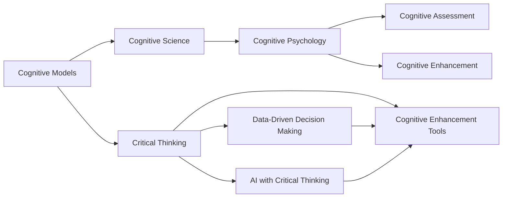

                 

# 批判性思维：提升洞察力的基石

> 关键词：批判性思维,认知模型,认知科学,认知心理学,认知评估,认知提升,人工智能,认知增强

## 1. 背景介绍

### 1.1 问题由来
在信息爆炸的时代，数据和知识的海量增长带来了前所未有的机会和挑战。人类认知能力有限，如何从中提取出有价值的信息，并加以有效利用，成为当今社会亟需解决的问题。

批判性思维(Critical Thinking)，作为提升洞察力、分析和解决问题能力的核心方法，在近年来受到了广泛关注。批判性思维不仅在学术研究和教育领域具有重要意义，在人工智能(AI)和认知科学领域也逐渐成为研究热点。

批判性思维的本质是理性、系统、深入地分析问题，并通过逻辑推理和证据验证得出结论。它是人类智慧的基石，也是人工智能算法设计的关键。通过批判性思维，我们不仅能有效应对信息过载，还能不断提高自身的认知水平和决策能力。

### 1.2 问题核心关键点
本文将从批判性思维的基本原理出发，深入探讨其在大数据、人工智能、认知科学等领域的实践应用。具体包括以下几个核心问题：
- 批判性思维的基本构成要素是什么？
- 批判性思维如何在大数据环境中提升决策能力？
- 人工智能算法中如何引入批判性思维？
- 如何利用认知科学的研究成果提升批判性思维？
- 批判性思维的前景和挑战是什么？

### 1.3 问题研究意义
批判性思维在提高个体决策能力、推动科学研究、促进社会进步等方面具有重要意义：

1. **提高决策能力**：批判性思维能帮助人们在复杂情境中做出合理判断，避免盲目跟从或偏见误导。
2. **推动科学研究**：批判性思维是科学研究的基石，能促进科学发现和技术创新。
3. **促进社会进步**：批判性思维对民主决策、公共政策制定等方面有重要作用。

## 2. 核心概念与联系

### 2.1 核心概念概述

批判性思维涉及多个核心概念，这些概念相互关联，共同构成了批判性思维的理论框架。

- **认知模型(Cognitive Models)**：人类认知过程中所运用的概念、规则和策略。
- **认知科学(Cognitive Science)**：研究人类认知过程的科学，包括感知、记忆、思维、语言等方面。
- **认知心理学(Cognitive Psychology)**：研究人类思维过程的心理学分支，探讨如何构建模型模拟人类认知。
- **认知评估(Cognitive Assessment)**：评估个体或群体认知能力的方法和工具。
- **认知提升(Cognitive Enhancement)**：通过技术手段提升个体认知能力，如认知训练、认知药物等。

这些核心概念之间具有密切联系，共同构成了批判性思维的理论体系。通过理解这些核心概念及其相互关系，我们能够更好地把握批判性思维的精髓，并应用于实际场景。

### 2.2 核心概念原理和架构的 Mermaid 流程图



这个流程图展示了批判性思维与其他相关概念之间的联系。认知模型是批判性思维的基础，通过认知心理学研究人类认知过程，使用认知评估工具评估认知能力，利用认知提升技术提升认知水平。最终，批判性思维在大数据、人工智能等领域得到应用，推动数据驱动决策和AI系统的智能化。

## 3. 核心算法原理 & 具体操作步骤

### 3.1 算法原理概述

批判性思维在数据驱动的决策和人工智能算法中具有重要应用。其核心思想是通过逻辑推理和证据验证，对数据和信息进行深入分析，得出有依据的结论。

批判性思维的算法原理包括以下几个关键步骤：

1. **数据获取**：通过传感器、互联网、数据库等手段获取数据。
2. **数据预处理**：清洗、标准化、降维等处理，以准备进一步分析。
3. **数据建模**：使用机器学习、统计学等方法，构建模型模拟数据分布。
4. **模型验证**：使用交叉验证、A/B测试等手段，评估模型性能。
5. **结论形成**：结合模型输出和领域知识，形成有根据的结论。

### 3.2 算法步骤详解

以下详细介绍批判性思维在数据驱动决策和AI算法中的具体操作步骤。

**Step 1: 数据获取**
- 通过传感器、互联网、数据库等手段获取数据。数据来源包括但不限于传感器数据、文本数据、图像数据、社交媒体数据等。

**Step 2: 数据预处理**
- 清洗数据，去除噪声和异常值。
- 标准化数据，使数据在不同维度上具有可比性。
- 降维处理，减少数据维度，提高计算效率。

**Step 3: 数据建模**
- 使用机器学习算法，如回归、分类、聚类等，构建数据模型。
- 使用深度学习算法，如神经网络、卷积神经网络等，进行复杂数据建模。
- 引入先验知识，优化模型构建。

**Step 4: 模型验证**
- 使用交叉验证、A/B测试等手段，评估模型性能。
- 进行模型调参，优化模型结构。

**Step 5: 结论形成**
- 结合模型输出和领域知识，形成有根据的结论。
- 对结论进行反复验证和推敲，确保结论的合理性。

### 3.3 算法优缺点

批判性思维在数据驱动决策和AI算法中的应用具有以下优点：

1. **提高决策准确性**：通过逻辑推理和证据验证，能更准确地分析数据，形成有依据的结论。
2. **减少偏差和误导**：批判性思维强调逻辑和证据，能有效避免偏差和误导。
3. **提升模型泛化能力**：批判性思维结合领域知识，能提高模型的泛化能力，更好地适应复杂情境。

同时，批判性思维在应用中也有以下局限：

1. **计算复杂度高**：批判性思维需要大量计算资源和数据，计算复杂度较高。
2. **模型解释性差**：AI模型通常缺乏解释性，难以解释其决策过程。
3. **依赖领域知识**：批判性思维依赖领域知识，对非专业领域的用户不友好。

### 3.4 算法应用领域

批判性思维在多个领域中得到了广泛应用，包括但不限于以下领域：

1. **金融风险管理**：使用数据分析模型，评估金融市场风险。
2. **医疗诊断**：结合症状数据和医学知识，进行疾病诊断和治疗方案选择。
3. **智能客服**：使用自然语言处理技术，结合用户行为数据，提供智能客服服务。
4. **舆情分析**：使用数据分析模型，监测和分析社交媒体舆情。
5. **智能推荐系统**：结合用户历史行为数据和模型预测，提供个性化推荐。

## 4. 数学模型和公式 & 详细讲解 & 举例说明

### 4.1 数学模型构建

批判性思维在数据驱动决策中，通常使用以下数学模型：

1. **线性回归模型**：用于分析因变量与自变量之间的关系。
2. **决策树模型**：用于分类和预测，能处理非线性关系。
3. **神经网络模型**：用于复杂数据建模，能学习复杂关系。
4. **随机森林模型**：用于处理大规模数据，提升模型泛化能力。

### 4.2 公式推导过程

以线性回归模型为例，推导其基本公式：

设 $y$ 为因变量，$x_1,x_2,...,x_n$ 为自变量，$b_0$ 为截距，$b_1,b_2,...,b_n$ 为系数。线性回归模型可表示为：

$$
y = b_0 + b_1x_1 + b_2x_2 + ... + b_nx_n + \epsilon
$$

其中 $\epsilon$ 为误差项，表示随机因素对因变量的影响。

线性回归模型的最小二乘估计公式为：

$$
\hat{b} = (X^TX)^{-1}X^Ty
$$

其中 $X$ 为自变量矩阵，$\hat{b}$ 为估计系数。

### 4.3 案例分析与讲解

假设某金融机构想要评估一个客户的信用风险，可以通过分析其历史交易数据，构建线性回归模型。具体步骤如下：

1. **数据收集**：收集客户的交易数据，包括交易金额、交易频率、交易类型等。
2. **数据预处理**：清洗数据，去除异常值和噪声。
3. **模型构建**：使用线性回归模型，构建信用风险预测模型。
4. **模型验证**：使用交叉验证评估模型性能。
5. **结论形成**：根据模型输出，结合领域知识，评估客户的信用风险。

## 5. 项目实践：代码实例和详细解释说明

### 5.1 开发环境搭建

为了进行批判性思维的实践，我们需要准备好开发环境。以下是使用Python进行数据分析和机器学习的开发环境配置流程：

1. 安装Anaconda：从官网下载并安装Anaconda，用于创建独立的Python环境。
```bash
conda create -n myenv python=3.8
conda activate myenv
```

2. 安装PyTorch、TensorFlow、Pandas等库：
```bash
conda install torch torchvision torchaudio pandas matplotlib scikit-learn
```

3. 安装Jupyter Notebook：
```bash
conda install jupyterlab
```

完成上述步骤后，即可在`myenv`环境中开始数据分析和机器学习实践。

### 5.2 源代码详细实现

以下是一个使用Python进行线性回归模型实现的示例代码。

```python
import numpy as np
from sklearn.linear_model import LinearRegression
from sklearn.metrics import mean_squared_error

# 构造数据
X = np.array([[1, 2, 3], [4, 5, 6], [7, 8, 9]])
y = np.array([2, 4, 6])

# 构建模型
model = LinearRegression()

# 训练模型
model.fit(X, y)

# 预测数据
X_test = np.array([[10, 11, 12], [13, 14, 15]])
y_pred = model.predict(X_test)

# 评估模型
mse = mean_squared_error(y, y_pred)
print("Mean Squared Error:", mse)
```

这段代码首先构造了线性回归模型所需的数据，然后使用`LinearRegression`类构建模型，并进行训练和预测。最后使用均方误差评估模型性能。

### 5.3 代码解读与分析

让我们再详细解读一下关键代码的实现细节：

1. `numpy`库：用于数组和矩阵运算。
2. `sklearn`库：用于机器学习算法的实现。
3. `LinearRegression`类：用于线性回归模型的实现。
4. `mean_squared_error`函数：用于评估模型性能。

**数据构造**：使用`np.array`创建样本数据，包括自变量`X`和因变量`y`。

**模型构建**：使用`LinearRegression`类创建线性回归模型，并调用`fit`方法训练模型。

**模型预测**：使用`predict`方法对测试数据进行预测。

**模型评估**：使用均方误差`mean_squared_error`评估模型性能。

## 6. 实际应用场景

### 6.1 金融风险管理

在金融风险管理中，批判性思维通过数据分析模型，评估客户的信用风险、市场波动风险等。结合领域知识和模型预测，金融机构可以制定更合理的风险控制策略。

**具体流程**：
1. 收集客户历史交易数据和信用记录。
2. 清洗和标准化数据。
3. 构建线性回归模型，预测客户信用风险。
4. 结合领域知识，评估模型输出。
5. 根据模型输出，调整风险控制策略。

### 6.2 医疗诊断

在医疗诊断中，批判性思维通过结合症状数据和医学知识，进行疾病诊断和治疗方案选择。

**具体流程**：
1. 收集患者的症状数据和病史记录。
2. 清洗和标准化数据。
3. 构建随机森林模型，预测疾病类型。
4. 结合医学知识，评估模型输出。
5. 根据模型输出，制定治疗方案。

### 6.3 智能推荐系统

在智能推荐系统中，批判性思维结合用户历史行为数据和模型预测，提供个性化推荐。

**具体流程**：
1. 收集用户历史行为数据和物品特征数据。
2. 清洗和标准化数据。
3. 构建神经网络模型，预测用户对物品的兴趣。
4. 结合领域知识，评估模型输出。
5. 根据模型输出，生成推荐列表。

### 6.4 未来应用展望

批判性思维在未来的应用前景广阔，随着技术的发展，将会在更多领域得到应用，如智能交通、智能制造、智能医疗等。

## 7. 工具和资源推荐

### 7.1 学习资源推荐

为了帮助开发者系统掌握批判性思维的理论基础和实践技巧，这里推荐一些优质的学习资源：

1. **《批判性思维与逻辑推理》**：一本经典的批判性思维入门书籍，系统介绍了批判性思维的基本概念和方法。
2. **Coursera《批判性思维与决策》课程**：斯坦福大学开设的在线课程，涵盖批判性思维的基本原理和应用方法。
3. **《认知心理学》**：一本经典的认知心理学入门书籍，介绍了人类认知过程的基本原理和研究方法。
4. **Kaggle数据科学竞赛**：通过参加数据科学竞赛，实践批判性思维和数据分析技能。
5. **IEEE Transactions on Cognitive Systems**：专注于认知系统的顶级期刊，提供最新的认知科学与技术研究成果。

通过对这些资源的学习实践，相信你一定能够快速掌握批判性思维的精髓，并用于解决实际的认知问题。

### 7.2 开发工具推荐

高效的开发离不开优秀的工具支持。以下是几款用于批判性思维实践的常用工具：

1. **Jupyter Notebook**：一个免费的开源工具，支持Python和多种其他编程语言，方便进行数据处理和模型构建。
2. **PyTorch**：基于Python的开源深度学习框架，灵活的计算图，适合快速迭代研究。
3. **TensorFlow**：由Google主导开发的开源深度学习框架，生产部署方便，适合大规模工程应用。
4. **Weights & Biases**：模型训练的实验跟踪工具，可以记录和可视化模型训练过程中的各项指标，方便对比和调优。
5. **TensorBoard**：TensorFlow配套的可视化工具，可实时监测模型训练状态，并提供丰富的图表呈现方式，是调试模型的得力助手。

合理利用这些工具，可以显著提升批判性思维的开发效率，加快创新迭代的步伐。

### 7.3 相关论文推荐

批判性思维在近年来受到了广泛的关注，以下是几篇奠基性的相关论文，推荐阅读：

1. **《批判性思维的神经基础》**：探讨批判性思维的神经机制，揭示其在大脑中的具体位置和功能。
2. **《基于认知科学的批判性思维教育》**：研究如何通过认知科学理论，改进批判性思维的教育方法。
3. **《人工智能与批判性思维的结合》**：探讨AI技术如何辅助批判性思维的培养和应用。
4. **《数据驱动决策的批判性思维模型》**：研究如何构建数据驱动决策模型，结合批判性思维进行决策。
5. **《批判性思维在医疗诊断中的应用》**：研究如何结合医学知识和模型预测，进行疾病诊断和治疗方案选择。

这些论文代表了大语言模型微调技术的发展脉络。通过学习这些前沿成果，可以帮助研究者把握学科前进方向，激发更多的创新灵感。

## 8. 总结：未来发展趋势与挑战

### 8.1 研究成果总结

本文对批判性思维的基本原理和实践应用进行了全面系统的介绍。首先阐述了批判性思维的基本构成要素，明确了其在大数据、人工智能、认知科学等领域的应用价值。其次，从原理到实践，详细讲解了批判性思维的数学模型和具体操作步骤，给出了具体的代码实现。同时，本文还广泛探讨了批判性思维在金融风险管理、医疗诊断、智能推荐系统等领域的实际应用，展示了其在提升决策能力和促进技术进步方面的巨大潜力。此外，本文精选了批判性思维的相关学习资源，力求为读者提供全方位的技术指引。

通过本文的系统梳理，可以看到，批判性思维在提高个体决策能力、推动科学研究、促进社会进步等方面具有重要意义。未来，伴随认知科学和人工智能技术的不断进步，批判性思维必将在更多的领域得到应用，为人类认知智能的进化带来深远影响。

### 8.2 未来发展趋势

展望未来，批判性思维技术将呈现以下几个发展趋势：

1. **深度学习与批判性思维的结合**：结合深度学习算法，提升批判性思维的自动化水平，降低人工干预的复杂度。
2. **多模态批判性思维**：结合视觉、听觉、触觉等多模态数据，提升批判性思维的全面性和准确性。
3. **分布式批判性思维**：结合分布式计算技术，提升批判性思维的计算效率和处理能力。
4. **认知增强技术与批判性思维的结合**：结合认知增强技术，如认知药物、认知训练等，提升批判性思维的性能。
5. **伦理和法律的约束**：结合伦理和法律规则，构建更安全的批判性思维系统，避免误导和滥用。

这些趋势凸显了批判性思维技术的广阔前景。这些方向的探索发展，必将进一步提升批判性思维的智能化水平，为人类认知智能的进化带来深远影响。

### 8.3 面临的挑战

尽管批判性思维技术已经取得了瞩目成就，但在迈向更加智能化、普适化应用的过程中，它仍面临着诸多挑战：

1. **计算资源瓶颈**：深度学习模型的计算复杂度高，对计算资源有较高要求。如何提升计算效率，降低计算成本，是一个重要问题。
2. **模型解释性不足**：深度学习模型通常缺乏解释性，难以解释其决策过程。如何提升模型的可解释性，增强用户的信任感，是一个重要问题。
3. **数据获取困难**：高质量的数据获取成本高、难度大，如何高效获取并利用数据，是一个重要问题。
4. **算法偏见问题**：深度学习模型容易学习到数据中的偏见，导致歧视性决策。如何减少算法偏见，保障公平性，是一个重要问题。
5. **伦理和法律问题**：深度学习模型的决策过程涉及隐私、公平性等伦理问题，如何构建安全的批判性思维系统，是一个重要问题。

### 8.4 研究展望

面对批判性思维面临的种种挑战，未来的研究需要在以下几个方面寻求新的突破：

1. **提升计算效率**：开发更高效的计算算法，提升批判性思维的计算效率和处理能力。
2. **增强模型可解释性**：结合可解释性算法，提升模型的可解释性，增强用户的信任感。
3. **优化数据获取**：开发高效的数据获取和预处理算法，提升数据的可用性和多样性。
4. **减少算法偏见**：结合公平性算法，减少深度学习模型的偏见，保障决策的公平性。
5. **构建安全系统**：结合伦理和法律规则，构建更安全的批判性思维系统，保障用户隐私和公平性。

这些研究方向的发展，必将推动批判性思维技术迈向更高的台阶，为构建安全、可靠、可解释、可控的智能系统铺平道路。面向未来，批判性思维技术还需要与其他人工智能技术进行更深入的融合，如知识表示、因果推理、强化学习等，多路径协同发力，共同推动自然语言理解和智能交互系统的进步。只有勇于创新、敢于突破，才能不断拓展语言模型的边界，让智能技术更好地造福人类社会。

## 9. 附录：常见问题与解答

**Q1：批判性思维是否只适用于学术研究？**

A: 批判性思维不仅适用于学术研究，在工业界、社会各个领域都有广泛应用。例如，企业决策、政策制定、法律诉讼等都需要批判性思维的支持。

**Q2：批判性思维是否只适用于高学历人群？**

A: 批判性思维并不是高学历人群的专利，任何人都可以通过学习和训练来提升批判性思维能力。例如，日常生活中的推理、判断、决策都可以应用批判性思维。

**Q3：批判性思维的训练方法有哪些？**

A: 批判性思维的训练方法包括但不限于：
1. 逻辑推理训练：通过逻辑题、论证题等训练逻辑推理能力。
2. 证据分析训练：通过案例分析、证据评估等训练证据分析能力。
3. 假设检验训练：通过假设检验、统计分析等训练假设检验能力。
4. 批判性阅读训练：通过阅读批判性文献、文章等训练批判性阅读能力。

**Q4：批判性思维在人工智能中的应用有哪些？**

A: 批判性思维在人工智能中的应用包括但不限于：
1. 数据分析：使用数据分析模型，评估数据的质量和可靠性。
2. 决策支持：结合领域知识和模型预测，辅助决策。
3. 模型优化：通过批判性思维，优化模型结构和参数。
4. 算法评估：通过批判性思维，评估算法的性能和适用性。

**Q5：批判性思维在实际应用中的效果如何？**

A: 批判性思维在实际应用中取得了显著效果。例如，在金融风险管理、医疗诊断、智能推荐系统等领域，批判性思维通过数据分析和模型预测，显著提高了决策的准确性和可靠性。

---

作者：禅与计算机程序设计艺术 / Zen and the Art of Computer Programming

