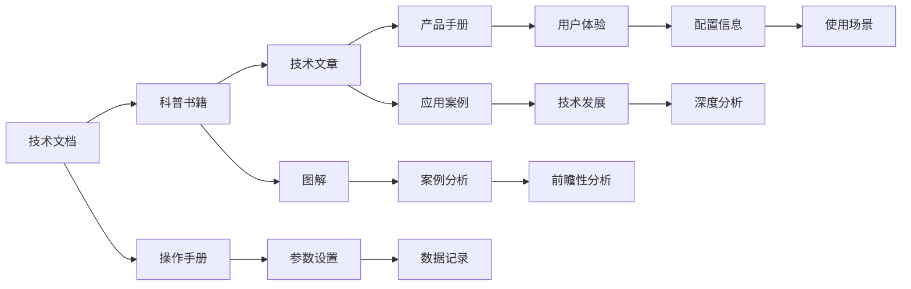

                 

# 技术写作：从技术文档到畅销科技著作

> 关键词：技术写作, 技术文档, 畅销科技著作, 科技普及, 写作技巧, 翻译

## 1. 背景介绍

### 1.1 问题由来

随着信息技术的飞速发展，科技的普及和传播变得越来越重要。在现代科技的推广和普及中，技术写作扮演着至关重要的角色。技术文档、科普书籍、网络文章等都是科技普及的重要媒介。从抽象、复杂的技术概念到易于理解的内容，技术写作能够将高深的知识以通俗易懂的语言表达出来，使更多人能够理解和掌握这些技术。

然而，技术写作并非易事，它不仅需要深入的技术理解，还需要卓越的写作技巧和艺术表现力。因此，如何从技术文档到畅销科技著作，成为技术写作工作者必须面对的挑战。本文将详细介绍技术写作的核心概念和实践技巧，帮助技术写作从业者提升写作水平，推动更多优质科技内容进入大众视野。

## 2. 核心概念与联系

### 2.1 核心概念概述

技术写作不仅包括技术文档的撰写，还包括科普书籍、技术文章、产品手册等多种形式的写作。这些写作形式虽然形式和用途不同，但它们都有一些共同的特征和要求。

- **技术文档**：以技术内容为核心，详细记录技术流程、参数设置、使用场景等具体信息。包括操作手册、用户指南、技术报告等。
- **科普书籍**：面向公众，以通俗易懂的方式介绍复杂的技术概念和应用。通常包含丰富的示例、图解和案例分析。
- **技术文章**：面向专业领域，对最新的技术发展、应用案例、研究成果等进行深入分析。通常要求严谨的逻辑性和前瞻性。
- **产品手册**：介绍产品功能、使用方法、配置信息等，侧重于用户体验和技术细节。

这些形式虽然不同，但都要求内容准确、结构严谨、语言生动。通过技术写作，可以将复杂的技术知识转化为易于理解的内容，推广和普及科技知识。

### 2.2 核心概念原理和架构的 Mermaid 流程图



### 2.3 核心概念间的联系

从技术文档到畅销科技著作，技术写作工作者的主要任务是将技术知识转化为易于理解和传播的内容。不同形式的技术写作虽然侧重点不同，但它们之间有很强的联系和交互。例如：

- 技术文档中的详细描述可以成为科普书籍的内容源泉。
- 科普书籍的通俗讲解可以转化为技术文章中的深度分析。
- 技术文章的前沿研究可以作为产品手册中的参考和指导。

这种相互转化和补充的写作过程，是技术写作工作者不断提升和完善自己写作能力的重要途径。

## 3. 核心算法原理 & 具体操作步骤

### 3.1 算法原理概述

技术写作的核心算法原理主要包括内容组织、结构设计、语言表达等方面。其目的是将技术知识转化为易于理解、生动有趣的内容，从而实现技术普及和传播。

### 3.2 算法步骤详解

技术写作的算法步骤通常包括以下几个关键环节：

**Step 1: 内容梳理与选材**

- 确定写作主题和受众群体。根据受众背景和需求，选择合适的写作方向和深度。
- 搜集相关资料和数据。包括技术文献、案例分析、专家访谈等。
- 梳理内容框架。将复杂的技术内容分解为易于理解的小模块，按照逻辑顺序进行排列。

**Step 2: 结构设计**

- 明确文档结构。包括引言、正文、结论等部分，每一部分的内容和形式都应该根据受众需求进行设计。
- 使用标题和小标题。通过层次分明、简明的标题，引导读者逐步深入。
- 合理使用图表和图解。通过直观的图表和图解，帮助读者理解和记忆技术内容。

**Step 3: 语言表达**

- 使用通俗易懂的语言。避免使用过于专业的术语，用简洁明了的语言表达技术概念。
- 使用比喻和类比。将复杂的技术问题转化为类比问题，使读者更容易理解和接受。
- 讲故事和案例分析。通过具体案例和故事，生动地展示技术的应用和效果。

**Step 4: 编辑与校对**

- 多次审稿和修改。在初稿完成后，多次审稿和修改，确保内容的准确性和可读性。
- 邀请专家评审。邀请相关领域的专家对文档进行评审，提出改进意见。
- 进行技术性校对。确保文档中的技术细节和数据无误，避免误导读者。

### 3.3 算法优缺点

技术写作的算法具有以下优点：

- **易于理解**：通过通俗易懂的语言和生动的案例，使复杂的技术内容易于理解。
- **生动有趣**：通过讲故事和类比，使技术内容更具吸引力和趣味性。
- **推广性强**：通过多形式的技术写作，可以实现广泛的科技普及和传播。

同时，技术写作也存在一些缺点：

- **内容准确性要求高**：技术写作必须确保内容的准确性和权威性，否则容易误导读者。
- **写作难度大**：要求技术写作者不仅要精通技术，还要具备卓越的写作技巧和表达能力。
- **时间成本高**：内容梳理、结构设计、编辑校对等环节需要大量的时间和精力。

尽管存在这些缺点，但技术写作仍然是推广科技知识的重要手段。通过不断提升写作能力和技巧，技术写作工作者可以更好地发挥其作用。

### 3.4 算法应用领域

技术写作的应用领域非常广泛，几乎涵盖了所有科技领域。以下是几个典型的应用场景：

- **软件开发**：软件开发文档、用户手册、技术报告等。
- **硬件设计**：产品说明书、用户手册、技术手册等。
- **网络安全**：安全指南、漏洞分析报告、应急响应手册等。
- **人工智能**：算法描述、应用案例、研究论文等。
- **生物医学**：操作指南、实验报告、研究综述等。

这些应用场景中，技术写作都扮演着重要的角色，将复杂的科技知识转化为易于理解和应用的内容。

## 4. 数学模型和公式 & 详细讲解 & 举例说明

### 4.1 数学模型构建

在技术写作中，数学模型和公式的使用也是非常重要的。它们可以帮助解释复杂的技术概念，提供精确的计算和推理。以下是一个简单的数学模型和公式的例子：

设有一个二分类问题，其中数据集为 $D=\{(x_i,y_i)\}_{i=1}^N$，其中 $x_i \in \mathbb{R}^d$ 表示样本，$y_i \in \{0,1\}$ 表示标签。假设使用逻辑回归模型 $f(x;\theta) = \frac{1}{1+e^{-\theta^Tx}}$ 进行分类，其中 $\theta \in \mathbb{R}^d$ 表示模型参数。

### 4.2 公式推导过程

根据逻辑回归模型的定义，其预测结果为 $y=f(x;\theta)=\frac{1}{1+e^{-\theta^Tx}}$。为了最大化模型在数据集上的性能，需要进行交叉熵损失函数的最小化：

$$
L(D;\theta)=\frac{1}{N}\sum_{i=1}^N \left[ -y_i\log f(x_i;\theta) - (1-y_i)\log(1-f(x_i;\theta)) \right]
$$

对 $L(D;\theta)$ 求导，可以得到：

$$
\frac{\partial L(D;\theta)}{\partial \theta} = \frac{1}{N}\sum_{i=1}^N \left[ -y_i\frac{e^{-\theta^Tx_i}}{1+e^{-\theta^Tx_i}} - (1-y_i)\frac{e^{\theta^Tx_i}}{1+e^{-\theta^Tx_i}} \right] x_i
$$

通过求解上述梯度方程，可以更新模型参数 $\theta$，从而最小化损失函数 $L(D;\theta)$，得到最优模型。

### 4.3 案例分析与讲解

以逻辑回归模型为例，我们可以对实际应用中的数据集进行训练和测试，验证其性能。以下是一个简单的Python代码示例：

```python
from sklearn.linear_model import LogisticRegression
from sklearn.datasets import make_classification
from sklearn.model_selection import train_test_split

# 创建二分类数据集
X, y = make_classification(n_samples=1000, n_features=5, n_informative=2, random_state=42)

# 数据集划分
X_train, X_test, y_train, y_test = train_test_split(X, y, test_size=0.2, random_state=42)

# 训练逻辑回归模型
model = LogisticRegression()
model.fit(X_train, y_train)

# 测试模型性能
print(model.score(X_test, y_test))
```

通过上述代码，我们可以使用逻辑回归模型对数据集进行训练和测试，验证其性能。

## 5. 项目实践：代码实例和详细解释说明

### 5.1 开发环境搭建

要进行技术写作，首先需要搭建一个开发环境。以下是一个Python开发环境搭建的示例：

```bash
conda create -n tech-writing python=3.8
conda activate tech-writing
pip install numpy pandas matplotlib scikit-learn jupyter notebook
```

### 5.2 源代码详细实现

下面是一个简单的Python代码示例，用于生成逻辑回归模型的训练和测试结果：

```python
from sklearn.linear_model import LogisticRegression
from sklearn.datasets import make_classification
from sklearn.model_selection import train_test_split
import numpy as np
import matplotlib.pyplot as plt

# 创建二分类数据集
X, y = make_classification(n_samples=1000, n_features=5, n_informative=2, random_state=42)

# 数据集划分
X_train, X_test, y_train, y_test = train_test_split(X, y, test_size=0.2, random_state=42)

# 训练逻辑回归模型
model = LogisticRegression()
model.fit(X_train, y_train)

# 绘制ROC曲线
y_pred = model.predict_proba(X_test)[:, 1]
fpr, tpr, thresholds = roc_curve(y_test, y_pred)
roc_auc = auc(fpr, tpr)

plt.figure()
plt.plot(fpr, tpr, color='darkorange', lw=2, label='ROC curve (area = %0.2f)' % roc_auc)
plt.plot([0, 1], [0, 1], color='navy', lw=2, linestyle='--')
plt.xlim([0.0, 1.0])
plt.ylim([0.0, 1.05])
plt.xlabel('False Positive Rate')
plt.ylabel('True Positive Rate')
plt.title('Receiver operating characteristic')
plt.legend(loc='lower right')
plt.show()
```

### 5.3 代码解读与分析

这段代码展示了如何使用sklearn库中的逻辑回归模型进行数据训练和测试，并绘制ROC曲线。通过这段代码，我们可以验证逻辑回归模型的性能，并进行可视化展示。

## 6. 实际应用场景

### 6.1 软件开发

在软件开发中，技术写作尤为重要。软件开发文档、用户手册、技术报告等都是软件开发过程中不可或缺的部分。例如，一个项目的设计文档、实现文档、测试文档等，都是技术写作的重要内容。通过这些文档，开发者可以清晰地表达设计思路、技术细节和测试方案，帮助其他开发者更好地理解和应用这些技术。

### 6.2 网络安全

网络安全是一个高度专业的领域，涉及到许多复杂的技术概念和实现细节。技术写作可以帮助网络安全从业者将这些复杂的技术概念转化为易于理解的内容，普及网络安全知识。例如，编写网络安全操作指南、漏洞分析报告、应急响应手册等，都是技术写作的重要应用。

### 6.3 人工智能

人工智能是一个快速发展的领域，技术写作可以帮助人工智能从业者将最新的研究成果、应用案例、技术进展等内容传递给公众。例如，编写人工智能算法描述、应用案例、研究论文等，都是技术写作的重要内容。通过这些内容，公众可以了解人工智能技术的最新动态，并对其应用场景和效果有更深入的理解。

### 6.4 未来应用展望

未来的技术写作将面临更多的挑战和机遇。随着技术的不断进步，新的技术概念和应用场景层出不穷，技术写作工作者需要不断提升自身的技术水平和写作能力，才能适应这些变化。

- **多形式内容**：未来的技术写作将更加多样化和多媒体化，包括视频、动画、互动内容等。
- **跨领域应用**：未来的技术写作将涵盖更多领域，包括生物医学、环境保护、教育科技等。
- **全球化传播**：未来的技术写作将更多地面向全球读者，需要关注不同文化背景和技术水平的需求。

这些变化将使技术写作工作者面临更大的挑战，但同时也提供了更多的机遇。

## 7. 工具和资源推荐

### 7.1 学习资源推荐

技术写作是一个不断学习和提升的过程。以下是几个优秀的学习资源，推荐大家利用：

- **Coursera上的“技术写作与编辑”课程**：由Purdue大学提供，涵盖技术写作的基础知识和高级技巧。
- **Udemy上的“技术写作和编辑技巧”课程**：由著名作家和编辑提供，包含实用技巧和案例分析。
- **《技术写作手册》（Technical Writing Manual）**：这是一本非常经典的技术写作指南，涵盖了许多技术写作的方方面面。

### 7.2 开发工具推荐

技术写作需要借助一些工具进行辅助。以下是几个常用的工具，推荐大家使用：

- **GitHub**：使用GitHub进行代码管理，可以方便地进行版本控制和协作。
- **LaTeX**：使用LaTeX进行文档排版，可以生成高质量的PDF文档。
- **Jupyter Notebook**：使用Jupyter Notebook进行交互式编程，可以方便地展示代码和结果。

### 7.3 相关论文推荐

技术写作的研究涉及多个学科领域，以下是几篇相关的经典论文，推荐大家阅读：

- **《技术写作理论与实践》**：这本著作系统地介绍了技术写作的理论和实践，对技术写作工作者具有重要参考价值。
- **《技术写作规范与指南》**：这是一本实用的技术写作规范指南，涵盖了许多技术写作的细节和注意事项。
- **《技术写作中的信息架构设计》**：这篇论文探讨了技术写作中信息架构的设计和应用，对技术写作工作者具有重要参考价值。

## 8. 总结：未来发展趋势与挑战

### 8.1 总结

技术写作是推广科技知识的重要手段。从技术文档到畅销科技著作，技术写作工作者需要不断提升自身的技术水平和写作能力，才能适应不断变化的技术需求和受众需求。通过系统学习、实践和反思，技术写作工作者可以不断提高自己的写作水平，推动科技知识的普及和传播。

### 8.2 未来发展趋势

未来的技术写作将面临更多的挑战和机遇，以下是几个可能的发展趋势：

- **多形式内容**：未来的技术写作将更加多样化和多媒体化，包括视频、动画、互动内容等。
- **跨领域应用**：未来的技术写作将涵盖更多领域，包括生物医学、环境保护、教育科技等。
- **全球化传播**：未来的技术写作将更多地面向全球读者，需要关注不同文化背景和技术水平的需求。
- **技术创新**：未来的技术写作将更多地关注技术创新，帮助公众理解和应用最新的技术成果。

### 8.3 面临的挑战

技术写作面临的挑战主要包括：

- **技术深度要求高**：技术写作必须确保内容的准确性和权威性，否则容易误导读者。
- **写作难度大**：要求技术写作者不仅要精通技术，还要具备卓越的写作技巧和表达能力。
- **时间成本高**：内容梳理、结构设计、编辑校对等环节需要大量的时间和精力。

### 8.4 研究展望

未来的技术写作研究可以从以下几个方向进行探索：

- **自动化工具**：开发更多的自动化工具，帮助技术写作工作者提高效率，如自动化校对、自动化生成文档等。
- **智能推荐**：基于用户需求和行为数据，推荐适合的技术文档和阅读材料。
- **多语言支持**：开发多语言支持的技术写作工具，帮助技术写作工作者面向全球读者进行写作。

通过不断创新和优化，技术写作工作者可以更好地发挥其作用，推动更多优质的科技内容进入公众视野。

## 9. 附录：常见问题与解答

**Q1：如何提高技术写作的效率？**

A: 提高技术写作效率的方法主要有：
- **模板化**：使用模板进行文档编写，可以提高写作效率，减少重复工作。
- **工具支持**：使用GitHub、LaTeX、Jupyter Notebook等工具，可以大幅提高写作效率。
- **批量处理**：对于类似的文档，可以批量处理，减少重复工作。

**Q2：如何提升技术写作的质量？**

A: 提升技术写作质量的方法主要有：
- **仔细审稿**：多次审稿和修改，确保内容的准确性和可读性。
- **专家评审**：邀请相关领域的专家对文档进行评审，提出改进意见。
- **技术性校对**：确保文档中的技术细节和数据无误，避免误导读者。

**Q3：技术写作和科普写作的区别在哪里？**

A: 技术写作和科普写作的区别在于：
- **受众不同**：技术写作面向专业人士，科普写作面向公众。
- **深度不同**：技术写作要求深入详细，科普写作要求通俗易懂。
- **形式不同**：技术写作要求逻辑清晰，科普写作要求生动有趣。

通过不断学习和实践，技术写作工作者可以不断提高自己的写作水平，推动科技知识的普及和传播。

