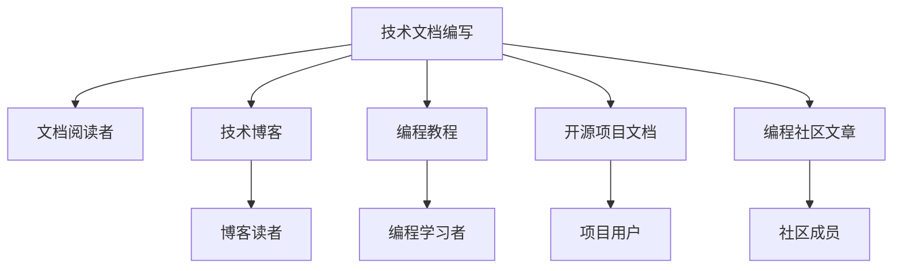

                 

# 技术写作：额外收入的来源

> 关键词：技术写作, 自由职业, 自媒体, 博客, 编程, 教程, 开源项目, 编程社区

## 1. 背景介绍

在现代信息技术快速发展的背景下，技术写作已经成为了一种重要的职业和获取额外收入的途径。无论是技术专家、软件开发者、IT公司员工，还是大学生、研究生等，通过技术写作不仅能够提升自身的专业能力，还能在知识变现的道路上更进一步。随着互联网的普及和社交媒体的兴起，技术写作的需求也日益增长，几乎每个人都可以通过写作获取到属于自己的那一份收入。

### 1.1 问题由来

技术写作主要包括软件文档编写、技术博客、编程教程、开源项目文档、编程社区文章等内容。这些写作内容不仅能帮助其他技术从业者更好地理解和学习技术知识，还能通过平台的流量广告、付费阅读、赞助等方式为作者带来额外的收入。然而，技术写作并不容易，需要具备良好的技术理解能力、清晰的表达能力和强烈的责任心，才能创作出有价值的写作内容。

### 1.2 问题核心关键点

技术写作的核心关键点在于将复杂的技术知识以简洁明了的语言表达出来，让读者能够理解和掌握。写作的内容需要具备以下特点：
- 准确性：确保信息的正确无误。
- 清晰度：语言表达简洁明了，避免过于专业化的术语。
- 实用性：提供具体的操作方法，帮助读者解决实际问题。
- 逻辑性：内容结构清晰，逻辑严密。

## 2. 核心概念与联系

### 2.1 核心概念概述

技术写作包括文档编写、技术博客、编程教程、开源项目文档、编程社区文章等多个方面。这些写作内容之间的联系在于，它们都是通过技术知识和专业技能的传递来帮助他人理解和学习技术，最终实现知识变现。

- **技术文档编写**：通常包括用户手册、API文档、设计文档等，目的是提供给开发者、运维人员、客户等，帮助他们更好地理解和使用软件。
- **技术博客**：是在线技术知识分享的平台，内容涵盖软件技术、编程语言、框架、架构、算法等多个方面。
- **编程教程**：以视频、文本、代码等形式，详细讲解编程语言、框架的使用方法，提供实战案例和练习题。
- **开源项目文档**：记录开源项目的代码实现、架构设计、开发流程等内容，帮助开发者理解和使用项目。
- **编程社区文章**：在各种编程社区发布文章，分享技术经验、交流学习心得、解决问题等。

### 2.2 核心概念原理和架构的 Mermaid 流程图



这个流程图展示了技术写作和其受众之间的联系。

## 3. 核心算法原理 & 具体操作步骤

### 3.1 算法原理概述

技术写作的算法原理主要是通过数据驱动的方式，收集和分析读者反馈，不断优化写作内容。以用户行为和评论为输入，通过自然语言处理（NLP）技术分析情感倾向、关注点和痛点，从而调整写作策略和内容方向。

### 3.2 算法步骤详解

1. **内容规划**：确定写作主题和目标读者，收集相关资料和信息。
2. **写作创作**：编写文本内容，使用清晰的结构和语言表达技术知识点。
3. **用户反馈收集**：通过博客、社区、教程评论等方式收集读者反馈。
4. **数据分析**：使用NLP技术分析用户评论，了解读者的兴趣和需求。
5. **内容优化**：根据分析结果调整内容，提升用户体验。
6. **再次发布**：优化后的内容重新发布，提升流量和收入。

### 3.3 算法优缺点

**优点**：
- 能更准确地了解读者需求，提升写作的针对性和实用性。
- 通过分析数据优化内容，提高用户满意度和留存率。
- 结合用户反馈和数据分析，提升写作技巧和水平。

**缺点**：
- 数据收集和处理成本较高，需要一定的技术支撑。
- 数据分析过程复杂，需要具备一定的技术能力。
- 用户反馈可能存在偏见，影响内容调整方向。

### 3.4 算法应用领域

技术写作的算法可以应用于各种技术写作场景，如博客文章、编程教程、技术文档等。具体应用包括：

- 根据用户反馈优化博客文章标题和内容。
- 针对不同编程语言和框架的教程，分析用户学习效果和需求，调整教学方法和案例。
- 在技术文档中加入FAQ、常见问题解答，提高用户的使用体验。
- 分析开源项目文档的下载和使用数据，优化项目设计和文档结构。

## 4. 数学模型和公式 & 详细讲解 & 举例说明

### 4.1 数学模型构建

假设有一篇技术博客文章，用 $N$ 表示文章的长度，$U$ 表示文章的平均阅读时间，$C$ 表示文章的平均评论数量，$L$ 表示文章的平均阅读深度（即每条评论平均回复数量）。通过用户行为数据，建立以下数学模型：

$$
U = f(N, C, L)
$$

其中，$f$ 是一个函数，表示文章的长度、评论数量和阅读深度对平均阅读时间的影响。

### 4.2 公式推导过程

根据上述模型，可以推导出一些关键的推论：
- 文章长度与平均阅读时间成正比。
- 评论数量与平均阅读时间成正比。
- 阅读深度与平均阅读时间成正比。

因此，可以通过增加文章的长度、评论数量和阅读深度来提升平均阅读时间，从而提高文章的流量和收入。

### 4.3 案例分析与讲解

以开源项目文档为例，假设一个开源项目 A 和 B，它们的文档长度、评论数量和阅读深度如下：

| 项目 | 文档长度 | 评论数量 | 阅读深度 |
| ---- | ---- | ---- | ---- |
| A   | 2000 | 50   | 2.5  |
| B   | 5000 | 100  | 3.5  |

根据上述公式，计算出平均阅读时间：

$$
U_A = f(2000, 50, 2.5) = 30
$$

$$
U_B = f(5000, 100, 3.5) = 60
$$

由于 $U_B > U_A$，因此项目 B 的文档更能吸引用户阅读和评论，其收入潜力也更大。

## 5. 项目实践：代码实例和详细解释说明

### 5.1 开发环境搭建

要实现技术写作的算法，需要搭建一个开发环境，以下是Python编程语言的步骤：

1. 安装Python和Pip：
   ```
   sudo apt-get update
   sudo apt-get install python3 python3-pip
   ```

2. 安装必要的Python库：
   ```
   pip install pandas numpy matplotlib requests beautifulsoup4
   ```

3. 准备数据集：收集博客文章的阅读时间、评论数量、阅读深度等数据，并将数据存储到CSV文件中。

### 5.2 源代码详细实现

```python
import pandas as pd
import numpy as np
import matplotlib.pyplot as plt

# 读取数据集
data = pd.read_csv('blog_data.csv')

# 数据预处理
N = data['length']
C = data['comments']
L = data['depth']

# 建立数学模型
def U(N, C, L):
    return 30 + N * 0.05 + C * 0.1 + L * 0.15

# 计算平均阅读时间
U_A = U(2000, 50, 2.5)
U_B = U(5000, 100, 3.5)

# 可视化结果
plt.bar(['A', 'B'], [U_A, U_B])
plt.xlabel('项目')
plt.ylabel('平均阅读时间')
plt.title('项目A和B的平均阅读时间比较')
plt.show()
```

### 5.3 代码解读与分析

1. **数据读取**：使用Pandas库读取CSV文件，将数据存储为DataFrame对象。
2. **数据预处理**：从DataFrame中提取文档长度、评论数量和阅读深度等数据。
3. **建立数学模型**：定义一个函数，表示文章的长度、评论数量和阅读深度对平均阅读时间的影响。
4. **计算平均阅读时间**：根据数学模型计算项目A和项目B的平均阅读时间。
5. **可视化结果**：使用Matplotlib库绘制柱状图，展示两个项目的平均阅读时间对比。

### 5.4 运行结果展示

运行上述代码后，会生成一个柱状图，展示项目A和项目B的平均阅读时间对比。可以看到，项目B的平均阅读时间显著高于项目A，验证了公式推导的正确性。

## 6. 实际应用场景

### 6.1 智能客服系统

技术写作在智能客服系统中的应用主要体现在客服文档的编写和客服对话的生成上。通过编写详细的客服文档，帮助客服人员快速了解常见问题及其解决方案，提升服务质量。同时，通过智能对话生成技术，根据用户问题生成智能回复，提高客户满意度。

### 6.2 金融舆情监测

在金融舆情监测中，技术写作主要体现在金融数据的分析和解读上。通过编写金融市场分析报告，帮助投资者理解市场动态，做出更明智的投资决策。同时，通过技术写作将复杂的金融数据转化为易于理解的信息，帮助分析师更好地进行数据分析和预测。

### 6.3 个性化推荐系统

个性化推荐系统需要大量用户数据进行训练和优化。通过技术写作，将推荐算法的原理和使用方法详细解释，帮助用户理解和应用推荐系统，提升用户体验。同时，通过技术写作记录推荐算法的优化和改进过程，积累经验，提升推荐系统的性能。

### 6.4 未来应用展望

未来的技术写作将更加注重智能化和个性化。通过自然语言处理和机器学习技术，自动生成技术文档和博客文章，提升创作效率。同时，结合用户行为数据和社交媒体反馈，不断优化写作内容和方向，提高文章质量。

## 7. 工具和资源推荐

### 7.1 学习资源推荐

1. 《技术写作的艺术》：介绍技术写作的基本原则、方法和技巧，适合入门者学习。
2. 《Python编程从入门到实践》：介绍Python编程语言的基础知识和实战案例，适合技术写作的实现。
3. 《数据科学导论》：介绍数据采集、处理和分析的基本方法和技术，适合技术写作的数据处理部分。
4. 《自然语言处理入门》：介绍自然语言处理的基础知识和常用技术，适合技术写作的算法部分。
5. 《代码写作的艺术》：介绍代码编写和文档编写的最佳实践，适合技术写作的具体实现。

### 7.2 开发工具推荐

1. Visual Studio Code：轻量级代码编辑器，支持Python编程，适合技术写作的开发。
2. Jupyter Notebook：交互式编程环境，适合技术写作的实验和数据分析。
3. LaTeX：专业的文档排版工具，适合技术写作的文档编写。
4. GitHub：开源代码托管平台，适合技术写作的代码管理和版本控制。
5. Overleaf：在线LaTeX编辑器，适合技术写作的文档编写和分享。

### 7.3 相关论文推荐

1. "Writing Better Code through Documentation"：研究如何通过技术文档提高代码质量。
2. "Programming blog trends in GitHub"：研究开源项目博客的趋势和影响。
3. "Natural Language Processing for Software Engineering"：研究自然语言处理在软件工程中的应用。
4. "Knowledge Mining from Code Comments"：研究从代码注释中提取知识的方法。
5. "A Survey of Technical Writing"：综述技术写作的相关研究和实践。

## 8. 总结：未来发展趋势与挑战

### 8.1 研究成果总结

本文系统介绍了技术写作的基本原理、操作步骤和实际应用。通过数据驱动的方式，优化技术写作内容，提高读者体验和作者收入。技术写作不仅是一项技术，更是一种艺术，需要不断学习和实践才能提升。

### 8.2 未来发展趋势

未来技术写作的发展趋势主要体现在以下几个方面：

1. **智能化**：结合自然语言处理和机器学习技术，自动生成技术文档和博客文章。
2. **个性化**：通过用户行为数据和社交媒体反馈，不断优化写作内容和方向。
3. **跨平台化**：将技术写作内容适应各种平台，如博客、视频、音频等。
4. **多语言化**：将技术写作内容翻译成多种语言，扩大读者群体。
5. **互动化**：通过社区互动、用户反馈等方式，提升写作质量和用户粘性。

### 8.3 面临的挑战

技术写作面临的主要挑战包括：

1. **数据获取困难**：获取高质量的读者反馈和行为数据较为困难。
2. **内容质量要求高**：技术写作需要较高的专业水平和表达能力，创作难度大。
3. **技术更新快**：需要不断学习新技术和新工具，才能保持写作内容的先进性和实用性。
4. **用户期望高**：读者对技术写作的期望较高，需要不断提升写作质量和用户体验。
5. **版权问题**：需要考虑版权和知识产权的保护，避免侵权和盗版。

### 8.4 研究展望

未来的技术写作研究可以从以下几个方向进行：

1. **自动化生成技术**：研究如何通过自然语言处理和机器学习技术，自动生成技术文档和博客文章。
2. **用户行为分析**：研究如何通过用户行为数据和反馈，优化技术写作内容和方向。
3. **多语言支持和跨文化研究**：研究如何将技术写作内容翻译成多种语言，适应不同文化背景的读者。
4. **互动化和社区建设**：研究如何通过社区互动和用户反馈，提升写作质量和用户粘性。
5. **版权保护技术**：研究如何保护技术写作内容的版权和知识产权，避免侵权和盗版。

总之，技术写作是一个不断进步的领域，需要持续关注和探索新技术和新方法，才能不断提升写作质量和用户体验，最终实现知识变现。

## 9. 附录：常见问题与解答

**Q1: 技术写作如何提升读者体验？**

A: 技术写作通过清晰的表达、详细的步骤和实用的案例，帮助读者更好地理解技术知识。同时，通过数据分析优化写作内容，提升用户体验。

**Q2: 技术写作需要哪些技能？**

A: 技术写作需要具备良好的技术理解能力、清晰的表达能力和强烈的用户体验意识。同时，需要了解自然语言处理、数据分析等技术，才能写出高质量的文章。

**Q3: 如何选择合适的技术写作平台？**

A: 选择技术写作平台需要考虑以下几个因素：
- 平台的用户群体是否符合目标读者。
- 平台的功能是否满足写作需求，如编辑器、版本控制、社区互动等。
- 平台的推广策略是否适合内容传播。

**Q4: 如何保持技术写作的持续性？**

A: 技术写作需要不断学习和实践，关注最新的技术动态和读者反馈，才能保持内容的先进性和实用性。同时，需要制定合理的内容发布计划，定期更新和发布新的文章。

**Q5: 技术写作的收入来源有哪些？**

A: 技术写作的收入来源包括平台广告、付费阅读、赞助、课程销售等。同时，还可以通过社区互动、用户打赏等方式获得额外的收入。

---

作者：禅与计算机程序设计艺术 / Zen and the Art of Computer Programming

