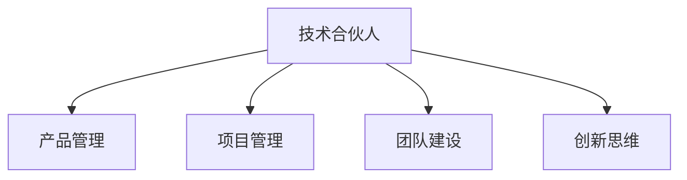

                 

# 技术合伙人：创业路上的角色

> 关键词：技术合伙人,创业团队,企业架构,技术管理,团队建设,创新思维

## 1. 背景介绍

### 1.1 问题由来
随着科技的快速发展和互联网的广泛应用，越来越多的初创企业涌现出来，这些企业以技术为核心竞争力，希望在市场中快速站稳脚跟。然而，技术创业不仅仅是技术本身的创新，更是团队管理和运营的挑战。一个优秀的技术合伙人，不仅能够提供技术解决方案，还能在企业成长过程中扮演多重角色，推动企业的持续发展。

### 1.2 问题核心关键点
技术合伙人的角色涵盖多个方面，包括技术研发、团队管理、产品创新、市场策略等。在创业初期，技术合伙人需要以技术为主导，推动产品开发和市场推广。随着企业的成长，技术合伙人还需要参与公司战略规划，确保技术与市场需求的紧密结合。

### 1.3 问题研究意义
研究技术合伙人角色的意义在于，帮助创业团队理解技术合伙人在企业发展中的关键作用，明确技术合伙人的职责和权利，从而构建更加高效、协调的创业团队。

## 2. 核心概念与联系

### 2.1 核心概念概述

为更好地理解技术合伙人在创业团队中的角色，本节将介绍几个密切相关的核心概念：

- **技术合伙人**：在创业团队中担任技术核心角色，负责技术研发、产品创新和团队管理的人员。
- **产品管理**：涉及产品的规划、设计、开发和推广，确保产品能够满足市场需求，提升用户体验。
- **项目管理**：包括项目计划、进度跟踪、资源分配和风险管理，确保项目按时按质完成。
- **团队建设**：关注团队文化、人才招聘、培训和激励，提高团队凝聚力和工作效率。
- **创新思维**：鼓励团队成员提出新想法、新方案，推动产品创新和业务拓展。

这些核心概念之间的逻辑关系可以通过以下Mermaid流程图来展示：



这个流程图展示出技术合伙人在多个职能领域的影响力和作用，确保创业项目能够顺利推进和创新发展。

## 3. 核心算法原理 & 具体操作步骤

### 3.1 算法原理概述

技术合伙人的工作原理可以总结为以下几个步骤：

1. **需求分析**：深入了解市场需求和用户痛点，确定产品开发方向。
2. **技术选型**：根据项目需求选择合适的技术方案和工具。
3. **架构设计**：构建合理的系统架构，确保系统的可扩展性和稳定性。
4. **研发实施**：组织团队进行技术研发和产品迭代。
5. **产品发布**：发布产品并进行市场推广。
6. **用户反馈**：收集用户反馈，进行产品优化和改进。

### 3.2 算法步骤详解

以下是技术合伙人进行技术管理和产品开发的具体操作步骤：

**Step 1: 需求分析和产品规划**

- **需求调研**：通过市场调研、用户访谈等方式，收集用户需求和市场信息。
- **产品规划**：根据调研结果，制定产品路线图和功能需求清单。

**Step 2: 技术选型和架构设计**

- **技术选型**：选择合适的技术栈和框架，确保项目的技术可行性。
- **架构设计**：设计系统架构和组件关系，确定系统的整体结构。

**Step 3: 研发实施**

- **项目计划**：制定详细的项目计划，包括时间节点、资源分配和任务分工。
- **代码开发**：组织团队进行代码编写和功能实现。
- **版本控制**：使用版本控制系统进行代码管理，确保代码的追踪和回滚。

**Step 4: 产品发布和市场推广**

- **测试验收**：进行单元测试、集成测试和用户验收测试，确保产品质量。
- **产品发布**：选择合适的时间和渠道发布产品。
- **市场推广**：制定市场推广策略，提升产品曝光率和用户获取率。

**Step 5: 用户反馈和产品优化**

- **用户反馈收集**：通过线上线下渠道收集用户反馈和意见。
- **产品优化**：根据用户反馈进行产品迭代和功能改进。
- **用户教育**：通过培训、文档和支持等方式，提升用户使用体验。

### 3.3 算法优缺点

技术合伙人角色在创业团队中的优点包括：

- **技术支撑**：提供强大的技术保障，确保项目顺利推进。
- **创新驱动**：推动技术创新和产品优化，提升产品竞争力。
- **资源整合**：整合内部资源和外部合作伙伴，加速项目进展。

同时，也存在一些缺点：

- **协调难度大**：需要协调团队内部和外部资源，处理复杂的人际关系。
- **沟通成本高**：涉及技术、产品和市场等多个方面，沟通成本较高。
- **市场导向不足**：过度关注技术细节，可能导致市场洞察不足。

### 3.4 算法应用领域

技术合伙人角色的应用领域涵盖多个方面，包括：

- **初创企业**：提供技术支持和产品创新，推动企业快速成长。
- **大型企业**：参与公司战略规划和业务扩展，提升企业技术水平和市场竞争力。
- **技术咨询公司**：提供技术方案和解决方案，帮助客户解决问题。
- **创业孵化器**：担任技术导师，指导创业团队进行技术研发和市场推广。

## 4. 数学模型和公式 & 详细讲解 & 举例说明

### 4.1 数学模型构建

假设创业项目的初始投资为 $I$，运营成本为 $C$，市场推广费用为 $M$，产品销售价格为 $P$，销售量为 $Q$，利润率为 $\eta$。则项目的总利润 $R$ 可以表示为：

$$
R = \eta \times (P \times Q - C)
$$

其中，$\eta$ 表示利润率，$P$ 表示产品销售价格，$Q$ 表示销售量，$C$ 表示运营成本。

### 4.2 公式推导过程

根据上述模型，可以推导出影响总利润的主要因素。假设市场推广费用 $M$ 对销售量 $Q$ 的影响为 $f(Q)$，则总利润 $R$ 可以表示为：

$$
R = \eta \times (P \times Q - C - M \times f(Q))
$$

进一步简化得到：

$$
R = \eta \times (P \times Q - C - M \times f(Q))
$$

其中，$M \times f(Q)$ 表示市场推广对销售量的影响。

### 4.3 案例分析与讲解

以一个电商平台为例，分析技术合伙人在产品推广和销售策略中的作用。假设平台初期投入 $I$，月运营成本为 $C$，每月推广费用为 $M$，产品销售价格为 $P$，每件产品销售量为 $Q$，利润率为 $\eta$。

**案例分析：**

1. **需求调研**：了解用户需求和市场趋势，确定产品定位和推广策略。
2. **技术选型**：选择适合的技术栈和框架，确保平台的稳定性和可扩展性。
3. **架构设计**：设计数据架构和用户界面，提升用户体验。
4. **研发实施**：组织团队进行代码开发和功能实现，确保平台按时上线。
5. **产品发布**：选择合适的时间点发布产品，进行市场推广。
6. **用户反馈**：收集用户反馈，进行产品优化和改进。

**策略优化：**

1. **价格策略**：根据市场调研结果，调整产品价格，提升销售量。
2. **推广策略**：制定有效的市场推广策略，提升平台曝光率和用户获取率。
3. **技术优化**：通过技术手段优化平台性能，提升用户体验。

## 5. 项目实践：代码实例和详细解释说明

### 5.1 开发环境搭建

在进行技术合伙人的项目实践前，我们需要准备好开发环境。以下是使用Python进行Flask开发的环境配置流程：

1. 安装Python：从官网下载并安装Python，安装过程中需要选择适合的Python版本。
2. 安装Flask：使用pip安装Flask框架，确保版本与Python版本兼容。
3. 配置数据库：选择合适的数据库（如MySQL、PostgreSQL等），并进行配置。
4. 安装依赖包：安装Flask所需的其他依赖包，如SQLAlchemy、Jinja2等。

完成上述步骤后，即可在Python环境中开始技术合伙人的项目实践。

### 5.2 源代码详细实现

以下是一个简单的电子商务平台的Flask应用代码实现，具体代码如下：

```python
from flask import Flask, render_template, request, redirect, url_for
from flask_sqlalchemy import SQLAlchemy

app = Flask(__name__)
app.config['SQLALCHEMY_DATABASE_URI'] = 'sqlite:///test.db'
db = SQLAlchemy(app)

class Product(db.Model):
    id = db.Column(db.Integer, primary_key=True)
    name = db.Column(db.String(80))
    price = db.Column(db.Float)
    description = db.Column(db.String(255))
    sales = db.Column(db.Integer)

@app.route('/')
def index():
    products = Product.query.all()
    return render_template('index.html', products=products)

@app.route('/add_product', methods=['GET', 'POST'])
def add_product():
    if request.method == 'POST':
        product = Product(name=request.form['name'], price=float(request.form['price']), description=request.form['description'])
        db.session.add(product)
        db.session.commit()
        return redirect(url_for('index'))
    else:
        return render_template('add_product.html')

@app.route('/product_details', methods=['GET'])
def product_details():
    product_id = request.args.get('id')
    product = Product.query.get(product_id)
    return render_template('product_details.html', product=product)

if __name__ == '__main__':
    app.run(debug=True)
```

这个代码示例展示了如何使用Flask框架构建一个简单的电子商务平台，实现商品管理功能。代码中使用了SQLAlchemy进行数据库操作，通过Flask路由实现页面导航和数据处理。

### 5.3 代码解读与分析

让我们再详细解读一下关键代码的实现细节：

**Flask应用实例**

1. **Flask应用配置**：首先定义Flask应用，配置数据库连接信息。
2. **模型定义**：定义商品实体类，包含商品名称、价格、描述和销量等属性。
3. **路由处理**：定义路由函数，处理请求和响应。
   - 首页路由：获取所有商品信息，渲染索引页面。
   - 添加商品路由：处理添加商品请求，保存数据到数据库。
   - 商品详情路由：获取商品详情，渲染商品详情页面。

**代码功能分析**

1. **数据库操作**：使用SQLAlchemy进行数据库连接和操作，支持增删改查等基本功能。
2. **路由处理**：使用Flask路由实现前后端交互，将请求映射到相应的处理函数。
3. **模板渲染**：使用Flask的模板引擎，渲染页面内容，展示商品信息。

**代码优化建议**

1. **异常处理**：增加异常处理机制，确保应用稳定运行。
2. **安全防护**：使用Flask的CSRF保护、SQL注入防护等技术，确保应用安全。
3. **性能优化**：使用缓存、异步处理等技术，提升应用性能。

## 6. 实际应用场景

### 6.1 智能家居系统

技术合伙人在智能家居系统中扮演关键角色，负责系统的整体设计和实现。通过整合物联网技术和智能算法，技术合伙人能够开发出能够自主学习、自主决策的智能家居设备，提升用户体验和家居安全。

**技术应用：**

1. **需求调研**：了解用户需求，确定智能家居系统的功能和设计。
2. **技术选型**：选择合适的物联网设备和传感器，确保系统的稳定性和兼容性。
3. **架构设计**：设计系统架构和组件关系，确保系统的可扩展性和安全性。
4. **研发实施**：组织团队进行代码编写和功能实现，确保系统按时上线。
5. **产品发布**：选择合适的时间点发布系统，进行市场推广。
6. **用户反馈**：收集用户反馈，进行系统优化和改进。

**系统功能：**

1. **智能安防**：通过传感器和摄像头进行实时监控，自动报警和通知用户。
2. **环境控制**：根据用户习惯自动调整温度、湿度等环境参数，提升舒适性。
3. **能耗管理**：通过智能算法优化能源使用，降低能耗和运营成本。

### 6.2 医疗健康平台

技术合伙人在医疗健康平台中扮演关键角色，负责系统的整体设计和实现。通过整合医疗数据和人工智能技术，技术合伙人能够开发出能够辅助医生诊断和治疗的智能系统，提升医疗服务的质量和效率。

**技术应用：**

1. **需求调研**：了解医生和患者需求，确定医疗健康系统的功能和设计。
2. **技术选型**：选择合适的医疗数据接口和算法模型，确保系统的准确性和可靠性。
3. **架构设计**：设计系统架构和组件关系，确保系统的可扩展性和安全性。
4. **研发实施**：组织团队进行代码编写和功能实现，确保系统按时上线。
5. **产品发布**：选择合适的时间点发布系统，进行市场推广。
6. **用户反馈**：收集医生和患者反馈，进行系统优化和改进。

**系统功能：**

1. **电子病历管理**：通过电子病历系统，医生可以方便地查看和更新患者的病历信息。
2. **智能诊断**：通过人工智能算法，辅助医生进行疾病诊断和预测。
3. **健康监测**：通过智能设备收集患者的健康数据，进行实时监测和预警。

### 6.3 在线教育平台

技术合伙人在在线教育平台中扮演关键角色，负责系统的整体设计和实现。通过整合教育资源和人工智能技术，技术合伙人能够开发出能够个性化推荐课程、智能答疑和评估学生表现的智能系统，提升教育效果和学习体验。

**技术应用：**

1. **需求调研**：了解学生和教师需求，确定在线教育系统的功能和设计。
2. **技术选型**：选择合适的教育资源和算法模型，确保系统的准确性和可靠性。
3. **架构设计**：设计系统架构和组件关系，确保系统的可扩展性和安全性。
4. **研发实施**：组织团队进行代码编写和功能实现，确保系统按时上线。
5. **产品发布**：选择合适的时间点发布系统，进行市场推广。
6. **用户反馈**：收集学生和教师反馈，进行系统优化和改进。

**系统功能：**

1. **个性化推荐**：通过人工智能算法，根据学生的学习情况和偏好，推荐适合的课程和资源。
2. **智能答疑**：通过人工智能算法，自动回答学生的提问，提升学习效果。
3. **学习评估**：通过人工智能算法，评估学生的学习表现，提供个性化的学习建议。

### 6.4 未来应用展望

随着技术的不断进步，技术合伙人在创业团队中的角色将变得更加多样化。未来，技术合伙人将需要具备更广泛的跨学科知识，能够协调团队内部的各个方面，推动企业的持续发展。

1. **跨学科知识**：随着技术的不断进步，技术合伙人的知识结构将需要更加多元化，涵盖计算机科学、经济学、心理学等多个领域。
2. **数据驱动决策**：技术合伙人将需要利用数据和分析工具，做出更科学、更精确的决策。
3. **持续学习**：技术合伙人将需要不断学习新知识，跟上技术发展的步伐，保持竞争力。
4. **跨团队协作**：技术合伙人将需要具备良好的沟通和协调能力，与团队内部的各个部门紧密合作。

## 7. 工具和资源推荐

### 7.1 学习资源推荐

为了帮助开发者系统掌握技术合伙人在创业团队中的角色，这里推荐一些优质的学习资源：

1. **Coursera《创业管理》课程**：由斯坦福大学开设的创业管理课程，涵盖创业团队建设、市场分析、财务管理等多个方面，帮助开发者全面了解创业过程。
2. **Udacity《产品管理》课程**：由Udacity开设的产品管理课程，涵盖产品规划、用户体验设计、市场策略等多个方面，帮助开发者提升产品管理能力。
3. **Google开发者文档**：Google提供的开发者文档，涵盖Java、Python、Flask等多个技术和工具的使用方法和最佳实践，帮助开发者提高开发效率。
4. **GitHub社区**：GitHub提供的开源项目和代码仓库，开发者可以在此学习和分享代码，提升技术水平。
5. **Medium技术文章**：Medium平台提供的大量技术文章，涵盖前端、后端、人工智能等多个领域，帮助开发者了解最新的技术趋势和最佳实践。

通过对这些资源的学习实践，相信你一定能够快速掌握技术合伙人在创业团队中的角色，并用于解决实际的创业问题。

### 7.2 开发工具推荐

高效的开发离不开优秀的工具支持。以下是几款用于技术合伙人在创业团队中使用的常用工具：

1. **Visual Studio Code**：一款轻量级、功能强大的代码编辑器，支持多种编程语言和插件，适合快速迭代开发。
2. **JIRA**：一款项目管理工具，支持任务分配、进度跟踪、资源管理等功能，帮助团队高效协作。
3. **Slack**：一款即时通讯工具，支持团队沟通、文件共享、任务提醒等功能，帮助团队快速响应问题。
4. **Git**：一款版本控制系统，支持代码管理和协作，确保团队开发过程的稳定性和可追溯性。
5. **Docker**：一款容器化平台，支持应用打包、部署和运维，提升应用的稳定性和可移植性。

合理利用这些工具，可以显著提升技术合伙人在创业团队中的开发效率，加快创新迭代的步伐。

### 7.3 相关论文推荐

技术合伙人的角色研究源于学界的持续研究。以下是几篇奠基性的相关论文，推荐阅读：

1. **《创业团队的形成和动态变化研究》**：该论文研究了创业团队的形成过程和动态变化规律，对技术合伙人角色有深入分析。
2. **《技术合伙人在创业团队中的作用》**：该论文探讨了技术合伙人在创业团队中的作用和职责，提供了丰富的案例和理论支持。
3. **《技术创新与创业成功》**：该论文研究了技术创新对创业成功的关键作用，对技术合伙人的作用有深入讨论。
4. **《跨学科团队在技术创新中的作用》**：该论文探讨了跨学科团队在技术创新中的作用，对技术合伙人的多学科知识要求有详细分析。

这些论文代表了大语言模型微调技术的发展脉络。通过学习这些前沿成果，可以帮助研究者把握学科前进方向，激发更多的创新灵感。

## 8. 总结：未来发展趋势与挑战

### 8.1 总结

本文对技术合伙人在创业团队中的角色进行了全面系统的介绍。首先阐述了技术合伙人角色的定义和意义，明确了技术合伙人在企业发展中的核心作用。其次，从原理到实践，详细讲解了技术合伙人在创业团队中的主要职责和操作步骤，给出了技术合伙人项目开发的完整代码实例。同时，本文还广泛探讨了技术合伙人角色在智能家居、医疗健康、在线教育等多个行业领域的应用前景，展示了技术合伙人角色的广阔前景。此外，本文精选了技术合伙人角色的各类学习资源，力求为读者提供全方位的技术指引。

通过本文的系统梳理，可以看到，技术合伙人角色在创业团队中扮演着多重角色，能够推动企业的技术创新和市场拓展。未来的技术合伙人需要具备更全面的跨学科知识和技能，才能够更好地适应复杂的创业环境。

### 8.2 未来发展趋势

展望未来，技术合伙人角色将呈现以下几个发展趋势：

1. **数据驱动决策**：随着大数据和人工智能技术的发展，技术合伙人将更加依赖数据和分析工具，做出更科学、更精确的决策。
2. **跨学科融合**：技术合伙人将需要具备更广泛的知识结构，涵盖计算机科学、经济学、心理学等多个领域，实现跨学科的深度融合。
3. **持续学习**：技术合伙人将需要不断学习新知识，跟上技术发展的步伐，保持竞争力。
4. **跨团队协作**：技术合伙人将需要具备良好的沟通和协调能力，与团队内部的各个部门紧密合作，推动企业的持续发展。

以上趋势凸显了技术合伙人角色的重要性和多样性。这些方向的探索发展，必将进一步提升创业团队的技术能力和管理水平，为企业的持续成长和创新提供坚实保障。

### 8.3 面临的挑战

尽管技术合伙人角色在创业团队中扮演着多重角色，但在迈向更加智能化、普适化应用的过程中，它仍面临着诸多挑战：

1. **跨领域协作难度大**：技术合伙人需要与多个领域的专业人员协作，处理复杂的人际关系和沟通成本较高。
2. **决策压力较大**：技术合伙人需要在多方面权衡，做出科学合理的决策，面临较大的压力和风险。
3. **资源整合困难**：技术合伙人需要整合内部资源和外部合作伙伴，确保项目的顺利进行，资源整合难度较大。

### 8.4 研究展望

未来的技术合伙人研究需要在以下几个方面寻求新的突破：

1. **跨学科人才培养**：建立跨学科人才培养机制，提升技术合伙人的知识结构和综合能力。
2. **数据驱动决策模型**：开发基于数据驱动的决策模型，帮助技术合伙人做出更科学、更精确的决策。
3. **技术合作机制**：建立技术合作机制，促进不同领域的专业人员之间的深度合作和资源共享。
4. **持续学习平台**：建立持续学习平台，提供丰富的学习资源和工具，帮助技术合伙人不断提升自身能力。

这些研究方向的探索，必将引领技术合伙人角色迈向更高的台阶，为企业的技术创新和市场拓展提供更加坚实的保障。只有勇于创新、敢于突破，才能不断拓展技术合伙人的边界，让技术合伙人更好地发挥其作用，推动企业不断成长。

## 9. 附录：常见问题与解答

**Q1：技术合伙人在创业团队中应承担哪些职责？**

A: 技术合伙人应承担以下职责：
1. 技术研发：负责技术方案的制定和实现，确保项目的按时按质完成。
2. 产品管理：负责产品的规划、设计和推广，确保产品能够满足市场需求。
3. 项目管理：负责项目的计划、进度和资源管理，确保项目顺利进行。
4. 团队建设：关注团队文化、人才招聘、培训和激励，提高团队凝聚力和工作效率。
5. 创新思维：鼓励团队成员提出新想法、新方案，推动产品创新和业务拓展。

**Q2：技术合伙人如何平衡技术创新和市场推广？**

A: 技术合伙人可以通过以下方式平衡技术创新和市场推广：
1. 需求调研：深入了解市场需求和用户痛点，确定产品开发方向。
2. 技术选型：选择合适的技术方案和工具，确保项目的技术可行性。
3. 架构设计：构建合理的系统架构，确保系统的可扩展性和稳定性。
4. 研发实施：组织团队进行技术研发和产品迭代，确保技术创新和产品优化。
5. 市场推广：制定有效的市场推广策略，提升产品曝光率和用户获取率。
6. 用户反馈：收集用户反馈，进行产品优化和改进，确保市场推广和用户需求的匹配。

**Q3：技术合伙人如何处理技术问题和项目管理冲突？**

A: 技术合伙人可以通过以下方式处理技术问题和项目管理冲突：
1. 需求分析：深入理解需求，确保技术方案和项目目标一致。
2. 优先级排序：根据项目优先级和资源状况，合理分配技术资源。
3. 沟通协调：建立良好的沟通机制，及时解决技术问题和管理冲突。
4. 风险管理：制定风险管理计划，提前识别和应对潜在问题。
5. 调整计划：根据实际情况，灵活调整项目计划和技术方案。

**Q4：技术合伙人如何保持持续学习？**

A: 技术合伙人可以通过以下方式保持持续学习：
1. 参加培训课程：参加技术培训和行业交流活动，提升自身技能和知识水平。
2. 阅读技术文献：阅读最新的技术论文和研究报告，了解前沿技术和趋势。
3. 参与开源项目：参与开源项目和技术社区，与全球技术爱好者共同进步。
4. 实践项目经验：通过实际项目积累经验，掌握实际应用中的技术和挑战。
5. 技术博客和视频：关注技术博客和视频，了解最新的技术进展和最佳实践。

**Q5：技术合伙人在创业团队中如何实现跨团队协作？**

A: 技术合伙人在创业团队中可以通过以下方式实现跨团队协作：
1. 明确目标：制定清晰的团队目标和任务分配，确保各方了解和认同。
2. 建立信任：通过有效的沟通和合作，建立团队成员之间的信任和依赖关系。
3. 共享信息：建立信息共享机制，确保团队成员及时了解项目进展和问题。
4. 灵活调整：根据实际情况，灵活调整团队结构和资源配置。
5. 持续反馈：建立持续反馈机制，及时发现和解决团队协作中的问题。

这些问答帮助创业团队理解和应对技术合伙人的挑战，为创业团队构建更加高效、协调的团队结构。总之，技术合伙人在创业团队中扮演着多重角色，需要具备全面的跨学科知识和技能，不断学习和优化，才能够推动企业的持续发展和成功。

