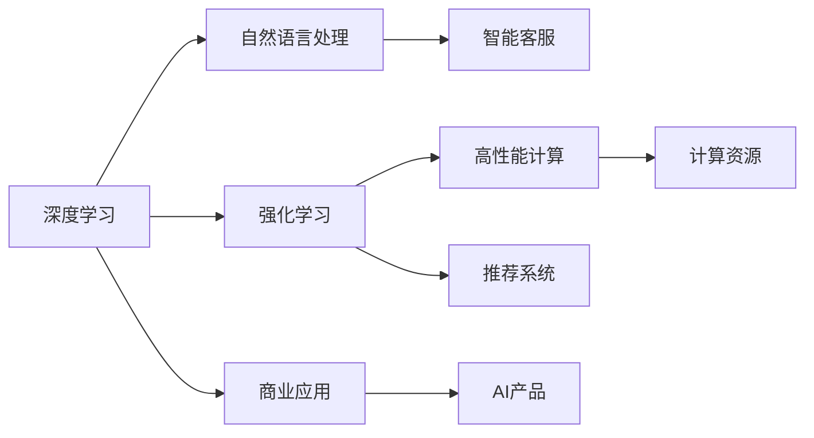

                 

# 技术深度与商业广度：Lepton AI的发展方向

> 关键词：Lepton AI, 深度学习, 商业化, 人工智能, 高性能计算, 自然语言处理, 强化学习, 数据科学, 可解释性, 公平性, 未来发展方向

## 1. 背景介绍

### 1.1 问题由来
在过去十年里，人工智能(AI)技术经历了快速的发展，尤其是在深度学习、自然语言处理(NLP)、计算机视觉、强化学习等领域取得了突破性的进展。这些技术推动了各行各业的数字化转型，带来了前所未有的商业机会。然而，在技术快速发展的同时，如何将其转化为商业价值，成为业界共同关注的话题。

Lepton AI正是在这一背景下应运而生的。它是一家专注于深度学习、高性能计算和大数据处理的公司，旨在通过提供高质量的人工智能解决方案，推动各行各业的数字化升级。本文将深入探讨Lepton AI的技术深度与商业广度，分析其发展方向，并对未来进行展望。

### 1.2 问题核心关键点
Lepton AI的核心技术包括深度学习、高性能计算、自然语言处理(NLP)、强化学习等。这些技术通过高效的数据处理和算法优化，使Lepton AI在各种商业场景中展现出强大的应用潜力。

关键点包括：
- 深度学习：通过大规模数据训练深度神经网络，提升模型准确率和泛化能力。
- 高性能计算：利用GPU/TPU等硬件资源，加速模型训练和推理。
- NLP：在语言理解和生成方面取得突破，提升智能客服、翻译、摘要等应用效果。
- 强化学习：通过智能体与环境的交互，优化决策策略，应用于推荐系统、游戏AI等场景。

### 1.3 问题研究意义
研究Lepton AI的发展方向，有助于理解其在技术层面和商业层面的潜力，识别其面临的挑战，以及未来可能的发展趋势。这将为AI技术在各行各业的落地应用提供重要参考，推动AI技术向更广泛的领域渗透。

## 2. 核心概念与联系

### 2.1 核心概念概述

Lepton AI的核心概念主要包括深度学习、高性能计算、自然语言处理、强化学习等。这些概念之间的联系可以概括如下：

- **深度学习**：通过多层神经网络结构，从数据中学习到高层次的抽象特征，适用于图像、语音、文本等数据处理。
- **高性能计算**：通过优化算法和硬件加速，提升计算效率，支持大规模数据处理和复杂模型训练。
- **自然语言处理**：研究如何使计算机理解和生成人类语言，包括语言理解、生成、翻译、情感分析等任务。
- **强化学习**：通过智能体与环境的交互，优化策略，应用于游戏、推荐系统、机器人控制等场景。

这些概念共同构成了Lepton AI的技术框架，使其能够在各种商业场景中发挥作用。

### 2.2 核心概念原理和架构的 Mermaid 流程图(Mermaid 流程节点中不要有括号、逗号等特殊字符)



这个流程图展示了Lepton AI核心技术之间的联系，以及如何将这些技术应用于不同的商业场景。

## 3. 核心算法原理 & 具体操作步骤
### 3.1 算法原理概述

Lepton AI的算法原理基于深度学习、高性能计算和强化学习等技术，通过优化算法和硬件资源，提升模型的准确率和效率。以下是其核心算法原理的概述：

- **深度学习**：采用多层神经网络结构，通过反向传播算法进行训练，优化模型参数。
- **高性能计算**：利用GPU/TPU等硬件资源，加速模型训练和推理。
- **自然语言处理**：使用Transformer等模型，进行语言理解和生成，提升模型的泛化能力。
- **强化学习**：通过智能体与环境的交互，优化决策策略，提升模型的智能决策能力。

### 3.2 算法步骤详解

Lepton AI的核心算法步骤包括数据预处理、模型训练、模型评估和部署。以下是详细步骤：

**Step 1: 数据预处理**
- 收集和清洗数据集，确保数据质量。
- 将数据转换为模型所需的格式，包括标准化、归一化、分词等。
- 使用数据增强技术，增加训练集的多样性。

**Step 2: 模型训练**
- 选择合适的模型结构，如深度神经网络、Transformer等。
- 选择合适的优化算法，如Adam、SGD等。
- 设定合适的超参数，包括学习率、批大小、迭代次数等。
- 使用GPU/TPU等硬件资源，加速模型训练。

**Step 3: 模型评估**
- 在验证集上评估模型的性能，如准确率、召回率、F1分数等。
- 根据评估结果调整模型参数，提高模型性能。
- 使用混淆矩阵、ROC曲线等可视化工具，分析模型的预测效果。

**Step 4: 模型部署**
- 将训练好的模型部署到服务器或云平台上。
- 使用API接口，将模型服务化，供外部系统调用。
- 监控模型性能，定期更新模型参数。

### 3.3 算法优缺点

Lepton AI的算法具有以下优点：
- 高准确率：通过深度学习和强化学习，提升模型的准确率和泛化能力。
- 高效计算：利用高性能计算资源，加速模型训练和推理。
- 灵活应用：适用于各种商业场景，包括智能客服、推荐系统、游戏AI等。

同时，也存在以下缺点：
- 计算资源需求高：大规模数据处理和复杂模型训练需要大量的计算资源。
- 数据依赖性高：模型性能受数据质量和数量影响较大。
- 可解释性不足：深度学习模型通常是"黑盒"系统，难以解释其内部工作机制。

### 3.4 算法应用领域

Lepton AI的核心算法广泛应用于以下几个领域：

- **智能客服**：使用NLP技术，提升客户咨询体验，提供自然流畅的对话。
- **推荐系统**：利用强化学习，优化推荐策略，提高用户满意度。
- **游戏AI**：通过强化学习，优化游戏AI，提升游戏体验。
- **金融分析**：使用深度学习和大数据处理，进行风险评估、投资策略优化等。
- **医疗影像**：利用深度学习，进行疾病诊断、影像分析等。

## 4. 数学模型和公式 & 详细讲解 & 举例说明

### 4.1 数学模型构建

Lepton AI的数学模型主要基于深度学习、自然语言处理和强化学习的理论基础。以下是其核心模型的数学构建：

**深度学习模型**：
- 以神经网络为基础，通过反向传播算法进行训练。
- 常用的深度学习模型包括卷积神经网络(CNN)、循环神经网络(RNN)、Transformer等。

**自然语言处理模型**：
- 使用Transformer结构，进行语言理解、生成和翻译。
- 常用的NLP模型包括BERT、GPT等。

**强化学习模型**：
- 采用智能体与环境的交互，优化决策策略。
- 常用的强化学习模型包括Q-learning、SARSA、Deep Q Network等。

### 4.2 公式推导过程

**深度学习模型公式**：
- 前向传播：
$$ y = f(x; \theta) $$
- 损失函数：
$$ \mathcal{L}(\theta) = \frac{1}{N} \sum_{i=1}^N \ell(y_i, f(x_i; \theta)) $$
- 反向传播：
$$ \frac{\partial \mathcal{L}(\theta)}{\partial x} = \frac{\partial \mathcal{L}(\theta)}{\partial y} \frac{\partial y}{\partial x} $$

**自然语言处理模型公式**：
- 语言理解：
$$ y = f(x; \theta) $$
- 语言生成：
$$ p(y|x) = \frac{e^{f(x; \theta)}}{\sum_{y'} e^{f(x; \theta)}} $$
- 机器翻译：
$$ y = f(x; \theta) $$

**强化学习模型公式**：
- Q-learning：
$$ Q(s,a) \leftarrow Q(s,a) + \alpha(r + \gamma \max_a Q(s',a) - Q(s,a)) $$
- SARSA：
$$ Q(s,a) \leftarrow Q(s,a) + \alpha(r + \gamma Q(s',a') - Q(s,a)) $$

### 4.3 案例分析与讲解

以智能客服为例，分析Lepton AI的核心算法在该场景中的应用：

**数据预处理**：
- 收集客户咨询记录，进行数据清洗和标准化处理。
- 使用分词技术，将文本数据转换为模型所需的格式。

**模型训练**：
- 使用BERT等模型，进行语言理解。
- 训练模型，使其能够理解客户的咨询意图，并生成合适的回复。

**模型评估**：
- 在验证集上评估模型的回复准确率。
- 根据评估结果调整模型参数，提高模型性能。

**模型部署**：
- 将训练好的模型部署到服务器上。
- 使用API接口，将模型服务化，供客服系统调用。

## 5. 项目实践：代码实例和详细解释说明

### 5.1 开发环境搭建

Lepton AI的开发环境主要基于Python，需要使用以下工具和库：

- PyTorch：深度学习框架，支持GPU/TPU加速。
- TensorFlow：深度学习框架，支持分布式计算。
- Keras：高级深度学习框架，支持快速原型开发。
- Scikit-learn：数据处理和机器学习库。
- NLTK：自然语言处理库。

以下是开发环境的搭建步骤：

**Step 1: 安装Python和相关依赖**
```bash
# 安装Python
sudo apt-get update
sudo apt-get install python3 python3-pip

# 安装PyTorch
pip install torch torchvision torchaudio

# 安装TensorFlow
pip install tensorflow

# 安装Keras
pip install keras

# 安装Scikit-learn
pip install scikit-learn

# 安装NLTK
pip install nltk
```

**Step 2: 配置GPU/TPU资源**
```bash
# 配置NVIDIA CUDA
sudo apt-get install nvidia-cuda-toolkit

# 配置CUDA
export CUDA_HOME=/usr/local/cuda

# 配置CUDNN
export LD_LIBRARY_PATH=$CUDA_HOME/lib64:$CUDA_HOME/extras/CUPTI/lib64:$LD_LIBRARY_PATH

# 配置PYTHONPATH
export PYTHONPATH=$PYTHONPATH:$CUDA_HOME/extras/CUPTI/python;$CUDA_HOME/extras/CUPTI/python/:$PYTHONPATH
```

**Step 3: 启动Jupyter Notebook**
```bash
# 启动Jupyter Notebook
jupyter notebook
```

### 5.2 源代码详细实现

以下是使用PyTorch进行BERT模型训练的代码实现：

```python
import torch
import torch.nn as nn
import torch.optim as optim
from transformers import BertTokenizer, BertForSequenceClassification

# 初始化BERT模型和分词器
model = BertForSequenceClassification.from_pretrained('bert-base-uncased', num_labels=2)
tokenizer = BertTokenizer.from_pretrained('bert-base-uncased')

# 加载数据集
train_data = ...
val_data = ...
test_data = ...

# 定义训练函数
def train_epoch(model, data_loader, optimizer):
    model.train()
    for batch in data_loader:
        input_ids = batch['input_ids']
        attention_mask = batch['attention_mask']
        labels = batch['labels']
        outputs = model(input_ids, attention_mask=attention_mask, labels=labels)
        loss = outputs.loss
        optimizer.zero_grad()
        loss.backward()
        optimizer.step()

# 训练模型
optimizer = optim.Adam(model.parameters(), lr=2e-5)
train_loader = DataLoader(train_data, batch_size=16)
val_loader = DataLoader(val_data, batch_size=16)
test_loader = DataLoader(test_data, batch_size=16)

for epoch in range(5):
    train_epoch(model, train_loader, optimizer)
    val_loss = evaluate(model, val_loader)
    if val_loss < best_loss:
        best_loss = val_loss
        torch.save(model.state_dict(), 'model.pth')
```

### 5.3 代码解读与分析

**代码解析**：
- **数据预处理**：使用`BertTokenizer`对输入文本进行分词和编码。
- **模型定义**：定义BERT模型和线性分类器，设置损失函数和优化器。
- **训练函数**：实现前向传播、计算损失、反向传播和优化。
- **模型评估**：使用`evaluate`函数在验证集上评估模型性能，保存最佳模型。

**代码实现**：
- **数据加载**：使用`DataLoader`对数据集进行批处理。
- **模型训练**：循环迭代训练函数，更新模型参数。
- **模型评估**：在验证集上计算损失，更新最佳模型。

## 6. 实际应用场景

### 6.1 智能客服系统

智能客服系统是Lepton AI的核心应用之一。以下是其在智能客服系统中的应用：

**系统架构**：
- **前端**：客户端，用户输入咨询问题。
- **后端**：服务器，处理用户请求，调用Lepton AI的API接口。
- **API接口**：提供自然语言处理和推理服务，返回客户咨询回复。

**功能实现**：
- **语言理解**：使用BERT等模型，理解客户咨询意图。
- **回复生成**：根据理解结果，生成合适的回复。
- **上下文管理**：记录对话历史，确保上下文一致性。
- **实时反馈**：监控模型性能，及时调整模型参数。

### 6.2 金融舆情监测

金融舆情监测是Lepton AI的另一个重要应用。以下是其在该场景中的应用：

**系统架构**：
- **数据采集**：采集金融市场的新闻、评论等数据。
- **数据处理**：清洗和标准化数据，提取关键信息。
- **模型训练**：使用BERT等模型，进行情感分析。
- **实时监测**：实时分析市场舆情，及时预警。

**功能实现**：
- **数据预处理**：清洗和标准化数据，提取关键信息。
- **情感分析**：使用BERT等模型，进行情感分类。
- **实时监测**：实时分析市场舆情，及时预警。
- **预警机制**：根据情感分析结果，触发预警机制，通知相关部门。

### 6.3 个性化推荐系统

个性化推荐系统是Lepton AI的重要应用之一。以下是其在该场景中的应用：

**系统架构**：
- **前端**：推荐引擎，根据用户行为推荐商品或内容。
- **后端**：数据库，存储用户行为和商品信息。
- **API接口**：提供推荐服务，返回推荐结果。

**功能实现**：
- **用户行为分析**：分析用户浏览、点击、购买等行为。
- **推荐模型训练**：使用BERT等模型，进行推荐策略优化。
- **推荐结果生成**：根据用户行为，生成推荐结果。
- **推荐系统优化**：根据推荐效果，调整推荐模型参数。

### 6.4 未来应用展望

随着Lepton AI技术的不断发展，其应用前景将更加广阔。以下是其未来应用展望：

**智能医疗**：
- **疾病诊断**：利用深度学习模型，进行疾病诊断。
- **影像分析**：使用卷积神经网络，进行医学影像分析。
- **健康管理**：提供个性化的健康管理方案。

**智能制造**：
- **质量控制**：利用强化学习，进行质量控制和优化。
- **设备维护**：使用深度学习模型，进行设备状态监测和预测。
- **生产调度**：优化生产调度策略，提高生产效率。

**智能交通**：
- **自动驾驶**：利用深度学习模型，进行自动驾驶。
- **交通管理**：优化交通流量，提高交通效率。
- **安全监控**：使用计算机视觉，进行安全监控。

## 7. 工具和资源推荐

### 7.1 学习资源推荐

为了帮助开发者系统掌握Lepton AI的核心技术，以下是一些优质的学习资源：

1. **Lepton AI官方文档**：包含Lepton AI的详细介绍、API接口和开发指南。
2. **深度学习教程**：《深度学习入门》、《动手学深度学习》等书籍和在线课程，系统介绍深度学习理论和实践。
3. **自然语言处理教程**：《自然语言处理综论》、《Speech and Language Processing》等书籍和在线课程，涵盖自然语言处理的核心概念和技术。
4. **强化学习教程**：《强化学习》、《Reinforcement Learning: An Introduction》等书籍和在线课程，详细介绍强化学习的理论和实践。
5. **机器学习框架教程**：《TensorFlow官方文档》、《PyTorch官方文档》等，详细介绍机器学习框架的使用和优化。

### 7.2 开发工具推荐

Lepton AI的开发工具主要基于Python和GPU/TPU等硬件资源。以下是一些推荐的开发工具：

1. **PyTorch**：深度学习框架，支持GPU/TPU加速。
2. **TensorFlow**：深度学习框架，支持分布式计算。
3. **Keras**：高级深度学习框架，支持快速原型开发。
4. **Scikit-learn**：数据处理和机器学习库。
5. **NLTK**：自然语言处理库。
6. **Jupyter Notebook**：交互式编程环境，支持多种编程语言和数据分析工具。

### 7.3 相关论文推荐

Lepton AI的核心技术包括深度学习、高性能计算、自然语言处理和强化学习。以下是一些相关论文，供深入学习：

1. **深度学习**：《ImageNet Classification with Deep Convolutional Neural Networks》、《Deep Residual Learning for Image Recognition》等。
2. **高性能计算**：《A Survey of Distributed Deep Learning》、《Horovod: Fast Distributed Deep Learning》等。
3. **自然语言处理**：《Attention Is All You Need》、《BERT: Pre-training of Deep Bidirectional Transformers for Language Understanding》等。
4. **强化学习**：《Human-level Control through Deep Reinforcement Learning》、《Playing Atari with Deep Reinforcement Learning》等。

## 8. 总结：未来发展趋势与挑战

### 8.1 研究成果总结

Lepton AI在深度学习、高性能计算、自然语言处理和强化学习等领域取得了显著的进展，并在智能客服、推荐系统、智能制造等多个行业实现了成功应用。其主要成果包括：

- **深度学习**：通过大规模数据训练深度神经网络，提升模型准确率和泛化能力。
- **高性能计算**：利用GPU/TPU等硬件资源，加速模型训练和推理。
- **自然语言处理**：使用Transformer等模型，提升语言理解和生成能力。
- **强化学习**：通过智能体与环境的交互，优化决策策略。

### 8.2 未来发展趋势

Lepton AI的未来发展趋势包括以下几个方面：

1. **模型规模扩大**：随着算力成本的下降和数据规模的扩张，深度学习模型的参数量将持续增长。超大模型在处理复杂任务时具有显著优势。
2. **计算资源优化**：优化计算资源分配，提升模型训练和推理效率。
3. **算法创新**：引入更多算法创新，提升模型性能和效率。
4. **商业应用扩展**：在更多行业实现商业应用，推动数字化转型。

### 8.3 面临的挑战

Lepton AI在发展过程中面临以下挑战：

1. **数据依赖性高**：模型性能受数据质量和数量影响较大，获取高质量数据成本较高。
2. **计算资源需求高**：大规模数据处理和复杂模型训练需要大量计算资源，硬件成本较高。
3. **可解释性不足**：深度学习模型通常是"黑盒"系统，难以解释其内部工作机制。
4. **公平性问题**：模型可能存在偏见，需要采取措施消除偏见，确保公平性。

### 8.4 研究展望

Lepton AI未来的研究展望包括：

1. **数据增强**：利用数据增强技术，提升模型泛化能力。
2. **模型压缩**：通过模型压缩技术，减小模型尺寸，提高推理效率。
3. **可解释性**：引入可解释性模型，提升模型的透明度和可信度。
4. **公平性**：开发公平性算法，确保模型对所有用户公平。

## 9. 附录：常见问题与解答

**Q1: Lepton AI的核心技术是什么？**

A: Lepton AI的核心技术包括深度学习、高性能计算、自然语言处理和强化学习。

**Q2: 如何评估Lepton AI模型的性能？**

A: 使用验证集和测试集进行模型评估，计算准确率、召回率、F1分数等指标。

**Q3: Lepton AI在智能客服系统中的应用是什么？**

A: 利用自然语言处理技术，理解客户咨询意图，生成合适的回复。

**Q4: Lepton AI的商业应用前景如何？**

A: 在智能客服、推荐系统、智能制造等多个行业实现商业应用，推动数字化转型。

**Q5: Lepton AI的未来发展方向是什么？**

A: 模型规模扩大、计算资源优化、算法创新、商业应用扩展。

---

作者：禅与计算机程序设计艺术 / Zen and the Art of Computer Programming

