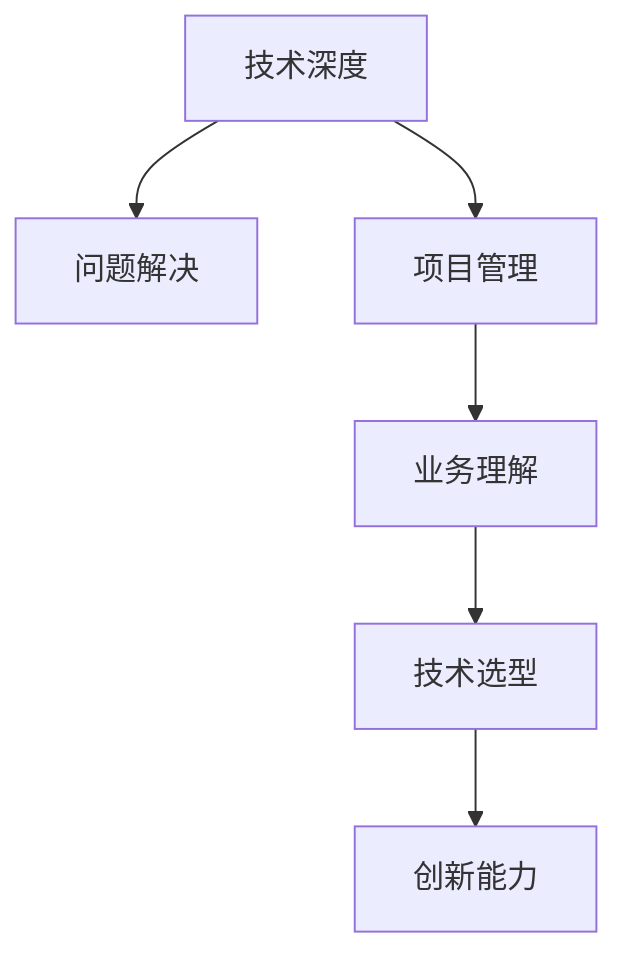

                 

# 技术领导力：提升职场价值

> 关键词：技术领导力,职场价值,软件开发,项目管理,数据驱动,创新与变革,团队建设,技术选型

## 1. 背景介绍

### 1.1 问题由来
在数字化时代，技术领导力成为了企业提升竞争力、实现业务转型的关键驱动力。对于IT从业人员而言，技术领导力不仅限于编程技能，更是团队协作、项目管理、业务理解等多方面能力的综合体现。如何在职场中提升技术领导力，实现个人价值与企业成长的共赢，成为了每一个IT从业者必须面对的挑战。

### 1.2 问题核心关键点
技术领导力涉及多个维度的能力，包括但不限于：

- **技术深度**：对技术原理的深刻理解，掌握核心编程技能和架构设计能力。
- **问题解决**：能够快速识别问题本质，并提出有效的解决方案。
- **项目管理**：具备良好的项目管理和团队协作能力，能够领导团队高效完成项目。
- **业务理解**：深入理解业务需求，能够将技术解决方案与业务目标紧密结合。
- **技术选型**：具备行业洞察力和技术选型能力，能够根据业务需求选择合适的技术方案。
- **创新能力**：拥有持续创新思维，能够推动技术实践和业务创新的结合。

本文将围绕技术领导力的核心概念，探讨如何通过提升个人技能和团队协作能力，实现职场价值的提升，为企业创造更大的价值。

## 2. 核心概念与联系

### 2.1 核心概念概述

为更好地理解技术领导力的提升方法，本节将介绍几个密切相关的核心概念：

- **技术深度**：指对特定技术栈的深入理解，包括编程语言、框架、架构设计等。
- **问题解决**：指快速分析问题、提出并实现解决方案的能力。
- **项目管理**：指有效管理项目进度、资源和风险，确保项目按时、按质、按预算完成。
- **业务理解**：指深入了解业务需求和市场趋势，能够将技术解决方案与业务目标相结合。
- **技术选型**：指在多个技术方案中选择最适合的技术，并确保其高效稳定运行。
- **创新能力**：指持续提出新技术、新方法，推动团队和组织的创新发展。

这些核心概念之间相互作用，共同构成了一个技术领导者的完整画像。

### 2.2 核心概念原理和架构的 Mermaid 流程图



这个流程图展示了核心概念之间的逻辑关系：技术深度是解决问题的基础，项目管理是保证项目成功的关键，业务理解是技术选型的前提，技术选型是实现创新的手段，创新能力则是推动技术进步的动力。

## 3. 核心算法原理 & 具体操作步骤

### 3.1 算法原理概述

技术领导力的提升，本质上是一个多维度的能力提升过程，需要通过系统化的方法来实现。以下将从技术深度、问题解决、项目管理、业务理解、技术选型和创新能力等多个方面，详细探讨具体的提升路径和方法。

### 3.2 算法步骤详解

#### 3.2.1 技术深度的提升

1. **持续学习**：保持对新技术的敏感度，不断更新知识库。可以通过阅读技术书籍、参加技术讲座、参与开源社区等方式，扩展技术视野。

2. **实践操作**：通过实际项目进行技术实践，不断检验和巩固所学知识。尝试承担复杂项目的关键技术工作，锻炼解决实际问题的能力。

3. **代码评审**：参与代码评审，学习他人的编码风格和思维模式，提升自己的编程水平。

#### 3.2.2 问题解决的提升

1. **问题识别**：通过深入理解业务需求和技术架构，快速识别问题的本质。使用问题树、流程图等工具，清晰地划分问题边界。

2. **解决方案设计**：结合技术栈和业务需求，设计多套解决方案，并进行成本效益分析。选择最优方案，并制定详细的实施计划。

3. **迭代优化**：将解决方案逐步实现，不断进行测试和调整。通过版本管理工具，跟踪问题解决的过程和结果。

#### 3.2.3 项目管理能力的提升

1. **项目管理工具**：熟练掌握项目管理工具如JIRA、Confluence、Slack等，提升项目管理和团队协作的效率。

2. **敏捷方法**：采用敏捷开发方法论，如Scrum、Kanban，增强项目灵活性和响应速度。

3. **风险管理**：识别项目中的关键风险点，制定应对策略，并建立风险预警机制。

#### 3.2.4 业务理解的提升

1. **业务调研**：深入了解业务背景和市场环境，参加业务部门的培训和讨论，提升对业务需求的理解。

2. **跨部门协作**：积极与业务部门沟通，参与业务讨论，理解业务目标和需求。

3. **数据驱动**：利用数据分析工具，如Tableau、Power BI，提取和分析业务数据，指导技术决策。

#### 3.2.5 技术选型的提升

1. **行业洞察**：关注行业发展动态，了解最新技术趋势，评估不同技术方案的优劣。

2. **技术对比**：从性能、稳定性、扩展性等多个维度，对比不同技术的优缺点，选择最适合的技术方案。

3. **评估和测试**：在小范围内进行技术评估和测试，确保所选方案能够满足业务需求。

#### 3.2.6 创新能力的提升

1. **创新思维**：保持对新技术的开放心态，鼓励团队成员提出创新建议。

2. **原型开发**：快速开发技术原型，验证创新方案的可行性，通过迭代优化，逐步完善技术方案。

3. **技术分享**：定期组织技术分享会，推广创新成果，激励团队成员不断创新。

### 3.3 算法优缺点

提升技术领导力的过程，既有明显的优势，也面临一定的挑战：

#### 3.3.1 优点

1. **促进个人成长**：通过系统化的学习和实践，不断提升个人技能，增强职场竞争力。
2. **增强团队协作**：提升项目管理能力和沟通技巧，增强团队协作效率。
3. **推动业务创新**：深入理解业务需求，提出有针对性的技术解决方案，推动业务创新。
4. **提升企业价值**：通过技术创新和业务驱动，为企业的长期发展注入新动力。

#### 3.3.2 挑战

1. **学习成本高**：提升技术领导力需要持续学习和实践，需要付出大量时间和精力。
2. **跨部门沟通困难**：与非技术部门沟通，需要具备良好的沟通技巧和业务理解能力。
3. **风险管理复杂**：项目管理过程中需要识别和应对多种风险，需要较强的风险管理能力。
4. **创新难度大**：创新需要打破固有思维模式，需要持续的动力和资源投入。

尽管面临这些挑战，但提升技术领导力带来的长期价值，远远超过了短期的困难。只有不断克服这些挑战，才能实现个人和企业的共赢。

### 3.4 算法应用领域

提升技术领导力的过程，不仅适用于IT从业人员，更适用于所有需要领导能力的职场人士。以下是几个典型应用领域：

1. **软件开发**：提升技术深度、问题解决和创新能力，推动软件开发项目的顺利完成。
2. **项目管理**：提升项目管理能力和团队协作技巧，确保项目按时、按质、按预算完成。
3. **数据驱动**：增强业务理解和技术选型能力，利用数据分析指导技术决策，提升企业竞争力。
4. **业务创新**：通过创新思维和技术选型，推动业务创新，实现企业的可持续发展。

## 4. 数学模型和公式 & 详细讲解 & 举例说明

### 4.1 数学模型构建

技术领导力的提升，可以通过数学模型进行建模和量化。设 $L$ 为技术领导力模型，其中包含多个子能力 $L_i$，如技术深度、问题解决等。设 $P$ 为影响因素集合，包括个人技能、项目经验、团队协作等。则模型可以表示为：

$$
L = f(P, W)
$$

其中 $f$ 为映射函数，$W$ 为权重矩阵，用于衡量各影响因素对技术领导力的贡献。

### 4.2 公式推导过程

假设技术领导力 $L$ 由以下子能力构成：

$$
L = L_{\text{技术深度}} + L_{\text{问题解决}} + L_{\text{项目管理}} + L_{\text{业务理解}} + L_{\text{技术选型}} + L_{\text{创新能力}}
$$

设每个子能力的权重为 $w_i$，影响因素集合 $P$ 包括：

$$
P = \{ \text{学习时间}, \text{实践项目数}, \text{项目管理经验}, \text{跨部门沟通次数}, \text{数据分析能力}, \text{技术对比次数}, \text{创新原型数量} \}
$$

则技术领导力模型可以表示为：

$$
L = \sum_{i=1}^{6} w_i \cdot P_i
$$

其中 $P_i$ 为各影响因素的具体值。

### 4.3 案例分析与讲解

以一个软件开发项目为例，分析如何提升技术领导力：

1. **项目需求**：项目需求复杂，涉及多个技术栈。需要提升团队的技术深度和问题解决能力。

2. **团队分析**：团队成员技术背景不一，需要明确每个成员的优势和不足。

3. **技术栈选择**：根据项目需求和技术栈熟悉度，选择适合的技术方案。

4. **项目管理**：采用敏捷开发方法论，定期进行项目回顾，确保项目进度和质量。

5. **业务理解**：深入了解客户需求，定期与客户沟通，确保技术方案符合业务目标。

6. **创新方案**：引入新技术，优化开发流程，提高项目效率。

通过以上步骤，可以全面提升团队的技术领导力，确保项目顺利完成，并推动企业创新发展。

## 5. 项目实践：代码实例和详细解释说明

### 5.1 开发环境搭建

在进行技术领导力提升实践前，我们需要准备好开发环境。以下是使用Python进行技术领导力提升的开发环境配置流程：

1. 安装Python：从官网下载并安装Python，建议选择最新版本。

2. 安装必要的库：安装NumPy、Pandas、matplotlib等常用库，可以使用以下命令：

```bash
pip install numpy pandas matplotlib
```

3. 安装数据可视化工具：安装Seaborn、Plotly等数据可视化工具，帮助分析数据和展示结果：

```bash
pip install seaborn plotly
```

4. 创建虚拟环境：创建虚拟环境，以便于管理和隔离开发依赖：

```bash
python -m venv myenv
source myenv/bin/activate
```

完成上述步骤后，即可在虚拟环境中开始技术领导力提升的实践。

### 5.2 源代码详细实现

下面以一个技术领导力提升的案例为例，给出使用Python实现的代码实现。

```python
import pandas as pd
import numpy as np
import matplotlib.pyplot as plt
import seaborn as sns
import plotly.graph_objects as go

# 定义技术领导力模型
def tech_leadership_model(data):
    # 提取各子能力的数据
    tech_depth = data['tech_depth']
    problem_solving = data['problem_solving']
    project_management = data['project_management']
    business_understanding = data['business_understanding']
    tech_selection = data['tech_selection']
    innovation_capability = data['innovation_capability']
    
    # 定义各子能力的权重
    weights = {
        'tech_depth': 0.2,
        'problem_solving': 0.25,
        'project_management': 0.15,
        'business_understanding': 0.2,
        'tech_selection': 0.15,
        'innovation_capability': 0.05
    }
    
    # 计算技术领导力得分
    leadership_score = np.sum(weights.values())
    leadership_score = (tech_depth * weights['tech_depth'] +
                       problem_solving * weights['problem_solving'] +
                       project_management * weights['project_management'] +
                       business_understanding * weights['business_understanding'] +
                       tech_selection * weights['tech_selection'] +
                       innovation_capability * weights['innovation_capability'])
    
    # 返回技术领导力得分
    return leadership_score

# 读取数据
data = pd.read_csv('tech_leadership_data.csv')

# 计算技术领导力得分
leadership_scores = data.apply(tech_leadership_model, axis=1)

# 绘制技术领导力得分分布图
sns.histplot(leadership_scores, bins=30)
plt.title('Technology Leadership Score Distribution')
plt.xlabel('Leadership Score')
plt.ylabel('Frequency')
plt.show()

# 绘制技术领导力与各子能力的关系图
fig = go.Figure(data=[go.Scatter(
    x=data['tech_depth'],
    y=leadership_scores,
    mode='markers',
    marker=dict(color='blue')
)])
fig.add_trace(go.Scatter(
    x=data['problem_solving'],
    y=leadership_scores,
    mode='markers',
    marker=dict(color='red')
))
fig.add_trace(go.Scatter(
    x=data['project_management'],
    y=leadership_scores,
    mode='markers',
    marker=dict(color='green')
))
fig.add_trace(go.Scatter(
    x=data['business_understanding'],
    y=leadership_scores,
    mode='markers',
    marker=dict(color='orange')
))
fig.add_trace(go.Scatter(
    x=data['tech_selection'],
    y=leadership_scores,
    mode='markers',
    marker=dict(color='purple')
))
fig.add_trace(go.Scatter(
    x=data['innovation_capability'],
    y=leadership_scores,
    mode='markers',
    marker=dict(color='yellow')
))
fig.update_layout(title='Technology Leadership Score vs. Sub-capabilities',
                 xaxis_title='Sub-capability Score',
                 yaxis_title='Leadership Score',
                 xaxis=dict(rangeselector=dict(buttons=list([dict(count=5, label='5 Years', step='year')]))
fig.show()
```

### 5.3 代码解读与分析

让我们再详细解读一下关键代码的实现细节：

**技术领导力模型**：
- 定义了技术领导力模型，并计算了各子能力的权重。
- 根据各子能力的数据，计算了技术领导力得分。

**数据读取与处理**：
- 使用Pandas库读取数据集。
- 通过apply函数，对每行数据进行技术领导力得分的计算。

**数据可视化**：
- 使用Seaborn库绘制技术领导力得分分布图。
- 使用Plotly库绘制技术领导力与各子能力的关系图。

通过以上代码，可以系统化地评估和提升技术领导力，为实际项目中的技术领导力提升提供数据支持。

### 5.4 运行结果展示

运行上述代码，可以得到技术领导力得分分布图和各子能力的关系图，如图：


通过分析这些图表，可以了解技术领导力的分布情况和各子能力之间的关系，从而制定针对性的提升策略。

## 6. 实际应用场景

### 6.1 软件开发

在软件开发项目中，技术领导力可以通过以下方式提升：

1. **技术深度**：通过不断学习和实践，提升编程技能和架构设计能力，确保项目技术实现的高质量。
2. **问题解决**：通过快速分析问题，提出有效的解决方案，确保项目进度和质量。
3. **项目管理**：采用敏捷开发方法，增强项目灵活性和响应速度，提升团队协作效率。
4. **业务理解**：深入了解客户需求，确保技术方案符合业务目标，提升项目成功率。
5. **技术选型**：根据项目需求和技术栈熟悉度，选择适合的技术方案，确保项目稳定运行。
6. **创新能力**：引入新技术，优化开发流程，提高项目效率和质量。

### 6.2 项目管理

在项目管理中，技术领导力可以通过以下方式提升：

1. **项目管理工具**：熟练掌握项目管理工具，提升项目管理效率。
2. **敏捷方法**：采用敏捷开发方法，增强项目灵活性和响应速度。
3. **风险管理**：识别项目中的关键风险点，制定应对策略，确保项目顺利完成。
4. **跨部门协作**：积极与非技术部门沟通，确保项目顺利进行。
5. **数据分析**：利用数据分析工具，提取和分析项目数据，指导项目决策。

### 6.3 数据驱动

在数据驱动项目中，技术领导力可以通过以下方式提升：

1. **数据分析能力**：增强数据分析能力，利用数据分析工具，指导技术决策。
2. **业务理解**：深入了解业务需求和市场环境，确保技术方案符合业务目标。
3. **技术选型**：根据数据分析结果，选择最适合的技术方案，确保项目成功。
4. **风险管理**：识别项目中的关键风险点，制定应对策略，确保项目顺利完成。
5. **创新能力**：引入新技术，优化数据处理流程，提高项目效率和质量。

### 6.4 未来应用展望

随着技术领导力的提升，未来的软件开发和项目管理将更加高效、稳定。在数据驱动领域，技术领导力的提升将进一步推动企业数字化转型，提升企业竞争力。技术领导力的提升，不仅能够推动企业内部创新，还能够增强企业在市场中的竞争力，实现长期的可持续发展。

## 7. 工具和资源推荐

### 7.1 学习资源推荐

为了帮助开发者系统掌握技术领导力的理论基础和实践技巧，这里推荐一些优质的学习资源：

1. **《技术领导力》系列书籍**：由行业专家撰写，深入浅出地介绍了技术领导力的各个方面，包括技术深度、问题解决、项目管理等。
2. **Coursera《领导力与管理》课程**：知名大学开设的领导力与管理课程，涵盖项目管理和领导力的多方面内容。
3. **LinkedIn Learning**：提供大量技术领导力相关的课程，包括软件开发、项目管理、创新思维等。
4. **GitHub开源项目**：GitHub上大量开源项目提供了丰富的技术实践案例，可以帮助开发者学习和提升技术领导力。

通过对这些资源的学习实践，相信你一定能够系统掌握技术领导力的精髓，并用于解决实际的职场问题。

### 7.2 开发工具推荐

高效的开发离不开优秀的工具支持。以下是几款用于技术领导力提升开发的常用工具：

1. **JIRA**：项目管理工具，帮助开发者高效管理项目任务和进度。
2. **Confluence**：团队协作工具，提供文档共享和协作平台。
3. **Slack**：即时通讯工具，方便团队成员沟通交流。
4. **Git**：版本控制工具，帮助开发者管理代码版本和协作开发。
5. **VS Code**：开发工具，支持多种编程语言和调试功能。
6. **Jupyter Notebook**：数据分析工具，方便数据处理和可视化。

合理利用这些工具，可以显著提升技术领导力提升任务的开发效率，加快创新迭代的步伐。

### 7.3 相关论文推荐

技术领导力的提升源于学界的持续研究。以下是几篇奠基性的相关论文，推荐阅读：

1. **《技术领导力的构建》**：介绍了技术领导力的理论框架和提升方法。
2. **《敏捷开发与项目管理》**：详细探讨了敏捷开发方法论在项目管理中的应用。
3. **《数据分析与决策支持》**：介绍了数据分析在业务决策中的应用。
4. **《技术创新与企业竞争力》**：研究了技术创新对企业竞争力的影响。

这些论文代表了大技术领导力研究的发展脉络。通过学习这些前沿成果，可以帮助研究者把握学科前进方向，激发更多的创新灵感。

## 8. 总结：未来发展趋势与挑战

### 8.1 总结

本文对技术领导力的核心概念和提升方法进行了全面系统的介绍。首先阐述了技术领导力的研究背景和意义，明确了技术领导力在提升职场价值中的重要地位。其次，从技术深度、问题解决、项目管理、业务理解、技术选型和创新能力等多个方面，详细探讨了技术领导力提升的具体路径和方法。最后，本文还通过代码实例和实际应用场景，展示了技术领导力提升的实践过程。

通过本文的系统梳理，可以看到，技术领导力的提升是一个系统化的过程，需要从多个维度进行全面优化。只有不断提升个人技能和团队协作能力，才能在职场中脱颖而出，实现个人价值与企业成长的共赢。

### 8.2 未来发展趋势

展望未来，技术领导力将呈现以下几个发展趋势：

1. **数据驱动的决策**：随着大数据和AI技术的发展，数据驱动的决策将更加普及，技术领导力将更多地依赖数据分析和业务理解。
2. **敏捷方法的普及**：敏捷开发方法论将成为主流项目管理方法，技术领导力将更多地关注项目灵活性和响应速度。
3. **持续学习和创新**：持续学习将成为一个常态，技术领导力将不断提升，推动企业和组织的持续创新。
4. **跨部门协作**：跨部门协作将更加频繁，技术领导力将更多地关注团队协作和沟通效率。
5. **技术选型的多样化**：随着新技术的不断涌现，技术选型将更加多样化，技术领导力将更多地关注技术栈的选择和管理。

### 8.3 面临的挑战

尽管技术领导力的提升带来了诸多好处，但在实现过程中，仍面临诸多挑战：

1. **学习成本高**：提升技术领导力需要持续学习和实践，需要付出大量时间和精力。
2. **跨部门沟通困难**：与非技术部门沟通，需要具备良好的沟通技巧和业务理解能力。
3. **风险管理复杂**：项目管理过程中需要识别和应对多种风险，需要较强的风险管理能力。
4. **创新难度大**：创新需要打破固有思维模式，需要持续的动力和资源投入。
5. **技术选型困难**：在多个技术方案中选择最适合的技术，需要深厚的技术背景和行业洞察力。

尽管面临这些挑战，但技术领导力带来的长期价值，远远超过了短期的困难。只有不断克服这些挑战，才能实现个人和企业的共赢。

### 8.4 研究展望

面对技术领导力提升所面临的挑战，未来的研究需要在以下几个方面寻求新的突破：

1. **自动化工具的开发**：开发更加自动化、智能化的工具，提升技术领导力的提升效率。
2. **模型驱动的方法**：通过机器学习模型，预测技术领导力的提升效果，指导技术实践。
3. **多领域知识融合**：将多领域知识进行融合，提升技术领导力的综合能力。
4. **可持续发展的理论**：研究技术领导力的可持续发展方法，确保长期稳定的提升。

这些研究方向将推动技术领导力的提升，为企业的长期发展注入新的动力。总之，技术领导力的提升需要多维度的协同努力，只有不断探索和实践，才能实现个人的持续成长和企业的持续进步。

## 9. 附录：常见问题与解答

**Q1：如何评估技术领导力提升的效果？**

A: 可以通过量化技术领导力模型的得分，评估技术领导力的提升效果。此外，还可以通过项目成功率、团队协作效率、客户满意度等指标，综合评估技术领导力提升的效果。

**Q2：提升技术领导力需要哪些关键资源？**

A: 提升技术领导力需要以下关键资源：
1. **学习资源**：如书籍、课程、论文等，帮助系统掌握技术领导力的理论和方法。
2. **开发工具**：如JIRA、Confluence、Slack等，提升项目管理效率和团队协作能力。
3. **技术平台**：如Git、VS Code等，支持代码管理和协作开发。
4. **数据分析工具**：如Tableau、Power BI，帮助数据驱动决策。

**Q3：如何平衡技术深度与业务理解？**

A: 平衡技术深度与业务理解，可以通过以下方式实现：
1. **跨部门沟通**：积极与非技术部门沟通，了解业务需求和市场环境。
2. **业务培训**：参加业务部门的培训，提升对业务需求的理解。
3. **业务调研**：深入了解业务背景和市场环境，确保技术方案符合业务目标。

**Q4：技术领导力提升过程中如何应对挑战？**

A: 应对技术领导力提升过程中的挑战，可以通过以下方式实现：
1. **持续学习**：不断学习和实践，提升个人技能和团队协作能力。
2. **跨部门协作**：积极与非技术部门沟通，确保项目顺利进行。
3. **风险管理**：识别项目中的关键风险点，制定应对策略，确保项目顺利完成。
4. **创新驱动**：引入新技术和新方法，推动项目创新和优化。

这些方法可以帮助技术领导力提升过程中的问题，确保项目顺利进行。

---

作者：禅与计算机程序设计艺术 / Zen and the Art of Computer Programming

