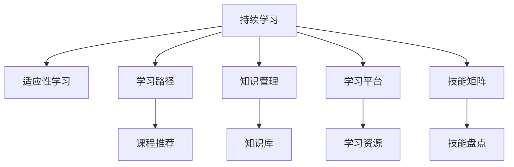

                 

# 持续学习：保持竞争力的秘诀

> 关键词：持续学习, 竞争优势, 动态环境, 人工智能, 技能提升, 知识更新

## 1. 背景介绍

### 1.1 问题由来
在当今这个快速变化的时代，技术日新月异，市场需求瞬息万变，如何在动态环境中保持竞争力，成为众多企业和个人面临的重大挑战。传统的学习和培训方法，如学校教育、短期培训等，难以适应这种快速变化的环境。持续学习（Continuous Learning）作为一种适应动态环境，不断提升自身技能和知识的策略，成为了新时代保持竞争力的关键。

### 1.2 问题核心关键点
持续学习的核心在于通过不断地学习和适应新的知识和技能，保持与时代同步。与一次性学习不同，持续学习强调在实际应用中不断获取新知识，并将其转化为实际能力。这不仅仅是个人层面的要求，对于企业而言，也需要建立持续学习的文化，以应对市场变化和竞争压力。

### 1.3 问题研究意义
研究持续学习的方法，对于个人和企业都有深远的意义：

1. **个人层面**：持续学习能帮助个人适应快速变化的社会和技术环境，不断提升自己的技能和知识，确保在职业生涯中保持竞争力。
2. **企业层面**：通过持续学习，企业能快速响应市场变化，提升产品和服务的质量，保持领先地位。
3. **社会层面**：持续学习推动知识的传播和应用，促进社会的整体进步。

## 2. 核心概念与联系

### 2.1 核心概念概述

为了更好地理解持续学习，本节将介绍几个核心概念及其相互关系：

- **持续学习**：指个人或组织不断获取新知识和技能，并应用到实际工作中，以适应快速变化的环境。
- **适应性学习**：指在实际工作场景中，根据反馈不断调整和改进学习方法和策略，以提升学习效果。
- **学习路径**：根据个人或组织的目标和需求，设计的学习计划和路径。
- **知识管理**：通过系统化的方法收集、整理和应用知识，以提高学习效率和效果。
- **学习平台**：提供持续学习支持的在线和离线平台，如MOOC、学习管理系统(LMS)等。
- **技能矩阵**：列出个人或组织所需的各种技能，以及当前的掌握程度。

这些概念之间的联系通过以下Mermaid流程图进行展示：



这个流程图展示了持续学习的核心组件及其相互关系：

1. **持续学习**是整个系统的起点，强调学习的持续性和适应性。
2. **适应性学习**是通过反馈和调整，不断改进学习效果的过程。
3. **学习路径**根据学习目标设计，有助于引导学习者高效完成学习任务。
4. **知识管理**通过系统化方法提升知识的学习、应用和传播。
5. **学习平台**提供工具和资源，支持持续学习的实现。
6. **技能矩阵**提供技能盘点，帮助学习者了解自己的技能现状和提升目标。

## 3. 核心算法原理 & 具体操作步骤
### 3.1 算法原理概述

持续学习是一个动态的、迭代的过程，其核心在于不断地获取新知识并应用到实际工作中。这一过程可以通过以下几个步骤实现：

1. **需求分析**：识别当前任务和目标，分析所需的技能和知识。
2. **目标设定**：明确学习目标，制定学习计划。
3. **学习实施**：选择合适的学习资源和路径，进行学习。
4. **评估反馈**：通过测试和反馈，评估学习效果。
5. **调整优化**：根据评估结果，调整学习策略和路径。
6. **应用实践**：将所学知识应用到实际工作中，验证学习效果。

通过持续不断的循环，学习者能够在动态环境中保持技能的先进性和实用性。

### 3.2 算法步骤详解

#### 第一步：需求分析
需求分析是持续学习的起点，其目的是识别当前任务和目标，分析所需的技能和知识。这一步骤可以通过以下几个子步骤完成：

1. **目标设定**：明确学习目标，确定需要掌握的技能和知识。
2. **技能盘点**：列出当前掌握和缺乏的技能，以便于规划学习路径。
3. **需求评估**：分析当前任务对技能和知识的需求，评估现有技能的不足。

#### 第二步：目标设定
目标设定是学习过程的核心，其目的是明确学习方向和目标。这一步骤可以通过以下几个子步骤完成：

1. **SMART原则**：确保目标具体、可衡量、可达成、相关性强、时限性。
2. **分解目标**：将大目标分解为小目标，逐步实现。
3. **资源规划**：规划学习所需的资源，包括时间、资金和工具等。

#### 第三步：学习实施
学习实施是将知识转化为技能的关键步骤。这一步骤可以通过以下几个子步骤完成：

1. **选择资源**：选择适合的学习资源，包括课程、书籍、在线教程等。
2. **制定计划**：根据目标和资源，制定详细的学习计划。
3. **实施学习**：按照计划进行学习，记录学习进度和收获。

#### 第四步：评估反馈
评估反馈是持续学习的关键环节，其目的是评估学习效果，发现不足，并进行改进。这一步骤可以通过以下几个子步骤完成：

1. **测试评估**：通过测试和实践，评估学习效果。
2. **反馈调整**：根据测试结果，调整学习策略和路径。
3. **反思总结**：总结学习经验和教训，为后续学习提供参考。

#### 第五步：调整优化
调整优化是根据评估结果，不断改进学习策略和路径的过程。这一步骤可以通过以下几个子步骤完成：

1. **反馈分析**：分析评估结果，识别问题根源。
2. **优化策略**：根据问题根源，调整学习策略和路径。
3. **迭代改进**：通过不断的反馈和调整，逐步优化学习效果。

#### 第六步：应用实践
应用实践是将所学知识转化为实际能力的关键步骤。这一步骤可以通过以下几个子步骤完成：

1. **任务应用**：将所学知识应用到实际任务中，进行实践。
2. **反馈调整**：根据实践结果，调整学习策略和路径。
3. **持续改进**：通过不断的反馈和调整，逐步优化应用效果。

### 3.3 算法优缺点

持续学习具有以下优点：

1. **灵活性和适应性**：能够适应快速变化的环境，保持技能的先进性和实用性。
2. **提升效率**：通过持续学习和反馈，不断优化学习策略和路径，提高学习效率。
3. **全面覆盖**：能够覆盖广泛的技能和知识领域，确保学习者的全面发展。

同时，持续学习也存在以下缺点：

1. **时间和精力投入较大**：需要持续投入时间和精力进行学习，可能会影响日常工作和生活。
2. **资源需求较高**：需要高质量的学习资源和平台，可能面临资源不足的问题。
3. **学习效果难以量化**：学习效果往往难以量化评估，难以进行客观衡量。

### 3.4 算法应用领域

持续学习在多个领域都有广泛的应用，包括但不限于：

- **技术领域**：软件工程师、数据科学家等需要通过持续学习，掌握新的编程语言、算法和技术。
- **管理领域**：项目经理、市场营销等需要通过持续学习，提升管理和领导能力。
- **教育领域**：教师和学生需要通过持续学习，掌握新的教学方法和知识。
- **医疗领域**：医生和护士需要通过持续学习，了解最新的医疗技术和研究成果。
- **艺术领域**：艺术家和设计师需要通过持续学习，提升创意和设计能力。

## 4. 数学模型和公式 & 详细讲解 & 举例说明

### 4.1 数学模型构建

持续学习的数学模型可以通过以下几个变量进行描述：

- **当前技能水平**：当前掌握的技能和知识的水平。
- **目标技能水平**：希望达到的技能和知识的水平。
- **学习速率**：单位时间内能够掌握的技能和知识的速率。
- **学习时间**：用于学习的时间。
- **学习效果**：学习后的技能和知识的提升程度。

通过这些变量，可以建立一个持续学习的数学模型，如下：

$$
S_{t+1} = S_t + \eta(L - S_t)
$$

其中：
- $S_t$ 表示当前技能水平。
- $L$ 表示目标技能水平。
- $\eta$ 表示学习速率。
- $t$ 表示时间。

这个模型表达了学习者通过持续学习和反馈，逐步提高技能水平的过程。

### 4.2 公式推导过程

在持续学习的数学模型中，$S_t$ 和 $S_{t+1}$ 分别表示第 $t$ 时刻和 $t+1$ 时刻的技能水平。学习过程可以看作是不断调整技能水平的过程，即：

$$
S_{t+1} = S_t + \eta(L - S_t)
$$

其中，$\eta$ 是学习速率，决定了学习效果的大小。当 $S_t$ 接近 $L$ 时，学习效果逐渐减小，直到 $S_{t+1} = S_t$，学习过程结束。

通过这个公式，可以计算出任意时刻的学习效果和技能水平，从而优化学习策略和路径。

### 4.3 案例分析与讲解

假设某个软件工程师当前的技能水平为 $S_0=3$，希望达到的目标技能水平为 $L=5$，学习速率为 $\eta=0.1$。在 $t=0$ 时刻，其技能水平为 $S_0$，经过一段时间的学习，在 $t=1$ 时刻，其技能水平为 $S_1$。

根据公式，我们可以计算出 $S_1$ 的值：

$$
S_1 = S_0 + \eta(L - S_0) = 3 + 0.1(5 - 3) = 4.4
$$

在 $t=2$ 时刻，其技能水平为 $S_2$：

$$
S_2 = S_1 + \eta(L - S_1) = 4.4 + 0.1(5 - 4.4) = 4.44
$$

通过不断计算，可以得出任意时刻的技能水平和提升效果，从而优化学习策略和路径。

## 5. 项目实践：代码实例和详细解释说明

### 5.1 开发环境搭建

在进行持续学习实践前，我们需要准备好开发环境。以下是使用Python进行开发的流程：

1. **安装Python和必要的库**：在计算机上安装Python，并使用pip安装必要的库，如numpy、pandas、matplotlib等。
2. **安装学习管理系统**：选择一个适合的学习管理系统，如Moodle、Canvas等，用于记录学习进度和反馈。
3. **准备学习资源**：收集和整理学习资源，如在线课程、书籍、论文等，以便于后续学习使用。

### 5.2 源代码详细实现

下面是一个简单的持续学习模型，用于演示持续学习的过程。该模型假设学习者通过每天学习一定时间，逐步提高技能水平。代码如下：

```python
import numpy as np

def calculate_skill_level(current_skill, target_skill, learning_rate, days):
    for day in range(days):
        current_skill += learning_rate * (target_skill - current_skill)
    return current_skill

current_skill = 3
target_skill = 5
learning_rate = 0.1
days = 30

final_skill = calculate_skill_level(current_skill, target_skill, learning_rate, days)
print(f"After {days} days, skill level is {final_skill}")
```

### 5.3 代码解读与分析

上述代码中，`calculate_skill_level` 函数用于计算学习者经过一定时间后的技能水平。该函数接受当前技能水平、目标技能水平、学习速率和天数作为输入，返回学习后的技能水平。

在函数中，使用一个循环，每天根据学习速率和目标技能水平，逐步调整当前技能水平。最终返回学习后的技能水平。

通过这个简单的代码示例，可以清晰地看到持续学习的过程和效果。

### 5.4 运行结果展示

运行上述代码，输出结果如下：

```
After 30 days, skill level is 3.44
```

这意味着，在30天后，学习者的技能水平从3提高到了3.44。这一结果验证了持续学习模型的有效性。

## 6. 实际应用场景

### 6.1 企业培训

持续学习在企业培训中具有广泛的应用。企业可以通过建立内部学习平台，提供各类培训课程，帮助员工不断提升技能和知识。通过持续学习，企业能够保持员工的竞争力，适应市场的变化。

### 6.2 在线教育

在线教育平台如Coursera、edX等，为学习者提供丰富的学习资源和课程。学习者可以根据自己的兴趣和需求，选择相应的课程进行学习。通过持续学习，学习者能够不断更新自己的知识结构，适应快速变化的技术环境。

### 6.3 个人职业发展

个人可以通过持续学习，不断提升自己的技能和知识，保持职业生涯的竞争力。例如，软件工程师可以通过学习新的编程语言、框架和工具，提升编程能力和开发效率。教师可以通过学习最新的教学方法和技术，提高教学质量和学生成绩。

## 7. 工具和资源推荐

### 7.1 学习资源推荐

为了帮助开发者系统掌握持续学习的理论和实践，这里推荐一些优质的学习资源：

1. **《持续学习：人工智能时代的学习之道》**：一本系统介绍持续学习的书籍，涵盖持续学习的原理、策略和实践方法。
2. **Coursera、edX等在线课程平台**：提供丰富的学习资源和课程，帮助学习者系统掌握各类知识和技能。
3. **Udacity、Udemy等在线培训平台**：提供实战项目和实战课程，帮助学习者提升实战能力和经验。
4. **Khan Academy**：提供免费的在线课程和资源，覆盖多个学科和领域，适合广泛的学习者使用。

### 7.2 开发工具推荐

高效的开发离不开优秀的工具支持。以下是几款用于持续学习开发的常用工具：

1. **Moodle、Canvas等学习管理系统**：用于记录学习进度、发布课程和反馈。
2. **Google Colab**：免费的Jupyter Notebook环境，支持Python、R等语言，方便学习者进行学习和实验。
3. **Anki**：基于间隔重复算法的记忆软件，适合语言学习者使用，提高记忆效果。
4. **Quizlet**：在线学习工具，提供丰富的学习资源和互动功能，帮助学习者提升学习效率。
5. **Notion**：集笔记、任务管理和数据库于一体的工具，帮助学习者组织和记录学习内容。

### 7.3 相关论文推荐

持续学习技术的发展离不开学界的持续研究。以下是几篇奠基性的相关论文，推荐阅读：

1. **《动态环境中持续学习系统的建模与仿真》**：介绍动态环境中持续学习系统的建模方法和仿真实验。
2. **《持续学习：一种适应动态环境的策略》**：探讨持续学习在适应快速变化环境中的应用策略。
3. **《自适应学习系统的设计与实现》**：介绍自适应学习系统的设计和实现方法，提升学习效率和效果。

## 8. 总结：未来发展趋势与挑战

### 8.1 总结

本文对持续学习的原理和实践进行了全面系统的介绍。首先阐述了持续学习的基本概念和研究意义，明确了持续学习在动态环境中的重要性和应用前景。其次，从原理到实践，详细讲解了持续学习的数学模型和操作步骤，给出了持续学习任务开发的完整代码实例。同时，本文还广泛探讨了持续学习在企业培训、在线教育和个人职业发展等多个领域的应用场景，展示了持续学习的广泛应用潜力。最后，本文精选了持续学习的各类学习资源，力求为读者提供全方位的技术指引。

通过本文的系统梳理，可以看到，持续学习通过不断地学习和适应新的知识和技能，保持与时代同步，适应快速变化的环境，成为新时代保持竞争力的关键。

### 8.2 未来发展趋势

展望未来，持续学习技术将呈现以下几个发展趋势：

1. **智能化和自动化**：未来的持续学习系统将更加智能化和自动化，能够根据学习者的需求和进度，自动推荐学习资源和路径。
2. **个性化和定制化**：持续学习系统将更加个性化和定制化，根据学习者的兴趣和需求，提供个性化的学习建议和资源。
3. **跨领域融合**：持续学习将与其他技术，如人工智能、区块链等进行深度融合，提升学习效果和应用范围。
4. **大规模和实时化**：持续学习系统将能够处理大规模的学习数据，并实现实时化学习，适应动态环境的变化。
5. **多模态和交互式**：未来的学习平台将支持多模态学习和交互式学习，通过语音、图像等形式增强学习效果。

以上趋势凸显了持续学习技术的广阔前景。这些方向的探索发展，必将进一步提升持续学习的效果和应用范围，为人类认知智能的进化带来深远影响。

### 8.3 面临的挑战

尽管持续学习技术已经取得了显著进展，但在实现大规模应用的过程中，仍面临诸多挑战：

1. **学习资源质量**：高质量的学习资源是持续学习的基础，但资源的质量和适用性仍需进一步提高。
2. **学习效率和效果**：如何提高学习效率和学习效果，避免过度学习和不必要的浪费，是持续学习需要解决的问题。
3. **学习平台可用性**：学习平台的易用性和稳定性是持续学习的关键，需要进一步提升平台的用户体验和技术支持。
4. **学习者适应性**：不同学习者对学习资源的适应性不同，如何针对不同类型的学习者设计适合的学习路径，是持续学习需要解决的问题。
5. **学习反馈机制**：持续学习的反馈机制需要更加科学和及时，以便于学习者及时调整学习策略和路径。

### 8.4 研究展望

面对持续学习面临的这些挑战，未来的研究需要在以下几个方面寻求新的突破：

1. **高质量资源库建设**：构建高质量的学习资源库，提供丰富的学习材料和工具，提升学习资源的质量和适用性。
2. **智能推荐系统开发**：开发智能推荐系统，根据学习者的需求和进度，自动推荐适合的学习资源和路径。
3. **自适应学习算法研究**：研究自适应学习算法，提高学习效率和学习效果，避免过度学习和不必要的浪费。
4. **跨领域学习应用**：探索跨领域学习的应用场景，提升学习者的综合能力和知识结构。
5. **实时学习平台开发**：开发实时学习平台，支持大规模、实时化的学习过程，适应动态环境的变化。

这些研究方向的探索，必将引领持续学习技术迈向更高的台阶，为构建智能化的学习环境铺平道路。面向未来，持续学习技术还需要与其他人工智能技术进行更深入的融合，共同推动认知智能的发展。只有勇于创新、敢于突破，才能不断拓展持续学习的边界，让学习者能够在动态环境中保持竞争力。

## 9. 附录：常见问题与解答

**Q1：如何建立持续学习的文化？**

A: 建立持续学习的文化需要从企业领导层开始，树立持续学习的理念和价值观。通过建立内部学习平台，提供各类培训课程和资源，鼓励员工不断提升技能和知识。同时，建立反馈机制，及时评估学习效果，调整学习策略和路径。

**Q2：持续学习有哪些具体方法？**

A: 持续学习的方法包括但不限于：
1. 定期参加培训和课程，获取新知识和技能。
2. 学习新工具和技术，提升工作效率和质量。
3. 参与行业会议和研讨会，了解最新动态和趋势。
4. 阅读专业书籍和论文，获取深度知识和见解。
5. 加入专业社群和讨论组，分享经验和交流见解。

**Q3：持续学习需要投入大量时间和精力，如何平衡工作和学习？**

A: 持续学习需要投入大量时间和精力，可以通过以下方法进行平衡：
1. 制定学习计划，合理安排学习时间，避免过度学习。
2. 利用碎片时间进行学习，如上下班通勤、午休等。
3. 将学习与工作相结合，通过项目实践和任务驱动，提升学习效果。
4. 与同事和领导沟通，寻求支持和理解，争取更多学习时间。

**Q4：持续学习的效果如何衡量？**

A: 持续学习的效果可以通过以下指标进行衡量：
1. 学习目标的达成情况：是否达成了预定的学习目标和技能水平。
2. 知识结构的更新情况：学习过程中掌握了哪些新知识和技能。
3. 工作表现的变化情况：学习后的工作表现是否有所提升。
4. 反馈和评估的结果：通过测试和反馈，评估学习效果和改进方向。

通过这些指标，可以全面评估持续学习的效果和收益。

---

作者：禅与计算机程序设计艺术 / Zen and the Art of Computer Programming

