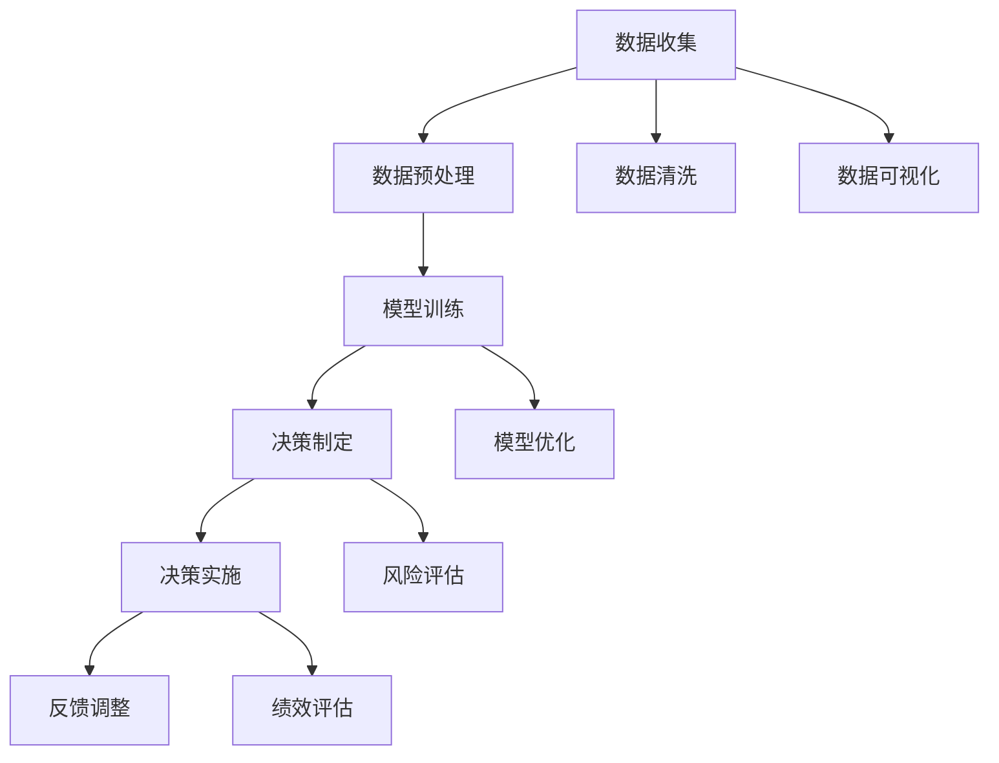

                 

# 掌握多元模型思维助力管理者洞见

> 关键词：多元模型思维, 数据驱动决策, 优化算法, 复杂系统, 管理决策, 企业运营

## 1. 背景介绍

在当今复杂多变、竞争激烈的商业环境中，企业的管理者需要做出快速、精确的决策来应对挑战。随着信息技术和大数据分析的不断进步，管理者拥有了更多数据和工具来辅助决策。然而，面对海量数据和多样化的决策情境，如何有效利用多元模型思维，从数据中提取洞见，做出最优决策，成为了管理者面临的重大挑战。本文旨在帮助管理者掌握多元模型思维，通过合理应用多维模型和算法，提升决策质量和效率，实现企业和组织的成功运营。

## 2. 核心概念与联系

### 2.1 核心概念概述

为了更好地理解多元模型思维及其在企业管理中的应用，我们先介绍几个关键概念：

- **多元模型思维**：指在决策过程中，结合多种不同模型和方法，综合利用数据，提升决策准确性和适应性。
- **数据驱动决策**：基于数据收集、处理和分析，指导决策过程，减少主观偏见和错误。
- **优化算法**：用于优化模型参数和决策路径的算法，如梯度下降、遗传算法、模拟退火等。
- **复杂系统**：包含多个相互依赖和作用的元素，具有高度复杂性和动态性的系统，如供应链、组织结构等。
- **管理决策**：涉及战略规划、资源配置、绩效评估等企业运营管理的核心活动。
- **企业运营**：企业为了实现其战略目标，组织和协调各项活动的全过程，包括研发、生产、营销、财务等环节。

这些概念之间通过数据收集、模型训练、决策实施和反馈调整的流程紧密相连，构成了企业管理决策的全链条。以下是一个简化的Mermaid流程图，展示了这些概念间的联系：



通过这个流程图，我们可以清晰地看到数据从收集到转化为决策的全过程，以及各种模型和技术在这个过程中的应用。

## 3. 核心算法原理 & 具体操作步骤

### 3.1 算法原理概述

多元模型思维的核心在于将不同的模型和方法结合使用，以提升决策的质量和适应性。以下是几种常见的多元模型思维算法原理：

- **模型组合**：将多个单一模型的预测结果进行组合，如加权平均、投票等，以提升整体预测准确性。
- **数据融合**：将不同来源和格式的数据融合在一起，形成一个更全面、更一致的数据集，供模型训练和决策使用。
- **多目标优化**：在决策时考虑多个目标和约束条件，通过多目标优化算法找到最优解，如遗传算法、粒子群算法等。
- **模型选择**：根据决策任务的特点，选择合适的模型进行训练和应用，如回归模型、分类模型、聚类模型等。
- **增量学习**：随着新数据的到来，不断更新和调整模型，以适应新的决策情境。

### 3.2 算法步骤详解

以下是一个多元模型思维的具体操作步骤：

1. **数据收集与预处理**：
   - 收集企业内部的运营数据、市场数据、客户反馈等，确保数据的完整性和可靠性。
   - 进行数据清洗、去重、填充缺失值等预处理工作，确保数据质量。

2. **模型选择与训练**：
   - 根据决策任务的特点，选择合适的模型，如回归模型、分类模型、聚类模型等。
   - 在准备好的数据集上训练模型，调整超参数以获得最优性能。

3. **模型组合与融合**：
   - 将不同模型的预测结果进行组合，如加权平均、投票等。
   - 对不同来源和格式的数据进行融合，形成更全面、更一致的数据集。

4. **决策制定与实施**：
   - 综合考虑模型预测结果和业务情境，制定决策方案。
   - 实施决策方案，并监测其效果，收集反馈数据。

5. **反馈调整与优化**：
   - 根据决策实施结果和反馈数据，调整模型参数和决策方案。
   - 进行多目标优化，平衡不同目标之间的冲突。

### 3.3 算法优缺点

多元模型思维结合了多种模型的优势，具有以下优点：

- **降低单一模型风险**：通过结合多种模型，降低单一模型的不确定性和偏差。
- **提高预测准确性**：多种模型的组合和融合，可以提升整体预测的准确性和鲁棒性。
- **适应性更强**：不同模型的结合可以适应不同的决策情境，提高决策的适应性和灵活性。
- **优化决策效率**：通过多目标优化算法，可以高效地找到最优决策方案。

同时，多元模型思维也存在一些缺点：

- **复杂度高**：结合多种模型和技术，增加了决策过程的复杂度。
- **计算资源消耗大**：不同模型的训练和组合需要大量的计算资源和时间。
- **结果解释困难**：多种模型和算法的结合，可能使得决策结果难以解释和理解。

### 3.4 算法应用领域

多元模型思维在企业管理中的应用广泛，以下是几个典型领域：

1. **风险管理**：通过结合风险评估模型和金融预测模型，优化风险控制策略，保护企业财务安全。
2. **市场营销**：结合市场调查数据和消费者行为模型，制定精准的市场营销策略，提升客户满意度。
3. **供应链管理**：结合供应链网络模型和需求预测模型，优化库存管理，降低供应链成本。
4. **人力资源管理**：结合员工绩效评估模型和人才匹配模型，制定科学的人力资源管理策略，提升组织效率。
5. **产品开发**：结合市场调研数据和产品设计模型，优化产品开发流程，提升产品竞争力和用户体验。

以上领域中，多元模型思维的应用有助于企业更好地理解市场动态，优化资源配置，提升运营效率和竞争力。

## 4. 数学模型和公式 & 详细讲解 & 举例说明

### 4.1 数学模型构建

多元模型思维涉及多种数学模型和技术，以下是一些常见的模型构建方法：

- **回归模型**：用于预测连续型变量，如销售预测、客户满意度预测等。
- **分类模型**：用于分类问题，如客户流失预测、产品分类等。
- **聚类模型**：用于发现数据中的模式和分组，如市场细分、客户分群等。
- **多目标优化模型**：用于在多个目标之间进行权衡，如成本-质量-时间优化等。

### 4.2 公式推导过程

以回归模型为例，假设我们有$n$个数据点$(x_i, y_i)$，其中$x_i$为自变量，$y_i$为因变量，目标是用线性回归模型$\hat{y} = \theta_0 + \theta_1 x_1 + \cdots + \theta_k x_k$进行预测。根据最小二乘法，目标函数为：

$$
\min_{\theta_0,\theta_1,\cdots,\theta_k} \sum_{i=1}^n (y_i - (\theta_0 + \theta_1 x_1 + \cdots + \theta_k x_k))^2
$$

解此问题，可以得到回归系数的估计值$\hat{\theta}$：

$$
\hat{\theta} = (X^TX)^{-1}X^Ty
$$

其中$X=[x_1^T,\cdots,x_n^T]^T$，$y=[y_1,\cdots,y_n]^T$。

### 4.3 案例分析与讲解

假设某电商平台希望预测未来一个月内商品的销售量，数据集包含历史销售记录、广告投入、促销活动等信息。我们可以通过回归模型进行预测，并结合其他市场预测模型，如时间序列模型和季节性模型，综合预测结果，提升销售预测的准确性。

## 5. 项目实践：代码实例和详细解释说明

### 5.1 开发环境搭建

为了进行多元模型思维的实践，我们需要准备好开发环境。以下是Python开发环境搭建的步骤：

1. 安装Python：从官网下载并安装Python 3.8。
2. 创建虚拟环境：
   ```bash
   python -m venv env
   source env/bin/activate
   ```
3. 安装相关库：
   ```bash
   pip install pandas numpy scikit-learn matplotlib seaborn scikit-optimize
   ```

### 5.2 源代码详细实现

以下是一个基于多元模型思维的销售预测项目代码实现：

```python
import pandas as pd
import numpy as np
from sklearn.linear_model import LinearRegression
from sklearn.metrics import mean_squared_error
from sklearn.ensemble import RandomForestRegressor
from sklearn.pipeline import Pipeline
from sklearn.model_selection import train_test_split

# 加载数据
data = pd.read_csv('sales_data.csv')

# 数据预处理
X = data[['广告投入', '促销活动', '季节性因素']] # 自变量
y = data['sales'] # 因变量

# 模型训练与组合
regressor1 = LinearRegression()
regressor2 = RandomForestRegressor()

# 模型组合
pipeline1 = Pipeline(steps=[('regressor1', regressor1), ('regressor2', regressor2)])
pipeline1.fit(X, y)

# 模型预测
X_test = pd.read_csv('sales_test_data.csv')
y_pred = pipeline1.predict(X_test)

# 模型评估
mse = mean_squared_error(y_test, y_pred)
print('Mean Squared Error:', mse)
```

### 5.3 代码解读与分析

让我们详细解读一下关键代码的实现细节：

**数据加载与预处理**：
- 使用pandas加载历史销售数据，进行数据清洗和预处理，保留与预测相关的自变量和因变量。

**模型训练与组合**：
- 使用线性回归和随机森林回归器作为基模型，构建一个集成模型pipeline。
- 使用pipeline对模型进行训练，得到综合预测结果。

**模型预测与评估**：
- 加载测试数据集，使用训练好的模型进行预测。
- 计算模型预测的均方误差，评估模型性能。

## 6. 实际应用场景

### 6.4 未来应用展望

多元模型思维在企业管理中的应用前景广阔，未来将进一步发展。以下是一些未来应用展望：

1. **智能决策系统**：结合多种模型和算法，构建智能决策系统，自动生成决策方案和推荐。
2. **实时数据处理**：利用流数据处理技术，实现实时数据采集和分析，提升决策的及时性和灵活性。
3. **跨领域融合**：将多元模型思维应用于跨领域问题，如能源管理、环境保护等，实现多目标优化。
4. **人工智能辅助决策**：结合人工智能技术和多元模型思维，实现更精准、高效的决策支持。
5. **自动化流程优化**：将多元模型思维应用于业务流程自动化，提升运营效率和成本控制。

多元模型思维将为企业提供更强大的决策支持，帮助管理者在复杂多变的商业环境中做出更优的决策。

## 7. 工具和资源推荐

### 7.1 学习资源推荐

为了帮助管理者掌握多元模型思维，以下是一些优质的学习资源：

1. **《数据分析实战》**：介绍了多种数据分析和模型构建方法，适合初学者入门。
2. **《Python数据科学手册》**：涵盖了Python数据科学库的详细使用，包括Pandas、NumPy、SciKit-Learn等。
3. **《机器学习实战》**：提供了丰富的案例和实战经验，适合动手实践。
4. **Coursera《Data Science》课程**：由斯坦福大学教授讲授，系统介绍了数据科学的基本概念和实践方法。
5. **Kaggle竞赛平台**：提供了大量的数据集和竞赛任务，适合实战练习和经验积累。

通过这些资源的学习实践，相信管理者可以更好地掌握多元模型思维，并将其应用于实际决策中。

### 7.2 开发工具推荐

高效的开发离不开优秀的工具支持。以下是几款用于多元模型思维开发的常用工具：

1. **Jupyter Notebook**：提供交互式编程环境，适合数据探索和模型训练。
2. **Python IDE**：如PyCharm、Visual Studio Code等，提供代码编写和调试功能。
3. **数据可视化工具**：如Matplotlib、Seaborn等，方便数据可视化分析。
4. **机器学习库**：如Scikit-Learn、TensorFlow等，提供丰富的模型训练和优化算法。
5. **版本控制工具**：如Git等，便于团队协作和代码管理。

合理利用这些工具，可以显著提升多元模型思维的开发效率，加速创新迭代。

### 7.3 相关论文推荐

多元模型思维的研究源于学界的持续探索。以下是几篇奠基性的相关论文，推荐阅读：

1. **《多元模型融合在预测模型中的研究与应用》**：讨论了多元模型融合的理论基础和应用案例。
2. **《基于多目标优化的供应链管理研究》**：利用多目标优化算法优化供应链管理。
3. **《数据驱动决策：理论与实践》**：系统介绍了数据驱动决策的基本概念和实践方法。
4. **《机器学习与优化算法》**：详细介绍了机器学习的基本算法和优化方法。
5. **《复杂系统建模与分析》**：介绍了复杂系统的建模方法和分析技术。

这些论文代表了大数据和人工智能技术在企业管理中的应用方向，有助于管理者深入理解多元模型思维的原理和方法。

## 8. 总结：未来发展趋势与挑战

### 8.1 总结

本文对多元模型思维进行了全面系统的介绍。首先阐述了多元模型思维在企业管理中的重要性和应用场景，明确了数据驱动决策的优势和挑战。其次，从原理到实践，详细讲解了多元模型思维的数学模型和操作步骤，给出了具体代码实现。同时，本文还探讨了多元模型思维在多个行业领域的应用前景，展示了其广阔的应用空间。最后，推荐了相关的学习资源和开发工具，为管理者提供了全面的技术支持。

通过本文的系统梳理，可以看到，多元模型思维为企业管理提供了强大的决策支持，能够帮助管理者从数据中提取洞见，做出更优的决策。未来的研究需要在算法优化、数据融合、模型选择等方面进行深入探索，进一步提升决策的质量和效率。

### 8.2 未来发展趋势

展望未来，多元模型思维将呈现以下几个发展趋势：

1. **智能化决策系统**：随着人工智能技术的不断发展，未来将出现更多智能化的决策系统，能够自动生成和优化决策方案。
2. **实时数据分析**：利用流数据处理技术，实现实时数据采集和分析，提升决策的及时性和灵活性。
3. **跨领域应用**：多元模型思维将应用于更多跨领域问题，如能源管理、环境保护等，实现多目标优化。
4. **自动化流程优化**：利用机器学习和优化算法，实现业务流程的自动化和优化，提升运营效率和成本控制。
5. **数据安全和隐私保护**：在数据驱动决策过程中，数据安全和隐私保护将变得更加重要，需采用先进的加密和匿名化技术。

以上趋势凸显了多元模型思维的广阔前景，推动其在各个领域的应用和发展。

### 8.3 面临的挑战

尽管多元模型思维已经取得了一定的进展，但在实际应用过程中仍面临诸多挑战：

1. **数据质量和完整性**：数据采集和处理过程中可能存在噪音和缺失，影响模型的训练和预测结果。
2. **模型复杂度**：结合多种模型和技术，增加了决策过程的复杂度，需要更高效、更灵活的优化算法。
3. **结果解释和透明度**：多元模型思维的决策过程较为复杂，结果解释和透明度仍有待提高。
4. **计算资源消耗**：结合多种模型和技术，需要大量的计算资源和时间，对计算能力提出了更高的要求。
5. **伦理和法律问题**：在数据驱动决策过程中，数据隐私和伦理问题需引起重视。

这些挑战需要管理者在实际应用中不断探索和解决，才能更好地发挥多元模型思维的潜力。

### 8.4 研究展望

多元模型思维的未来研究需要在以下几个方面寻求新的突破：

1. **数据预处理和清洗**：研究更高效、更自动化的数据预处理和清洗方法，提升数据质量。
2. **模型优化和选择**：开发更加高效、更加智能的优化算法，选择合适的模型进行组合和融合。
3. **结果解释和透明度**：提高模型的结果解释能力和透明度，增强决策的可信度和可解释性。
4. **跨领域应用**：探索更多跨领域应用场景，如能源管理、环境保护等，实现多目标优化。
5. **计算资源优化**：研究更高效的数据处理和模型训练技术，提升决策的效率和性能。
6. **伦理和法律问题**：制定伦理和法律规范，确保数据安全和隐私保护。

这些研究方向将进一步推动多元模型思维的发展，为企业管理决策提供更强大的技术支持。

## 9. 附录：常见问题与解答

**Q1：多元模型思维是否适用于所有管理决策情境？**

A: 多元模型思维在大多数管理决策情境下都能取得不错的效果，特别是在数据量较大的场景。但对于一些特定情境，如高度非结构化或极端不确定的决策，可能需要结合其他决策方法，如专家判断和直觉。

**Q2：如何选择合适的多元模型组合方式？**

A: 选择合适的多元模型组合方式需要考虑多个因素，包括数据特点、决策目标、计算资源等。一般而言，可以采用加权平均、投票、集成学习等方式进行组合，具体选择需根据实际情况进行评估和优化。

**Q3：多元模型思维在实际应用中需要注意哪些问题？**

A: 多元模型思维在实际应用中需要注意以下几点：
1. 数据质量和完整性：保证数据采集和处理过程中的数据质量和完整性。
2. 计算资源消耗：结合多种模型和技术，需要大量的计算资源和时间，需考虑计算能力。
3. 结果解释和透明度：提高模型的结果解释能力和透明度，增强决策的可信度和可解释性。
4. 伦理和法律问题：在数据驱动决策过程中，需关注数据隐私和伦理问题。

**Q4：如何提高多元模型思维的效率？**

A: 提高多元模型思维的效率可以从以下几个方面入手：
1. 优化数据预处理和清洗方法，提升数据质量。
2. 选择合适的模型和算法，避免过度复杂。
3. 采用高效的计算资源和算法，提升计算效率。
4. 采用自动化和智能化的决策系统，提升决策速度和灵活性。

**Q5：多元模型思维在企业运营中的应用前景如何？**

A: 多元模型思维在企业运营中的应用前景广阔，可以提升企业在数据驱动决策、智能决策系统、实时数据分析、自动化流程优化等方面的能力，帮助企业在复杂多变的商业环境中做出更优的决策。

---

作者：禅与计算机程序设计艺术 / Zen and the Art of Computer Programming

