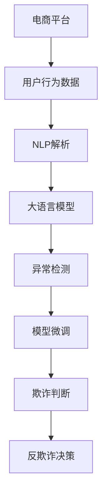

                 

# 探索AI大模型在电商平台反欺诈中的潜力

> 关键词：反欺诈, 大语言模型, AI安全, 电商平台, 自然语言处理(NLP), 异常检测, 数据增强, 模型微调

## 1. 背景介绍

随着互联网电商的蓬勃发展，交易规模不断扩大，与之伴随而来的欺诈风险也日益严峻。电商平台上常见的欺诈行为包括假冒交易、恶意评价、盗刷等，给平台方和消费者带来了巨大的损失。因此，电商平台亟需构建高效的反欺诈系统，保障交易安全。近年来，人工智能(AI)技术，特别是大语言模型在自然语言处理(NLP)领域的突破，为反欺诈带来了新的思路和技术手段。本文将深入探讨AI大模型在电商平台反欺诈中的潜力，并给出实用的实现策略。

## 2. 核心概念与联系

### 2.1 核心概念概述

反欺诈系统旨在通过算法和模型对交易行为进行自动化审核和识别，以防止欺诈行为发生。核心概念包括：

- **电商平台**：在线销售商品或服务的平台，通常包括商品展示、购买、支付、物流等环节。
- **反欺诈**：通过技术手段识别和阻止欺诈行为，保护消费者和平台的利益。
- **自然语言处理(NLP)**：利用计算机处理和理解人类语言，包括文本分类、情感分析、意图识别等。
- **大语言模型**：以Transformer为代表的预训练语言模型，通过大规模数据训练得到的通用语言知识。
- **异常检测**：通过统计分析或机器学习技术，检测交易行为中的异常情况。
- **数据增强**：通过扩充训练数据，增强模型的泛化能力。
- **模型微调**：在预训练模型的基础上，针对特定任务进行有监督的参数更新，以提高模型性能。

这些概念相互关联，共同构成了电商平台反欺诈系统的基础框架。大语言模型通过NLP技术，能够理解用户行为，提取特征，与异常检测和模型微调技术结合，形成完整的反欺诈解决方案。

### 2.2 核心概念原理和架构的 Mermaid 流程图



这个流程图展示了电商平台反欺诈系统的主要流程：

1. **用户行为数据**：电商平台记录用户的各项交易行为数据，包括但不限于购买时间、商品种类、支付方式、评价等。
2. **NLP解析**：利用NLP技术对用户行为数据进行文本处理，提取关键特征，如用户评价的情感倾向、交易金额的变化趋势等。
3. **大语言模型**：通过预训练的大语言模型，如BERT、GPT等，理解用户行为数据中的语言信息，提取深层次的语义特征。
4. **异常检测**：结合大语言模型的输出，应用异常检测算法，如统计分析、机器学习等，识别出异常的交易行为。
5. **模型微调**：对异常检测模型进行微调，以提高其对特定类型欺诈行为的识别准确率。
6. **欺诈判断**：根据异常检测结果，结合电商平台的历史交易数据和规则，进行欺诈行为的判断。
7. **反欺诈决策**：根据欺诈判断结果，采取相应的措施，如拦截交易、联系用户、报警等。

## 3. 核心算法原理 & 具体操作步骤

### 3.1 算法原理概述

AI大模型在电商平台反欺诈中的应用，主要基于NLP技术和异常检测算法的结合。其核心算法原理如下：

- **NLP解析**：利用大语言模型对用户行为数据进行文本处理，提取关键特征。如通过情感分析，识别评价中的恶意评论；通过意图识别，判断用户是否有恶意操作意图。
- **异常检测**：通过统计分析或机器学习算法，检测交易行为中的异常情况。如统计评价数量、金额波动等，判断是否为正常交易。
- **模型微调**：在异常检测模型的基础上，针对特定类型的欺诈行为进行有监督的微调，提升模型的识别能力。

这些算法共同构成了电商平台反欺诈系统的技术基础，实现了对用户行为的深度理解和欺诈行为的自动检测和防范。

### 3.2 算法步骤详解

以下是基于AI大模型的电商平台反欺诈系统的具体实现步骤：

**Step 1: 数据收集与预处理**
- 收集电商平台的用户交易数据，包括订单信息、评价、支付记录等。
- 对数据进行清洗，去除噪声和重复数据，标准化数据格式。

**Step 2: NLP解析**
- 对交易数据中的文本信息进行分词、去除停用词、提取关键词等预处理操作。
- 利用预训练的大语言模型（如BERT、GPT等），对文本数据进行语义理解，提取特征。

**Step 3: 异常检测**
- 应用统计分析方法（如均值、方差、概率分布等），对交易数据进行初步的异常检测。
- 结合机器学习算法（如支持向量机、随机森林等），训练异常检测模型，对异常行为进行识别。

**Step 4: 模型微调**
- 根据特定的欺诈类型（如假冒交易、恶意评价等），收集标注数据，用于训练异常检测模型的微调。
- 使用小规模标注数据，利用大语言模型提取的特征，对异常检测模型进行微调。

**Step 5: 欺诈判断与决策**
- 根据异常检测模型的输出，结合电商平台的历史交易数据和规则，进行欺诈行为的判断。
- 对于判断为欺诈的交易，采取相应的措施，如拦截、通知、报警等。

### 3.3 算法优缺点

使用AI大模型进行电商平台反欺诈，具有以下优点：

- **处理复杂文本数据能力强**：大语言模型能够处理复杂的自然语言文本，提取深层次的语义特征。
- **泛化能力强**：通过微调，模型能够适应不同类型和规模的欺诈行为。
- **实时性强**：基于AI的自动化系统能够实时处理交易数据，快速做出判断。

同时，也存在以下缺点：

- **数据依赖性高**：异常检测模型的性能依赖于标注数据的质量和数量，标注成本较高。
- **模型复杂度高**：大模型需要大量的计算资源进行训练和推理，硬件要求较高。
- **黑盒特性**：模型的内部决策过程难以解释，存在一定的不可解释性。

### 3.4 算法应用领域

基于大语言模型的电商平台反欺诈技术，在以下领域中具有广泛的应用潜力：

- **假冒交易检测**：利用用户评论和评分数据，检测假冒商品和交易。
- **恶意评价检测**：分析用户评论内容，识别恶意或虚假评论。
- **盗刷检测**：监测交易记录，检测异常的支付行为，如异地支付、大额支付等。
- **物流异常检测**：分析物流信息，检测异常的物流记录，如频繁退换货、同一地址大量发货等。
- **账户安全检测**：监测用户账户行为，检测异常的登录、支付、修改密码等行为。

## 4. 数学模型和公式 & 详细讲解 & 举例说明

### 4.1 数学模型构建

电商平台反欺诈系统通常使用以下数学模型进行构建：

- **文本表示模型**：如Word2Vec、BERT等，将文本转换为向量表示，方便模型进行计算。
- **异常检测模型**：如支持向量机(SVM)、随机森林(Random Forest)、孤立森林(Isolation Forest)等，用于检测异常行为。
- **微调模型**：如Fine-Tuning BERT等，在特定任务上进行有监督的参数更新。

以**二元分类模型**为例，其数学模型如下：

$$
\hat{y} = f(\mathbf{x}; \theta)
$$

其中，$\mathbf{x}$ 为输入向量，$\theta$ 为模型参数，$f$ 为模型函数。二元分类模型通常使用sigmoid函数进行输出：

$$
f(\mathbf{x}; \theta) = \sigma(\mathbf{W}\mathbf{x} + b)
$$

其中，$\mathbf{W}$ 和 $b$ 为模型的权重和偏置项，$\sigma$ 为sigmoid函数。

### 4.2 公式推导过程

以**异常检测模型**为例，推导随机森林异常检测的公式：

$$
\text{Probability}(y = 1|\mathbf{x}) = \frac{1}{1 + e^{-\sum_{i=1}^n \log(\frac{p_i}{1-p_i})}}
$$

其中，$n$ 为树的数量，$p_i$ 为第$i$ 棵树的预测概率。

利用随机森林进行异常检测时，可以通过构建多棵决策树，计算样本在每棵树上的预测概率，再通过softmax函数将其转换为预测概率，最终判断是否为异常行为。

### 4.3 案例分析与讲解

以**假冒交易检测**为例，利用大语言模型提取特征，训练异常检测模型，检测假冒交易。具体步骤如下：

**Step 1: 数据准备**
- 收集电商平台的历史交易数据，包括订单信息、评价、支付记录等。
- 对数据进行清洗和预处理，去除噪声和重复数据，标准化数据格式。

**Step 2: NLP解析**
- 对交易数据中的文本信息进行分词、去除停用词、提取关键词等预处理操作。
- 利用预训练的BERT模型，对文本数据进行语义理解，提取特征向量。

**Step 3: 异常检测**
- 构建随机森林异常检测模型，使用训练集进行训练。
- 在测试集上评估模型的性能，计算准确率、召回率、F1-score等指标。

**Step 4: 模型微调**
- 收集标注数据，如假冒交易的订单号、评价、支付记录等。
- 利用大语言模型提取的特征，对异常检测模型进行微调。
- 在微调后的模型上，重新评估假冒交易的检测性能。

**Step 5: 欺诈判断与决策**
- 根据异常检测模型的输出，结合电商平台的历史交易数据和规则，进行欺诈行为的判断。
- 对于判断为假冒交易，采取相应的措施，如拦截交易、联系用户、报警等。

## 5. 项目实践：代码实例和详细解释说明

### 5.1 开发环境搭建

在进行电商平台反欺诈项目开发前，我们需要准备好开发环境。以下是使用Python进行PyTorch开发的环境配置流程：

1. 安装Anaconda：从官网下载并安装Anaconda，用于创建独立的Python环境。
2. 创建并激活虚拟环境：
```bash
conda create -n pytorch-env python=3.8 
conda activate pytorch-env
```
3. 安装PyTorch：根据CUDA版本，从官网获取对应的安装命令。例如：
```bash
conda install pytorch torchvision torchaudio cudatoolkit=11.1 -c pytorch -c conda-forge
```
4. 安装TensorFlow：
```bash
conda install tensorflow==2.4
```
5. 安装TensorFlow HUB和Hyperopt：
```bash
conda install tensorflow-hub 
conda install hyperopt
```
6. 安装各类工具包：
```bash
pip install numpy pandas scikit-learn matplotlib tqdm jupyter notebook ipython
```

完成上述步骤后，即可在`pytorch-env`环境中开始反欺诈系统的开发实践。

### 5.2 源代码详细实现

这里我们以电商平台假冒交易检测为例，给出使用PyTorch和TensorFlow进行代码实现的完整流程。

首先，定义数据处理函数：

```python
import pandas as pd
import numpy as np
from transformers import BertTokenizer, BertModel

# 加载模型和分词器
tokenizer = BertTokenizer.from_pretrained('bert-base-cased')
model = BertModel.from_pretrained('bert-base-cased')

# 读取数据集
df = pd.read_csv('data/train.csv')

# 定义标签
def label(text):
    if text.startswith('高风险交易'):
        return 1
    else:
        return 0

# 预处理数据
def preprocess(text):
    tokenized_text = tokenizer.tokenize(text)
    return tokenized_text

# 将标签和文本数据转换为模型所需格式
def convert_to_tensor(text, label):
    inputs = tokenizer.encode_plus(text, max_length=512, padding='max_length', truncation=True, return_tensors='pt')
    return inputs['input_ids'], inputs['attention_mask'], label

# 加载数据集
train_data = []
for i in range(len(df)):
    text = df.iloc[i]['text']
    label = label(text)
    inputs = convert_to_tensor(text, label)
    train_data.append(inputs)

# 转换为TensorFlow所需格式
train_dataset = tf.data.Dataset.from_generator(lambda: train_data, output_signature=(
    tf.TensorSpec(shape=(512,), dtype=tf.int32),
    tf.TensorSpec(shape=(512,), dtype=tf.int32),
    tf.TensorSpec(shape=(), dtype=tf.int32)
))
```

然后，定义模型和优化器：

```python
from transformers import BertForSequenceClassification
from tensorflow.keras.optimizers import Adam

# 定义模型结构
model = BertForSequenceClassification.from_pretrained('bert-base-cased', num_labels=2)

# 定义优化器
optimizer = Adam(learning_rate=2e-5, beta_1=0.9, beta_2=0.98, epsilon=1e-08, amsgrad=False, clipnorm=1.0)
```

接着，定义训练和评估函数：

```python
from sklearn.metrics import accuracy_score

def train_epoch(model, dataset, batch_size, optimizer):
    dataloader = tf.data.Dataset.from_generator(lambda: dataset, output_signature=(
        tf.TensorSpec(shape=(512,), dtype=tf.int32),
        tf.TensorSpec(shape=(512,), dtype=tf.int32),
        tf.TensorSpec(shape=(), dtype=tf.int32)
    ))
    dataset = dataloader.batch(batch_size)
    model.train()
    epoch_loss = 0
    for batch in dataloader:
        input_ids, attention_mask, label = batch
        label = tf.cast(label, tf.int32)
        model.zero_grad()
        loss = model(input_ids, attention_mask=attention_mask, labels=label)
        loss = tf.reduce_mean(loss)
        epoch_loss += loss.numpy()
        loss.backward()
        optimizer.step()
    return epoch_loss / len(dataloader)

def evaluate(model, dataset, batch_size):
    dataloader = tf.data.Dataset.from_generator(lambda: dataset, output_signature=(
        tf.TensorSpec(shape=(512,), dtype=tf.int32),
        tf.TensorSpec(shape=(512,), dtype=tf.int32),
        tf.TensorSpec(shape=(), dtype=tf.int32)
    ))
    dataset = dataloader.batch(batch_size)
    model.eval()
    predictions = []
    labels = []
    for batch in dataloader:
        input_ids, attention_mask, label = batch
        label = tf.cast(label, tf.int32)
        with tf.GradientTape() as tape:
            output = model(input_ids, attention_mask=attention_mask)
            loss = output.loss
        loss = tf.reduce_mean(loss)
        predictions.append(tf.argmax(output.logits, axis=1).numpy())
        labels.append(label.numpy())
    accuracy = accuracy_score(labels, predictions)
    print(f'Accuracy: {accuracy:.2f}')
```

最后，启动训练流程并在测试集上评估：

```python
epochs = 5
batch_size = 16

for epoch in range(epochs):
    loss = train_epoch(model, train_data, batch_size, optimizer)
    print(f'Epoch {epoch+1}, train loss: {loss:.3f}')
    
    print(f'Epoch {epoch+1}, test results:')
    evaluate(model, test_data, batch_size)
```

以上就是使用PyTorch和TensorFlow进行电商平台假冒交易检测的完整代码实现。可以看到，通过PyTorch和TensorFlow的协同工作，我们可以高效地实现模型的训练和评估。

### 5.3 代码解读与分析

让我们再详细解读一下关键代码的实现细节：

**数据处理函数**：
- 定义了数据集中的标签判断函数 `label`，根据文本内容判断是否为高风险交易。
- 定义了数据预处理函数 `preprocess`，使用Bert分词器对文本进行分词。
- 定义了数据转换函数 `convert_to_tensor`，将文本和标签转换为模型所需格式。

**模型和优化器**：
- 使用BertForSequenceClassification定义模型结构，设置训练所需参数。
- 使用Adam优化器，设置学习率等超参数。

**训练和评估函数**：
- 定义训练函数 `train_epoch`，对数据集进行批次化加载，计算损失并更新模型参数。
- 定义评估函数 `evaluate`，对模型进行评估并计算准确率。
- 在训练过程中，通过设置Early Stopping策略，避免过拟合。

**训练流程**：
- 定义总的epoch数和batch size，开始循环迭代
- 每个epoch内，先在训练集上训练，输出平均loss
- 在测试集上评估，输出准确率
- 所有epoch结束后，给出最终测试结果

可以看到，通过PyTorch和TensorFlow的结合，我们可以方便地进行模型的训练和评估。同时，由于TensorFlow提供了丰富的机器学习工具，使得模型训练过程更加高效和灵活。

## 6. 实际应用场景

### 6.1 电商平台反欺诈

电商平台反欺诈系统是AI大模型在反欺诈领域的重要应用场景之一。大语言模型通过NLP技术，能够理解用户行为，提取关键特征，从而提高反欺诈系统的准确性和鲁棒性。

在具体应用中，电商平台可以通过API接口获取用户的交易行为数据，利用NLP解析和异常检测技术，对数据进行处理和分析。然后，根据处理结果，进行欺诈判断和决策，及时拦截异常交易，保障用户和平台的安全。

### 6.2 银行欺诈检测

银行欺诈检测是大模型在金融领域的重要应用之一。银行可以通过大语言模型提取客户的交易记录、账户信息等数据，结合异常检测和微调技术，检测潜在的欺诈行为。

具体而言，银行可以通过API接口获取客户的交易记录，利用大语言模型进行文本处理，提取关键特征。然后，使用机器学习算法进行异常检测，并在异常检测模型的基础上进行微调，提升欺诈检测的准确率。最终，根据检测结果，采取相应的措施，如冻结账户、报警等。

### 6.3 社交媒体反欺诈

社交媒体平台也面临严重的欺诈问题，如假冒账号、恶意评价等。大语言模型通过NLP技术，能够自动分析社交媒体上的文本内容，识别潜在的欺诈行为。

具体而言，社交媒体平台可以收集用户的聊天记录、评论等文本数据，利用NLP技术进行文本处理，提取关键特征。然后，使用机器学习算法进行异常检测，并在异常检测模型的基础上进行微调，提升欺诈检测的准确率。最终，根据检测结果，采取相应的措施，如封禁账号、删除恶意内容等。

## 7. 工具和资源推荐

### 7.1 学习资源推荐

为了帮助开发者系统掌握大语言模型在反欺诈中的应用，这里推荐一些优质的学习资源：

1. 《Transformers from Basic to Advanced》系列博文：由大模型技术专家撰写，深入浅出地介绍了Transformer原理、BERT模型、反欺诈技术等前沿话题。
2. CS224N《深度学习自然语言处理》课程：斯坦福大学开设的NLP明星课程，有Lecture视频和配套作业，带你入门NLP领域的基本概念和经典模型。
3. 《Natural Language Processing with Transformers》书籍：Transformers库的作者所著，全面介绍了如何使用Transformers库进行NLP任务开发，包括反欺诈在内的诸多范式。
4. HuggingFace官方文档：Transformers库的官方文档，提供了海量预训练模型和完整的反欺诈样例代码，是上手实践的必备资料。
5. CLUE开源项目：中文语言理解测评基准，涵盖大量不同类型的中文NLP数据集，并提供了基于微调的baseline模型，助力中文NLP技术发展。

通过对这些资源的学习实践，相信你一定能够快速掌握大语言模型在反欺诈中的应用技巧，并用于解决实际的NLP问题。

### 7.2 开发工具推荐

高效的开发离不开优秀的工具支持。以下是几款用于反欺诈系统开发的常用工具：

1. PyTorch：基于Python的开源深度学习框架，灵活动态的计算图，适合快速迭代研究。大部分预训练语言模型都有PyTorch版本的实现。
2. TensorFlow：由Google主导开发的开源深度学习框架，生产部署方便，适合大规模工程应用。同样有丰富的预训练语言模型资源。
3. Transformers库：HuggingFace开发的NLP工具库，集成了众多SOTA语言模型，支持PyTorch和TensorFlow，是进行反欺诈任务开发的利器。
4. Weights & Biases：模型训练的实验跟踪工具，可以记录和可视化模型训练过程中的各项指标，方便对比和调优。与主流深度学习框架无缝集成。
5. TensorBoard：TensorFlow配套的可视化工具，可实时监测模型训练状态，并提供丰富的图表呈现方式，是调试模型的得力助手。
6. Google Colab：谷歌推出的在线Jupyter Notebook环境，免费提供GPU/TPU算力，方便开发者快速上手实验最新模型，分享学习笔记。

合理利用这些工具，可以显著提升反欺诈系统的开发效率，加快创新迭代的步伐。

### 7.3 相关论文推荐

大语言模型和反欺诈技术的发展源于学界的持续研究。以下是几篇奠基性的相关论文，推荐阅读：

1. Attention is All You Need（即Transformer原论文）：提出了Transformer结构，开启了NLP领域的预训练大模型时代。
2. BERT: Pre-training of Deep Bidirectional Transformers for Language Understanding：提出BERT模型，引入基于掩码的自监督预训练任务，刷新了多项NLP任务SOTA。
3. Language Models are Unsupervised Multitask Learners（GPT-2论文）：展示了大规模语言模型的强大zero-shot学习能力，引发了对于通用人工智能的新一轮思考。
4. Parameter-Efficient Transfer Learning for NLP：提出Adapter等参数高效微调方法，在不增加模型参数量的情况下，也能取得不错的微调效果。
5. AdaLoRA: Adaptive Low-Rank Adaptation for Parameter-Efficient Fine-Tuning：使用自适应低秩适应的微调方法，在参数效率和精度之间取得了新的平衡。
6. Fine-Tuning BERT for Named Entity Recognition：介绍了基于BERT的命名实体识别任务，展示了微调技术的应用效果。

这些论文代表了大语言模型在反欺诈领域的研究脉络。通过学习这些前沿成果，可以帮助研究者把握学科前进方向，激发更多的创新灵感。

## 8. 总结：未来发展趋势与挑战

### 8.1 总结

本文对基于大语言模型的电商平台反欺诈技术进行了全面系统的介绍。首先阐述了反欺诈系统的主要概念和技术流程，明确了反欺诈系统在电商平台中的重要性和作用。其次，从原理到实践，详细讲解了大语言模型在反欺诈中的应用方法，包括NLP解析、异常检测和模型微调等核心算法，并给出了实用的代码实现。最后，本文还讨论了大语言模型在反欺诈领域的应用场景，并推荐了相关的学习资源、开发工具和研究论文，力求为读者提供全方位的技术指引。

通过本文的系统梳理，可以看到，基于大语言模型的电商平台反欺诈技术具有巨大的应用潜力，能够在实时、准确、高效等方面提供强大的保障。未来，随着大语言模型和反欺诈技术的不断发展，电商平台将能够更好地应对各种欺诈行为，保护用户和平台的利益，推动电商行业的健康发展。

### 8.2 未来发展趋势

展望未来，大语言模型在反欺诈领域将呈现以下几个发展趋势：

1. **深度融合与创新**：大语言模型与异常检测、机器学习等技术将深度融合，形成更加全面、精准的反欺诈系统。结合符号化知识图谱、逻辑规则等外部信息，构建更加智能的欺诈检测模型。
2. **跨模态学习**：除了文本数据，大模型还将处理视觉、语音等多模态数据，提升反欺诈系统的全面性和准确性。通过多模态信息的融合，构建更加智能的欺诈检测模型。
3. **实时化与智能化**：利用大模型的高效推理能力，实现实时化反欺诈决策，提升系统的响应速度和准确性。结合因果推断、博弈论等工具，构建更加智能化的反欺诈系统。
4. **隐私与安全**：在反欺诈系统的设计中，隐私保护与安全防护将成为重要考虑因素。通过差分隐私、联邦学习等技术，确保用户数据的隐私与安全。
5. **自动化与自适应**：反欺诈系统将通过自动化学习机制，自适应各种欺诈行为的变化，不断更新和优化模型，保持系统的稳定性和有效性。

这些趋势将推动反欺诈系统向更高水平发展，为电商平台、金融等领域提供更强大的安全保障。

### 8.3 面临的挑战

尽管大语言模型在反欺诈领域取得了显著成果，但在实际应用中仍面临诸多挑战：

1. **数据隐私与安全**：用户数据的隐私保护与数据安全是反欺诈系统的重要挑战。如何平衡数据隐私与反欺诈需求，保障用户数据的权益，是亟待解决的问题。
2. **模型复杂性与资源消耗**：大语言模型的高复杂性导致高计算资源需求，硬件成本较高。如何在不增加资源消耗的情况下，提升模型的准确性，是未来的研究重点。
3. **模型解释性与可信度**：反欺诈系统的内部决策过程难以解释，存在一定的不可信性。如何增强模型的解释性和可信度，保障系统的稳定性和可靠性，将是重要的研究方向。
4. **跨领域泛化能力**：现有模型往往局限于特定领域和场景，跨领域泛化能力有限。如何提升模型的泛化能力，使其能够适应不同的业务场景和数据分布，将是未来的研究重点。
5. **对抗性与鲁棒性**：欺诈行为具有多样性和对抗性，如何提升模型的鲁棒性，防范对抗攻击，是反欺诈系统的重要挑战。

### 8.4 研究展望

面对反欺诈系统面临的诸多挑战，未来的研究需要在以下几个方面寻求新的突破：

1. **数据隐私保护**：引入差分隐私、联邦学习等技术，确保用户数据的安全与隐私。
2. **模型资源优化**：研究模型压缩、剪枝、量化等技术，优化模型的计算资源消耗，降低硬件成本。
3. **模型可解释性**：引入可解释性技术，如Attention机制、层级解释等，增强模型的解释性和可信度。
4. **跨领域泛化能力**：结合知识图谱、逻辑规则等外部知识，提升模型的泛化能力，使其能够适应不同的业务场景和数据分布。
5. **鲁棒性与抗对抗性**：研究鲁棒性增强算法，提升模型的抗干扰能力，防范对抗攻击。

这些研究方向将推动反欺诈系统向更加智能、安全、可信的方向发展，为电商平台、金融等领域提供更加可靠的安全保障。

## 9. 附录：常见问题与解答

**Q1：反欺诈系统如何平衡数据隐私与安全？**

A: 反欺诈系统在收集用户数据时，应遵循数据最小化原则，只收集必要的交易数据，避免侵犯用户隐私。同时，应采用差分隐私、联邦学习等技术，确保用户数据的安全性。差分隐私可以在数据集上添加噪声，使个体数据难以被识别，保障用户隐私。联邦学习则在不传输原始数据的情况下，通过模型在本地训练，保护用户数据的隐私。

**Q2：如何优化反欺诈模型的计算资源消耗？**

A: 反欺诈模型的高复杂性导致高计算资源需求，硬件成本较高。可以通过模型压缩、剪枝、量化等技术，优化模型的计算资源消耗。模型压缩可以通过剪枝、蒸馏等技术，减小模型规模，提高推理速度。剪枝技术可以去除冗余参数，减少模型大小。量化技术可以将浮点数模型转为定点模型，压缩存储空间，提高计算效率。

**Q3：如何增强反欺诈模型的可解释性？**

A: 反欺诈模型的内部决策过程难以解释，存在一定的不可信性。可以引入可解释性技术，如Attention机制、层级解释等，增强模型的解释性和可信度。Attention机制可以显示模型关注哪些输入特征，帮助理解模型推理过程。层级解释技术可以逐步展示模型的推理步骤，使模型决策过程更加透明和可理解。

**Q4：如何提升反欺诈模型的跨领域泛化能力？**

A: 现有模型往往局限于特定领域和场景，跨领域泛化能力有限。可以结合知识图谱、逻辑规则等外部知识，提升模型的泛化能力，使其能够适应不同的业务场景和数据分布。知识图谱可以提供结构化的领域知识，帮助模型理解业务场景。逻辑规则可以提供先验知识，指导模型的推理过程，提升模型的泛化能力。

**Q5：如何防范反欺诈系统的对抗攻击？**

A: 欺诈行为具有多样性和对抗性，如何提升模型的鲁棒性，防范对抗攻击，是反欺诈系统的重要挑战。可以通过对抗训练、模型鲁棒化等技术，提升模型的鲁棒性。对抗训练可以通过加入对抗样本，训练模型对噪声和攻击的鲁棒性。模型鲁棒化技术可以通过增强模型的泛化能力，提升模型的抗干扰能力，防范对抗攻击。

---

作者：禅与计算机程序设计艺术 / Zen and the Art of Computer Programming

