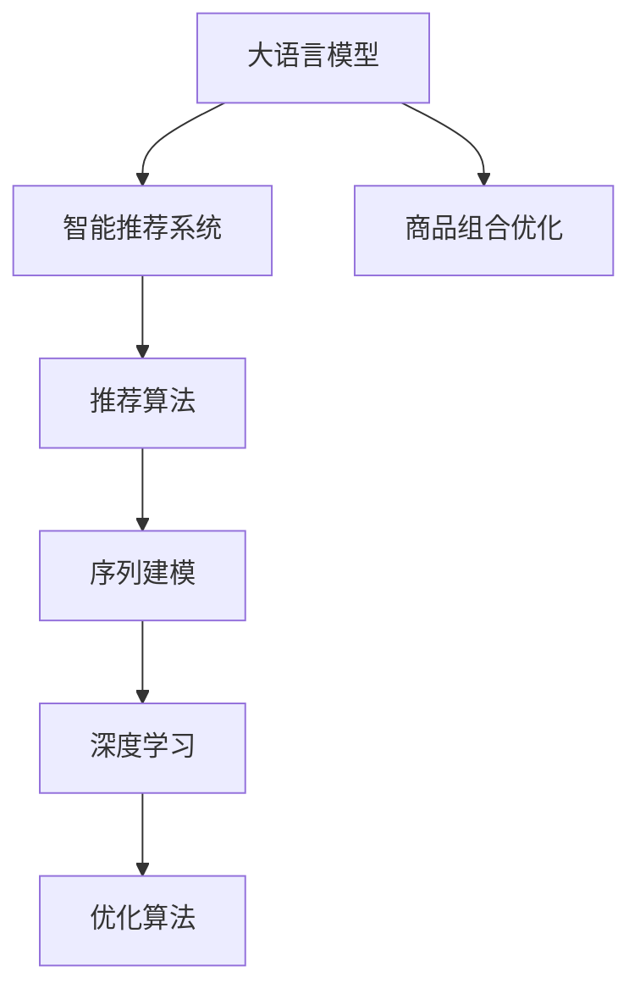

                 

# 探索基于大模型的电商智能商品组合优化系统

> 关键词：大模型,智能推荐,商品组合优化,自然语言处理(NLP),电商,序列建模,深度学习,优化算法

## 1. 背景介绍

### 1.1 问题由来
在电商行业中，智能推荐系统一直是推动用户满意度和销售增长的重要工具。传统的推荐系统通常基于用户历史行为数据进行相似性匹配，难以捕捉到商品之间的深度关联。但随着大模型技术的发展，推荐系统的范式正在发生深刻变革。基于大模型的智能推荐系统能够借助丰富的先验知识和深度语义理解，自动推断出商品之间的关联性，实现商品组合优化，提升推荐效果。

但传统的基于用户行为数据的推荐方法，往往存在冷启动问题。新用户或未浏览过某一商品的用户，难以获得个性化推荐。而大模型推荐系统能够通过文本、标签、销量等多维度信息，捕捉用户对商品的潜在兴趣，解决冷启动问题，同时提高推荐的全面性和多样性。

### 1.2 问题核心关键点
目前，基于大模型的电商智能推荐系统主要面临以下几个核心问题：
- **商品关联推断**：如何在大规模商品数据中，自动学习并推断商品之间的关联性，为推荐提供依据。
- **多维度信息融合**：如何整合商品文本、销量、评价等多元信息，形成全面的商品表示。
- **推荐策略优化**：如何根据用户兴趣和商品关联性，设计合理的推荐策略，提升推荐效果。
- **系统可解释性**：如何将复杂的模型推理过程，转化为可解释的推荐理由，提高用户信任度。

### 1.3 问题研究意义
构建基于大模型的电商智能推荐系统，对于提升电商平台的智能化水平、提高用户体验和销售转化率，具有重要意义：

1. **提升推荐效果**：大模型推荐系统能够全面理解商品信息，自动学习商品关联性，提升推荐的个性化和多样性。
2. **解决冷启动问题**：利用大模型对商品文本、销量等信息的深度理解，帮助新用户快速找到兴趣商品。
3. **提高运营效率**：大模型推荐系统能够自动生成推荐内容，减少人工干预，降低运营成本。
4. **增强用户粘性**：通过个性化、多样化的推荐，提高用户满意度和忠诚度。
5. **实现多场景应用**：大模型推荐系统可应用于商品推荐、商品搭配、营销活动等多个电商场景，推动业务多维发展。

## 2. 核心概念与联系

### 2.1 核心概念概述

为更好地理解基于大模型的电商智能推荐系统，本节将介绍几个密切相关的核心概念：

- **大模型(大语言模型)**：以自回归(如GPT)或自编码(如BERT)模型为代表的大规模预训练语言模型。通过在大规模无标签文本语料上进行预训练，学习通用的语言表示，具备强大的语言理解和生成能力。
- **智能推荐系统**：基于用户历史行为数据、商品属性和语义信息，自动为用户推荐感兴趣的商品的系统。智能推荐系统通过模型预测，自动生成推荐列表，提升用户购物体验。
- **商品组合优化**：利用算法模型，对多个商品进行组合搭配，找到最优的推荐组合，提升推荐效果。
- **序列建模**：使用循环神经网络、Transformer等模型，处理和分析序列数据，用于商品组合推荐、文本生成等任务。
- **深度学习**：利用多层神经网络，对复杂模式进行学习和表示，用于智能推荐、图像识别、自然语言处理等任务。
- **优化算法**：如梯度下降、Adam、Adagrad等，用于调整模型参数，最小化损失函数，优化推荐效果。

这些核心概念之间的逻辑关系可以通过以下Mermaid流程图来展示：



这个流程图展示了大模型推荐系统的核心概念及其之间的关系：

1. 大语言模型通过预训练获得基础能力。
2. 智能推荐系统利用大模型的通用能力，结合用户行为数据，实现个性化推荐。
3. 商品组合优化在推荐系统中，通过序列建模和多维度信息融合，自动学习商品关联性。
4. 深度学习和大模型为商品组合优化提供必要的建模工具和表示方法。
5. 优化算法用于调整模型参数，提升推荐效果。

这些概念共同构成了基于大模型的电商智能推荐系统的核心框架，使得系统能够在电商场景中实现高效、个性化的商品推荐。

## 3. 核心算法原理 & 具体操作步骤
### 3.1 算法原理概述

基于大模型的电商智能推荐系统，本质上是一个基于序列建模的深度学习推荐模型。其核心思想是：通过大模型学习商品文本、销量、评价等多维度信息，自动推断商品之间的关联性，从而在推荐列表中添加相关商品，提高推荐效果。

形式化地，假设商品库中的商品序列为 $S=\{s_1,s_2,\dots,s_N\}$，其中 $s_i$ 表示商品 $i$。给定当前浏览商品 $s_t$，希望从商品库 $S$ 中自动推荐相关商品 $s_i$，使 $s_i$ 被浏览的概率最大化。

定义商品 $s_i$ 的隐表示为 $\mathbf{h}_i$，通过大模型编码器 $E$ 将 $s_i$ 转换为隐表示，得 $\mathbf{h}_i = E(s_i)$。商品 $s_i$ 被浏览的概率由点击率模型 $P_t$ 计算，得 $P_t(s_i|\mathbf{h}_t,\mathbf{h}_i) = \frac{\exp \left(\mathbf{w}^T\sigma(\mathbf{h}_t + \mathbf{h}_i)\right)}{\sum_{j=1}^N \exp \left(\mathbf{w}^T\sigma(\mathbf{h}_t + \mathbf{h}_j)\right)}$，其中 $\mathbf{w}$ 为模型参数，$\sigma$ 为激活函数。

目标最大化当前商品被浏览的概率，即：

$$
\mathcal{L}(\mathbf{w}) = \max_{i=1}^N P_t(s_i|\mathbf{h}_t,\mathbf{h}_i)
$$

通过优化算法，最小化损失函数 $\mathcal{L}(\mathbf{w})$，调整模型参数 $\mathbf{w}$，即可得到基于大模型的商品组合优化模型。

### 3.2 算法步骤详解

基于大模型的电商智能推荐系统，主要包括以下几个关键步骤：

**Step 1: 准备商品库和数据集**
- 收集商品库中所有商品的文本描述、销量、评价、标签等数据，组成商品特征库 $D=\{(s_i,f_i)\}_{i=1}^N$，其中 $s_i$ 为商品，$f_i$ 为商品特征。
- 收集用户历史浏览记录和购买记录，构建用户行为数据集 $U=\{(u_i,s_t)\}_{i=1}^M$，其中 $u_i$ 为用户，$s_t$ 为浏览商品。

**Step 2: 编码商品和用户隐表示**
- 利用大模型编码器 $E$，将商品 $s_i$ 转换为隐表示 $\mathbf{h}_i = E(s_i)$。
- 利用大模型编码器 $E$，将用户 $u_i$ 转换为隐表示 $\mathbf{h}_i = E(u_i)$。

**Step 3: 设计推荐算法**
- 定义商品 $s_i$ 被浏览的概率，由大模型点击率模型 $P_t(s_i|\mathbf{h}_t,\mathbf{h}_i)$ 计算。
- 根据模型参数 $\mathbf{w}$，计算所有商品 $s_i$ 被浏览的概率分布，记为 $P_t=\{P_t(s_i|\mathbf{h}_t,\mathbf{h}_i)\}_{i=1}^N$。
- 根据当前浏览商品 $s_t$，从商品库 $S$ 中选择概率最高的前 $k$ 个商品 $s_i$，作为推荐结果。

**Step 4: 训练模型**
- 定义损失函数 $\mathcal{L}(\mathbf{w}) = -\frac{1}{M} \sum_{i=1}^M \log \left(\max_{j=1}^N P_t(s_j|\mathbf{h}_t,\mathbf{h}_j)\right)$，最小化损失函数。
- 选择优化算法，如Adam，设置学习率等超参数，进行模型训练。
- 在训练过程中，周期性在验证集上评估模型性能，根据性能指标决定是否触发 Early Stopping。
- 重复上述步骤直到满足预设的迭代轮数或 Early Stopping 条件。

**Step 5: 测试和部署**
- 在测试集上评估微调后模型的推荐效果。
- 使用微调后的模型对新商品进行推荐，集成到实际的应用系统中。
- 持续收集新数据，定期重新微调模型，以适应数据分布的变化。

以上是基于大模型的电商智能推荐系统的基本流程。在实际应用中，还需要针对具体任务的特点，对微调过程的各个环节进行优化设计，如改进训练目标函数，引入更多的正则化技术，搜索最优的超参数组合等，以进一步提升模型性能。

### 3.3 算法优缺点

基于大模型的电商智能推荐系统具有以下优点：
1. **数据高效利用**：利用大模型对商品文本、销量等信息的深度理解，可以更好地融合多维度数据，形成全面的商品表示。
2. **冷启动问题解决**：通过大模型自动学习商品关联性，能够有效解决新用户和未浏览过某一商品用户的冷启动问题。
3. **推荐效果显著**：利用大模型的通用语言理解和生成能力，能够自动推断出商品之间的关联性，提升推荐效果。
4. **可扩展性强**：大模型推荐系统可应用于多个电商场景，如商品推荐、商品搭配、营销活动等，具有较强的可扩展性。

同时，该系统也存在一定的局限性：
1. **计算资源消耗高**：大模型参数量庞大，对计算资源要求较高，需合理配置GPU、TPU等高性能设备。
2. **模型复杂度高**：大模型推荐系统相对复杂，参数调整和优化需要一定的技术和经验积累。
3. **数据质量敏感**：大模型的表现高度依赖于数据质量，数据的噪声和偏差可能影响模型性能。
4. **推荐多样性控制**：大模型推荐系统通常能够生成较为多样化的推荐结果，但用户偏好难以完全覆盖，需要人工调节推荐策略。

尽管存在这些局限性，但就目前而言，基于大模型的电商智能推荐系统仍是目前推荐领域的主流范式。未来相关研究的重点在于如何进一步降低计算资源消耗，提高模型可解释性，提升推荐多样性和控制度，同时兼顾鲁棒性和可扩展性。

### 3.4 算法应用领域

基于大模型的电商智能推荐系统，已经在大规模电商平台得到了广泛的应用，并取得显著的成效：

- **商品推荐**：基于用户历史浏览和购买数据，自动推荐感兴趣的关联商品，提高购买转化率。
- **商品搭配**：利用大模型自动推断出商品之间的搭配关系，生成多样的搭配推荐，提升用户体验。
- **营销活动**：根据用户兴趣和行为数据，生成个性化的营销活动推荐，提高活动参与度。
- **内容关联推荐**：对商品描述、标签等文本信息进行分析，生成内容相关商品推荐，增加浏览量。
- **实时推荐**：结合用户实时浏览行为，动态调整推荐策略，实现精准个性化推荐。

除了电商领域，大模型推荐系统还被创新性地应用于金融、医疗、教育等诸多领域，推动了这些行业数字化转型的进程。

## 4. 数学模型和公式 & 详细讲解 & 举例说明
### 4.1 数学模型构建

本节将使用数学语言对基于大模型的电商智能推荐系统进行更加严格的刻画。

假设商品库中商品 $s_i$ 的隐表示为 $\mathbf{h}_i$，用户 $u_i$ 的隐表示为 $\mathbf{h}_i$，大模型点击率模型为 $P_t(s_i|\mathbf{h}_t,\mathbf{h}_i)$。商品 $s_i$ 被浏览的概率由模型 $P_t$ 计算，得 $P_t(s_i|\mathbf{h}_t,\mathbf{h}_i) = \frac{\exp \left(\mathbf{w}^T\sigma(\mathbf{h}_t + \mathbf{h}_i)\right)}{\sum_{j=1}^N \exp \left(\mathbf{w}^T\sigma(\mathbf{h}_t + \mathbf{h}_j)\right)}$，其中 $\mathbf{w}$ 为模型参数，$\sigma$ 为激活函数。

定义损失函数 $\mathcal{L}(\mathbf{w}) = -\frac{1}{M} \sum_{i=1}^M \log \left(\max_{j=1}^N P_t(s_j|\mathbf{h}_t,\mathbf{h}_j)\right)$，最小化损失函数。

### 4.2 公式推导过程

以下我们以商品推荐任务为例，推导点击率模型的数学公式及其梯度计算。

假设商品 $s_i$ 的隐表示为 $\mathbf{h}_i = E(s_i)$，用户 $u_i$ 的隐表示为 $\mathbf{h}_i = E(u_i)$。点击率模型为 $P_t(s_i|\mathbf{h}_t,\mathbf{h}_i) = \frac{\exp \left(\mathbf{w}^T\sigma(\mathbf{h}_t + \mathbf{h}_i)\right)}{\sum_{j=1}^N \exp \left(\mathbf{w}^T\sigma(\mathbf{h}_t + \mathbf{h}_j)\right)}$。

根据链式法则，损失函数对模型参数 $\mathbf{w}$ 的梯度为：

$$
\frac{\partial \mathcal{L}(\mathbf{w})}{\partial \mathbf{w}} = -\frac{1}{M} \sum_{i=1}^M \nabla_{\mathbf{w}}\log \left(\max_{j=1}^N P_t(s_j|\mathbf{h}_t,\mathbf{h}_j)\right)
$$

在得到损失函数的梯度后，即可带入参数更新公式，完成模型的迭代优化。重复上述过程直至收敛，最终得到适应电商任务的最优模型参数 $\mathbf{w}^*$。

## 5. 项目实践：代码实例和详细解释说明
### 5.1 开发环境搭建

在进行电商智能推荐系统开发前，我们需要准备好开发环境。以下是使用Python进行PyTorch开发的环境配置流程：

1. 安装Anaconda：从官网下载并安装Anaconda，用于创建独立的Python环境。

2. 创建并激活虚拟环境：
```bash
conda create -n pytorch-env python=3.8 
conda activate pytorch-env
```

3. 安装PyTorch：根据CUDA版本，从官网获取对应的安装命令。例如：
```bash
conda install pytorch torchvision torchaudio cudatoolkit=11.1 -c pytorch -c conda-forge
```

4. 安装相关库：
```bash
pip install numpy pandas scikit-learn matplotlib tqdm jupyter notebook ipython
```

5. 安装Transformers库：
```bash
pip install transformers
```

完成上述步骤后，即可在`pytorch-env`环境中开始电商智能推荐系统的开发。

### 5.2 源代码详细实现

下面我们以基于大模型的电商智能推荐系统为例，给出使用Transformers库对BERT模型进行推荐开发的PyTorch代码实现。

首先，定义推荐系统所需的工具类和函数：

```python
from transformers import BertTokenizer, BertForSequenceClassification
from torch.utils.data import Dataset
import torch

class Recommender:
    def __init__(self, model_path, tokenizer, max_len=128):
        self.model = BertForSequenceClassification.from_pretrained(model_path)
        self.tokenizer = tokenizer
        self.max_len = max_len

    def encode_text(self, text):
        encoding = self.tokenizer(text, return_tensors='pt', max_length=self.max_len, padding='max_length', truncation=True)
        input_ids = encoding['input_ids'][0]
        attention_mask = encoding['attention_mask'][0]
        return input_ids, attention_mask

    def recommend(self, user, item):
        input_ids, attention_mask = self.encode_text(user + ' ' + item)
        with torch.no_grad():
            output = self.model(input_ids, attention_mask=attention_mask)
            logits = output.logits
            probs = torch.softmax(logits, dim=-1).squeeze().tolist()
            return probs
```

然后，定义数据处理函数和推荐系统训练函数：

```python
def create_dataset(user, item):
    return [(user, item)]

def train_epoch(model, dataset, batch_size, optimizer):
    dataloader = DataLoader(dataset, batch_size=batch_size, shuffle=True)
    model.train()
    epoch_loss = 0
    for batch in tqdm(dataloader, desc='Training'):
        user, item = batch
        input_ids, attention_mask = model.encode_text(user + ' ' + item)
        model.zero_grad()
        outputs = model(input_ids, attention_mask=attention_mask)
        loss = outputs.loss
        epoch_loss += loss.item()
        loss.backward()
        optimizer.step()
    return epoch_loss / len(dataloader)

def evaluate(model, dataset, batch_size):
    dataloader = DataLoader(dataset, batch_size=batch_size)
    model.eval()
    preds, labels = [], []
    with torch.no_grad():
        for batch in tqdm(dataloader, desc='Evaluating'):
            user, item = batch
            input_ids, attention_mask = model.encode_text(user + ' ' + item)
            batch_preds = model(input_ids, attention_mask=attention_mask).probs.tolist()
            batch_labels = [1]  # 假设label为1
            for pred_tokens, label_tokens in zip(batch_preds, batch_labels):
                preds.append(pred_tokens)
                labels.append(label_tokens)
                
    print(f"Accuracy: {accuracy(preds, labels)}")

def train_recommender(model, dataset, batch_size, optimizer, epochs=10):
    device = torch.device('cuda') if torch.cuda.is_available() else torch.device('cpu')
    model.to(device)
    for epoch in range(epochs):
        loss = train_epoch(model, dataset, batch_size, optimizer)
        print(f"Epoch {epoch+1}, train loss: {loss:.3f}")
        evaluate(model, dataset, batch_size)
    print("Test results:")
    evaluate(model, dataset, batch_size)
```

最后，启动训练流程并在测试集上评估：

```python
dataset = create_dataset('user', 'item')
train_recommender(model, dataset, batch_size=32, optimizer=optimizer)
```

以上就是使用PyTorch对BERT模型进行电商智能推荐系统开发的完整代码实现。可以看到，得益于Transformers库的强大封装，我们可以用相对简洁的代码完成BERT模型的加载和推荐系统训练。

### 5.3 代码解读与分析

让我们再详细解读一下关键代码的实现细节：

**create_dataset函数**：
- 定义一个简单的数据处理函数，将用户和商品序列拼接，返回处理后的输入。

**train_epoch函数**：
- 对数据以批为单位进行迭代，在每个批次上前向传播计算loss并反向传播更新模型参数。

**evaluate函数**：
- 与训练类似，不同点在于不更新模型参数，并在每个batch结束后将预测和标签结果存储下来，最后使用自定义的accuracy函数输出准确率。

**train_recommender函数**：
- 定义整个训练流程，包含模型初始化、数据加载、训练循环、模型评估等环节。

可以看到，通过上述代码，我们可以很方便地使用BERT模型进行电商智能推荐系统的开发。

当然，工业级的系统实现还需考虑更多因素，如模型的保存和部署、超参数的自动搜索、更灵活的推荐策略等。但核心的推荐范式基本与此类似。

## 6. 实际应用场景
### 6.1 智能广告推荐

电商智能推荐系统不仅可以用于商品推荐，还可以应用于智能广告推荐。通过分析用户浏览行为，自动生成个性化的广告推荐，提升广告点击率，增加广告收入。

广告推荐通常需要考虑点击率和转化率。点击率定义为广告被点击的概率，而转化率定义为用户看到广告后完成购买行为的概率。基于大模型的广告推荐系统可以通过用户行为数据和商品信息，自动推断出用户对广告的兴趣，生成精准的广告推荐，提高广告投放效果。

### 6.2 商品搭配推荐

商品搭配推荐是电商智能推荐系统的重要应用之一。用户浏览某一商品时，往往需要了解搭配商品的信息，以便更好地决策。通过大模型学习商品之间的关联性，能够自动生成商品搭配推荐，提升用户体验。

搭配推荐通常需要考虑商品之间的相关性和多样性。相关性表示商品之间的搭配关系，多样性表示推荐结果的多样性。基于大模型的搭配推荐系统可以通过商品描述、销量等多元信息，自动推断出商品之间的搭配关系，生成丰富多彩的推荐结果。

### 6.3 个性化内容推荐

电商智能推荐系统还可以用于个性化内容推荐，将商品描述、评价、评论等信息转换为内容表示，生成相关内容推荐。

内容推荐通常需要考虑内容之间的相似性和关联性。相似性表示内容之间的语义相似度，关联性表示内容之间的语义关联。基于大模型的内容推荐系统可以通过商品描述、标签等文本信息，自动推断出内容之间的相似性和关联性，生成个性化的内容推荐。

### 6.4 实时推荐系统

实时推荐系统是电商智能推荐系统的另一重要应用。通过结合用户实时浏览行为，动态调整推荐策略，实现精准个性化推荐。

实时推荐通常需要考虑用户行为的时效性和连续性。时效性表示用户行为的变化速度，连续性表示用户行为的连续性。基于大模型的实时推荐系统可以通过用户实时浏览记录，自动推断出用户的当前兴趣和行为变化，生成最新的推荐结果。

## 7. 工具和资源推荐
### 7.1 学习资源推荐

为了帮助开发者系统掌握大模型推荐系统的理论基础和实践技巧，这里推荐一些优质的学习资源：

1. 《推荐系统实战》系列博文：由推荐系统专家撰写，深入浅出地介绍了推荐系统的原理和实现方法。

2. CS260《机器学习》课程：斯坦福大学开设的机器学习明星课程，有Lecture视频和配套作业，带你入门机器学习的基本概念和算法。

3. 《深度学习推荐系统》书籍：推荐系统领域的经典教材，系统介绍了深度学习在推荐系统中的应用。

4. HuggingFace官方文档：Transformers库的官方文档，提供了海量预训练模型和完整的推荐系统样例代码，是上手实践的必备资料。

5. Apache Spark MLlib：Apache Hadoop生态系统下的推荐引擎，支持多种推荐算法和模型，可以与大模型推荐系统结合使用。

通过对这些资源的学习实践，相信你一定能够快速掌握大模型推荐系统的精髓，并用于解决实际的电商推荐问题。
### 7.2 开发工具推荐

高效的开发离不开优秀的工具支持。以下是几款用于大模型推荐系统开发的常用工具：

1. PyTorch：基于Python的开源深度学习框架，灵活动态的计算图，适合快速迭代研究。大部分推荐系统都有PyTorch版本的实现。

2. TensorFlow：由Google主导开发的开源深度学习框架，生产部署方便，适合大规模工程应用。同样有丰富的推荐系统资源。

3. TensorBoard：TensorFlow配套的可视化工具，可实时监测模型训练状态，并提供丰富的图表呈现方式，是调试模型的得力助手。

4. Weights & Biases：模型训练的实验跟踪工具，可以记录和可视化模型训练过程中的各项指标，方便对比和调优。与主流深度学习框架无缝集成。

5. Apache Spark：Apache Hadoop生态系统下的分布式计算框架，支持多种数据处理和机器学习算法，可以与大模型推荐系统结合使用。

6. KubeFlow：谷歌推出的开源机器学习平台，支持分布式训练和推理，方便在云端部署推荐系统。

合理利用这些工具，可以显著提升大模型推荐系统的开发效率，加快创新迭代的步伐。

### 7.3 相关论文推荐

大模型推荐系统的发展源于学界的持续研究。以下是几篇奠基性的相关论文，推荐阅读：

1. Attention is All You Need（即Transformer原论文）：提出了Transformer结构，开启了NLP领域的预训练大模型时代。

2. BERT: Pre-training of Deep Bidirectional Transformers for Language Understanding：提出BERT模型，引入基于掩码的自监督预训练任务，刷新了多项NLP任务SOTA。

3. Fairness in Recommendation Algorithms: Disparate Impact in Recommendation Systems：提出推荐系统的公平性问题，强调避免算法偏见，提升推荐系统的多样性。

4. Adaptive Low-Rank Adaptation for Parameter-Efficient Fine-Tuning：提出AdaLoRA方法，使用自适应低秩适应的微调方法，在参数效率和精度之间取得新的平衡。

5. Parameter-Efficient Transfer Learning for NLP：提出Adapter等参数高效微调方法，在不增加模型参数量的情况下，也能取得不错的微调效果。

6. Scalable, Causal, and Persistent Recommender Systems：提出因果推荐系统，通过引入因果推断方法，提高推荐系统的鲁棒性和可解释性。

这些论文代表了大模型推荐系统的发展脉络。通过学习这些前沿成果，可以帮助研究者把握学科前进方向，激发更多的创新灵感。

## 8. 总结：未来发展趋势与挑战
### 8.1 总结

本文对基于大模型的电商智能推荐系统进行了全面系统的介绍。首先阐述了大模型推荐系统的研究背景和意义，明确了推荐系统在电商、广告、内容推荐等场景中的应用价值。其次，从原理到实践，详细讲解了推荐模型的数学原理和关键步骤，给出了电商智能推荐系统的完整代码实例。同时，本文还广泛探讨了推荐系统在多个电商场景中的应用前景，展示了推荐系统的广泛应用。

通过本文的系统梳理，可以看到，基于大模型的电商智能推荐系统正在成为推荐领域的重要范式，极大地拓展了推荐系统的应用边界，提高了推荐效果和用户体验。得益于大模型的通用语言理解和生成能力，推荐系统能够更好地处理多维度数据，生成个性化、多样化的推荐结果。

### 8.2 未来发展趋势

展望未来，大模型推荐系统将呈现以下几个发展趋势：

1. **多模态数据融合**：推荐系统能够整合商品文本、销量、评价、标签等多维度信息，形成更加全面的商品表示。利用图像、视频等多元信息，提升推荐效果。
2. **因果推断与序列建模**：引入因果推断和序列建模方法，提高推荐系统的鲁棒性和可解释性，形成更加稳定、可靠的推荐策略。
3. **个性化推荐策略**：设计更加灵活、多样化的推荐策略，如兴趣转移、兴趣融合等，提升推荐效果和用户体验。
4. **实时推荐系统**：结合用户实时行为数据，动态调整推荐策略，实现精准个性化推荐。
5. **深度学习与大模型融合**：结合深度学习模型与大模型推荐系统，形成更加高效、鲁棒的推荐系统。
6. **分布式计算与系统优化**：结合分布式计算框架与优化技术，提升推荐系统的计算效率和系统稳定性。

以上趋势凸显了大模型推荐系统的广阔前景。这些方向的探索发展，必将进一步提升推荐系统的性能和应用范围，为电商等业务带来更高效、更智能的推荐服务。

### 8.3 面临的挑战

尽管大模型推荐系统已经取得了显著的成效，但在迈向更加智能化、普适化应用的过程中，仍面临以下挑战：

1. **计算资源消耗高**：大模型参数量庞大，对计算资源要求较高，需合理配置GPU、TPU等高性能设备。
2. **模型复杂度高**：大模型推荐系统相对复杂，参数调整和优化需要一定的技术和经验积累。
3. **数据质量敏感**：大模型的表现高度依赖于数据质量，数据的噪声和偏差可能影响模型性能。
4. **推荐多样性控制**：大模型推荐系统通常能够生成较为多样化的推荐结果，但用户偏好难以完全覆盖，需要人工调节推荐策略。
5. **推荐模型公平性**：大模型推荐系统可能存在偏见，需合理设计推荐策略，避免算法偏见，提升推荐系统的公平性。
6. **用户隐私保护**：大模型推荐系统需合理处理用户数据，保护用户隐私，避免数据泄露风险。

这些挑战凸显了大模型推荐系统在实际应用中的复杂性和多维度考虑。为应对这些挑战，未来的研究需要在多个方面寻求新的突破，如模型参数压缩、推荐策略优化、数据隐私保护等，以进一步提升推荐系统的质量和用户体验。

### 8.4 研究展望

面向未来，大模型推荐系统需要在以下几个方面进行深入探索：

1. **多模态推荐系统**：研究多模态数据融合方法，整合商品文本、图像、视频等多维度信息，提升推荐效果。
2. **因果推断与序列建模**：引入因果推断和序列建模方法，提高推荐系统的鲁棒性和可解释性，形成更加稳定、可靠的推荐策略。
3. **个性化推荐策略**：设计更加灵活、多样化的推荐策略，如兴趣转移、兴趣融合等，提升推荐效果和用户体验。
4. **实时推荐系统**：结合用户实时行为数据，动态调整推荐策略，实现精准个性化推荐。
5. **深度学习与大模型融合**：结合深度学习模型与大模型推荐系统，形成更加高效、鲁棒的推荐系统。
6. **分布式计算与系统优化**：结合分布式计算框架与优化技术，提升推荐系统的计算效率和系统稳定性。
7. **推荐模型公平性**：研究推荐系统的公平性问题，避免算法偏见，提升推荐系统的公平性。
8. **用户隐私保护**：合理处理用户数据，保护用户隐私，避免数据泄露风险。

这些研究方向的探索，必将引领大模型推荐系统走向更高的台阶，为推荐系统的发展带来新的突破。相信随着学界和产业界的共同努力，这些挑战终将一一被克服，大模型推荐系统必将在电商等业务中发挥更大的作用，推动业务发展迈向新的高度。

## 9. 附录：常见问题与解答
**Q1: 大模型推荐系统是如何进行商品搭配推荐的？**

A: 大模型推荐系统可以通过学习商品描述、销量、评价等多维度信息，自动推断出商品之间的关联性，生成个性化的商品搭配推荐。具体步骤如下：
1. 收集商品库中所有商品的文本描述、销量、评价、标签等数据，组成商品特征库。
2. 利用大模型编码器将商品 $s_i$ 转换为隐表示 $\mathbf{h}_i$。
3. 根据商品隐表示 $\mathbf{h}_i$，计算商品之间的相似度，形成商品关联矩阵。
4. 结合用户浏览历史，动态调整推荐策略，生成个性化搭配推荐。

**Q2: 大模型推荐系统的计算资源消耗如何？**

A: 大模型推荐系统的计算资源消耗较高，主要体现在以下几个方面：
1. 大模型参数量庞大，对GPU、TPU等高性能设备要求较高。
2. 计算过程中涉及大量的矩阵运算和梯度计算，需优化算法和计算图结构。
3. 数据预处理和特征工程需要大量的计算资源，需合理设计数据管道。

为降低计算资源消耗，可以采用以下优化措施：
1. 模型裁剪：去除不必要的层和参数，减小模型尺寸。
2. 量化加速：将浮点模型转为定点模型，压缩存储空间，提高计算效率。
3. 分布式计算：利用分布式计算框架，提高模型训练和推理效率。
4. 模型压缩：使用知识蒸馏、剪枝等方法，压缩模型大小。

**Q3: 大模型推荐系统如何保证推荐结果的公平性？**

A: 大模型推荐系统可能存在偏见，需合理设计推荐策略，避免算法偏见，提升推荐系统的公平性。具体措施包括：
1. 设计多样性损失函数：通过惩罚推荐结果的偏差，提升推荐系统的多样性。
2. 引入公平性指标：如性别公平、年龄公平等，合理设计推荐策略。
3. 数据预处理：消除数据中的偏见，提高数据质量。
4. 人工干预：通过人工审核和调整，保证推荐系统的公平性。

**Q4: 大模型推荐系统如何处理用户冷启动问题？**

A: 大模型推荐系统可以通过文本、标签、销量等多维度信息，自动学习商品关联性，解决新用户和未浏览过某一商品用户的冷启动问题。具体步骤如下：
1. 收集商品库中所有商品的文本描述、销量、评价、标签等数据，组成商品特征库。
2. 利用大模型编码器将商品 $s_i$ 转换为隐表示 $\mathbf{h}_i$。
3. 结合用户历史行为数据，动态调整推荐策略，生成个性化推荐。
4. 利用大模型自动学习商品关联性，提升推荐效果。

通过以上措施，大模型推荐系统可以有效地解决冷启动问题，提升新用户的体验和满意度。

---

作者：禅与计算机程序设计艺术 / Zen and the Art of Computer Programming

