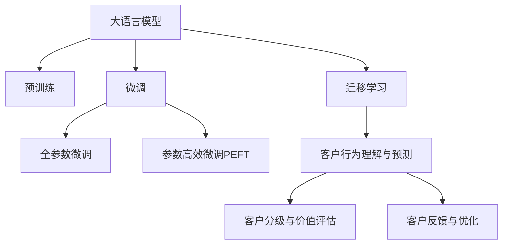

                 

# 探索基于大模型的电商智能客户价值预测与分级系统

## 1. 背景介绍

### 1.1 问题由来
在快速发展的电子商务领域，客户价值预测与分级系统成为商家实现精准营销、个性化推荐和优化客户服务的重要工具。然而，传统基于规则或线性模型的客户价值预测方法难以捕捉客户行为的全貌，无法充分利用大数据的优势。随着大规模预训练语言模型和大模型微调技术的崛起，基于深度神经网络的大模型在客户行为建模和预测方面展现出强大潜力。

### 1.2 问题核心关键点
构建基于大模型的客户价值预测与分级系统，核心在于：
1. **数据收集与处理**：收集电商平台上用户行为数据，如购买记录、浏览历史、评分反馈等，并进行数据清洗、特征工程和标准化处理。
2. **模型预训练**：在大规模电商文本数据上预训练大语言模型，学习通用客户行为特征。
3. **任务适配与微调**：在预训练模型基础上，针对客户价值预测与分级任务进行微调，使模型适应电商平台特定需求。
4. **性能评估与优化**：通过模型测试和业务指标评估，持续优化模型参数和结构，提升预测准确度和实用性。

### 1.3 问题研究意义
构建基于大模型的电商智能客户价值预测与分级系统，能够帮助电商企业实现以下目标：
1. **精准营销**：基于客户行为数据预测客户价值，精准定位高价值客户，优化广告投放和个性化推荐。
2. **客户分级**：利用预测模型对客户进行多维度分级，指导资源配置和客户服务策略。
3. **运营优化**：预测客户流失概率，提前干预，提升客户留存率。
4. **业务洞察**：分析客户行为模式和特征，为业务决策提供数据支撑。

通过基于大模型的客户价值预测与分级系统，电商企业能够实现精细化运营，提升客户满意度和企业收益。

## 2. 核心概念与联系

### 2.1 核心概念概述

为更好地理解基于大模型的客户价值预测与分级系统，本节将介绍几个密切相关的核心概念：

- **大语言模型(Large Language Model, LLM)**：如GPT、BERT等大规模预训练语言模型，通过在大规模无标签文本语料上进行预训练，学习通用的语言表示，具备强大的语言理解和生成能力。

- **预训练(Pre-training)**：指在大规模无标签文本语料上，通过自监督学习任务训练通用语言模型的过程。常见的预训练任务包括言语建模、遮挡语言模型等。

- **微调(Fine-tuning)**：指在预训练模型的基础上，使用下游任务的少量标注数据，通过有监督地训练来优化模型在特定任务上的性能。

- **迁移学习(Transfer Learning)**：指将一个领域学习到的知识，迁移应用到另一个不同但相关的领域的学习范式。大模型的预训练-微调过程即是一种典型的迁移学习方式。

- **客户行为理解与预测**：基于用户行为数据，构建大语言模型，学习客户的购买倾向、行为模式等特征，用于预测客户未来行为和价值。

- **客户分级与价值评估**：通过预测模型对客户进行多维度分级，如高价值客户、潜在流失客户等，进行资源配置和客户服务策略优化。

- **客户反馈与优化**：收集客户反馈数据，评估预测模型的准确性，进行模型优化和参数调整。

这些核心概念之间的逻辑关系可以通过以下Mermaid流程图来展示：



这个流程图展示了大语言模型的核心概念及其之间的关系：

1. 大语言模型通过预训练获得基础能力。
2. 微调是对预训练模型进行任务特定的优化，可以分为全参数微调和参数高效微调（PEFT）。
3. 迁移学习是连接预训练模型与下游任务的桥梁，可以通过微调或迁移学习来实现。
4. 客户行为理解与预测是基于模型在电商任务上的特定微调，用于预测客户行为。
5. 客户分级与价值评估是在客户行为预测的基础上，对客户进行多维度分级。
6. 客户反馈与优化是一个持续的过程，通过客户反馈数据不断优化模型，提高预测准确度。

这些概念共同构成了大语言模型在电商领域的客户价值预测与分级系统的框架，使其能够在此基础上实现精细化运营。

## 3. 核心算法原理 & 具体操作步骤
### 3.1 算法原理概述

基于大模型的客户价值预测与分级系统，本质上是一个有监督的细粒度迁移学习过程。其核心思想是：将预训练的大语言模型视作一个强大的"特征提取器"，通过在电商客户行为数据上进行有监督的微调，使得模型输出能够匹配客户价值预测或分级的标签，从而获得针对特定电商任务优化的模型。

形式化地，假设预训练模型为 $M_{\theta}$，其中 $\theta$ 为预训练得到的模型参数。给定客户价值预测与分级任务 $T$ 的标注数据集 $D=\{(x_i, y_i)\}_{i=1}^N$，微调的目标是找到新的模型参数 $\hat{\theta}$，使得：

$$
\hat{\theta}=\mathop{\arg\min}_{\theta} \mathcal{L}(M_{\theta},D)
$$

其中 $\mathcal{L}$ 为针对任务 $T$ 设计的损失函数，用于衡量模型预测输出与真实标签之间的差异。常见的损失函数包括交叉熵损失、均方误差损失等。

通过梯度下降等优化算法，微调过程不断更新模型参数 $\theta$，最小化损失函数 $\mathcal{L}$，使得模型输出逼近真实标签。由于 $\theta$ 已经通过预训练获得了较好的初始化，因此即便在有限标注数据上微调，也能较快收敛到理想的模型参数 $\hat{\theta}$。

### 3.2 算法步骤详解

基于大模型的客户价值预测与分级系统的一般流程包括以下几个关键步骤：

**Step 1: 准备预训练模型和数据集**
- 选择合适的预训练语言模型 $M_{\theta}$ 作为初始化参数，如 BERT、GPT等。
- 准备电商客户行为数据集 $D$，划分为训练集、验证集和测试集。一般要求标注数据与电商数据分布不要差异过大。

**Step 2: 添加任务适配层**
- 根据电商任务类型，在预训练模型顶层设计合适的输出层和损失函数。
- 对于客户价值预测任务，通常在顶层添加线性分类器和交叉熵损失函数。
- 对于客户分级任务，设计多标签分类器或回归器，使用合适的损失函数，如多类交叉熵或均方误差。

**Step 3: 设置微调超参数**
- 选择合适的优化算法及其参数，如 AdamW、SGD 等，设置学习率、批大小、迭代轮数等。
- 设置正则化技术及强度，包括权重衰减、Dropout、Early Stopping等。
- 确定冻结预训练参数的策略，如仅微调顶层，或全部参数都参与微调。

**Step 4: 执行梯度训练**
- 将训练集数据分批次输入模型，前向传播计算损失函数。
- 反向传播计算参数梯度，根据设定的优化算法和学习率更新模型参数。
- 周期性在验证集上评估模型性能，根据性能指标决定是否触发 Early Stopping。
- 重复上述步骤直到满足预设的迭代轮数或 Early Stopping 条件。

**Step 5: 测试和部署**
- 在测试集上评估微调后模型 $M_{\hat{\theta}}$ 的性能，对比微调前后的精度提升。
- 使用微调后的模型对新客户进行预测或分级，集成到电商平台的推荐和客户服务系统中。
- 持续收集新的客户行为数据，定期重新微调模型，以适应客户行为的变化。

以上是基于大模型的客户价值预测与分级系统的一般流程。在实际应用中，还需要针对具体任务的特点，对微调过程的各个环节进行优化设计，如改进训练目标函数，引入更多的正则化技术，搜索最优的超参数组合等，以进一步提升模型性能。

### 3.3 算法优缺点

基于大模型的客户价值预测与分级方法具有以下优点：
1. **模型性能强大**：预训练模型能够学习到广泛的客户行为特征，微调后能够精确预测客户价值和分级。
2. **适应性强**：模型能够自动适应电商平台上客户行为的变化，减少对人工特征工程和规则的依赖。
3. **可扩展性高**：预训练模型和微调过程可以无缝应用于不同类型的电商业务，如商品推荐、客户服务、营销策略等。
4. **实时性良好**：基于大模型的预测和分级过程可以实时进行，支持电商平台的即时决策。

同时，该方法也存在一定的局限性：
1. **数据依赖性强**：微调效果很大程度上取决于电商数据的质量和数量，获取高质量标注数据的成本较高。
2. **计算资源消耗大**：大规模预训练模型和微调过程需要大量计算资源，对硬件设施要求较高。
3. **模型复杂度高**：大模型的参数量较大，训练和推理过程复杂，难以直接部署到移动端或轻量级设备。
4. **可解释性不足**：预训练模型和微调过程较为复杂，模型的内部决策过程难以解释和理解。

尽管存在这些局限性，但就目前而言，基于大模型的客户价值预测与分级方法仍是最主流的电商客户智能系统解决方案。未来相关研究的重点在于如何进一步降低数据依赖，提高模型的计算效率，增强模型的可解释性和伦理安全性等因素。

### 3.4 算法应用领域

基于大模型的客户价值预测与分级方法在电商领域已经得到了广泛的应用，具体包括：

- **客户行为预测**：预测客户的购买行为、点击率、流失率等，支持个性化推荐和营销策略优化。
- **客户分级与价值评估**：对客户进行高价值、潜在流失、低价值等分级，指导资源配置和客户服务策略。
- **客户细分与个性化推荐**：根据客户的不同特征和行为，提供个性化的商品推荐和促销策略。
- **营销效果评估**：评估不同营销活动的效果，优化广告投放策略和预算分配。
- **客户服务优化**：分析客户服务数据，识别服务痛点和改进方向，提升客户满意度。

除了上述这些核心应用外，基于大模型的客户价值预测与分级方法还被创新性地应用于客户洞察、社交媒体分析、内容推荐等场景，进一步扩展了电商客户智能系统的应用范围。

## 4. 数学模型和公式 & 详细讲解
### 4.1 数学模型构建

本节将使用数学语言对基于大模型的客户价值预测与分级过程进行更加严格的刻画。

记预训练语言模型为 $M_{\theta}$，其中 $\theta$ 为模型参数。假设客户价值预测与分级任务 $T$ 的训练集为 $D=\{(x_i,y_i)\}_{i=1}^N$，其中 $x_i$ 为电商客户行为数据，$y_i$ 为标签，表示客户的价值评分或分级信息。

定义模型 $M_{\theta}$ 在数据样本 $(x,y)$ 上的损失函数为 $\ell(M_{\theta}(x),y)$，则在数据集 $D$ 上的经验风险为：

$$
\mathcal{L}(\theta) = \frac{1}{N} \sum_{i=1}^N \ell(M_{\theta}(x_i),y_i)
$$

微调的优化目标是最小化经验风险，即找到最优参数：

$$
\theta^* = \mathop{\arg\min}_{\theta} \mathcal{L}(\theta)
$$

在实践中，我们通常使用基于梯度的优化算法（如SGD、Adam等）来近似求解上述最优化问题。设 $\eta$ 为学习率，$\lambda$ 为正则化系数，则参数的更新公式为：

$$
\theta \leftarrow \theta - \eta \nabla_{\theta}\mathcal{L}(\theta) - \eta\lambda\theta
$$

其中 $\nabla_{\theta}\mathcal{L}(\theta)$ 为损失函数对参数 $\theta$ 的梯度，可通过反向传播算法高效计算。

### 4.2 公式推导过程

以下我们以客户价值预测任务为例，推导交叉熵损失函数及其梯度的计算公式。

假设模型 $M_{\theta}$ 在输入 $x$ 上的输出为 $\hat{y}=M_{\theta}(x)$，表示客户价值预测的概率分布。真实标签 $y \in [0,1]$。则二分类交叉熵损失函数定义为：

$$
\ell(M_{\theta}(x),y) = -y\log \hat{y} + (1-y)\log (1-\hat{y})
$$

将其代入经验风险公式，得：

$$
\mathcal{L}(\theta) = -\frac{1}{N}\sum_{i=1}^N [y_i\log M_{\theta}(x_i)+(1-y_i)\log(1-M_{\theta}(x_i))]
$$

根据链式法则，损失函数对参数 $\theta_k$ 的梯度为：

$$
\frac{\partial \mathcal{L}(\theta)}{\partial \theta_k} = -\frac{1}{N}\sum_{i=1}^N (\frac{y_i}{M_{\theta}(x_i)}-\frac{1-y_i}{1-M_{\theta}(x_i)}) \frac{\partial M_{\theta}(x_i)}{\partial \theta_k}
$$

其中 $\frac{\partial M_{\theta}(x_i)}{\partial \theta_k}$ 可进一步递归展开，利用自动微分技术完成计算。

在得到损失函数的梯度后，即可带入参数更新公式，完成模型的迭代优化。重复上述过程直至收敛，最终得到适应电商客户价值预测任务的模型参数 $\theta^*$。

## 5. 项目实践：代码实例和详细解释说明
### 5.1 开发环境搭建

在进行客户价值预测与分级系统开发前，我们需要准备好开发环境。以下是使用Python进行PyTorch开发的环境配置流程：

1. 安装Anaconda：从官网下载并安装Anaconda，用于创建独立的Python环境。

2. 创建并激活虚拟环境：
```bash
conda create -n pytorch-env python=3.8 
conda activate pytorch-env
```

3. 安装PyTorch：根据CUDA版本，从官网获取对应的安装命令。例如：
```bash
conda install pytorch torchvision torchaudio cudatoolkit=11.1 -c pytorch -c conda-forge
```

4. 安装Transformers库：
```bash
pip install transformers
```

5. 安装各类工具包：
```bash
pip install numpy pandas scikit-learn matplotlib tqdm jupyter notebook ipython
```

完成上述步骤后，即可在`pytorch-env`环境中开始客户价值预测与分级系统的开发。

### 5.2 源代码详细实现

下面我们以客户价值预测任务为例，给出使用Transformers库对BERT模型进行微调的PyTorch代码实现。

首先，定义客户价值预测任务的数据处理函数：

```python
from transformers import BertTokenizer
from torch.utils.data import Dataset
import torch

class CustomerValueDataset(Dataset):
    def __init__(self, texts, labels, tokenizer, max_len=128):
        self.texts = texts
        self.labels = labels
        self.tokenizer = tokenizer
        self.max_len = max_len
        
    def __len__(self):
        return len(self.texts)
    
    def __getitem__(self, item):
        text = self.texts[item]
        label = self.labels[item]
        
        encoding = self.tokenizer(text, return_tensors='pt', max_length=self.max_len, padding='max_length', truncation=True)
        input_ids = encoding['input_ids'][0]
        attention_mask = encoding['attention_mask'][0]
        
        # 将标签转换为模型可接受的格式
        encoded_label = torch.tensor([label], dtype=torch.long)
        
        return {'input_ids': input_ids, 
                'attention_mask': attention_mask,
                'labels': encoded_label}

# 标签与id的映射
label2id = {'low': 0, 'medium': 1, 'high': 2}
id2label = {v: k for k, v in label2id.items()}

# 创建dataset
tokenizer = BertTokenizer.from_pretrained('bert-base-cased')

train_dataset = CustomerValueDataset(train_texts, train_labels, tokenizer)
dev_dataset = CustomerValueDataset(dev_texts, dev_labels, tokenizer)
test_dataset = CustomerValueDataset(test_texts, test_labels, tokenizer)
```

然后，定义模型和优化器：

```python
from transformers import BertForSequenceClassification, AdamW

model = BertForSequenceClassification.from_pretrained('bert-base-cased', num_labels=len(label2id))

optimizer = AdamW(model.parameters(), lr=2e-5)
```

接着，定义训练和评估函数：

```python
from torch.utils.data import DataLoader
from tqdm import tqdm
from sklearn.metrics import classification_report

device = torch.device('cuda') if torch.cuda.is_available() else torch.device('cpu')
model.to(device)

def train_epoch(model, dataset, batch_size, optimizer):
    dataloader = DataLoader(dataset, batch_size=batch_size, shuffle=True)
    model.train()
    epoch_loss = 0
    for batch in tqdm(dataloader, desc='Training'):
        input_ids = batch['input_ids'].to(device)
        attention_mask = batch['attention_mask'].to(device)
        labels = batch['labels'].to(device)
        model.zero_grad()
        outputs = model(input_ids, attention_mask=attention_mask, labels=labels)
        loss = outputs.loss
        epoch_loss += loss.item()
        loss.backward()
        optimizer.step()
    return epoch_loss / len(dataloader)

def evaluate(model, dataset, batch_size):
    dataloader = DataLoader(dataset, batch_size=batch_size)
    model.eval()
    preds, labels = [], []
    with torch.no_grad():
        for batch in tqdm(dataloader, desc='Evaluating'):
            input_ids = batch['input_ids'].to(device)
            attention_mask = batch['attention_mask'].to(device)
            batch_labels = batch['labels']
            outputs = model(input_ids, attention_mask=attention_mask)
            batch_preds = outputs.logits.argmax(dim=1).to('cpu').tolist()
            batch_labels = batch_labels.to('cpu').tolist()
            for pred_token, label_token in zip(batch_preds, batch_labels):
                pred_labels.append(id2label[pred_token])
                label_tokens.append(id2label[label_token])
                
    print(classification_report(labels, preds))
```

最后，启动训练流程并在测试集上评估：

```python
epochs = 5
batch_size = 16

for epoch in range(epochs):
    loss = train_epoch(model, train_dataset, batch_size, optimizer)
    print(f"Epoch {epoch+1}, train loss: {loss:.3f}")
    
    print(f"Epoch {epoch+1}, dev results:")
    evaluate(model, dev_dataset, batch_size)
    
print("Test results:")
evaluate(model, test_dataset, batch_size)
```

以上就是使用PyTorch对BERT进行客户价值预测任务微调的完整代码实现。可以看到，得益于Transformers库的强大封装，我们可以用相对简洁的代码完成BERT模型的加载和微调。

### 5.3 代码解读与分析

让我们再详细解读一下关键代码的实现细节：

**CustomerValueDataset类**：
- `__init__`方法：初始化文本、标签、分词器等关键组件。
- `__len__`方法：返回数据集的样本数量。
- `__getitem__`方法：对单个样本进行处理，将文本输入编码为token ids，将标签转换为模型可接受的格式，并对其进行定长padding，最终返回模型所需的输入。

**label2id和id2label字典**：
- 定义了标签与数字id之间的映射关系，用于将预测结果解码回真实的标签。

**训练和评估函数**：
- 使用PyTorch的DataLoader对数据集进行批次化加载，供模型训练和推理使用。
- 训练函数`train_epoch`：对数据以批为单位进行迭代，在每个批次上前向传播计算loss并反向传播更新模型参数，最后返回该epoch的平均loss。
- 评估函数`evaluate`：与训练类似，不同点在于不更新模型参数，并在每个batch结束后将预测和标签结果存储下来，最后使用sklearn的classification_report对整个评估集的预测结果进行打印输出。

**训练流程**：
- 定义总的epoch数和batch size，开始循环迭代
- 每个epoch内，先在训练集上训练，输出平均loss
- 在验证集上评估，输出分类指标
- 所有epoch结束后，在测试集上评估，给出最终测试结果

可以看到，PyTorch配合Transformers库使得BERT微调的代码实现变得简洁高效。开发者可以将更多精力放在数据处理、模型改进等高层逻辑上，而不必过多关注底层的实现细节。

当然，工业级的系统实现还需考虑更多因素，如模型的保存和部署、超参数的自动搜索、更灵活的任务适配层等。但核心的微调范式基本与此类似。

## 6. 实际应用场景
### 6.1 客户行为预测与推荐系统

基于大模型的客户价值预测与分级系统，可以广泛应用于电商平台的客户行为预测与推荐系统的构建。

传统推荐系统往往只依赖用户的历史行为数据进行物品推荐，无法深入理解用户的真实兴趣偏好。基于大模型的客户行为预测系统，能够学习到客户的长期行为特征和短期行为模式，预测客户的未来行为，从而实现更精准的个性化推荐。

具体而言，可以通过收集用户浏览、点击、购买、评分等行为数据，提取和用户交互的物品标题、描述、标签等文本内容。将文本内容作为模型输入，用户的行为数据作为监督信号，在此基础上微调预训练语言模型。微调后的模型能够从文本内容中准确把握用户的兴趣点，并预测用户是否会进行下一步行为（如购买、点击）。结合预测结果，电商平台可以提供更个性化的推荐商品和服务，提升用户体验和满意度。

### 6.2 客户细分与个性化服务

客户细分和个性化服务是电商运营的重要环节。通过基于大模型的客户价值预测与分级系统，商家能够对客户进行多维度分级，识别高价值客户、潜在流失客户、新客户等，进行有针对性的服务策略优化。

具体而言，可以根据客户的不同价值等级，定制不同的营销活动、推荐策略和客服服务。例如，对高价值客户进行VIP专享服务，对潜在流失客户进行关怀活动，对新客户进行引导推荐。如此构建的个性化服务系统，能够显著提升客户忠诚度和留存率，降低客户流失风险。

### 6.3 营销效果评估与优化

电商营销活动的效果评估和优化是企业运营的重要指标。基于大模型的客户价值预测与分级系统，可以用于评估不同营销活动的效果，优化广告投放策略和预算分配。

具体而言，可以通过分析不同营销活动对客户价值预测结果的影响，评估活动的效果。例如，对于一次促销活动，可以分析其对客户的购买意愿和价值评分的影响，判断活动的效果是否达到预期。根据评估结果，优化活动的策略和资源配置，提升营销ROI。

### 6.4 客户服务优化与预警

客户服务优化和预警是提升客户满意度的重要手段。基于大模型的客户价值预测与分级系统，可以用于分析客户服务数据，识别服务痛点和改进方向，提升客户服务质量。

具体而言，可以收集客户在电商平台的客服聊天记录、服务评价等数据，提取其中的文本信息。将文本内容作为模型输入，利用预测模型分析客户的情绪、满意度等信息，识别出服务中的常见问题和改进点。例如，对于频繁出现的问题或投诉，可以优化服务流程和策略，提升客户满意度。

### 6.5 未来应用展望

随着大语言模型微调技术的发展，基于大模型的客户价值预测与分级系统将在更多领域得到应用，为电商企业带来变革性影响。

在智慧物流领域，基于客户价值预测与分级系统的智能仓储和配送优化，可以提升物流效率，降低运营成本。

在金融领域，基于大模型的客户行为分析和分级，可以用于风险评估和管理，提升金融产品的推荐和营销效果。

在医疗领域，基于客户健康数据的价值预测与分级，可以用于个性化健康服务和精准医疗，提升患者体验和治疗效果。

此外，在教育、旅游、政府服务等众多领域，基于大模型的客户价值预测与分级系统也将不断涌现，为各行各业带来智能化转型的新机遇。相信随着技术的日益成熟，客户价值预测与分级系统必将成为电商企业的核心竞争力，助力其在新时代的激烈竞争中取得优势。

## 7. 工具和资源推荐
### 7.1 学习资源推荐

为了帮助开发者系统掌握基于大模型的客户价值预测与分级理论基础和实践技巧，这里推荐一些优质的学习资源：

1. 《深度学习与自然语言处理》系列博文：由深度学习专家撰写，深入浅出地介绍了深度学习模型在大语言模型微调中的应用。

2. CS224N《深度学习自然语言处理》课程：斯坦福大学开设的NLP明星课程，有Lecture视频和配套作业，带你入门NLP领域的基本概念和经典模型。

3. 《Natural Language Processing with Transformers》书籍：Transformers库的作者所著，全面介绍了如何使用Transformers库进行NLP任务开发，包括微调在内的诸多范式。

4. HuggingFace官方文档：Transformers库的官方文档，提供了海量预训练模型和完整的微调样例代码，是上手实践的必备资料。

5. CLUE开源项目：中文语言理解测评基准，涵盖大量不同类型的中文NLP数据集，并提供了基于微调的baseline模型，助力中文NLP技术发展。

通过对这些资源的学习实践，相信你一定能够快速掌握基于大模型的客户价值预测与分级技术的精髓，并用于解决实际的NLP问题。

### 7.2 开发工具推荐

高效的开发离不开优秀的工具支持。以下是几款用于大语言模型微调开发的常用工具：

1. PyTorch：基于Python的开源深度学习框架，灵活动态的计算图，适合快速迭代研究。大部分预训练语言模型都有PyTorch版本的实现。

2. TensorFlow：由Google主导开发的开源深度学习框架，生产部署方便，适合大规模工程应用。同样有丰富的预训练语言模型资源。

3. Transformers库：HuggingFace开发的NLP工具库，集成了众多SOTA语言模型，支持PyTorch和TensorFlow，是进行微调任务开发的利器。

4. Weights & Biases：模型训练的实验跟踪工具，可以记录和可视化模型训练过程中的各项指标，方便对比和调优。与主流深度学习框架无缝集成。

5. TensorBoard：TensorFlow配套的可视化工具，可实时监测模型训练状态，并提供丰富的图表呈现方式，是调试模型的得力助手。

6. Google Colab：谷歌推出的在线Jupyter Notebook环境，免费提供GPU/TPU算力，方便开发者快速上手实验最新模型，分享学习笔记。

合理利用这些工具，可以显著提升大语言模型微调的开发效率，加快创新迭代的步伐。

### 7.3 相关论文推荐

大语言模型和微调技术的发展源于学界的持续研究。以下是几篇奠基性的相关论文，推荐阅读：

1. Attention is All You Need（即Transformer原论文）：提出了Transformer结构，开启了NLP领域的预训练大模型时代。

2. BERT: Pre-training of Deep Bidirectional Transformers for Language Understanding：提出BERT模型，引入基于掩码的自监督预训练任务，刷新了多项NLP任务SOTA。

3. Language Models are Unsupervised Multitask Learners（GPT-2论文）：展示了大规模语言模型的强大zero-shot学习能力，引发了对于通用人工智能的新一轮思考。

4. Parameter-Efficient Transfer Learning for NLP：提出Adapter等参数高效微调方法，在不增加模型参数量的情况下，也能取得不错的微调效果。

5. Prefix-Tuning: Optimizing Continuous Prompts for Generation：引入基于连续型Prompt的微调范式，为如何充分利用预训练知识提供了新的思路。

6. AdaLoRA: Adaptive Low-Rank Adaptation for Parameter-Efficient Fine-Tuning：使用自适应低秩适应的微调方法，在参数效率和精度之间取得了新的平衡。

这些论文代表了大语言模型微调技术的发展脉络。通过学习这些前沿成果，可以帮助研究者把握学科前进方向，激发更多的创新灵感。

## 8. 总结：未来发展趋势与挑战

### 8.1 总结

本文对基于大模型的电商智能客户价值预测与分级系统进行了全面系统的介绍。首先阐述了基于大模型的客户价值预测与分级系统的研究背景和意义，明确了系统在大规模客户行为分析、个性化推荐和客户服务中的应用价值。其次，从原理到实践，详细讲解了微调的数学原理和关键步骤，给出了客户价值预测任务的完整代码实例。同时，本文还广泛探讨了微调方法在客户行为理解、客户分级与价值评估、营销效果评估等电商任务上的应用前景，展示了微调范式的巨大潜力。此外，本文精选了微调技术的各类学习资源，力求为读者提供全方位的技术指引。

通过本文的系统梳理，可以看到，基于大模型的客户价值预测与分级系统已经成为电商企业实现精细化运营的重要工具，极大地提升了客户分析和推荐的准确性，优化了客户服务策略。未来，伴随大语言模型微调技术的不断演进，该系统将能够更好地理解和预测客户行为，为电商企业带来更高的运营效率和收益。

### 8.2 未来发展趋势

展望未来，基于大模型的客户价值预测与分级系统将呈现以下几个发展趋势：

1. **模型规模持续增大**：随着算力成本的下降和数据规模的扩张，预训练语言模型的参数量还将持续增长。超大规模语言模型蕴含的丰富客户行为特征，有望支撑更加复杂多变的客户价值预测任务。

2. **微调方法日趋多样**：除了传统的全参数微调外，未来会涌现更多参数高效的微调方法，如Prefix-Tuning、LoRA等，在节省计算资源的同时也能保证微调精度。

3. **客户行为动态适应**：随着客户行为的多变性，模型需要具备动态适应的能力，能够快速学习新特征并更新预测结果。

4. **多模态融合**：未来的客户行为预测与分级系统将不再局限于文本数据，而是融合多模态信息，如视觉、语音、社交网络等，提升预测的全面性和准确性。

5. **实时性提升**：在实时性要求较高的场景下，系统需要具备高效的推理能力，能够快速响应用户的查询和操作。

6. **泛化性能增强**：模型需要具备更强的泛化能力，能够适应不同的电商业务场景和客户类型。

以上趋势凸显了基于大模型的客户价值预测与分级系统的广阔前景。这些方向的探索发展，必将进一步提升客户预测与分级的性能和实用性，为电商企业带来更大的价值。

### 8.3 面临的挑战

尽管基于大模型的客户价值预测与分级系统已经取得了瞩目成就，但在迈向更加智能化、普适化应用的过程中，它仍面临着诸多挑战：

1. **数据依赖性强**：微调效果很大程度上取决于电商数据的质量和数量，获取高质量标注数据的成本较高。如何进一步降低微调对标注样本的依赖，将是一大难题。

2. **计算资源消耗大**：大规模预训练模型和微调过程需要大量计算资源，对硬件设施要求较高。

3. **模型复杂度高**：大模型的参数量较大，训练和推理过程复杂，难以直接部署到移动端或轻量级设备。

4. **可解释性不足**：预训练模型和微调过程较为复杂，模型的内部决策过程难以解释和理解。

尽管存在这些局限性，但就目前而言，基于大模型的客户价值预测与分级系统仍是最主流的电商智能系统解决方案。未来相关研究的重点在于如何进一步降低数据依赖，提高模型的计算效率，增强模型的可解释性和伦理安全性等因素。

### 8.4 研究展望

面对基于大模型的客户价值预测与分级系统所面临的挑战，未来的研究需要在以下几个方面寻求新的突破：

1. **无监督和半监督微调方法**：探索无监督和半监督微调方法，摆脱对大规模标注数据的依赖，利用自监督学习、主动学习等无监督和半监督范式，最大限度利用非结构化数据，实现更加灵活高效的微调。

2. **参数高效和计算高效的微调范式**：开发更加参数高效的微调方法，在固定大部分预训练参数的同时，只更新极少量的任务相关参数。同时优化微调模型的计算图，减少前向传播和反向传播的资源消耗，实现更加轻量级、实时性的部署。

3. **因果学习和多模态融合**：引入因果推断和对比学习思想，增强微调模型建立稳定因果关系的能力，学习更加普适、鲁棒的语言表征，从而提升模型泛化性和抗干扰能力。融合多模态信息的客户行为预测与分级系统，将更全面地理解客户行为和需求。

4. **可解释性和伦理安全性**：结合因果分析和博弈论工具，赋予微调模型更强的可解释性，增强输出解释的因果性和逻辑性。纳入伦理道德约束，确保模型输出的安全性，避免模型偏见和有害信息。

这些研究方向的探索，必将引领基于大模型的客户价值预测与分级系统迈向更高的台阶，为构建安全、可靠、可解释、可控的智能系统铺平道路。面向未来，该系统需要在模型效率、可解释性、安全性和多模态融合等方面不断优化和突破，以适应电商企业在数字化转型中的新需求。

## 9. 附录：常见问题与解答

**Q1：基于大模型的客户价值预测与分级系统是否适用于所有电商业务？**

A: 基于大模型的客户价值预测与分级系统能够适用于大多数电商业务，如商品推荐、客户细分、营销效果评估等。但对于一些特定领域，如医药电商、金融电商等，由于数据格式和业务逻辑的差异，需要进行针对性的模型适配和调整。

**Q2：如何选择合适的预训练模型？**

A: 选择合适的预训练模型需要考虑业务类型和数据特点。一般来说，大语言模型如BERT、GPT等在通用的电商任务上表现较好，但在特定领域如医药电商，可能需要选择专门针对该领域预训练的模型，如MedBERT等。

**Q3：微调过程中如何处理长尾数据？**

A: 长尾数据往往数量较少，标注成本高。可以通过主动学习、自监督学习等方法，在有限的标注样本上最大化模型性能。同时，可以使用数据增强技术，扩充长尾数据的数量和多样性，提升模型的泛化能力。

**Q4：如何优化模型参数和结构？**

A: 优化模型参数和结构通常需要进行多次实验和调参。可以通过超参数搜索、正则化、模型压缩等方法，寻找最优的模型配置。例如，使用LoRA、Albert等参数高效模型，减少模型复杂度。

**Q5：模型在部署时需要注意哪些问题？**

A: 模型部署需要注意计算资源、推理速度和内存占用等问题。可以通过模型裁剪、量化加速等方法，优化模型的大小和速度。同时，需要在不同的硬件设备上进行测试和优化，确保模型在实际应用中的稳定性和高效性。

正视基于大模型的客户价值预测与分级系统所面临的挑战，积极应对并寻求突破，将使该系统更好地适应电商企业在数字时代的快速变化和多样化需求。相信随着学界和产业界的共同努力，这些挑战终将一一被克服，大语言模型微调必将在构建智能客户价值预测与分级系统中发挥更大的作用。

