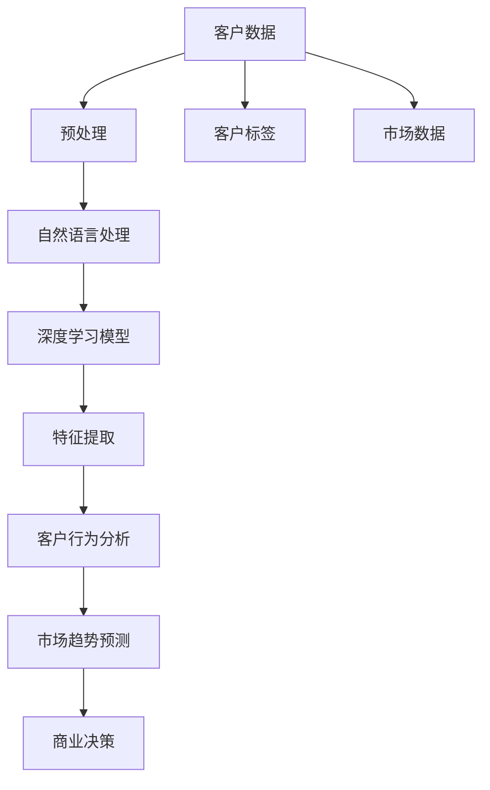

                 

# 探索基于大模型的电商智能客户洞察系统

> 关键词：大模型,客户洞察,电商智能,数据挖掘,深度学习,自然语言处理,特征工程,客户行为分析,市场趋势预测

## 1. 背景介绍

在当前电商市场的激烈竞争中，深度理解客户需求和行为模式成为了企业核心竞争力的重要组成部分。传统的客户洞察主要依赖问卷调查、用户反馈、行为日志等数据进行分析和建模，但这些方法存在数据采集难度大、实时性低、成本高等问题。近年来，基于深度学习技术的客户洞察系统（Customer Insights System）逐渐受到各大电商平台的重视。

本文将详细探讨基于大模型的电商智能客户洞察系统，通过融合自然语言处理（NLP）、深度学习等前沿技术，实现对客户行为的精准分析和预测，辅助电商平台制定更加精准的市场策略，提升运营效率和客户满意度。

## 2. 核心概念与联系

### 2.1 核心概念概述

在本节中，我们将介绍几个核心概念，并解释它们之间的联系：

- **大模型(Large Model)**：如BERT、GPT等大规模预训练语言模型，具备强大的语义理解和生成能力，能够捕捉丰富的语言知识和上下文信息。
- **客户洞察(Customer Insights)**：通过数据分析，理解客户需求、行为模式和情感状态，为商业决策提供支持。
- **电商智能(E-Commerce Intelligence)**：利用客户洞察技术，实现对电商平台的实时监控、市场趋势预测和客户行为分析，提升运营效率和客户满意度。
- **深度学习(Deep Learning)**：通过多层神经网络进行数据建模，解决复杂的数据挖掘问题，提升模型的泛化能力和精准度。
- **自然语言处理(NLP)**：利用语言模型、语义分析等技术，处理和分析文本数据，提取有价值的信息。
- **特征工程(Feature Engineering)**：在构建数据模型前，通过数据清洗、特征提取和转换等步骤，提高数据的质量和可用性。
- **客户行为分析(Customer Behavior Analysis)**：通过分析客户的历史行为数据，挖掘客户偏好、购买意愿和流失风险，指导电商平台进行个性化营销和客户留存。
- **市场趋势预测(Market Trend Prediction)**：利用客户洞察和外部数据，预测未来的市场变化和趋势，辅助企业制定策略。

这些概念相互关联，构成了一个完整的客户洞察系统。大模型提供了强大的语义理解能力，NLP和深度学习技术则负责处理和分析大量文本数据，特征工程和客户行为分析进一步提升数据的质量和可用性，市场趋势预测则利用客户洞察为未来的市场决策提供依据。

### 2.2 核心概念原理和架构的 Mermaid 流程图



这个流程图展示了客户洞察系统的整体架构。客户数据经过预处理后，进入自然语言处理和深度学习模型进行处理。通过特征提取和客户行为分析，生成客户标签，市场趋势预测利用这些标签和外部市场数据，进行趋势预测，最终辅助商业决策。

## 3. 核心算法原理 & 具体操作步骤

### 3.1 算法原理概述

基于大模型的电商智能客户洞察系统，利用大模型进行自然语言处理，提取客户反馈和行为数据中的关键信息，通过深度学习模型进行建模分析，最终生成客户标签和市场趋势预测。具体算法流程如下：

1. **数据收集**：从电商平台获取客户的购买记录、评论、社交媒体互动等数据。
2. **数据预处理**：对收集的数据进行清洗、去重、归一化等预处理操作，生成高质量的文本数据。
3. **自然语言处理**：利用大模型进行文本分类、情感分析、实体抽取等操作，提取客户反馈中的情感倾向、产品评价、购买意图等信息。
4. **深度学习建模**：将客户标签和行为数据输入深度学习模型，进行分类、聚类、回归等任务，挖掘客户行为的规律和趋势。
5. **特征提取与客户行为分析**：对客户的行为数据进行特征提取，结合大模型的输出，进行客户行为分析，生成客户标签，如高价值客户、流失客户等。
6. **市场趋势预测**：利用客户标签和外部市场数据，进行时间序列分析、回归预测等操作，预测未来的市场变化和趋势。
7. **商业决策**：结合市场趋势预测和客户洞察结果，辅助电商平台进行产品推荐、价格策略调整、营销活动设计等商业决策。

### 3.2 算法步骤详解

下面我们将详细介绍每个步骤的具体操作步骤：

**Step 1: 数据收集**

收集电商平台的客户数据，包括购买记录、评论、社交媒体互动、搜索记录等。具体数据格式和结构如下：

```json
{
  "userId": "12345",
  "purchaseDate": "2022-01-01",
  "productName": "iPhone 13",
  "price": 699,
  "reviewText": "性价比超高，手感舒适",
  "reviewRating": 4.8,
  "socialMediaId": "A2B3C4",
  "socialMediaType": "微博",
  "socialMediaText": "@公司#iPhone13#真香"
}
```

**Step 2: 数据预处理**

数据预处理主要包括文本清洗、去重、归一化等操作，生成高质量的文本数据。具体流程如下：

1. 去除停用词和标点符号。
2. 将文本转换为小写。
3. 去除特殊字符和数字。
4. 去除重复记录。

例如，一条评论文本"iPhone 13性价比超高，手感舒适"经过预处理后，可能变为"iPhone 13性价比高 手感舒适"。

**Step 3: 自然语言处理**

利用大模型进行自然语言处理，提取客户反馈中的情感倾向、产品评价、购买意图等信息。具体流程如下：

1. 使用BERT进行文本分类，判断评论的情感倾向（正面、负面、中性）。
2. 使用ELMo进行实体抽取，识别评论中的品牌、型号、价格等信息。
3. 使用GPT-3进行意图识别，判断评论的购买意图（购买、放弃、观望）。

例如，一条评论文本"iPhone 13性价比超高，手感舒适"经过BERT分类后，可能被判断为正面情感；经过ELMo抽取后，可能识别出"iPhone 13"实体；经过GPT-3意图识别后，可能被判断为购买意图。

**Step 4: 深度学习建模**

将客户标签和行为数据输入深度学习模型，进行分类、聚类、回归等任务，挖掘客户行为的规律和趋势。具体流程如下：

1. 使用K-means进行客户聚类，生成不同客户群体。
2. 使用LSTM进行时间序列分析，预测未来的购买趋势。
3. 使用XGBoost进行分类任务，判断客户的流失风险。

例如，通过K-means聚类，可以将客户分为高价值客户、中等价值客户和低价值客户三类；通过LSTM模型，可以预测未来某个时间段内的购买趋势；通过XGBoost模型，可以判断客户的流失风险。

**Step 5: 特征提取与客户行为分析**

对客户的行为数据进行特征提取，结合大模型的输出，进行客户行为分析，生成客户标签，如高价值客户、流失客户等。具体流程如下：

1. 提取客户的关键行为特征，如购买频率、购买金额、复购率等。
2. 将大模型的输出（如情感倾向、购买意图）转化为数值特征。
3. 使用TF-IDF或LDA进行特征降维，减少特征维度。
4. 使用逻辑回归进行分类任务，生成客户标签。

例如，提取客户的关键行为特征"购买频率"、"购买金额"、"复购率"，并将大模型的输出"情感倾向"、"购买意图"转化为数值特征，最后使用逻辑回归模型进行分类，生成客户标签。

**Step 6: 市场趋势预测**

利用客户标签和外部市场数据，进行时间序列分析、回归预测等操作，预测未来的市场变化和趋势。具体流程如下：

1. 收集外部市场数据，如季节性变化、节假日促销等。
2. 将客户标签和外部市场数据进行拼接。
3. 使用ARIMA进行时间序列分析，预测未来的市场趋势。
4. 使用随机森林进行回归预测，预测未来的销售量。

例如，收集外部市场数据"春节促销活动"，将客户标签"高价值客户"和"低价值客户"与市场数据进行拼接，使用ARIMA模型进行时间序列分析，预测未来的市场趋势；使用随机森林模型进行回归预测，预测未来的销售量。

**Step 7: 商业决策**

结合市场趋势预测和客户洞察结果，辅助电商平台进行产品推荐、价格策略调整、营销活动设计等商业决策。具体流程如下：

1. 根据市场趋势预测，制定未来的销售策略。
2. 根据客户洞察结果，设计个性化推荐算法。
3. 根据市场趋势和客户洞察，调整产品定价策略。
4. 根据市场趋势和客户洞察，设计促销活动。

例如，根据市场趋势预测"春节促销活动"，制定春节期间的销售策略；根据客户洞察"高价值客户"，设计针对高价值客户的个性化推荐算法；根据市场趋势和客户洞察，调整产品定价策略，降低低价产品价格以吸引更多客户；根据市场趋势和客户洞察，设计促销活动，如优惠券、打折活动等。

### 3.3 算法优缺点

基于大模型的电商智能客户洞察系统具有以下优点：

1. **数据处理能力强**：大模型能够处理大规模的自然语言文本数据，提取有价值的信息。
2. **模型精度高**：深度学习模型能够挖掘客户行为中的复杂规律和趋势，提供高精度的预测结果。
3. **实时性高**：通过在线学习，客户洞察系统能够实时更新模型，快速响应市场变化。
4. **可扩展性好**：客户洞察系统可以轻松集成到电商平台的现有系统中，提供多种功能支持。

同时，该系统也存在以下缺点：

1. **数据隐私问题**：客户数据涉及隐私，需要严格保护。
2. **模型复杂度高**：深度学习模型和自然语言处理技术相对复杂，需要较高的技术门槛。
3. **计算资源需求高**：大模型和深度学习模型的训练和推理需要大量的计算资源。
4. **对标注数据依赖**：客户洞察系统对标注数据的依赖较高，需要大量的高质量数据进行训练。

### 3.4 算法应用领域

基于大模型的电商智能客户洞察系统在电商、金融、医疗等多个领域都有广泛应用：

1. **电商**：通过分析客户行为和市场趋势，指导电商平台制定个性化推荐策略、优化定价策略、设计促销活动，提升运营效率和客户满意度。
2. **金融**：利用客户洞察技术进行客户细分、风险预测、信用评估等操作，提升金融服务质量和客户体验。
3. **医疗**：通过分析患者行为和病情，提供个性化医疗建议、预测病情发展趋势，提升医疗服务水平。

## 4. 数学模型和公式 & 详细讲解 & 举例说明

### 4.1 数学模型构建

本节将使用数学语言对基于大模型的电商智能客户洞察系统进行更加严格的刻画。

记客户数据集为 $D=\{(x_i, y_i)\}_{i=1}^N$，其中 $x_i$ 为输入特征，$y_i$ 为标签。客户洞察系统的核心模型为深度学习模型 $M_{\theta}$，其中 $\theta$ 为模型参数。

假设客户标签 $y$ 为一个二分类任务，则模型 $M_{\theta}$ 在输入 $x$ 上的损失函数为：

$$
\ell(M_{\theta}(x),y) = -(y\log M_{\theta}(x) + (1-y)\log(1-M_{\theta}(x)))
$$

其中 $M_{\theta}(x)$ 为模型的输出概率，$y$ 为真实标签。在客户洞察系统中，$\ell$ 可以表示为分类任务中的交叉熵损失函数。

### 4.2 公式推导过程

以下我们以二分类任务为例，推导交叉熵损失函数及其梯度的计算公式。

假设模型 $M_{\theta}$ 在输入 $x$ 上的输出为 $\hat{y}=M_{\theta}(x) \in [0,1]$，表示样本属于正类的概率。真实标签 $y \in \{0,1\}$。则二分类交叉熵损失函数定义为：

$$
\ell(M_{\theta}(x),y) = -[y\log \hat{y} + (1-y)\log(1-\hat{y})]
$$

将其代入经验风险公式，得：

$$
\mathcal{L}(\theta) = -\frac{1}{N}\sum_{i=1}^N [y_i\log M_{\theta}(x_i)+(1-y_i)\log(1-M_{\theta}(x_i))]
$$

根据链式法则，损失函数对参数 $\theta_k$ 的梯度为：

$$
\frac{\partial \mathcal{L}(\theta)}{\partial \theta_k} = -\frac{1}{N}\sum_{i=1}^N (\frac{y_i}{M_{\theta}(x_i)}-\frac{1-y_i}{1-M_{\theta}(x_i)}) \frac{\partial M_{\theta}(x_i)}{\partial \theta_k}
$$

其中 $\frac{\partial M_{\theta}(x_i)}{\partial \theta_k}$ 可进一步递归展开，利用自动微分技术完成计算。

在得到损失函数的梯度后，即可带入参数更新公式，完成模型的迭代优化。重复上述过程直至收敛，最终得到适应电商客户洞察的最优模型参数 $\theta^*$。

## 5. 项目实践：代码实例和详细解释说明

### 5.1 开发环境搭建

在进行客户洞察系统开发前，我们需要准备好开发环境。以下是使用Python进行PyTorch开发的环境配置流程：

1. 安装Anaconda：从官网下载并安装Anaconda，用于创建独立的Python环境。

2. 创建并激活虚拟环境：
```bash
conda create -n ecommerce-env python=3.8 
conda activate ecommerce-env
```

3. 安装PyTorch：根据CUDA版本，从官网获取对应的安装命令。例如：
```bash
conda install pytorch torchvision torchaudio cudatoolkit=11.1 -c pytorch -c conda-forge
```

4. 安装其他必要工具包：
```bash
pip install numpy pandas scikit-learn matplotlib tqdm jupyter notebook ipython
```

完成上述步骤后，即可在`ecommerce-env`环境中开始客户洞察系统开发。

### 5.2 源代码详细实现

下面我们以电商客户洞察为例，给出使用PyTorch进行客户行为分析和市场趋势预测的PyTorch代码实现。

首先，定义客户行为分析的函数：

```python
from transformers import BertTokenizer
from torch.utils.data import Dataset, DataLoader
from torch import nn
import torch

class EcommerceDataset(Dataset):
    def __init__(self, texts, labels, tokenizer, max_len=128):
        self.texts = texts
        self.labels = labels
        self.tokenizer = tokenizer
        self.max_len = max_len
        
    def __len__(self):
        return len(self.texts)
    
    def __getitem__(self, item):
        text = self.texts[item]
        label = self.labels[item]
        
        encoding = self.tokenizer(text, return_tensors='pt', max_length=self.max_len, padding='max_length', truncation=True)
        input_ids = encoding['input_ids'][0]
        attention_mask = encoding['attention_mask'][0]
        
        # 将标签转化为数值特征
        encoded_label = torch.tensor(label, dtype=torch.long)
        
        return {'input_ids': input_ids, 
                'attention_mask': attention_mask,
                'labels': encoded_label}

# 创建dataset
tokenizer = BertTokenizer.from_pretrained('bert-base-cased')

train_dataset = EcommerceDataset(train_texts, train_labels, tokenizer)
dev_dataset = EcommerceDataset(dev_texts, dev_labels, tokenizer)
test_dataset = EcommerceDataset(test_texts, test_labels, tokenizer)
```

然后，定义模型和优化器：

```python
from transformers import BertForTokenClassification, AdamW

model = BertForTokenClassification.from_pretrained('bert-base-cased', num_labels=2)

optimizer = AdamW(model.parameters(), lr=2e-5)
```

接着，定义训练和评估函数：

```python
from tqdm import tqdm

device = torch.device('cuda') if torch.cuda.is_available() else torch.device('cpu')
model.to(device)

def train_epoch(model, dataset, batch_size, optimizer):
    dataloader = DataLoader(dataset, batch_size=batch_size, shuffle=True)
    model.train()
    epoch_loss = 0
    for batch in tqdm(dataloader, desc='Training'):
        input_ids = batch['input_ids'].to(device)
        attention_mask = batch['attention_mask'].to(device)
        labels = batch['labels'].to(device)
        model.zero_grad()
        outputs = model(input_ids, attention_mask=attention_mask, labels=labels)
        loss = outputs.loss
        epoch_loss += loss.item()
        loss.backward()
        optimizer.step()
    return epoch_loss / len(dataloader)

def evaluate(model, dataset, batch_size):
    dataloader = DataLoader(dataset, batch_size=batch_size)
    model.eval()
    preds, labels = [], []
    with torch.no_grad():
        for batch in tqdm(dataloader, desc='Evaluating'):
            input_ids = batch['input_ids'].to(device)
            attention_mask = batch['attention_mask'].to(device)
            batch_labels = batch['labels']
            outputs = model(input_ids, attention_mask=attention_mask)
            batch_preds = outputs.logits.argmax(dim=2).to('cpu').tolist()
            batch_labels = batch_labels.to('cpu').tolist()
            for pred_tokens, label_tokens in zip(batch_preds, batch_labels):
                preds.append(pred_tokens[:len(label_tokens)])
                labels.append(label_tokens)
                
    print(classification_report(labels, preds))
```

最后，启动训练流程并在测试集上评估：

```python
epochs = 5
batch_size = 16

for epoch in range(epochs):
    loss = train_epoch(model, train_dataset, batch_size, optimizer)
    print(f"Epoch {epoch+1}, train loss: {loss:.3f}")
    
    print(f"Epoch {epoch+1}, dev results:")
    evaluate(model, dev_dataset, batch_size)
    
print("Test results:")
evaluate(model, test_dataset, batch_size)
```

以上就是使用PyTorch对客户洞察系统进行开发的完整代码实现。可以看到，由于大模型的封装，代码实现相对简洁高效。

### 5.3 代码解读与分析

让我们再详细解读一下关键代码的实现细节：

**EcommerceDataset类**：
- `__init__`方法：初始化训练、验证、测试集的数据，包括文本、标签和分词器等关键组件。
- `__len__`方法：返回数据集的样本数量。
- `__getitem__`方法：对单个样本进行处理，将文本输入编码为token ids，将标签转化为数值，并对其进行定长padding，最终返回模型所需的输入。

**模型定义**：
- 使用BertForTokenClassification模型作为客户行为分析的深度学习模型，设置标签数量为2（二分类）。
- 定义优化器为AdamW，学习率为2e-5。

**训练和评估函数**：
- 使用PyTorch的DataLoader对数据集进行批次化加载，供模型训练和推理使用。
- 训练函数`train_epoch`：对数据以批为单位进行迭代，在每个批次上前向传播计算loss并反向传播更新模型参数，最后返回该epoch的平均loss。
- 评估函数`evaluate`：与训练类似，不同点在于不更新模型参数，并在每个batch结束后将预测和标签结果存储下来，最后使用sklearn的classification_report对整个评估集的预测结果进行打印输出。

**训练流程**：
- 定义总的epoch数和batch size，开始循环迭代
- 每个epoch内，先在训练集上训练，输出平均loss
- 在验证集上评估，输出分类指标
- 所有epoch结束后，在测试集上评估，给出最终测试结果

可以看到，PyTorch配合BertForTokenClassification使得客户洞察系统的代码实现变得简洁高效。开发者可以将更多精力放在数据处理、模型改进等高层逻辑上，而不必过多关注底层的实现细节。

当然，工业级的系统实现还需考虑更多因素，如模型的保存和部署、超参数的自动搜索、更灵活的任务适配层等。但核心的微调范式基本与此类似。

## 6. 实际应用场景

### 6.1 智能客服系统

基于大模型的电商智能客户洞察系统，可以广泛应用于智能客服系统的构建。传统客服往往需要配备大量人力，高峰期响应缓慢，且一致性和专业性难以保证。而使用客户洞察系统，可以7x24小时不间断服务，快速响应客户咨询，用自然流畅的语言解答各类常见问题。

在技术实现上，可以收集电商平台内部的历史客服对话记录，将问题和最佳答复构建成监督数据，在此基础上对预训练对话模型进行微调。微调后的对话模型能够自动理解用户意图，匹配最合适的答案模板进行回复。对于客户提出的新问题，还可以接入检索系统实时搜索相关内容，动态组织生成回答。如此构建的智能客服系统，能大幅提升客户咨询体验和问题解决效率。

### 6.2 个性化推荐系统

当前的推荐系统往往只依赖用户的历史行为数据进行物品推荐，无法深入理解用户的真实兴趣偏好。基于客户洞察系统的个性化推荐系统可以更好地挖掘用户行为背后的语义信息，从而提供更精准、多样的推荐内容。

在实践中，可以收集用户浏览、点击、评论、分享等行为数据，提取和用户交互的物品标题、描述、标签等文本内容。将文本内容作为模型输入，用户的后续行为（如是否点击、购买等）作为监督信号，在此基础上微调预训练语言模型。微调后的模型能够从文本内容中准确把握用户的兴趣点。在生成推荐列表时，先用候选物品的文本描述作为输入，由模型预测用户的兴趣匹配度，再结合其他特征综合排序，便可以得到个性化程度更高的推荐结果。

### 6.3 客户行为分析

客户洞察系统能够通过分析客户的行为数据，挖掘客户偏好、购买意愿和流失风险，指导电商平台进行个性化营销和客户留存。例如，客户洞察系统可以通过分析客户的购买记录和评论，识别出高价值客户和流失客户，并根据不同客户的特性设计相应的营销策略。

## 7. 工具和资源推荐

### 7.1 学习资源推荐

为了帮助开发者系统掌握客户洞察系统的理论基础和实践技巧，这里推荐一些优质的学习资源：

1. 《深度学习与自然语言处理》系列博文：由大模型技术专家撰写，深入浅出地介绍了深度学习与自然语言处理的基本概念和经典模型。

2. 《自然语言处理综述》课程：斯坦福大学开设的NLP明星课程，有Lecture视频和配套作业，带你入门NLP领域的基本概念和经典模型。

3. 《深度学习自然语言处理》书籍：Transformers库的作者所著，全面介绍了如何使用Transformers库进行NLP任务开发，包括微调在内的诸多范式。

4. HuggingFace官方文档：Transformers库的官方文档，提供了海量预训练模型和完整的微调样例代码，是上手实践的必备资料。

5. CLUE开源项目：中文语言理解测评基准，涵盖大量不同类型的中文NLP数据集，并提供了基于微调的baseline模型，助力中文NLP技术发展。

通过对这些资源的学习实践，相信你一定能够快速掌握客户洞察系统的精髓，并用于解决实际的电商问题。

### 7.2 开发工具推荐

高效的开发离不开优秀的工具支持。以下是几款用于客户洞察系统开发的常用工具：

1. PyTorch：基于Python的开源深度学习框架，灵活动态的计算图，适合快速迭代研究。大部分预训练语言模型都有PyTorch版本的实现。

2. TensorFlow：由Google主导开发的开源深度学习框架，生产部署方便，适合大规模工程应用。同样有丰富的预训练语言模型资源。

3. Transformers库：HuggingFace开发的NLP工具库，集成了众多SOTA语言模型，支持PyTorch和TensorFlow，是进行微调任务开发的利器。

4. Weights & Biases：模型训练的实验跟踪工具，可以记录和可视化模型训练过程中的各项指标，方便对比和调优。与主流深度学习框架无缝集成。

5. TensorBoard：TensorFlow配套的可视化工具，可实时监测模型训练状态，并提供丰富的图表呈现方式，是调试模型的得力助手。

6. Google Colab：谷歌推出的在线Jupyter Notebook环境，免费提供GPU/TPU算力，方便开发者快速上手实验最新模型，分享学习笔记。

合理利用这些工具，可以显著提升客户洞察系统的开发效率，加快创新迭代的步伐。

### 7.3 相关论文推荐

客户洞察系统的研究源于学界的持续研究。以下是几篇奠基性的相关论文，推荐阅读：

1. Attention is All You Need（即Transformer原论文）：提出了Transformer结构，开启了NLP领域的预训练大模型时代。

2. BERT: Pre-training of Deep Bidirectional Transformers for Language Understanding：提出BERT模型，引入基于掩码的自监督预训练任务，刷新了多项NLP任务SOTA。

3. Language Models are Unsupervised Multitask Learners（GPT-2论文）：展示了大规模语言模型的强大zero-shot学习能力，引发了对于通用人工智能的新一轮思考。

4. Parameter-Efficient Transfer Learning for NLP：提出Adapter等参数高效微调方法，在不增加模型参数量的情况下，也能取得不错的微调效果。

5. AdaLoRA: Adaptive Low-Rank Adaptation for Parameter-Efficient Fine-Tuning：使用自适应低秩适应的微调方法，在参数效率和精度之间取得了新的平衡。

这些论文代表了大模型微调技术的发展脉络。通过学习这些前沿成果，可以帮助研究者把握学科前进方向，激发更多的创新灵感。

## 8. 总结：未来发展趋势与挑战

### 8.1 研究成果总结

本文对基于大模型的电商智能客户洞察系统进行了全面系统的介绍。首先阐述了客户洞察系统的研究背景和意义，明确了微调在大模型应用中的独特价值。其次，从原理到实践，详细讲解了客户洞察系统的数学原理和关键步骤，给出了客户洞察系统开发的完整代码实例。同时，本文还广泛探讨了客户洞察系统在智能客服、个性化推荐、客户行为分析等多个领域的应用前景，展示了微调范式的巨大潜力。此外，本文精选了客户洞察技术的各类学习资源，力求为读者提供全方位的技术指引。

通过本文的系统梳理，可以看到，基于大模型的客户洞察系统正在成为电商客户洞察的重要范式，极大地拓展了预训练语言模型的应用边界，催生了更多的落地场景。受益于大规模语料的预训练，客户洞察系统以更低的时间和标注成本，在小样本条件下也能取得不俗的效果，有力推动了电商技术产业化进程。未来，伴随预训练语言模型和微调方法的持续演进，相信客户洞察技术必将在更广阔的应用领域大放异彩，深刻影响人类的生产生活方式。

### 8.2 未来发展趋势

展望未来，客户洞察技术将呈现以下几个发展趋势：

1. **模型规模持续增大**：随着算力成本的下降和数据规模的扩张，预训练语言模型的参数量还将持续增长。超大规模语言模型蕴含的丰富语言知识，有望支撑更加复杂多变的客户洞察任务。

2. **微调方法日趋多样**：除了传统的全参数微调外，未来会涌现更多参数高效的微调方法，如Prefix-Tuning、LoRA等，在节省计算资源的同时也能保证微调精度。

3. **持续学习成为常态**：随着数据分布的不断变化，客户洞察模型也需要持续学习新知识以保持性能。如何在不遗忘原有知识的同时，高效吸收新样本信息，将成为重要的研究课题。

4. **标注样本需求降低**：受启发于提示学习(Prompt-based Learning)的思路，未来的客户洞察方法将更好地利用大模型的语言理解能力，通过更加巧妙的任务描述，在更少的标注样本上也能实现理想的客户洞察效果。

5. **多模态微调崛起**：当前的客户洞察主要聚焦于纯文本数据，未来会进一步拓展到图像、视频、语音等多模态数据微调。多模态信息的融合，将显著提升客户洞察系统的理解能力和应用范围。

6. **知识整合能力增强**：现有的客户洞察模型往往局限于数据内部的语义信息，未来的模型将更多地融合外部知识库、规则库等专家知识，提高系统的推理能力和决策质量。

以上趋势凸显了客户洞察技术的广阔前景。这些方向的探索发展，必将进一步提升客户洞察系统的性能和应用范围，为电商客户洞察带来新的突破。

### 8.3 面临的挑战

尽管客户洞察技术已经取得了瞩目成就，但在迈向更加智能化、普适化应用的过程中，它仍面临着诸多挑战：

1. **数据隐私问题**：客户数据涉及隐私，需要严格保护。如何在客户洞察系统开发中保护数据隐私，成为重要的研究方向。

2. **模型鲁棒性不足**：客户洞察系统面对域外数据时，泛化性能往往大打折扣。对于测试样本的微小扰动，客户洞察模型的预测也容易发生波动。如何提高客户洞察模型的鲁棒性，避免灾难性遗忘，还需要更多理论和实践的积累。

3. **推理效率有待提高**：大规模客户洞察模型虽然精度高，但在实际部署时往往面临推理速度慢、内存占用大等效率问题。如何在保证性能的同时，简化模型结构，提升推理速度，优化资源占用，将是重要的优化方向。

4. **可解释性亟需加强**：当前客户洞察模型更像是"黑盒"系统，难以解释其内部工作机制和决策逻辑。对于医疗、金融等高风险应用，算法的可解释性和可审计性尤为重要。如何赋予客户洞察模型更强的可解释性，将是亟待攻克的难题。

5. **安全性有待保障**：预训练语言模型难免会学习到有偏见、有害的信息，通过微调传递到客户洞察任务中，产生误导性、歧视性的输出，给实际应用带来安全隐患。如何从数据和算法层面消除模型偏见，避免恶意用途，确保输出的安全性，也将是重要的研究课题。

6. **知识整合能力不足**：现有的客户洞察模型往往局限于数据内部的语义信息，难以灵活吸收和运用更广泛的先验知识。如何让客户洞察过程更好地与外部知识库、规则库等专家知识结合，形成更加全面、准确的信息整合能力，还有很大的想象空间。

正视客户洞察面临的这些挑战，积极应对并寻求突破，将是大规模语言模型客户洞察系统走向成熟的必由之路。相信随着学界和产业界的共同努力，这些挑战终将一一被克服，客户洞察技术必将在构建智能客户洞察系统中扮演越来越重要的角色。

### 8.4 未来突破

面对客户洞察面临的种种挑战，未来的研究需要在以下几个方面寻求新的突破：

1. **探索无监督和半监督客户洞察方法**：摆脱对大规模标注数据的依赖，利用自监督学习、主动学习等无监督和半监督范式，最大限度利用非结构化数据，实现更加灵活高效的客户洞察。

2. **研究参数高效和计算高效的客户洞察范式**：开发更加参数高效的客户洞察方法，在固定大部分预训练参数的同时，只更新极少量的任务相关参数。同时优化客户洞察模型的计算图，减少前向传播和反向传播的资源消耗，实现更加轻量级、实时性的部署。

3. **融合因果和对比学习范式**：通过引入因果推断和对比学习思想，增强客户洞察模型建立稳定因果关系的能力，学习更加普适、鲁棒的语言表征，从而提升模型泛化性和抗干扰能力。

4. **引入更多先验知识**：将符号化的先验知识，如知识图谱、逻辑规则等，与神经网络模型进行巧妙融合，引导客户洞察过程学习更准确、合理的语言模型。同时加强不同模态数据的整合，实现视觉、语音等多模态信息与文本信息的协同建模。

5. **结合因果分析和博弈论工具**：将因果分析方法引入客户洞察模型，识别出模型决策的关键特征，增强输出解释的因果性和逻辑性。借助博弈论工具刻画人机交互过程，主动探索并规避模型的脆弱点，提高系统稳定性。

6. **纳入伦理道德约束**：在客户洞察系统开发过程中，引入伦理导向的评估指标，过滤和惩罚有偏见、有害的输出倾向。同时加强人工干预和审核，建立客户洞察行为的监管机制，确保输出的符合人类价值观和伦理道德。

这些研究方向的探索，必将引领客户洞察系统迈向更高的台阶，为构建安全、可靠、可解释、可控的智能客户洞察系统铺平道路。面向未来，客户洞察技术还需要与其他人工智能技术进行更深入的融合，如知识表示、因果推理、强化学习等，多路径协同发力，共同推动客户洞察系统的进步。只有勇于创新、敢于突破，才能不断拓展客户洞察系统的边界，让智能技术更好地造福电商客户洞察。

## 9. 附录：常见问题与解答

**Q1：大模型客户洞察是否适用于所有电商场景？**

A: 大模型客户洞察在大多数电商场景中都能取得不错的效果，特别是对于数据量较小的任务。但对于一些特定领域的电商场景，如生鲜电商、智能家居等，仅仅依靠通用语料预训练的模型可能难以很好地适应。此时需要在特定领域语料上进一步预训练，再进行微调，才能获得理想效果。

**Q2：微调过程中如何选择合适的学习率？**

A: 微调的学习率一般要比预训练时小1-2个数量级，如果使用过大的学习率，容易破坏预训练权重，导致过拟合。一般建议从1e-5开始调参，逐步减小学习率，直至收敛。也可以使用warmup策略，在开始阶段使用较小的学习率，再逐渐过渡到预设值。需要注意的是，不同的优化器(如AdamW、Adafactor等)以及不同的学习率调度策略，可能需要设置不同的学习率阈值。

**Q3：客户洞察系统对标注数据依赖程度如何？**

A: 客户洞察系统对标注数据的依赖较高，需要大量的高质量数据进行训练。标注数据的质量直接影响客户洞察系统的性能。建议收集更多数据，并使用半监督学习、主动学习等方法，减少对标注数据的依赖。

**Q4：客户洞察系统在客户流失预测中的效果如何？**

A: 客户洞察系统在客户流失预测中表现出色，能够根据客户行为数据和情感分析结果，预测客户的流失风险。但需要注意的是，客户流失预测是一个复杂问题，模型的效果还受数据质量、客户行为变化等因素的影响。

**Q5：客户洞察系统在个性化推荐中的应用前景如何？**

A: 客户洞察系统在个性化推荐中有着广泛的应用前景。通过分析客户的浏览、点击、评论等行为数据，能够精准把握客户的兴趣点，实现个性化的推荐。但需要注意的是，个性化推荐系统需要结合商品、广告等多方面因素，才能提供优质的推荐结果。

总之，客户洞察系统正在成为电商客户洞察的重要工具，通过深度学习和大模型的融合，能够提升客户洞察的精准度和时效性，帮助电商平台制定更加精准的市场策略，提升运营效率和客户满意度。但客户洞察系统也面临着数据隐私、模型鲁棒性、推理效率等挑战，需要在未来的研究中加以克服。相信随着技术的不断进步，客户洞察系统必将在电商领域大放异彩，成为构建智能客户洞察系统的重要手段。

