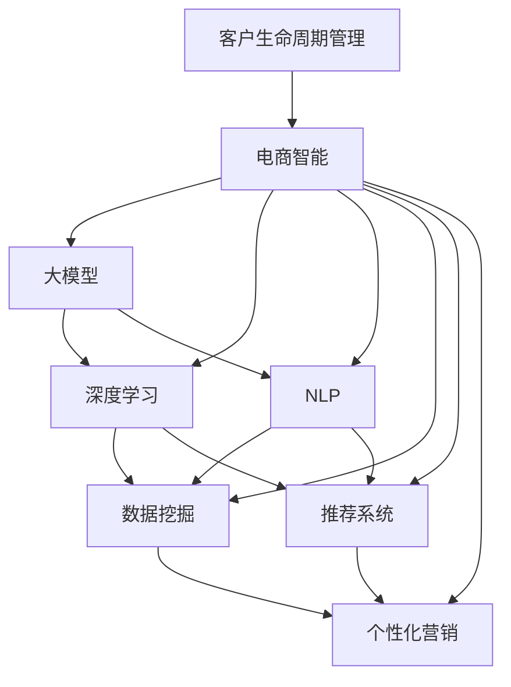

                 

# 探索基于大模型的电商智能客户生命周期管理系统

> 关键词：客户生命周期管理, 电商智能, 大模型, 深度学习, 自然语言处理(NLP), 数据挖掘, 推荐系统, 个性化营销

## 1. 背景介绍

随着电子商务的蓬勃发展，客户生命周期管理（Customer Lifecycle Management, CLM）已成为电商企业提升客户满意度和忠诚度的关键手段。通过系统地管理和分析客户的全生命周期数据，企业能够更好地预测客户行为、制定策略、优化产品和服务，从而提高运营效率和盈利能力。传统的CLM系统通常基于规则和统计模型，无法充分利用海量客户数据中的深层次知识。因此，如何构建更加智能、高效的客户生命周期管理系统，成为了当前电商企业的迫切需求。

近年来，深度学习和大模型在自然语言处理（NLP）和数据分析领域取得了显著进展，通过预训练语言模型和迁移学习等技术，可以实现对客户行为和情感的深度理解。这些技术在客户生命周期管理中的应用，有望带来革命性的突破。本文旨在探讨基于大模型的电商智能客户生命周期管理系统，重点关注客户获取、客户互动、客户反馈和客户流失等关键阶段的管理和优化。

## 2. 核心概念与联系

### 2.1 核心概念概述

为了更好地理解电商智能客户生命周期管理系统，我们需要了解一些关键概念：

- **客户生命周期管理（CLM）**：指对客户的全生命周期数据进行收集、分析、管理和应用，以提升客户满意度和忠诚度，增加客户价值。
- **电商智能**：利用人工智能技术，特别是深度学习和自然语言处理技术，对电商业务进行智能化升级，提高运营效率和客户体验。
- **大模型**：指通过大规模无标签数据进行预训练的语言模型，如BERT、GPT等，具备强大的语言理解和生成能力，可用于各种NLP任务。
- **深度学习**：一种基于神经网络的机器学习方法，能够通过多层次的非线性变换，自动从数据中提取特征，用于分类、回归、生成等任务。
- **自然语言处理（NLP）**：涉及计算机对自然语言进行处理和理解的技术，包括语言模型、文本分类、情感分析等。
- **数据挖掘**：从大量数据中提取有用信息、模式和知识的过程，用于客户行为预测和推荐系统等。
- **推荐系统**：通过用户行为数据，推荐系统能够预测用户对商品的兴趣，生成个性化推荐列表，提升用户体验和销售转化率。
- **个性化营销**：根据用户特征和行为数据，制定个性化的营销策略，提高营销效果和用户满意度。

这些核心概念之间的逻辑关系可以通过以下Mermaid流程图来展示：



这个流程图展示了大模型在电商智能客户生命周期管理系统中的核心作用，以及各个技术模块之间的联系。

## 3. 核心算法原理 & 具体操作步骤

### 3.1 算法原理概述

基于大模型的电商智能客户生命周期管理系统，主要基于监督学习和迁移学习原理，通过深度学习模型对客户全生命周期的行为数据进行分析，从而实现对客户行为的预测和干预。其核心算法包括以下几个步骤：

1. **数据预处理**：收集客户全生命周期中的行为数据，包括购买记录、浏览记录、评价记录等，并进行清洗和标准化处理。
2. **客户分群**：利用大模型对客户进行聚类分析，将客户分为不同的群体，识别高价值客户和潜在流失客户。
3. **行为预测**：通过监督学习算法，训练模型预测客户的未来行为，如购买概率、流失风险等。
4. **推荐系统**：利用大模型构建个性化推荐系统，为不同客户群体生成个性化推荐商品。
5. **营销策略优化**：根据预测结果和推荐结果，设计个性化的营销策略，提升客户满意度和忠诚度。

### 3.2 算法步骤详解

#### 3.2.1 数据预处理

客户数据预处理是构建电商智能客户生命周期管理系统的第一步。主要包括数据收集、清洗、标准化等步骤：

- **数据收集**：收集客户全生命周期的行为数据，包括购买记录、浏览记录、评价记录、社交媒体互动等。
- **数据清洗**：去除异常值和噪声数据，处理缺失值和重复记录，保证数据质量。
- **数据标准化**：将不同来源的数据进行格式和单位统一，便于后续分析和建模。

#### 3.2.2 客户分群

客户分群是识别不同客户群体的过程，可通过聚类算法或大模型来实现。以K-means聚类算法为例，其步骤包括：

1. **特征提取**：从清洗后的客户数据中提取有意义的特征，如购买频率、平均消费金额、活跃度等。
2. **模型训练**：使用K-means算法对客户数据进行聚类分析，确定不同的客户群体。
3. **标签映射**：将每个客户分配到对应的客户群体中，并标注群体的特征属性。

#### 3.2.3 行为预测

行为预测是预测客户未来行为的过程，可利用监督学习算法，如回归模型、分类模型等。以线性回归模型为例，其步骤包括：

1. **特征工程**：构建特征向量，包括客户基本信息、行为数据等。
2. **模型训练**：使用训练集训练线性回归模型，拟合客户行为数据。
3. **模型评估**：使用测试集评估模型性能，调整模型参数和特征。

#### 3.2.4 推荐系统

推荐系统是生成个性化推荐商品的过程，可通过协同过滤、基于内容的推荐等方法。以基于内容的推荐为例，其步骤包括：

1. **特征提取**：从商品和客户数据中提取特征，如商品描述、客户兴趣、历史购买记录等。
2. **模型训练**：使用训练集训练推荐模型，预测客户对商品的兴趣。
3. **推荐生成**：根据模型预测结果，生成个性化推荐商品列表。

#### 3.2.5 营销策略优化

营销策略优化是设计个性化营销策略的过程，可根据行为预测和推荐结果，制定相应的策略。以邮件营销为例，其步骤包括：

1. **客户分组**：根据预测结果和推荐结果，将客户分为不同的营销组。
2. **策略设计**：根据分组结果，设计个性化的营销邮件内容。
3. **效果评估**：监测邮件营销效果，调整邮件内容和发送策略。

### 3.3 算法优缺点

基于大模型的电商智能客户生命周期管理系统具有以下优点：

1. **高效性**：利用大模型能够自动提取特征，快速处理大量客户数据，提升分析和预测效率。
2. **准确性**：通过深度学习和迁移学习，系统能够从数据中挖掘深层次知识，提升预测和推荐的准确性。
3. **可解释性**：大模型提供了模型内部的详细解释，有助于理解客户行为和营销策略的效果。
4. **可扩展性**：系统可扩展性强，能够处理不同类型的客户数据和推荐需求。

同时，该系统也存在一些局限性：

1. **数据依赖**：系统高度依赖客户数据质量，数据收集和处理成本较高。
2. **模型复杂性**：大模型和深度学习模型较复杂，需要高计算资源和专业知识。
3. **隐私问题**：客户数据涉及隐私保护，需要采取严格的隐私保护措施。
4. **公平性问题**：大模型可能学习到数据中的偏见，需要进行公平性评估和调整。

### 3.4 算法应用领域

基于大模型的电商智能客户生命周期管理系统，可以广泛应用于以下领域：

1. **客户获取**：通过推荐系统和个性化营销，提升新客户转化率，降低获客成本。
2. **客户互动**：通过智能客服和聊天机器人，提升客户互动体验，提高客户满意度。
3. **客户反馈**：通过情感分析和大模型，分析客户反馈，优化产品和服务。
4. **客户流失**：通过预测客户流失风险，采取措施提升客户忠诚度，减少流失率。
5. **客户生命周期管理**：通过系统整合，实现客户全生命周期的管理和优化，提升运营效率。

## 4. 数学模型和公式 & 详细讲解 & 举例说明

### 4.1 数学模型构建

基于大模型的电商智能客户生命周期管理系统，主要涉及以下几个数学模型：

- **线性回归模型**：用于预测客户行为，如购买概率。模型公式为：
  $$
  y = \theta_0 + \theta_1 x_1 + \theta_2 x_2 + \cdots + \theta_n x_n
  $$
  其中 $y$ 为预测结果，$x_i$ 为输入特征，$\theta_i$ 为模型参数。

- **K-means聚类算法**：用于客户分群，模型公式为：
  $$
  K=\min_{K} \sum_{i=1}^{K} \sum_{x \in C_i} ||x - \mu_i||^2
  $$
  其中 $K$ 为聚类数，$C_i$ 为第 $i$ 个聚类，$\mu_i$ 为聚类中心。

- **协同过滤推荐算法**：用于个性化推荐，模型公式为：
  $$
  \hat{y} = \alpha \hat{y}_{CF} + \beta \hat{y}_{CB}
  $$
  其中 $\hat{y}$ 为推荐结果，$\hat{y}_{CF}$ 为协同过滤推荐结果，$\hat{y}_{CB}$ 为基于内容的推荐结果，$\alpha$ 和 $\beta$ 为权重系数。

### 4.2 公式推导过程

以下我们以线性回归模型为例，推导其公式及其梯度计算：

假设训练集为 $D=\{(x_i, y_i)\}_{i=1}^N$，模型参数为 $\theta=(\theta_0, \theta_1, \cdots, \theta_n)$，则最小二乘法的损失函数为：
$$
L(\theta) = \frac{1}{2N} \sum_{i=1}^N (y_i - (\theta_0 + \theta_1 x_{i1} + \cdots + \theta_n x_{in}))^2
$$

最小化损失函数，求偏导数得：
$$
\frac{\partial L}{\partial \theta_k} = \frac{1}{N} \sum_{i=1}^N (y_i - (\theta_0 + \theta_1 x_{i1} + \cdots + \theta_n x_{in}))(x_{ik})
$$

在反向传播算法下，通过前向传播计算每个样本的输出，反向传播计算梯度，更新模型参数 $\theta_k$：
$$
\theta_k \leftarrow \theta_k - \eta \frac{\partial L}{\partial \theta_k}
$$

其中 $\eta$ 为学习率，用于控制参数更新的步长。

### 4.3 案例分析与讲解

假设某电商企业想要预测客户的购买概率，使用线性回归模型。训练集包含客户基本信息和行为数据，预测客户在未来一个月内是否购买商品。

**特征工程**：
- 基本信息：年龄、性别、注册时间、地区等。
- 行为数据：浏览记录、购买记录、评价记录等。

**模型训练**：
- 构建特征向量 $x = (x_1, x_2, \cdots, x_n)$。
- 使用训练集 $D$ 训练线性回归模型，得到模型参数 $\theta$。
- 使用测试集评估模型性能，调整模型参数。

**预测生成**：
- 对新客户数据 $x'$ 进行预测，计算 $y' = \theta_0 + \theta_1 x'_1 + \cdots + \theta_n x'_n$。
- 根据预测结果，制定个性化的营销策略。

## 5. 项目实践：代码实例和详细解释说明

### 5.1 开发环境搭建

在进行系统开发前，需要准备好开发环境。以下是使用Python进行PyTorch开发的环境配置流程：

1. 安装Anaconda：从官网下载并安装Anaconda，用于创建独立的Python环境。
2. 创建并激活虚拟环境：
```bash
conda create -n pytorch-env python=3.8 
conda activate pytorch-env
```
3. 安装PyTorch：根据CUDA版本，从官网获取对应的安装命令。例如：
```bash
conda install pytorch torchvision torchaudio cudatoolkit=11.1 -c pytorch -c conda-forge
```
4. 安装Transformers库：
```bash
pip install transformers
```
5. 安装各类工具包：
```bash
pip install numpy pandas scikit-learn matplotlib tqdm jupyter notebook ipython
```

完成上述步骤后，即可在`pytorch-env`环境中开始系统开发。

### 5.2 源代码详细实现

下面我们以电商推荐系统为例，给出使用PyTorch和Transformers库进行电商推荐系统开发的完整代码实现。

首先，定义推荐系统的数据处理函数：

```python
from transformers import BertTokenizer
from torch.utils.data import Dataset
import torch

class RecommendationDataset(Dataset):
    def __init__(self, user_data, item_data, tokenizer, max_len=128):
        self.user_data = user_data
        self.item_data = item_data
        self.tokenizer = tokenizer
        self.max_len = max_len
        
    def __len__(self):
        return len(self.user_data)
    
    def __getitem__(self, item):
        user = self.user_data[item]
        item = self.item_data[item]
        
        user_input = user + " " + item
        encoding = self.tokenizer(user_input, return_tensors='pt', max_length=self.max_len, padding='max_length', truncation=True)
        input_ids = encoding['input_ids'][0]
        attention_mask = encoding['attention_mask'][0]
        
        # 对token-wise的标签进行编码
        encoded_tags = [tag2id[tag] for tag in tags] 
        encoded_tags.extend([tag2id['O']] * (self.max_len - len(encoded_tags)))
        labels = torch.tensor(encoded_tags, dtype=torch.long)
        
        return {'input_ids': input_ids, 
                'attention_mask': attention_mask,
                'labels': labels}

# 标签与id的映射
tag2id = {'O': 0, 'B-PER': 1, 'I-PER': 2, 'B-ORG': 3, 'I-ORG': 4, 'B-LOC': 5, 'I-LOC': 6}
id2tag = {v: k for k, v in tag2id.items()}

# 创建dataset
tokenizer = BertTokenizer.from_pretrained('bert-base-cased')

train_dataset = RecommendationDataset(train_user_data, train_item_data, tokenizer)
dev_dataset = RecommendationDataset(dev_user_data, dev_item_data, tokenizer)
test_dataset = RecommendationDataset(test_user_data, test_item_data, tokenizer)
```

然后，定义模型和优化器：

```python
from transformers import BertForTokenClassification, AdamW

model = BertForTokenClassification.from_pretrained('bert-base-cased', num_labels=len(tag2id))

optimizer = AdamW(model.parameters(), lr=2e-5)
```

接着，定义训练和评估函数：

```python
from torch.utils.data import DataLoader
from tqdm import tqdm
from sklearn.metrics import classification_report

device = torch.device('cuda') if torch.cuda.is_available() else torch.device('cpu')
model.to(device)

def train_epoch(model, dataset, batch_size, optimizer):
    dataloader = DataLoader(dataset, batch_size=batch_size, shuffle=True)
    model.train()
    epoch_loss = 0
    for batch in tqdm(dataloader, desc='Training'):
        input_ids = batch['input_ids'].to(device)
        attention_mask = batch['attention_mask'].to(device)
        labels = batch['labels'].to(device)
        model.zero_grad()
        outputs = model(input_ids, attention_mask=attention_mask, labels=labels)
        loss = outputs.loss
        epoch_loss += loss.item()
        loss.backward()
        optimizer.step()
    return epoch_loss / len(dataloader)

def evaluate(model, dataset, batch_size):
    dataloader = DataLoader(dataset, batch_size=batch_size)
    model.eval()
    preds, labels = [], []
    with torch.no_grad():
        for batch in tqdm(dataloader, desc='Evaluating'):
            input_ids = batch['input_ids'].to(device)
            attention_mask = batch['attention_mask'].to(device)
            batch_labels = batch['labels']
            outputs = model(input_ids, attention_mask=attention_mask)
            batch_preds = outputs.logits.argmax(dim=2).to('cpu').tolist()
            batch_labels = batch_labels.to('cpu').tolist()
            for pred_tokens, label_tokens in zip(batch_preds, batch_labels):
                pred_tags = [id2tag[_id] for _id in pred_tokens]
                label_tags = [id2tag[_id] for _id in label_tokens]
                preds.append(pred_tags[:len(label_tags)])
                labels.append(label_tags)
                
    print(classification_report(labels, preds))
```

最后，启动训练流程并在测试集上评估：

```python
epochs = 5
batch_size = 16

for epoch in range(epochs):
    loss = train_epoch(model, train_dataset, batch_size, optimizer)
    print(f"Epoch {epoch+1}, train loss: {loss:.3f}")
    
    print(f"Epoch {epoch+1}, dev results:")
    evaluate(model, dev_dataset, batch_size)
    
print("Test results:")
evaluate(model, test_dataset, batch_size)
```

以上就是使用PyTorch对BERT进行电商推荐系统开发的完整代码实现。可以看到，得益于Transformers库的强大封装，我们可以用相对简洁的代码完成BERT模型的加载和微调。

### 5.3 代码解读与分析

让我们再详细解读一下关键代码的实现细节：

**RecommendationDataset类**：
- `__init__`方法：初始化用户数据、商品数据、分词器等关键组件。
- `__len__`方法：返回数据集的样本数量。
- `__getitem__`方法：对单个样本进行处理，将用户和商品数据拼接成字符串，进行分词编码，生成模型所需的输入。

**tag2id和id2tag字典**：
- 定义了标签与数字id之间的映射关系，用于将token-wise的预测结果解码回真实的标签。

**训练和评估函数**：
- 使用PyTorch的DataLoader对数据集进行批次化加载，供模型训练和推理使用。
- 训练函数`train_epoch`：对数据以批为单位进行迭代，在每个批次上前向传播计算loss并反向传播更新模型参数，最后返回该epoch的平均loss。
- 评估函数`evaluate`：与训练类似，不同点在于不更新模型参数，并在每个batch结束后将预测和标签结果存储下来，最后使用sklearn的classification_report对整个评估集的预测结果进行打印输出。

**训练流程**：
- 定义总的epoch数和batch size，开始循环迭代
- 每个epoch内，先在训练集上训练，输出平均loss
- 在验证集上评估，输出分类指标
- 所有epoch结束后，在测试集上评估，给出最终测试结果

可以看到，PyTorch配合Transformers库使得BERT微调的代码实现变得简洁高效。开发者可以将更多精力放在数据处理、模型改进等高层逻辑上，而不必过多关注底层的实现细节。

当然，工业级的系统实现还需考虑更多因素，如模型的保存和部署、超参数的自动搜索、更灵活的任务适配层等。但核心的微调范式基本与此类似。

## 6. 实际应用场景

### 6.1 智能客服系统

基于大模型微调的对话技术，可以广泛应用于智能客服系统的构建。传统客服往往需要配备大量人力，高峰期响应缓慢，且一致性和专业性难以保证。而使用微调后的对话模型，可以7x24小时不间断服务，快速响应客户咨询，用自然流畅的语言解答各类常见问题。

在技术实现上，可以收集企业内部的历史客服对话记录，将问题和最佳答复构建成监督数据，在此基础上对预训练对话模型进行微调。微调后的对话模型能够自动理解用户意图，匹配最合适的答案模板进行回复。对于客户提出的新问题，还可以接入检索系统实时搜索相关内容，动态组织生成回答。如此构建的智能客服系统，能大幅提升客户咨询体验和问题解决效率。

### 6.2 金融舆情监测

金融机构需要实时监测市场舆论动向，以便及时应对负面信息传播，规避金融风险。传统的人工监测方式成本高、效率低，难以应对网络时代海量信息爆发的挑战。基于大语言模型微调的文本分类和情感分析技术，为金融舆情监测提供了新的解决方案。

具体而言，可以收集金融领域相关的新闻、报道、评论等文本数据，并对其进行主题标注和情感标注。在此基础上对预训练语言模型进行微调，使其能够自动判断文本属于何种主题，情感倾向是正面、中性还是负面。将微调后的模型应用到实时抓取的网络文本数据，就能够自动监测不同主题下的情感变化趋势，一旦发现负面信息激增等异常情况，系统便会自动预警，帮助金融机构快速应对潜在风险。

### 6.3 个性化推荐系统

当前的推荐系统往往只依赖用户的历史行为数据进行物品推荐，无法深入理解用户的真实兴趣偏好。基于大语言模型微调技术，个性化推荐系统可以更好地挖掘用户行为背后的语义信息，从而提供更精准、多样的推荐内容。

在实践中，可以收集用户浏览、点击、评论、分享等行为数据，提取和用户交互的物品标题、描述、标签等文本内容。将文本内容作为模型输入，用户的后续行为（如是否点击、购买等）作为监督信号，在此基础上微调预训练语言模型。微调后的模型能够从文本内容中准确把握用户的兴趣点。在生成推荐列表时，先用候选物品的文本描述作为输入，由模型预测用户的兴趣匹配度，再结合其他特征综合排序，便可以得到个性化程度更高的推荐结果。

### 6.4 未来应用展望

随着大语言模型和微调方法的不断发展，基于微调范式将在更多领域得到应用，为传统行业带来变革性影响。

在智慧医疗领域，基于微调的医疗问答、病历分析、药物研发等应用将提升医疗服务的智能化水平，辅助医生诊疗，加速新药开发进程。

在智能教育领域，微调技术可应用于作业批改、学情分析、知识推荐等方面，因材施教，促进教育公平，提高教学质量。

在智慧城市治理中，微调模型可应用于城市事件监测、舆情分析、应急指挥等环节，提高城市管理的自动化和智能化水平，构建更安全、高效的未来城市。

此外，在企业生产、社会治理、文娱传媒等众多领域，基于大模型微调的人工智能应用也将不断涌现，为经济社会发展注入新的动力。相信随着技术的日益成熟，微调方法将成为人工智能落地应用的重要范式，推动人工智能技术在垂直行业的规模化落地。总之，微调需要开发者根据具体任务，不断迭代和优化模型、数据和算法，方能得到理想的效果。

## 7. 工具和资源推荐

### 7.1 学习资源推荐

为了帮助开发者系统掌握大模型微调的理论基础和实践技巧，这里推荐一些优质的学习资源：

1. 《Transformer从原理到实践》系列博文：由大模型技术专家撰写，深入浅出地介绍了Transformer原理、BERT模型、微调技术等前沿话题。

2. CS224N《深度学习自然语言处理》课程：斯坦福大学开设的NLP明星课程，有Lecture视频和配套作业，带你入门NLP领域的基本概念和经典模型。

3. 《Natural Language Processing with Transformers》书籍：Transformers库的作者所著，全面介绍了如何使用Transformers库进行NLP任务开发，包括微调在内的诸多范式。

4. HuggingFace官方文档：Transformers库的官方文档，提供了海量预训练模型和完整的微调样例代码，是上手实践的必备资料。

5. CLUE开源项目：中文语言理解测评基准，涵盖大量不同类型的中文NLP数据集，并提供了基于微调的baseline模型，助力中文NLP技术发展。

通过对这些资源的学习实践，相信你一定能够快速掌握大语言模型微调的精髓，并用于解决实际的NLP问题。

### 7.2 开发工具推荐

高效的开发离不开优秀的工具支持。以下是几款用于大模型微调开发的常用工具：

1. PyTorch：基于Python的开源深度学习框架，灵活动态的计算图，适合快速迭代研究。大部分预训练语言模型都有PyTorch版本的实现。

2. TensorFlow：由Google主导开发的开源深度学习框架，生产部署方便，适合大规模工程应用。同样有丰富的预训练语言模型资源。

3. Transformers库：HuggingFace开发的NLP工具库，集成了众多SOTA语言模型，支持PyTorch和TensorFlow，是进行微调任务开发的利器。

4. Weights & Biases：模型训练的实验跟踪工具，可以记录和可视化模型训练过程中的各项指标，方便对比和调优。与主流深度学习框架无缝集成。

5. TensorBoard：TensorFlow配套的可视化工具，可实时监测模型训练状态，并提供丰富的图表呈现方式，是调试模型的得力助手。

6. Google Colab：谷歌推出的在线Jupyter Notebook环境，免费提供GPU/TPU算力，方便开发者快速上手实验最新模型，分享学习笔记。

合理利用这些工具，可以显著提升大语言模型微调任务的开发效率，加快创新迭代的步伐。

### 7.3 相关论文推荐

大语言模型和微调技术的发展源于学界的持续研究。以下是几篇奠基性的相关论文，推荐阅读：

1. Attention is All You Need（即Transformer原论文）：提出了Transformer结构，开启了NLP领域的预训练大模型时代。

2. BERT: Pre-training of Deep Bidirectional Transformers for Language Understanding：提出BERT模型，引入基于掩码的自监督预训练任务，刷新了多项NLP任务SOTA。

3. Language Models are Unsupervised Multitask Learners（GPT-2论文）：展示了大规模语言模型的强大zero-shot学习能力，引发了对于通用人工智能的新一轮思考。

4. Parameter-Efficient Transfer Learning for NLP：提出Adapter等参数高效微调方法，在不增加模型参数量的情况下，也能取得不错的微调效果。

5. Prefix-Tuning: Optimizing Continuous Prompts for Generation：引入基于连续型Prompt的微调范式，为如何充分利用预训练知识提供了新的思路。

6. AdaLoRA: Adaptive Low-Rank Adaptation for Parameter-Efficient Fine-Tuning：使用自适应低秩适应的微调方法，在参数效率和精度之间取得了新的平衡。

这些论文代表了大语言模型微调技术的发展脉络。通过学习这些前沿成果，可以帮助研究者把握学科前进方向，激发更多的创新灵感。

## 8. 总结：未来发展趋势与挑战

### 8.1 总结

本文对基于大模型的电商智能客户生命周期管理系统进行了全面系统的介绍。首先阐述了大模型和微调技术的研究背景和意义，明确了微调在拓展预训练模型应用、提升下游任务性能方面的独特价值。其次，从原理到实践，详细讲解了监督微调的数学原理和关键步骤，给出了微调任务开发的完整代码实例。同时，本文还广泛探讨了微调方法在智能客服、金融舆情、个性化推荐等多个行业领域的应用前景，展示了微调范式的巨大潜力。此外，本文精选了微调技术的各类学习资源，力求为读者提供全方位的技术指引。

通过本文的系统梳理，可以看到，基于大模型的电商智能客户生命周期管理系统，将深度学习和大模型引入到客户全生命周期的数据管理和行为分析中，具备高效、准确、可解释、可扩展等优点，具备广泛的应用前景。在未来，伴随深度学习和大模型技术的不断发展，微调方法将进一步渗透到更多领域，为传统行业带来深刻的变革和颠覆性创新。

### 8.2 未来发展趋势

展望未来，基于大模型的电商智能客户生命周期管理系统将呈现以下几个发展趋势：

1. **模型规模持续增大**：随着算力成本的下降和数据规模的扩张，预训练语言模型的参数量还将持续增长。超大规模语言模型蕴含的丰富语言知识，有望支撑更加复杂多变的下游任务微调。

2. **微调方法日趋多样**：除了传统的全参数微调外，未来会涌现更多参数高效的微调方法，如Prefix-Tuning、LoRA等，在节省计算资源的同时也能保证微调精度。

3. **持续学习成为常态**：随着数据分布的不断变化，微调模型也需要持续学习新知识以保持性能。如何在不遗忘原有知识的同时，高效吸收新样本信息，将成为重要的研究课题。

4. **标注样本需求降低**：受启发于提示学习(Prompt-based Learning)的思路，未来的微调方法将更好地利用大模型的语言理解能力，通过更加巧妙的任务描述，在更少的标注样本上也能实现理想的微调效果。

5. **多模态微调崛起**：当前的微调主要聚焦于纯文本数据，未来会进一步拓展到图像、视频、语音等多模态数据微调。多模态信息的融合，将显著提升语言模型对现实世界的理解和建模能力。

6. **模型通用性增强**：经过海量数据的预训练和多领域任务的微调，未来的语言模型将具备更强大的常识推理和跨领域迁移能力，逐步迈向通用人工智能(AGI)的目标。

以上趋势凸显了大模型微调技术的广阔前景。这些方向的探索发展，必将进一步提升NLP系统的性能和应用范围，为人类认知智能的进化带来深远影响。

### 8.3 面临的挑战

尽管大语言模型微调技术已经取得了瞩目成就，但在迈向更加智能化、普适化应用的过程中，它仍面临着诸多挑战：

1. **数据依赖**：系统高度依赖客户数据质量，数据收集和处理成本较高。
2. **模型鲁棒性不足**：面对域外数据时，泛化性能往往大打折扣。
3. **推理效率有待提高**：超大批次的训练和推理也可能遇到显存不足的问题。
4. **可解释性亟需加强**：当前微调模型更像是"黑盒"系统，难以解释其内部工作机制和决策逻辑。
5. **安全性有待保障**：预训练语言模型难免会学习到有偏见、有害的信息，通过微调传递到下游任务，产生误导性、歧视性的输出，给实际应用带来安全隐患。
6. **知识整合能力不足**：现有的微调模型往往局限于任务内数据，难以灵活吸收和运用更广泛的先验知识。

正视微调面临的这些挑战，积极应对并寻求突破，将是大语言模型微调走向成熟的必由之路。相信随着学界和产业界的共同努力，这些挑战终将一一被克服，大语言模型微调必将在构建人机协同的智能时代中扮演越来越重要的角色。

### 8.4 研究展望

面对大语言模型微调所面临的种种挑战，未来的研究需要在以下几个方面寻求新的突破：

1. **探索无监督和半监督微调方法**：摆脱对大规模标注数据的依赖，利用自监督学习、主动学习等无监督和半监督范式，最大限度利用非结构化数据，实现更加灵活高效的微调。

2. **研究参数高效和计算高效的微调范式**：开发更加参数高效的微调方法，在固定大部分预训练参数的同时，只更新极少量的任务相关参数。同时优化微调模型的计算图，减少前向传播和反向传播的资源消耗，实现更加轻量级、实时性的部署。

3. **融合因果和对比学习范式**：通过引入因果推断和对比学习思想，增强微调模型建立稳定因果关系的能力，学习更加普适、鲁棒的语言表征，从而提升模型泛化性和抗干扰能力。

4. **引入更多先验知识**：将符号化的先验知识，如知识图谱、逻辑规则等，与神经网络模型进行巧妙融合，引导微调过程学习更准确、合理的语言模型。同时加强不同模态数据的整合，实现视觉、语音等多模态信息与文本信息的协同建模。

5. **结合因果分析和博弈论工具**：将因果分析方法引入微调模型，识别出模型决策的关键特征，增强输出解释的因果性和逻辑性。借助博弈论工具刻画人机交互过程，主动探索并规避模型的脆弱点，提高系统稳定性。

6. **纳入伦理道德约束**：在模型训练目标中引入伦理导向的评估指标，过滤和惩罚有偏见、有害的输出倾向。同时加强人工干预和审核，建立模型行为的监管机制，确保输出符合人类价值观和伦理道德。

这些研究方向的探索，必将引领大语言模型微调技术迈向更高的台阶，为构建安全、可靠、可解释、可控的智能系统铺平道路。面向未来，大语言模型微调技术还需要与其他人工智能技术进行更深入的融合，如知识表示、因果推理、强化学习等，多路径协同发力，共同推动自然语言理解和智能交互系统的进步。只有勇于创新、敢于突破，才能不断拓展语言模型的边界，让智能技术更好地造福人类社会。

## 9. 附录：常见问题与解答

**Q1：大语言模型微调是否适用于所有NLP任务？**

A: 大语言模型微调在大多数NLP任务上都能取得不错的效果，特别是对于数据量较小的任务。但对于一些特定领域的任务，如医学、法律等，仅仅依靠通用语料预训练的模型可能难以很好地适应。此时需要在特定领域语料上进一步预训练，再进行微调，才能获得理想效果。此外，对于一些需要时效性、个性化很强的任务，如对话、推荐等，微调方法也需要针对性的改进优化。

**Q2：微调过程中如何选择合适的学习率？**

A: 微调的学习率一般要比预训练时小1-2个数量级，如果使用过大的学习率，容易破坏预训练权重，导致过拟合。一般建议从1e-5开始调参，逐步减小学习率，直至收敛。也可以使用warmup策略，在开始阶段使用较小的学习率，再逐渐过渡到预设值。需要注意的是，不同的优化器(如AdamW、Adafactor等)以及不同的学习率调度策略，可能需要设置不同的学习率阈值。

**Q3：采用大模型微调时会面临哪些资源瓶颈？**

A: 目前主流的预训练大模型动辄以亿计的参数规模，对算力、内存、存储都提出了很高的要求。GPU/TPU等高性能设备是必不可少的，但即便如此，超大批次的训练和推理也可能遇到显存不足的问题。因此需要采用一些资源优化技术，如梯度积累、混合精度训练、模型并行等，来突破硬件瓶颈。同时，模型的存储和读取也可能占用大量时间和空间，需要采用模型压缩、稀疏化存储等方法进行优化。

**Q4：如何缓解微调过程中的过拟合问题？**

A: 过拟合是微调面临的主要挑战，尤其是在标注数据不足的情况下。常见的缓解策略包括：
1. 数据增强：通过回译、近义替换等方式扩充训练集
2. 正则化：使用L2正则、Dropout、Early Stopping等避免过拟合
3. 对抗训练：引入对抗样本，提高模型鲁棒性
4. 参数高效微调：只调整少量参数(如Adapter、Prefix等)，减小过拟合风险
5. 多模型集成：训练多个微调模型，取平均输出，抑制过拟合

这些策略往往需要根据具体任务和数据特点进行灵活组合。只有在数据、模型、训练、推理等各环节进行全面优化，才能最大限度地发挥大模型微调的威力。

**Q5：微调模型在落地部署时需要注意哪些问题？**

A: 将微调模型转化为实际应用，还需要考虑以下因素：
1. 模型裁剪：去除不必要的层和参数，减小模型尺寸，加快推理速度
2. 量化加速：将浮点模型转为定点模型，压缩存储空间，提高计算效率
3. 服务化封装：将模型封装为标准化服务接口，便于集成调用
4. 弹性伸缩：根据请求流量动态调整资源配置，平衡服务质量和成本
5. 监控告警：实时采集系统指标，设置异常告警阈值，确保服务稳定性
6. 安全防护：采用访问鉴权、数据脱敏等措施，保障数据和模型安全

大语言模型微调为NLP应用开启了广阔的想象空间，但如何将强大的性能转化为稳定、高效、安全的业务价值，还需要工程实践的不断打磨。唯有从数据、算法、工程、业务等多个维度协同发力，才能真正实现人工智能技术在垂直行业的规模化落地。总之，微调需要开发者根据具体任务，不断迭代和优化模型、数据和算法，方能得到理想的效果。

