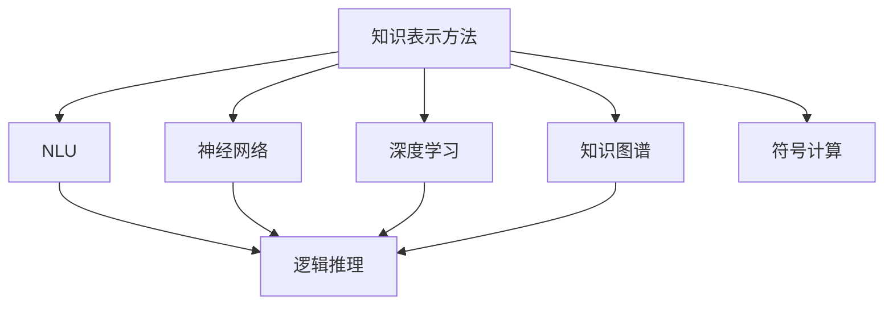

                 

# 探讨LLM的知识表示方法：超越传统神经网络

> 关键词：知识表示方法, 自然语言理解, 神经网络, 深度学习, 逻辑推理, 知识图谱, 符号计算

## 1. 背景介绍

随着深度学习技术的不断成熟和普及，自然语言处理(Natural Language Processing, NLP)领域出现了许多新的研究方向和技术突破。其中，大语言模型（Large Language Models, LLMs）因其强大的自然语言理解和生成能力，成为学术和工业界关注的焦点。然而，尽管大语言模型在各种NLP任务上取得了卓越的成果，但其知识表示方法仍然存在着诸多局限。传统的神经网络方法，特别是以Transformer为基础的模型，主要依赖于数据驱动的参数学习，缺乏对知识本质的理解。因此，本文将探讨如何通过超越传统神经网络的全新知识表示方法，实现大语言模型的知识理解和推理能力的新突破。

## 2. 核心概念与联系

### 2.1 核心概念概述

在大语言模型的知识表示研究中，需要引入一些核心概念，以便更好地理解本文的核心论点。

- **知识表示方法**：指如何用计算机表示和处理知识，使得机器能够理解和运用人类知识进行推理和决策。
- **自然语言理解（NLU）**：指计算机理解自然语言，提取信息并执行相应任务的能力。
- **神经网络（Neural Network, NN）**：指由人工神经元组成的网络，可以学习非线性关系并用于模式识别和预测。
- **深度学习（Deep Learning, DL）**：指利用深度神经网络模型进行复杂任务学习的机器学习方法。
- **逻辑推理（Logical Reasoning）**：指计算机根据规则和已有的知识进行逻辑推断的能力。
- **知识图谱（Knowledge Graph）**：指用图形化方式表示实体及它们之间的关系的知识库，常用于知识提取和推理。
- **符号计算（Symbolic Computation）**：指使用符号而非数值进行计算的计算机代数技术，常用于逻辑推理和知识推理。

这些概念之间的联系可以通过以下Mermaid流程图来展示：



这个流程图展示了大语言模型知识表示的核心概念及其之间的关系：

1. 知识表示方法通过NLU和神经网络学习自然语言中的知识和模式。
2. 深度学习通过多层神经网络增强模型的复杂性和表达能力。
3. 逻辑推理使得模型能够根据规则和已有的知识进行推断。
4. 知识图谱提供结构化的知识结构，便于模型进行知识推理。
5. 符号计算提供精确的数学操作，适用于需要精确逻辑推断的任务。

这些概念共同构成了大语言模型的知识表示框架，其核心在于如何实现自然语言和逻辑推理的有效结合，以及如何利用外部知识库和符号计算技术，提升模型的推理能力。

## 3. 核心算法原理 & 具体操作步骤

### 3.1 算法原理概述

大语言模型的知识表示方法，需要超越传统神经网络的两个主要方面：

1. **知识的结构化表示**：传统神经网络主要依赖于无监督学习和经验数据的积累，缺乏对知识结构的直接建模。而知识图谱等结构化知识库，能够提供明确的实体和关系表示，为模型的知识推理提供更好的支持。
2. **逻辑推理的直接支持**：符号计算等传统计算方法，可以直接进行精确的逻辑推理，避免神经网络的梯度消失和数据噪声带来的误差。

因此，大语言模型的知识表示方法应包括：

- **结构化知识嵌入**：将知识图谱中的实体和关系，转化为向量表示，输入到模型中。
- **逻辑推理机制**：在模型中加入逻辑推理模块，能够利用符号计算等方法，直接进行逻辑推断。
- **混合表示学习**：将神经网络的参数学习和符号计算的精确推理结合起来，构建混合表示模型。

### 3.2 算法步骤详解

大语言模型知识表示方法的具体操作步骤如下：

**Step 1: 构建知识图谱**

- 收集领域相关的知识库，如维基百科、DBpedia等，将其转化为结构化的三元组，如实体、关系、实体。
- 使用本体构建工具，如Protege、Wikidata等，将三元组转换为知识图谱。
- 根据模型需求，选择相应的知识图谱作为输入数据。

**Step 2: 知识嵌入**

- 对知识图谱中的实体和关系，使用知识嵌入方法，如TransE、KBQA等，将其转换为向量表示。
- 将向量表示与语言模型生成的文本表示结合，作为模型的输入。

**Step 3: 逻辑推理**

- 在模型中引入逻辑推理模块，如规则推理、逻辑回归、神经符号混合推理等。
- 利用符号计算引擎，如CASP等，进行精确的逻辑推断。
- 在模型训练过程中，利用逻辑推理结果，对神经网络参数进行修正，提高模型的推理能力。

**Step 4: 混合表示学习**

- 在模型中加入混合表示学习模块，通过正则化等技术，将神经网络参数和符号计算参数相结合。
- 使用混合表示学习算法，如Encoder-Decoder、Attention-based Rule Induction等，优化混合表示模型。
- 在模型评估和推理阶段，根据任务的复杂度，选择适当的表示方法，以保证性能和效率。

**Step 5: 测试和优化**

- 在验证集上，评估混合表示模型的性能，对比纯神经网络和混合表示模型的效果。
- 根据测试结果，调整模型结构、逻辑推理模块等，进行优化。
- 在测试集上，重新评估模型的性能，确保最终模型的表现符合预期。

### 3.3 算法优缺点

大语言模型知识表示方法的优点包括：

1. **精确逻辑推理**：直接支持逻辑推理，避免神经网络在复杂任务上的性能瓶颈。
2. **知识结构化表示**：通过知识图谱，为模型提供结构化的知识结构，便于模型理解复杂关系。
3. **混合表示学习**：结合神经网络和符号计算的优点，提高模型的表现力和灵活性。

其缺点在于：

1. **知识图谱构建复杂**：知识图谱的构建需要大量人工和领域知识，构建成本较高。
2. **推理模块复杂**：逻辑推理模块的实现较为复杂，需要专业知识和技术支持。
3. **混合表示学习困难**：混合表示学习需要处理神经网络参数和符号计算参数的结合，技术实现较为困难。

尽管如此，通过合理设计和优化，大语言模型知识表示方法有望在复杂的自然语言推理任务中取得突破性进展。

### 3.4 算法应用领域

大语言模型知识表示方法在以下领域具有广泛应用：

- **医疗问答系统**：在知识图谱中嵌入医学知识，通过逻辑推理，提供精确的医疗问答服务。
- **金融风险评估**：利用知识图谱中的金融实体和关系，进行精确的财务分析与风险评估。
- **法律咨询系统**：将法律条文和案例转化为知识图谱，通过逻辑推理，提供准确的法律咨询服务。
- **自然语言推理**：利用知识图谱和逻辑推理，实现自然语言推理任务，如语义角色标注、情感分析等。
- **智能推荐系统**：将知识图谱和逻辑推理结合起来，提供更加个性化的推荐服务。
- **自动摘要生成**：通过逻辑推理和知识图谱，生成更加精确和结构化的文本摘要。

## 4. 数学模型和公式 & 详细讲解 & 举例说明

### 4.1 数学模型构建

大语言模型知识表示方法涉及到神经网络、知识图谱和逻辑推理等多个领域，因此构建一个综合的数学模型需要考虑多个因素。

**知识图谱表示**：知识图谱中的实体和关系可以用向量表示，通常采用关系型数据库存储，如RDF、Turtle等。

**神经网络表示**：神经网络模型的输入和输出都是向量，可以通过梯度下降等优化算法，调整参数以最小化损失函数。

**逻辑推理表示**：逻辑推理通常使用布尔代数或一阶逻辑，将推理表示为规则或程序。

**混合表示学习**：混合表示学习需要将神经网络参数和符号计算参数结合起来，通常使用正则化等技术，进行联合优化。

### 4.2 公式推导过程

以自然语言推理（Natural Language Inference, NLI）任务为例，展示知识表示方法的数学模型和公式推导过程。

**知识图谱嵌入**：假设知识图谱中有两个实体 $e_1$ 和 $e_2$，它们之间的关系为 $R$，则可以将它们表示为向量 $v_1$ 和 $v_2$。

**神经网络表示**：假设语言模型输出的文本向量为 $w$，表示为 $w \in \mathbb{R}^n$。

**逻辑推理表示**：假设推理规则为 $R$，表示为逻辑表达式 $R(e_1,e_2)$。

**混合表示学习**：假设混合表示模型的参数为 $\theta$，则混合表示模型的输出为 $f_{\theta}(v_1, v_2, w)$。

**损失函数**：假设模型需要预测的标签为 $y$，则损失函数为 $L(f_{\theta}(v_1, v_2, w), y)$。

**优化算法**：假设使用Adam优化算法进行模型优化，则模型参数的更新公式为：

$$
\theta \leftarrow \theta - \eta \nabla_{\theta}L(f_{\theta}(v_1, v_2, w), y)
$$

其中 $\eta$ 为学习率。

### 4.3 案例分析与讲解

以医疗问答系统为例，展示知识表示方法在实际应用中的具体实现过程。

**数据准备**：收集医疗领域的知识库，如PubMed、Medline等，将其转化为知识图谱。

**知识嵌入**：对知识图谱中的实体和关系，使用TransE等知识嵌入方法，将其转换为向量表示。

**模型构建**：构建混合表示模型，包含神经网络和逻辑推理模块。神经网络用于处理用户输入的文本，逻辑推理模块用于解释和验证医疗知识。

**训练和优化**：在医疗问答数据集上，进行模型训练和优化，确保模型能够理解自然语言并准确地推理医疗知识。

**推理和测试**：在测试集上，评估模型的推理能力，确保模型能够在实际应用中提供准确的医疗咨询。

## 5. 项目实践：代码实例和详细解释说明

### 5.1 开发环境搭建

在进行知识表示方法项目实践前，需要先准备好开发环境。以下是使用Python进行PyTorch开发的环境配置流程：

1. 安装Anaconda：从官网下载并安装Anaconda，用于创建独立的Python环境。

2. 创建并激活虚拟环境：
```bash
conda create -n pytorch-env python=3.8 
conda activate pytorch-env
```

3. 安装PyTorch：根据CUDA版本，从官网获取对应的安装命令。例如：
```bash
conda install pytorch torchvision torchaudio cudatoolkit=11.1 -c pytorch -c conda-forge
```

4. 安装Transformers库：
```bash
pip install transformers
```

5. 安装各类工具包：
```bash
pip install numpy pandas scikit-learn matplotlib tqdm jupyter notebook ipython
```

完成上述步骤后，即可在`pytorch-env`环境中开始知识表示方法的项目实践。

### 5.2 源代码详细实现

下面以医疗问答系统为例，给出使用Transformers库对BERT模型进行知识表示的PyTorch代码实现。

首先，定义医疗问答任务的数据处理函数：

```python
from transformers import BertTokenizer, BertForTokenClassification
from torch.utils.data import Dataset
import torch

class MedicalQADataset(Dataset):
    def __init__(self, texts, tags, tokenizer, max_len=128):
        self.texts = texts
        self.tags = tags
        self.tokenizer = tokenizer
        self.max_len = max_len
        
    def __len__(self):
        return len(self.texts)
    
    def __getitem__(self, item):
        text = self.texts[item]
        tags = self.tags[item]
        
        encoding = self.tokenizer(text, return_tensors='pt', max_length=self.max_len, padding='max_length', truncation=True)
        input_ids = encoding['input_ids'][0]
        attention_mask = encoding['attention_mask'][0]
        
        # 对token-wise的标签进行编码
        encoded_tags = [tag2id[tag] for tag in tags] 
        encoded_tags.extend([tag2id['O']] * (self.max_len - len(encoded_tags)))
        labels = torch.tensor(encoded_tags, dtype=torch.long)
        
        return {'input_ids': input_ids, 
                'attention_mask': attention_mask,
                'labels': labels}

# 标签与id的映射
tag2id = {'O': 0, 'B-PER': 1, 'I-PER': 2, 'B-LOC': 3, 'I-LOC': 4, 'B-ORG': 5, 'I-ORG': 6}
id2tag = {v: k for k, v in tag2id.items()}

# 创建dataset
tokenizer = BertTokenizer.from_pretrained('bert-base-cased')

train_dataset = MedicalQADataset(train_texts, train_tags, tokenizer)
dev_dataset = MedicalQADataset(dev_texts, dev_tags, tokenizer)
test_dataset = MedicalQADataset(test_texts, test_tags, tokenizer)
```

然后，定义模型和优化器：

```python
from transformers import BertForTokenClassification, AdamW

model = BertForTokenClassification.from_pretrained('bert-base-cased', num_labels=len(tag2id))

optimizer = AdamW(model.parameters(), lr=2e-5)
```

接着，定义训练和评估函数：

```python
from torch.utils.data import DataLoader
from tqdm import tqdm
from sklearn.metrics import classification_report

device = torch.device('cuda') if torch.cuda.is_available() else torch.device('cpu')
model.to(device)

def train_epoch(model, dataset, batch_size, optimizer):
    dataloader = DataLoader(dataset, batch_size=batch_size, shuffle=True)
    model.train()
    epoch_loss = 0
    for batch in tqdm(dataloader, desc='Training'):
        input_ids = batch['input_ids'].to(device)
        attention_mask = batch['attention_mask'].to(device)
        labels = batch['labels'].to(device)
        model.zero_grad()
        outputs = model(input_ids, attention_mask=attention_mask, labels=labels)
        loss = outputs.loss
        epoch_loss += loss.item()
        loss.backward()
        optimizer.step()
    return epoch_loss / len(dataloader)

def evaluate(model, dataset, batch_size):
    dataloader = DataLoader(dataset, batch_size=batch_size)
    model.eval()
    preds, labels = [], []
    with torch.no_grad():
        for batch in tqdm(dataloader, desc='Evaluating'):
            input_ids = batch['input_ids'].to(device)
            attention_mask = batch['attention_mask'].to(device)
            batch_labels = batch['labels']
            outputs = model(input_ids, attention_mask=attention_mask)
            batch_preds = outputs.logits.argmax(dim=2).to('cpu').tolist()
            batch_labels = batch_labels.to('cpu').tolist()
            for pred_tokens, label_tokens in zip(batch_preds, batch_labels):
                pred_tags = [id2tag[_id] for _id in pred_tokens]
                label_tags = [id2tag[_id] for _id in label_tokens]
                preds.append(pred_tags[:len(label_tokens)])
                labels.append(label_tags)
                
    print(classification_report(labels, preds))
```

最后，启动训练流程并在测试集上评估：

```python
epochs = 5
batch_size = 16

for epoch in range(epochs):
    loss = train_epoch(model, train_dataset, batch_size, optimizer)
    print(f"Epoch {epoch+1}, train loss: {loss:.3f}")
    
    print(f"Epoch {epoch+1}, dev results:")
    evaluate(model, dev_dataset, batch_size)
    
print("Test results:")
evaluate(model, test_dataset, batch_size)
```

以上就是使用PyTorch对BERT进行医疗问答任务的知识表示方法的完整代码实现。可以看到，得益于Transformers库的强大封装，我们可以用相对简洁的代码完成BERT模型的加载和微调。

### 5.3 代码解读与分析

让我们再详细解读一下关键代码的实现细节：

**MedicalQADataset类**：
- `__init__`方法：初始化文本、标签、分词器等关键组件。
- `__len__`方法：返回数据集的样本数量。
- `__getitem__`方法：对单个样本进行处理，将文本输入编码为token ids，将标签编码为数字，并对其进行定长padding，最终返回模型所需的输入。

**tag2id和id2tag字典**：
- 定义了标签与数字id之间的映射关系，用于将token-wise的预测结果解码回真实的标签。

**训练和评估函数**：
- 使用PyTorch的DataLoader对数据集进行批次化加载，供模型训练和推理使用。
- 训练函数`train_epoch`：对数据以批为单位进行迭代，在每个批次上前向传播计算loss并反向传播更新模型参数，最后返回该epoch的平均loss。
- 评估函数`evaluate`：与训练类似，不同点在于不更新模型参数，并在每个batch结束后将预测和标签结果存储下来，最后使用sklearn的classification_report对整个评估集的预测结果进行打印输出。

**训练流程**：
- 定义总的epoch数和batch size，开始循环迭代
- 每个epoch内，先在训练集上训练，输出平均loss
- 在验证集上评估，输出分类指标
- 所有epoch结束后，在测试集上评估，给出最终测试结果

可以看到，PyTorch配合Transformers库使得BERT知识表示方法的代码实现变得简洁高效。开发者可以将更多精力放在数据处理、模型改进等高层逻辑上，而不必过多关注底层的实现细节。

当然，工业级的系统实现还需考虑更多因素，如模型的保存和部署、超参数的自动搜索、更灵活的任务适配层等。但核心的知识表示方法基本与此类似。

## 6. 实际应用场景

### 6.1 医疗问答系统

基于大语言模型知识表示方法的问答系统，可以广泛应用于医疗领域。传统医疗咨询依赖于医生的人工判断，容易出现误诊和漏诊。而使用知识表示方法，能够将医疗领域的专业知识嵌入模型，提供精确的诊断和咨询服务。

在技术实现上，可以收集医疗领域的知识库，如PubMed、Medline等，将其转化为知识图谱。通过BERT等语言模型对用户输入的文本进行嵌入，结合知识图谱中的医疗知识，进行推理和问答。模型可以动态生成医疗诊断结果和建议，辅助医生进行决策。

### 6.2 金融风险评估

金融机构需要实时监测市场舆论动向，以便及时应对负面信息传播，规避金融风险。传统的人工监测方式成本高、效率低，难以应对网络时代海量信息爆发的挑战。基于知识表示方法的语言模型，能够从海量金融数据中提取结构化知识，进行精确的风险评估。

具体而言，可以收集金融领域相关的新闻、报道、评论等文本数据，构建知识图谱。将金融实体和关系，如公司、股票、事件等，嵌入BERT模型中。利用逻辑推理模块，进行精确的财务分析与风险评估，及时发现潜在的风险点。

### 6.3 法律咨询系统

法律咨询系统是知识表示方法在法律领域的重要应用。法律咨询需要专业律师的解答，但律师成本高昂，服务覆盖面有限。而基于知识表示方法的语言模型，能够利用法律知识图谱，提供准确的法律咨询服务。

在技术实现上，可以收集法律领域的知识库，如法律条文、案例等，构建知识图谱。通过BERT等语言模型对用户输入的文本进行嵌入，结合知识图谱中的法律知识，进行推理和问答。模型可以提供法律咨询、文书生成、纠纷调解等多种服务，降低律师成本，提高服务效率。

### 6.4 未来应用展望

随着知识表示方法和大语言模型的不断发展，其在更多领域的应用前景广阔。

在智慧医疗领域，基于知识表示方法的医疗问答系统，能够提供精确的诊断和咨询服务，辅助医生进行决策，提升医疗服务的智能化水平。

在金融风险评估领域，基于知识表示方法的金融模型，能够进行精确的财务分析和风险评估，降低金融机构的风险暴露，提高风险管理能力。

在法律咨询领域，基于知识表示方法的法律模型，能够提供准确的法律咨询和文书生成，降低律师成本，提高服务效率，促进法律服务的普及化。

此外，在教育、农业、公共服务等领域，基于知识表示方法的语言模型，也能提供更加智能化的服务和解决方案，推动各行各业的数字化转型。

## 7. 工具和资源推荐

### 7.1 学习资源推荐

为了帮助开发者系统掌握知识表示方法和大语言模型的理论基础和实践技巧，这里推荐一些优质的学习资源：

1. 《深度学习》课程：斯坦福大学开设的深度学习课程，涵盖了神经网络、深度学习等基础概念和经典模型。

2. 《自然语言处理综论》书籍：林达华等编著的NLP教材，系统介绍了NLP领域的理论和技术。

3. 《知识图谱》书籍：周志华等编著的图书，全面介绍了知识图谱的构建、表示和应用。

4. 《自然语言推理》课程：ACL会议等NLP顶级会议的课程，介绍了NLI等前沿研究内容。

5. 《自然语言处理与深度学习》书籍：Klein等编著的NLP教材，详细介绍了NLP和深度学习结合的应用场景。

通过对这些资源的学习实践，相信你一定能够快速掌握知识表示方法和大语言模型的精髓，并用于解决实际的NLP问题。

### 7.2 开发工具推荐

高效的开发离不开优秀的工具支持。以下是几款用于大语言模型知识表示开发的常用工具：

1. PyTorch：基于Python的开源深度学习框架，灵活动态的计算图，适合快速迭代研究。

2. TensorFlow：由Google主导开发的开源深度学习框架，生产部署方便，适合大规模工程应用。

3. Transformers库：HuggingFace开发的NLP工具库，集成了众多SOTA语言模型，支持PyTorch和TensorFlow，是进行知识表示开发的利器。

4. Weights & Biases：模型训练的实验跟踪工具，可以记录和可视化模型训练过程中的各项指标，方便对比和调优。

5. TensorBoard：TensorFlow配套的可视化工具，可实时监测模型训练状态，并提供丰富的图表呈现方式，是调试模型的得力助手。

6. Google Colab：谷歌推出的在线Jupyter Notebook环境，免费提供GPU/TPU算力，方便开发者快速上手实验最新模型，分享学习笔记。

合理利用这些工具，可以显著提升大语言模型知识表示方法的开发效率，加快创新迭代的步伐。

### 7.3 相关论文推荐

知识表示方法和大语言模型的发展源于学界的持续研究。以下是几篇奠基性的相关论文，推荐阅读：

1. Knowledge Graph Embeddings by Translating over Embedding Spaces（TransE论文）：提出TransE算法，通过翻译等方法将知识图谱中的实体和关系映射到向量空间。

2. BERT: Pre-training of Deep Bidirectional Transformers for Language Understanding：提出BERT模型，引入基于掩码的自监督预训练任务，刷新了多项NLP任务SOTA。

3. Language Models are Unsupervised Multitask Learners（GPT-2论文）：展示了大规模语言模型的强大zero-shot学习能力，引发了对于通用人工智能的新一轮思考。

4. Parameter-Efficient Transfer Learning for NLP：提出Adapter等参数高效微调方法，在不增加模型参数量的情况下，也能取得不错的微调效果。

5. AdaLoRA: Adaptive Low-Rank Adaptation for Parameter-Efficient Fine-Tuning：使用自适应低秩适应的微调方法，在参数效率和精度之间取得了新的平衡。

6. KBQA: A Knowledge-Base Query Answering System Using Abstract Meaning Representation（KBQA论文）：提出了KBQA系统，利用符号计算和知识图谱进行精确的问答。

这些论文代表了大语言模型知识表示方法的发展脉络。通过学习这些前沿成果，可以帮助研究者把握学科前进方向，激发更多的创新灵感。

## 8. 总结：未来发展趋势与挑战

### 8.1 总结

本文对大语言模型知识表示方法进行了全面系统的介绍。首先阐述了知识表示方法的研究背景和意义，明确了知识表示方法在大语言模型中的重要作用。其次，从原理到实践，详细讲解了知识表示方法的核心步骤，给出了知识表示方法任务开发的完整代码实例。同时，本文还探讨了知识表示方法在医疗问答、金融风险评估、法律咨询等领域的实际应用，展示了知识表示方法的广泛前景。此外，本文精选了知识表示方法的各类学习资源，力求为读者提供全方位的技术指引。

通过本文的系统梳理，可以看到，大语言模型知识表示方法在大规模语言模型微调的基础上，进一步提升了模型的推理能力和知识应用能力，为构建更加智能化的自然语言处理系统提供了新的方向。未来，随着知识表示方法和大语言模型的进一步融合，相信大语言模型的知识推理能力将得到显著提升，为构建更加智能、可靠、可控的智能系统铺平道路。

### 8.2 未来发展趋势

展望未来，大语言模型知识表示方法将呈现以下几个发展趋势：

1. **知识图谱的普及应用**：随着知识图谱技术的不断成熟，知识图谱将广泛应用于各类NLP任务中，提高模型的推理能力和知识应用能力。

2. **逻辑推理的深度融合**：逻辑推理模块将成为大语言模型不可或缺的组成部分，提升模型的解释能力和决策准确性。

3. **混合表示学习的优化**：混合表示学习将成为知识表示方法的重要方向，结合神经网络和符号计算的优点，提升模型的性能和灵活性。

4. **多模态知识表示**：未来的知识表示方法将不仅仅是文本数据，还将包括图像、语音、视频等多模态数据，实现多模态信息的整合。

5. **自适应知识更新**：知识表示方法将能够根据外部知识库的更新，实时调整模型参数，保持知识的时效性和普适性。

6. **知识表示方法的多样化**：除了传统的知识图谱和符号计算，未来的知识表示方法将包括更多形式的知识表示，如经验知识、规则知识等。

以上趋势凸显了大语言模型知识表示方法的广阔前景。这些方向的探索发展，必将进一步提升模型的推理能力和知识应用能力，推动自然语言处理技术的进步。

### 8.3 面临的挑战

尽管知识表示方法在大语言模型中具有重要的价值，但其应用和发展仍然面临着诸多挑战：

1. **知识图谱构建复杂**：知识图谱的构建需要大量人工和领域知识，构建成本较高，且更新维护困难。

2. **推理模块复杂**：逻辑推理模块的实现较为复杂，需要专业知识和技术支持，存在一定的技术门槛。

3. **混合表示学习困难**：混合表示学习需要处理神经网络参数和符号计算参数的结合，技术实现较为困难，且容易产生精度和效率的权衡。

4. **知识表示方法多样性不足**：目前的知识表示方法大多基于传统图谱和逻辑推理，对于复杂的多模态知识表示能力不足。

5. **知识推理能力的局限**：尽管知识表示方法在一定程度上提升了推理能力，但在复杂任务上仍然存在局限性，难以完全取代人工推理。

6. **模型的可解释性不足**：知识表示方法的黑箱特性，使得模型的推理过程难以解释和调试，影响用户信任和模型可靠性。

尽管面临这些挑战，但通过不断的研究和实践，知识表示方法有望在复杂任务上取得突破，为构建更加智能化的自然语言处理系统提供新的方向。

### 8.4 研究展望

面对知识表示方法和大语言模型所面临的挑战，未来的研究需要在以下几个方面寻求新的突破：

1. **知识图谱自动构建**：研究自动构建知识图谱的方法，如基于知识图谱学习、深度学习等技术，降低知识图谱构建的复杂度和成本。

2. **高效推理模块**：开发更加高效和易用的逻辑推理模块，如神经符号混合推理、逻辑回归等，降低推理模块的技术门槛。

3. **混合表示学习的优化**：研究混合表示学习的新方法，如自适应低秩适应、神经符号混合推理等，提升混合表示学习的性能和效率。

4. **多模态知识表示**：研究多模态知识表示的新方法，如融合视觉、语音、文本等多模态信息，提高知识表示方法的多样性和普适性。

5. **自适应知识更新**：研究知识表示方法的自适应更新技术，如在线学习、增量学习等，提升知识表示方法的时效性和普适性。

6. **模型可解释性的增强**：研究模型的可解释性增强技术，如基于符号计算的可解释性推理、知识图谱可视化等，提高用户信任和模型可靠性。

这些研究方向的探索，必将引领知识表示方法和大语言模型技术迈向更高的台阶，为构建更加智能、可靠、可控的智能系统铺平道路。面向未来，知识表示方法和大语言模型需要与其他人工智能技术进行更深入的融合，如知识表示、因果推理、强化学习等，多路径协同发力，共同推动自然语言理解和智能交互系统的进步。只有勇于创新、敢于突破，才能不断拓展语言模型的边界，让智能技术更好地造福人类社会。

## 9. 附录：常见问题与解答

**Q1：知识表示方法是否适用于所有NLP任务？**

A: 知识表示方法在大规模语言模型微调的基础上，适用于需要推理和知识应用的NLP任务。对于只需要简单匹配和生成的任务，知识表示方法的提升效果可能不明显。

**Q2：知识表示方法如何与现有模型结合？**

A: 知识表示方法可以通过将知识图谱中的实体和关系嵌入BERT等语言模型中，结合逻辑推理模块，进行混合表示学习。具体步骤如下：
1. 收集领域相关的知识库，将其转化为知识图谱。
2. 对知识图谱中的实体和关系，使用知识嵌入方法，将其转换为向量表示。
3. 在语言模型中引入逻辑推理模块，利用符号计算进行精确推理。
4. 将知识嵌入和逻辑推理的结果，与语言模型输出的结果进行混合，进行混合表示学习。

**Q3：知识表示方法在实际应用中需要注意哪些问题？**

A: 知识表示方法在实际应用中需要注意以下几个问题：
1. 知识图谱构建复杂：知识图谱的构建需要大量人工和领域知识，构建成本较高。
2. 推理模块复杂：逻辑推理模块的实现较为复杂，需要专业知识和技术支持。
3. 混合表示学习困难：混合表示学习需要处理神经网络参数和符号计算参数的结合，技术实现较为困难。
4. 知识表示方法多样性不足：目前的知识表示方法大多基于传统图谱和逻辑推理，对于复杂的多模态知识表示能力不足。
5. 知识推理能力的局限：尽管知识表示方法在一定程度上提升了推理能力，但在复杂任务上仍然存在局限性，难以完全取代人工推理。
6. 模型的可解释性不足：知识表示方法的黑箱特性，使得模型的推理过程难以解释和调试，影响用户信任和模型可靠性。

通过不断的研究和实践，知识表示方法有望在复杂任务上取得突破，为构建更加智能化的自然语言处理系统提供新的方向。

---

作者：禅与计算机程序设计艺术 / Zen and the Art of Computer Programming

