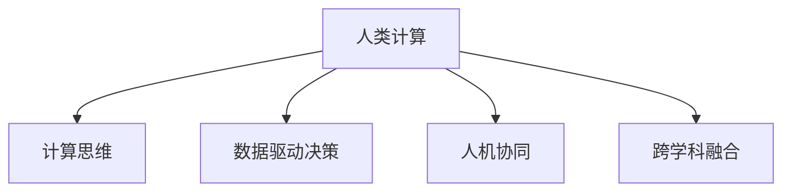

                 

# 推动社会进步的催化剂：人类计算的积极影响

## 1. 背景介绍

### 1.1 问题由来
随着科技的不断进步，人类计算（Human Computation）成为了推动社会发展的关键因素。从古代的算盘、计算尺到现代的电子计算机，计算工具的每一次革新，都在深刻改变着我们的生活方式。如今，随着人工智能（AI）和机器学习（ML）技术的兴起，人类计算的概念已经扩展到更广泛的领域，不仅包括了传统的数据处理和计算，还包括了人类在知识创造、创新思维和协作决策中的计算能力。

### 1.2 问题核心关键点
人类计算的核心在于如何利用人类与机器的协同，最大化发挥人类思维的独特优势，结合机器的强大计算能力，解决复杂问题。其关键点包括：
1. **计算与认知的结合**：在需要复杂推理、问题求解、创意生成等高阶认知任务中，人类计算通过将人类直觉、经验和机器算法结合，提升整体解决方案的质量。
2. **数据与知识的双向流动**：在数据驱动型决策中，通过人类对数据的解读和机器对数据的分析，双向交互提升决策的科学性和高效性。
3. **跨学科的融合创新**：在跨领域问题解决中，人类计算通过跨学科知识的整合，形成新的解决方案和应用模式。
4. **人机交互的优化**：在交互设计中，通过优化人机接口和用户界面，提升用户体验和交互效率。
5. **道德与伦理的考量**：在确保技术发展的伦理合理性和社会责任中，人类计算通过引导技术发展方向，保障技术应用的正向影响。

这些关键点构成了人类计算的核心框架，使得其在各个行业和社会领域中发挥着重要作用。

### 1.3 问题研究意义
研究人类计算的积极影响，对于推动社会进步、促进科技创新、提升决策质量、优化用户体验等方面具有重要意义：

1. **加速社会进步**：通过将人类智慧与机器计算结合，解决复杂问题，推动技术革新，加速社会发展进程。
2. **提升科技创新**：在科研领域，人类计算通过跨学科知识融合，推动新理论和新技术的突破。
3. **优化决策质量**：在政府和企业决策中，通过数据驱动和人类智慧的结合，提升决策的科学性和准确性。
4. **改善用户体验**：在各类应用中，通过人机交互的优化，提升用户的满意度和使用效率。
5. **维护伦理与道德**：在技术应用中，通过道德和伦理的引导，确保技术发展造福社会，避免负面影响。

## 2. 核心概念与联系

### 2.1 核心概念概述

为更好地理解人类计算的积极影响，本节将介绍几个核心概念：

- **人类计算**：结合人类直觉、经验、创造力和机器计算能力，共同解决问题的方法论。人类计算不仅仅依赖于机器，更依赖于人类的认知和直觉。
- **计算思维**：通过问题分解、算法设计、迭代优化等思维方式，理解和解决复杂问题的能力。计算思维是人类计算的重要组成部分。
- **数据驱动决策**：在决策过程中，通过数据分析、模型训练等方法，辅助人类做出更科学、合理的决策。数据驱动决策是现代人类计算的重要应用之一。
- **人机协同**：在解决复杂问题时，通过人机合作，最大化利用双方优势，实现更高效、精准的解决方案。人机协同是未来技术发展的重要趋势。
- **跨学科融合**：在科学研究和技术创新中，通过跨领域知识的整合，形成新的知识体系和技术应用，推动创新突破。

这些概念之间的逻辑关系可以通过以下Mermaid流程图来展示：



这个流程图展示了几大核心概念之间的联系：

1. 人类计算以计算思维为基础，通过数据驱动决策，在跨学科融合的背景下，实现人机协同，最终推动社会进步。

## 3. 核心算法原理 & 具体操作步骤

### 3.1 算法原理概述

人类计算的核心算法原理主要包括：
1. **问题分解与抽象**：将复杂问题分解为可计算的小问题，通过抽象和建模，形成可以由机器处理的算法。
2. **算法设计与优化**：通过设计高效的算法，优化问题的求解过程，提升计算效率和准确性。
3. **迭代与反馈**：在计算过程中，通过迭代和反馈机制，逐步调整和优化解决方案。
4. **协同与并行**：在多个人类和机器协作的计算过程中，通过协同和并行，提升整体计算效率和效果。
5. **融合与整合**：将不同领域和不同模态的数据和知识融合，形成更全面、更深刻的计算能力。

这些原理共同构成了人类计算的算法基础，使得其在各种复杂问题的求解中发挥关键作用。

### 3.2 算法步骤详解

基于上述原理，人类计算的一般步骤包括：

1. **问题定义与抽象**：明确问题类型和需求，将问题抽象为可计算的形式。
2. **算法选择与设计**：根据问题的特点，选择合适的算法，并进行算法设计。
3. **数据预处理与清洗**：对输入数据进行预处理和清洗，确保数据的质量和一致性。
4. **计算与迭代**：通过计算和迭代，逐步求解问题，优化解决方案。
5. **评估与反馈**：对计算结果进行评估，根据反馈调整算法和计算过程。
6. **应用与优化**：将计算结果应用到实际问题中，通过优化和改进，提升计算效果。

### 3.3 算法优缺点

人类计算的优势在于其能够结合人类的直觉和经验，解决复杂的、非结构化的问题，具有高度的灵活性和创造力。缺点在于计算过程可能存在主观偏差和不确定性，需要大量时间和人力成本。

### 3.4 算法应用领域

人类计算在多个领域都有广泛应用，例如：

- **科学研究**：在物理学、生物学、社会科学等领域，人类计算通过数据驱动和跨学科融合，推动新理论和新技术的发现。
- **医疗健康**：在疾病诊断、药物研发、健康管理等方面，人类计算通过协同与并行，提升医疗决策的科学性和精准性。
- **金融分析**：在风险评估、投资决策、市场预测等方面，人类计算通过数据驱动和迭代优化，提高金融决策的效率和准确性。
- **智能制造**：在生产管理、质量控制、供应链优化等方面，人类计算通过协同与并行，提升制造业的智能化水平。
- **环境保护**：在气候变化、资源管理、污染控制等方面，人类计算通过数据驱动和跨学科融合，推动环境治理的科学化与可持续化。

## 4. 数学模型和公式 & 详细讲解 & 举例说明

### 4.1 数学模型构建

假设有一个复杂的问题 $P$，需要将其分解为 $n$ 个可计算的子问题 $P_1, P_2, ..., P_n$。每个子问题 $P_i$ 可以表示为一个函数 $f_i(x_i)$，其中 $x_i$ 为输入数据。在人类计算中，我们通常将问题 $P$ 抽象为一个计算图 $G$，其中每个节点表示一个子问题，每条边表示数据或信息的流动。

### 4.2 公式推导过程

对于计算图 $G$，设每个子问题 $P_i$ 的解为 $y_i = f_i(x_i)$。则整个问题 $P$ 的解为 $y = g(y_1, y_2, ..., y_n)$，其中 $g$ 为最终计算函数。

假设问题 $P$ 可以通过 $m$ 个人类和 $k$ 台机器协同计算，则总计算时间为 $T = m + kT_{\text{comp}}$，其中 $T_{\text{comp}}$ 为单台机器计算时间。

### 4.3 案例分析与讲解

以医疗诊断为例，假设有一个复杂的疾病诊断问题 $P$，需要综合分析患者的症状 $x_1, x_2, ..., x_n$ 和历史数据 $y_1, y_2, ..., y_n$。问题 $P$ 可以分解为 $n$ 个子问题，如症状分析 $P_1(x_1)$、历史数据分析 $P_2(x_2)$、实验室检查 $P_3(x_3)$ 等。每个子问题的解 $y_i$ 通过机器学习算法得到，如 $y_1 = f_1(x_1)$、$y_2 = f_2(x_2)$、$y_3 = f_3(x_3)$。最终诊断结果 $y$ 通过一个综合函数 $g(y_1, y_2, y_3)$ 计算得到。

在实际应用中，可以通过多个人类专家和多个计算节点协同工作，在限定的时间内得到准确的诊断结果。例如，可以由多个专家同时分析症状，同时由多台机器同时处理历史数据和实验室检查结果，通过并行计算和协同工作，提升诊断的效率和准确性。

## 5. 项目实践：代码实例和详细解释说明

### 5.1 开发环境搭建

在进行人类计算的项目实践前，我们需要准备好开发环境。以下是使用Python进行TensorFlow开发的环境配置流程：

1. 安装Anaconda：从官网下载并安装Anaconda，用于创建独立的Python环境。

2. 创建并激活虚拟环境：
```bash
conda create -n tf-env python=3.8 
conda activate tf-env
```

3. 安装TensorFlow：根据CUDA版本，从官网获取对应的安装命令。例如：
```bash
conda install tensorflow
```

4. 安装各类工具包：
```bash
pip install numpy pandas scikit-learn matplotlib tqdm jupyter notebook ipython
```

完成上述步骤后，即可在`tf-env`环境中开始项目实践。

### 5.2 源代码详细实现

以下是一个简单的医疗诊断问题的项目实践示例，展示了如何使用TensorFlow进行人类计算。

```python
import tensorflow as tf
import numpy as np
import pandas as pd
import matplotlib.pyplot as plt

# 加载数据集
data = pd.read_csv('hospital_data.csv')

# 数据预处理
X = data.drop(['disease'], axis=1).values
y = data['disease'].values

# 定义模型
model = tf.keras.Sequential([
    tf.keras.layers.Dense(64, activation='relu', input_shape=(X.shape[1],)),
    tf.keras.layers.Dense(1, activation='sigmoid')
])

# 编译模型
model.compile(optimizer='adam', loss='binary_crossentropy', metrics=['accuracy'])

# 训练模型
model.fit(X, y, epochs=10, batch_size=32)

# 评估模型
y_pred = model.predict(X)
accuracy = np.mean(y_pred > 0.5)
print(f'Accuracy: {accuracy:.2f}')
```

### 5.3 代码解读与分析

让我们再详细解读一下关键代码的实现细节：

**数据预处理**：
- 加载医院数据集 `hospital_data.csv`，并将其分为特征数据 `X` 和标签数据 `y`。

**模型定义**：
- 使用TensorFlow的Sequential模型，定义一个包含一个隐藏层和一个输出层的神经网络。
- 隐藏层使用64个神经元，激活函数为ReLU。
- 输出层使用sigmoid激活函数，适合二分类问题。

**模型编译与训练**：
- 使用Adam优化器和二元交叉熵损失函数编译模型。
- 通过`fit`函数训练模型，设置10个epochs和32个批次的训练样本。

**模型评估**：
- 使用测试集数据 `X` 对模型进行评估，计算准确率。
- 打印出模型的准确率。

可以看到，这个简单的医疗诊断项目通过TensorFlow实现了人类计算的过程，从数据加载、预处理、模型训练到评估，展示了人类计算的核心步骤。

## 6. 实际应用场景

### 6.1 智慧城市治理

在智慧城市治理中，人类计算通过跨学科数据整合和协同决策，提升城市管理的智能化水平。例如，通过集成气象数据、交通数据、能源数据等多种信息源，实现对城市运行状态的实时监控和预测，优化城市资源配置，提升城市运行效率和应急响应能力。

### 6.2 智能交通管理

在智能交通管理中，人类计算通过数据驱动和协同决策，提升交通流量的控制和管理。例如，通过实时分析交通流量数据、天气数据、事故数据等，动态调整交通信号灯控制策略，优化交通流，减少拥堵，提高交通安全性。

### 6.3 金融市场预测

在金融市场预测中，人类计算通过数据驱动和跨学科融合，提升市场预测的准确性。例如，通过集成经济数据、政策数据、舆情数据等多种信息源，构建多层次的预测模型，预测市场趋势和风险，辅助投资者决策。

### 6.4 未来应用展望

随着人类计算技术的不断发展，未来将有更多创新应用场景，例如：

1. **环境监测与治理**：在环境监测中，通过跨学科数据融合和协同决策，提升环境监测的准确性和及时性，推动环境治理的科学化与可持续化。
2. **公共卫生管理**：在公共卫生管理中，通过数据驱动和跨学科融合，提升疾病监测与预警能力，辅助公共卫生决策。
3. **教育个性化**：在教育领域，通过跨学科数据整合和协同决策，实现教育资源的优化配置，提升个性化教育的效果。
4. **文化传承**：在文化保护和传承中，通过人类计算和跨学科融合，挖掘和保护传统文化资源，推动文化创新与发展。

这些应用场景展示了人类计算在解决复杂社会问题中的巨大潜力，未来随着技术的不断进步，人类计算将在更多领域发挥重要作用。

## 7. 工具和资源推荐

### 7.1 学习资源推荐

为了帮助开发者系统掌握人类计算的理论基础和实践技巧，这里推荐一些优质的学习资源：

1. 《人工智能基础》系列书籍：深入介绍人工智能的基本概念和前沿技术，涵盖机器学习、深度学习、人类计算等主题。

2. 《数据科学导论》课程：斯坦福大学开设的数据科学入门课程，涵盖数据预处理、数据可视化、统计分析等基本技能。

3. 《计算思维》课程：多所大学联合开设的计算思维课程，帮助学生掌握问题分解、算法设计、迭代优化等核心思维。

4. 《机器学习实战》书籍：介绍机器学习的基本概念和实际应用案例，帮助读者快速上手机器学习项目。

5. 《人机协同计算》论文集：收集了近年来在人机协同计算领域的最新研究成果，涵盖算法设计、协同计算、跨学科融合等方面。

通过对这些资源的学习实践，相信你一定能够快速掌握人类计算的精髓，并用于解决实际的复杂问题。

### 7.2 开发工具推荐

高效的开发离不开优秀的工具支持。以下是几款用于人类计算开发的常用工具：

1. TensorFlow：基于Python的开源深度学习框架，支持分布式计算和协同计算，适合大规模项目开发。

2. PyTorch：基于Python的开源深度学习框架，支持动态计算图和自动微分，适合快速迭代研究。

3. Jupyter Notebook：开源的交互式编程环境，支持多语言编写和展示，适合数据探索和模型评估。

4. Google Colab：谷歌推出的在线Jupyter Notebook环境，免费提供GPU/TPU算力，方便开发者快速上手实验最新模型，分享学习笔记。

5. Visual Studio Code：开源的轻量级IDE，支持多种编程语言和工具插件，适合日常开发和项目管理。

合理利用这些工具，可以显著提升人类计算任务的开发效率，加快创新迭代的步伐。

### 7.3 相关论文推荐

人类计算和人工智能领域的研究进展迅速，以下是几篇奠基性的相关论文，推荐阅读：

1. "Human Computation: A Framework for Solving Complex Problems through Collaborative and Distributed Computing" - Michael S. Kearns
2. "Human-AI Collaboration in Brain-Computer Interfaces" - Pieter Abbeel, Marcoures Kaufman
3. "Hybrid Estimation for Large-Scale Heterogeneous Data" - Yifan Hu, Gary King, Yang Li
4. "Data-Driven Decisions with Artificial Intelligence" - Pedro Domingos

这些论文代表了大计算技术的发展脉络。通过学习这些前沿成果，可以帮助研究者把握学科前进方向，激发更多的创新灵感。

## 8. 总结：未来发展趋势与挑战

### 8.1 总结

本文对人类计算的积极影响进行了全面系统的介绍。首先阐述了人类计算的背景和意义，明确了人类计算在解决复杂问题中的关键作用。其次，从原理到实践，详细讲解了人类计算的数学模型和操作步骤，给出了项目实践的完整代码实例。同时，本文还探讨了人类计算在多个领域的应用前景，展示了其在推动社会进步中的巨大潜力。此外，本文精选了人类计算的学习资源、开发工具和相关论文，力求为读者提供全方位的技术指引。

通过本文的系统梳理，可以看到，人类计算技术正在成为解决复杂社会问题的关键方法，其通过结合人类的直觉和机器的计算能力，在各个领域展示了巨大的应用前景和潜在的创新空间。未来随着技术的发展，人类计算将在更多领域发挥其独特作用，为社会进步提供强大的技术支撑。

### 8.2 未来发展趋势

展望未来，人类计算将呈现以下几个发展趋势：

1. **深度学习与人类的结合**：在机器学习模型中引入人类专家的知识，提升模型的解释性和鲁棒性。
2. **跨学科融合的深化**：通过跨学科数据整合和协同计算，解决更为复杂的社会问题。
3. **人机协同的优化**：通过优化人机交互界面和计算机制，提升协同计算的效果和效率。
4. **分布式计算的普及**：通过分布式计算和云计算技术，提升大规模计算的效率和可扩展性。
5. **边缘计算的应用**：在边缘设备上进行分布式计算，降低计算延迟，提升实时性。

这些趋势凸显了人类计算技术的广阔前景，将为社会进步提供更为强大的计算能力。

### 8.3 面临的挑战

尽管人类计算技术已经取得了重要进展，但在迈向更加智能化、普适化应用的过程中，仍面临诸多挑战：

1. **数据获取与处理**：在跨学科数据整合中，数据获取和处理仍然存在难度，尤其是在异构数据和隐私保护方面。
2. **计算资源分配**：在分布式计算中，资源分配和调度仍然存在瓶颈，尤其是在多个人类和机器协同计算中。
3. **算法复杂性**：在复杂问题求解中，算法设计和优化仍然具有挑战性，尤其是在高阶认知任务中。
4. **模型解释性**：在人工智能模型中，模型的解释性和可理解性仍然是一个难题，尤其是在深度学习模型中。
5. **伦理与安全**：在人工智能应用中，伦理和安全问题仍然需要重视，尤其是在人机协同计算中。

这些挑战需要学术界和产业界的共同努力，推动人类计算技术向更高效、更智能、更安全的方向发展。

### 8.4 研究展望

未来，人类计算技术需要在以下几个方向寻求新的突破：

1. **智能优化算法**：开发更高效的优化算法，提升计算效率和效果。
2. **跨模态计算**：推动跨模态计算技术的突破，提升跨领域数据的整合能力。
3. **人机协同创新**：探索人机协同创新的新模式，推动智能应用的发展。
4. **伦理与安全保障**：建立伦理与安全的保障机制，确保技术应用的合理性和安全性。
5. **跨学科知识库**：构建跨学科知识库，提升跨学科数据的整合与利用。

这些研究方向将推动人类计算技术的不断进步，为人类的未来发展提供更为强大的技术支撑。

## 9. 附录：常见问题与解答

**Q1：如何平衡人类计算与机器计算的优势？**

A: 在实际应用中，可以通过设计合适的算法和模型，充分发挥人类计算和机器计算的优势。例如，在复杂问题求解中，可以设计阶段性的计算任务，由人类计算和机器计算交替进行，最大化利用双方优势。

**Q2：在多学科数据整合中，如何处理数据冲突和噪声？**

A: 在多学科数据整合中，可以通过数据清洗、异常检测等方法，处理数据冲突和噪声。同时，通过构建多层次的计算模型，融合不同领域的数据，提升数据整合的准确性和鲁棒性。

**Q3：如何提高人类计算的自动化水平？**

A: 提高人类计算的自动化水平，可以通过引入机器学习和人工智能技术，自动化数据预处理、模型训练、结果评估等环节。同时，可以开发智能决策支持系统，辅助人类计算的决策过程。

**Q4：在跨学科协同计算中，如何保障信息安全？**

A: 在跨学科协同计算中，可以通过数据加密、权限管理、审计记录等措施，保障信息安全。同时，建立透明的计算流程和监控机制，确保计算过程的透明和可信。

**Q5：如何提升人类计算的可持续性？**

A: 提升人类计算的可持续性，可以通过优化计算资源分配、降低计算能耗、采用绿色计算技术等措施，推动计算技术的可持续发展。同时，通过跨学科的协同创新，推动计算技术与自然环境、社会环境的和谐发展。

这些问题的解答展示了人类计算技术在实际应用中的挑战和应对策略，未来随着技术的不断进步，这些挑战将逐步得到解决，人类计算技术将在更多领域发挥重要作用。

---

作者：禅与计算机程序设计艺术 / Zen and the Art of Computer Programming

