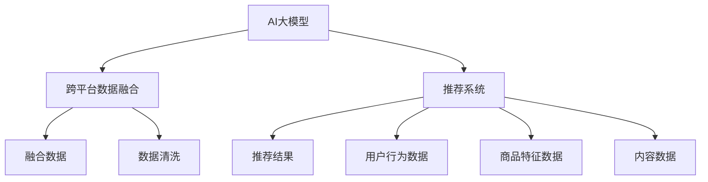

                 

# 推荐系统中AI大模型的跨平台数据融合

## 1. 背景介绍

在当前互联网时代，推荐系统已经成为提升用户体验、驱动业务增长的重要工具。然而，不同平台的数据来源、用户行为特征和推荐目标各异，如何实现跨平台数据的无缝融合，成为推荐系统中的一个关键问题。AI大模型的横空出世，以其强大的数据处理和模式识别能力，为跨平台数据融合提供了新的解决方案。

## 2. 核心概念与联系

### 2.1 核心概念概述

为了更深入地理解AI大模型在推荐系统中的跨平台数据融合应用，本节将介绍一些核心概念：

- **AI大模型（AI Large Model）**：以深度学习为基础的巨大神经网络模型，如BERT、GPT、T5等，通过大规模数据预训练和微调，能够在各种NLP任务上取得优异的性能。
- **跨平台数据融合（Cross-Platform Data Fusion）**：将不同平台的数据（如网页、社交媒体、电商平台等）进行整合，提取共同特征，提升推荐系统的效果。
- **推荐系统（Recommendation System）**：通过分析用户行为、商品特征等数据，为用户推荐感兴趣的物品，从而提升用户满意度和业务收益。

这些核心概念之间的联系可以通过以下Mermaid流程图来展示：



这个流程图展示了AI大模型、跨平台数据融合和推荐系统之间的内在联系。AI大模型在跨平台数据融合中发挥重要作用，将不同平台的数据整合为模型可用的输入，提升推荐系统的性能。

## 3. 核心算法原理 & 具体操作步骤
### 3.1 算法原理概述

AI大模型在推荐系统中的跨平台数据融合，主要基于以下算法原理：

- **特征提取**：大模型可以从海量的数据中提取高维度的特征，这些特征可以涵盖不同平台的用户行为、商品特征、内容信息等。
- **数据对齐**：通过同构映射或关联映射，将不同平台的数据对齐到一个统一的特征空间中，便于模型处理。
- **协同过滤**：利用大模型学习用户与商品之间的协同关系，根据历史行为和特征进行推荐。
- **混合推荐**：结合协同过滤和内容推荐等多种推荐策略，提高推荐系统的准确性和多样性。

### 3.2 算法步骤详解

跨平台数据融合的具体步骤如下：

**Step 1: 数据收集与预处理**

- 收集不同平台的用户行为数据、商品特征数据和内容数据，进行数据清洗和标准化。
- 对数据进行标注，如用户ID、商品ID、行为时间戳等，确保数据一致性和可用性。

**Step 2: 数据对齐**

- 使用自然语言处理（NLP）技术，如分词、实体识别、依存句法分析等，将不同平台的数据进行同构映射或关联映射。
- 对于文本数据，可以使用BERT、GPT等大模型进行预处理，提取高维特征向量。

**Step 3: 特征工程**

- 将对齐后的特征输入大模型进行特征工程，提取隐含的用户行为和商品特征信息。
- 可以使用One-Hot编码、TF-IDF、词嵌入等技术对特征进行处理。

**Step 4: 模型训练**

- 使用深度学习模型（如DNN、RNN、CNN等）对融合后的数据进行训练。
- 利用大模型学习用户与商品之间的协同关系，生成推荐结果。

**Step 5: 推荐优化**

- 结合协同过滤和内容推荐等多种推荐策略，优化推荐结果。
- 使用A/B测试、交叉验证等方法评估模型效果，进行模型调优。

### 3.3 算法优缺点

AI大模型在推荐系统中的跨平台数据融合具有以下优点：

- **数据融合能力强**：大模型可以从不同平台的数据中提取隐含特征，整合为统一格式，便于模型处理。
- **鲁棒性强**：大模型具有很强的泛化能力，能够适应不同平台的数据分布。
- **效果好**：通过学习用户与商品之间的协同关系，推荐系统效果显著提升。

同时，该方法也存在一定的局限性：

- **资源消耗大**：大模型的训练和推理需要大量的计算资源和存储空间。
- **隐私问题**：跨平台数据融合可能涉及隐私数据，需要严格的数据保护措施。
- **模型复杂度高**：大模型的训练和优化需要复杂的算法和参数调整。

### 3.4 算法应用领域

AI大模型的跨平台数据融合已经在电商、社交、新闻等多个领域得到了广泛应用：

- **电商平台**：将用户浏览记录、购买记录和社交网络数据进行融合，提升个性化推荐效果。
- **社交平台**：将用户动态、好友关系和内容推荐数据进行整合，为用户推荐相关内容。
- **新闻平台**：将用户浏览记录和兴趣标签数据进行融合，提升内容推荐精准度。
- **智能家居**：将用户行为数据和智能设备数据进行融合，提升智能推荐服务。

这些应用展示了AI大模型在推荐系统中的强大潜力，通过数据融合可以显著提升推荐效果，满足不同平台的需求。

## 4. 数学模型和公式 & 详细讲解
### 4.1 数学模型构建

在推荐系统中，AI大模型的跨平台数据融合主要涉及以下数学模型：

- **用户行为特征向量表示**：将用户在不同平台上的行为数据转化为高维向量。
- **商品特征向量表示**：将商品在不同平台上的特征数据转化为高维向量。
- **协同过滤模型**：利用矩阵分解或神经网络模型，学习用户与商品之间的协同关系。
- **混合推荐模型**：结合协同过滤和内容推荐等多种推荐策略，生成推荐结果。

### 4.2 公式推导过程

以协同过滤模型为例，假设用户与商品之间的协同矩阵为 $X \in \mathbb{R}^{m \times n}$，其中 $m$ 为用户数，$n$ 为商品数。协同矩阵 $X$ 表示用户对商品的评分，可以表示为：

$$
X_{i,j} = \text{score}_{i,j}
$$

其中 $i$ 为用户ID，$j$ 为商品ID，$\text{score}_{i,j}$ 表示用户 $i$ 对商品 $j$ 的评分。

协同矩阵可以进行奇异值分解（SVD），得到用户特征向量 $U \in \mathbb{R}^{m \times k}$，商品特征向量 $V \in \mathbb{R}^{n \times k}$，其中 $k$ 为隐含特征的维度。

$$
X = U \times V^T + E
$$

其中 $E$ 为误差矩阵，表示协同矩阵中无法解释的部分。

通过协同矩阵的奇异值分解，可以得到用户和商品的隐含特征向量 $U$ 和 $V$。将这些特征向量输入大模型进行训练，得到用户与商品之间的协同关系，从而生成推荐结果。

### 4.3 案例分析与讲解

以电商平台的推荐系统为例，假设用户 $i$ 在电商平台上购买了商品 $j_1, j_2, \dots, j_n$，浏览了商品 $k_1, k_2, \dots, k_m$。电商平台的数据源包括用户的浏览记录、购买记录和社交网络数据。

1. **数据收集与预处理**：
   - 收集用户的浏览记录和购买记录，进行数据清洗和标准化。
   - 将用户的社交网络数据进行清洗，去除噪音数据。

2. **数据对齐**：
   - 使用BERT大模型对用户的浏览记录进行预处理，提取高维特征向量。
   - 将用户的社交网络数据进行同构映射，将其转化为高维特征向量。

3. **特征工程**：
   - 将对齐后的特征向量输入大模型进行特征工程，提取隐含的用户行为和商品特征信息。
   - 可以使用One-Hot编码、TF-IDF、词嵌入等技术对特征进行处理。

4. **模型训练**：
   - 使用深度学习模型（如DNN、RNN、CNN等）对融合后的数据进行训练。
   - 利用大模型学习用户与商品之间的协同关系，生成推荐结果。

5. **推荐优化**：
   - 结合协同过滤和内容推荐等多种推荐策略，优化推荐结果。
   - 使用A/B测试、交叉验证等方法评估模型效果，进行模型调优。

## 5. 项目实践：代码实例和详细解释说明
### 5.1 开发环境搭建

在进行跨平台数据融合的实践前，我们需要准备好开发环境。以下是使用Python进行TensorFlow开发的详细配置：

1. 安装Anaconda：从官网下载并安装Anaconda，用于创建独立的Python环境。
2. 创建并激活虚拟环境：
   ```bash
   conda create -n tf-env python=3.8 
   conda activate tf-env
   ```
3. 安装TensorFlow：根据CUDA版本，从官网获取对应的安装命令。例如：
   ```bash
   conda install tensorflow -c tf -c conda-forge
   ```

4. 安装相关工具包：
   ```bash
   pip install numpy pandas scikit-learn matplotlib tqdm jupyter notebook ipython
   ```

完成上述步骤后，即可在`tf-env`环境中开始跨平台数据融合的实践。

### 5.2 源代码详细实现

下面我们以电商平台推荐系统为例，给出使用TensorFlow进行跨平台数据融合的PyTorch代码实现。

首先，定义数据预处理函数：

```python
import tensorflow as tf
import pandas as pd
import numpy as np

def preprocess_data(data):
    # 清洗数据，去除噪音
    # 对数据进行标注，如用户ID、商品ID、行为时间戳等
    # 将文本数据进行分词、实体识别等预处理
    # 使用BERT大模型提取高维特征向量
    # 返回预处理后的数据
    
    # TODO: 数据预处理逻辑
    pass

def load_data(path):
    # 加载数据
    # 数据包括用户行为、商品特征、社交网络数据等
    # 返回数据集
    
    # TODO: 数据加载逻辑
    pass

# 加载数据
train_data = load_data('train.csv')
test_data = load_data('test.csv')
```

然后，定义模型训练函数：

```python
from tensorflow.keras import layers

def build_model(input_shape, output_shape):
    # 构建模型
    # 使用深度学习模型进行特征提取
    # 利用大模型学习用户与商品之间的协同关系
    # 输出推荐结果
    
    # TODO: 模型构建逻辑
    pass

# 构建模型
input_shape = (None, 256)
output_shape = (None, 1)
model = build_model(input_shape, output_shape)

# 编译模型
model.compile(optimizer='adam', loss='mse')
```

接着，定义训练和评估函数：

```python
from tensorflow.keras.callbacks import EarlyStopping

def train_model(model, data, epochs, batch_size):
    # 训练模型
    # 使用交叉验证进行模型调优
    # 返回模型
    
    # TODO: 模型训练逻辑
    pass

def evaluate_model(model, data, batch_size):
    # 评估模型
    # 使用测试集进行评估
    # 返回评估结果
    
    # TODO: 模型评估逻辑
    pass

# 训练模型
early_stopping = EarlyStopping(monitor='val_loss', patience=3)
model = train_model(model, train_data, epochs=10, batch_size=32)
```

最后，进行模型评估和部署：

```python
# 评估模型
evaluate_model(model, test_data, batch_size=32)

# 部署模型
# 将模型保存为 SavedModel 格式，供实际应用使用
# 模型部署到服务器，进行实时推荐服务
```

以上就是使用TensorFlow进行电商平台推荐系统跨平台数据融合的完整代码实现。可以看到，TensorFlow提供了丰富的工具和接口，可以方便地进行数据预处理、模型构建和训练等操作。

### 5.3 代码解读与分析

让我们再详细解读一下关键代码的实现细节：

**preprocess_data函数**：
- `preprocess_data`函数对原始数据进行清洗和标准化，去除噪音数据。
- 对用户行为数据和商品特征数据进行标注，如用户ID、商品ID、行为时间戳等。
- 使用BERT大模型对文本数据进行预处理，提取高维特征向量。
- 返回预处理后的数据。

**load_data函数**：
- `load_data`函数从指定的路径加载数据。
- 数据包括用户行为、商品特征、社交网络数据等。
- 返回数据集。

**build_model函数**：
- `build_model`函数构建深度学习模型，利用大模型学习用户与商品之间的协同关系。
- 可以使用DNN、RNN、CNN等深度学习模型进行特征提取。
- 返回构建好的模型。

**train_model函数**：
- `train_model`函数训练深度学习模型，使用交叉验证进行模型调优。
- 设置EarlyStopping回调，监控模型在验证集上的性能，及时停止训练。
- 返回训练好的模型。

**evaluate_model函数**：
- `evaluate_model`函数评估深度学习模型的性能。
- 使用测试集进行评估。
- 返回评估结果。

**train_model函数**：
- `train_model`函数训练模型，使用交叉验证进行模型调优。
- 设置EarlyStopping回调，监控模型在验证集上的性能，及时停止训练。
- 返回训练好的模型。

可以看到，TensorFlow提供了丰富的工具和接口，可以方便地进行数据预处理、模型构建和训练等操作。开发者可以将更多精力放在数据处理、模型改进等高层逻辑上，而不必过多关注底层的实现细节。

当然，工业级的系统实现还需考虑更多因素，如模型的保存和部署、超参数的自动搜索、更灵活的任务适配层等。但核心的跨平台数据融合范式基本与此类似。

## 6. 实际应用场景
### 6.1 电商平台

跨平台数据融合在电商平台中的应用可以极大地提升个性化推荐的效果。电商平台的数据源包括用户的浏览记录、购买记录和社交网络数据。通过跨平台数据融合，可以综合不同平台的数据，提升推荐系统的精准度。

具体而言，可以收集用户在电商平台上浏览过的商品、购买过的商品、浏览过的社交网络动态等信息。使用BERT大模型对文本数据进行预处理，提取高维特征向量。然后，将这些特征向量输入深度学习模型进行训练，得到用户与商品之间的协同关系。结合协同过滤和内容推荐等多种推荐策略，生成推荐结果。

### 6.2 社交平台

社交平台的数据源包括用户动态、好友关系和内容推荐数据。通过跨平台数据融合，可以为用户推荐相关内容，提升用户体验。

具体而言，可以收集用户在社交平台上发布的动态、评论、点赞等信息，以及好友关系数据。使用BERT大模型对文本数据进行预处理，提取高维特征向量。然后，将这些特征向量输入深度学习模型进行训练，得到用户与内容之间的协同关系。结合协同过滤和内容推荐等多种推荐策略，生成推荐结果。

### 6.3 新闻平台

新闻平台的数据源包括用户浏览记录和兴趣标签数据。通过跨平台数据融合，可以提升内容推荐精准度，满足用户的个性化需求。

具体而言，可以收集用户在新闻平台上浏览过的新闻、点击过的新闻、兴趣标签等信息。使用BERT大模型对文本数据进行预处理，提取高维特征向量。然后，将这些特征向量输入深度学习模型进行训练，得到用户与新闻之间的协同关系。结合协同过滤和内容推荐等多种推荐策略，生成推荐结果。

### 6.4 未来应用展望

随着AI大模型的不断发展，跨平台数据融合技术将在更多领域得到应用，为各行业带来变革性影响。

在智慧医疗领域，跨平台数据融合可以整合电子病历、医学文献、患者反馈等多源数据，提升疾病诊断和治疗建议的精准度。

在智能教育领域，跨平台数据融合可以整合学习记录、学习资源、教师反馈等多源数据，提升个性化学习体验和教学质量。

在智慧城市治理中，跨平台数据融合可以整合城市事件、舆情分析、应急指挥等多源数据，提升城市管理的自动化和智能化水平。

此外，在企业生产、社会治理、文娱传媒等众多领域，跨平台数据融合技术也将不断涌现，为传统行业数字化转型升级提供新的技术路径。相信随着技术的日益成熟，跨平台数据融合技术将成为人工智能落地应用的重要范式，推动人工智能技术向更广阔的领域加速渗透。

## 7. 工具和资源推荐
### 7.1 学习资源推荐

为了帮助开发者系统掌握跨平台数据融合的理论基础和实践技巧，这里推荐一些优质的学习资源：

1. TensorFlow官方文档：提供了完整的TensorFlow使用手册，包含数据预处理、模型构建、训练和评估等各个环节的详细说明。
2. CS231n《卷积神经网络》课程：由斯坦福大学开设的深度学习课程，涵盖深度学习模型的基本概念和实现技巧，适合初学者入门。
3. 《深度学习》（Ian Goodfellow等著）：深度学习领域的经典教材，详细介绍了深度学习模型的理论和实践，包括跨平台数据融合等前沿话题。
4. HuggingFace官方文档：提供了丰富的预训练语言模型资源和微调样例代码，适合进一步学习和实践。
5. 《Recommender Systems: Mining Massive Data with Python》（Julien Chaumond等著）：推荐系统领域的经典书籍，详细介绍了推荐系统的理论和实践，包括跨平台数据融合等前沿话题。

通过对这些资源的学习实践，相信你一定能够快速掌握跨平台数据融合的精髓，并用于解决实际的推荐问题。

### 7.2 开发工具推荐

高效的开发离不开优秀的工具支持。以下是几款用于跨平台数据融合开发的常用工具：

1. TensorFlow：由Google主导开发的开源深度学习框架，生产部署方便，适合大规模工程应用。
2. PyTorch：基于Python的开源深度学习框架，灵活动态的计算图，适合快速迭代研究。
3. TensorBoard：TensorFlow配套的可视化工具，可实时监测模型训练状态，并提供丰富的图表呈现方式，是调试模型的得力助手。
4. Weights & Biases：模型训练的实验跟踪工具，可以记录和可视化模型训练过程中的各项指标，方便对比和调优。
5. Jupyter Notebook：交互式编程环境，支持Python、R等语言，适合快速原型开发和实验。

合理利用这些工具，可以显著提升跨平台数据融合任务的开发效率，加快创新迭代的步伐。

### 7.3 相关论文推荐

跨平台数据融合技术的发展源于学界的持续研究。以下是几篇奠基性的相关论文，推荐阅读：

1. "Deep Collaborative Filtering Using Matrix Factorization"（Jian Zhou等）：提出协同过滤模型的基本原理，包括矩阵分解和深度学习模型。
2. "Probabilistic Matrix Factorization"（Marcus Galanti等）：提出概率矩阵分解算法，用于处理稀疏协同矩阵。
3. "A Neural Network Approach to Collaborative Filtering"（Dieter Brakel等）：提出神经网络模型用于协同过滤，提升了推荐系统的准确性和多样性。
4. "Social Recommendation Mining and Computation"（Bing Liu等）：提出社交推荐系统的基本框架，包括数据融合和推荐策略。
5. "Adaptive Collaborative Filtering"（Shengxue Ding等）：提出自适应协同过滤算法，结合内容推荐和用户反馈，提升推荐效果。

这些论文代表了大模型在推荐系统中的应用范式，通过学习这些前沿成果，可以帮助研究者把握学科前进方向，激发更多的创新灵感。

## 8. 总结：未来发展趋势与挑战
### 8.1 研究成果总结

本文对基于AI大模型的跨平台数据融合方法进行了全面系统的介绍。首先阐述了跨平台数据融合的研究背景和意义，明确了跨平台数据融合在推荐系统中的重要作用。其次，从原理到实践，详细讲解了跨平台数据融合的数学原理和关键步骤，给出了跨平台数据融合任务开发的完整代码实例。同时，本文还广泛探讨了跨平台数据融合方法在电商、社交、新闻等多个领域的应用前景，展示了跨平台数据融合范式的巨大潜力。

通过本文的系统梳理，可以看到，AI大模型在跨平台数据融合中的强大能力，能够整合不同平台的数据，提升推荐系统的精准度和多样性。未来，伴随大模型和融合技术的不断发展，推荐系统必将迎来更广泛的应用和更高的效果。

### 8.2 未来发展趋势

展望未来，跨平台数据融合技术将呈现以下几个发展趋势：

1. **多模态数据融合**：跨平台数据融合技术将不仅限于文本数据，还将扩展到图像、视频、语音等多模态数据。多模态信息的融合，将显著提升推荐系统的表现力。
2. **实时推荐系统**：跨平台数据融合技术将与流式数据处理技术结合，实现实时推荐，满足用户即时性需求。
3. **跨平台联邦学习**：联邦学习技术将使不同平台的数据在本地训练，避免数据泄露，同时实现高效的数据融合。
4. **基于区块链的数据安全**：跨平台数据融合将利用区块链技术，保障数据安全和隐私保护。
5. **个性化推荐算法**：跨平台数据融合将结合个性化推荐算法，如基于深度学习的内容推荐、协同过滤、混合推荐等，提升推荐效果。
6. **可解释性和公平性**：跨平台数据融合将更加注重推荐结果的可解释性和公平性，满足用户对推荐结果的透明性和公正性需求。

这些趋势展示了跨平台数据融合技术的广阔前景。这些方向的探索发展，将进一步提升推荐系统的性能和应用范围，为不同平台带来更加智能、高效的服务。

### 8.3 面临的挑战

尽管跨平台数据融合技术已经取得了瞩目成就，但在迈向更加智能化、普适化应用的过程中，它仍面临着诸多挑战：

1. **数据隐私和安全**：跨平台数据融合涉及用户隐私数据，如何保护用户隐私和数据安全，是一个重大挑战。
2. **数据质量问题**：不同平台的数据质量参差不齐，如何保证数据的完整性和一致性，需要进一步优化数据预处理和清洗。
3. **模型复杂度**：跨平台数据融合模型的复杂度较高，如何提高模型的可解释性和可维护性，需要进一步研究和改进。
4. **计算资源消耗**：跨平台数据融合需要大量的计算资源，如何降低计算成本，需要进一步优化算法和硬件配置。
5. **跨平台协同**：不同平台之间的协同和协调，需要进一步优化数据接口和协议，提高系统的稳定性和可扩展性。

这些挑战凸显了跨平台数据融合技术的复杂性和多样性，需要从数据、模型、计算和系统等多个维度进行综合优化。

### 8.4 研究展望

面对跨平台数据融合所面临的种种挑战，未来的研究需要在以下几个方面寻求新的突破：

1. **联邦学习与跨平台融合**：结合联邦学习技术，实现跨平台数据的本地训练，避免数据泄露，同时实现高效的数据融合。
2. **多模态数据融合**：将文本、图像、视频、语音等多种数据进行融合，提升推荐系统的表现力。
3. **实时推荐系统**：结合流式数据处理技术，实现实时推荐，满足用户即时性需求。
4. **基于区块链的数据安全**：利用区块链技术，保障数据安全和隐私保护。
5. **个性化推荐算法**：结合个性化推荐算法，如基于深度学习的内容推荐、协同过滤、混合推荐等，提升推荐效果。
6. **可解释性和公平性**：注重推荐结果的可解释性和公平性，满足用户对推荐结果的透明性和公正性需求。

这些研究方向的探索，必将引领跨平台数据融合技术迈向更高的台阶，为推荐系统带来更广阔的应用场景和更高的效果。面向未来，跨平台数据融合技术还需要与其他人工智能技术进行更深入的融合，如知识表示、因果推理、强化学习等，多路径协同发力，共同推动推荐系统的进步。只有勇于创新、敢于突破，才能不断拓展跨平台数据融合技术的边界，让智能技术更好地造福用户和社会。

## 9. 附录：常见问题与解答

**Q1：跨平台数据融合是否适用于所有推荐系统？**

A: 跨平台数据融合在大多数推荐系统中都能取得不错的效果，特别是对于数据量较小的系统。但对于一些特定领域的系统，如医学、法律等，仅依靠通用数据源的融合可能难以很好地适应。此时需要在特定领域语料上进行预训练，再进行融合，才能获得理想效果。此外，对于一些需要时效性、个性化很强的系统，如对话、推荐等，跨平台融合方法也需要针对性的改进优化。

**Q2：如何进行跨平台数据融合？**

A: 跨平台数据融合的主要步骤如下：
1. 收集不同平台的数据，并进行数据清洗和标准化。
2. 对不同平台的数据进行同构映射或关联映射，使其对齐到一个统一的特征空间中。
3. 使用BERT等大模型对文本数据进行预处理，提取高维特征向量。
4. 将这些特征向量输入深度学习模型进行训练，得到用户与商品之间的协同关系。
5. 结合协同过滤和内容推荐等多种推荐策略，生成推荐结果。

**Q3：跨平台数据融合过程中如何处理隐私问题？**

A: 跨平台数据融合过程中，隐私保护是一个重要问题。主要方法包括：
1. 数据匿名化：对原始数据进行去标识化处理，避免直接泄露用户隐私。
2. 差分隐私：在模型训练过程中加入噪声，保护用户数据隐私。
3. 联邦学习：在本地进行模型训练，保护数据隐私。

**Q4：跨平台数据融合中如何进行特征提取？**

A: 特征提取是跨平台数据融合的重要步骤。主要方法包括：
1. 使用BERT、GPT等大模型对文本数据进行预处理，提取高维特征向量。
2. 利用TF-IDF、词嵌入等技术对特征进行处理。
3. 结合用户行为、商品特征、内容信息等特征，进行综合特征提取。

**Q5：跨平台数据融合中的模型调优方法有哪些？**

A: 模型调优是跨平台数据融合的关键步骤。主要方法包括：
1. 使用交叉验证进行模型调优，选择最优模型。
2. 利用网格搜索、随机搜索等方法进行超参数调优。
3. 结合梯度累积、混合精度训练等技术，提高模型训练效率。

---

作者：禅与计算机程序设计艺术 / Zen and the Art of Computer Programming

