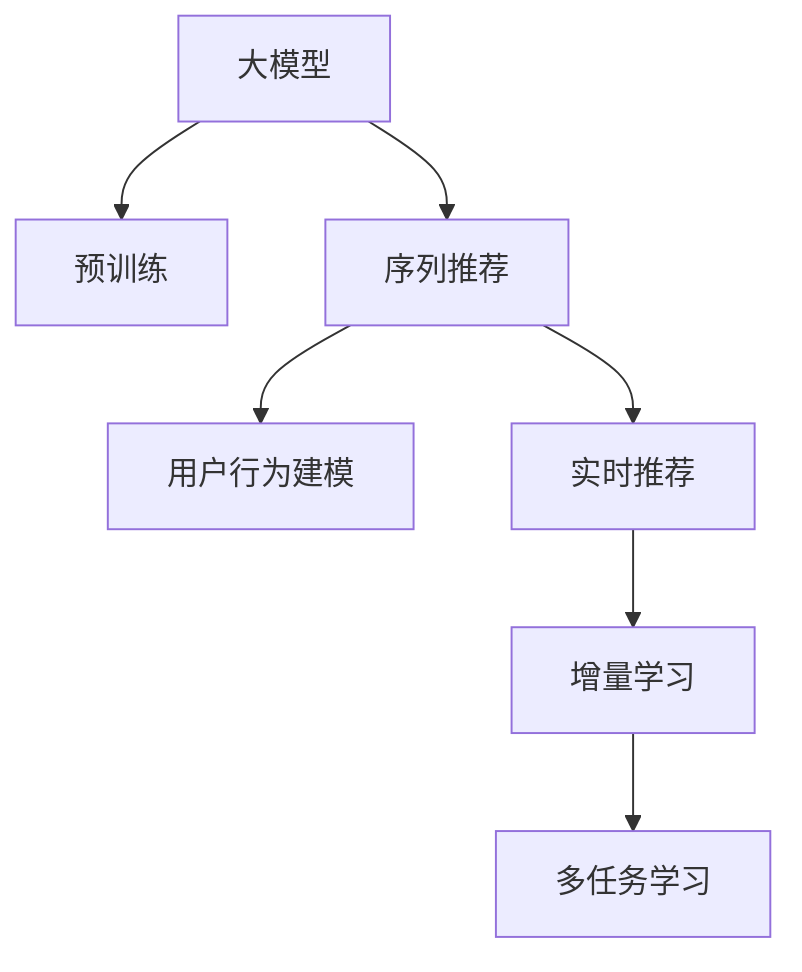

                 

# 推荐系统中的大模型增量学习应用

> 关键词：大模型,增量学习,推荐系统,序列推荐,用户行为建模,实时推荐,系统升级,多任务学习

## 1. 背景介绍

### 1.1 问题由来

推荐系统（Recommendation System）是互联网时代的重要组成部分，通过智能推荐，提升用户体验，推动商品交易，驱动平台增长。然而，传统的推荐算法在面对复杂多变的用户行为和海量数据时，往往力不从心。

为解决推荐系统的数据挑战，大模型技术应运而生。通过在无标签数据上预训练，大模型获取了丰富的用户行为和商品特征知识，具备强大的跨领域泛化能力。基于大模型进行推荐，通过微调、迁移学习等方式，可实现跨品类的推荐，提升推荐效果。

尽管如此，大模型推荐仍面临诸多挑战。数据分布的不断变化、模型的性能衰减、业务场景的快速迭代等，都要求推荐系统具备更强的适应性和弹性。增量学习（Incremental Learning）技术，在面对模型和数据动态变化时，展现出强大的生命力，成为推荐系统的重要补充。

本文聚焦于基于大模型增量学习的推荐系统应用，探索如何通过模型升级、数据融合、任务调优等方式，持续提升推荐系统性能，实现稳定和高效的实时推荐。

### 1.2 问题核心关键点

大模型增量学习的推荐系统具有以下几个核心关键点：

- **数据驱动**：以用户行为数据为基础，通过增量学习不断更新模型，提升推荐效果。
- **高效存储**：采用增量更新策略，减少模型存储需求，加快数据加载速度。
- **实时响应**：在推荐系统中引入增量学习机制，能够实时响应用户需求，缩短推荐延迟。
- **系统优化**：在推荐系统部署和维护中，结合增量学习，减少模型升级频率，降低系统维护成本。
- **模型稳健**：通过增量学习，增强模型对新数据和场景的适应能力，提升系统鲁棒性。

## 2. 核心概念与联系

### 2.1 核心概念概述

为更好地理解大模型增量学习的应用，本节将介绍几个密切相关的核心概念：

- **大模型（Large Model）**：以深度神经网络为基础的超大规模预训练模型，如BERT、GPT等。通过在大规模无标签数据上进行预训练，获取广泛的知识。

- **增量学习（Incremental Learning）**：指在模型训练过程中，模型能够不断接收新数据，并进行模型更新，以适应数据分布变化的过程。增量学习可减少重复训练，提升模型训练效率，同时保持模型性能。

- **序列推荐（Sequential Recommendation）**：指基于用户历史行为序列，预测用户未来行为并推荐相应商品的过程。序列推荐能够捕捉用户行为的时序特征，提升推荐质量。

- **用户行为建模（User Behavior Modeling）**：指通过构建用户行为模型，预测用户兴趣和行为变化，为推荐系统提供输入。用户行为建模是大模型推荐的基础。

- **实时推荐（Real-time Recommendation）**：指在推荐系统中，实时获取用户行为数据，进行模型更新和推荐，提升推荐的时效性和用户体验。

- **多任务学习（Multi-task Learning）**：指在推荐系统中，对多个相关任务进行联合训练，共享模型参数，提升模型性能。

这些核心概念之间的逻辑关系可以通过以下Mermaid流程图来展示：



这个流程图展示了核心概念的关联：

1. 大模型通过预训练获得广泛知识。
2. 基于大模型进行序列推荐，捕捉用户行为的时序特征。
3. 对用户行为进行建模，构建推荐输入。
4. 结合实时推荐，提升推荐的时效性和用户体验。
5. 应用增量学习，更新模型以适应数据变化。
6. 对多个推荐任务进行多任务学习，提升模型性能。

## 3. 核心算法原理 & 具体操作步骤

### 3.1 算法原理概述

大模型增量学习的推荐系统，通过在大规模用户行为数据上进行增量训练，不断更新模型参数，以应对数据分布的变化和业务需求的动态调整。其核心思想是：在每次接收新数据时，计算当前模型与新数据的误差，并使用小批量梯度下降等优化算法更新模型，保持模型的持续优化。

形式化地，假设当前模型为 $M_{\theta}$，新数据集为 $D_{new}$，其中 $\theta$ 为模型参数。增量学习的目标是最小化当前模型与新数据的差距：

$$
\theta^* = \mathop{\arg\min}_{\theta} \| M_{\theta}(x) - y \|_2^2
$$

其中 $x$ 为新数据集的输入，$y$ 为对应的真实标签。

### 3.2 算法步骤详解

大模型增量学习的推荐系统一般包括以下几个关键步骤：

**Step 1: 数据收集与预处理**
- 收集用户历史行为数据，构建推荐样本集。
- 对数据进行预处理，去除噪声和无效数据，并进行归一化处理。

**Step 2: 模型初始化**
- 选择预训练模型，并进行参数初始化。
- 将预训练模型作为初始化参数，进行模型复制。

**Step 3: 模型更新与评估**
- 对新数据集进行模型更新，计算当前模型与新数据的误差，更新模型参数。
- 在测试集上评估模型性能，检查更新效果。

**Step 4: 模型部署与推理**
- 将更新后的模型部署到推荐系统服务端，进行实时推荐。
- 根据用户反馈和系统日志，监测模型性能和系统运行状况。

**Step 5: 参数优化与超参数调优**
- 定期进行模型参数优化，如学习率调整、正则化系数设定等。
- 对模型超参数进行调优，如批量大小、迭代轮数等，提升模型效果。

### 3.3 算法优缺点

大模型增量学习的推荐系统具有以下优点：
1. 高效存储：通过增量更新，减少模型存储需求，加快数据加载速度。
2. 实时响应：能够实时响应用户需求，缩短推荐延迟。
3. 系统优化：减少模型升级频率，降低系统维护成本。
4. 模型稳健：增强模型对新数据和场景的适应能力，提升系统鲁棒性。

同时，该方法也存在一定的局限性：
1. 数据依赖性强：增量学习效果很大程度上取决于新数据的数量和质量。
2. 模型泛化能力有限：模型容易过拟合当前数据，泛化能力受限。
3. 维护成本高：需要定期进行模型优化和参数调优，维护成本较高。

尽管存在这些局限性，但就目前而言，基于大模型的增量学习推荐系统仍然是最主流的研究方向之一。未来相关研究的重点在于如何进一步降低增量学习的计算和空间复杂度，提高模型的泛化能力和鲁棒性，同时兼顾实时性和系统稳定性等因素。

### 3.4 算法应用领域

大模型增量学习的推荐系统，在实际应用中广泛应用于以下几个领域：

- **电商推荐**：通过用户浏览、购买历史数据，为用户推荐商品。应用增量学习，及时捕捉用户兴趣变化，提升推荐效果。
- **内容推荐**：对用户的阅读、观看行为进行建模，推荐相关内容。增量学习可实现实时内容推荐，提升用户满意度。
- **广告推荐**：根据用户点击、浏览行为，推荐广告位。增量学习能够及时调整广告投放策略，提升广告效果。
- **社交推荐**：对用户的社交网络进行建模，推荐朋友动态、群组成员。增量学习能够持续更新社交网络关系，提升推荐准确性。
- **个性化推荐**：根据用户行为数据，推荐个性化内容。增量学习可捕捉用户行为变化，实现精准推荐。

除了上述这些经典应用外，增量学习技术还在更多场景中得到应用，如金融风控、医疗诊断、智能驾驶等，为相关行业带来新的突破。随着预训练模型和增量学习方法的不断进步，相信推荐系统将在更广泛的领域中发挥重要作用，推动智能化应用的发展。

## 4. 数学模型和公式 & 详细讲解 & 举例说明

### 4.1 数学模型构建

本节将使用数学语言对基于大模型的增量学习推荐系统进行更加严格的刻画。

记当前模型为 $M_{\theta}$，新数据集为 $D_{new}=\{(x_i, y_i)\}_{i=1}^N$。增量学习的目标是最小化模型与新数据的误差：

$$
\theta^* = \mathop{\arg\min}_{\theta} \| M_{\theta}(x) - y \|_2^2
$$

其中 $x$ 为新数据集的输入，$y$ 为对应的真实标签。

### 4.2 公式推导过程

以下我们以电商推荐任务为例，推导增量学习模型的训练公式。

假设模型 $M_{\theta}$ 对新数据集 $D_{new}$ 的预测输出为 $M_{\theta}(x)$，对应的真实标签为 $y$。增量学习的目标是更新模型参数 $\theta$，使得 $M_{\theta}(x)$ 更接近 $y$。

设当前模型参数为 $\theta_0$，新数据集 $D_{new}$ 的输入输出对为 $(x_i, y_i)$，则模型对新数据集的误差为：

$$
\delta = M_{\theta_0}(x) - y
$$

增量学习的目标函数为：

$$
\mathcal{L}(\theta) = \frac{1}{2N} \sum_{i=1}^N \| M_{\theta}(x_i) - y_i \|_2^2
$$

通过小批量梯度下降等优化算法，可以更新模型参数：

$$
\theta \leftarrow \theta - \eta \nabla_{\theta}\mathcal{L}(\theta)
$$

其中 $\eta$ 为学习率，$\nabla_{\theta}\mathcal{L}(\theta)$ 为损失函数对参数 $\theta$ 的梯度。

### 4.3 案例分析与讲解

以电商推荐系统为例，对增量学习模型进行详细分析：

**电商推荐系统**：
- 输入：用户浏览历史、购买历史等行为数据。
- 输出：推荐商品列表。
- 目标：根据用户历史行为，预测其购买倾向，推荐商品。

**增量学习应用**：
- 对于每个用户，记录其最近的浏览和购买行为，构建推荐样本集。
- 对于每个样本，计算当前模型 $M_{\theta}$ 与真实标签的误差，更新模型参数。
- 对所有样本进行模型更新后，在测试集上评估模型性能。
- 根据评估结果，调整模型参数和学习率，提升推荐效果。

## 5. 项目实践：代码实例和详细解释说明

### 5.1 开发环境搭建

在进行增量学习推荐系统的开发之前，我们需要准备好开发环境。以下是使用Python进行PyTorch开发的环境配置流程：

1. 安装Anaconda：从官网下载并安装Anaconda，用于创建独立的Python环境。

2. 创建并激活虚拟环境：
```bash
conda create -n pytorch-env python=3.8 
conda activate pytorch-env
```

3. 安装PyTorch：根据CUDA版本，从官网获取对应的安装命令。例如：
```bash
conda install pytorch torchvision torchaudio cudatoolkit=11.1 -c pytorch -c conda-forge
```

4. 安装TensorFlow：
```bash
conda install tensorflow==2.3
```

5. 安装各类工具包：
```bash
pip install numpy pandas scikit-learn matplotlib tqdm jupyter notebook ipython
```

完成上述步骤后，即可在`pytorch-env`环境中开始增量学习推荐系统的开发。

### 5.2 源代码详细实现

下面我们以电商推荐系统为例，给出使用PyTorch进行大模型增量学习的完整代码实现。

首先，定义电商推荐任务的数据处理函数：

```python
from torch.utils.data import Dataset
import torch

class RecommendDataset(Dataset):
    def __init__(self, data, tokenizer):
        self.data = data
        self.tokenizer = tokenizer
        
    def __len__(self):
        return len(self.data)
    
    def __getitem__(self, item):
        user, item = self.data[item]
        tokens = self.tokenizer(user, padding='max_length', truncation=True)
        item_ids = self.tokenizer.tokenize(item)
        tokens.extend(item_ids)
        return {'input_ids': tokens, 'labels': 1} if item in self.data else {'input_ids': tokens, 'labels': 0}
```

然后，定义模型和优化器：

```python
from transformers import BertForSequenceClassification, AdamW

model = BertForSequenceClassification.from_pretrained('bert-base-cased', num_labels=2)
optimizer = AdamW(model.parameters(), lr=1e-5)
```

接着，定义训练和评估函数：

```python
from torch.utils.data import DataLoader
from tqdm import tqdm

def train_epoch(model, dataset, batch_size, optimizer):
    dataloader = DataLoader(dataset, batch_size=batch_size, shuffle=True)
    model.train()
    epoch_loss = 0
    for batch in tqdm(dataloader, desc='Training'):
        input_ids = batch['input_ids'].to(device)
        labels = batch['labels'].to(device)
        model.zero_grad()
        outputs = model(input_ids)
        loss = outputs.loss
        epoch_loss += loss.item()
        loss.backward()
        optimizer.step()
    return epoch_loss / len(dataloader)

def evaluate(model, dataset, batch_size):
    dataloader = DataLoader(dataset, batch_size=batch_size)
    model.eval()
    preds, labels = [], []
    with torch.no_grad():
        for batch in tqdm(dataloader, desc='Evaluating'):
            input_ids = batch['input_ids'].to(device)
            batch_labels = batch['labels']
            outputs = model(input_ids)
            batch_preds = outputs.logits.argmax(dim=2).to('cpu').tolist()
            batch_labels = batch_labels.to('cpu').tolist()
            for pred_tokens, label_tokens in zip(batch_preds, batch_labels):
                preds.append(pred_tokens)
                labels.append(label_tokens)
                
    print(classification_report(labels, preds))
```

最后，启动训练流程并在测试集上评估：

```python
epochs = 5
batch_size = 16

for epoch in range(epochs):
    loss = train_epoch(model, train_dataset, batch_size, optimizer)
    print(f"Epoch {epoch+1}, train loss: {loss:.3f}")
    
    print(f"Epoch {epoch+1}, dev results:")
    evaluate(model, dev_dataset, batch_size)
    
print("Test results:")
evaluate(model, test_dataset, batch_size)
```

以上就是使用PyTorch对大模型进行电商推荐系统增量学习的完整代码实现。可以看到，利用PyTorch和Transformers库，开发增量学习推荐系统的代码实现相对简洁高效。

### 5.3 代码解读与分析

让我们再详细解读一下关键代码的实现细节：

**RecommendDataset类**：
- `__init__`方法：初始化数据和分词器等组件。
- `__len__`方法：返回数据集的样本数量。
- `__getitem__`方法：对单个样本进行处理，将用户ID和商品ID转换为token ids，并对其进行定长padding，最终返回模型所需的输入。

**训练和评估函数**：
- 使用PyTorch的DataLoader对数据集进行批次化加载，供模型训练和推理使用。
- 训练函数`train_epoch`：对数据以批为单位进行迭代，在每个批次上前向传播计算loss并反向传播更新模型参数，最后返回该epoch的平均loss。
- 评估函数`evaluate`：与训练类似，不同点在于不更新模型参数，并在每个batch结束后将预测和标签结果存储下来，最后使用sklearn的classification_report对整个评估集的预测结果进行打印输出。

**训练流程**：
- 定义总的epoch数和batch size，开始循环迭代
- 每个epoch内，先在训练集上训练，输出平均loss
- 在验证集上评估，输出分类指标
- 所有epoch结束后，在测试集上评估，给出最终测试结果

可以看到，PyTorch配合Transformers库使得大模型增量学习的代码实现变得简洁高效。开发者可以将更多精力放在数据处理、模型改进等高层逻辑上，而不必过多关注底层的实现细节。

当然，工业级的系统实现还需考虑更多因素，如模型的保存和部署、超参数的自动搜索、更灵活的任务适配层等。但核心的增量学习范式基本与此类似。

## 6. 实际应用场景

### 6.1 电商推荐

基于大模型增量学习的电商推荐系统，可以显著提升推荐效果，提高用户体验。通过实时接收用户行为数据，持续更新推荐模型，可以捕捉用户兴趣的变化，实现精准推荐。

在技术实现上，可以采用增量学习的策略，对用户的每次浏览、点击、购买行为进行记录和处理，构建推荐样本集。然后，对每个样本进行模型更新，逐步优化推荐模型。最终，将更新后的模型应用到实时推荐系统中，实现动态推荐。

### 6.2 内容推荐

对用户的阅读、观看行为进行建模，推荐相关内容，可以提升用户满意度。采用增量学习，能够实现实时内容推荐，提升用户体验。

具体而言，可以在用户阅读、观看行为发生后，立即更新推荐模型。然后，根据用户行为数据，实时计算推荐结果，动态更新推荐页面，展示最新内容。增量学习能够捕捉用户行为的变化，实现个性化推荐。

### 6.3 广告推荐

根据用户点击、浏览行为，推荐广告位，可以提升广告效果。采用增量学习，能够及时调整广告投放策略，提升广告效果。

具体而言，可以收集用户点击、浏览行为，构建广告推荐样本集。然后，对每个样本进行模型更新，逐步优化广告推荐模型。最终，将更新后的模型应用到广告推荐系统中，实时推荐相关广告位，提升广告点击率和转化率。

### 6.4 未来应用展望

随着大模型增量学习技术的不断发展，其在推荐系统中的应用前景将更加广阔。未来，基于增量学习的方法将广泛应用于以下几个领域：

- **社交推荐**：对用户的社交网络进行建模，推荐朋友动态、群组成员。增量学习能够持续更新社交网络关系，提升推荐准确性。
- **个性化推荐**：根据用户行为数据，推荐个性化内容。增量学习可捕捉用户行为变化，实现精准推荐。
- **实时推荐**：结合实时数据，实现动态推荐，提升用户体验。增量学习能够实时响应用户需求，缩短推荐延迟。
- **跨领域推荐**：结合多领域数据，实现跨品类的推荐，提升推荐质量。增量学习能够灵活应对不同领域的数据特性。
- **协同过滤推荐**：结合用户行为数据和商品特征，实现协同过滤推荐。增量学习能够捕捉用户兴趣的变化，提升推荐效果。

## 7. 工具和资源推荐

### 7.1 学习资源推荐

为了帮助开发者系统掌握大模型增量学习的推荐系统理论基础和实践技巧，这里推荐一些优质的学习资源：

1. 《Deep Learning with Python》书籍：由Francois Chollet撰写，全面介绍了深度学习的基本概念和实践技巧，包括推荐系统的基本原理。

2. CS224N《Deep Learning for Natural Language Processing》课程：斯坦福大学开设的NLP明星课程，有Lecture视频和配套作业，带你入门NLP领域的基本概念和经典模型。

3. 《Recommender Systems: Advanced Techniques》书籍：详细介绍了推荐系统的基本原理和高级技术，包括增量学习、协同过滤等。

4. 《Machine Learning Yearning》书籍：Andrew Ng的最新著作，介绍了机器学习的基本原理和实践技巧，涵盖推荐系统的设计和实现。

5. Kaggle平台：提供了大量的推荐系统竞赛数据集和解决方案，适合实践增量学习推荐系统。

通过对这些资源的学习实践，相信你一定能够快速掌握大模型增量学习的精髓，并用于解决实际的推荐问题。

### 7.2 开发工具推荐

高效的开发离不开优秀的工具支持。以下是几款用于大模型增量学习推荐系统开发的常用工具：

1. PyTorch：基于Python的开源深度学习框架，灵活动态的计算图，适合快速迭代研究。大部分预训练语言模型都有PyTorch版本的实现。

2. TensorFlow：由Google主导开发的开源深度学习框架，生产部署方便，适合大规模工程应用。同样有丰富的预训练语言模型资源。

3. Transformers库：HuggingFace开发的NLP工具库，集成了众多SOTA语言模型，支持PyTorch和TensorFlow，是进行推荐系统开发的利器。

4. Weights & Biases：模型训练的实验跟踪工具，可以记录和可视化模型训练过程中的各项指标，方便对比和调优。与主流深度学习框架无缝集成。

5. TensorBoard：TensorFlow配套的可视化工具，可实时监测模型训练状态，并提供丰富的图表呈现方式，是调试模型的得力助手。

6. Google Cloud Platform：提供高性能GPU/TPU算力，支持大规模模型训练和部署。适合工业级的推荐系统开发。

合理利用这些工具，可以显著提升增量学习推荐系统的开发效率，加快创新迭代的步伐。

### 7.3 相关论文推荐

大模型增量学习推荐系统的研究源于学界的持续研究。以下是几篇奠基性的相关论文，推荐阅读：

1. "Incremental Learning" by Little et al.：经典的增量学习综述论文，介绍了增量学习的定义、方法和应用场景。

2. "Incremental Learning for Recommendation Systems: A Survey" by Wang et al.：综述了推荐系统中的增量学习方法，包括在线学习、增量优化等。

3. "Continuous Recommendation" by Zhang et al.：介绍了连续推荐系统，结合实时数据进行动态推荐，提升推荐效果。

4. "Fully Incremental Deep Learning: The Interpolation Method" by Wu et al.：提出了一种全增量深度学习方法，通过插值方式更新模型，提高增量学习的效率。

5. "Efficient Incremental Training of Neural Networks" by Tan et al.：综述了增量学习在深度神经网络中的应用，包括增量优化、参数复用等。

这些论文代表了大模型增量学习推荐系统的发展脉络。通过学习这些前沿成果，可以帮助研究者把握学科前进方向，激发更多的创新灵感。

## 8. 总结：未来发展趋势与挑战

### 8.1 总结

本文对基于大模型的增量学习推荐系统进行了全面系统的介绍。首先阐述了增量学习在推荐系统中的重要作用，明确了增量学习在模型存储、实时响应、系统优化等方面的独特价值。其次，从原理到实践，详细讲解了增量学习模型的数学原理和关键步骤，给出了增量学习推荐系统的完整代码实例。同时，本文还广泛探讨了增量学习在电商推荐、内容推荐、广告推荐等多个推荐场景中的应用前景，展示了增量学习范式的巨大潜力。最后，本文精选了增量学习的学习资源、开发工具和相关论文，力求为读者提供全方位的技术指引。

通过本文的系统梳理，可以看到，基于大模型的增量学习推荐系统正在成为推荐系统的重要范式，极大地拓展了预训练模型在推荐系统中的应用边界，催生了更多的落地场景。受益于大规模语料的预训练，增量学习推荐系统能够在不断变化的数据和业务场景中持续优化，实现高效、稳定的实时推荐。未来，伴随预训练模型和增量学习方法的不断进步，相信推荐系统将在更广泛的领域中发挥重要作用，推动智能化应用的发展。

### 8.2 未来发展趋势

展望未来，大模型增量学习的推荐系统将呈现以下几个发展趋势：

1. **高效存储**：采用增量更新策略，减少模型存储需求，加快数据加载速度。未来的推荐系统将更加注重模型的存储优化，通过增量更新策略，实现轻量级部署。

2. **实时响应**：结合实时数据，实现动态推荐，提升推荐的时效性和用户体验。未来的推荐系统将具备更强的实时响应能力，实现秒级推荐。

3. **系统优化**：减少模型升级频率，降低系统维护成本。未来的推荐系统将更加注重系统优化，通过增量学习，降低系统维护成本。

4. **多任务学习**：对多个推荐任务进行联合训练，共享模型参数，提升模型性能。未来的推荐系统将更加注重多任务学习，实现跨任务协同优化。

5. **多领域融合**：结合多领域数据，实现跨品类的推荐，提升推荐质量。未来的推荐系统将更加注重多领域融合，实现全场景推荐。

6. **个性化推荐**：根据用户行为数据，推荐个性化内容。未来的推荐系统将更加注重个性化推荐，实现精准推荐。

7. **持续学习**：增强模型对新数据和场景的适应能力，提升系统鲁棒性。未来的推荐系统将更加注重持续学习，保持模型的持续优化。

这些趋势凸显了大模型增量学习推荐系统的广阔前景。这些方向的探索发展，必将进一步提升推荐系统性能，实现更加智能化、个性化、实时的推荐服务。

### 8.3 面临的挑战

尽管大模型增量学习推荐系统已经取得了瞩目成就，但在迈向更加智能化、普适化应用的过程中，它仍面临诸多挑战：

1. **数据依赖性强**：增量学习效果很大程度上取决于新数据的数量和质量。在数据分布变化较大的场景下，增量学习效果可能受到影响。

2. **模型泛化能力有限**：模型容易过拟合当前数据，泛化能力受限。在用户行为变化较大的场景下，增量学习模型可能出现泛化性能下降的问题。

3. **维护成本高**：需要定期进行模型优化和参数调优，维护成本较高。在模型升级和系统维护过程中，需要投入大量时间和精力。

4. **实时性要求高**：需要实时响应用户需求，缩短推荐延迟。在面对大规模用户请求时，系统需要具备更强的实时响应能力。

5. **系统稳定性**：需要确保系统稳定运行，避免由于模型更新导致的系统异常。在系统升级和模型更新过程中，需要具备良好的容错和故障恢复能力。

尽管存在这些挑战，但通过技术创新和工程实践的不断优化，大模型增量学习推荐系统必将迎来新的突破。相信随着学界和产业界的共同努力，这些挑战终将一一被克服，大模型增量学习推荐系统必将在构建智能推荐系统时发挥越来越重要的作用。

### 8.4 研究展望

面对大模型增量学习推荐系统所面临的诸多挑战，未来的研究需要在以下几个方面寻求新的突破：

1. **无监督和半监督学习**：探索无监督和半监督学习范式，摆脱对大规模标注数据的依赖，利用非结构化数据，实现更灵活的增量学习。

2. **自适应学习算法**：开发自适应增量学习算法，提高增量学习的效率和效果，实现更高效的模型更新。

3. **多任务联合优化**：探索多任务联合优化的方法，提高模型的跨任务泛化能力，实现全场景推荐。

4. **模型压缩和稀疏化**：采用模型压缩和稀疏化技术，减少模型参数量和存储空间，实现更高效的推荐服务。

5. **参数高效更新**：开发参数高效更新的方法，在固定大部分预训练参数的同时，只更新极少量的任务相关参数，提升增量学习的效率。

6. **联邦学习**：结合联邦学习技术，实现分布式增量学习，提升模型的泛化能力和鲁棒性。

这些研究方向的探索，必将引领大模型增量学习推荐系统技术迈向更高的台阶，为构建高效、稳定、智能的推荐系统提供新的技术路径。面向未来，大模型增量学习推荐系统还需要与其他人工智能技术进行更深入的融合，如知识表示、因果推理、强化学习等，多路径协同发力，共同推动推荐系统的发展。

## 9. 附录：常见问题与解答

**Q1：什么是增量学习？**

A: 增量学习（Incremental Learning）是指在模型训练过程中，模型能够不断接收新数据，并进行模型更新，以适应数据分布变化的过程。增量学习可减少重复训练，提升模型训练效率，同时保持模型性能。

**Q2：增量学习在推荐系统中的应用场景有哪些？**

A: 增量学习在推荐系统中的应用场景主要包括：
- 电商推荐：通过用户浏览、购买历史数据，为用户推荐商品。
- 内容推荐：对用户的阅读、观看行为进行建模，推荐相关内容。
- 广告推荐：根据用户点击、浏览行为，推荐广告位。
- 实时推荐：结合实时数据，实现动态推荐，提升推荐的时效性和用户体验。
- 多领域融合：结合多领域数据，实现跨品类的推荐，提升推荐质量。

**Q3：增量学习在推荐系统中的主要挑战有哪些？**

A: 增量学习在推荐系统中的主要挑战包括：
- 数据依赖性强：增量学习效果很大程度上取决于新数据的数量和质量。
- 模型泛化能力有限：模型容易过拟合当前数据，泛化能力受限。
- 维护成本高：需要定期进行模型优化和参数调优，维护成本较高。
- 实时性要求高：需要实时响应用户需求，缩短推荐延迟。
- 系统稳定性：需要确保系统稳定运行，避免由于模型更新导致的系统异常。

尽管存在这些挑战，但通过技术创新和工程实践的不断优化，增量学习推荐系统必将迎来新的突破。相信随着学界和产业界的共同努力，这些挑战终将一一被克服，增量学习推荐系统必将在构建智能推荐系统时发挥越来越重要的作用。

---

作者：禅与计算机程序设计艺术 / Zen and the Art of Computer Programming

