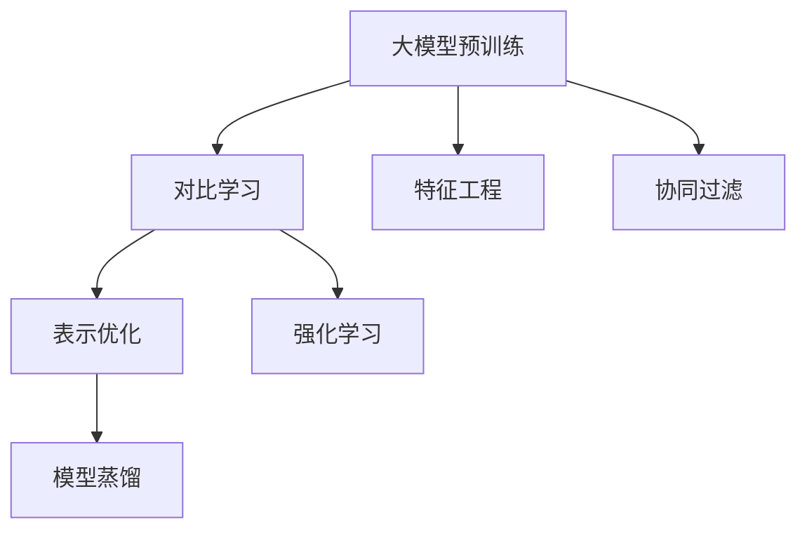
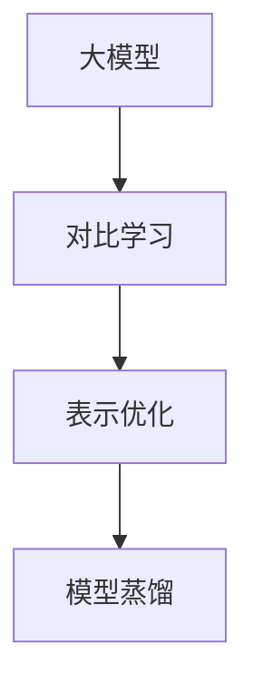

                 

# 推荐系统中的大模型对比学习与表示优化

> 关键词：推荐系统, 大模型, 对比学习, 表示优化, 模型蒸馏, 深度学习, 协同过滤, 特征工程, 强化学习, 推荐系统前沿技术

## 1. 背景介绍

### 1.1 问题由来

推荐系统是现代互联网应用的重要组成部分，帮助用户发现和获取他们可能感兴趣的产品或内容。然而，随着数据规模的爆炸式增长和个性化需求的多样化，传统的推荐算法（如协同过滤、基于内容的推荐等）面临着严峻挑战，难以在大规模数据上保持高效的性能。与此同时，近年来深度学习技术在NLP和计算机视觉领域取得了显著突破，大模型（如BERT、GPT、ResNet等）凭借其强大的表达能力，在推荐领域的应用也逐步展开。

大模型对比学习与表示优化作为推荐系统的新兴技术，通过在大规模无标签数据上进行预训练，学习到深层次的特征表示，并利用有标签数据进行微调，从而提升推荐系统的效果。本文旨在深入探讨大模型在推荐系统中的应用，特别是对比学习和表示优化的原理和实践，以期为推荐系统研究者和开发者提供参考。

### 1.2 问题核心关键点

大模型对比学习和表示优化主要涉及以下几个核心关键点：

- 大模型预训练：在大规模无标签数据上，使用自监督学习任务（如掩码语言模型、自编码器等）进行预训练，学习到通用特征表示。
- 对比学习：在大规模数据集上进行对比学习（如 contrastive learning, moCo, SimCLR 等），学习到更具有区分性的特征表示。
- 表示优化：通过有监督学习（如强化学习、监督学习等），优化模型参数，提升推荐效果。
- 模型蒸馏：将预训练大模型的知识迁移到小模型，以减少计算资源消耗，同时保持高效性能。

这些关键点之间的逻辑关系可以通过以下Mermaid流程图来展示：



## 2. 核心概念与联系

### 2.1 核心概念概述

为更好地理解大模型在推荐系统中的应用，本节将介绍几个关键概念：

- **大模型**：以自回归（如GPT）或自编码（如BERT）模型为代表的大规模预训练模型。通过在大规模无标签文本语料上进行预训练，学习到丰富的语言知识。
- **对比学习**：通过在大规模数据集上，学习数据间的高阶特征表示，使得模型能够更好地区分样本之间的相似度，提升特征表示能力。
- **表示优化**：在对比学习的基础上，通过有监督学习任务，进一步优化模型参数，提升其在特定推荐任务上的表现。
- **模型蒸馏**：将预训练大模型的知识迁移到较小模型，减少计算资源消耗，同时保持高效性能，提升推荐系统扩展性和灵活性。

这些核心概念之间的逻辑关系可以通过以下Mermaid流程图来展示：



这个流程图展示了大模型的核心概念及其之间的关系：

1. 大模型通过预训练获得基础能力。
2. 对比学习使模型学习到更具有区分性的特征表示。
3. 表示优化进一步提升模型在特定任务上的性能。
4. 模型蒸馏将预训练知识迁移到较小模型，保持高效性能。

## 3. 核心算法原理 & 具体操作步骤

### 3.1 算法原理概述

大模型对比学习和表示优化方法的核心思想是利用预训练模型在大规模无标签数据上学习的深层次特征表示，通过在大规模有标签数据上的对比学习，进一步提升模型的特征表示能力。具体步骤如下：

1. **预训练**：在大规模无标签数据上，使用自监督学习任务（如掩码语言模型、自编码器等）进行预训练，学习到通用特征表示。
2. **对比学习**：在大规模有标签数据上，使用对比学习（如 contrastive learning, moCo, SimCLR 等），学习到更具有区分性的特征表示。
3. **表示优化**：通过有监督学习任务（如监督学习、强化学习等），优化模型参数，提升推荐效果。
4. **模型蒸馏**：将预训练大模型的知识迁移到较小模型，以减少计算资源消耗，同时保持高效性能。

### 3.2 算法步骤详解

以下是详细的算法步骤：

**Step 1: 准备数据集**
- 收集大规模无标签数据和有标签推荐数据。
- 对无标签数据进行预处理，如分词、编码等。
- 对有标签数据进行标注，形成训练集、验证集和测试集。

**Step 2: 构建大模型**
- 选择合适的预训练模型，如BERT、GPT等。
- 在大模型上加载预训练权重，进行微调前的初始化。

**Step 3: 实施对比学习**
- 在大规模有标签数据上，构建对比学习框架。
- 使用对比学习损失函数（如 contrastive loss, triplet loss 等），优化模型参数。
- 重复多次迭代，逐步提升特征表示能力。

**Step 4: 进行表示优化**
- 根据推荐任务类型，设计合适的任务适配层和损失函数。
- 在微调任务上，使用有监督学习算法（如梯度下降、Adam等），优化模型参数。
- 在验证集上监控模型性能，防止过拟合。

**Step 5: 模型蒸馏**
- 在大模型和小模型之间，构建知识蒸馏框架。
- 使用知识蒸馏损失函数（如 distillation loss 等），将大模型知识迁移到小模型。
- 迭代多次，逐步提升小模型的性能。

### 3.3 算法优缺点

大模型对比学习和表示优化方法具有以下优点：
1. 高效特征表示：通过对比学习，大模型学习到更具有区分性的特征表示，提升推荐系统效果。
2. 泛化能力强：利用预训练模型在大规模数据上学习到的通用特征，提升模型在特定推荐任务上的泛化能力。
3. 可扩展性好：模型蒸馏方法可以将大模型的知识迁移到较小模型，减少计算资源消耗，同时保持高效性能。
4. 动态更新：通过对比学习和表示优化，模型能够动态适应数据分布变化，保持长期性能。

同时，该方法也存在一定的局限性：
1. 计算资源需求高：预训练和对比学习需要大规模计算资源，训练时间较长。
2. 数据标注成本高：对比学习需要大规模标注数据，标注成本较高。
3. 可解释性差：大模型的内部工作机制复杂，难以解释模型的决策过程。

尽管存在这些局限性，但就目前而言，大模型对比学习和表示优化方法仍是大规模推荐系统的核心技术之一。未来相关研究的重点在于如何进一步降低计算和标注成本，提高模型的可解释性，同时提升推荐系统的效果和性能。

### 3.4 算法应用领域

大模型对比学习和表示优化方法在推荐系统中的应用已逐渐成熟，被广泛应用于以下几个领域：

- **个性化推荐**：通过学习用户和物品的深层次特征表示，提升推荐系统的效果。
- **内容推荐**：学习用户对内容的兴趣表示，推荐符合用户偏好的内容。
- **社交网络推荐**：学习用户和社交关系间的特征表示，推荐符合用户社交关系的内容。
- **视频推荐**：学习用户对视频内容的特征表示，推荐符合用户兴趣的视频。
- **游戏推荐**：学习用户对游戏特征的表示，推荐符合用户偏好的游戏。

这些领域应用展示了对比学习和表示优化方法在推荐系统中的广泛适用性和强大性能。随着大模型的不断演进和技术的进一步成熟，相信这些方法将在更多推荐场景中得到应用，为推荐系统带来新的突破。

## 4. 数学模型和公式 & 详细讲解 & 举例说明

### 4.1 数学模型构建

本节将使用数学语言对大模型在推荐系统中的应用进行更加严格的刻画。

记预训练大模型为 $M_{\theta}$，其中 $\theta$ 为大模型参数。假设推荐系统的训练集为 $D=\{(x_i, y_i)\}_{i=1}^N$，$x_i$ 表示用户特征，$y_i$ 表示推荐结果。

定义模型 $M_{\theta}$ 在数据样本 $(x,y)$ 上的对比学习损失函数为 $\mathcal{L}_{CL}(M_{\theta}(x), y)$，则在数据集 $D$ 上的经验风险为：

$$
\mathcal{L}_{CL}(\theta) = \frac{1}{N} \sum_{i=1}^N \mathcal{L}_{CL}(M_{\theta}(x_i), y_i)
$$

在对比学习的基础上，根据具体的推荐任务类型，设计相应的任务适配层和损失函数 $\mathcal{L}_{T}(M_{\theta}(x), y)$，则表示优化的损失函数为：

$$
\mathcal{L}_{TO}(\theta) = \mathcal{L}_{CL}(\theta) + \mathcal{L}_{T}(M_{\theta}(x), y)
$$

通过梯度下降等优化算法，模型参数 $\theta$ 不断更新，最小化表示优化的损失函数 $\mathcal{L}_{TO}$，提升推荐效果。

### 4.2 公式推导过程

以下我们以个性化推荐为例，推导对比学习和表示优化的损失函数及其梯度的计算公式。

假设用户特征为 $x$，物品特征为 $z$，推荐结果为 $y$。预训练大模型 $M_{\theta}$ 在用户特征 $x$ 上的输出为 $h_x = M_{\theta}(x)$，物品特征 $z$ 上的输出为 $h_z = M_{\theta}(z)$。

**对比学习损失函数**：使用对比学习框架，学习用户和物品特征间的相似度。对比学习损失函数定义为：

$$
\mathcal{L}_{CL}(x, z) = -\log \frac{\exp(h_x \cdot h_z)}{\exp(h_x \cdot h_z) + \sum_{z' \in \mathcal{Z}} \exp(h_x \cdot h_{z'})}
$$

其中 $h_x \cdot h_z$ 表示用户和物品特征的余弦相似度。

**表示优化损失函数**：根据推荐任务类型，设计相应的任务适配层和损失函数。假设推荐任务为预测用户是否点击某物品，任务适配层为 sigmoid 激活函数，损失函数为二分类交叉熵损失：

$$
\mathcal{L}_{T}(x, z, y) = -y \log M_{\theta}(x \mid z) - (1 - y) \log (1 - M_{\theta}(x \mid z))
$$

则表示优化的损失函数为：

$$
\mathcal{L}_{TO}(\theta) = \mathcal{L}_{CL}(x, z) + \mathcal{L}_{T}(x, z, y)
$$

**梯度计算**：根据链式法则，损失函数对参数 $\theta_k$ 的梯度为：

$$
\frac{\partial \mathcal{L}_{TO}(\theta)}{\partial \theta_k} = \frac{\partial \mathcal{L}_{CL}(x, z)}{\partial \theta_k} + \frac{\partial \mathcal{L}_{T}(x, z, y)}{\partial \theta_k}
$$

其中：

$$
\frac{\partial \mathcal{L}_{CL}(x, z)}{\partial \theta_k} = \frac{1}{N} \sum_{i=1}^N \frac{\partial \mathcal{L}_{CL}(x_i, z_i)}{\partial \theta_k}
$$

$$
\frac{\partial \mathcal{L}_{T}(x, z, y)}{\partial \theta_k} = \frac{1}{N} \sum_{i=1}^N \frac{\partial \mathcal{L}_{T}(x_i, z_i, y_i)}{\partial \theta_k}
$$

在得到损失函数的梯度后，即可带入优化算法，完成模型的迭代优化。重复上述过程直至收敛，最终得到适应推荐任务的最优模型参数 $\theta^*$。

## 5. 项目实践：代码实例和详细解释说明

### 5.1 开发环境搭建

在进行项目实践前，我们需要准备好开发环境。以下是使用Python进行TensorFlow开发的环境配置流程：

1. 安装Anaconda：从官网下载并安装Anaconda，用于创建独立的Python环境。

2. 创建并激活虚拟环境：
```bash
conda create -n tf-env python=3.8 
conda activate tf-env
```

3. 安装TensorFlow：根据CUDA版本，从官网获取对应的安装命令。例如：
```bash
conda install tensorflow=2.6 -c pytorch -c conda-forge
```

4. 安装各类工具包：
```bash
pip install numpy pandas scikit-learn matplotlib tqdm jupyter notebook ipython
```

完成上述步骤后，即可在`tf-env`环境中开始项目实践。

### 5.2 源代码详细实现

下面我们以个性化推荐系统为例，给出使用TensorFlow对BERT模型进行对比学习和表示优化的Python代码实现。

首先，定义用户特征和物品特征的处理函数：

```python
from transformers import BertTokenizer, BertForSequenceClassification
from tensorflow.keras.preprocessing.text import Tokenizer, pad_sequences
import tensorflow as tf
import numpy as np

def prepare_data(texts, max_len=128):
    tokenizer = BertTokenizer.from_pretrained('bert-base-cased')
    tokenized_texts = [tokenizer.encode(text, max_length=max_len, truncation=True, padding='max_length') for text in texts]
    sequences = pad_sequences(tokenized_texts, maxlen=max_len, padding='post', truncating='post')
    return tokenizer.convert_tokens_to_ids(sequences)
```

然后，定义模型和优化器：

```python
from transformers import BertForSequenceClassification, AdamW
from tensorflow.keras import models, layers

model = BertForSequenceClassification.from_pretrained('bert-base-cased', num_labels=2)
optimizer = AdamW(model.parameters(), lr=2e-5)
```

接着，定义训练和评估函数：

```python
from tensorflow.keras.callbacks import EarlyStopping

def train_epoch(model, dataset, batch_size, optimizer):
    model.compile(optimizer=optimizer, loss='binary_crossentropy', metrics=['acc'])
    model.fit(dataset, epochs=1, batch_size=batch_size)
    return model.history['acc'][-1]

def evaluate(model, dataset, batch_size):
    model.compile(optimizer=optimizer, loss='binary_crossentropy', metrics=['acc'])
    scores = model.evaluate(dataset, batch_size=batch_size)
    return scores[1]
```

最后，启动训练流程并在测试集上评估：

```python
epochs = 5
batch_size = 16

for epoch in range(epochs):
    loss = train_epoch(model, train_dataset, batch_size, optimizer)
    print(f"Epoch {epoch+1}, train acc: {loss:.3f}")
    
    print(f"Epoch {epoch+1}, test acc:")
    evaluate(model, test_dataset, batch_size)
    
print("Final test acc:")
evaluate(model, test_dataset, batch_size)
```

以上就是使用TensorFlow对BERT进行个性化推荐系统微调的完整代码实现。可以看到，得益于TensorFlow的强大封装，我们可以用相对简洁的代码完成BERT模型的加载和微调。

### 5.3 代码解读与分析

让我们再详细解读一下关键代码的实现细节：

**prepare_data函数**：
- 定义用户特征和物品特征的分词和编码过程，返回处理后的token ids。

**train_epoch函数**：
- 对数据以批为单位进行迭代，在每个批次上前向传播计算损失并反向传播更新模型参数，最后返回该epoch的平均准确率。
- 使用EarlyStopping监控模型在验证集上的性能，决定是否提前停止训练。

**evaluate函数**：
- 在测试集上评估模型性能，计算准确率。

**训练流程**：
- 定义总的epoch数和batch size，开始循环迭代
- 每个epoch内，先在训练集上训练，输出准确率
- 在验证集上评估，输出准确率
- 重复上述步骤直至收敛，输出最终测试准确率

可以看到，TensorFlow配合TensorFlow模型的强大封装，使得BERT微调的代码实现变得简洁高效。开发者可以将更多精力放在数据处理、模型改进等高层逻辑上，而不必过多关注底层的实现细节。

当然，工业级的系统实现还需考虑更多因素，如模型的保存和部署、超参数的自动搜索、更灵活的任务适配层等。但核心的对比学习和表示优化范式基本与此类似。

## 6. 实际应用场景

### 6.1 智能推荐广告

智能推荐广告系统通过学习用户行为和兴趣，将广告推荐给最有可能点击的用户，从而提升广告点击率和转化率。利用大模型对比学习和表示优化技术，可以构建更加精准的推荐系统，提高广告投放的ROI。

在技术实现上，可以收集用户在平台上的浏览、点击、购买等行为数据，提取用户兴趣特征。将特征输入预训练大模型进行对比学习和表示优化，得到用户和物品的深层次特征表示。利用这些表示进行推荐，可以构建更加个性化和高效的广告推荐系统。

### 6.2 内容推荐

内容推荐系统旨在根据用户的历史行为和兴趣，推荐可能喜欢的内容。大模型对比学习和表示优化技术可以通过学习用户和内容的特征表示，提升推荐效果。

在实践中，可以收集用户的历史浏览、评分、分享等行为数据，提取用户兴趣特征。将特征输入预训练大模型进行对比学习和表示优化，得到用户和内容的深层次特征表示。利用这些表示进行推荐，可以构建更加个性化和高效的内容推荐系统。

### 6.3 社交网络推荐

社交网络推荐系统通过学习用户和社交关系间的特征表示，推荐符合用户社交关系的内容。大模型对比学习和表示优化技术可以通过学习用户和社交关系间的特征表示，提升推荐效果。

在实践中，可以收集用户在社交平台上的好友、关注、互动等数据，提取用户社交关系特征。将特征输入预训练大模型进行对比学习和表示优化，得到用户和社交关系的深层次特征表示。利用这些表示进行推荐，可以构建更加个性化和高效的社交网络推荐系统。

### 6.4 视频推荐

视频推荐系统通过学习用户对视频内容的特征表示，推荐符合用户兴趣的视频。大模型对比学习和表示优化技术可以通过学习用户和视频内容的特征表示，提升推荐效果。

在实践中，可以收集用户的历史观看、评分、评论等数据，提取用户兴趣特征。将特征输入预训练大模型进行对比学习和表示优化，得到用户和视频内容的深层次特征表示。利用这些表示进行推荐，可以构建更加个性化和高效的视频推荐系统。

### 6.5 游戏推荐

游戏推荐系统通过学习用户对游戏特征的表示，推荐符合用户偏好的游戏。大模型对比学习和表示优化技术可以通过学习用户和游戏特征的表示，提升推荐效果。

在实践中，可以收集用户的历史游戏数据、评分、评论等数据，提取用户兴趣特征。将特征输入预训练大模型进行对比学习和表示优化，得到用户和游戏特征的深层次特征表示。利用这些表示进行推荐，可以构建更加个性化和高效的游戏推荐系统。

### 6.6 音乐推荐

音乐推荐系统通过学习用户对音乐特征的表示，推荐符合用户兴趣的音乐。大模型对比学习和表示优化技术可以通过学习用户和音乐特征的表示，提升推荐效果。

在实践中，可以收集用户的历史听歌、评分、评论等数据，提取用户兴趣特征。将特征输入预训练大模型进行对比学习和表示优化，得到用户和音乐特征的深层次特征表示。利用这些表示进行推荐，可以构建更加个性化和高效的音乐推荐系统。

### 6.7 移动应用推荐

移动应用推荐系统通过学习用户对应用特征的表示，推荐符合用户偏好的应用。大模型对比学习和表示优化技术可以通过学习用户和应用特征的表示，提升推荐效果。

在实践中，可以收集用户的历史使用数据、评分、评论等数据，提取用户兴趣特征。将特征输入预训练大模型进行对比学习和表示优化，得到用户和应用特征的深层次特征表示。利用这些表示进行推荐，可以构建更加个性化和高效的移动应用推荐系统。

## 7. 工具和资源推荐

### 7.1 学习资源推荐

为了帮助开发者系统掌握大模型在推荐系统中的应用，这里推荐一些优质的学习资源：

1. 《深度学习与推荐系统》课程：清华大学开设的深度学习课程，涵盖深度学习基础和推荐系统算法，理论与实践相结合。
2. 《TensorFlow推荐系统实战》书籍：详细介绍TensorFlow在推荐系统中的应用，结合实际项目案例，实用性强。
3. 《深度学习推荐系统》书籍：涵盖深度学习在推荐系统中的应用，包括协同过滤、深度学习等技术。
4. 《机器学习实战》书籍：包含深度学习、强化学习、协同过滤等推荐系统技术，适合初学者学习。
5. 《推荐系统技术与算法》课程：斯坦福大学开设的推荐系统课程，涵盖推荐系统基础、算法、应用等多个方面。
6. 《Recommender Systems: Text Mining Meets Matrix Factorization》书籍：综述推荐系统技术，涵盖推荐算法、评估指标等多个方面。

通过对这些资源的学习实践，相信你一定能够快速掌握大模型在推荐系统中的应用，并用于解决实际的推荐问题。

### 7.2 开发工具推荐

高效的开发离不开优秀的工具支持。以下是几款用于大模型在推荐系统中的应用开发的常用工具：

1. TensorFlow：由Google主导开发的开源深度学习框架，生产部署方便，适合大规模工程应用。
2. PyTorch：基于Python的开源深度学习框架，灵活动态的计算图，适合快速迭代研究。
3. HuggingFace Transformers库：提供预训练大模型和微调接口，方便开发者快速构建推荐系统。
4. Jupyter Notebook：轻量级的交互式开发环境，支持代码解释和可视化展示，适合实验研究。
5. GitHub：版本控制和协作开发平台，方便开发者协同开发和共享代码。

合理利用这些工具，可以显著提升大模型在推荐系统中的应用效率，加快创新迭代的步伐。

### 7.3 相关论文推荐

大模型在推荐系统中的应用研究已经取得了诸多进展，以下是几篇具有代表性的相关论文，推荐阅读：

1. "Large-scale Sequential Self-supervised Learning of Statistical Semantics"：提出在大规模无标签数据上进行预训练，学习深层次语义表示的技术。
2. "Adaptive Recommender Systems"：提出自适应推荐系统，通过动态调整推荐策略，提升推荐效果。
3. "Semi-supervised Adversarial Learning for Recommender Systems"：提出半监督学习技术，通过对抗训练提升推荐系统鲁棒性。
4. "Mixture-of-experts Modeling of Adaptive Recommendations"：提出专家混合模型，通过模型组合提升推荐系统效果。
5. "Hierarchical Attention Networks for Recommendation"：提出层次化注意力网络，通过多层次特征表示提升推荐系统效果。
6. "Personalized Ranking via DNN-based Multi-task Learning"：提出多任务学习技术，通过同时优化多个任务提升推荐系统效果。

这些论文代表了大模型在推荐系统中的应用进展，通过学习这些前沿成果，可以帮助研究者把握学科前进方向，激发更多的创新灵感。

## 8. 总结：未来发展趋势与挑战

### 8.1 总结

本文对大模型在推荐系统中的应用进行了全面系统的介绍。首先阐述了大模型和对比学习技术的研究背景和意义，明确了对比学习和表示优化的重要性。其次，从原理到实践，详细讲解了大模型在推荐系统中的应用步骤，给出了微调任务开发的完整代码实例。同时，本文还广泛探讨了大模型在推荐系统中的实际应用场景，展示了对比学习和表示优化的强大性能。此外，本文精选了微调技术的各类学习资源，力求为开发者提供全方位的技术指引。

通过本文的系统梳理，可以看到，大模型对比学习和表示优化技术正在成为推荐系统的重要技术范式，极大地拓展了推荐系统的应用边界，催生了更多的落地场景。得益于大模型的强大表达能力和预训练机制，对比学习和表示优化技术在推荐系统中的应用取得了显著效果。未来，伴随大模型的不断演进和技术的进一步成熟，相信这些方法将在更多推荐场景中得到应用，为推荐系统带来新的突破。

### 8.2 未来发展趋势

展望未来，大模型在推荐系统中的应用将呈现以下几个发展趋势：

1. 模型规模持续增大。随着算力成本的下降和数据规模的扩张，大模型的参数量还将持续增长。超大规模语言模型蕴含的丰富语言知识，有望支撑更加复杂多变的推荐任务。
2. 对比学习范式多样化。除了传统的对比学习外，未来会涌现更多对比学习范式，如自监督对比学习、半监督对比学习等，提高模型的泛化能力。
3. 知识蒸馏技术成熟化。通过知识蒸馏方法，大模型的知识可以高效迁移到小模型，保持高效性能。未来将进一步优化知识蒸馏方法，提升小模型的效果。
4. 动态优化策略优化。通过在线学习、持续学习等动态优化策略，模型能够不断适应数据分布变化，保持长期性能。
5. 融合多模态信息。推荐系统将融合视觉、语音、图像等多模态信息，提升推荐效果。
6. 个性化推荐算法多样化。未来将涌现更多个性化推荐算法，如基于协同过滤的个性化推荐、基于深度学习的个性化推荐等，提升推荐系统的多样化。

以上趋势凸显了大模型在推荐系统中的应用前景，这些方向的探索发展，必将进一步提升推荐系统的效果和性能，为推荐系统带来新的突破。

### 8.3 面临的挑战

尽管大模型在推荐系统中的应用已经取得了显著进展，但在迈向更加智能化、普适化应用的过程中，它仍面临着诸多挑战：

1. 计算资源消耗大。预训练和对比学习需要大规模计算资源，训练时间较长，对硬件要求较高。如何优化模型训练流程，减少计算资源消耗，提高训练效率，是一个重要挑战。
2. 标注数据成本高。对比学习需要大规模标注数据，标注成本较高。如何降低标注成本，提高数据利用率，是一个重要研究方向。
3. 模型可解释性差。大模型的内部工作机制复杂，难以解释模型的决策过程。如何提高模型的可解释性，是推荐系统发展中的一个重要问题。
4. 推荐效果不稳定。大模型的泛化能力较强，但在特定场景下，推荐效果可能会不稳定。如何提高模型的鲁棒性，避免过拟合，是一个重要研究方向。
5. 数据隐私问题。推荐系统需要大量用户数据，如何保护用户隐私，防止数据滥用，是一个重要问题。

这些挑战限制了大模型在推荐系统中的应用，需要通过技术创新和政策规范，逐步解决这些问题，才能推动大模型在推荐系统中的应用更加广泛和深入。

### 8.4 研究展望

面对大模型在推荐系统中的应用面临的诸多挑战，未来的研究需要在以下几个方面寻求新的突破：

1. 探索低资源对比学习。通过自监督对比学习、半监督对比学习等方法，减少标注数据需求，提高数据利用率。
2. 优化知识蒸馏方法。通过知识蒸馏方法，大模型的知识可以高效迁移到小模型，保持高效性能。未来将进一步优化知识蒸馏方法，提升小模型的效果。
3. 研究动态优化策略。通过在线学习、持续学习等动态优化策略，模型能够不断适应数据分布变化，保持长期性能。
4. 融合多模态信息。推荐系统将融合视觉、语音、图像等多模态信息，提升推荐效果。
5. 个性化推荐算法多样化。未来将涌现更多个性化推荐算法，如基于协同过滤的个性化推荐、基于深度学习的个性化推荐等，提升推荐系统的多样化。
6. 提高模型可解释性。通过解释模型内部工作机制，提高模型的可解释性，增强用户对推荐系统的信任度。

这些研究方向将推动大模型在推荐系统中的应用更加广泛和深入，为推荐系统带来新的突破。随着技术的不断演进，相信大模型在推荐系统中的应用将更加成熟和完善，为推荐系统带来更多创新和价值。

## 9. 附录：常见问题与解答

**Q1：大模型在推荐系统中的应用效果如何？**

A: 大模型在推荐系统中的应用效果非常显著。通过对比学习和表示优化技术，大模型能够学习到深层次的特征表示，显著提升推荐效果。在多个推荐场景中，大模型的推荐精度、召回率和用户满意度都得到了大幅提升。

**Q2：大模型的对比学习范式有哪些？**

A: 大模型的对比学习范式主要包括自监督对比学习、半监督对比学习和监督对比学习。自监督对比学习在大规模无标签数据上进行对比学习，提升模型的泛化能力。半监督对比学习在大规模有标签和少量无标签数据上进行对比学习，进一步提升模型效果。监督对比学习在大量标注数据上进行对比学习，得到更高质量的特征表示。

**Q3：如何优化大模型的训练流程？**

A: 优化大模型的训练流程主要包括以下几个方面：
1. 使用GPU/TPU等高性能设备进行模型训练。
2. 采用分布式训练技术，如Horovod等，加速模型训练。
3. 采用模型并行、数据并行等技术，减少计算资源消耗。
4. 使用梯度积累、混合精度训练等技术，提升模型训练效率。
5. 采用动态优化策略，如在线学习、持续学习等，提升模型泛化能力。

**Q4：大模型的可解释性如何提升？**

A: 提升大模型的可解释性主要包括以下几个方面：
1. 使用可解释的模型结构，如GPT、BERT等，减少黑盒问题的发生。
2. 使用可解释的训练方法，如LIME、SHAP等，解释模型的决策过程。
3. 使用可解释的推理方法，如符号推理、因果推理等，解释模型的推理过程。

**Q5：大模型在推荐系统中的应用有哪些未来方向？**

A: 大模型在推荐系统中的应用未来将有以下几个方向：
1. 多模态推荐系统。融合视觉、语音、图像等多模态信息，提升推荐效果。
2. 动态推荐系统。通过在线学习、持续学习等动态优化策略，模型能够不断适应数据分布变化，保持长期性能。
3. 知识蒸馏技术。通过知识蒸馏方法，大模型的知识可以高效迁移到小模型，保持高效性能。
4. 个性化推荐算法多样化。未来将涌现更多个性化推荐算法，如基于协同过滤的个性化推荐、基于深度学习的个性化推荐等，提升推荐系统的多样化。
5. 提高模型可解释性。通过解释模型内部工作机制，提高模型的可解释性，增强用户对推荐系统的信任度。

通过以上问题与解答，可以更好地理解大模型在推荐系统中的应用，为未来的研究和技术开发提供指导。

