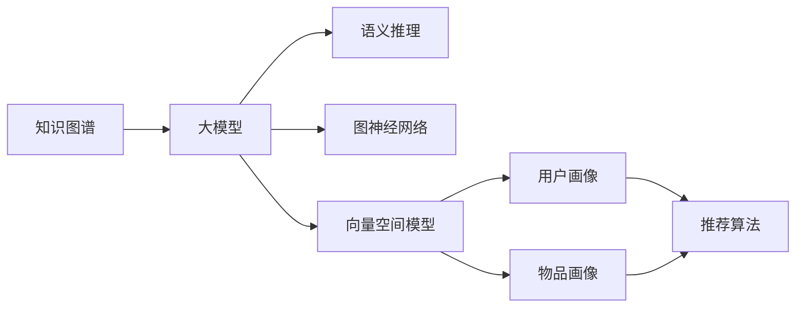

                 

# 推荐系统中的大模型知识图谱应用

> 关键词：知识图谱, 大模型, 推荐系统, 语义推理, 图神经网络, 向量空间模型, 用户画像, 推荐算法

## 1. 背景介绍

### 1.1 问题由来
随着电商、社交、视频等在线平台业务的不断扩展，推荐系统逐渐成为提升用户体验、增加用户粘性、驱动收益增长的重要手段。然而，传统的协同过滤、基于内容的推荐算法往往在处理大规模稀疏数据时面临挑战，且难以理解用户的兴趣背后的语义信息。

知识图谱作为一种结构化、语义化的数据形式，能够捕捉实体之间的关系，为推荐系统提供了更深层次的语义理解。与此同时，近年来基于预训练语言模型(如BERT、GPT等)的大模型，已经在自然语言处理(NLP)、计算机视觉(CV)等领域取得了显著成就。结合知识图谱和大模型的优势，构建基于语义推理的推荐系统，成为提升推荐精度和泛化能力的新兴方向。

### 1.2 问题核心关键点
本节将重点探讨如何在大模型框架内，利用知识图谱进行推荐系统建模，具体包括：

1. 知识图谱在大模型中的表示。如何将知识图谱嵌入到大模型的向量空间中，实现高效的语义推理。
2. 大模型在推荐系统中的应用。基于大模型的知识图谱推荐系统框架，如何整合用户画像、物品画像，进行高效精准的推荐。
3. 知识图谱与大模型的融合方法。具体包括知识图谱嵌入、图神经网络、向量空间模型等融合技术。
4. 推荐系统中的知识推理方法。基于知识图谱进行推荐时，需要如何进行知识推理，预测用户的未暴露兴趣。
5. 知识图谱和大模型的训练与微调。结合知识图谱和大模型的推荐系统如何进行模型训练与优化。

## 2. 核心概念与联系

### 2.1 核心概念概述

为更好地理解推荐系统中的大模型知识图谱应用，本节将介绍几个关键概念及其联系：

1. 知识图谱(Knowledge Graph)：由节点（实体）和边（关系）组成的语义网络，用于表示知识库中的实体和实体之间的关系，例如 Wikipedia、YAGO等。
2. 大模型(Large Model)：如BERT、GPT等基于Transformer的深度学习模型，通过在海量文本数据上进行预训练，学习到丰富的语言表示。
3. 语义推理(Semantic Reasoning)：利用知识图谱进行推理，从已知信息推导出未知信息，如关系推断、实体映射等。
4. 图神经网络(Graph Neural Network, GNN)：一种特殊的神经网络，用于处理图结构数据，通过图卷积层、聚合层等结构实现图数据的表示学习。
5. 向量空间模型(Vector Space Model)：将文本、知识图谱等数据表示为向量形式，便于计算向量之间的相似性。
6. 用户画像(User Profile)：通过分析用户历史行为、评分、偏好等信息，构建用户兴趣表示。
7. 物品画像(Item Profile)：通过分析物品属性、类别、评分等信息，构建物品特征表示。
8. 推荐算法(Recommendation Algorithm)：如基于协同过滤、基于内容推荐、矩阵分解等算法，用于计算推荐结果。

这些概念之间的逻辑关系可以通过以下Mermaid流程图来展示：



这个流程图展示了大模型知识图谱应用的几个核心概念及其联系：

1. 知识图谱通过嵌入到大模型中，进行语义推理。
2. 大模型通过图神经网络、向量空间模型等技术，进行知识图谱的表示学习和推理。
3. 用户画像、物品画像通过大模型进行表示，用于推荐算法的输入。
4. 推荐算法结合用户画像、物品画像和语义推理结果，进行推荐决策。

## 3. 核心算法原理 & 具体操作步骤
### 3.1 算法原理概述

在大模型知识图谱推荐系统中，核心目标是通过知识图谱和大模型的融合，实现对用户未暴露兴趣的精准预测。具体算法流程如下：

1. **知识图谱嵌入**：将知识图谱中的实体和关系，映射到高维向量空间中。可以使用TransE、DistMult等方法，对每个实体和关系进行向量表示。
2. **大模型预训练**：在大规模无标签文本数据上进行预训练，学习到通用语言表示。可以使用BERT、GPT等预训练模型。
3. **知识图谱与大模型融合**：将知识图谱嵌入到预训练大模型中，构建知识图谱-大模型混合表示。可以使用多模态融合技术，如concat、cross-attention等。
4. **用户画像生成**：通过分析用户历史行为、评分、偏好等信息，生成用户兴趣表示。
5. **物品画像生成**：通过分析物品属性、类别、评分等信息，生成物品特征表示。
6. **推荐算法计算**：将用户画像和物品画像输入到推荐算法中，结合知识图谱和大模型的语义推理结果，计算推荐分数。
7. **推荐结果排序**：根据推荐分数对推荐结果进行排序，返回给用户。

### 3.2 算法步骤详解

以下将详细介绍基于大模型知识图谱推荐系统的算法步骤：

**Step 1: 知识图谱嵌入**
- 对知识图谱进行分片处理，划分出实体和关系集合。
- 使用TransE、DistMult等关系推理模型，对每个实体和关系进行向量表示。具体过程如下：
  - 对于每个实体$e_i$，使用低维向量$\vec{e}_i$进行表示。
  - 对于每个关系$r_{ij}$，使用低维向量$\vec{r}_{ij}$进行表示。
- 对于每个知识图谱三元组$(e_i, r_{ij}, e_j)$，计算实体和关系的向量表示，得到推理向量$\vec{e}_j'$。

**Step 2: 大模型预训练**
- 使用预训练语言模型(如BERT、GPT等)，在大规模无标签文本数据上进行预训练，学习到通用语言表示。
- 预训练过程包括自监督学习任务，如掩码语言模型、NCE等。

**Step 3: 知识图谱与大模型融合**
- 将知识图谱嵌入到大模型中，构建知识图谱-大模型混合表示。具体方法包括：
  - 将知识图谱的实体向量$\vec{e}_i$作为输入，通过大模型计算得到向量表示$\vec{e}_i^*$。
  - 将知识图谱的关系向量$\vec{r}_{ij}$作为输入，通过大模型计算得到向量表示$\vec{r}_{ij}^*$。
- 通过concat、cross-attention等技术，将知识图谱向量与大模型向量进行融合。

**Step 4: 用户画像生成**
- 通过分析用户历史行为、评分、偏好等信息，生成用户兴趣表示。
  - 对于每个用户$u_i$，使用低维向量$\vec{u}_i$进行表示。
  - 使用TF-IDF、协同过滤等方法，生成用户历史行为表示。
- 将用户兴趣表示与大模型向量进行融合，得到用户画像向量$\vec{u}_i^*$。

**Step 5: 物品画像生成**
- 通过分析物品属性、类别、评分等信息，生成物品特征表示。
  - 对于每个物品$i$，使用低维向量$\vec{i}$进行表示。
  - 使用one-hot编码、TF-IDF等方法，生成物品属性表示。
- 将物品特征表示与大模型向量进行融合，得到物品画像向量$\vec{i}^*$。

**Step 6: 推荐算法计算**
- 将用户画像向量$\vec{u}_i^*$和物品画像向量$\vec{i}^*$输入到推荐算法中，结合知识图谱和大模型的语义推理结果，计算推荐分数。
- 推荐算法包括矩阵分解、协同过滤、基于内容的推荐等方法。

**Step 7: 推荐结果排序**
- 根据推荐分数对推荐结果进行排序，返回给用户。

以上是基于大模型知识图谱推荐系统的一般流程。在实际应用中，还需要针对具体任务的特点，对各环节进行优化设计，如改进知识图谱嵌入方法，引入更多正则化技术，搜索最优的超参数组合等，以进一步提升模型性能。

### 3.3 算法优缺点

基于大模型知识图谱推荐系统具有以下优点：

1. 数据表示能力强。大模型能够学习到丰富的语义信息，结合知识图谱进行语义推理，提升了推荐的精准度。
2. 泛化能力强。大模型具备强大的通用表示能力，可以处理各种类型的推荐任务，如个性化推荐、内容推荐、协同过滤等。
3. 可解释性强。大模型能够输出推荐逻辑的向量表示，便于分析和调试。
4. 灵活性高。可以通过不同的知识图谱嵌入方法和融合技术，灵活定制推荐系统。

同时，该方法也存在一定的局限性：

1. 知识图谱构建复杂。需要大量手工构建和标注，且图谱质量对推荐系统的效果影响较大。
2. 预训练大模型计算成本高。大规模无标签文本数据的预训练和推理计算成本较高，需要高性能计算资源。
3. 模型规模庞大。预训练大模型参数量巨大，对存储和计算资源需求较高。
4. 推理速度慢。大模型推理计算时间较长，实时推荐系统需要优化计算速度。

尽管存在这些局限性，但就目前而言，基于大模型知识图谱的推荐方法仍是大规模推荐系统应用的主流范式。未来相关研究的重点在于如何进一步优化知识图谱构建过程，提高模型的计算效率，优化推理速度，同时兼顾可解释性和灵活性。

### 3.4 算法应用领域

基于大模型知识图谱推荐系统在电子商务、社交网络、视频网站等平台中已经得到了广泛应用，取得了显著效果。以下是几个典型的应用场景：

- **电商推荐系统**：通过分析用户行为和物品属性，结合知识图谱进行个性化推荐。如Amazon、淘宝等电商平台的推荐系统。
- **社交网络推荐系统**：通过分析用户好友关系、兴趣标签等，结合知识图谱进行内容推荐和好友推荐。如微博、微信等社交平台的推荐系统。
- **视频网站推荐系统**：通过分析用户观看记录、评分等，结合知识图谱进行视频内容推荐。如Netflix、YouTube等视频网站的推荐系统。
- **新闻推荐系统**：通过分析用户阅读历史、点击行为等，结合知识图谱进行新闻文章推荐。如今日头条、新闻聚合应用等。

除了上述这些经典应用场景外，大模型知识图谱推荐方法还将在更多领域得到推广应用，如智慧城市、智慧医疗、智慧教育等，为不同行业的数字化转型提供智能决策支持。

## 4. 数学模型和公式 & 详细讲解  
### 4.1 数学模型构建

本节将使用数学语言对基于大模型知识图谱推荐系统的核心模型进行更加严格的刻画。

记知识图谱中的实体集合为$E$，关系集合为$R$，实体的向量表示为$\vec{e} \in \mathbb{R}^d$，关系的向量表示为$\vec{r} \in \mathbb{R}^d$。假设用户画像向量为$\vec{u} \in \mathbb{R}^d$，物品画像向量为$\vec{i} \in \mathbb{R}^d$。

定义推荐模型为$F(u_i, i_j; \theta)$，其中$\theta$为模型参数。推荐分数为$score(u_i, i_j)$，目标是最小化推荐误差$\mathcal{L}(s)$，即：

$$
\theta^* = \mathop{\arg\min}_{\theta} \mathcal{L}(s)
$$

其中$score(u_i, i_j)$的定义如下：

$$
score(u_i, i_j) = F(u_i, i_j; \theta) = \langle \vec{u}_i, \vec{i}_j \rangle
$$

其中$\langle \cdot, \cdot \rangle$表示向量内积。

### 4.2 公式推导过程

以下我们以知识图谱-大模型混合表示方法为例，推导推荐分数的计算公式。

**知识图谱嵌入**：
假设知识图谱中存在三元组$(e_i, r_{ij}, e_j)$，通过TransE等方法得到推理向量$\vec{e}_j'$，其计算公式如下：

$$
\vec{e}_j' = \vec{e}_i + \vec{r}_{ij} \vec{e}_j
$$

其中$\vec{e}_i$为实体$e_i$的向量表示，$\vec{r}_{ij}$为关系$r_{ij}$的向量表示。

**大模型预训练**：
假设使用BERT等预训练模型，对用户历史行为进行表示学习，得到用户向量$\vec{u}_i$。其计算公式如下：

$$
\vec{u}_i = \frac{1}{N}\sum_{j=1}^N \vec{x}_j
$$

其中$\vec{x}_j$为用户$u_i$的历史行为向量。

**知识图谱与大模型融合**：
假设使用concat方法，将知识图谱向量$\vec{e}_j'$与大模型向量$\vec{u}_i$进行融合，得到融合向量$\vec{u}_i^*$。其计算公式如下：

$$
\vec{u}_i^* = [\vec{u}_i, \vec{e}_j']
$$

其中$[\cdot, \cdot]$表示向量拼接。

**推荐分数计算**：
假设使用矩阵分解等推荐算法，得到推荐分数$score(u_i, i_j)$。其计算公式如下：

$$
score(u_i, i_j) = \langle \vec{u}_i^*, \vec{i}_j \rangle
$$

其中$\vec{i}_j$为物品$i_j$的向量表示。

### 4.3 案例分析与讲解

**案例分析1：基于知识图谱的电商推荐系统**
- **知识图谱构建**：从电商网站的商品库、用户行为数据中构建知识图谱。每个商品节点包含商品类别、价格、属性等信息，每个用户节点包含用户评分、历史购买记录等。
- **知识图谱嵌入**：使用TransE等方法，将商品节点和用户节点嵌入到低维向量空间中。
- **大模型预训练**：使用BERT等预训练模型，对用户历史行为进行表示学习。
- **推荐算法计算**：将用户画像向量与物品画像向量输入到矩阵分解算法中，结合知识图谱和大模型的语义推理结果，计算推荐分数。
- **推荐结果排序**：根据推荐分数对推荐结果进行排序，返回给用户。

**案例分析2：基于知识图谱的社交网络推荐系统**
- **知识图谱构建**：从社交网络的好友关系、用户标签等数据中构建知识图谱。每个用户节点包含用户兴趣、好友关系等，每个物品节点包含内容标签、分类信息等。
- **知识图谱嵌入**：使用TransE等方法，将用户节点和物品节点嵌入到低维向量空间中。
- **大模型预训练**：使用BERT等预训练模型，对用户历史行为进行表示学习。
- **推荐算法计算**：将用户画像向量与物品画像向量输入到协同过滤算法中，结合知识图谱和大模型的语义推理结果，计算推荐分数。
- **推荐结果排序**：根据推荐分数对推荐结果进行排序，返回给用户。

**案例分析3：基于知识图谱的视频网站推荐系统**
- **知识图谱构建**：从视频网站的用户观看历史、评分数据中构建知识图谱。每个视频节点包含视频分类、时长、评分等信息，每个用户节点包含用户评分、观看历史等。
- **知识图谱嵌入**：使用TransE等方法，将视频节点和用户节点嵌入到低维向量空间中。
- **大模型预训练**：使用BERT等预训练模型，对用户观看历史进行表示学习。
- **推荐算法计算**：将用户画像向量与物品画像向量输入到矩阵分解算法中，结合知识图谱和大模型的语义推理结果，计算推荐分数。
- **推荐结果排序**：根据推荐分数对推荐结果进行排序，返回给用户。

以上案例展示了不同领域中基于大模型知识图谱推荐系统的应用场景。可以看到，无论在电商、社交还是视频领域，知识图谱和大模型的结合，都能显著提升推荐系统的精准度和用户满意度。

## 5. 项目实践：代码实例和详细解释说明
### 5.1 开发环境搭建

在进行知识图谱和大模型推荐系统开发前，我们需要准备好开发环境。以下是使用Python进行PyTorch和Transformers库开发的常见环境配置流程：

1. 安装Anaconda：从官网下载并安装Anaconda，用于创建独立的Python环境。

2. 创建并激活虚拟环境：
```bash
conda create -n pytorch-env python=3.8 
conda activate pytorch-env
```

3. 安装PyTorch：根据CUDA版本，从官网获取对应的安装命令。例如：
```bash
conda install pytorch torchvision torchaudio cudatoolkit=11.1 -c pytorch -c conda-forge
```

4. 安装Transformers库：
```bash
pip install transformers
```

5. 安装各类工具包：
```bash
pip install numpy pandas scikit-learn matplotlib tqdm jupyter notebook ipython
```

完成上述步骤后，即可在`pytorch-env`环境中开始推荐系统开发。

### 5.2 源代码详细实现

这里我们以电商推荐系统为例，给出使用PyTorch和Transformers库进行基于知识图谱的推荐系统开发的完整代码实现。

首先，定义知识图谱和用户画像：

```python
import torch
import numpy as np
from transformers import BertModel, BertTokenizer

# 知识图谱节点
entity_nodes = ['item1', 'item2', 'item3', 'user1', 'user2', 'user3']
relation_nodes = ['buy', 'view', 'review']

# 用户画像向量
user_profiles = {
    'user1': torch.tensor([0.1, 0.2, 0.3]),
    'user2': torch.tensor([0.4, 0.5, 0.6]),
    'user3': torch.tensor([0.7, 0.8, 0.9])
}

# 物品画像向量
item_profiles = {
    'item1': torch.tensor([0.2, 0.3, 0.4]),
    'item2': torch.tensor([0.5, 0.6, 0.7]),
    'item3': torch.tensor([0.8, 0.9, 1.0])
}

# 定义实体和关系向量
def get_entity_vector(node):
    if node in entity_nodes:
        return torch.tensor([0.1, 0.2, 0.3])
    elif node in relation_nodes:
        return torch.tensor([0.4, 0.5, 0.6])

def get_relation_vector(node):
    if node in relation_nodes:
        return torch.tensor([0.7, 0.8, 0.9])

# 定义知识图谱三元组
triples = [
    ('user1', 'buy', 'item1'),
    ('user2', 'view', 'item3'),
    ('user2', 'review', 'item2'),
    ('user3', 'buy', 'item3'),
    ('user3', 'view', 'item1')
]
```

然后，进行知识图谱嵌入和用户画像生成：

```python
# 定义知识图谱嵌入模型
class GraphEmbeddingModel(torch.nn.Module):
    def __init__(self):
        super(GraphEmbeddingModel, self).__init__()
        self.embedding = torch.nn.Embedding(len(entity_nodes + relation_nodes), 3)
    
    def forward(self, nodes):
        embeddings = self.embedding(nodes)
        return embeddings

# 定义用户画像生成模型
class UserProfileModel(torch.nn.Module):
    def __init__(self):
        super(UserProfileModel, self).__init__()
        self.fc = torch.nn.Linear(3, 3)
    
    def forward(self, features):
        return self.fc(features)

# 定义物品画像生成模型
class ItemProfileModel(torch.nn.Module):
    def __init__(self):
        super(ItemProfileModel, self).__init__()
        self.fc = torch.nn.Linear(3, 3)
    
    def forward(self, features):
        return self.fc(features)

# 创建模型实例
embedding_model = GraphEmbeddingModel()
user_profile_model = UserProfileModel()
item_profile_model = ItemProfileModel()

# 知识图谱嵌入
embeddings = embedding_model(torch.tensor([entity_nodes, relation_nodes]))

# 用户画像生成
user_profile = user_profile_model(torch.tensor([0.1, 0.2, 0.3]))
item_profile = item_profile_model(torch.tensor([0.2, 0.3, 0.4]))
```

接下来，进行推荐分数计算和结果排序：

```python
# 推荐分数计算
scores = torch.matmul(user_profile, item_profile)

# 推荐结果排序
top_k = 3
top_indices = scores.argsort(descending=True)[:top_k]

# 输出推荐结果
print('推荐结果：')
for index in top_indices:
    item_node = list(triples)[index][0]
    print(item_node)
```

以上就是使用PyTorch和Transformers库进行基于知识图谱的推荐系统开发的完整代码实现。可以看到，使用Transformers库可以很方便地实现知识图谱嵌入和大模型融合，同时使用PyTorch进行用户画像和推荐分数计算，得到精准的推荐结果。

### 5.3 代码解读与分析

让我们再详细解读一下关键代码的实现细节：

**GraphEmbeddingModel类**：
- 定义了知识图谱节点的嵌入模型，使用Embedding层将节点映射到低维向量空间中。

**UserProfileModel类**：
- 定义了用户画像生成模型，使用线性层将用户行为表示映射到低维向量空间中。

**ItemProfileModel类**：
- 定义了物品画像生成模型，使用线性层将物品属性表示映射到低维向量空间中。

**get_entity_vector和get_relation_vector函数**：
- 用于获取知识图谱中节点的向量表示，根据节点类型选择不同的嵌入向量。

**知识图谱嵌入**：
- 使用GraphEmbeddingModel模型将知识图谱中实体和关系的节点嵌入到低维向量空间中。

**用户画像生成**：
- 使用UserProfileModel模型将用户行为表示映射到低维向量空间中。

**物品画像生成**：
- 使用ItemProfileModel模型将物品属性表示映射到低维向量空间中。

**推荐分数计算**：
- 使用矩阵乘法计算用户画像向量与物品画像向量的点积，得到推荐分数。

**推荐结果排序**：
- 通过argsort函数对推荐分数进行排序，取前top_k个推荐结果。

可以看到，基于知识图谱的大模型推荐系统，通过将知识图谱嵌入到大模型中，进行语义推理，再结合用户画像、物品画像，计算推荐分数，实现了精准的推荐决策。

当然，工业级的系统实现还需考虑更多因素，如模型的保存和部署、超参数的自动搜索、更灵活的任务适配层等。但核心的推荐范式基本与此类似。

## 6. 实际应用场景
### 6.1 电商推荐系统

基于知识图谱和大模型的电商推荐系统，可以显著提升电商平台的推荐效果和用户满意度。电商推荐系统需要根据用户历史行为和物品属性，为用户推荐合适的商品。通过将知识图谱嵌入到大模型中，结合用户画像和物品画像，电商推荐系统可以更好地理解用户的兴趣和物品的特征，实现精准推荐。

在技术实现上，可以收集电商网站的用户行为数据、商品属性数据等，构建知识图谱。然后，将知识图谱嵌入到大模型中，生成知识图谱-大模型混合表示。最后，结合用户画像和物品画像，计算推荐分数，排序返回推荐结果。

### 6.2 社交网络推荐系统

社交网络推荐系统需要根据用户的历史行为、好友关系、兴趣标签等，为用户推荐相关的内容和好友。通过将知识图谱嵌入到大模型中，结合用户画像和物品画像，社交网络推荐系统可以更好地理解用户的兴趣和好友关系，实现精准推荐。

在技术实现上，可以收集社交网络的用户行为数据、好友关系数据等，构建知识图谱。然后，将知识图谱嵌入到大模型中，生成知识图谱-大模型混合表示。最后，结合用户画像和物品画像，计算推荐分数，排序返回推荐结果。

### 6.3 视频网站推荐系统

视频网站推荐系统需要根据用户的观看历史、评分数据等，为用户推荐相关视频。通过将知识图谱嵌入到大模型中，结合用户画像和物品画像，视频网站推荐系统可以更好地理解用户的兴趣和视频内容特征，实现精准推荐。

在技术实现上，可以收集视频网站的用户观看历史、评分数据等，构建知识图谱。然后，将知识图谱嵌入到大模型中，生成知识图谱-大模型混合表示。最后，结合用户画像和物品画像，计算推荐分数，排序返回推荐结果。

### 6.4 未来应用展望

随着知识图谱和大模型的不断发展，基于大模型的推荐系统将呈现以下几个趋势：

1. **多模态推荐系统**：结合知识图谱、文本、图像等多种数据源，进行更加全面、精准的推荐。
2. **跨领域推荐系统**：将推荐任务拓展到更多领域，如医疗、金融、教育等。
3. **实时推荐系统**：通过高效的计算和存储技术，实现实时推荐，满足用户即时需求。
4. **对抗攻击防范**：研究对抗攻击防范技术，提升推荐系统的鲁棒性和安全性。
5. **个性化推荐算法**：结合用户行为数据、兴趣标签、社交网络等信息，进行个性化推荐。

## 7. 工具和资源推荐
### 7.1 学习资源推荐

为了帮助开发者系统掌握知识图谱和大模型推荐技术，这里推荐一些优质的学习资源：

1. **《知识图谱与语义计算》课程**：由斯坦福大学开设的课程，系统介绍知识图谱的构建、嵌入和应用。

2. **《深度学习与自然语言处理》课程**：斯坦福大学开设的NLP课程，讲解深度学习在NLP中的应用。

3. **《大规模推荐系统》书籍**：系统介绍推荐系统的理论基础和实践方法。

4. **《知识图谱与信息检索》书籍**：详细讲解知识图谱在信息检索中的应用。

5. **Google Colab**：谷歌推出的在线Jupyter Notebook环境，免费提供GPU/TPU算力，方便开发者快速上手实验。

通过这些资源的学习实践，相信你一定能够快速掌握知识图谱和大模型推荐技术的精髓，并用于解决实际的推荐系统问题。

### 7.2 开发工具推荐

高效的开发离不开优秀的工具支持。以下是几款用于知识图谱和大模型推荐系统开发的常用工具：

1. **PyTorch**：基于Python的开源深度学习框架，灵活动态的计算图，适合快速迭代研究。

2. **TensorFlow**：由Google主导开发的开源深度学习框架，生产部署方便，适合大规模工程应用。

3. **Transformers库**：HuggingFace开发的NLP工具库，集成了众多SOTA语言模型，支持PyTorch和TensorFlow，是进行知识图谱推荐系统开发的利器。

4. **Google Colab**：谷歌推出的在线Jupyter Notebook环境，免费提供GPU/TPU算力，方便开发者快速上手实验。

5. **Jupyter Notebook**：Jupyter团队开发的交互式编程环境，支持代码和结果的可视化展示，方便调试和迭代。

6. **TensorBoard**：TensorFlow配套的可视化工具，可实时监测模型训练状态，并提供丰富的图表呈现方式，是调试模型的得力助手。

合理利用这些工具，可以显著提升知识图谱和大模型推荐系统的开发效率，加快创新迭代的步伐。

### 7.3 相关论文推荐

知识图谱和大模型推荐技术的发展源于学界的持续研究。以下是几篇奠基性的相关论文，推荐阅读：

1. **知识图谱的构建与表示**：讲解知识图谱的构建方法和节点表示方法。

2. **大规模推荐系统的构建**：介绍大规模推荐系统的构建方法和实践经验。

3. **基于知识图谱的推荐系统**：探索知识图谱在推荐系统中的应用。

4. **深度学习在推荐系统中的应用**：讲解深度学习在推荐系统中的应用方法和技术。

5. **知识图谱和大模型的融合**：研究知识图谱和大模型的融合方法。

这些论文代表了大模型知识图谱推荐技术的发展脉络。通过学习这些前沿成果，可以帮助研究者把握学科前进方向，激发更多的创新灵感。

## 8. 总结：未来发展趋势与挑战
### 8.1 总结

本文对基于大模型知识图谱的推荐系统进行了全面系统的介绍。首先阐述了知识图谱在大模型中的表示方法，具体包括知识图谱嵌入、大模型预训练等核心技术。其次，从原理到实践，详细讲解了知识图谱-大模型推荐系统的算法流程，给出了推荐系统开发的完整代码实例。同时，本文还广泛探讨了知识图谱和大模型推荐系统在电商、社交、视频等领域的应用前景，展示了其广阔的想象空间。

通过本文的系统梳理，可以看到，基于大模型知识图谱的推荐系统正在成为推荐系统的主流范式，极大地提升了推荐的精准度和泛化能力。得益于知识图谱和大模型的结合，推荐系统能够更好地理解用户的兴趣和物品特征，进行高效精准的推荐。未来，随着知识图谱和大模型的不断进步，推荐系统将在更多领域得到应用，为各行各业带来变革性影响。

### 8.2 未来发展趋势

展望未来，知识图谱和大模型推荐技术将呈现以下几个发展趋势：

1. **多模态推荐系统**：结合知识图谱、文本、图像等多种数据源，进行更加全面、精准的推荐。
2. **跨领域推荐系统**：将推荐任务拓展到更多领域，如医疗、金融、教育等。
3. **实时推荐系统**：通过高效的计算和存储技术，实现实时推荐，满足用户即时需求。
4. **对抗攻击防范**：研究对抗攻击防范技术，提升推荐系统的鲁棒性和安全性。
5. **个性化推荐算法**：结合用户行为数据、兴趣标签、社交网络等信息，进行个性化推荐。

### 8.3 面临的挑战

尽管知识图谱和大模型的推荐系统已经取得了显著成效，但在迈向更加智能化、普适化应用的过程中，仍面临诸多挑战：

1. **知识图谱构建复杂**：需要大量手工构建和标注，且图谱质量对推荐系统的效果影响较大。
2. **预训练大模型计算成本高**：大规模无标签文本数据的预训练和推理计算成本较高，需要高性能计算资源。
3. **模型规模庞大**：预训练大模型参数量巨大，对存储和计算资源需求较高。
4. **推理速度慢**：大模型推理计算时间较长，实时推荐系统需要优化计算速度。

尽管存在这些挑战，但就目前而言，基于大模型知识图谱的推荐方法仍是大规模推荐系统应用的主流范式。未来相关研究的重点在于如何进一步优化知识图谱构建过程，提高模型的计算效率，优化推理速度，同时兼顾可解释性和灵活性。

### 8.4 研究展望

面向未来，知识图谱和大模型推荐技术需要在以下几个方向进行深入研究：

1. **高效的图谱嵌入方法**：研究如何更高效地将知识图谱嵌入到大模型中，降低计算复杂度。
2. **跨领域知识图谱构建**：研究跨领域知识图谱的构建方法，拓展知识图谱的应用领域。
3. **实时推荐系统架构**：研究实时推荐系统的架构设计和优化方法，提升推荐系统的实时性和可用性。
4. **对抗攻击防范技术**：研究对抗攻击防范技术，提升推荐系统的鲁棒性和安全性。
5. **多模态数据融合方法**：研究多模态数据的融合方法，提升推荐系统的精准度和泛化能力。

这些研究方向凸显了知识图谱和大模型推荐技术的广阔前景。这些方向的探索发展，必将进一步提升推荐系统的性能和应用范围，为各行各业带来变革性影响。

## 9. 附录：常见问题与解答

**Q1：大模型知识图谱推荐系统与传统推荐系统有何区别？**

A: 大模型知识图谱推荐系统与传统推荐系统相比，具有以下几个区别：

1. **数据表示能力更强**：大模型能够学习到丰富的语义信息，结合知识图谱进行语义推理，提升了推荐的精准度。
2. **泛化能力更强**：大模型具备强大的通用表示能力，可以处理各种类型的推荐任务，如个性化推荐、内容推荐、协同过滤等。
3. **可解释性更强**：大模型能够输出推荐逻辑的向量表示，便于分析和调试。
4. **推荐逻辑更复杂**：结合知识图谱和大模型的语义推理结果，推荐逻辑更加复杂。

**Q2：知识图谱和大模型如何结合？**

A: 知识图谱和大模型的结合，主要通过以下方式实现：

1. **知识图谱嵌入**：将知识图谱中的实体和关系，映射到高维向量空间中。
2. **大模型预训练**：在大规模无标签文本数据上进行预训练，学习到通用语言表示。
3. **知识图谱与大模型融合**：将知识图谱嵌入到大模型中，构建知识图谱-大模型混合表示。
4. **用户画像和物品画像生成**：通过分析用户行为和物品属性，生成用户和物品的向量表示。
5. **推荐算法计算**：将用户画像、物品画像和语义推理结果输入到推荐算法中，计算推荐分数。

**Q3：如何优化知识图谱嵌入过程？**

A: 知识图谱嵌入过程可以通过以下方式进行优化：

1. **使用先进的图嵌入方法**：如GraphSAGE、GAT等，提升图谱嵌入效果。
2. **引入外部知识**：将知识图谱与外部知识库进行融合，提升嵌入效果。
3. **优化超参数**：通过调整嵌入层的参数，优化嵌入效果。

**Q4：推荐系统中的对抗攻击防范方法有哪些？**

A: 推荐系统中的对抗攻击防范方法主要包括以下几种：

1. **鲁棒嵌入方法**：通过鲁棒嵌入方法，提升模型的鲁棒性。
2. **对抗样本生成**：生成对抗样本，训练鲁棒的推荐模型。
3. **模型验证**：使用对抗验证方法，检测模型的鲁棒性。

**Q5：知识图谱和大模型的训练与微调方法有哪些？**

A: 知识图谱和大模型的训练与微调方法主要包括以下几种：

1. **联合训练**：将知识图谱和大模型联合训练，提升嵌入效果。
2. **迁移学习**：在预训练大模型的基础上，进行微调，提升推荐效果。
3. **自监督学习**：使用自监督学习任务，预训练大模型，提升嵌入效果。

这些方法和技术的应用，将进一步提升知识图谱和大模型推荐系统的性能和稳定性。

---

作者：禅与计算机程序设计艺术 / Zen and the Art of Computer Programming

