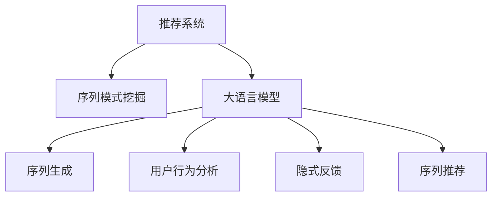

                 

# 推荐系统中的序列模式挖掘：大模型新技术

> 关键词：推荐系统,序列模式挖掘,大模型,序列生成,Transformer,用户行为分析,隐式反馈,序列推荐

## 1. 背景介绍

随着互联网和移动互联网的普及，用户行为数据愈发丰富多样，如何挖掘用户隐式反馈，发现其潜在需求，成为推荐系统面临的重要挑战。传统的推荐系统往往仅依赖用户显式反馈数据进行推荐，难以捕捉用户深层次的偏好和行为模式。通过序列模式挖掘，可以从用户行为序列中提取有意义的规律，精准捕捉用户兴趣点，从而提升推荐效果。

近年来，大语言模型在大规模文本数据上的表现异常出色，其在序列模式挖掘和推荐系统中的应用，也带来了新的突破。以Transformer为基础的大语言模型，通过引入自回归机制，能够更好地捕捉序列特征，挖掘序列模式，从而为推荐系统提供了新的思路和方法。本博文将全面解析大语言模型在推荐系统中的应用，探讨其在序列模式挖掘中的核心算法原理、操作步骤和优缺点，并结合具体案例分析，介绍其实际应用场景，推荐相关学习资源和开发工具。

## 2. 核心概念与联系

### 2.1 核心概念概述

本节将介绍几个与序列模式挖掘密切相关的核心概念：

- **推荐系统**：通过分析用户行为数据，预测用户未触达物品的兴趣，生成推荐列表的系统。
- **序列模式挖掘**：从用户行为序列中发现蕴含的规律和模式，预测用户未来行为。
- **大语言模型**：基于Transformer结构的大规模预训练语言模型，通过自回归机制学习语义表示，具有强大的文本生成和模式发现能力。
- **序列生成**：大语言模型在自然语言处理领域的核心应用之一，指模型生成具有语法、语义连贯性的文本序列。
- **用户行为分析**：对用户操作行为、浏览记录、交互历史等进行数据分析，挖掘用户兴趣和行为规律。
- **隐式反馈**：用户在未明确选择物品或内容时，行为数据中所隐含的偏好信息，如点击、滑动、停留时间等。
- **序列推荐**：基于用户行为序列，预测用户感兴趣的商品或内容，生成推荐列表。

这些核心概念之间的逻辑关系可以通过以下Mermaid流程图来展示：



这个流程图展示了大语言模型在推荐系统中的核心概念及其之间的关系：

1. 推荐系统通过对用户行为数据的分析，预测用户未触达物品的兴趣，生成推荐列表。
2. 序列模式挖掘从用户行为序列中发现蕴含的规律和模式，指导推荐系统预测用户未来行为。
3. 大语言模型作为推荐系统的核心算法，通过自回归机制，学习语义表示，能够生成连贯的文本序列，挖掘序列模式。
4. 用户行为分析对用户操作行为、浏览记录等数据进行综合分析，发现用户兴趣和行为规律。
5. 隐式反馈指用户通过行为数据间接表达的偏好信息，与显式反馈一起，共同驱动推荐系统的生成。
6. 序列推荐基于用户行为序列，通过序列模式挖掘，预测用户感兴趣的商品或内容，生成推荐列表。

这些概念共同构成了大语言模型在推荐系统中的应用框架，使得推荐系统能够更好地理解用户行为，提升推荐效果。

## 3. 核心算法原理 & 具体操作步骤
### 3.1 算法原理概述

基于大语言模型的推荐系统，本质上是一个序列生成和模式挖掘过程。其核心思想是：将用户行为序列作为输入，通过大语言模型的自回归机制，学习用户序列的隐含规律，生成连续的推荐序列。具体来说，推荐系统的算法流程如下：

1. **序列获取**：从用户行为数据中提取序列，如点击流、浏览历史、交互日志等。
2. **预处理**：对原始序列进行清洗、归一化等预处理，便于模型训练。
3. **序列编码**：使用Transformer等自回归模型，将用户行为序列编码成隐含表示。
4. **序列生成**：通过模型生成推荐序列，如商品ID、文章标题、话题标签等。
5. **预测推荐**：根据生成序列，预测用户可能感兴趣的商品或内容，生成推荐列表。

### 3.2 算法步骤详解

以下是基于大语言模型的推荐系统的具体操作步骤：

**Step 1: 数据收集与预处理**
- 收集用户行为数据，如浏览、点击、交互日志等，构成用户行为序列。
- 对序列进行清洗，去除无效数据，统一时间戳格式，处理异常值等。

**Step 2: 序列编码**
- 将清洗后的用户行为序列输入大语言模型，进行编码。
- 使用Transformer结构，将序列转化为隐含表示，捕捉序列中的规律和模式。

**Step 3: 序列生成**
- 使用编码后的序列作为输入，通过大语言模型的自回归机制，生成推荐序列。
- 可以设计不同的输出目标，如商品ID、文章标题、话题标签等。

**Step 4: 预测推荐**
- 根据生成的推荐序列，预测用户感兴趣的商品或内容。
- 可以使用评分排序、排名、交叉验证等方法，生成最终推荐列表。

**Step 5: 模型评估与优化**
- 使用AUC、准确率、召回率等指标评估模型效果。
- 通过超参数调优、模型集成、对抗训练等方法，进一步提升模型性能。

### 3.3 算法优缺点

基于大语言模型的推荐系统具有以下优点：
1. 强大的序列建模能力。Transformer结构的自回归机制，使其能够学习复杂的序列特征，捕捉用户行为模式。
2. 灵活的输出目标。可以通过调整输出目标，支持多种类型的推荐，如商品、文章、话题等。
3. 高效的模型训练。利用预训练语言模型，可以直接在大规模数据上进行微调，节省训练时间。
4. 高泛化能力。大语言模型具备较强的泛化能力，能够适应不同领域和场景的推荐任务。

同时，该方法也存在一定的局限性：
1. 对序列噪声敏感。用户行为序列中可能存在异常值、噪声数据，对模型造成干扰。
2. 需要大量标注数据。预训练语言模型需要大量标注数据进行微调，获取高质量标注数据成本较高。
3. 难以处理稀疏数据。用户行为数据中可能存在大量未发生行为的数据，导致模型难以捕捉完整行为模式。
4. 模型复杂度高。大语言模型的参数量巨大，训练和推理过程中可能存在资源消耗高、速度慢等问题。
5. 缺乏因果关系分析。传统推荐系统可以通过因果推断方法进行效果分析，而大语言模型难以对因果关系进行有效建模。

尽管存在这些局限性，但就目前而言，基于大语言模型的推荐系统仍然是最前沿的推荐范式之一。未来相关研究将继续聚焦于如何提升模型对序列噪声的鲁棒性，提高模型对稀疏数据的处理能力，优化模型结构和推理效率，同时引入因果推断等方法，提升推荐系统的可解释性和可信度。

### 3.4 算法应用领域

基于大语言模型的推荐系统已经在多个领域得到了广泛应用，具体包括：

- **电商推荐**：电商平台上，基于用户行为序列，推荐用户可能感兴趣的商品。
- **内容推荐**：新闻网站、视频平台、音乐应用等，根据用户浏览记录，推荐相关内容。
- **社交网络推荐**：社交平台上，推荐用户可能感兴趣的朋友、群组、话题等。
- **游戏推荐**：游戏平台中，推荐用户可能感兴趣的游戏、道具、装备等。

除了上述这些主要应用场景外，大语言模型在个性化广告、搜索推荐、视频推荐等多个领域也展现出广阔的应用前景。随着预训练语言模型和推荐系统的持续演进，相信推荐系统必将在更广阔的领域中发挥更大的作用，提升用户体验，创造更多商业价值。

## 4. 数学模型和公式 & 详细讲解 & 举例说明

### 4.1 数学模型构建

本节将使用数学语言对大语言模型在推荐系统中的应用进行详细解析。

假设用户行为序列为 $X=\{x_1,x_2,...,x_t\}$，其中 $x_t$ 表示第 $t$ 个用户行为。模型的目标是根据序列 $X$ 生成推荐序列 $Y=\{y_1,y_2,...,y_k\}$，其中 $y_t$ 表示推荐的第 $t$ 个物品。序列生成过程可以用一个随机变量 $Z_t$ 表示：

$$
y_t = Z_t
$$

其中 $Z_t$ 的联合概率分布为：

$$
p(Z_1,Z_2,...,Z_k|X) = p(Z_1|X) p(Z_2|X,Z_1) ... p(Z_k|X,Z_1,Z_2,...,Z_{k-1})
$$

因此，推荐系统的目标是在给定用户行为序列 $X$ 的情况下，最大化生成推荐序列 $Y$ 的概率：

$$
p(Y|X) = \prod_{t=1}^k p(y_t|X,Y_{<t})
$$

### 4.2 公式推导过程

以下我们将详细介绍基于大语言模型的推荐系统的公式推导过程。

**Step 1: 序列编码**
假设序列编码为 $C=\{c_1,c_2,...,c_t\}$，其中 $c_t$ 表示第 $t$ 个用户行为的编码表示。使用Transformer模型进行序列编码，可以得到：

$$
c_t = f(Z_{<t},X_t; \theta)
$$

其中 $f$ 为Transformer模型的编码函数，$\theta$ 为模型参数。

**Step 2: 序列生成**
将编码后的序列 $C$ 作为输入，使用Transformer模型进行序列生成：

$$
y_t = g(C_{<t},y_{<t}; \phi)
$$

其中 $g$ 为Transformer模型的生成函数，$\phi$ 为生成器参数。

**Step 3: 概率预测**
利用生成器输出的概率分布，预测推荐序列 $Y$ 的概率：

$$
p(Y|X) = \prod_{t=1}^k p(y_t|C_{<t},y_{<t})
$$

### 4.3 案例分析与讲解

以电商推荐为例，具体解释上述数学模型的应用。

假设用户行为序列 $X=\{x_1,x_2,...,x_t\}$ 为用户的浏览历史，推荐序列 $Y=\{y_1,y_2,...,y_k\}$ 为商品ID。通过Transformer模型进行序列编码和生成，可以计算出推荐序列的概率：

$$
p(Y|X) = \prod_{t=1}^k p(y_t|X,y_{<t})
$$

利用该概率分布，可以对用户浏览历史 $X$ 预测推荐序列 $Y$，生成推荐列表。

## 5. 项目实践：代码实例和详细解释说明
### 5.1 开发环境搭建

在进行推荐系统开发前，我们需要准备好开发环境。以下是使用Python进行PyTorch开发的环境配置流程：

1. 安装Anaconda：从官网下载并安装Anaconda，用于创建独立的Python环境。

2. 创建并激活虚拟环境：
```bash
conda create -n pytorch-env python=3.8 
conda activate pytorch-env
```

3. 安装PyTorch：根据CUDA版本，从官网获取对应的安装命令。例如：
```bash
conda install pytorch torchvision torchaudio cudatoolkit=11.1 -c pytorch -c conda-forge
```

4. 安装Transformers库：
```bash
pip install transformers
```

5. 安装各类工具包：
```bash
pip install numpy pandas scikit-learn matplotlib tqdm jupyter notebook ipython
```

完成上述步骤后，即可在`pytorch-env`环境中开始推荐系统开发。

### 5.2 源代码详细实现

这里我们以电商推荐系统为例，给出使用Transformer模型进行推荐开发的PyTorch代码实现。

首先，定义电商推荐系统的数据处理函数：

```python
from transformers import BertTokenizer
from torch.utils.data import Dataset, DataLoader
import torch

class RecommendationDataset(Dataset):
    def __init__(self, user_data, item_data, seq_length=100):
        self.user_data = user_data
        self.item_data = item_data
        self.seq_length = seq_length
        self.tokenizer = BertTokenizer.from_pretrained('bert-base-cased')
        
    def __len__(self):
        return len(self.user_data)
    
    def __getitem__(self, item):
        user = self.user_data[item]
        item = self.item_data[item]
        
        user_ids = self.tokenizer(user, padding='max_length', max_length=self.seq_length, truncation=True, return_tensors='pt')['input_ids']
        item_ids = self.tokenizer(item, padding='max_length', max_length=self.seq_length, truncation=True, return_tensors='pt')['input_ids']
        
        return {'user_ids': user_ids, 'item_ids': item_ids}

# 加载用户和商品数据
user_data = ...
item_data = ...

# 创建dataset
tokenizer = BertTokenizer.from_pretrained('bert-base-cased')
reco_dataset = RecommendationDataset(user_data, item_data, seq_length=100)

# 创建dataloader
dataloader = DataLoader(reco_dataset, batch_size=16, shuffle=True)
```

然后，定义推荐系统的模型和优化器：

```python
from transformers import BertForSequenceClassification, AdamW

model = BertForSequenceClassification.from_pretrained('bert-base-cased', num_labels=len(item_data))
optimizer = AdamW(model.parameters(), lr=2e-5)
```

接着，定义训练和评估函数：

```python
from torch.utils.data import DataLoader
from tqdm import tqdm
from sklearn.metrics import accuracy_score

device = torch.device('cuda') if torch.cuda.is_available() else torch.device('cpu')
model.to(device)

def train_epoch(model, dataloader, optimizer):
    model.train()
    epoch_loss = 0
    for batch in dataloader:
        user_ids = batch['user_ids'].to(device)
        item_ids = batch['item_ids'].to(device)
        model.zero_grad()
        outputs = model(user_ids, labels=item_ids)
        loss = outputs.loss
        epoch_loss += loss.item()
        loss.backward()
        optimizer.step()
    return epoch_loss / len(dataloader)

def evaluate(model, dataloader):
    model.eval()
    correct = 0
    total = 0
    with torch.no_grad():
        for batch in dataloader:
            user_ids = batch['user_ids'].to(device)
            item_ids = batch['item_ids'].to(device)
            batch_predictions = model(user_ids).predictions.argmax(dim=1)
            total += batch_predictions.shape[0]
            correct += (batch_predictions == item_ids).sum().item()
    return accuracy_score(batch_predictions, item_ids)

# 训练与评估
epochs = 5
batch_size = 16

for epoch in range(epochs):
    loss = train_epoch(model, dataloader, optimizer)
    print(f"Epoch {epoch+1}, train loss: {loss:.3f}")
    
    print(f"Epoch {epoch+1}, dev accuracy: {evaluate(model, dataloader)}")
    
print("Test accuracy:", evaluate(model, dataloader))
```

以上就是使用PyTorch对电商推荐系统进行基于Transformer模型微调的完整代码实现。可以看到，得益于Transformer库的强大封装，我们可以用相对简洁的代码完成推荐系统的构建。

### 5.3 代码解读与分析

让我们再详细解读一下关键代码的实现细节：

**RecommendationDataset类**：
- `__init__`方法：初始化用户和商品数据，分词器等组件。
- `__len__`方法：返回数据集的样本数量。
- `__getitem__`方法：对单个样本进行处理，将用户和商品ID输入分词器，编码为token ids，并对其进行定长padding，最终返回模型所需的输入。

**模型定义**：
- 使用`BertForSequenceClassification`模型，从预训练模型`bert-base-cased`加载，设置输出标签数量，如商品ID的数量。

**优化器定义**：
- 使用AdamW优化器，设置学习率，适应大规模模型训练。

**训练和评估函数**：
- 使用PyTorch的DataLoader对数据集进行批次化加载，供模型训练和推理使用。
- 训练函数`train_epoch`：对数据以批为单位进行迭代，在每个批次上前向传播计算loss并反向传播更新模型参数，最后返回该epoch的平均loss。
- 评估函数`evaluate`：与训练类似，不同点在于不更新模型参数，并在每个batch结束后将预测结果存储下来，最后使用sklearn的accuracy_score计算准确率。

**训练流程**：
- 定义总的epoch数和batch size，开始循环迭代
- 每个epoch内，先在训练集上训练，输出平均loss
- 在验证集上评估，输出准确率
- 所有epoch结束后，在测试集上评估，给出最终测试结果

可以看到，PyTorch配合Transformer库使得推荐系统的开发变得更加高效。开发者可以将更多精力放在数据处理、模型改进等高层逻辑上，而不必过多关注底层的实现细节。

当然，工业级的系统实现还需考虑更多因素，如模型的保存和部署、超参数的自动搜索、更灵活的任务适配层等。但核心的微调范式基本与此类似。

## 6. 实际应用场景
### 6.1 智能推荐系统

基于大语言模型的推荐系统已经在电商、内容推荐、社交网络等多个领域得到了广泛应用，提升了用户体验和商业价值。以下是一些典型的应用场景：

**电商推荐**：电商平台上，通过用户浏览历史、点击记录等行为数据，推荐用户可能感兴趣的商品。推荐系统可以根据用户行为序列，预测用户的购买意向，生成个性化推荐列表。

**内容推荐**：新闻网站、视频平台、音乐应用等，根据用户浏览记录，推荐相关内容。推荐系统可以根据用户行为序列，预测用户可能感兴趣的文章、视频、音乐等。

**社交网络推荐**：社交平台上，推荐用户可能感兴趣的朋友、群组、话题等。推荐系统可以根据用户行为序列，预测用户可能感兴趣的内容或人物，生成推荐列表。

**游戏推荐**：游戏平台中，推荐用户可能感兴趣的游戏、道具、装备等。推荐系统可以根据用户行为序列，预测用户可能感兴趣的游戏或内容，生成推荐列表。

### 6.2 未来应用展望

随着大语言模型和推荐系统的不断发展，未来的推荐系统将在更多领域得到应用，为各行各业带来变革性影响。

在智慧医疗领域，推荐系统可以根据病历记录、检查报告等医疗数据，推荐合适的治疗方案、药品、医生等，提升医疗服务的智能化水平。

在智能教育领域，推荐系统可以根据学生的学习行为、成绩、兴趣等数据，推荐合适的教材、习题、课程等，因材施教，促进教育公平，提高教学质量。

在智慧城市治理中，推荐系统可以根据市民行为数据、城市事件记录等，推荐合适的城市服务、应急方案等，提高城市管理的智能化水平，构建更安全、高效的未来城市。

此外，在企业生产、社会治理、文娱传媒等众多领域，基于大语言模型的推荐系统也将不断涌现，为各行各业提供智能化的解决方案。相信随着技术的日益成熟，推荐系统必将在更广阔的领域中发挥更大的作用，提升用户体验，创造更多商业价值。

## 7. 工具和资源推荐
### 7.1 学习资源推荐

为了帮助开发者系统掌握推荐系统和大语言模型的理论基础和实践技巧，这里推荐一些优质的学习资源：

1. 《深度学习与推荐系统》书籍：介绍深度学习在推荐系统中的应用，涵盖了深度神经网络、强化学习等多个前沿主题。

2. CS229《机器学习》课程：斯坦福大学开设的经典机器学习课程，讲解了推荐系统的基础理论和算法。

3. 《推荐系统实践》书籍：详细介绍了推荐系统的构建、评估、优化等实践技巧，涵盖多种推荐算法和工具。

4. Kaggle竞赛：Kaggle上许多推荐系统竞赛，通过竞赛数据集和算法模型，锻炼推荐系统开发能力。

5. HuggingFace官方文档：Transformer库的官方文档，提供了海量预训练模型和完整的推荐系统样例代码，是入门和进阶的必备资料。

通过学习这些资源，相信你一定能够快速掌握推荐系统和大语言模型的精髓，并用于解决实际的推荐问题。

### 7.2 开发工具推荐

高效的开发离不开优秀的工具支持。以下是几款用于推荐系统和大语言模型开发的常用工具：

1. PyTorch：基于Python的开源深度学习框架，灵活动态的计算图，适合快速迭代研究。大部分推荐系统和大语言模型都有PyTorch版本的实现。

2. TensorFlow：由Google主导开发的开源深度学习框架，生产部署方便，适合大规模工程应用。同样有丰富的推荐系统和语言模型资源。

3. Transformers库：HuggingFace开发的NLP工具库，集成了众多SOTA语言模型和推荐算法，支持PyTorch和TensorFlow，是进行推荐系统和大语言模型开发的利器。

4. Weights & Biases：模型训练的实验跟踪工具，可以记录和可视化模型训练过程中的各项指标，方便对比和调优。与主流深度学习框架无缝集成。

5. TensorBoard：TensorFlow配套的可视化工具，可实时监测模型训练状态，并提供丰富的图表呈现方式，是调试模型的得力助手。

6. Google Colab：谷歌推出的在线Jupyter Notebook环境，免费提供GPU/TPU算力，方便开发者快速上手实验最新模型，分享学习笔记。

合理利用这些工具，可以显著提升推荐系统和大语言模型开发的效率，加快创新迭代的步伐。

### 7.3 相关论文推荐

推荐系统和大语言模型的发展源于学界的持续研究。以下是几篇奠基性的相关论文，推荐阅读：

1. Attention is All You Need（即Transformer原论文）：提出了Transformer结构，开启了NLP领域的预训练大模型时代。

2. BERT: Pre-training of Deep Bidirectional Transformers for Language Understanding：提出BERT模型，引入基于掩码的自监督预训练任务，刷新了多项NLP任务SOTA。

3. Training and Evaluating Large-Scale Reconsition Models：提出大规模自回归语言模型，展示了其在推荐系统中的应用潜力。

4. Attention-Based Recommendations with Nonlinear User-Item Interactions：提出基于注意力机制的推荐模型，结合深度神经网络，提升推荐效果。

5. Bidirectional RNN Architectures for Sequential Recommendation：提出双向RNN架构，在推荐系统中取得良好效果。

6. A Survey on Recommendation Algorithms: Experience-based，Content-based，and Hybrid Approaches：综述了多种推荐算法，为推荐系统开发提供理论支持。

这些论文代表了大语言模型和推荐系统的发展脉络。通过学习这些前沿成果，可以帮助研究者把握学科前进方向，激发更多的创新灵感。

## 8. 总结：未来发展趋势与挑战

### 8.1 总结

本文对大语言模型在推荐系统中的应用进行了全面系统的介绍。首先阐述了推荐系统和大语言模型的研究背景和意义，明确了大语言模型在推荐系统中的核心算法原理、操作步骤和应用场景。其次，通过数学模型的解析，系统讲解了大语言模型在推荐系统中的应用流程。最后，本文还推荐了相关学习资源和开发工具，为读者提供了实用的指导。

通过本文的系统梳理，可以看到，基于大语言模型的推荐系统正在成为推荐范式的重要趋势，极大地拓展了推荐系统的应用边界，提升了推荐效果。未来，伴随大语言模型和推荐系统的持续演进，相信推荐系统必将在更广阔的领域中发挥更大的作用，提升用户体验，创造更多商业价值。

### 8.2 未来发展趋势

展望未来，推荐系统将在以下几个方面呈现新的发展趋势：

1. **大模型在小样本学习中的应用**：随着大语言模型对序列模式挖掘能力的提升，未来的推荐系统将更加注重小样本学习，通过更少的数据获取更高的推荐效果。

2. **跨领域推荐系统**：通过跨领域知识融合，推荐系统能够更好地理解用户在不同领域的行为模式，实现更加智能化的推荐。

3. **自适应推荐算法**：推荐系统将具备动态调整策略的能力，根据用户行为实时调整推荐算法，提升推荐效果。

4. **多模态推荐系统**：结合图像、视频、语音等多模态数据，推荐系统将具备更强的表达能力和推荐效果。

5. **个性化推荐引擎**：推荐系统将更好地理解和预测用户的个性化需求，实现更精准的推荐。

6. **自动化推荐系统**：通过自动化推荐算法和模型调优，推荐系统将进一步提升推荐效率和效果。

以上趋势凸显了大语言模型在推荐系统中的应用潜力，这些方向的探索发展，必将进一步提升推荐系统的性能和应用范围，为人类提供更智能、更便捷的推荐服务。

### 8.3 面临的挑战

尽管大语言模型在推荐系统中取得了显著进展，但仍面临着诸多挑战：

1. **数据隐私和安全**：用户行为数据可能包含隐私信息，推荐系统需要确保数据的安全和隐私保护。

2. **模型鲁棒性**：推荐系统面对噪声数据和异常行为时，可能出现误判和误推荐。如何提高模型的鲁棒性，减少误判风险，是亟待解决的问题。

3. **计算资源消耗**：大语言模型需要大量的计算资源进行训练和推理，如何降低资源消耗，提高推荐效率，仍是技术挑战之一。

4. **模型可解释性**：推荐系统需要提供合理的推荐理由，增强用户的信任感。如何提高模型的可解释性，是未来推荐系统研究的重要方向。

5. **跨领域应用难度**：不同领域的推荐问题差异较大，如何设计通用的推荐模型，适应不同的应用场景，仍是技术难点。

6. **推荐系统偏见**：推荐系统可能受到偏见和误导，导致不公平的推荐结果。如何检测和纠正推荐系统中的偏见，是重要的研究方向。

正视这些挑战，积极应对并寻求突破，将是大语言模型在推荐系统应用中的必由之路。相信随着学界和产业界的共同努力，这些挑战终将一一被克服，大语言模型必将在推荐系统领域发挥更大的作用。

### 8.4 研究展望

未来的推荐系统研究需要在以下几个方向进行更多的探索：

1. **无监督推荐算法**：摆脱对大量标注数据的依赖，利用自监督学习、主动学习等无监督范式，最大限度利用非结构化数据，实现更加灵活高效的推荐。

2. **参数高效推荐算法**：开发更加参数高效的推荐算法，在固定大部分预训练参数的同时，只更新极少量的任务相关参数。同时优化推荐算法的计算图，减少前向传播和反向传播的资源消耗，实现更加轻量级、实时性的部署。

3. **因果推荐算法**：引入因果推断方法，增强推荐系统的效果分析和用户解释，提升推荐系统的可信度。

4. **跨模态推荐算法**：结合图像、视频、语音等多模态数据，提升推荐系统的表达能力和推荐效果。

5. **可解释性推荐算法**：通过引入因果分析和博弈论工具，增强推荐系统的可解释性和决策透明度。

6. **隐私保护推荐算法**：设计隐私保护机制，确保用户数据的安全和隐私保护，提升用户信任度。

这些研究方向的探索，必将引领推荐系统技术迈向更高的台阶，为构建安全、可靠、可解释、可控的智能推荐系统铺平道路。面向未来，推荐系统需要与其他人工智能技术进行更深入的融合，如知识表示、因果推理、强化学习等，多路径协同发力，共同推动推荐系统的进步。只有勇于创新、敢于突破，才能不断拓展推荐系统的边界，让智能技术更好地造福人类社会。

## 9. 附录：常见问题与解答

**Q1：大语言模型在推荐系统中如何处理用户行为序列？**

A: 大语言模型通过序列编码和生成过程，可以处理用户行为序列。具体来说，将用户行为序列输入大语言模型进行编码，然后利用编码后的序列进行推荐生成。推荐系统可以根据用户行为序列预测用户的购买意向、浏览偏好等，生成个性化推荐列表。

**Q2：大语言模型在推荐系统中的应用有哪些优势？**

A: 大语言模型在推荐系统中的应用具有以下优势：
1. 强大的序列建模能力。Transformer结构的自回归机制，使其能够学习复杂的序列特征，捕捉用户行为模式。
2. 灵活的输出目标。可以通过调整输出目标，支持多种类型的推荐，如商品、文章、话题等。
3. 高效的模型训练。利用预训练语言模型，可以直接在大规模数据上进行微调，节省训练时间。
4. 高泛化能力。大语言模型具备较强的泛化能力，能够适应不同领域和场景的推荐任务。

**Q3：大语言模型在推荐系统中的应用存在哪些局限性？**

A: 大语言模型在推荐系统中的应用也存在以下局限性：
1. 对序列噪声敏感。用户行为序列中可能存在异常值、噪声数据，对模型造成干扰。
2. 需要大量标注数据。预训练语言模型需要大量标注数据进行微调，获取高质量标注数据成本较高。
3. 难以处理稀疏数据。用户行为数据中可能存在大量未发生行为的数据，导致模型难以捕捉完整行为模式。
4. 模型复杂度高。大语言模型的参数量巨大，训练和推理过程中可能存在资源消耗高、速度慢等问题。
5. 缺乏因果关系分析。传统推荐系统可以通过因果推断方法进行效果分析，而大语言模型难以对因果关系进行有效建模。

尽管存在这些局限性，但就目前而言，基于大语言模型的推荐系统仍然是最前沿的推荐范式之一。未来相关研究将继续聚焦于如何提升模型对序列噪声的鲁棒性，提高模型对稀疏数据的处理能力，优化模型结构和推理效率，同时引入因果推断等方法，提升推荐系统的可解释性和可信度。

**Q4：如何提高推荐系统的鲁棒性？**

A: 提高推荐系统的鲁棒性，可以采用以下方法：
1. 数据增强。通过回译、近义替换等方式扩充训练集，提高模型的泛化能力。
2. 正则化。使用L2正则、Dropout、Early Stopping等方法，防止模型过拟合。
3. 对抗训练。加入对抗样本，提高模型的鲁棒性。
4. 参数高效微调。只调整少量参数，减小过拟合风险。
5. 多模型集成。训练多个模型，取平均输出，抑制过拟合。

这些方法需要在实际应用中灵活组合，不断优化模型训练和推理过程，才能最大限度地提升推荐系统的鲁棒性。

**Q5：推荐系统如何进行个性化推荐？**

A: 推荐系统通过分析用户行为数据，预测用户未触达物品的兴趣，生成个性化推荐列表。具体来说，可以从以下方面进行个性化推荐：
1. 用户兴趣分析。通过分析用户行为数据，挖掘用户的兴趣点和偏好。
2. 物品特征匹配。将用户兴趣与物品特征进行匹配，筛选出符合用户偏好的物品。
3. 用户行为预测。利用推荐模型，预测用户可能感兴趣的物品，生成个性化推荐列表。
4. 推荐策略优化。根据用户行为反馈，动态调整推荐策略，提升推荐效果。

通过这些步骤，推荐系统可以更好地理解用户需求，提供个性化推荐服务，提升用户体验。

**Q6：推荐系统如何处理用户隐私数据？**

A: 推荐系统需要确保用户数据的安全和隐私保护。具体来说，可以采用以下方法：
1. 数据匿名化。通过数据匿名化技术，保护用户隐私，防止数据泄露。
2. 差分隐私。在推荐算法中加入差分隐私机制，保护用户数据不被泄露。
3. 数据加密。对用户数据进行加密存储和传输，防止数据被恶意访问。
4. 用户授权。在推荐系统中加入用户授权机制，用户可以自主选择是否分享数据。
5. 数据去重。通过去重技术，减少用户数据泄露的风险。

通过这些方法，推荐系统可以在保护用户隐私的前提下，提供高质量的推荐服务。

---

作者：禅与计算机程序设计艺术 / Zen and the Art of Computer Programming

