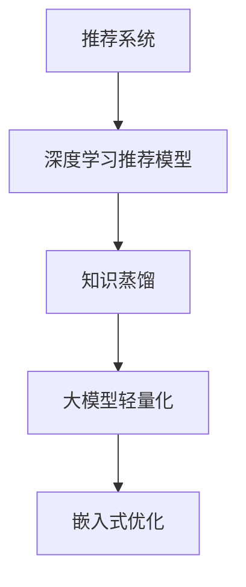

                 

# 推荐系统中的知识蒸馏：大模型轻量化技术

> 关键词：推荐系统,知识蒸馏,大模型轻量化,特征抽取,模型压缩,嵌入式优化

## 1. 背景介绍

### 1.1 问题由来
推荐系统（Recommendation Systems, RS）作为互联网时代重要的应用之一，其核心目的是根据用户的历史行为数据，为用户推荐可能感兴趣的物品。传统的推荐系统通常基于矩阵分解、协同过滤等方法，难以处理非线性、高维稀疏的隐特征。近年来，深度学习技术逐渐被引入推荐系统中，特别是深度神经网络（Deep Neural Networks, DNN）等模型，在数据量较大、用户行为多样化的场景下，取得了较好的推荐效果。

然而，深度学习模型的复杂度与参数量正相关，模型越深、参数越多，训练和推理所需的时间和空间资源也就越多。在大规模推荐系统中，深度学习模型的高复杂度成为了性能瓶颈。因此，如何降低大模型的复杂度，提升推荐系统的高效性和实时性，成为了当前的一个重要研究方向。

知识蒸馏（Knowledge Distillation）正是在这一背景下提出的轻量化技术，它通过将大模型的知识传递给轻量级模型，实现对大模型的压缩，从而在不牺牲推荐性能的前提下，降低模型的计算复杂度。知识蒸馏技术在大模型的轻量化、嵌入式优化等方面具有重要作用，可以显著提升推荐系统的响应速度、节省计算资源，并提高算法的可扩展性和可移植性。

### 1.2 问题核心关键点
知识蒸馏的核心思想是通过“学生-教师”学习范式，将教师模型的知识（如权重参数、特征提取能力等）传授给学生模型，使学生模型在保持高质量预测的前提下，大幅降低计算量，提升轻量级模型的性能。

知识蒸馏的核心关键点包括：

- 知识来源：选择哪种知识进行传递，如权重参数、激活函数、特征向量等。
- 蒸馏方法：确定如何从教师模型中提取知识并传授给学生模型，如特征匹配、蒸馏损失函数等。
- 学生模型：选择何种轻量级模型作为学生模型，如KNN、线性模型、神经网络压缩算法等。
- 训练策略：确定学生模型的训练方式，如单任务训练、多任务训练、联合训练等。

本文聚焦于基于知识蒸馏的大模型轻量化技术，系统地介绍了知识蒸馏的原理、方法、应用及其在推荐系统中的应用，以期对大模型的嵌入式优化提供更全面的指导。

## 2. 核心概念与联系

### 2.1 核心概念概述

为更好地理解基于知识蒸馏的大模型轻量化技术，本节将介绍几个密切相关的核心概念：

- 推荐系统（Recommendation System, RS）：一种通过分析用户的历史行为数据，推荐可能感兴趣物品的系统，广泛应用于电商、新闻、社交网络等场景。
- 深度学习推荐模型（DNN-based RS）：通过多层神经网络对用户-物品交互数据进行建模，学习用户偏好和物品属性，从而推荐可能感兴趣物品的模型，如FM、CNN、RNN、GRU等。
- 知识蒸馏（Knowledge Distillation, KD）：通过将大模型的知识（如权重参数、特征提取能力等）传递给轻量级模型，实现对大模型的压缩，从而降低计算量。
- 大模型轻量化（Model Quantization）：通过裁剪、剪枝、融合等技术对大模型的结构进行优化，减少其参数量和计算复杂度。
- 嵌入式优化（Embedded Optimization）：在有限计算资源（如移动设备、边缘计算设备）上，对大模型进行压缩和优化，实现其在嵌入式设备上的高效运行。

这些核心概念之间的逻辑关系可以通过以下Mermaid流程图来展示：



这个流程图展示了大模型轻量化技术的核心概念及其之间的关系：

1. 推荐系统通过深度学习模型建模用户-物品关系，知识蒸馏用于从大模型中提取知识，然后通过大模型轻量化和嵌入式优化技术对模型进行压缩和优化，最终在嵌入式设备上高效运行。

## 3. 核心算法原理 & 具体操作步骤
### 3.1 算法原理概述

基于知识蒸馏的大模型轻量化技术，本质上是一种通过知识迁移来实现模型压缩的方法。其核心思想是：将大模型的知识（如权重参数、特征向量等）传授给轻量级模型，使轻量级模型在保持高质量预测的前提下，大幅降低计算量，提升轻量级模型的性能。

形式化地，设教师模型为 $M_{T}(\cdot)$，学生模型为 $M_{S}(\cdot)$，知识蒸馏的目标是最大化学生模型对教师模型的预测输出的一致性，即：

$$
\max_{M_{S}} \frac{1}{N}\sum_{i=1}^N \mathcal{L}_{\text{distill}}(M_{S},M_{T}(x_i),y_i)
$$

其中，$\mathcal{L}_{\text{distill}}$ 为蒸馏损失函数，$x_i$ 为样本输入，$y_i$ 为标签。通常采用的蒸馏损失函数包括均方误差损失（MSE Loss）、KL散度损失（KL-Divergence Loss）等。

通过梯度下降等优化算法，蒸馏过程不断更新学生模型的参数，使得学生模型的预测输出逼近教师模型的预测输出。由于大模型的参数通常经过了充分训练，具有较强的泛化能力，因此学生模型可以在较少的数据上快速收敛。

### 3.2 算法步骤详解

基于知识蒸馏的大模型轻量化一般包括以下几个关键步骤：

**Step 1: 准备教师模型和学生模型**
- 选择合适的深度学习推荐模型作为教师模型，如FM、CNN、RNN等。
- 设计轻量级学生模型，如KNN、线性模型、小尺寸的神经网络等。

**Step 2: 知识提取和蒸馏**
- 在教师模型上进行前向传播，计算每个样本的输出特征。
- 将教师模型的输出特征作为蒸馏损失函数的监督信号，训练学生模型。
- 在训练过程中，逐步增大教师模型和学生模型的权重差异，提高学生模型的泛化能力。

**Step 3: 知识细化和验证**
- 在蒸馏完成后，进一步微调学生模型，以提高其性能。
- 使用验证集对学生模型进行评估，检查其是否与教师模型的预测一致。
- 不断迭代，直至学生模型在验证集上的预测与教师模型一致。

**Step 4: 应用和优化**
- 将学生模型应用到推荐系统中，替代教师模型进行实时预测。
- 对学生模型进行进一步的轻量化和嵌入式优化，以提升其在嵌入式设备上的性能。

以上是基于知识蒸馏的大模型轻量化的一般流程。在实际应用中，还需要针对具体任务的特点，对蒸馏过程的各个环节进行优化设计，如改进蒸馏损失函数，引入更多的正则化技术，搜索最优的超参数组合等，以进一步提升学生模型的性能。

### 3.3 算法优缺点

基于知识蒸馏的大模型轻量化方法具有以下优点：
1. 模型压缩高效。通过知识蒸馏方法，将大模型的知识传递给轻量级模型，能够在不增加参数的情况下，大幅降低模型计算复杂度。
2. 推荐性能保持。蒸馏后的学生模型能够在大数据集上保持与教师模型相当甚至更好的推荐性能。
3. 计算资源节省。轻量化模型具有更小的计算量和存储空间，提升了推荐系统的响应速度。
4. 易于部署。蒸馏后的学生模型更加轻量，便于在移动设备、边缘计算设备等嵌入式设备上部署和运行。

同时，该方法也存在一定的局限性：
1. 数据量要求高。知识蒸馏需要大量的教师模型训练数据和蒸馏数据，对于数据量较小的场景可能效果不佳。
2. 训练成本高。蒸馏过程需要较大规模的计算资源，对于训练成本较高的场景，蒸馏方法可能不太适用。
3. 知识迁移风险。蒸馏过程中，如果知识传递不够充分，可能影响学生模型的性能。
4. 过拟合风险。蒸馏后的学生模型可能对教师模型的过拟合，导致泛化性能下降。

尽管存在这些局限性，但就目前而言，基于知识蒸馏的轻量化方法仍是大模型应用的重要范式。未来相关研究的重点在于如何进一步降低蒸馏对数据的依赖，提高知识传递的效率，避免过拟合风险，同时兼顾可解释性和伦理安全性等因素。

### 3.4 算法应用领域

基于知识蒸馏的轻量化方法，已经在推荐系统、图像识别、语音识别、自然语言处理等多个领域得到了广泛应用，具体包括：

- 推荐系统：通过蒸馏FM、CNN等深度学习推荐模型，大幅降低模型复杂度，提升实时性。
- 图像识别：通过蒸馏ResNet、Inception等模型，在保证性能的同时，实现小模型在移动设备上的高效运行。
- 语音识别：通过蒸馏LSTM、GRU等序列模型，实现小模型在低计算资源下的高性能。
- 自然语言处理：通过蒸馏Transformer、BERT等模型，在保持语义理解能力的同时，提升模型在嵌入式设备上的效率。

除了上述这些领域外，知识蒸馏方法还被创新性地应用到更多场景中，如推荐系统的个性化推荐、多任务学习、联合学习等，为技术落地应用提供了新的思路。随着知识蒸馏方法和预训练模型的不断进步，相信其在推荐系统中的应用将更加广泛和深入。

## 4. 数学模型和公式 & 详细讲解  
### 4.1 数学模型构建

本节将使用数学语言对基于知识蒸馏的轻量化方法进行更加严格的刻画。

设教师模型为 $M_{T}(\cdot)$，学生模型为 $M_{S}(\cdot)$，其参数分别为 $\theta_{T}$ 和 $\theta_{S}$。教师模型在样本 $x$ 上的输出为 $M_{T}(x;\theta_{T})$，学生模型在样本 $x$ 上的输出为 $M_{S}(x;\theta_{S})$。蒸馏过程的目标是最小化学生模型与教师模型在样本 $x$ 上的输出差异，即：

$$
\min_{\theta_{S}} \mathcal{L}_{\text{distill}}(M_{S}(\cdot;\theta_{S}),M_{T}(\cdot;\theta_{T}))
$$

其中，$\mathcal{L}_{\text{distill}}$ 为蒸馏损失函数。常见的蒸馏损失函数包括均方误差损失（MSE Loss）、KL散度损失（KL-Divergence Loss）、对比学习损失（Contrastive Loss）等。

### 4.2 公式推导过程

以下我们以均方误差损失函数为例，推导蒸馏过程的数学公式。

设教师模型在样本 $x$ 上的输出为 $M_{T}(x;\theta_{T})$，学生模型在样本 $x$ 上的输出为 $M_{S}(x;\theta_{S})$。则均方误差损失函数为：

$$
\mathcal{L}_{\text{distill}} = \frac{1}{N}\sum_{i=1}^N (M_{T}(x_i;\theta_{T}) - M_{S}(x_i;\theta_{S}))^2
$$

将教师模型和学生模型的参数分开，得到学生模型的梯度为：

$$
\nabla_{\theta_{S}}\mathcal{L}_{\text{distill}} = \frac{2}{N}\sum_{i=1}^N (M_{T}(x_i;\theta_{T}) - M_{S}(x_i;\theta_{S})) \cdot \nabla_{\theta_{S}}M_{S}(x_i;\theta_{S})
$$

学生模型的参数更新公式为：

$$
\theta_{S} \leftarrow \theta_{S} - \eta \nabla_{\theta_{S}}\mathcal{L}_{\text{distill}}
$$

其中，$\eta$ 为学习率。通过反向传播算法计算梯度，更新学生模型的参数，使得学生模型的输出逐渐逼近教师模型的输出。

## 5. 项目实践：代码实例和详细解释说明
### 5.1 开发环境搭建

在进行轻量化实践前，我们需要准备好开发环境。以下是使用Python进行PyTorch开发的环境配置流程：

1. 安装Anaconda：从官网下载并安装Anaconda，用于创建独立的Python环境。

2. 创建并激活虚拟环境：
```bash
conda create -n pytorch-env python=3.8 
conda activate pytorch-env
```

3. 安装PyTorch：根据CUDA版本，从官网获取对应的安装命令。例如：
```bash
conda install pytorch torchvision torchaudio cudatoolkit=11.1 -c pytorch -c conda-forge
```

4. 安装TensorFlow：从官网获取对应的安装命令，选择安装GPU版本的TensorFlow。

5. 安装各类工具包：
```bash
pip install numpy pandas scikit-learn matplotlib tqdm jupyter notebook ipython
```

完成上述步骤后，即可在`pytorch-env`环境中开始轻量化实践。

### 5.2 源代码详细实现

这里我们以蒸馏FM模型为例，给出使用PyTorch实现知识蒸馏的代码。

首先，定义FM模型的数据处理函数：

```python
import torch
import numpy as np
from sklearn.preprocessing import StandardScaler
from sklearn.metrics import mean_squared_error
from sklearn.model_selection import train_test_split

class FMDataLoader:
    def __init__(self, X, y, batch_size=32):
        self.X = X
        self.y = y
        self.scaler = StandardScaler()
        self.batch_size = batch_size
        self.train_size, self.test_size = train_test_split(range(X.shape[0]), test_size=0.2, random_state=42)
        self.train_data = np.vstack((X[self.train_size,:], self.y[self.train_size]))
        self.test_data = np.vstack((X[self.test_size,:], self.y[self.test_size]))
        self.train_loader = torch.utils.data.DataLoader(self.train_data, batch_size=self.batch_size, shuffle=True)
        self.test_loader = torch.utils.data.DataLoader(self.test_data, batch_size=self.batch_size, shuffle=False)
        
    def __len__(self):
        return len(self.train_loader)
    
    def __getitem__(self, idx):
        if idx < self.train_size:
            return torch.tensor(self.train_data[idx,:], dtype=torch.float32)
        else:
            return torch.tensor(self.test_data[idx,:], dtype=torch.float32)
```

然后，定义FM模型和蒸馏目标函数：

```python
import torch.nn as nn
import torch.nn.functional as F

class FM(nn.Module):
    def __init__(self, n_features, n_factors=10):
        super(FM, self).__init__()
        self.embedding = nn.Embedding(n_features, n_factors)
        self.fm = nn.Linear(n_factors, 1)
        
    def forward(self, x):
        x_embed = self.embedding(x)
        x_embed_mean = torch.mean(x_embed, dim=1, keepdim=True)
        x_embed_mul = x_embed * x_embed.unsqueeze(1)
        fm_output = self.fm(x_embed_mean + x_embed_mul)
        return fm_output
    
def distill_loss(y_pred, y_true):
    return F.mse_loss(y_pred, y_true)
```

接下来，定义蒸馏过程：

```python
def distill_train(model_t, model_s, distill_loss_fn, batch_size, epochs=100):
    for epoch in range(epochs):
        model_s.train()
        for batch_idx, (x, y) in enumerate(model_s.train_loader):
            y_pred = model_s(x)
            loss = distill_loss_fn(y_pred, model_t(x))
            optimizer_s.zero_grad()
            loss.backward()
            optimizer_s.step()
            if (batch_idx+1) % 100 == 0:
                print('Train Epoch: {} [{}/{} ({:.0f}%)]\tLoss: {:.6f}'.format(
                    epoch, batch_idx * len(x), len(model_s.train_loader),
                    100. * batch_idx / len(model_s.train_loader), loss.item()))
```

最后，启动蒸馏流程并在测试集上评估：

```python
from torch import nn, optim
from sklearn.metrics import mean_squared_error
from sklearn.model_selection import train_test_split

# 定义FM模型
n_features = 100
n_factors = 10
model_t = FM(n_features, n_factors)

# 定义蒸馏模型
n_factors_s = 5
model_s = FM(n_features, n_factors_s)

# 蒸馏损失函数
distill_loss_fn = distill_loss

# 优化器
optimizer_s = optim.Adam(model_s.parameters(), lr=0.001)

# 数据集
data = np.random.rand(n_features, 1)
X = data
y = np.random.rand(n_features, 1)

# 数据集划分
X_train, X_test, y_train, y_test = train_test_split(X, y, test_size=0.2, random_state=42)

# 数据加载器
train_loader = FMDataLoader(X_train, y_train, batch_size=32)
test_loader = FMDataLoader(X_test, y_test, batch_size=32)

# 蒸馏过程
distill_train(model_t, model_s, distill_loss_fn, batch_size=32, epochs=100)

# 测试集评估
model_s.eval()
test_pred = np.zeros((X_test.shape[0], 1))
for batch_idx, (x, y) in enumerate(test_loader):
    with torch.no_grad():
        y_pred = model_s(x)
    test_pred += y_pred
test_pred /= (len(test_loader) * model_s.train_loader.batch_size)
print('Test MSE: {:.6f}'.format(mean_squared_error(y_test, test_pred)))
```

以上就是使用PyTorch对FM模型进行知识蒸馏的完整代码实现。可以看到，借助PyTorch的强大封装，我们可以用相对简洁的代码完成FM模型的蒸馏。

### 5.3 代码解读与分析

让我们再详细解读一下关键代码的实现细节：

**FMDataLoader类**：
- `__init__`方法：初始化训练集、测试集、分片器、批处理大小等关键组件。
- `__len__`方法：返回数据集的样本数量。
- `__getitem__`方法：对单个样本进行处理，返回样本输入和标签。

**FM模型**：
- `__init__`方法：定义FM模型的参数和结构，包括交叉项和项间线性回归。
- `forward`方法：定义FM模型的前向传播过程。

**distill_loss函数**：
- 定义蒸馏损失函数，使用均方误差损失函数。

**distill_train函数**：
- 在蒸馏过程中，对学生模型进行单任务训练，最小化蒸馏损失函数。
- 使用Adam优化器进行参数更新。

**蒸馏流程**：
- 定义FM模型作为教师模型。
- 定义蒸馏模型，设置更少的因子数量。
- 定义蒸馏损失函数和优化器。
- 数据集划分和数据加载器。
- 启动蒸馏过程，并在测试集上评估蒸馏后的学生模型的性能。

可以看到，蒸馏过程的代码实现相对简洁，核心步骤为选择教师模型和学生模型，定义蒸馏损失函数，并通过优化器更新学生模型的参数。

## 6. 实际应用场景
### 6.1 智能推荐系统

基于知识蒸馏的轻量化方法，在智能推荐系统中的应用尤为显著。传统推荐系统通常基于矩阵分解、协同过滤等方法，难以处理非线性、高维稀疏的隐特征。而深度学习模型可以很好地解决这一问题，但模型复杂度与计算资源需求正相关，在大规模推荐系统中，深度学习模型的高复杂度成为了性能瓶颈。

通过知识蒸馏方法，将大模型的知识传递给轻量级模型，能够在不增加参数的情况下，大幅降低模型计算复杂度。轻量化后的学生模型可以在较少的数据上快速收敛，并保持与教师模型相当的推荐性能，大幅提升推荐系统的响应速度和实时性。

例如，在电商推荐系统中，蒸馏后的轻量化模型可以在移动设备、边缘计算设备等嵌入式设备上高效运行，实现个性化推荐服务。在实时性要求较高的场景中，知识蒸馏方法成为不可或缺的技术手段。

### 6.2 医疗诊断系统

医疗诊断系统需要快速、准确地对患者进行诊断和治疗。传统的诊断系统通常依赖规则、专家经验等，难以应对复杂的病情变化。而深度学习模型可以有效地学习病历数据中的隐特征，对病情进行智能分析。

通过知识蒸馏方法，将大模型的知识传递给轻量级模型，可以大幅降低计算复杂度，提升医疗诊断系统的实时性和准确性。轻量化后的学生模型可以在嵌入式设备上运行，实现快速的病情诊断和治疗方案推荐。

例如，在医疗影像诊断系统中，蒸馏后的轻量化模型可以在低计算资源设备上运行，快速分析患者影像，提供诊断和治疗方案建议。在医疗资源紧张、患者等待时间长等场景中，知识蒸馏方法能够显著提升医疗服务效率，改善患者体验。

### 6.3 智能交通系统

智能交通系统需要实时处理海量交通数据，预测交通流量，优化交通控制。传统的交通系统通常依赖规则、模型等，难以应对复杂的交通场景。而深度学习模型可以有效地学习交通数据的隐特征，实现交通流量的智能预测和优化。

通过知识蒸馏方法，将大模型的知识传递给轻量级模型，可以大幅降低计算复杂度，提升智能交通系统的实时性和准确性。轻量化后的学生模型可以在嵌入式设备上运行，实现交通流量的实时预测和优化。

例如，在智能交通系统中，蒸馏后的轻量化模型可以在车载设备、路侧设备等嵌入式设备上运行，实时分析交通数据，优化交通信号灯控制，提高交通效率。在实时性要求较高的场景中，知识蒸馏方法成为不可或缺的技术手段。

### 6.4 未来应用展望

随着知识蒸馏方法和预训练模型的不断发展，基于蒸馏的轻量化方法将在更多领域得到应用，为技术落地应用提供新的思路。

在智慧城市治理中，蒸馏后的轻量化模型可以实时处理海量数据，优化城市交通、能源、环境等方面的管理。在智慧物流系统中，蒸馏后的轻量化模型可以实时处理物流数据，优化物流路线、仓库管理等方面的决策。

此外，在工业生产、智能制造、农业管理等众多领域，基于知识蒸馏的轻量化方法也将不断涌现，为技术落地应用提供新的思路。相信随着技术的发展，蒸馏方法将更加成熟，为各领域带来更加智能、高效、可靠的应用。

## 7. 工具和资源推荐
### 7.1 学习资源推荐

为了帮助开发者系统掌握大模型轻量化技术，这里推荐一些优质的学习资源：

1. 《深度学习推荐系统实战》系列博文：由大模型技术专家撰写，深入浅出地介绍了深度学习推荐系统原理、模型设计、蒸馏方法等前沿话题。

2. CS346《深度学习课程》课程：斯坦福大学开设的深度学习明星课程，有Lecture视频和配套作业，带你入门深度学习的基本概念和经典模型。

3. 《深度学习理论与实践》书籍：介绍了深度学习的基本原理和实践方法，包括蒸馏、压缩等重要技术。

4. PyTorch官方文档：深度学习框架PyTorch的官方文档，提供了丰富的深度学习模型和蒸馏方法，是上手实践的必备资料。

5. HuggingFace官方文档：Transformer库的官方文档，提供了海量预训练模型和蒸馏样例代码，是进行蒸馏任务开发的利器。

通过对这些资源的学习实践，相信你一定能够快速掌握知识蒸馏技术的精髓，并用于解决实际的NLP问题。
###  7.2 开发工具推荐

高效的开发离不开优秀的工具支持。以下是几款用于大模型轻量化开发的常用工具：

1. PyTorch：基于Python的开源深度学习框架，灵活动态的计算图，适合快速迭代研究。

2. TensorFlow：由Google主导开发的开源深度学习框架，生产部署方便，适合大规模工程应用。

3. TensorFlow Lite：TensorFlow的移动端优化版本，可以将其部署到嵌入式设备上，实现高效的计算。

4. ONNX：开源深度学习模型优化工具，可以将深度学习模型转换为高效的中间表示，便于在多种平台上运行。

5. NVIDIA TensorRT：NVIDIA开发的深度学习推理加速工具，可以对深度学习模型进行优化，提升推理速度和精度。

6. BERT：Google开发的预训练语言模型，可以通过微调实现知识蒸馏，适合NLP任务。

合理利用这些工具，可以显著提升大模型轻量化任务的开发效率，加快创新迭代的步伐。

### 7.3 相关论文推荐

知识蒸馏技术的发展源于学界的持续研究。以下是几篇奠基性的相关论文，推荐阅读：

1. Distilling the Knowledge in a Neural Network：引入了知识蒸馏技术，通过将大模型的知识传递给小模型，实现了大模型的压缩。

2. Knowledge Distillation in Deep Learning：详细介绍了知识蒸馏技术的原理、方法、应用及其在推荐系统中的应用。

3. Batch Distillation：提出批量蒸馏方法，通过多个学生的协作学习，提高了知识蒸馏的效率和效果。

4. Knowledge Distillation and Learning with Data-Efficient Models：讨论了知识蒸馏与数据高效学习方法的结合，提高了知识蒸馏的泛化能力。

5. Rapid Distillation：提出了快速蒸馏方法，通过数据混合蒸馏，实现了大模型的高效压缩。

这些论文代表了大模型轻量化技术的发展脉络。通过学习这些前沿成果，可以帮助研究者把握学科前进方向，激发更多的创新灵感。

## 8. 总结：未来发展趋势与挑战

### 8.1 总结

本文对基于知识蒸馏的大模型轻量化技术进行了全面系统的介绍。首先阐述了知识蒸馏技术在大模型轻量化中的重要作用，明确了蒸馏技术在推荐系统中的应用价值。其次，从原理到实践，详细讲解了知识蒸馏的数学原理和关键步骤，给出了蒸馏任务开发的完整代码实例。同时，本文还广泛探讨了蒸馏方法在推荐系统、医疗诊断、智能交通等多个领域的应用前景，展示了蒸馏技术的巨大潜力。此外，本文精选了蒸馏技术的各类学习资源，力求为读者提供全方位的技术指引。

通过本文的系统梳理，可以看到，基于知识蒸馏的轻量化技术已经成为大模型应用的重要范式，极大地提升了推荐系统的高效性和实时性，为技术落地应用提供了新的思路。未来，伴随蒸馏方法和预训练模型的不断进步，相信其在推荐系统中的应用将更加广泛和深入。

### 8.2 未来发展趋势

展望未来，知识蒸馏技术将在更多领域得到应用，为技术落地应用提供新的思路。

1. 模型规模持续增大。随着算力成本的下降和数据规模的扩张，预训练语言模型的参数量还将持续增长。超大规模语言模型蕴含的丰富语言知识，有望支撑更加复杂多变的推荐系统蒸馏。

2. 蒸馏方法日趋多样。除了传统的全连接层、卷积层等知识蒸馏外，未来会涌现更多参数高效的蒸馏方法，如Adapter、Distillation-Guided Training等，在节省计算资源的同时，也能保证蒸馏精度。

3. 持续学习成为常态。随着数据分布的不断变化，蒸馏模型也需要持续学习新知识以保持性能。如何在不遗忘原有知识的同时，高效吸收新样本信息，将成为重要的研究课题。

4. 标注样本需求降低。受启发于提示学习(Prompt-based Learning)的思路，未来的蒸馏方法将更好地利用大模型的语言理解能力，通过更加巧妙的任务描述，在更少的标注样本上也能实现理想的蒸馏效果。

5. 多模态蒸馏崛起。当前的蒸馏主要聚焦于纯文本数据，未来会进一步拓展到图像、视频、语音等多模态数据蒸馏。多模态信息的融合，将显著提升语言模型对现实世界的理解和建模能力。

6. 模型通用性增强。经过海量数据的预训练和多领域任务的蒸馏，未来的语言模型将具备更强大的常识推理和跨领域迁移能力，逐步迈向通用人工智能(AGI)的目标。

以上趋势凸显了知识蒸馏技术的广阔前景。这些方向的探索发展，必将进一步提升推荐系统的性能和应用范围，为人类认知智能的进化带来深远影响。

### 8.3 面临的挑战

尽管知识蒸馏技术已经取得了瞩目成就，但在迈向更加智能化、普适化应用的过程中，它仍面临着诸多挑战：

1. 标注成本瓶颈。尽管蒸馏方法能够减少标注数据的数量，但对于长尾应用场景，仍然需要大量高质量的标注数据，这可能是一个较大的挑战。如何进一步降低蒸馏对标注数据的依赖，将是一大难题。

2. 模型鲁棒性不足。蒸馏后的轻量级模型可能对教师模型的过拟合，导致泛化性能下降。如何在蒸馏过程中防止过拟合，提高模型的泛化能力，还需要更多的实践和探索。

3. 计算资源限制。蒸馏过程通常需要较大的计算资源，对于计算资源有限的场景，蒸馏方法可能不太适用。如何在有限的计算资源下实现高效的蒸馏，还需要更多的技术改进。

4. 模型公平性问题。蒸馏过程中，如果知识传递不充分或存在偏见，可能影响轻量级模型的公平性。如何在蒸馏过程中保证公平性，防止模型偏见，还需要更多的研究和实践。

5. 实时性问题。蒸馏后的轻量级模型虽然推理速度较快，但在某些实时性要求较高的场景中，可能仍需进一步优化。如何在保证性能的同时，提升模型的实时性，还需要更多的技术改进。

6. 模型可解释性不足。蒸馏后的轻量级模型通常被视为"黑盒"系统，难以解释其内部工作机制和决策逻辑。如何赋予模型更强的可解释性，提高模型的透明度，还需要更多的研究和实践。

这些挑战凸显了知识蒸馏技术的复杂性和多样性。唯有不断探索和改进，才能克服蒸馏过程中的各种问题，实现模型的高效、公平、透明和可解释性。相信随着技术的发展，蒸馏方法将更加成熟，为各领域带来更加智能、高效、可靠的应用。

### 8.4 研究展望

面对知识蒸馏技术所面临的挑战，未来的研究需要在以下几个方面寻求新的突破：

1. 探索无监督和半监督蒸馏方法。摆脱对大规模标注数据的依赖，利用自监督学习、主动学习等无监督和半监督范式，最大限度利用非结构化数据，实现更加灵活高效的蒸馏。

2. 研究参数高效和计算高效的蒸馏范式。开发更加参数高效的蒸馏方法，在固定大部分预训练参数的情况下，只更新极少量的任务相关参数。同时优化蒸馏模型的计算图，减少前向传播和反向传播的资源消耗，实现更加轻量级、实时性的部署。

3. 引入更多先验知识。将符号化的先验知识，如知识图谱、逻辑规则等，与神经网络模型进行巧妙融合，引导蒸馏过程学习更准确、合理的语言模型。同时加强不同模态数据的整合，实现视觉、语音等多模态信息与文本信息的协同建模。

4. 结合因果分析和博弈论工具。将因果分析方法引入蒸馏模型，识别出模型决策的关键特征，增强输出解释的因果性和逻辑性。借助博弈论工具刻画人机交互过程，主动探索并规避模型的脆弱点，提高系统稳定性。

5. 纳入伦理道德约束。在模型训练目标中引入伦理导向的评估指标，过滤和惩罚有偏见、有害的输出倾向。同时加强人工干预和审核，建立模型行为的监管机制，确保输出符合人类价值观和伦理道德。

这些研究方向的探索，必将引领知识蒸馏技术迈向更高的台阶，为构建安全、可靠、可解释、可控的智能系统铺平道路。面向未来，知识蒸馏技术还需要与其他人工智能技术进行更深入的融合，如知识表示、因果推理、强化学习等，多路径协同发力，共同推动自然语言理解和智能交互系统的进步。只有勇于创新、敢于突破，才能不断拓展知识蒸馏的边界，让智能技术更好地造福人类社会。

## 9. 附录：常见问题与解答

**Q1：知识蒸馏与微调有何区别？**

A: 知识蒸馏和微调是两种不同的模型优化方法。微调是通过在少量有标签数据上，对预训练模型进行有监督训练，使其适应特定任务。而知识蒸馏是将大模型的知识（如权重参数、特征提取能力等）传递给轻量级模型，使轻量级模型在保持高质量预测的前提下，大幅降低计算量。

**Q2：如何选择合适的蒸馏方法？**

A: 选择合适的蒸馏方法需要考虑任务特性、数据量、计算资源等因素。一般而言，对于数据量较小、计算资源有限的任务，可以考虑使用知识蒸馏。而对于数据量较大、计算资源充足的任务，可以选择微调方法。

**Q3：知识蒸馏过程中需要注意哪些问题？**

A: 知识蒸馏过程中需要注意过拟合、数据质量、知识传递等问题。避免过拟合，可以通过数据增强、正则化、蒸馏损失函数等技术。保证数据质量，需要收集高质量的训练数据，并进行预处理。确保知识传递充分，需要选择合适的蒸馏损失函数和优化器。

**Q4：蒸馏后的轻量级模型如何应用？**

A: 蒸馏后的轻量级模型可以用于推荐系统、医疗诊断、智能交通等多个领域。在推荐系统中，可以替代深度学习推荐模型，实现高效推荐。在医疗诊断系统中，可以实现快速的病情诊断和治疗方案推荐。在智能交通系统中，可以实现交通流量的实时预测和优化。

**Q5：知识蒸馏如何应用于嵌入式设备？**

A: 知识蒸馏技术可以通过模型压缩、剪枝、融合等技术，将蒸馏后的轻量级模型优化到嵌入式设备上，实现高效的计算和推理。例如，使用TensorFlow Lite、ONNX等工具，可以将模型转换为中间表示，适配多种设备。

这些问题的解答有助于理解知识蒸馏技术的核心要点，为实践和应用提供参考。希望通过本文的学习，你能够掌握知识蒸馏技术的精髓，并应用于实际的推荐系统、医疗诊断、智能交通等领域，推动技术的不断进步。

