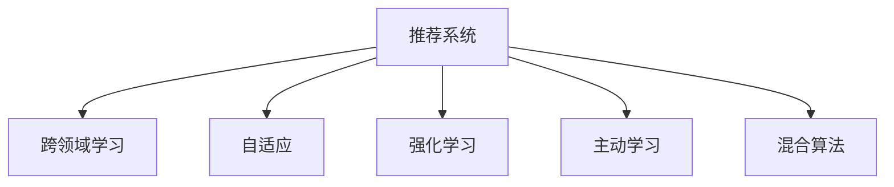

                 

# 推荐系统的多样性：AI大模型的新思路

> 关键词：推荐系统, 多样性, 大模型, 跨领域学习, 自适应, 强化学习, 主动学习, 混合算法

## 1. 背景介绍

### 1.1 问题由来

推荐系统是互联网时代最重要的应用之一，为用户提供了个性化的信息获取、内容消费和商品购买等服务，对用户体验和商业价值具有重要影响。传统的推荐系统主要基于用户历史行为数据进行建模，但这种方式存在诸多局限性，如冷启动、数据稀疏、用户意图难以理解等问题。近年来，人工智能(AI)大模型在推荐系统中的应用开始成为新的热门研究方向。

AI大模型通过在大规模语料上预训练，学习到了丰富的语言和知识表示。通过微调或迁移学习等方式，可以将其应用于推荐系统，从文本数据中提取用户兴趣和商品属性，实现跨领域的智能推荐。AI大模型在推荐系统中的应用，带来了推荐算法多样性的大幅提升，为用户提供了更为丰富和精准的个性化服务。

### 1.2 问题核心关键点

当前，AI大模型在推荐系统中的应用主要集中在以下几个方面：

- **跨领域学习**：AI大模型通过预训练，学习到了通用语言和知识表示，能够在不同领域（如电商、新闻、视频等）之间进行迁移学习，提高推荐系统的泛化能力。

- **自适应**：AI大模型通过自监督学习或少样本学习，能够快速适应新领域和新用户，解决冷启动和数据稀疏等问题。

- **强化学习**：AI大模型通过与用户互动，进行连续性学习和优化，不断提升推荐效果和用户满意度。

- **主动学习**：AI大模型能够主动获取用户反馈信息，进行学习，提高推荐精度和用户覆盖率。

- **混合算法**：AI大模型能够与其他推荐算法进行融合，充分发挥各自优势，实现推荐效果的最优化。

这些关键点构成了AI大模型在推荐系统中的应用框架，使得推荐系统能够更好地理解和预测用户需求，提供更加个性化的服务。

### 1.3 问题研究意义

AI大模型在推荐系统中的应用，对推荐系统的智能化和个性化具有重要意义：

1. **提升推荐精度**：通过学习通用语言和知识表示，AI大模型能够从大量无标签数据中提取用户兴趣和商品属性，提升推荐的准确性和覆盖率。
2. **解决冷启动问题**：通过自适应学习，AI大模型能够快速理解新用户和新商品，解决冷启动时无法获取用户行为数据的难题。
3. **应对数据稀疏**：AI大模型能够从文本数据中挖掘出用户隐含的兴趣，即使用户行为数据稀疏也能进行有效推荐。
4. **用户覆盖率提升**：AI大模型能够理解复杂多样的用户需求，推荐多样化的商品和服务，提高用户满意度和黏性。
5. **商业价值最大化**：通过精准推荐，AI大模型能够显著提高转化率和销售额，为商家带来更高的商业价值。

## 2. 核心概念与联系

### 2.1 核心概念概述

为更好地理解AI大模型在推荐系统中的应用，本节将介绍几个关键概念及其联系：

- **推荐系统(Recommendation System)**：利用用户历史行为数据和商品属性信息，为每位用户推荐最相关的商品或内容。
- **跨领域学习(Cross-Domain Learning)**：从一种领域学到的知识可以应用于另一种领域，如从电商领域的推荐系统应用于新闻领域的个性化阅读推荐。
- **自适应(Adaptation)**：模型能够快速适应新领域和新用户，减少冷启动的影响。
- **强化学习(Reinforcement Learning, RL)**：通过与环境（用户）的互动，不断优化推荐策略，提升推荐效果。
- **主动学习(Active Learning)**：模型能够主动获取用户反馈，进行学习，提高推荐精度和覆盖率。
- **混合算法(Mixed Algorithm)**：将AI大模型与其他推荐算法进行融合，实现推荐效果的最优化。

这些概念之间的逻辑关系可以通过以下Mermaid流程图来展示：



这个流程图展示了推荐系统与各种AI大模型相关技术之间的联系，帮助读者理解其工作原理和应用场景。

## 3. 核心算法原理 & 具体操作步骤
### 3.1 算法原理概述

AI大模型在推荐系统中的应用，主要基于跨领域学习和自适应两大核心原理。其核心思想是：利用AI大模型在大规模语料上进行预训练，学习到通用的语言和知识表示。然后，通过微调或迁移学习等方式，将这些表示应用于推荐系统，实现跨领域的智能推荐。

形式化地，假设推荐系统中有$N$个用户，$M$个商品，$K$个特征。设用户$u$对商品$i$的兴趣为$r_{ui}$，商品$i$的属性为$\textbf{x}_i$。推荐系统的目标是通过模型$p_{\theta}(u,i)$预测用户$u$对商品$i$的兴趣，最大化总体的推荐效果。

设预训练语言模型为$M_{\theta}$，其中$\theta$为预训练得到的模型参数。通过在大规模无标签语料上预训练，$M_{\theta}$学习到了通用的语言和知识表示。然后，通过微调或迁移学习，将$M_{\theta}$应用于推荐系统，得到推荐模型$p_{\theta}$。推荐模型的目标函数为：

$$
\max_{\theta} \sum_{u,i} r_{ui} \log p_{\theta}(u,i)
$$

即最大化预测准确率，使得推荐模型输出的概率分布与实际的用户-商品兴趣分布$P_{ui}$尽可能一致。

### 3.2 算法步骤详解

AI大模型在推荐系统中的应用，主要包括以下几个关键步骤：

**Step 1: 准备预训练模型和数据集**
- 选择合适的预训练语言模型$M_{\theta}$作为初始化参数，如BERT、GPT等。
- 准备推荐系统的训练集$D_{train}=\{(u_i,r_{ui},\textbf{x}_i)\}_{i=1}^N$，其中$(u_i,r_{ui},\textbf{x}_i)$表示用户$i$对商品$i$的评分和属性。

**Step 2: 添加任务适配层**
- 根据推荐任务类型，在预训练模型的顶部设计合适的输出层和损失函数。
- 对于评分预测任务，通常在顶层添加线性分类器和交叉熵损失函数。
- 对于排序任务，通常使用序列匹配或点积相似度作为损失函数。

**Step 3: 设置微调超参数**
- 选择合适的优化算法及其参数，如AdamW、SGD等，设置学习率、批大小、迭代轮数等。
- 设置正则化技术及强度，包括权重衰减、Dropout、Early Stopping等。
- 确定冻结预训练参数的策略，如仅微调顶层，或全部参数都参与微调。

**Step 4: 执行梯度训练**
- 将训练集数据分批次输入模型，前向传播计算损失函数。
- 反向传播计算参数梯度，根据设定的优化算法和学习率更新模型参数。
- 周期性在验证集上评估模型性能，根据性能指标决定是否触发 Early Stopping。
- 重复上述步骤直到满足预设的迭代轮数或 Early Stopping 条件。

**Step 5: 测试和部署**
- 在测试集上评估微调后模型$p_{\hat{\theta}}$的性能，对比微调前后的精度提升。
- 使用微调后的模型对新样本进行推理预测，集成到实际的应用系统中。
- 持续收集新的数据，定期重新微调模型，以适应数据分布的变化。

以上是AI大模型在推荐系统中的应用的一般流程。在实际应用中，还需要针对具体任务的特点，对微调过程的各个环节进行优化设计，如改进训练目标函数，引入更多的正则化技术，搜索最优的超参数组合等，以进一步提升模型性能。

### 3.3 算法优缺点

AI大模型在推荐系统中的应用具有以下优点：
1. 学习能力强大。通过跨领域学习和自适应，AI大模型能够从多种数据源中学习到广泛的知识，提高推荐的精度和多样性。
2. 泛化能力强。预训练语言模型具有较强的泛化能力，能够适应新领域和新用户，减少冷启动的影响。
3. 融合多种算法。AI大模型能够与传统的协同过滤、基于内容的推荐等算法进行融合，实现推荐效果的最优化。
4. 实时性较好。AI大模型可以实时学习用户反馈，动态更新推荐策略，提高推荐的时效性。

同时，该方法也存在一定的局限性：
1. 数据依赖。AI大模型的性能很大程度上依赖于预训练数据和标注数据，需要大规模的数据集和标注工作。
2. 计算资源消耗高。预训练语言模型通常需要消耗大量的计算资源，微调过程也需要较高的计算能力。
3. 可解释性不足。AI大模型的黑盒特性使得其决策过程难以解释，难以进行调试和优化。
4. 偏差问题。预训练语言模型可能学习到有偏见的知识，影响推荐的公平性和准确性。

尽管存在这些局限性，但就目前而言，AI大模型在推荐系统中的应用是最主流范式之一，具有重要的理论和实际价值。未来相关研究的重点在于如何进一步降低AI大模型对数据和计算资源的依赖，提高其可解释性和公平性，以及探索更高效的推荐算法。

### 3.4 算法应用领域

AI大模型在推荐系统中的应用，已经在电商、新闻、音乐、视频等多个领域得到了广泛应用，取得了显著的效果。例如：

- **电商推荐**：通过分析用户的浏览记录和购买行为，预测用户的购买意愿，推荐最相关的商品。
- **新闻推荐**：根据用户阅读习惯和兴趣，推荐最相关的新闻文章或视频。
- **音乐推荐**：分析用户的听歌记录和评分，推荐最合适的音乐和歌手。
- **视频推荐**：根据用户的观看记录和评分，推荐用户感兴趣的视频内容。

除了这些常见的应用场景，AI大模型在推荐系统中的应用还在不断拓展，如推荐系统的内容生成、个性化视频广告、个性化搜索引擎等，为推荐系统的智能化和多样化带来了新的突破。

## 4. 数学模型和公式 & 详细讲解  
### 4.1 数学模型构建

本节将使用数学语言对AI大模型在推荐系统中的应用进行更加严格的刻画。

设推荐系统中有$N$个用户，$M$个商品，$K$个特征。设用户$u$对商品$i$的兴趣为$r_{ui}$，商品$i$的属性为$\textbf{x}_i$。推荐系统的目标是通过模型$p_{\theta}(u,i)$预测用户$u$对商品$i$的兴趣，最大化总体的推荐效果。

设预训练语言模型为$M_{\theta}$，其中$\theta$为预训练得到的模型参数。通过在大规模无标签语料上预训练，$M_{\theta}$学习到了通用的语言和知识表示。然后，通过微调或迁移学习，将$M_{\theta}$应用于推荐系统，得到推荐模型$p_{\theta}$。推荐模型的目标函数为：

$$
\max_{\theta} \sum_{u,i} r_{ui} \log p_{\theta}(u,i)
$$

其中$p_{\theta}(u,i)$为模型对用户$u$推荐商品$i$的概率分布，可以表示为：

$$
p_{\theta}(u,i) = \frac{\exp \left(\text{score}_{\theta}(u,i)\right)}{\sum_{i'=1}^M \exp \left(\text{score}_{\theta}(u,i')\right)}
$$

$\text{score}_{\theta}(u,i)$为模型对用户$u$推荐商品$i$的得分，可以通过$M_{\theta}$在商品属性$\textbf{x}_i$上的前向传播计算得到：

$$
\text{score}_{\theta}(u,i) = \sum_{k=1}^K w_k M_{\theta}(\textbf{x}_i^k)
$$

其中$w_k$为第$k$个特征的权重，$M_{\theta}(\textbf{x}_i^k)$为预训练语言模型$M_{\theta}$在特征$\textbf{x}_i^k$上的前向传播输出。

### 4.2 公式推导过程

以下我们以电商推荐为例，推导评分预测任务的交叉熵损失函数及其梯度的计算公式。

假设推荐模型$p_{\theta}(u,i)$在用户$u$对商品$i$的评分$r_{ui}$为二元变量（0或1），推荐模型的预测概率为$p_{\theta}(u,i)$，则评分预测任务的交叉熵损失函数定义为：

$$
\ell(p_{\theta}(u,i),r_{ui}) = -[r_{ui}\log p_{\theta}(u,i) + (1-r_{ui})\log (1-p_{\theta}(u,i))]
$$

将其代入目标函数，得：

$$
\mathcal{L}(\theta) = -\frac{1}{N} \sum_{u,i} r_{ui} \log p_{\theta}(u,i)
$$

根据链式法则，目标函数对参数$\theta$的梯度为：

$$
\frac{\partial \mathcal{L}(\theta)}{\partial \theta_k} = -\frac{1}{N} \sum_{u,i} \frac{r_{ui}}{p_{\theta}(u,i)} \frac{\partial p_{\theta}(u,i)}{\partial \theta_k}
$$

其中$\frac{\partial p_{\theta}(u,i)}{\partial \theta_k}$可进一步递归展开，利用自动微分技术完成计算。

在得到目标函数的梯度后，即可带入参数更新公式，完成模型的迭代优化。重复上述过程直至收敛，最终得到适应推荐任务的最优模型参数$\theta^*$。

## 5. 项目实践：代码实例和详细解释说明
### 5.1 开发环境搭建

在进行推荐系统开发前，我们需要准备好开发环境。以下是使用Python进行PyTorch开发的环境配置流程：

1. 安装Anaconda：从官网下载并安装Anaconda，用于创建独立的Python环境。

2. 创建并激活虚拟环境：
```bash
conda create -n recsys-env python=3.8 
conda activate recsys-env
```

3. 安装PyTorch：根据CUDA版本，从官网获取对应的安装命令。例如：
```bash
conda install pytorch torchvision torchaudio cudatoolkit=11.1 -c pytorch -c conda-forge
```

4. 安装TensorFlow：
```bash
conda install tensorflow
```

5. 安装各类工具包：
```bash
pip install numpy pandas scikit-learn matplotlib tqdm jupyter notebook ipython
```

完成上述步骤后，即可在`recsys-env`环境中开始推荐系统开发。

### 5.2 源代码详细实现

下面以电商推荐系统为例，给出使用PyTorch对BERT模型进行推荐系统开发的PyTorch代码实现。

首先，定义电商推荐的数据处理函数：

```python
from transformers import BertTokenizer, BertModel
from torch.utils.data import Dataset
import torch

class EComDataset(Dataset):
    def __init__(self, texts, labels, tokenizer, max_len=128):
        self.texts = texts
        self.labels = labels
        self.tokenizer = tokenizer
        self.max_len = max_len
        
    def __len__(self):
        return len(self.texts)
    
    def __getitem__(self, item):
        text = self.texts[item]
        label = self.labels[item]
        
        encoding = self.tokenizer(text, return_tensors='pt', max_length=self.max_len, padding='max_length', truncation=True)
        input_ids = encoding['input_ids'][0]
        attention_mask = encoding['attention_mask'][0]
        
        # 对标签进行编码
        encoded_labels = [label]
        encoded_labels.extend([0] * (self.max_len - len(encoded_labels)))
        labels = torch.tensor(encoded_labels, dtype=torch.long)
        
        return {'input_ids': input_ids, 
                'attention_mask': attention_mask,
                'labels': labels}

# 定义标签与id的映射
label2id = {'buy': 1, 'ignore': 0}
id2label = {v: k for k, v in label2id.items()}

# 创建dataset
tokenizer = BertTokenizer.from_pretrained('bert-base-cased')

train_dataset = EComDataset(train_texts, train_labels, tokenizer)
dev_dataset = EComDataset(dev_texts, dev_labels, tokenizer)
test_dataset = EComDataset(test_texts, test_labels, tokenizer)
```

然后，定义模型和优化器：

```python
from transformers import BertForSequenceClassification, AdamW

model = BertForSequenceClassification.from_pretrained('bert-base-cased', num_labels=len(label2id))

optimizer = AdamW(model.parameters(), lr=2e-5)
```

接着，定义训练和评估函数：

```python
from torch.utils.data import DataLoader
from tqdm import tqdm
from sklearn.metrics import classification_report

device = torch.device('cuda') if torch.cuda.is_available() else torch.device('cpu')
model.to(device)

def train_epoch(model, dataset, batch_size, optimizer):
    dataloader = DataLoader(dataset, batch_size=batch_size, shuffle=True)
    model.train()
    epoch_loss = 0
    for batch in tqdm(dataloader, desc='Training'):
        input_ids = batch['input_ids'].to(device)
        attention_mask = batch['attention_mask'].to(device)
        labels = batch['labels'].to(device)
        model.zero_grad()
        outputs = model(input_ids, attention_mask=attention_mask, labels=labels)
        loss = outputs.loss
        epoch_loss += loss.item()
        loss.backward()
        optimizer.step()
    return epoch_loss / len(dataloader)

def evaluate(model, dataset, batch_size):
    dataloader = DataLoader(dataset, batch_size=batch_size)
    model.eval()
    preds, labels = [], []
    with torch.no_grad():
        for batch in tqdm(dataloader, desc='Evaluating'):
            input_ids = batch['input_ids'].to(device)
            attention_mask = batch['attention_mask'].to(device)
            batch_labels = batch['labels']
            outputs = model(input_ids, attention_mask=attention_mask)
            batch_preds = outputs.logits.argmax(dim=2).to('cpu').tolist()
            batch_labels = batch_labels.to('cpu').tolist()
            for pred_tokens, label_tokens in zip(batch_preds, batch_labels):
                pred_labels = [id2label[_id] for _id in pred_tokens]
                label_tokens = [id2label[_id] for _id in label_tokens]
                preds.append(pred_labels[:len(label_tokens)])
                labels.append(label_tokens)
                
    print(classification_report(labels, preds))
```

最后，启动训练流程并在测试集上评估：

```python
epochs = 5
batch_size = 16

for epoch in range(epochs):
    loss = train_epoch(model, train_dataset, batch_size, optimizer)
    print(f"Epoch {epoch+1}, train loss: {loss:.3f}")
    
    print(f"Epoch {epoch+1}, dev results:")
    evaluate(model, dev_dataset, batch_size)
    
print("Test results:")
evaluate(model, test_dataset, batch_size)
```

以上就是使用PyTorch对BERT进行电商推荐系统微调的完整代码实现。可以看到，得益于Transformers库的强大封装，我们可以用相对简洁的代码完成BERT模型的加载和微调。

### 5.3 代码解读与分析

让我们再详细解读一下关键代码的实现细节：

**EComDataset类**：
- `__init__`方法：初始化文本、标签、分词器等关键组件。
- `__len__`方法：返回数据集的样本数量。
- `__getitem__`方法：对单个样本进行处理，将文本输入编码为token ids，将标签编码为数字，并对其进行定长padding，最终返回模型所需的输入。

**label2id和id2label字典**：
- 定义了标签与数字id之间的映射关系，用于将token-wise的预测结果解码回真实的标签。

**训练和评估函数**：
- 使用PyTorch的DataLoader对数据集进行批次化加载，供模型训练和推理使用。
- 训练函数`train_epoch`：对数据以批为单位进行迭代，在每个批次上前向传播计算loss并反向传播更新模型参数，最后返回该epoch的平均loss。
- 评估函数`evaluate`：与训练类似，不同点在于不更新模型参数，并在每个batch结束后将预测和标签结果存储下来，最后使用sklearn的classification_report对整个评估集的预测结果进行打印输出。

**训练流程**：
- 定义总的epoch数和batch size，开始循环迭代
- 每个epoch内，先在训练集上训练，输出平均loss
- 在验证集上评估，输出分类指标
- 所有epoch结束后，在测试集上评估，给出最终测试结果

可以看到，PyTorch配合Transformers库使得BERT微调的代码实现变得简洁高效。开发者可以将更多精力放在数据处理、模型改进等高层逻辑上，而不必过多关注底层的实现细节。

当然，工业级的系统实现还需考虑更多因素，如模型的保存和部署、超参数的自动搜索、更灵活的任务适配层等。但核心的微调范式基本与此类似。

## 6. 实际应用场景
### 6.1 智能客服系统

基于AI大模型的推荐系统，可以广泛应用于智能客服系统的构建。传统客服往往需要配备大量人力，高峰期响应缓慢，且一致性和专业性难以保证。而使用推荐系统推荐最佳答复，可以使客服机器人具备高度的个性化和专业性，能够更高效地解答用户咨询。

在技术实现上，可以收集企业内部的历史客服对话记录，将问题和最佳答复构建成监督数据，在此基础上对预训练语言模型进行微调。微调后的语言模型能够自动理解用户意图，匹配最合适的答复模板进行回复。对于客户提出的新问题，还可以接入检索系统实时搜索相关内容，动态组织生成回答。如此构建的智能客服系统，能大幅提升客户咨询体验和问题解决效率。

### 6.2 金融舆情监测

金融机构需要实时监测市场舆论动向，以便及时应对负面信息传播，规避金融风险。传统的人工监测方式成本高、效率低，难以应对网络时代海量信息爆发的挑战。基于推荐系统的文本分类和情感分析技术，为金融舆情监测提供了新的解决方案。

具体而言，可以收集金融领域相关的新闻、报道、评论等文本数据，并对其进行主题标注和情感标注。在此基础上对预训练语言模型进行微调，使其能够自动判断文本属于何种主题，情感倾向是正面、中性还是负面。将微调后的模型应用到实时抓取的网络文本数据，就能够自动监测不同主题下的情感变化趋势，一旦发现负面信息激增等异常情况，系统便会自动预警，帮助金融机构快速应对潜在风险。

### 6.3 个性化推荐系统

当前的推荐系统往往只依赖用户的历史行为数据进行建模，无法深入理解用户的真实兴趣偏好。基于AI大模型的推荐系统，可以更好地挖掘用户行为背后的语义信息，从而提供更精准、多样的推荐内容。

在实践中，可以收集用户浏览、点击、评论、分享等行为数据，提取和用户交互的物品标题、描述、标签等文本内容。将文本内容作为模型输入，用户的后续行为（如是否点击、购买等）作为监督信号，在此基础上微调预训练语言模型。微调后的模型能够从文本内容中准确把握用户的兴趣点。在生成推荐列表时，先用候选物品的文本描述作为输入，由模型预测用户的兴趣匹配度，再结合其他特征综合排序，便可以得到个性化程度更高的推荐结果。

### 6.4 未来应用展望

随着AI大模型和推荐系统的发展，推荐系统将呈现出以下几个发展趋势：

1. **多模态融合**：推荐系统将不再局限于文本数据，还将融合图像、视频、语音等多种模态信息，实现更全面、更精准的推荐。

2. **实时性提升**：通过引入实时学习机制，推荐系统能够动态更新推荐策略，实现实时推荐。

3. **增强公平性**：通过引入公平性约束，推荐系统将更加关注用户的多样性和包容性，避免偏见和歧视。

4. **融合元学习**：推荐系统将更多地利用元学习技术，提升模型的可迁移性和泛化能力。

5. **增强可解释性**：推荐系统将更多地利用可解释性技术，帮助用户理解推荐决策的依据，增强系统的可信度和透明性。

6. **融合多领域知识**：推荐系统将更多地融合领域知识，提高推荐的针对性和准确性。

7. **增强交互性**：推荐系统将更多地引入交互式推荐机制，提升用户的参与感和满意度。

这些趋势凸显了AI大模型在推荐系统中的应用潜力，预示着推荐系统将进入更加智能化、个性化、透明化的发展阶段。

## 7. 工具和资源推荐
### 7.1 学习资源推荐

为了帮助开发者系统掌握AI大模型在推荐系统中的应用，这里推荐一些优质的学习资源：

1. 《推荐系统实战》系列博文：由推荐系统专家撰写，深入浅出地介绍了推荐系统的基本原理和实现方法。

2. CS229《机器学习》课程：斯坦福大学开设的经典机器学习课程，涵盖了推荐系统、协同过滤等内容，是推荐系统学习的必读材料。

3. 《深度学习与推荐系统》书籍：全面介绍了深度学习在推荐系统中的应用，涵盖了模型构建、优化、评估等各个方面。

4. KDD会议论文集：推荐系统领域的顶级会议，每年都会发布大量优秀的推荐系统论文，是学习推荐系统前沿技术的重要资源。

5. OpenRecSys项目：推荐系统的开源项目，提供了多款推荐系统的代码实现和详细文档，方便开发者学习和实践。

通过对这些资源的学习实践，相信你一定能够快速掌握AI大模型在推荐系统中的应用精髓，并用于解决实际的推荐问题。
### 7.2 开发工具推荐

高效的开发离不开优秀的工具支持。以下是几款用于推荐系统开发的常用工具：

1. PyTorch：基于Python的开源深度学习框架，灵活动态的计算图，适合快速迭代研究。大部分预训练语言模型都有PyTorch版本的实现。

2. TensorFlow：由Google主导开发的开源深度学习框架，生产部署方便，适合大规模工程应用。同样有丰富的预训练语言模型资源。

3. Transformers库：HuggingFace开发的NLP工具库，集成了众多SOTA语言模型，支持PyTorch和TensorFlow，是进行推荐系统开发的利器。

4. Weights & Biases：模型训练的实验跟踪工具，可以记录和可视化模型训练过程中的各项指标，方便对比和调优。与主流深度学习框架无缝集成。

5. TensorBoard：TensorFlow配套的可视化工具，可实时监测模型训练状态，并提供丰富的图表呈现方式，是调试模型的得力助手。

6. Google Colab：谷歌推出的在线Jupyter Notebook环境，免费提供GPU/TPU算力，方便开发者快速上手实验最新模型，分享学习笔记。

合理利用这些工具，可以显著提升推荐系统的开发效率，加快创新迭代的步伐。

### 7.3 相关论文推荐

AI大模型在推荐系统中的应用源于学界的持续研究。以下是几篇奠基性的相关论文，推荐阅读：

1. Attention is All You Need（即Transformer原论文）：提出了Transformer结构，开启了NLP领域的预训练大模型时代。

2. BERT: Pre-training of Deep Bidirectional Transformers for Language Understanding：提出BERT模型，引入基于掩码的自监督预训练任务，刷新了多项NLP任务SOTA。

3. Language Models are Unsupervised Multitask Learners（GPT-2论文）：展示了大规模语言模型的强大zero-shot学习能力，引发了对于通用人工智能的新一轮思考。

4. Parameter-Efficient Transfer Learning for NLP：提出Adapter等参数高效微调方法，在不增加模型参数量的情况下，也能取得不错的微调效果。

5. Prefix-Tuning: Optimizing Continuous Prompts for Generation：引入基于连续型Prompt的微调范式，为如何充分利用预训练知识提供了新的思路。

6. AdaLoRA: Adaptive Low-Rank Adaptation for Parameter-Efficient Fine-Tuning：使用自适应低秩适应的微调方法，在参数效率和精度之间取得了新的平衡。

这些论文代表了大模型在推荐系统中的应用发展脉络。通过学习这些前沿成果，可以帮助研究者把握学科前进方向，激发更多的创新灵感。

## 8. 总结：未来发展趋势与挑战
### 8.1 总结

本文对AI大模型在推荐系统中的应用进行了全面系统的介绍。首先阐述了推荐系统的背景和AI大模型的研究意义，明确了AI大模型在推荐系统中的应用框架。其次，从原理到实践，详细讲解了AI大模型的数学模型和优化方法，给出了推荐系统开发的完整代码实例。同时，本文还广泛探讨了AI大模型在推荐系统中的实际应用场景，展示了其巨大的应用潜力。最后，本文精选了推荐系统的学习资源，力求为开发者提供全方位的技术指引。

通过本文的系统梳理，可以看到，AI大模型在推荐系统中的应用已经取得了显著成效，为推荐系统的智能化和个性化带来了新的突破。未来，伴随AI大模型和推荐系统的持续演进，推荐系统必将在更广泛的领域和应用中发挥重要作用，为人类提供更加丰富和精准的信息服务。

### 8.2 未来发展趋势

展望未来，AI大模型在推荐系统中的应用将呈现以下几个发展趋势：

1. **多模态融合**：推荐系统将更多地融合图像、视频、语音等多种模态信息，实现更全面、更精准的推荐。

2. **实时性提升**：通过引入实时学习机制，推荐系统能够动态更新推荐策略，实现实时推荐。

3. **增强公平性**：通过引入公平性约束，推荐系统将更加关注用户的多样性和包容性，避免偏见和歧视。

4. **融合元学习**：推荐系统将更多地利用元学习技术，提升模型的可迁移性和泛化能力。

5. **增强可解释性**：推荐系统将更多地利用可解释性技术，帮助用户理解推荐决策的依据，增强系统的可信度和透明性。

6. **融合多领域知识**：推荐系统将更多地融合领域知识，提高推荐的针对性和准确性。

7. **增强交互性**：推荐系统将更多地引入交互式推荐机制，提升用户的参与感和满意度。

这些趋势凸显了AI大模型在推荐系统中的应用潜力，预示着推荐系统将进入更加智能化、个性化、透明化的发展阶段。

### 8.3 面临的挑战

尽管AI大模型在推荐系统中的应用已经取得了显著成效，但在迈向更加智能化、普适化应用的过程中，它仍面临诸多挑战：

1. **数据依赖**：AI大模型的性能很大程度上依赖于预训练数据和标注数据，需要大规模的数据集和标注工作。

2. **计算资源消耗高**：预训练语言模型通常需要消耗大量的计算资源，微调过程也需要较高的计算能力。

3. **可解释性不足**：AI大模型的黑盒特性使得其决策过程难以解释，难以进行调试和优化。

4. **偏差问题**：预训练语言模型可能学习到有偏见的知识，影响推荐的公平性和准确性。

尽管存在这些局限性，但就目前而言，AI大模型在推荐系统中的应用是最主流范式之一，具有重要的理论和实际价值。未来相关研究的重点在于如何进一步降低AI大模型对数据和计算资源的依赖，提高其可解释性和公平性，以及探索更高效的推荐算法。

### 8.4 研究展望

面对AI大模型在推荐系统应用中面临的挑战，未来的研究需要在以下几个方面寻求新的突破：

1. **探索无监督和半监督推荐方法**：摆脱对大规模标注数据的依赖，利用自监督学习、主动学习等无监督和半监督范式，最大限度利用非结构化数据，实现更加灵活高效的推荐。

2. **研究参数高效和计算高效的推荐范式**：开发更加参数高效的推荐方法，在固定大部分预训练参数的同时，只更新极少量的任务相关参数。同时优化推荐模型的计算图，减少前向传播和反向传播的资源消耗，实现更加轻量级、实时性的部署。

3. **引入因果推断和对比学习范式**：通过引入因果推断和对比学习思想，增强推荐模型的因果关系建立能力，学习更加普适、鲁棒的语言表征，从而提升模型泛化性和抗干扰能力。

4. **融合领域知识和元学习**：将符号化的领域知识，如知识图谱、逻辑规则等，与神经网络模型进行巧妙融合，引导推荐过程学习更准确、合理的语言模型。同时利用元学习技术提升模型的可迁移性和泛化能力。

5. **结合因果分析和博弈论工具**：将因果分析方法引入推荐模型，识别出模型决策的关键特征，增强输出解释的因果性和逻辑性。借助博弈论工具刻画人机交互过程，主动探索并规避模型的脆弱点，提高系统稳定性。

6. **纳入伦理道德约束**：在推荐模型的训练目标中引入伦理导向的评估指标，过滤和惩罚有偏见、有害的输出倾向。同时加强人工干预和审核，建立模型行为的监管机制，确保输出符合人类价值观和伦理道德。

这些研究方向的探索，必将引领AI大模型在推荐系统中的应用迈向更高的台阶，为构建安全、可靠、可解释、可控的推荐系统铺平道路。面向未来，AI大模型在推荐系统中的应用还需要与其他人工智能技术进行更深入的融合，如知识表示、因果推理、强化学习等，多路径协同发力，共同推动推荐系统的进步。只有勇于创新、敢于突破，才能不断拓展AI大模型的边界，让推荐系统更好地服务于人类社会的智能化需求。

## 9. 附录：常见问题与解答

**Q1：AI大模型在推荐系统中如何应对数据稀疏问题？**

A: 数据稀疏是推荐系统面临的一个常见问题，AI大模型可以通过以下方式应对：

1. **自适应学习**：AI大模型通过在推荐过程中实时学习用户行为和偏好，动态更新推荐策略，从而应对数据稀疏。

2. **跨领域迁移学习**：AI大模型可以应用于多个领域，通过迁移学习机制，利用其他领域的知识，提升推荐效果。

3. **主动学习**：AI大模型可以通过主动获取用户反馈，进行学习和优化，提升推荐精度和用户覆盖率。

4. **生成对抗网络(GAN)**：AI大模型可以通过生成对抗网络，生成更多样本，扩大数据集规模，从而缓解数据稀疏问题。

5. **矩阵分解**：AI大模型可以通过矩阵分解技术，对用户行为数据进行低秩近似，从而提高推荐效果。

**Q2：AI大模型在推荐系统中如何进行多模态融合？**

A: 多模态融合是推荐系统未来的重要方向，AI大模型可以通过以下方式实现：

1. **特征融合**：将不同模态的信息进行拼接或融合，形成综合的特征向量，输入到AI大模型中进行推荐。

2. **联合学习**：将不同模态的信息分别输入到不同的AI大模型中进行训练，然后融合输出，形成最终的推荐结果。

3. **联合嵌入**：将不同模态的信息分别嵌入到低维空间中，然后通过加权或合并的方式，形成综合的嵌入向量，输入到AI大模型中进行推荐。

4. **多任务学习**：将推荐任务分解为多个子任务，每个子任务对应一种模态信息，然后通过多任务学习的方式，联合训练多个AI大模型，形成最终的推荐结果。

5. **元学习**：利用元学习技术，动态调整不同模态信息的权重，适应不同的推荐场景和用户偏好。

通过这些方法，AI大模型可以实现更加全面、准确的多模态推荐，提升推荐系统的智能化和个性化。

**Q3：AI大模型在推荐系统中如何进行实时推荐？**

A: 实时推荐是推荐系统的重要方向，AI大模型可以通过以下方式实现：

1. **在线学习**：在推荐过程中，实时更新模型参数，动态调整推荐策略，提升推荐效果。

2. **增量学习**：利用增量学习技术，在推荐过程中不断更新模型，适应新的用户行为和偏好。

3. **在线优化**：通过在线优化算法，实时更新模型参数，提升推荐效果。

4. **在线特征工程**：利用在线特征工程技术，实时更新特征信息，提升推荐效果。

5. **分布式计算**：利用分布式计算技术，实时处理大规模数据，提升推荐效率和效果。

通过这些方法，AI大模型可以实现实时推荐，提高推荐系统的响应速度和用户体验。

**Q4：AI大模型在推荐系统中如何进行可解释性优化？**

A: 可解释性是推荐系统的关键问题，AI大模型可以通过以下方式实现可解释性优化：

1. **特征重要性分析**：利用特征重要性分析技术，分析模型中的关键特征，解释推荐决策的依据。

2. **规则提取**：利用规则提取技术，将模型的决策过程转换为可解释的规则，提高模型的透明性。

3. **模型可视化**：利用模型可视化技术，展示模型的结构和决策过程，帮助用户理解模型。

4. **可解释模型**：开发可解释的AI大模型，如LIME、SHAP等，解释模型的决策过程。

5. **自然语言生成**：利用自然语言生成技术，将推荐结果转换为可解释的自然语言，提高模型的透明性。

通过这些方法，AI大模型可以实现可解释性优化，提高模型的透明性和可信度。

**Q5：AI大模型在推荐系统中如何进行公平性优化？**

A: 公平性是推荐系统的关键问题，AI大模型可以通过以下方式实现公平性优化：

1. **公平性约束**：在推荐模型的训练目标中引入公平性约束，确保模型输出不偏向任何特定群体。

2. **公平性评估**：在推荐模型的评估过程中，引入公平性评估指标，评估模型的公平性。

3. **多样性约束**：在推荐模型的训练目标中引入多样性约束，确保推荐结果不偏向任何特定类别。

4. **对抗训练**：利用对抗训练技术，对模型进行训练，提高模型的鲁棒性和公平性。

5. **公平性学习**：利用公平性学习技术，对模型进行训练，提高模型的公平性。

通过这些方法，AI大模型可以实现公平性优化，提高模型的公平性和可信度。

---

作者：禅与计算机程序设计艺术 / Zen and the Art of Computer Programming

