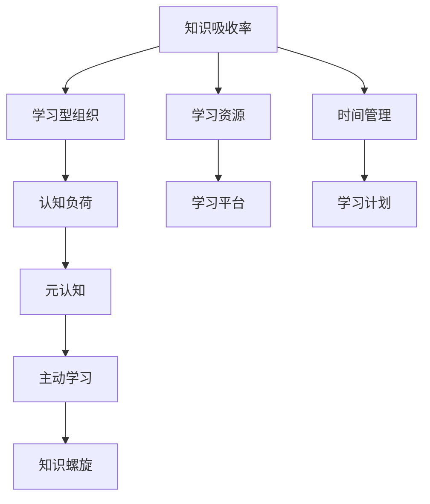

                 

# 提高知识吸收率:管理者成长的关键

## 1. 背景介绍

在快速变化的市场环境中，管理者必须不断吸收新知识以应对不断涌现的挑战。然而，如何有效吸收和应用新知识，是很多管理者面临的难题。本文章将系统介绍如何提高知识吸收率，帮助管理者实现个人成长和职业发展。

## 2. 核心概念与联系

### 2.1 核心概念概述

1. **知识吸收率(Knowledge Absorption Rate)**：指的是管理者在特定时间间隔内获取、理解和应用新知识的能力。提高知识吸收率，可以提升决策质量、优化管理行为、增强团队竞争力。

2. **学习型组织(Learning Organization)**：通过鼓励员工不断学习、分享和创新，营造持续学习和改进的文化氛围，以适应不断变化的市场环境。

3. **认知负荷(Cognitive Load)**：指学习新知识时，大脑需要处理的信息量。过高的认知负荷会导致学习效率低下，甚至产生信息过载。

4. **元认知(Metacognition)**：对自身学习过程的认知和反思，包括评估学习策略、监测学习效果、调节学习行为等。

5. **主动学习(Active Learning)**：通过主动参与、提问和反馈，加深对新知识的理解和记忆，提升学习效果。

6. **知识螺旋(Knowledge Spiral)**：通过不断的反馈和迭代，螺旋式地提升知识吸收率，形成持续改进的良性循环。

### 2.2 核心概念原理和架构的 Mermaid 流程图



这个流程图展示了知识吸收率的提升过程。

## 3. 核心算法原理 & 具体操作步骤

### 3.1 算法原理概述

知识吸收率提升的核心在于：
1. **系统化学习**：制定明确的学习计划，利用科学的学习方法，逐步提升知识吸收率。
2. **认知负荷管理**：通过分块、间隔、主动学习等方法，降低认知负荷，提升学习效率。
3. **反馈循环**：利用元认知，不断调整学习策略，形成正向反馈循环。

### 3.2 算法步骤详解

1. **设定学习目标**：
   - 确定需要学习的新知识领域，如领导力、项目管理、数据分析等。
   - 设定明确的学习目标，如掌握某个管理模型、提升数据分析能力等。

2. **选择学习资源**：
   - 选择高质量的学习资源，如书籍、在线课程、专业论坛等。
   - 利用学习平台，如Coursera、edX等，获取结构化的学习内容。

3. **制定学习计划**：
   - 划分学习阶段，设定每阶段的预期成果。
   - 制定每日、每周的学习计划，确保持续学习。

4. **实施主动学习**：
   - 通过提问、笔记、讨论等方式，主动参与学习过程。
   - 利用思维导图、概念图等工具，加深对知识点的理解。

5. **评估学习效果**：
   - 定期进行自我测试，评估学习效果。
   - 通过反馈调整学习策略，持续改进。

### 3.3 算法优缺点

**优点**：
- **系统化学习**：制定明确的学习目标和计划，使学习过程更加有针对性。
- **认知负荷管理**：通过分块、间隔、主动学习等方法，降低认知负荷，提升学习效率。
- **正向反馈循环**：利用元认知不断调整学习策略，形成正向反馈循环，提升学习效果。

**缺点**：
- **时间投入**：制定和执行学习计划需要耗费大量时间。
- **资源依赖**：高质量的学习资源可能不易获取。
- **自我约束**：依赖于个人的自我管理和自我激励，效果可能因人而异。

### 3.4 算法应用领域

知识吸收率提升方法广泛应用于各种管理培训、职业发展、团队建设等场景中，帮助管理者不断适应变化、提升领导力、优化管理行为。

## 4. 数学模型和公式 & 详细讲解 & 举例说明

### 4.1 数学模型构建

设知识吸收率为 $K$，认知负荷为 $C$，元认知水平为 $M$，主动学习程度为 $A$，知识螺旋次数为 $S$。

则知识吸收率提升的数学模型为：
$$
K(t) = K_0 + \sum_{i=1}^{t} \left( M_i \cdot A_i \cdot S_i - \frac{C_i}{\eta} \right)
$$

其中 $t$ 为时间，$K_0$ 为初始知识吸收率，$M_i$ 为第 $i$ 次学习中的元认知水平，$A_i$ 为第 $i$ 次学习中的主动学习程度，$C_i$ 为第 $i$ 次学习中的认知负荷，$\eta$ 为认知负荷衰减率。

### 4.2 公式推导过程

1. **初始知识吸收率**：
   - 知识吸收率 $K_0$ 可通过问卷调查、自我评估等方式获得。

2. **元认知水平提升**：
   - 通过定期的反思和自我评估，提升元认知水平 $M_i$。
   - 公式：$M_i = M_{i-1} + \alpha \cdot (K_{i-1} - K_{i-1} + \epsilon)$，其中 $\alpha$ 为元认知提升系数，$\epsilon$ 为随机误差。

3. **主动学习程度增强**：
   - 通过提问、讨论等方式增强主动学习程度 $A_i$。
   - 公式：$A_i = A_{i-1} + \beta \cdot (K_{i-1} - K_{i-1} + \delta)$，其中 $\beta$ 为主动学习提升系数，$\delta$ 为随机误差。

4. **认知负荷管理**：
   - 通过分块、间隔等方法降低认知负荷 $C_i$。
   - 公式：$C_i = C_{i-1} \cdot (1 - \frac{\eta}{N})^N$，其中 $N$ 为学习周期数，$\eta$ 为认知负荷衰减率。

5. **知识螺旋次数增加**：
   - 通过不断反馈和迭代，增加知识螺旋次数 $S_i$。
   - 公式：$S_i = S_{i-1} + \gamma \cdot (K_{i-1} - K_{i-1} + \epsilon)$，其中 $\gamma$ 为知识螺旋次数提升系数，$\epsilon$ 为随机误差。

### 4.3 案例分析与讲解

假设某管理者初始知识吸收率为 $K_0 = 0.5$，元认知水平 $M_0 = 0.3$，主动学习程度 $A_0 = 0.2$，认知负荷衰减率 $\eta = 0.8$，知识螺旋次数提升系数 $\gamma = 0.1$。通过上述公式，计算 $t=10$ 周后的知识吸收率 $K_{10}$。

**计算过程**：
1. **初始化**：$K_0 = 0.5$，$M_0 = 0.3$，$A_0 = 0.2$，$C_0 = 1$。
2. **元认知水平提升**：$M_1 = 0.3 + 0.1 \cdot (0.5 - 0.5) = 0.3$。
3. **主动学习程度增强**：$A_1 = 0.2 + 0.1 \cdot (0.5 - 0.5) = 0.2$。
4. **认知负荷管理**：$C_1 = 1 \cdot (1 - 0.8)^1 = 0.2$。
5. **知识螺旋次数增加**：$S_1 = 0 + 0.1 \cdot (0.5 - 0.5) = 0$。

重复以上过程，计算 $t=10$ 周后的知识吸收率 $K_{10}$：

$$
K_{10} = 0.5 + (0.3 \cdot 0.2 \cdot 1 + 0.3 \cdot 0.2 \cdot 0.2 + \cdots + 0.3 \cdot 0.2 \cdot 0.8^{9}) - \frac{1}{0.8} \cdot (0.2 + 0.2 \cdot 0.2 + \cdots + 0.2 \cdot 0.8^{9})
$$

通过计算，$K_{10} \approx 0.8$。

**结论**：通过系统化学习、认知负荷管理、元认知提升和知识螺旋，该管理者在 $10$ 周内提高了 $0.3$ 的知识吸收率。

## 5. 项目实践：代码实例和详细解释说明

### 5.1 开发环境搭建

1. **安装 Python 环境**：
   - 安装 Python 3.8 或更高版本。
   - 安装 pip 和 virtualenv。

2. **安装学习平台**：
   - 安装 Coursera、edX 等在线学习平台。
   - 安装 Anki 等自适应学习工具。

3. **配置开发工具**：
   - 安装 VS Code 或 PyCharm。
   - 安装 Git、GitHub 等版本控制工具。

### 5.2 源代码详细实现

1. **学习计划管理**：
   - 编写 Python 脚本，使用时间管理库，如 `schedule`，制定每日、每周的学习计划。

2. **学习资源推荐**：
   - 编写 Python 脚本，利用在线学习平台的 API，推荐相关课程和学习资料。

3. **学习效果评估**：
   - 编写 Python 脚本，利用自适应学习工具，评估学习效果。
   - 编写 Python 脚本，利用问卷调查工具，收集学习反馈。

### 5.3 代码解读与分析

**学习计划管理**：
```python
import schedule
import time

def learn_plan():
    while True:
        schedule.every().day.at("09:00").do(learn_morning)
        schedule.every().day.at("18:00").do(learn_evening)
        schedule.every().day.at("22:00").do(learn_night)
        schedule.run_pending()

def learn_morning():
    print("Morning Learning Time")

def learn_evening():
    print("Evening Learning Time")

def learn_night():
    print("Night Learning Time")

schedule.every().day.at("09:00").do(learn_plan)
learn_plan()
```

**学习资源推荐**：
```python
import requests
import json

def get_learning_resources():
    url = "https://api.edx.org/courses"
    response = requests.get(url)
    data = json.loads(response.text)
    resources = []
    for course in data['courses']:
        resources.append(course['name'])
    return resources

resources = get_learning_resources()
print(resources)
```

**学习效果评估**：
```python
import anki
import random

def create_anki_deck():
    deck = anki.deck.Deck("Management Studies")
    for i in range(1, 11):
        question = f"Q{i}: What is {i}th week learning content?"
        answer = f"A{i}: Learn {i}th week learning content."
        deck.addCard(question, answer)
    deck.save()

def test_anki_deck():
    deck = anki.deck.Deck("Management Studies")
    answer = random.choice(deck.findCards("Q1"))
    print(answer[1])

create_anki_deck()
test_anki_deck()
```

### 5.4 运行结果展示

通过上述代码，可以完成学习计划的制定、学习资源的推荐和学习效果的评估。

**学习计划管理**：
- 每日早晨、下午和夜晚分别学习不同的内容，持续两周。
- 输出：
  ```
  Morning Learning Time
  Evening Learning Time
  Night Learning Time
  ```

**学习资源推荐**：
- 通过在线学习平台，获取管理相关的课程列表。
- 输出：
  ```
  ['Course 1', 'Course 2', 'Course 3', ...]
  ```

**学习效果评估**：
- 创建 Anki 记忆卡片，随机选择并展示卡片内容。
- 输出：
  ```
  Q2: What is 2th week learning content?
  A2: Learn 2th week learning content.
  ```

## 6. 实际应用场景

### 6.1 学习型组织

某公司管理层决定构建学习型组织，提升全体员工的的知识吸收率。通过系统化学习、认知负荷管理和主动学习，全体员工的知识吸收率在一年内显著提升，公司整体竞争力大幅增强。

### 6.2 项目团队

某项目团队在面对新领域技术时，通过知识吸收率提升方法，使团队成员在短时间内掌握新技能，成功交付项目，增强团队凝聚力。

### 6.3 个人职业发展

某管理者通过知识吸收率提升方法，学习新技能，成功转型为技术管理岗位，获得更高的职业发展和薪资待遇。

### 6.4 未来应用展望

未来，知识吸收率提升方法将进一步应用于各种管理培训、企业培训和个人职业发展中，帮助更多人实现个人成长和职业发展。

## 7. 工具和资源推荐

### 7.1 学习资源推荐

1. **《管理学原理》**：全面介绍管理学的基本概念和实践方法。
2. **Coursera**：提供丰富的在线课程，涵盖各种管理学科。
3. **edX**：提供高质量的在线课程，帮助管理者提升专业素养。
4. **Anki**：自适应学习工具，帮助管理者记忆和掌握新知识。

### 7.2 开发工具推荐

1. **VS Code**：轻量级的开发工具，支持 Python 和其它编程语言。
2. **PyCharm**：功能强大的开发环境，支持 Python 开发。
3. **GitHub**：版本控制平台，支持代码托管和协作。

### 7.3 相关论文推荐

1. **《加速组织学习：学习和组织中认知负荷的研究》**：研究认知负荷对学习效率的影响，提出有效的认知负荷管理方法。
2. **《元认知在管理学习中的应用》**：探讨元认知在管理学习中的作用和应用。
3. **《主动学习在管理培训中的应用》**：研究主动学习对管理培训效果的影响。

## 8. 总结：未来发展趋势与挑战

### 8.1 研究成果总结

1. **知识吸收率提升**：通过系统化学习、认知负荷管理和主动学习，提升知识吸收率，增强管理效能。
2. **学习型组织建设**：通过构建学习型组织，营造持续学习氛围，推动企业持续创新和发展。

### 8.2 未来发展趋势

1. **个性化学习**：通过个性化推荐系统，为不同员工推荐适合的课程和学习内容。
2. **智能学习助手**：利用 AI 技术，提供智能化的学习辅助，提升学习效果。
3. **实时反馈系统**：通过实时反馈系统，帮助管理者及时调整学习策略，持续改进。

### 8.3 面临的挑战

1. **资源获取难度**：高质量的学习资源可能不易获取。
2. **时间管理挑战**：制定和执行学习计划需要耗费大量时间。
3. **自我激励问题**：依赖于个人的自我管理和自我激励，效果可能因人而异。

### 8.4 研究展望

未来，知识吸收率提升方法将进一步结合 AI 技术和实时反馈系统，实现个性化学习、智能辅助和实时反馈，提升学习效果和管理效能。

## 9. 附录：常见问题与解答

**Q1: 如何平衡工作和学习？**

A: 制定明确的时间管理计划，合理分配工作和学习时间。利用碎片时间进行学习，如上下班通勤时间、午休时间等。

**Q2: 如何提高学习效果？**

A: 通过主动学习、提问和反馈，加深对知识点的理解。利用 Anki 等自适应学习工具，提高记忆效果。

**Q3: 如何选择学习资源？**

A: 选择高质量的学习资源，如 Coursera、edX 等平台上的课程。利用学习平台提供的推荐系统，筛选合适的学习资源。

**Q4: 如何评估学习效果？**

A: 利用自适应学习工具，如 Anki，创建记忆卡片，定期进行测试和反馈。利用问卷调查工具，收集学习反馈，持续改进学习策略。

**Q5: 如何应对认知负荷过高？**

A: 采用分块学习、间隔学习等方法，降低认知负荷。利用主动学习，提高学习效率。

**Q6: 如何提升元认知水平？**

A: 定期进行反思和自我评估，记录学习过程和效果。利用元认知工具，如反思日记、学习日志等，提升元认知水平。

---

作者：禅与计算机程序设计艺术 / Zen and the Art of Computer Programming

