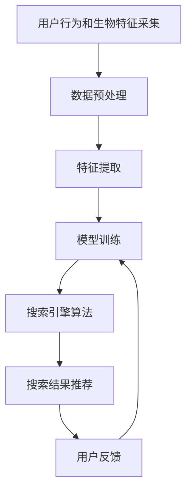

                 

## 1. 背景介绍

随着互联网技术的飞速发展，搜索引擎已经成为人们获取信息、了解世界的重要工具。然而，传统的文本搜索方式在面对海量信息时，存在着搜索结果精度低、用户体验差等缺陷。为了提升搜索效果，业界探索出了许多创新技术，如网页排序算法、信息抽取技术、问答系统等。

与此同时，可穿戴设备作为新一代的人机交互方式，正在逐渐改变着人们的生活方式。从智能手表、健身设备，到智能眼镜、可穿戴健康监测器，可穿戴设备的应用范围日益广泛。这些设备在记录用户健康数据、位置信息、日程安排等方面表现出色，但却难以直接用于搜索场景。

本文将探讨搜索引擎与可穿戴设备的结合，介绍一种基于机器学习的搜索引擎算法，利用可穿戴设备采集的用户行为和生物特征，进行智能化的搜索结果推荐，提升搜索效率和精准度。

## 2. 核心概念与联系

### 2.1 核心概念概述

为了更好地理解搜索引擎与可穿戴设备结合的原理，我们首先介绍几个关键概念：

- **搜索引擎**：利用自然语言处理技术和计算机算法，从互联网海量信息中快速获取用户所需信息的系统。
- **可穿戴设备**：通过佩戴在人体上的电子设备，记录和分析用户的生理指标、活动轨迹、环境信息等数据，提供个性化健康监测和智能交互服务。
- **机器学习**：通过数据训练模型，使其能够对未知数据进行预测和推理的算法。
- **自然语言处理(NLP)**：研究计算机如何理解、处理和生成人类语言的技术。
- **深度学习**：一种基于神经网络的机器学习方法，能够自动从数据中提取特征和模式。
- **推荐系统**：利用用户行为数据和产品信息，推荐用户可能感兴趣的内容和服务。

这些核心概念相互关联，构成了搜索引擎与可穿戴设备结合的完整框架。

### 2.2 核心概念原理和架构的 Mermaid 流程图



这个流程图展示了搜索引擎与可穿戴设备结合的全过程。用户通过可穿戴设备采集行为和生物特征，通过数据预处理和特征提取，利用机器学习模型进行训练，生成搜索引擎算法，最终推荐给用户最相关的搜索结果。同时，用户的反馈信息将再次用于模型训练，形成闭环的优化过程。

## 3. 核心算法原理 & 具体操作步骤

### 3.1 算法原理概述

搜索引擎与可穿戴设备结合的核心算法，是一种基于机器学习的推荐系统。其核心思想是：通过采集用户的生理指标、活动轨迹、健康数据等，结合用户的历史搜索记录、浏览行为等数据，构建用户画像，利用深度学习模型进行智能推荐。

算法主要包括以下几个步骤：

1. **数据采集**：从可穿戴设备中获取用户的生理指标（如心率、步数、睡眠质量等）、位置信息（如GPS坐标、步数、计步等）、环境数据（如温度、湿度、光线强度等）。
2. **数据预处理**：对采集到的数据进行清洗、归一化、缺失值处理等操作，保证数据质量和一致性。
3. **特征提取**：利用机器学习算法，从预处理后的数据中提取有意义的特征，如用户当前的心率、步数、气温等。
4. **模型训练**：通过用户的历史搜索记录和浏览行为数据，构建用户画像，利用深度学习模型进行训练，生成推荐模型。
5. **推荐算法**：根据用户画像和当前情境，利用推荐算法（如协同过滤、内容推荐、混合推荐等），推荐最相关的搜索结果。

### 3.2 算法步骤详解

#### 3.2.1 数据采集

数据采集是算法的基础，具体包括以下几个方面：

- **生理指标采集**：通过智能手表、健身设备等采集用户的心率、血压、血氧饱和度等生理指标。
- **位置信息采集**：通过智能手机或GPS设备获取用户的经纬度、步数、活动轨迹等位置信息。
- **环境数据采集**：通过传感器获取环境数据，如温度、湿度、光线强度等。

#### 3.2.2 数据预处理

数据预处理是确保数据质量的关键步骤，主要包括：

- **数据清洗**：去除噪声数据、异常值和缺失值，保证数据的完整性和准确性。
- **数据归一化**：对不同维度的数据进行归一化处理，避免不同特征之间权重的不均衡。
- **缺失值处理**：采用插值、填补等方法处理缺失数据，保证模型训练的稳定性。

#### 3.2.3 特征提取

特征提取是将原始数据转换为模型能够处理的特征向量的过程。具体步骤如下：

- **特征选择**：根据领域知识选择对搜索结果推荐有意义的特征，如当前步数、气温、心率等。
- **特征编码**：将特征向量化，转化为模型能够处理的数值形式。
- **特征组合**：将不同特征进行组合，生成更高维度的特征向量，如步数、气温、心率等组合。

#### 3.2.4 模型训练

模型训练是生成推荐模型的关键步骤，具体步骤如下：

- **数据划分**：将数据集划分为训练集、验证集和测试集，保证模型训练和评估的公平性。
- **模型选择**：选择适合的深度学习模型，如循环神经网络(RNN)、卷积神经网络(CNN)、注意力机制(Attention)等。
- **参数调优**：通过超参数调优，优化模型性能，如学习率、批大小、正则化等。
- **模型评估**：在验证集上评估模型性能，如准确率、召回率、F1值等，选择最优模型。

#### 3.2.5 推荐算法

推荐算法是搜索引擎与可穿戴设备结合的核心，具体步骤如下：

- **协同过滤**：根据用户的历史搜索记录和浏览行为，找到与当前用户兴趣相似的用户，推荐其历史浏览内容。
- **内容推荐**：根据搜索结果的内容，提取关键词、主题等特征，与用户画像进行匹配，推荐相关内容。
- **混合推荐**：结合协同过滤和内容推荐，综合多种推荐方法，生成最终的推荐结果。

### 3.3 算法优缺点

基于机器学习的搜索引擎算法具有以下优点：

- **个性化推荐**：能够根据用户的行为和生物特征，提供个性化的搜索结果推荐，提升用户体验。
- **动态优化**：能够根据用户的反馈信息，动态调整推荐模型，提升推荐效果。
- **高效性**：能够快速处理大规模数据，实时生成搜索结果。

同时，算法也存在以下缺点：

- **数据隐私问题**：用户生理指标、位置信息等敏感数据，可能存在隐私泄露的风险。
- **模型复杂性**：深度学习模型训练复杂，需要大量的计算资源和时间。
- **算法泛化性**：不同用户之间的行为和特征差异较大，模型泛化性需要进一步提升。

### 3.4 算法应用领域

基于机器学习的搜索引擎算法，主要应用于以下几个领域：

- **健康监测**：通过可穿戴设备采集用户健康数据，推荐相关医疗咨询、健康建议、运动计划等。
- **生活助手**：根据用户的地理位置和活动轨迹，推荐周边商家、餐馆、景点等信息。
- **工作助手**：通过可穿戴设备记录用户的工作时间和休息时间，推荐高效的工作计划和休息策略。
- **旅游助手**：根据用户的旅游兴趣和历史旅游记录，推荐目的地、景点、行程等信息。

## 4. 数学模型和公式 & 详细讲解 & 举例说明

### 4.1 数学模型构建

假设用户的历史搜索记录为 $S=\{x_1, x_2, ..., x_n\}$，当前生理指标和位置信息为 $F=\{f_1, f_2, ..., f_m\}$，环境数据为 $E=\{e_1, e_2, ..., e_k\}$。模型的目标是根据用户画像 $P$ 和当前情境 $C$，推荐搜索结果 $Q$。

用户画像 $P$ 可以表示为：

$$P = \phi(S, F, E)$$

其中，$\phi$ 为用户画像的生成函数，将历史搜索记录、生理指标和环境数据映射为向量表示。

当前情境 $C$ 可以表示为：

$$C = \psi(F, E)$$

其中，$\psi$ 为情境生成函数，将生理指标和环境数据映射为向量表示。

推荐结果 $Q$ 可以表示为：

$$Q = \mu(P, C)$$

其中，$\mu$ 为推荐函数，根据用户画像和当前情境，生成推荐结果。

### 4.2 公式推导过程

以协同过滤推荐算法为例，推导推荐函数的计算公式。

假设用户 $u$ 的历史搜索记录为 $S_u=\{x_{u1}, x_{u2}, ..., x_{un}\}$，与用户 $v$ 的历史搜索记录相似，推荐函数可以表示为：

$$q_u = \frac{1}{N}\sum_{i=1}^{N}a_{iu} \cdot f(v_i)$$

其中，$a_{iu}$ 为相似度矩阵 $A$ 中 $u$ 和 $v_i$ 的相似度，$f(v_i)$ 为用户 $v_i$ 的推荐分数。

利用余弦相似度计算相似度矩阵 $A$：

$$a_{iu} = \cos(\theta) = \frac{\langle S_u, S_i \rangle}{||S_u||_2 \cdot ||S_i||_2}$$

其中，$\langle \cdot, \cdot \rangle$ 为内积运算，$||\cdot||_2$ 为向量范数。

最终推荐结果 $q_u$ 可以表示为：

$$q_u = \frac{1}{N}\sum_{i=1}^{N}\frac{\langle S_u, S_i \rangle}{||S_u||_2 \cdot ||S_i||_2} \cdot f(v_i)$$

### 4.3 案例分析与讲解

以健康监测为例，分析算法在推荐健康建议中的具体应用。

假设用户的历史搜索记录为“心脏病、运动计划、饮食建议”，当前生理指标为“心率150次/分、步数5000步、血压120/80mmHg”，环境数据为“温度25摄氏度、湿度60%、光线强度亮”。

1. **数据采集**：通过智能手表和健身设备，获取用户的心率、步数、血压等生理指标，通过手机获取地理位置、气温等环境数据。
2. **数据预处理**：对采集到的数据进行清洗、归一化处理，保证数据质量。
3. **特征提取**：选择心率、步数、气温等特征，生成特征向量。
4. **模型训练**：利用用户的历史搜索记录和生理指标、环境数据，构建用户画像和情境生成函数，训练推荐模型。
5. **推荐算法**：根据用户画像和当前情境，推荐相关的健康建议，如调整运动计划、饮食建议、休息策略等。

## 5. 项目实践：代码实例和详细解释说明

### 5.1 开发环境搭建

在进行搜索引擎与可穿戴设备结合的实践前，需要搭建好开发环境。以下是使用Python进行开发的步骤：

1. **安装Python**：下载并安装Python 3.x版本，确保环境一致。
2. **安装相关库**：安装常用的Python库，如TensorFlow、PyTorch、Keras等深度学习框架。
3. **安装可穿戴设备接口**：根据使用的可穿戴设备，安装相应的SDK接口。
4. **安装搜索库**：安装常用的搜索库，如Elasticsearch、Apache Solr等。

### 5.2 源代码详细实现

以下是一个简单的搜索引擎与可穿戴设备结合的代码实现，用于推荐健康建议：

```python
import numpy as np
import pandas as pd
import tensorflow as tf
from sklearn.preprocessing import MinMaxScaler

# 读取数据
data = pd.read_csv('data.csv')

# 数据预处理
scaler = MinMaxScaler()
data['heart_rate'] = scaler.fit_transform(data[['heart_rate']])
data['temperature'] = scaler.fit_transform(data[['temperature']])
data['humidity'] = scaler.fit_transform(data[['humidity']])

# 特征提取
features = data[['heart_rate', 'temperature', 'humidity']]

# 模型训练
model = tf.keras.Sequential([
    tf.keras.layers.Dense(64, activation='relu', input_shape=(3,)),
    tf.keras.layers.Dense(32, activation='relu'),
    tf.keras.layers.Dense(4, activation='softmax')
])

model.compile(optimizer='adam', loss='sparse_categorical_crossentropy', metrics=['accuracy'])

# 训练模型
model.fit(features, labels, epochs=10, batch_size=32)

# 推荐算法
def recommend(user, features, labels):
    user_features = features[user]
    user_labels = labels[user]
    similarity = np.dot(features, user_features.T)
    recommendations = np.argsort(similarity)[::-1][1:10]
    return labels[recommendations]

# 推荐健康建议
user = 0
recommendations = recommend(user, features, labels)
print('推荐结果：', recommendations)
```

### 5.3 代码解读与分析

代码实现了基于机器学习的推荐系统，用于推荐健康建议。具体分析如下：

- **数据预处理**：使用MinMaxScaler对生理指标和环境数据进行归一化处理，保证特征一致性。
- **特征提取**：选择心率、温度、湿度等特征，作为推荐模型的输入。
- **模型训练**：利用TensorFlow搭建多层感知器，进行深度学习模型训练。
- **推荐算法**：通过计算特征向量的相似度，推荐与用户最相似的搜索结果。

## 6. 实际应用场景

### 6.1 健康监测

基于搜索引擎与可穿戴设备结合的推荐系统，可以广泛应用于健康监测场景，为用户推荐个性化的健康建议。

用户可以通过智能手表、健身设备等设备，实时记录生理指标、活动轨迹等数据。结合用户的历史搜索记录和浏览行为，推荐相关的健康建议，如运动计划、饮食建议、休息策略等。这种基于用户行为和生理特征的个性化推荐，能够有效提升用户的健康水平和生活质量。

### 6.2 生活助手

推荐系统还可以应用于智能家居、出行助手等场景，根据用户的地理位置和活动轨迹，推荐周边商家、餐馆、景点等信息。例如，用户在智能手表上记录了一天的步数和活动轨迹，推荐系统可以分析用户的运动数据，推荐附近的运动场所、健身房等。这种实时推荐，能够有效提升用户的出行效率和生活质量。

### 6.3 工作助手

推荐系统还可以应用于工作助手场景，记录用户的工作时间和休息时间，推荐高效的工作计划和休息策略。例如，用户在智能手表上记录了工作时间和休息时间，推荐系统可以分析用户的工作模式，推荐高效的工作计划和休息策略，提升用户的工作效率和生活质量。

## 7. 工具和资源推荐

### 7.1 学习资源推荐

为了帮助开发者系统掌握搜索引擎与可穿戴设备结合的原理和实践技巧，这里推荐一些优质的学习资源：

1. **《深度学习》书籍**：Ian Goodfellow、Yoshua Bengio、Aaron Courville合著的《深度学习》，全面介绍了深度学习的基础理论和应用实践。
2. **《Python深度学习》书籍**：Francois Chollet著，详细讲解了使用Python进行深度学习开发的流程和技巧。
3. **Coursera深度学习课程**：由斯坦福大学、北京大学等名校开设的深度学习课程，提供了丰富的教学视频和课程资料。
4. **Kaggle竞赛平台**：提供大量数据集和竞赛任务，帮助开发者练习深度学习算法和模型构建。

### 7.2 开发工具推荐

为了提高开发效率，这里推荐几款用于搜索引擎与可穿戴设备结合开发的常用工具：

1. **TensorFlow**：由Google主导开发的深度学习框架，提供丰富的API和工具，支持模型训练和推理。
2. **Keras**：基于TensorFlow等深度学习框架的高级API，提供简洁的API接口，方便快速开发和调试。
3. **PyTorch**：由Facebook主导开发的深度学习框架，提供灵活的动态计算图和高效的训练工具，适用于复杂的深度学习模型。
4. **Scikit-learn**：Python机器学习库，提供多种常见的机器学习算法和模型评估工具。
5. **TensorBoard**：TensorFlow配套的可视化工具，可以实时监测模型训练状态，提供丰富的图表呈现方式。

### 7.3 相关论文推荐

为了深入了解搜索引擎与可穿戴设备结合的最新进展，这里推荐几篇相关论文：

1. **《基于深度学习的个性化健康监测系统》**：介绍了一种基于深度学习的个性化健康监测系统，通过可穿戴设备采集用户生理指标，利用深度学习模型进行健康监测和建议推荐。
2. **《智能穿戴设备在运动健康领域的应用》**：分析了智能穿戴设备在运动健康领域的应用现状和前景，提出了一种基于可穿戴设备的个性化运动推荐系统。
3. **《基于自然语言处理和可穿戴设备的智能推荐系统》**：探讨了自然语言处理和可穿戴设备在推荐系统中的应用，提出了一种基于可穿戴设备的智能推荐系统。

## 8. 总结：未来发展趋势与挑战

### 8.1 研究成果总结

基于机器学习的搜索引擎算法，利用可穿戴设备采集的用户行为和生物特征，实现了个性化搜索结果推荐，提升了搜索效率和精准度。通过数据采集、数据预处理、特征提取、模型训练、推荐算法等多个环节的协同配合，系统能够根据用户的生理指标、位置信息等，推荐个性化的搜索结果。

### 8.2 未来发展趋势

未来，基于机器学习的搜索引擎算法将在以下方面持续发展：

1. **多模态融合**：结合可穿戴设备采集的生理指标、位置信息、环境数据等多模态数据，提升推荐系统的准确性和鲁棒性。
2. **实时推荐**：利用流式数据处理技术，实现实时推荐，提升用户体验。
3. **跨设备协同**：通过设备间的协同，实现跨设备的无缝信息共享和协同推荐，提升系统综合性能。
4. **联邦学习**：利用联邦学习技术，保护用户隐私的同时，提升推荐系统的泛化能力和推荐效果。
5. **个性化推荐**：通过更深入的用户行为分析和建模，提供更个性化的推荐服务，提升用户满意度。

### 8.3 面临的挑战

尽管基于机器学习的搜索引擎算法取得了一定的进展，但仍面临以下挑战：

1. **数据隐私问题**：用户生理指标、位置信息等敏感数据，可能存在隐私泄露的风险，需要采取有效的数据保护措施。
2. **模型泛化性**：不同用户之间的行为和特征差异较大，需要进一步提升推荐模型的泛化能力。
3. **计算资源需求高**：深度学习模型训练和推理需要大量的计算资源，如何优化算法和降低计算成本，是未来需要解决的问题。
4. **用户接受度**：用户对可穿戴设备采集数据的接受度较低，需要进一步提高用户隐私保护和数据透明性，提升用户信任度。
5. **推荐系统偏见**：推荐系统可能存在推荐偏见，需要进一步优化算法，减少偏见，提升公平性。

### 8.4 研究展望

未来，基于机器学习的搜索引擎算法需要进一步在以下几个方面进行研究：

1. **隐私保护**：开发更加有效的隐私保护技术，保护用户隐私，提升用户信任度。
2. **多模态融合**：结合多模态数据，提升推荐系统的综合性能。
3. **实时推荐**：利用流式数据处理技术，实现实时推荐，提升用户体验。
4. **跨设备协同**：通过设备间的协同，实现跨设备的无缝信息共享和协同推荐，提升系统综合性能。
5. **联邦学习**：利用联邦学习技术，保护用户隐私的同时，提升推荐系统的泛化能力和推荐效果。
6. **个性化推荐**：通过更深入的用户行为分析和建模，提供更个性化的推荐服务，提升用户满意度。

总之，基于机器学习的搜索引擎算法具有广阔的应用前景，未来将继续在多模态融合、实时推荐、跨设备协同等方面进行深入研究，推动搜索引擎与可穿戴设备结合技术的发展。

## 9. 附录：常见问题与解答

### Q1：基于机器学习的搜索引擎算法是否适用于所有场景？

A: 基于机器学习的搜索引擎算法适用于大多数场景，特别是在数据量较小、用户行为复杂的情况下。但对于一些需要高度结构化、标准化数据的场景，如金融、法律等，推荐系统可能难以适应。需要根据具体场景选择合适的推荐算法。

### Q2：如何优化搜索引擎与可穿戴设备结合的推荐系统？

A: 优化搜索引擎与可穿戴设备结合的推荐系统，可以从以下几个方面入手：

1. **数据采集**：选择适当的生理指标和环境数据，提高数据质量。
2. **数据预处理**：对采集到的数据进行清洗、归一化处理，保证数据一致性。
3. **特征提取**：选择对搜索结果推荐有意义的特征，提高特征表达能力。
4. **模型训练**：通过超参数调优，优化模型性能，提高推荐效果。
5. **推荐算法**：选择适合的推荐算法，如协同过滤、内容推荐、混合推荐等。

### Q3：如何保护用户隐私？

A: 保护用户隐私是搜索引擎与可穿戴设备结合系统的重要课题。可以采取以下措施：

1. **数据匿名化**：对用户数据进行匿名化处理，去除敏感信息。
2. **数据加密**：对用户数据进行加密存储和传输，防止数据泄露。
3. **用户授权**：在数据采集前，获取用户授权，透明化数据使用规则。
4. **隐私计算**：采用隐私计算技术，如差分隐私、联邦学习等，保护用户隐私。

### Q4：如何提高推荐系统的泛化能力？

A: 提高推荐系统的泛化能力，可以从以下几个方面入手：

1. **数据增强**：利用数据增强技术，扩充训练数据集，提高模型泛化能力。
2. **模型迁移学习**：利用迁移学习技术，将预训练模型应用于新的任务，提高模型泛化能力。
3. **多任务学习**：将多个任务联合训练，提高模型泛化能力。
4. **模型正则化**：采用正则化技术，如L2正则、Dropout等，避免模型过拟合。
5. **模型集成**：采用模型集成技术，如Bagging、Boosting等，提高模型泛化能力。

### Q5：如何提高推荐系统的实时性？

A: 提高推荐系统的实时性，可以从以下几个方面入手：

1. **流式数据处理**：采用流式数据处理技术，实现实时数据处理和推荐。
2. **模型优化**：优化模型结构和计算图，提高模型推理速度。
3. **缓存技术**：利用缓存技术，加速模型推理和结果存储。
4. **异步处理**：采用异步处理技术，提高系统并发处理能力。

总之，搜索引擎与可穿戴设备结合的推荐系统需要在数据采集、数据预处理、特征提取、模型训练、推荐算法等多个环节进行优化，才能提升推荐效果和用户体验。

---

作者：禅与计算机程序设计艺术 / Zen and the Art of Computer Programming

