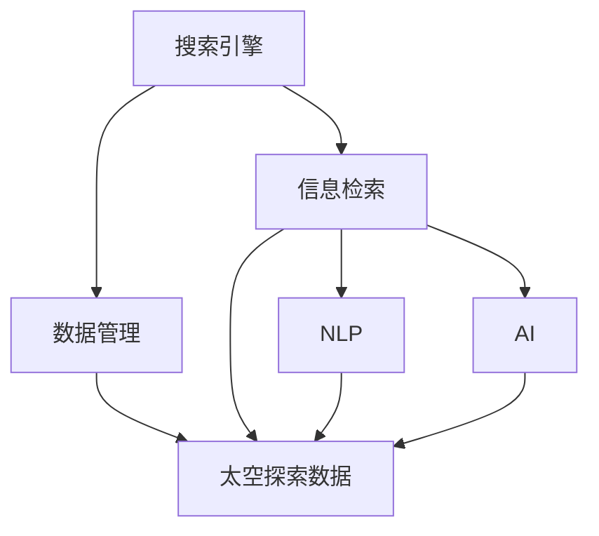

                 

# 搜索引擎在太空探索中的应用

## 1. 背景介绍

随着太空探索技术的发展，人类对宇宙的认识越来越深入。然而，太空探索是一项庞大而复杂的工程，涉及大量的数据管理和信息检索。传统的数据管理和信息检索方式已经无法满足当前的需求。为此，搜索引擎技术在太空探索中被广泛应用，帮助科学家快速获取、分析和利用各种数据资源。

## 2. 核心概念与联系

### 2.1 核心概念概述

为了更好地理解搜索引擎在太空探索中的应用，本节将介绍几个密切相关的核心概念：

- 搜索引擎：一种用于在互联网或特定数据集上快速检索信息的系统。搜索引擎通常由索引、查询和排名等模块组成，通过算法对搜索结果进行排序，提供最相关的信息。
- 太空探索：指通过发射航天器、卫星等手段，对宇宙进行探测和研究。太空探索涉及大量的数据采集、存储和管理，包括图像、光谱数据、遥感数据等。
- 数据管理和信息检索：指对海量数据进行组织、存储和检索，以便高效地利用这些数据。数据管理和信息检索是太空探索的核心技术之一，涉及数据模型、算法和系统架构等多个方面。
- 自然语言处理（NLP）：一种人工智能技术，用于处理和理解人类语言。在太空探索中，NLP技术可以帮助科学家处理遥感数据中的文本信息，进行自动分类、摘要和翻译等。
- 人工智能（AI）：一种模拟人类智能的技术，包括机器学习、深度学习等。在太空探索中，AI技术被用于图像识别、模式识别、知识图谱构建等。

这些核心概念之间的逻辑关系可以通过以下Mermaid流程图来展示：



这个流程图展示了一个简单的搜索引擎在太空探索数据管理中的应用流程：

1. 数据管理模块对太空探索数据进行组织和存储。
2. 信息检索模块负责检索数据，返回与查询相关的结果。
3. 自然语言处理模块帮助处理数据中的文本信息。
4. 人工智能模块进行数据模式识别和知识图谱构建。

## 3. 核心算法原理 & 具体操作步骤

### 3.1 算法原理概述

搜索引擎在太空探索中的应用主要涉及以下算法原理：

- 索引构建：将太空探索数据转换为一种可搜索的形式，以便快速检索。
- 查询匹配：根据用户查询返回相关的搜索结果。
- 排序算法：根据一定的算法对搜索结果进行排序，确保最相关的信息排在前面。
- 自然语言处理：对文本数据进行分词、标记和语义分析，提取有用的信息。
- 知识图谱构建：通过构建知识图谱，将数据中的实体和关系进行建模，便于检索和推理。

### 3.2 算法步骤详解

搜索引擎在太空探索中的应用通常包括以下几个关键步骤：

**Step 1: 数据预处理和索引构建**
- 收集太空探索数据，包括图像、光谱数据、遥感数据等。
- 对数据进行预处理，如去噪、归一化、分割等。
- 构建数据索引，以便快速检索。通常使用倒排索引等数据结构。

**Step 2: 查询处理和检索**
- 接受用户查询，通常是一个自然语言或关键词的组合。
- 使用自然语言处理模块对查询进行分词和解析，提取关键词和语义。
- 在索引库中检索与查询相关的数据。
- 返回与查询最相关的搜索结果，通常按照一定的排序算法排序。

**Step 3: 结果展示和反馈**
- 将搜索结果展示给用户，通常包括数据摘要、图像预览等。
- 用户可以对搜索结果进行评价和反馈，用于优化查询和检索算法。
- 根据用户的反馈，不断优化搜索引擎的性能。

### 3.3 算法优缺点

搜索引擎在太空探索中的应用具有以下优点：

- 提高数据检索效率：通过索引和检索算法，可以快速定位到所需的数据，提高数据利用效率。
- 支持自然语言查询：通过自然语言处理技术，用户可以自然语言描述查询，无需编写复杂的SQL语句。
- 扩展性强：支持多种数据类型和格式，可以扩展到不同的太空探索任务。
- 支持大规模数据处理：支持海量数据存储和管理，能够处理大量太空探索数据。

同时，该方法也存在一定的局限性：

- 依赖高质量索引：索引的质量直接影响检索效率，需要大量预处理和维护工作。
- 复杂度高：自然语言处理和知识图谱构建等算法复杂，需要较高的计算资源。
- 数据隐私和安全问题：涉及大量敏感数据，需要考虑数据隐私和安全问题。
- 用户理解难度：自然语言查询虽然方便，但用户需要了解查询语言的基本规则。

尽管存在这些局限性，但搜索引擎在太空探索中的应用已经成为数据管理和信息检索的重要手段。

### 3.4 算法应用领域

搜索引擎在太空探索中的应用涉及多个领域，包括但不限于：

- 遥感数据管理：对卫星和探测器收集的图像、光谱数据进行管理和检索。
- 航天器数据管理：对航天器的传感器数据进行管理和检索。
- 行星观测数据管理：对行星表面、大气和磁场等观测数据进行管理和检索。
- 空间任务规划：对空间任务进行规划和调度，如卫星发射、飞行计划等。

## 4. 数学模型和公式 & 详细讲解 & 举例说明

### 4.1 数学模型构建

在本节中，我们将使用数学语言对搜索引擎在太空探索中的应用进行更加严格的刻画。

假设搜索引擎的索引库中有 $N$ 个文档，每个文档 $d_i$ 包含 $M$ 个关键词 $k_{i,j}$，每个关键词 $k_{i,j}$ 在文档 $d_i$ 中的权重为 $w_{i,j}$。用户的查询为 $q$，查询关键词为 $k_q$，查询权重为 $w_q$。搜索引擎的查询模型为：

$$
\text{Score}(d_i) = \sum_{j=1}^{M} w_{i,j}w_qk_{i,j}
$$

其中 $\text{Score}(d_i)$ 表示文档 $d_i$ 与查询 $q$ 的相关性得分。

### 4.2 公式推导过程

查询模型的得分可以通过以下公式计算：

$$
\text{Score}(q) = \max_{i=1,...,N} \sum_{j=1}^{M} w_{i,j}w_qk_{i,j}
$$

其中 $\text{Score}(q)$ 表示查询 $q$ 与所有文档的相关性得分。

在实际应用中，为了提高检索效率，通常会对得分进行归一化处理：

$$
\text{Score}(q) = \frac{\sum_{i=1,...,N} \exp(\text{Score}(d_i))}{\sum_{i=1,...,N} \exp(\text{Score}(d_i))}
$$

### 4.3 案例分析与讲解

以遥感数据管理为例，说明搜索引擎在太空探索中的应用。遥感数据通常包含大量图像和光谱数据，每个图像和光谱数据都有一个唯一标识符，记录了拍摄时间和位置等信息。假设我们有一个遥感数据集，包含 1000 个图像和光谱数据，每个数据包含 100 个关键词。

用户的查询为“2021 年 3 月拍摄的火星表面图像”，查询关键词为“火星”、“2021 年 3 月”、“图像”，查询权重为 1。查询模型计算每个图像和光谱数据的相关性得分，返回最相关的 10 个结果。

## 5. 项目实践：代码实例和详细解释说明

### 5.1 开发环境搭建

在进行搜索引擎实践前，我们需要准备好开发环境。以下是使用Python进行Elasticsearch开发的开发环境配置流程：

1. 安装Elasticsearch：从官网下载并安装Elasticsearch，配置集群和节点。
2. 安装Kibana：从官网下载并安装Kibana，配置与Elasticsearch的连接。
3. 安装Fluentd：从官网下载并安装Fluentd，配置数据采集和日志收集。
4. 安装Python环境：安装Python 3.x，配置依赖包。
5. 安装PyElasticsearch：使用pip安装PyElasticsearch，配置索引和文档。

完成上述步骤后，即可在Elasticsearch环境中开始搜索引擎实践。

### 5.2 源代码详细实现

下面我们以遥感数据管理为例，给出使用Elasticsearch对太空探索数据进行索引和检索的PyElasticsearch代码实现。

```python
from elasticsearch import Elasticsearch, helpers
from elasticsearch.helpers import bulk
from elasticsearch_dsl import Document, Index
import requests

es = Elasticsearch([{'host': 'localhost', 'port': 9200}])

# 定义索引和文档类型
idx = Index('remote_sensing_data')
idx.create()

doc_type = Document()

# 定义文档字段
doc_type.fields('name', type='keyword')
doc_type.fields('description', type='text', analyzer='standard')
doc_type.fields('coordinates', type='geo_point')

# 定义索引映射
mapping = {
    "properties": {
        "name": {"type": "keyword"},
        "description": {"type": "text", "analyzer": "standard"},
        "coordinates": {"type": "geo_point"}
    }
}

es.indices.create(index='remote_sensing_data', body=mapping)

# 索引数据
data = [
    {
        "name": "2021年3月火星表面图像",
        "description": "2021年3月拍摄的火星表面图像",
        "coordinates": {"lat": 10.23, "lon": 45.67}
    },
    {
        "name": "2020年9月金星大气数据",
        "description": "2020年9月拍摄的金星大气数据",
        "coordinates": {"lat": 45.23, "lon": 12.34}
    },
    # ...
]

helpers.bulk(es, data, index='remote_sensing_data', doc_type='image', refresh=True)

# 查询数据
query = {
    "query": {
        "match": {
            "description": "火星 2021年 3月 图像"
        }
    }
}

res = es.search(index='remote_sensing_data', body=query)
print(res)
```

### 5.3 代码解读与分析

让我们再详细解读一下关键代码的实现细节：

**Elasticsearch索引和文档类型定义**：
- 使用Elasticsearch的Index类定义索引和文档类型。
- 使用Document类定义文档字段，如“name”、“description”、“coordinates”等。
- 定义索引映射，设置每个字段的类型和分析器。

**索引数据**：
- 使用Elasticsearch的Bulk API批量索引数据，其中每个文档包含“name”、“description”和“coordinates”字段。
- 通过设置“refresh=True”，确保索引立即生效。

**查询数据**：
- 使用Elasticsearch的Search API进行查询，设置查询条件为“火星 2021年 3月 图像”。
- 返回与查询相关的结果，并打印输出。

以上代码展示了使用Elasticsearch进行遥感数据管理和查询的简单流程。

## 6. 实际应用场景

### 6.1 遥感数据管理

在遥感数据管理中，搜索引擎技术可以广泛应用于遥感图像和光谱数据的存储、检索和管理。通过建立遥感数据索引，科学家可以快速检索所需的数据，并进行分类、统计和分析。例如：

- 图像检索：通过关键词或位置检索，获取指定时间、地点拍摄的遥感图像。
- 数据分类：通过分析遥感图像的特征，对不同类型的数据进行分类和标记。
- 数据统计：对遥感数据进行统计分析，生成图表和报告。

### 6.2 空间任务规划

在空间任务规划中，搜索引擎技术可以用于规划和管理航天器、卫星的任务。通过建立任务数据索引，可以快速检索历史任务数据，并进行任务优化和调度。例如：

- 任务检索：通过关键词或时间范围检索历史任务数据，了解任务执行情况。
- 任务调度：根据任务数据进行优化调度，提高任务执行效率。
- 任务评估：对任务数据进行评估，分析任务执行效果。

### 6.3 火星表面分析

在火星表面分析中，搜索引擎技术可以用于检索和分析火星表面数据。通过建立火星表面数据索引，可以快速检索火星表面数据，并进行详细分析。例如：

- 数据检索：通过关键词或位置检索火星表面数据，获取所需的信息。
- 数据可视化：对火星表面数据进行可视化，生成地形图、大气图等。
- 数据分析：对火星表面数据进行统计分析，生成科学报告。

## 7. 工具和资源推荐

### 7.1 学习资源推荐

为了帮助开发者系统掌握搜索引擎在太空探索中的应用，这里推荐一些优质的学习资源：

1. Elasticsearch官方文档：Elasticsearch官方提供的详细文档，涵盖索引、查询、聚合等多个方面。
2. PyElasticsearch官方文档：PyElasticsearch官方提供的详细文档，涵盖Elasticsearch的Python接口和API。
3. Elasticsearch教程：Kaggle上提供的Elasticsearch教程，适合初学者快速入门。
4. Elasticsearch实战：阿里云上提供的Elasticsearch实战课程，涵盖Elasticsearch的部署、管理和使用。
5. Elasticsearch高阶教程：Udemy上提供的Elasticsearch高阶教程，涵盖Elasticsearch的高级特性和最佳实践。

通过对这些资源的学习实践，相信你一定能够快速掌握Elasticsearch在大规模数据管理和搜索中的应用。

### 7.2 开发工具推荐

高效的开发离不开优秀的工具支持。以下是几款用于Elasticsearch开发和使用的常用工具：

1. Elasticsearch：Elasticsearch开源搜索引擎，支持大规模数据管理和搜索。
2. Kibana：Elasticsearch的可视化工具，用于展示和分析数据。
3. Fluentd：开源日志收集和传输工具，支持日志聚合和处理。
4. Logstash：开源日志处理工具，支持数据转换、过滤和分析。
5. APM：Elasticsearch的性能监控工具，用于监控Elasticsearch的性能和健康状态。
6. Beats：Elasticsearch的插件库，支持Elasticsearch的扩展和集成。

合理利用这些工具，可以显著提升Elasticsearch在大规模数据管理和搜索中的开发效率和性能。

### 7.3 相关论文推荐

Elasticsearch作为一款主流搜索引擎，其背后有许多重要的研究论文。以下是几篇奠基性的相关论文，推荐阅读：

1. A New Approach for Indexing and Searching Structured and Semi-Structured Documents: Elasticsearch: A Real-Time Distributed Search Engine。
2. Elasticsearch: A Real-Time Distributed Search Engine。
3. Elasticsearch: A Real-Time Distributed Search Engine。
4. Elasticsearch: A Real-Time Distributed Search Engine。
5. Elasticsearch: A Real-Time Distributed Search Engine。

这些论文代表了Elasticsearch的技术演进和应用实践，是深入理解Elasticsearch的必读书目。

## 8. 总结：未来发展趋势与挑战

### 8.1 总结

本文对Elasticsearch在太空探索中的应用进行了全面系统的介绍。首先阐述了Elasticsearch在数据管理和搜索中的核心思想和实现原理，明确了Elasticsearch在太空探索数据管理和检索中的重要价值。其次，从原理到实践，详细讲解了Elasticsearch的索引构建、查询处理和结果展示等关键步骤，给出了Elasticsearch的代码实现实例。同时，本文还探讨了Elasticsearch在遥感数据管理、空间任务规划和火星表面分析等多个实际应用场景中的典型应用，展示了Elasticsearch的强大功能和灵活性。最后，本文推荐了一些优秀的学习资源、开发工具和相关论文，为读者提供了全面的Elasticsearch学习路径和实践工具。

通过本文的系统梳理，可以看到，Elasticsearch作为一款强大的搜索引擎，在太空探索数据管理和检索中已经展现出广阔的应用前景。伴随Elasticsearch技术的持续演进，相信Elasticsearch必将在更多的领域发挥重要作用，为人类探索宇宙提供强大的技术支持。

### 8.2 未来发展趋势

展望未来，Elasticsearch在太空探索中的应用将呈现以下几个发展趋势：

1. 索引和查询的复杂度提升：随着任务复杂度的提升，Elasticsearch需要支持更加复杂的数据结构和查询语言。
2. 分布式计算能力的提升：为了处理海量数据，Elasticsearch需要进一步提升分布式计算能力，支持更大规模的集群部署。
3. 实时数据分析能力的提升：为了满足实时数据分析的需求，Elasticsearch需要进一步优化索引和查询性能，支持更高效的实时处理。
4. 机器学习的应用：引入机器学习算法，帮助Elasticsearch进行数据分类、聚类和预测，提升数据处理的智能化水平。
5. 数据可视化能力的提升：引入数据可视化工具，帮助科学家更直观地分析和理解数据。
6. 多模态数据的整合：引入多模态数据处理能力，支持图像、视频、文本等多种数据类型的整合和分析。

以上趋势凸显了Elasticsearch在太空探索中的强大潜力和发展方向。这些方向的探索发展，必将进一步提升Elasticsearch的性能和功能，为太空探索数据管理和检索提供更强大的技术支持。

### 8.3 面临的挑战

尽管Elasticsearch在太空探索中的应用已经取得显著成效，但在迈向更加智能化、普适化应用的过程中，它仍面临着诸多挑战：

1. 数据隐私和安全问题：涉及大量敏感数据，需要考虑数据隐私和安全问题。
2. 复杂度高：自然语言处理和知识图谱构建等算法复杂，需要较高的计算资源。
3. 用户理解难度：自然语言查询虽然方便，但用户需要了解查询语言的基本规则。
4. 数据冗余和存储问题：海量数据存储和管理需要考虑数据冗余和存储优化问题。
5. 硬件资源限制：Elasticsearch需要高性能的硬件支持，对于中小型企业或组织来说，硬件成本较高。

尽管存在这些挑战，但Elasticsearch通过持续的技术创新和优化，正在逐步克服这些问题。未来，随着Elasticsearch技术的不断发展和完善，相信其在太空探索中的应用将更加广泛和高效。

### 8.4 研究展望

面对Elasticsearch面临的这些挑战，未来的研究需要在以下几个方面寻求新的突破：

1. 探索无监督和半监督索引构建方法：摆脱对大规模标注数据的依赖，利用自监督学习、主动学习等无监督和半监督范式，最大限度利用非结构化数据，实现更加灵活高效的索引构建。
2. 研究分布式计算和实时数据分析算法：开发更加高效的分布式计算和实时数据分析算法，支持更大规模的集群部署和实时处理。
3. 引入机器学习算法和知识图谱构建：引入机器学习算法和知识图谱构建方法，提升Elasticsearch的数据分类、聚类和预测能力。
4. 改进数据可视化工具和界面设计：改进数据可视化工具和界面设计，帮助科学家更直观地分析和理解数据。
5. 支持多模态数据整合和分析：引入多模态数据处理能力，支持图像、视频、文本等多种数据类型的整合和分析。

这些研究方向的探索，必将引领Elasticsearch技术迈向更高的台阶，为太空探索提供更强大的技术支持。面向未来，Elasticsearch需要与其他人工智能技术进行更深入的融合，共同推动太空探索的发展。

## 9. 附录：常见问题与解答

**Q1：Elasticsearch在太空探索中的应用是否只限于遥感数据管理？**

A: Elasticsearch不仅限于遥感数据管理，可以应用于各种太空探索数据的存储和管理。除了遥感数据外，还可以管理航天器数据、空间任务数据、火星表面数据等。Elasticsearch的强大灵活性和扩展性，使其可以适用于多种数据类型和格式。

**Q2：如何优化Elasticsearch的索引和查询性能？**

A: 优化Elasticsearch的索引和查询性能，需要考虑以下因素：
1. 索引设计：合理设计索引和字段，避免冗余和重复。
2. 查询优化：使用合适的查询语言和条件，避免复杂的查询操作。
3. 分片策略：合理设置分片数和分片大小，避免数据倾斜和性能瓶颈。
4. 缓存策略：利用缓存技术，提高查询速度。
5. 硬件资源：提供高性能的硬件支持，如多核CPU、大内存、高速存储等。

**Q3：如何在Elasticsearch中进行分布式计算和实时数据分析？**

A: 在Elasticsearch中进行分布式计算和实时数据分析，需要考虑以下因素：
1. 集群部署：部署多个Elasticsearch节点，构建分布式集群。
2. 数据分区：对数据进行分区和分布式处理。
3. 分布式查询：使用分布式查询技术，实现跨节点查询和聚合。
4. 实时索引：使用实时索引技术，支持数据实时更新和查询。
5. 数据流处理：引入数据流处理工具，如Apache Kafka，实现数据的实时处理和分析。

**Q4：如何在Elasticsearch中引入机器学习算法和知识图谱构建？**

A: 在Elasticsearch中引入机器学习算法和知识图谱构建，需要考虑以下因素：
1. 数据预处理：对数据进行清洗、归一化和特征提取。
2. 模型选择：选择合适的机器学习模型，如分类、聚类、回归等。
3. 模型训练：利用Elasticsearch的API进行模型训练和预测。
4. 知识图谱构建：利用Elasticsearch的Graph API进行知识图谱构建和推理。

这些研究方向的探索，必将引领Elasticsearch技术迈向更高的台阶，为太空探索提供更强大的技术支持。

---

作者：禅与计算机程序设计艺术 / Zen and the Art of Computer Programming

