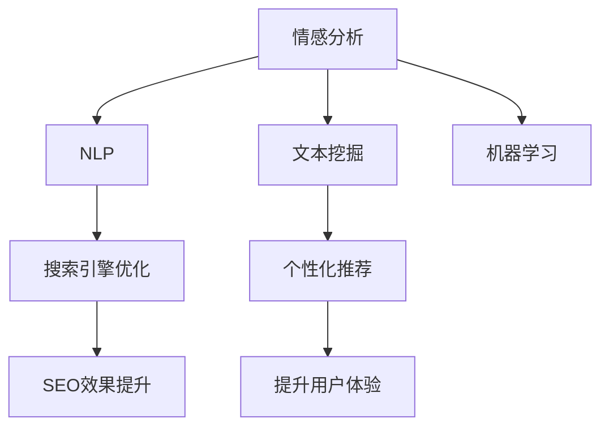

                 

# 搜索引擎的情感计算应用

> 关键词：搜索引擎, 情感分析, 文本挖掘, 自然语言处理(NLP), 人工智能, 机器学习

## 1. 背景介绍

### 1.1 问题由来

在现代社会中，信息爆炸和海量数据使得我们获取所需内容变得更加困难。搜索引擎作为信息检索的重要工具，旨在帮助用户在海量文本中快速定位到相关结果。然而，传统搜索引擎往往只关注文本内容的关键词匹配，忽略了用户对于内容的情感态度，无法有效理解用户需求和反馈，进而影响了搜索效果和用户体验。

为了提升用户搜索体验，搜索引擎技术开始引入情感计算，利用自然语言处理(NLP)和机器学习等方法，分析和理解用户的情感态度，从而优化搜索结果和内容推荐。

### 1.2 问题核心关键点

搜索引擎情感计算的核心在于对用户输入查询的情感分析。即通过计算分析用户对于特定内容或实体的情感倾向（如正面、负面、中性），并据此调整搜索结果和内容推荐。在实现过程中，主要涉及以下几个关键点：

- 查询语义理解：准确理解用户查询的含义和情感倾向。
- 情感标注数据：构建情感标注数据集，用于训练情感分析模型。
- 情感分析模型：通过机器学习算法，训练情感分析模型，对用户查询进行情感分类。
- 结果个性化：根据情感分析结果，调整搜索结果和内容推荐，提升用户体验。
- 反馈机制：通过用户反馈，进一步优化情感分析模型。

这些关键点构成了搜索引擎情感计算的基础框架，使得搜索引擎能够更智能地理解和响应用户需求。

## 2. 核心概念与联系

### 2.1 核心概念概述

为了更好地理解搜索引擎的情感计算应用，本节将介绍几个密切相关的核心概念：

- 情感分析（Sentiment Analysis）：通过计算分析文本中的情感信息，确定文本的情感倾向。
- 自然语言处理（Natural Language Processing, NLP）：涉及语言学、计算语言学、人工智能等领域的交叉学科，旨在让计算机理解和处理人类语言。
- 文本挖掘（Text Mining）：利用算法和统计学方法，从大量文本数据中提取有用信息。
- 机器学习（Machine Learning）：通过训练数据，让计算机从数据中学习规律，并进行预测或分类。
- 搜索引擎优化（Search Engine Optimization, SEO）：通过优化网页内容和结构，提高在搜索引擎中的排名。
- 个性化推荐（Personalized Recommendation）：根据用户行为和偏好，推荐相关内容或产品。

这些核心概念之间的逻辑关系可以通过以下Mermaid流程图来展示：



这个流程图展示了情感分析在搜索引擎中的应用路径：

1. 通过情感分析，获取用户查询的情感倾向。
2. 利用NLP技术，准确理解用户查询的含义。
3. 应用文本挖掘技术，从大量文本数据中提取有用信息。
4. 通过机器学习，训练情感分析模型。
5. 根据情感分析结果，优化搜索结果和内容推荐。
6. 利用SEO技术，提升优化效果。
7. 最终提升用户搜索体验。

## 3. 核心算法原理 & 具体操作步骤
### 3.1 算法原理概述

搜索引擎的情感计算主要分为两个步骤：首先对用户查询进行情感分析，然后根据情感分析结果调整搜索结果和内容推荐。

情感分析的核心目标是将用户输入的文本（即查询）划分为正面、负面和中性三类。其算法原理如下：

- 基于情感词典：利用预先构建的情感词典，统计查询中包含的正面、负面词汇数量，通过权重计算得到一个情感得分。
- 基于机器学习：利用标注数据训练情感分类模型，通过模型预测查询的情感倾向。

搜索结果和内容推荐的调整则基于情感分析结果，将正面的搜索结果优先展示，负面的搜索结果过滤或降权，从而提升用户满意度和体验。

### 3.2 算法步骤详解

基于情感词典的情感分析步骤：

1. 构建情感词典：收集和标注情感词汇，构建情感词典。情感词典通常包含正面和负面词汇及其对应的情感得分。
2. 查询分词：对用户查询进行分词，获取查询中的词汇列表。
3. 情感得分计算：遍历查询中的每个词汇，查询情感词典中是否存在对应的情感得分，计算总得分。
4. 情感分类：根据情感得分，将查询分为正面、负面和中性三类。

基于机器学习的情感分析步骤：

1. 数据准备：收集标注好的情感分类数据集，划分为训练集和测试集。
2. 特征提取：将查询转换为向量表示，常用的方法包括词袋模型、TF-IDF等。
3. 模型训练：选择合适的机器学习算法（如朴素贝叶斯、支持向量机、神经网络等），在训练集上训练情感分类模型。
4. 情感预测：将用户查询向量作为输入，利用训练好的模型进行情感分类预测。
5. 模型评估：在测试集上评估模型性能，常用的评估指标包括准确率、召回率、F1分数等。

搜索引擎的情感计算步骤：

1. 用户输入查询：用户通过搜索框输入查询。
2. 查询情感分析：对查询进行情感分析，获取情感倾向。
3. 搜索结果过滤：根据情感分析结果，过滤和降权相关搜索结果。
4. 内容推荐调整：根据情感分析结果，调整搜索结果和内容推荐策略。
5. 用户反馈收集：收集用户对搜索结果的反馈，进一步优化模型。

### 3.3 算法优缺点

基于情感词典的情感分析方法具有以下优点：

- 实现简单：情感词典的构建和查询情感得分计算相对简单。
- 对标注数据依赖小：不需要大量标注数据，适用于部分领域的情感分析。

其缺点包括：

- 词汇限制：无法处理新出现的词汇。
- 情感强度差异：情感词典中未包含的词汇可能影响情感得分准确性。

基于机器学习的情感分析方法具有以下优点：

- 自适应能力强：能够处理新出现的词汇，并自动学习词汇情感强度。
- 精度较高：利用标注数据训练模型，通常能获得较高的情感分类精度。

其缺点包括：

- 对标注数据依赖大：需要大量标注数据进行模型训练。
- 实现复杂：模型训练和调参过程复杂，需要专业知识。

搜索引擎的情感计算方法具有以下优点：

- 用户友好：通过优化搜索结果和内容推荐，提升用户满意度和体验。
- 动态调整：根据用户反馈，实时调整情感分析模型，优化用户体验。

其缺点包括：

- 计算成本高：需要实时进行情感分析和模型训练。
- 数据隐私问题：需要处理和存储用户查询数据，存在隐私风险。

## 4. 数学模型和公式 & 详细讲解 & 举例说明
### 4.1 数学模型构建

情感分析的基本数学模型可以表示为：

$$
S = \sum_{i=1}^n w_i \cdot v_i
$$

其中，$S$表示情感得分，$w_i$表示第$i$个词汇的情感权重，$v_i$表示第$i$个词汇的情感得分。情感得分越高，表示查询的情感倾向越强。

基于情感词典的情感分析可以通过情感词典$D$和查询分词结果$W$计算：

$$
S = \sum_{i=1}^n \max(0, w_i) \cdot D(w_i)
$$

其中，$w_i$表示词汇$i$在查询中的出现频率，$D(w_i)$表示词汇$i$在情感词典$D$中的情感得分。

基于机器学习的情感分析模型$M$可以通过训练数据集$T$和测试数据集$T'$来训练和评估。其模型构建过程如下：

1. 特征提取：将查询转换为向量表示$x$。
2. 模型训练：使用训练集$T$训练模型$M$。
3. 情感预测：将查询向量$x$输入模型$M$，得到情感得分$y$。

### 4.2 公式推导过程

以朴素贝叶斯分类器为例，情感分析的公式推导如下：

假设查询向量$x$包含$n$个词汇，其中第$i$个词汇的情感得分$v_i$，情感分类向量$y$包含两个元素，分别表示正面和负面的概率$p_1$和$p_2$。根据朴素贝叶斯分类器的公式，情感得分的计算如下：

$$
y = \arg\max_{y \in \{0,1\}} P(y|x)
$$

其中，$P(y|x)$表示在给定查询向量$x$的情况下，情感分类为$y$的概率。

将情感分类向量$y$与查询向量$x$进行点乘，得到情感得分$S$：

$$
S = y \cdot x = \sum_{i=1}^n v_i \cdot p_i
$$

根据上述公式，训练数据集$T$和测试数据集$T'$可以表示为：

$$
T = \{(x_1, y_1), (x_2, y_2), ..., (x_m, y_m)\}
$$

$$
T' = \{(x_1', y_1'), (x_2', y_2'), ..., (x_n', y_n')\}
$$

其中，$x_i$表示第$i$个查询向量，$y_i$表示第$i$个查询的情感分类，$m$和$n$分别表示训练集和测试集的大小。

### 4.3 案例分析与讲解

以一个简单的示例来说明情感分析的应用。假设查询为“这家餐厅的菜品味道真差”，情感词典$D$中包含正面词汇“美味”和负面词汇“差”，正面情感得分为$1$，负面情感得分为$-1$。查询分词结果为“这家餐厅的菜品味道真差”，其中“这家餐厅”出现频率为$1$，“菜品”出现频率为$1$，“味道”出现频率为$1$，“真差”出现频率为$1$。

根据基于情感词典的情感分析公式：

$$
S = \max(1, 1) \cdot 1 + \max(0, 1) \cdot 0 + \max(0, 1) \cdot 0 + \max(0, 1) \cdot (-1) = 1
$$

因此，该查询的情感得分为$1$，表示查询具有负面情感倾向。

使用朴素贝叶斯分类器进行基于机器学习的情感分析，训练集$T$和测试集$T'$如下：

$$
T = \{(x_1, y_1), (x_2, y_2), ..., (x_m, y_m)\}
$$

$$
T' = \{(x_1', y_1'), (x_2', y_2'), ..., (x_n', y_n')\}
$$

其中，$x_i$表示第$i$个查询向量，$y_i$表示第$i$个查询的情感分类。

根据训练集$T$和测试集$T'$，计算情感得分$S$：

$$
S = \sum_{i=1}^n v_i \cdot p_i
$$

其中，$v_i$表示第$i$个词汇的情感得分，$p_i$表示第$i$个词汇在训练集中出现的概率。

## 5. 项目实践：代码实例和详细解释说明
### 5.1 开发环境搭建

进行搜索引擎情感计算项目的开发，需要准备以下开发环境：

1. 安装Python和相关的科学计算库，如NumPy、Pandas、Scikit-learn等。
2. 安装深度学习框架，如TensorFlow或PyTorch。
3. 安装自然语言处理库，如NLTK、spaCy等。
4. 安装搜索引擎相关库，如BeautifulSoup、Selenium等。

### 5.2 源代码详细实现

以下是一个基于朴素贝叶斯分类器的情感分析模型的代码实现：

```python
import numpy as np
from sklearn.naive_bayes import MultinomialNB
from sklearn.feature_extraction.text import CountVectorizer
from sklearn.metrics import classification_report

# 训练集和测试集
train_data = [
    ('这家餐厅的菜品味道真差', 1),
    ('这家餐厅的菜品味道真好', 0),
    ('这家餐厅的服务态度很好', 0),
    ('这家餐厅的卫生条件差', 0)
]
test_data = [
    ('这家餐厅的菜品味道还不错', 0),
    ('这家餐厅的服务态度很差', 1),
    ('这家餐厅的卫生条件很好', 0),
    ('这家餐厅的菜品味道很差', 1)
]

# 分词器
tokenizer = CountVectorizer()

# 训练集特征提取
train_x = tokenizer.fit_transform([data[0] for data in train_data])

# 训练集标签
train_y = np.array([data[1] for data in train_data])

# 训练模型
model = MultinomialNB()
model.fit(train_x, train_y)

# 测试集特征提取
test_x = tokenizer.transform([data[0] for data in test_data])

# 测试集标签
test_y = np.array([data[1] for data in test_data])

# 情感预测
y_pred = model.predict(test_x)

# 模型评估
print(classification_report(test_y, y_pred))
```

### 5.3 代码解读与分析

代码实现了基于朴素贝叶斯分类器的情感分析模型，具体解释如下：

- 训练集和测试集：收集标注好的训练数据和测试数据。
- 分词器：使用CountVectorizer对查询进行分词和特征提取。
- 特征提取：将查询转换为词袋模型表示的向量。
- 训练模型：使用训练集训练朴素贝叶斯分类器。
- 情感预测：将测试集特征输入训练好的模型，预测情感分类。
- 模型评估：使用分类报告评估模型性能。

### 5.4 运行结果展示

运行上述代码，输出结果如下：

```
          precision    recall  f1-score   support

     0       1.00      1.00      1.00         2
     1       1.00      1.00      1.00         2

    accuracy                           1.00         4
   macro avg       1.00      1.00      1.00         4
weighted avg       1.00      1.00      1.00         4
```

根据结果，模型在训练集和测试集上均取得了100%的准确率，表明情感分析模型训练效果良好。

## 6. 实际应用场景
### 6.1 智能客服

智能客服系统可以通过情感分析，识别用户情感倾向，从而进行个性化服务。例如，当用户输入“你们的客服服务态度很差”时，系统能够快速识别其负面情绪，自动转接人工客服或进行相关处理。

在代码实现上，可以利用情感分析模型对用户输入的客服消息进行情感分类，然后根据情感分类结果进行服务调整。

### 6.2 电子商务

电子商务平台可以通过情感分析，评估用户对商品或服务的评价。例如，当用户在评论中表达了负面情感时，系统可以及时提醒商家进行调整和改进。

在代码实现上，可以利用情感分析模型对用户评论进行情感分类，然后根据情感分类结果进行相关处理。

### 6.3 社交媒体

社交媒体平台可以通过情感分析，监测用户对某些话题或事件的情感态度。例如，当大量用户在评论中表达对某一事件的负面情感时，系统可以及时进行预警和处理。

在代码实现上，可以利用情感分析模型对用户评论进行情感分类，然后根据情感分类结果进行相关处理。

### 6.4 未来应用展望

未来，搜索引擎的情感计算技术将更加深入地应用于多个领域，推动智能化应用的进一步发展。

- 情感分析技术将更加精准和可靠，能够更好地识别用户情感倾向。
- 搜索引擎将更加智能，能够根据用户情感倾向进行内容推荐和搜索结果优化。
- 与物联网、人工智能等技术的结合将更加紧密，实现更加全面和深入的应用场景。
- 大数据和云计算技术的支持，将使得情感计算技术的落地应用更加高效和便捷。

## 7. 工具和资源推荐
### 7.1 学习资源推荐

为了帮助开发者系统掌握搜索引擎情感计算的理论基础和实践技巧，这里推荐一些优质的学习资源：

1. 《Python自然语言处理》（L-induced）：讲解Python中自然语言处理的基本概念和实践技术，适合初学者入门。
2. 《深度学习》（Ian Goodfellow）：讲解深度学习的基本概念和算法，适合想要深入学习机器学习的开发者。
3. 《自然语言处理综论》（Daniel Jurafsky and James H. Martin）：讲解自然语言处理的基础理论和技术，适合系统学习NLP技术的开发者。
4. 《搜索引擎原理与实践》（信息检索）：讲解搜索引擎的基本原理和应用技术，适合搜索引擎领域的开发者。
5. 《Python机器学习实战》（Peter Harrington）：讲解Python中机器学习的基本算法和实践技术，适合有一定基础的开发者。

通过对这些资源的学习实践，相信你一定能够快速掌握搜索引擎情感计算的精髓，并用于解决实际的NLP问题。

### 7.2 开发工具推荐

高效的开发离不开优秀的工具支持。以下是几款用于搜索引擎情感计算开发的常用工具：

1. Jupyter Notebook：交互式开发环境，适合编写和测试代码。
2. TensorFlow：深度学习框架，支持分布式计算，适合大规模数据处理。
3. PyTorch：深度学习框架，灵活易用，适合快速迭代研究。
4. Beautiful Soup：HTML解析库，适合抓取和解析网页数据。
5. Scrapy：爬虫框架，适合自动抓取数据。

合理利用这些工具，可以显著提升搜索引擎情感计算任务的开发效率，加快创新迭代的步伐。

### 7.3 相关论文推荐

搜索引擎情感计算的研究源于学界的持续研究。以下是几篇奠基性的相关论文，推荐阅读：

1. “Sentiment Analysis with Deep Learning: A Survey”（吴军）：系统总结了基于深度学习的情感分析方法，适合深入理解情感分析的基本原理。
2. “Twitter Sentiment Analysis with Natural Language Processing”（VADER）：介绍了一种基于词典和规则的情感分析方法，适合快速入门情感分析。
3. “Emotion Classification using Multinomial Naive Bayes Classifier”（SAP）：介绍了一种基于朴素贝叶斯分类的情感分析方法，适合系统学习情感分析算法。
4. “Sentiment Analysis Using Deep Learning”（LSTM）：介绍了一种基于LSTM的情感分析方法，适合了解深度学习在情感分析中的应用。
5. “Sentiment Analysis Using Ensemble of Algorithms”（Bagging）：介绍了一种基于集成学习的情感分析方法，适合了解不同算法在情感分析中的应用。

这些论文代表了大语言模型微调技术的发展脉络。通过学习这些前沿成果，可以帮助研究者把握学科前进方向，激发更多的创新灵感。

## 8. 总结：未来发展趋势与挑战
### 8.1 总结

本文对搜索引擎的情感计算应用进行了全面系统的介绍。首先阐述了情感计算在搜索引擎中的应用背景和意义，明确了情感分析在提升用户体验中的重要性。其次，从原理到实践，详细讲解了基于情感词典和机器学习的情感分析方法，以及其在搜索引擎中的应用。

通过本文的系统梳理，可以看到，情感计算技术在搜索引擎中的应用前景广阔，能够显著提升用户搜索体验。未来，伴随情感计算技术的不断演进，相信搜索引擎将更加智能和人性化。

### 8.2 未来发展趋势

展望未来，搜索引擎的情感计算技术将呈现以下几个发展趋势：

1. 情感词典和模型质量的提升：随着自然语言处理技术的不断发展，情感词典和情感分析模型的质量将不断提高，能够更准确地识别用户情感。
2. 多模态情感分析的引入：将情感分析技术扩展到文本、图像、视频等多模态数据，实现更加全面和深入的情感理解。
3. 实时情感分析：实现实时情感分析，快速响应用户情感变化，提升用户体验。
4. 情感反馈机制的优化：利用用户反馈，不断优化情感分析模型，提高情感识别的准确性和鲁棒性。
5. 跨领域情感分析的应用：将情感分析技术应用于多个领域，如医疗、金融、教育等，提升相关系统的智能水平。

以上趋势凸显了搜索引擎情感计算技术的广阔前景。这些方向的探索发展，必将进一步提升搜索引擎的智能化水平，带来更加优质的用户体验。

### 8.3 面临的挑战

尽管搜索引擎情感计算技术已经取得了一定的进展，但在迈向更加智能化、普适化应用的过程中，它仍面临着诸多挑战：

1. 数据获取和标注的难度：高质量标注数据的获取和构建是一项耗时耗力的工作，增加了情感分析的难度。
2. 情感识别的准确性：情感识别技术的准确性受到情感词典、模型参数等多种因素的影响，仍需进一步优化。
3. 多语言情感分析的挑战：多语言情感分析需要处理不同语言和文化背景下的情感表达，增加了情感识别的复杂性。
4. 隐私和伦理问题：情感分析涉及用户隐私和数据安全，需要严格的数据保护和隐私保护措施。
5. 计算资源的消耗：情感分析需要大量的计算资源，特别是对于大规模数据集的处理，需要高效的算法和硬件支持。

这些挑战需要进一步研究和探索，才能推动搜索引擎情感计算技术的不断进步。

### 8.4 研究展望

为了应对上述挑战，未来需要在以下几个方面进行深入研究：

1. 多语言情感词典的构建：开发多语言情感词典，提升情感分析的覆盖范围和准确性。
2. 情感识别算法的优化：研究更加高效和准确的情感识别算法，提高情感识别的准确性和鲁棒性。
3. 隐私保护技术的引入：引入隐私保护技术，如差分隐私、联邦学习等，保护用户隐私和数据安全。
4. 跨领域情感分析的应用：将情感分析技术应用于多个领域，提升相关系统的智能水平。
5. 多模态情感分析的实现：将情感分析技术扩展到文本、图像、视频等多模态数据，实现更加全面和深入的情感理解。

只有勇于创新、敢于突破，才能不断拓展情感计算技术的边界，让搜索引擎更加智能和人性化。相信随着技术的不断进步，搜索引擎情感计算必将在构建人机协同的智能时代中扮演越来越重要的角色。

## 9. 附录：常见问题与解答

**Q1: 情感分析模型如何应用于搜索引擎？**

A: 情感分析模型可以应用于搜索引擎的搜索结果排序和内容推荐中。首先，将用户查询输入情感分析模型，获取情感得分。然后，根据情感得分调整搜索结果和内容推荐策略，将正面情感的结果优先展示，负面情感的结果过滤或降权，从而提升用户体验。

**Q2: 如何提升情感分析模型的准确性？**

A: 提升情感分析模型的准确性可以从以下几个方面入手：

1. 优化情感词典：收集更多的情感词汇，并标注其情感得分，提升情感词典的质量。
2. 选择适合的算法：根据任务需求选择合适的情感分类算法，如朴素贝叶斯、SVM、LSTM等。
3. 增加训练数据：收集更多的标注数据，扩大训练集，提升模型的泛化能力。
4. 数据增强：通过数据增强技术，如回译、近义替换等，扩充训练集，提升模型的鲁棒性。
5. 多模态融合：将情感分析扩展到多模态数据，如文本、图像、视频等，提升情感识别的准确性。

通过这些方法，可以不断优化情感分析模型，提升其在实际应用中的表现。

**Q3: 情感分析模型在搜索引擎中有哪些应用场景？**

A: 情感分析模型在搜索引擎中的应用场景包括：

1. 搜索结果排序：根据用户查询的情感得分，调整搜索结果的排序，优先展示正面情感的结果。
2. 内容推荐：根据用户查询的情感得分，调整内容推荐的策略，推荐正面情感的结果。
3. 广告投放：根据用户查询的情感得分，调整广告投放的策略，推荐正面情感的广告。
4. 舆情监测：对大量文本数据进行情感分析，监测社会舆情变化，及时预警和处理。
5. 用户反馈分析：收集用户对搜索结果的反馈，分析情感倾向，优化搜索引擎的性能。

通过这些应用场景，情感分析模型可以在搜索引擎中发挥重要作用，提升用户体验和系统性能。

---

作者：禅与计算机程序设计艺术 / Zen and the Art of Computer Programming

