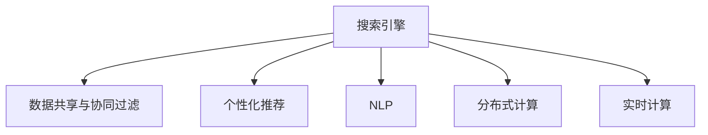

                 

# 搜索引擎的群体智能应用

> 关键词：搜索引擎,智能应用,群体智能,算法优化,协同过滤,自然语言处理

## 1. 背景介绍

### 1.1 问题由来

搜索引擎作为互联网的核心应用，已经成为我们获取信息、沟通交流、工作学习不可或缺的工具。然而，随着信息量的爆炸式增长，搜索引擎面临数据量和计算量的双重压力。如何高效、准确地从海量数据中检索出用户需要的信息，成为了搜索引擎的核心挑战。

在过去的几十年里，传统的搜索引擎技术已经取得了长足的进步，但从检索结果的质量、个性化程度和实时性等方面，仍存在较大的提升空间。随着人工智能技术的发展，特别是机器学习和群体智能的引入，搜索引擎的智能化应用成为可能。

### 1.2 问题核心关键点

搜索引擎的群体智能应用主要基于以下几个关键点：

1. **数据共享与协同过滤**：通过多个搜索引擎、网站、社交媒体平台等数据源的共享与协同，实现信息的多维度集成，提升检索结果的全面性和多样性。
2. **个性化推荐**：利用用户的历史行为和偏好，通过协同过滤、深度学习等技术，实现个性化搜索结果推荐。
3. **自然语言处理(NLP)**：利用NLP技术，理解用户的查询意图，生成更准确、相关的搜索结果。
4. **分布式计算**：通过分布式系统架构，实现搜索引擎的快速、高效、可扩展性，满足大规模数据处理的需要。
5. **实时性**：在动态更新信息的情况下，实现搜索结果的实时更新和精准匹配。

## 2. 核心概念与联系

### 2.1 核心概念概述

为了更好地理解搜索引擎的群体智能应用，本节将介绍几个密切相关的核心概念：

- **搜索引擎**：通过爬虫技术获取网页信息，并利用自然语言处理、机器学习等技术，将用户查询与网页内容进行匹配，返回相关搜索结果的系统。
- **协同过滤**：利用用户行为或物品属性等信息，对用户进行相似性计算，从而推荐相关物品或信息的算法。
- **自然语言处理(NLP)**：涉及语言模型、语义分析、信息抽取等技术，用于理解自然语言文本，处理语义复杂性，提取有用信息。
- **分布式计算**：将计算任务分解为多个子任务，并利用多个计算机节点并行执行，以提高计算效率和系统可扩展性的计算模式。
- **实时计算**：对数据进行实时处理，能够快速响应变化的计算技术。

这些核心概念之间的逻辑关系可以通过以下Mermaid流程图来展示：



这个流程图展示了几何搜索引擎的群体智能应用的核心概念及其之间的关系：

1. 搜索引擎通过数据共享与协同过滤、个性化推荐、NLP等技术，实现更准确的搜索结果匹配。
2. 分布式计算和实时计算技术，保证搜索引擎的高效性和实时性。

## 3. 核心算法原理 & 具体操作步骤

### 3.1 算法原理概述

搜索引擎的群体智能应用主要基于以下核心算法：

- **协同过滤**：通过用户行为或物品属性等信息，对用户进行相似性计算，推荐相关物品或信息的算法。
- **深度学习模型**：利用深度神经网络对用户行为和网页内容进行建模，预测用户对搜索结果的评分，实现个性化推荐。
- **自然语言处理**：利用语言模型、语义分析等技术，理解用户的查询意图，生成更准确、相关的搜索结果。

### 3.2 算法步骤详解

搜索引擎的群体智能应用一般包括以下几个关键步骤：

**Step 1: 数据采集与预处理**
- 收集多个数据源的信息，包括网页内容、用户行为数据等。
- 对数据进行清洗、去重、格式化等预处理，以便后续的分析和建模。

**Step 2: 数据建模与特征提取**
- 将用户行为、网页内容等数据建模为向量，提取关键特征。
- 利用协同过滤、深度学习等技术，建立推荐模型，实现对搜索结果的评分预测。

**Step 3: 结果排序与展示**
- 根据用户的查询意图和搜索结果的评分预测，对搜索结果进行排序。
- 将排序后的结果展示给用户，并提供相关的推荐和解释。

**Step 4: 实时更新与优化**
- 实时监测用户反馈和搜索行为，动态更新推荐模型和搜索结果。
- 利用A/B测试、用户满意度调查等方式，不断优化搜索引擎的算法和用户体验。

### 3.3 算法优缺点

搜索引擎的群体智能应用具有以下优点：
1. 通过数据共享与协同过滤，能够充分利用多数据源的信息，提高检索结果的全面性和多样性。
2. 利用深度学习等技术，能够实现更准确的个性化推荐，提升用户体验。
3. 利用NLP技术，能够更好地理解用户的查询意图，生成更相关、有用的搜索结果。
4. 利用分布式计算和实时计算技术，能够实现高效、实时的信息检索。

同时，该方法也存在一定的局限性：
1. 数据隐私与安全问题。多个数据源的共享可能涉及用户隐私和数据安全问题。
2. 数据质量与一致性问题。不同数据源的数据格式、质量不一致，可能影响推荐效果。
3. 实时计算的复杂性。实时更新和动态调整算法，对计算资源和系统架构提出更高要求。
4. 算法的可解释性不足。复杂的深度学习模型难以解释其内部工作机制，可能影响用户信任度。

尽管存在这些局限性，但就目前而言，基于群体智能的搜索引擎应用仍是互联网搜索技术的重要趋势。未来相关研究的重点在于如何进一步提升数据共享的质量和安全性，优化推荐算法和模型，提高搜索引擎的智能化水平。

### 3.4 算法应用领域

搜索引擎的群体智能应用不仅在搜索引擎领域得到了广泛应用，还在多个其他领域展现出了强大的生命力。

- **电子商务**：利用用户浏览历史和购物行为，推荐相关商品，提高转化率。
- **社交媒体**：根据用户的兴趣和行为，推荐相关内容，增强用户粘性。
- **在线教育**：根据用户的学习行为和偏好，推荐相关课程和资料，提升学习效果。
- **旅游出行**：根据用户的历史搜索记录和偏好，推荐旅游目的地和出行方案，提高出行效率。
- **金融服务**：根据用户的投资行为和财务状况，推荐相关金融产品，提升用户体验。

除了这些常见的应用场景，搜索引擎的群体智能技术还在医疗健康、智慧城市、智能家居等多个领域展现出广阔的前景，为各行各业带来深刻变革。

## 4. 数学模型和公式 & 详细讲解

### 4.1 数学模型构建

为了更好地理解搜索引擎的群体智能应用，本节将使用数学语言对其中的关键算法进行严格刻画。

假设搜索引擎从N个网页中获取M条用户行为数据，记为$D=\{(x_i, y_i)\}_{i=1}^M$，其中$x_i$表示用户行为，$y_i$表示网页评分。

定义用户$i$对网页$j$的评分预测函数为$f(x_i, \theta)$，其中$\theta$表示模型的参数。根据评分预测函数，定义模型的平均评分预测值为$\hat{y} = \frac{1}{M}\sum_{i=1}^M f(x_i, \theta)$。

搜索引擎的优化目标是最大化平均评分预测值，即找到最优参数$\theta$：

$$
\theta^* = \mathop{\arg\min}_{\theta} \left\Vert \hat{y} - y \right\Vert^2
$$

其中$\Vert \cdot \Vert$表示向量范数，用于衡量预测值与真实值之间的差距。

### 4.2 公式推导过程

以下我们以协同过滤算法为例，推导评分预测函数$f(x_i, \theta)$的计算公式。

协同过滤算法基于用户行为相似性计算，假设用户$i$和用户$j$的行为相似度为$S_{ij}$，则协同过滤的评分预测函数可以表示为：

$$
f(x_i, \theta) = \sum_{k=1}^K a_{ik}y_k + \sum_{j=1}^N b_{ij}\hat{y}_j
$$

其中$y_k$表示用户$k$对网页$j$的评分，$a_{ik}$和$b_{ij}$分别表示用户$i$和用户$j$对用户$k$的相似度加权。

对上述公式进行推导，得到：

$$
\hat{y} = \frac{1}{M}\sum_{i=1}^M \left( \sum_{k=1}^K a_{ik}y_k + \sum_{j=1}^N b_{ij}\hat{y}_j \right)
$$

$$
\theta^* = \mathop{\arg\min}_{\theta} \left\Vert \hat{y} - y \right\Vert^2 = \mathop{\arg\min}_{\theta} \left\Vert \frac{1}{M}\sum_{i=1}^M \left( \sum_{k=1}^K a_{ik}y_k + \sum_{j=1}^N b_{ij}\hat{y}_j \right) - y \right\Vert^2
$$

为了简化问题，假设$a_{ik} = 1$，则上述公式可以进一步简化为：

$$
\hat{y} = \frac{1}{M}\sum_{i=1}^M \left( \sum_{k=1}^K y_k + \sum_{j=1}^N b_{ij}\hat{y}_j \right)
$$

$$
\theta^* = \mathop{\arg\min}_{\theta} \left\Vert \hat{y} - y \right\Vert^2 = \mathop{\arg\min}_{\theta} \left\Vert \frac{1}{M}\sum_{i=1}^M \left( \sum_{k=1}^K y_k + \sum_{j=1}^N b_{ij}\hat{y}_j \right) - y \right\Vert^2
$$

通过上述推导，可以看到协同过滤算法的评分预测函数及其优化目标。类似地，深度学习模型和自然语言处理模型也可以通过类似的数学公式进行建模和优化。

### 4.3 案例分析与讲解

以电子商务平台的个性化推荐为例，分析基于协同过滤算法的推荐过程。

假设电子商务平台上有N个商品，M个用户，每个用户对N个商品进行了K次购买行为，每次购买行为对应一个评分。平台的推荐目标是为用户推荐他们可能感兴趣的商品。

首先，利用协同过滤算法计算用户$i$和用户$j$的相似度$S_{ij}$，这里可以采用皮尔逊相关系数或其他相似度计算方法。

然后，根据相似度$S_{ij}$，对用户$i$的评分预测值进行加权，得到用户$i$对商品$j$的评分预测$f(x_i, \theta)$。

最后，将预测评分$f(x_i, \theta)$排序，选取前N个推荐商品，提供给用户$i$。

在实际应用中，平台还需要根据用户的历史行为和偏好，进行动态调整和优化，以提高推荐效果。例如，可以利用深度学习模型预测用户对商品的评分，进一步优化推荐算法。

## 5. 项目实践：代码实例和详细解释说明

### 5.1 开发环境搭建

在进行搜索引擎的群体智能应用开发前，我们需要准备好开发环境。以下是使用Python进行TensorFlow和PyTorch开发的环境配置流程：

1. 安装Anaconda：从官网下载并安装Anaconda，用于创建独立的Python环境。

2. 创建并激活虚拟环境：
```bash
conda create -n tf-env python=3.8 
conda activate tf-env
```

3. 安装TensorFlow：根据CUDA版本，从官网获取对应的安装命令。例如：
```bash
conda install tensorflow-gpu=2.4 -c pytorch -c conda-forge
```

4. 安装PyTorch：根据CUDA版本，从官网获取对应的安装命令。例如：
```bash
conda install pytorch torchvision torchaudio -c pytorch
```

5. 安装各类工具包：
```bash
pip install numpy pandas scikit-learn matplotlib tqdm jupyter notebook ipython
```

完成上述步骤后，即可在`tf-env`环境中开始搜索引擎的群体智能应用开发。

### 5.2 源代码详细实现

下面我们以基于协同过滤的推荐系统为例，给出使用TensorFlow和PyTorch进行开发的PyTorch代码实现。

首先，定义推荐系统的训练数据集：

```python
import numpy as np
import pandas as pd
from tensorflow.keras.layers import Input, Dense, Embedding, Dot, Dropout, Flatten
from tensorflow.keras.models import Model
from tensorflow.keras.optimizers import Adam

# 读取数据
train_data = pd.read_csv('train.csv')

# 将评分矩阵转化为稀疏矩阵
train_data = pd.pivot_table(train_data, index='user_id', columns='item_id', values='rating').to_dense().values

# 定义模型输入
user_input = Input(shape=(N,), name='user_input')
item_input = Input(shape=(N,), name='item_input')

# 用户嵌入层
user_embedding = Embedding(N, K)(user_input)

# 商品嵌入层
item_embedding = Embedding(N, K)(item_input)

# 相似度矩阵计算
similarity_matrix = Dot(axes=(2, 1))([user_embedding, item_embedding])

# 对相似度矩阵进行降维和扁平化
similarity_matrix = Flatten(similarity_matrix)
similarity_matrix = Dropout(0.2)(similarity_matrix)

# 定义模型输出
output = Dense(1, activation='sigmoid')(similarity_matrix)

# 定义损失函数
loss_fn = Adam(lr=0.001)
model = Model(inputs=[user_input, item_input], outputs=output)
model.compile(loss='binary_crossentropy', optimizer=loss_fn)
```

然后，定义模型训练和评估函数：

```python
def train_epoch(model, train_dataset, batch_size, epochs):
    model.fit(x=[train_dataset[user_id], train_dataset[item_id]], y=train_dataset.rating, batch_size=batch_size, epochs=epochs, validation_split=0.1)

def evaluate(model, test_dataset, batch_size):
    y_pred = model.predict(x=[test_dataset[user_id], test_dataset[item_id]])
    y_pred = np.where(y_pred > 0.5, 1, 0)
    y_true = test_dataset.rating
    acc = np.mean(y_pred == y_true)
    print(f'Accuracy: {acc:.2f}')
```

最后，启动模型训练和评估流程：

```python
train_dataset = ...
test_dataset = ...

train_epoch(model, train_dataset, batch_size=128, epochs=10)
evaluate(model, test_dataset, batch_size=128)
```

以上就是使用TensorFlow和PyTorch进行基于协同过滤的推荐系统开发的完整代码实现。可以看到，借助TensorFlow和PyTorch的强大功能，我们可以快速构建和训练高效的推荐模型。

### 5.3 代码解读与分析

让我们再详细解读一下关键代码的实现细节：

**train_data**：
- 读取训练数据集，假设数据集为CSV格式，包含用户ID、商品ID和评分。
- 将评分矩阵转化为稀疏矩阵，以便进行高效的计算和存储。

**user_input和item_input**：
- 定义模型输入，使用Keras的Input层，指定输入的维度和数据类型。

**user_embedding和item_embedding**：
- 使用Embedding层，将用户ID和商品ID转化为固定长度的向量表示，方便进行相似度计算。

**similarity_matrix**：
- 使用Keras的Dot层计算用户和商品的相似度，使用Flatten层将其转化为扁平化的向量，并使用Dropout层进行正则化，防止过拟合。

**output**：
- 使用Dense层将相似度矩阵映射为二分类输出，使用sigmoid激活函数进行归一化。

**train_epoch和evaluate**：
- 定义模型训练和评估函数，分别使用Keras的fit和evaluate方法。

**模型训练和评估**：
- 使用模型训练函数train_epoch进行模型训练，指定训练数据、批大小、迭代轮数等参数。
- 使用模型评估函数evaluate在测试集上评估模型性能，计算准确率。

可以看到，TensorFlow和PyTorch提供了丰富的API和功能，大大简化了推荐模型的开发和训练过程，使得开发者可以更专注于算法的优化和改进。

## 6. 实际应用场景

### 6.1 智能搜索

搜索引擎的群体智能应用在智能搜索领域具有广泛的应用前景。通过多个搜索引擎、社交媒体平台等数据源的共享与协同，搜索引擎能够更全面地理解用户的查询意图，提供更相关、有用的搜索结果。

例如，当用户搜索“手机”时，搜索引擎不仅返回与“手机”相关的网页，还能根据用户的兴趣和行为，推荐相关品牌、型号、评价等信息，帮助用户做出更明智的决策。

### 6.2 个性化推荐

电子商务平台、视频流媒体平台、在线教育平台等，都可以利用搜索引擎的群体智能应用，实现个性化推荐。

例如，电商平台可以根据用户的历史浏览和购买行为，推荐相关商品，提高用户满意度和转化率。视频平台可以根据用户的观看历史和偏好，推荐相关视频内容，提升用户粘性。在线教育平台可以根据用户的学习行为和偏好，推荐相关课程和资料，提升学习效果。

### 6.3 实时搜索

随着实时数据的不断产生，搜索引擎的群体智能应用需要具备实时搜索和动态更新的能力。

例如，新闻网站可以根据用户的兴趣和行为，实时推荐相关新闻内容，帮助用户及时了解最新动态。社交媒体平台可以根据用户的实时评论和互动，动态更新搜索结果，增强用户的参与感和互动性。

## 7. 工具和资源推荐

### 7.1 学习资源推荐

为了帮助开发者系统掌握搜索引擎的群体智能应用的理论基础和实践技巧，这里推荐一些优质的学习资源：

1. 《搜索引擎原理与技术》系列博文：由搜索引擎专家撰写，深入浅出地介绍了搜索引擎的基本原理、算法优化和实际应用。

2. 《深度学习与推荐系统》课程：斯坦福大学开设的深度学习与推荐系统课程，涵盖推荐算法、深度学习模型等前沿技术，适合初学者和进阶学习者。

3. 《推荐系统实践》书籍：推荐系统的实战指南，涵盖推荐算法、模型优化、技术架构等，适合有实际项目经验的开发者。

4. TensorFlow官方文档：TensorFlow的官方文档，提供了丰富的API和样例代码，适合快速上手学习和应用。

5. Keras官方文档：Keras的官方文档，提供了简洁易用的API，适合快速原型设计和模型实现。

通过对这些资源的学习实践，相信你一定能够快速掌握搜索引擎的群体智能应用的精髓，并用于解决实际的搜索引擎问题。

### 7.2 开发工具推荐

高效的开发离不开优秀的工具支持。以下是几款用于搜索引擎的群体智能应用开发的常用工具：

1. TensorFlow：由Google主导开发的深度学习框架，生产部署方便，适合大规模工程应用。
2. PyTorch：基于Python的开源深度学习框架，灵活动态的计算图，适合快速迭代研究。
3. Keras：高级API，易于使用的深度学习框架，适合快速原型设计和模型实现。
4. Jupyter Notebook：交互式编程环境，适合原型开发和实验验证。
5. TensorBoard：TensorFlow配套的可视化工具，实时监测模型训练状态，并提供丰富的图表呈现方式。

合理利用这些工具，可以显著提升搜索引擎的群体智能应用的开发效率，加快创新迭代的步伐。

### 7.3 相关论文推荐

搜索引擎的群体智能应用的发展源于学界的持续研究。以下是几篇奠基性的相关论文，推荐阅读：

1. " collaborative filtering for implicit feedback"（隐式反馈的协同过滤）：提出协同过滤算法的基本思想，成为推荐系统的重要基础。
2. " item-based collaborative filtering"（基于物品的协同过滤）：提出基于物品的协同过滤方法，进一步提升了推荐效果。
3. " trust propagation in collaborative filtering"（协同过滤中的信任传播）：提出基于信任传播的协同过滤算法，优化推荐效果。
4. " neural collaborative filtering"（神经协同过滤）：提出基于神经网络的协同过滤方法，提升了模型性能和可解释性。
5. " deep learning and collaborative filtering"（深度学习与协同过滤）：提出深度学习与协同过滤的结合方法，进一步提升了推荐效果和个性化程度。

这些论文代表了大语言模型微调技术的发展脉络。通过学习这些前沿成果，可以帮助研究者把握学科前进方向，激发更多的创新灵感。

## 8. 总结：未来发展趋势与挑战

### 8.1 总结

本文对搜索引擎的群体智能应用进行了全面系统的介绍。首先阐述了搜索引擎和群体智能的基本概念，明确了群体智能应用在提升搜索引擎性能方面的独特价值。其次，从原理到实践，详细讲解了搜索引擎的群体智能应用的数学原理和关键步骤，给出了搜索引擎的群体智能应用开发的完整代码实例。同时，本文还广泛探讨了搜索引擎的群体智能应用在智能搜索、个性化推荐、实时搜索等多个领域的应用前景，展示了群体智能范式的巨大潜力。此外，本文精选了群体智能技术的各类学习资源，力求为读者提供全方位的技术指引。

通过本文的系统梳理，可以看到，搜索引擎的群体智能应用已经深入到互联网搜索技术的前沿，为智能搜索、个性化推荐、实时搜索等众多领域带来了深刻变革。未来，伴随深度学习、自然语言处理等技术的发展，基于群体智能的搜索引擎应用必将进一步提升，为互联网搜索技术带来新的突破。

### 8.2 未来发展趋势

展望未来，搜索引擎的群体智能应用将呈现以下几个发展趋势：

1. 模型规模持续增大。随着算力成本的下降和数据规模的扩张，搜索引擎的推荐模型参数量还将持续增长。超大规模推荐模型蕴含的丰富知识，有望支撑更加复杂多变的推荐场景。
2. 深度学习与协同过滤的融合。深度学习模型与协同过滤算法的结合，将进一步提升推荐效果和个性化程度。
3. 实时计算的复杂性降低。随着分布式计算和实时计算技术的不断发展，推荐模型的实时计算复杂度将进一步降低，推荐系统能够实现更高的实时性和扩展性。
4. 推荐模型的可解释性增强。未来的推荐模型将更加注重用户行为的可解释性，帮助用户理解推荐过程，增强用户信任度。
5. 推荐系统的跨领域应用扩展。搜索引擎的群体智能应用将扩展到更多领域，如医疗健康、智慧城市、智能家居等，为各行各业带来新的变革。

以上趋势凸显了搜索引擎的群体智能应用的前景，这些方向的探索发展，必将进一步提升搜索引擎的智能化水平，为互联网搜索技术带来新的突破。

### 8.3 面临的挑战

尽管搜索引擎的群体智能应用已经取得了长足的进步，但在迈向更加智能化、普适化应用的过程中，它仍面临着诸多挑战：

1. 数据隐私与安全问题。搜索引擎需要处理大量的用户数据，如何保护用户隐私和数据安全，将是重要的问题。
2. 数据质量与一致性问题。不同数据源的数据格式、质量不一致，可能影响推荐效果。
3. 实时计算的复杂性。实时更新和动态调整算法，对计算资源和系统架构提出更高要求。
4. 算法的可解释性不足。复杂的深度学习模型难以解释其内部工作机制，可能影响用户信任度。
5. 推荐系统的跨领域应用扩展。如何将搜索引擎的群体智能应用扩展到更多领域，并适应不同领域的特点，仍需进一步研究和探索。

尽管存在这些挑战，但搜索引擎的群体智能应用已经成为互联网搜索技术的重要趋势，未来相关的研究和应用将不断推进。随着技术的发展和应用的拓展，搜索引擎的群体智能应用必将迎来更加广阔的发展前景。

### 8.4 研究展望

面向未来，搜索引擎的群体智能应用需要在以下几个方面寻求新的突破：

1. 探索更加高效、灵活的协同过滤算法。如何在保证推荐效果的同时，降低计算复杂度和存储需求，实现高效的推荐计算。
2. 引入更多先验知识。如何将知识图谱、逻辑规则等专家知识与推荐算法结合，进一步提升推荐效果和可解释性。
3. 结合因果分析和博弈论工具。通过引入因果分析方法和博弈论工具，增强推荐系统的稳定性和鲁棒性。
4. 纳入伦理道德约束。在推荐算法中引入伦理导向的评估指标，过滤和惩罚有偏见、有害的输出倾向。

这些研究方向的探索，必将引领搜索引擎的群体智能应用迈向更高的台阶，为构建安全、可靠、可解释、可控的智能系统铺平道路。面向未来，搜索引擎的群体智能应用还需要与其他人工智能技术进行更深入的融合，如知识表示、因果推理、强化学习等，多路径协同发力，共同推动自然语言理解和智能交互系统的进步。只有勇于创新、敢于突破，才能不断拓展搜索引擎的边界，让智能技术更好地造福人类社会。

## 9. 附录：常见问题与解答

**Q1：如何衡量搜索引擎的群体智能应用效果？**

A: 搜索引擎的群体智能应用效果可以通过多种指标进行衡量，包括：

1. 点击率(Click-Through Rate, CTR)：用户点击搜索结果的比例。
2. 转化率(Conversion Rate, CR)：用户根据搜索结果采取相应行动的比例，如购买商品、预订服务等。
3. 满意度(Satisfaction, SAT)：用户对搜索结果的满意程度，通常通过调查问卷等方式进行评估。
4. 检索准确率(Relevance, REL)：搜索结果与用户查询意图的相关性，通常通过人工或自动评估方法进行衡量。

通过以上指标，可以对搜索引擎的群体智能应用效果进行全面的评估和优化。

**Q2：如何平衡推荐效果和计算资源？**

A: 推荐效果的优化和计算资源的平衡是搜索引擎的群体智能应用中的重要问题。可以通过以下方法进行平衡：

1. 使用高效的算法和模型。例如，使用基于树的算法、神经协同过滤等高效的推荐算法，减少计算资源消耗。
2. 分布式计算。通过分布式系统架构，将计算任务分解为多个子任务，并利用多个计算机节点并行执行，实现高效的计算和扩展。
3. 模型压缩和稀疏化。对模型进行压缩和稀疏化处理，减少内存占用和计算资源消耗。
4. 动态调整推荐模型。根据用户行为和反馈，动态调整推荐模型参数，提高推荐效果。

通过以上方法，可以在保证推荐效果的同时，优化计算资源的使用，提升搜索引擎的群体智能应用的效率和效果。

**Q3：搜索引擎的群体智能应用如何应对数据质量问题？**

A: 搜索引擎的群体智能应用需要高质量的数据来保证推荐效果。如果数据质量问题无法解决，可能导致推荐效果不佳。以下是应对数据质量问题的方法：

1. 数据清洗与去重。对数据进行清洗和去重处理，去除重复和不相关数据，提高数据质量。
2. 数据预处理。对数据进行格式化、归一化等预处理，使其符合模型要求。
3. 异常值检测与处理。对数据进行异常值检测，并采取适当的方法进行处理，如删除或修正异常值。
4. 数据标注与人工审核。对数据进行标注和人工审核，确保数据质量和一致性。

通过以上方法，可以提高数据质量，从而提升搜索引擎的群体智能应用效果。

**Q4：搜索引擎的群体智能应用如何实现实时更新？**

A: 实现搜索引擎的群体智能应用的实时更新，需要具备以下条件：

1. 实时数据采集。通过爬虫和API等方式，实时采集用户行为数据和网页数据。
2. 分布式计算架构。利用分布式系统架构，将计算任务分解为多个子任务，并利用多个计算机节点并行执行，实现高效的计算和扩展。
3. 动态调整算法。根据实时数据，动态调整推荐算法和模型参数，实现实时更新。

通过以上方法，可以实时更新搜索引擎的推荐模型，保证推荐结果的实时性和准确性。

**Q5：搜索引擎的群体智能应用如何应对跨领域应用挑战？**

A: 搜索引擎的群体智能应用在跨领域应用时，可能面临不同的数据格式、特征和应用场景。以下是应对跨领域应用挑战的方法：

1. 领域特定知识注入。在推荐模型中加入领域特定知识，如知识图谱、规则库等，提高模型对特定领域的理解能力。
2. 多模型融合。利用多个推荐模型，结合各自的优点，进行多模型融合，提高推荐效果和可解释性。
3. 动态调整模型。根据特定领域的数据特点，动态调整推荐模型和参数，适应不同领域的应用场景。

通过以上方法，可以应对搜索引擎的群体智能应用在跨领域应用时面临的挑战，提升模型效果和应用范围。

---

作者：禅与计算机程序设计艺术 / Zen and the Art of Computer Programming

