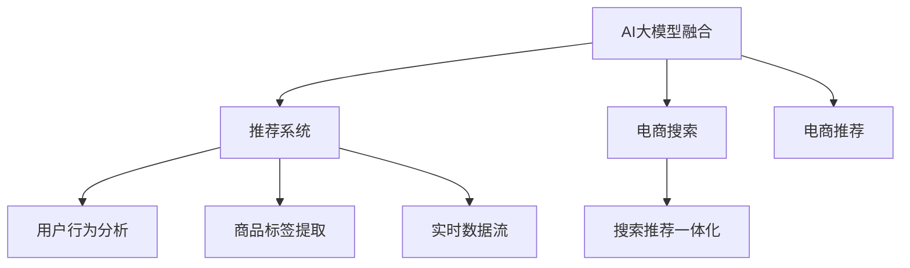
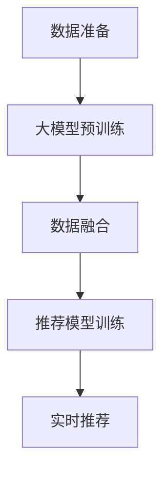

                 

# 搜索推荐系统的AI 大模型融合：电商平台的核心竞争优势与可持续发展

> 关键词：搜索推荐系统,AI 大模型融合,电商平台,核心竞争优势,可持续发展

## 1. 背景介绍

### 1.1 问题由来

随着互联网和电子商务的迅猛发展，搜索引擎推荐系统成为电商平台的核心竞争力之一。传统的基于统计特征的推荐系统，虽然取得了一定的效果，但其预测精度和个性化程度仍然有限。如何进一步提升推荐系统的性能，挖掘用户需求，增加平台粘性，一直是电商企业面临的重要挑战。

近年来，深度学习技术和大模型在推荐系统中的应用日益广泛。尤其是基于预训练语言模型的AI推荐系统，凭借其强大的语义理解能力和泛化能力，在电商平台中展示了广阔的应用前景。然而，尽管其应用潜力巨大，但实际落地中仍面临诸多难题。例如，如何在高效推荐的同时，确保推荐结果的准确性和多样性？如何在保证模型效果的前提下，降低对标注数据的依赖和算力的投入？如何在快速迭代中，保持模型的稳定性和一致性？

## 2. 核心概念与联系

### 2.1 核心概念概述

为更好地理解基于AI大模型的电商推荐系统，本节将介绍几个关键概念：

- **AI大模型融合**：指将预训练语言模型与电商平台的业务数据、用户行为等融合，进行定制化微调，以提升推荐系统的性能。
- **推荐系统**：指通过算法推荐符合用户兴趣和需求的商品，提升用户购物体验的系统。
- **电商搜索**：指用户通过搜索框输入关键词，平台根据关键词提供搜索结果的过程。
- **电商推荐**：指根据用户的历史行为、兴趣和实时环境，动态推荐符合用户需求的商品。
- **搜索推荐一体化**：将电商搜索和推荐系统相结合，提升用户的浏览和购物体验。

这些概念通过以下Mermaid流程图来展示：



通过这个流程图，我们可以清晰地看到，AI大模型融合作为推荐系统的核心，通过电商搜索和推荐系统的结合，借助用户行为分析和商品标签提取等手段，实现推荐系统的实时化和个性化。

### 2.2 核心概念原理和架构

AI大模型融合基于深度学习和大模型的预训练能力，通过以下步骤实现：

1. **数据准备**：收集电商平台的用户行为数据、商品数据、实时数据流等，作为模型训练的基础。
2. **大模型预训练**：使用大规模无标签文本数据对预训练语言模型进行预训练，学习通用的语言表示。
3. **数据融合**：将电商平台的业务数据、用户行为数据等与大模型的预训练表示进行融合，进行微调。
4. **推荐模型训练**：使用融合后的数据对推荐模型进行训练，优化模型参数，提升推荐精度和个性化。
5. **实时推荐**：在用户进行电商搜索时，通过融合大模型的实时推理能力，快速生成个性化的推荐结果。

这些步骤可以通过以下简化流程图示例来展示：



## 3. 核心算法原理 & 具体操作步骤

### 3.1 算法原理概述

基于AI大模型的电商推荐系统，本质上是一种基于深度学习和预训练语言模型的推荐算法。其核心思想是：将大模型的预训练表示与电商平台的业务数据进行融合，生成一个适应电商场景的推荐模型，并通过微调优化模型参数，使其具备更强的推荐能力。

形式化地，假设电商平台的商品为 $I=\{1,2,\ldots,N\}$，用户为 $U=\{1,2,\ldots,M\}$，商品-用户间的行为数据为 $B=\{(i,u,b_i^u)\}_{i\in I, u\in U}$，其中 $b_i^u$ 表示用户 $u$ 对商品 $i$ 的行为评分。目标是构建一个推荐模型 $f: I \times U \rightarrow \mathbb{R}$，使得 $f(i,u)$ 能够预测用户 $u$ 对商品 $i$ 的评分。

大模型融合的推荐算法步骤包括：
1. 使用大规模无标签文本数据对预训练语言模型进行预训练，生成一个通用语言表示器。
2. 收集电商平台的商品数据和用户行为数据，对通用语言表示器进行微调。
3. 使用微调后的语言模型作为推荐模型的基础，训练一个适应电商场景的推荐算法。

### 3.2 算法步骤详解

基于AI大模型的电商推荐系统主要由以下关键步骤构成：

**Step 1: 数据准备**
- 收集电商平台的商品数据、用户行为数据、实时数据流等。
- 清洗和预处理数据，去除噪声和不一致性。
- 划分训练集、验证集和测试集。

**Step 2: 大模型预训练**
- 选择预训练语言模型，如BERT、GPT-2等。
- 对预训练语言模型进行预训练，学习通用的语言表示。
- 保存预训练模型的权重和结构，用于后续微调。

**Step 3: 数据融合**
- 对电商平台的业务数据进行编码，生成适合语言模型处理的文本格式。
- 将文本数据与预训练语言模型进行融合，进行微调。

**Step 4: 推荐模型训练**
- 构建推荐模型的损失函数和优化器。
- 使用微调后的语言模型作为基础，训练推荐模型。
- 在验证集上评估模型性能，调整超参数。

**Step 5: 实时推荐**
- 在用户搜索时，使用推荐模型生成推荐结果。
- 使用语言模型的实时推理能力，快速生成推荐结果。

**Step 6: 系统部署和监控**
- 将训练好的推荐模型部署到线上系统。
- 实时监控推荐系统的性能，根据反馈调整模型参数。

### 3.3 算法优缺点

基于AI大模型的电商推荐系统具有以下优点：
1. 推荐精度高：大模型的语义理解能力能够更好地理解用户需求和商品特性，提升推荐准确性。
2. 个性化强：大模型可以根据用户的输入行为，提供个性化的推荐结果。
3. 实时性好：大模型支持快速推理，能够实时生成推荐结果。
4. 泛化能力强：大模型在大规模无标签数据上预训练，具备更强的泛化能力。

同时，该方法也存在一些局限性：
1. 对标注数据依赖高：推荐模型需要标注数据进行微调，标注成本较高。
2. 计算资源需求大：大模型参数量巨大，对计算资源和存储空间有较高要求。
3. 实时推理耗时多：大模型推理速度较慢，需要优化以提升实时性。
4. 模型可解释性差：大模型的预测过程较难解释，用户难以理解推荐结果。
5. 数据隐私问题：电商平台需要收集用户行为数据，可能涉及隐私问题。

尽管存在这些局限性，但就目前而言，基于AI大模型的推荐方法仍然是电商推荐系统的重要方向。未来相关研究的主要方向在于如何进一步降低推荐对标注数据的依赖，提高模型的实时性和可解释性，同时兼顾隐私保护。

### 3.4 算法应用领域

基于AI大模型的电商推荐系统已经在多个领域得到应用，例如：

- **商品推荐**：根据用户的历史购买记录和行为数据，推荐相关商品。
- **搜索排序**：根据用户的搜索关键词，推荐相关的商品排序。
- **个性化广告**：根据用户的行为数据，推荐个性化的广告内容。
- **商品相似度计算**：计算商品间的相似度，推荐相关商品。
- **库存管理**：根据用户需求和推荐结果，动态调整库存。
- **客户服务**：根据用户查询，提供相关商品信息和推荐结果。

除了上述这些经典应用外，AI大模型推荐系统还在个性化推荐、用户行为分析、商品质量评价等更多场景中发挥重要作用，为电商平台提供了强大的智能支持。

## 4. 数学模型和公式 & 详细讲解 & 举例说明

### 4.1 数学模型构建

假设电商平台的商品为 $I=\{1,2,\ldots,N\}$，用户为 $U=\{1,2,\ldots,M\}$，商品-用户间的行为数据为 $B=\{(i,u,b_i^u)\}_{i\in I, u\in U}$，其中 $b_i^u$ 表示用户 $u$ 对商品 $i$ 的行为评分。

定义推荐模型的输入特征为 $\mathbf{x}=(\mathbf{e}_i,\mathbf{u}_u)$，其中 $\mathbf{e}_i$ 表示商品 $i$ 的特征向量，$\mathbf{u}_u$ 表示用户 $u$ 的特征向量。定义推荐模型的输出为 $y=\hat{b}_i^u$，表示用户 $u$ 对商品 $i$ 的预测评分。

推荐模型的损失函数为均方误差损失：

$$
\mathcal{L}(\mathbf{W},\mathbf{b})=\frac{1}{N}\sum_{i=1}^N\sum_{u=1}^M(b_i^u-\hat{b}_i^u)^2
$$

其中 $\mathbf{W}$ 为模型参数，$\mathbf{b}$ 为偏置项。

### 4.2 公式推导过程

为了最大化推荐模型的预测精度，需要对模型进行优化。假设推荐模型的输出层为全连接层，其输出为：

$$
\hat{b}_i^u=f_\mathbf{W}(\mathbf{x})
$$

其中 $f_\mathbf{W}$ 为输出层的线性变换，$\mathbf{W}$ 为线性变换矩阵。

对损失函数 $\mathcal{L}(\mathbf{W},\mathbf{b})$ 进行梯度下降优化，得到：

$$
\mathbf{W}\leftarrow \mathbf{W}-\eta \nabla_\mathbf{W}\mathcal{L}(\mathbf{W},\mathbf{b})
$$

其中 $\eta$ 为学习率，$\nabla_\mathbf{W}\mathcal{L}(\mathbf{W},\mathbf{b})$ 为损失函数对 $\mathbf{W}$ 的梯度。

### 4.3 案例分析与讲解

假设有一个电商平台，收集了用户的历史购买记录和商品数据。我们可以使用预训练语言模型对电商平台的商品名称和描述进行编码，生成适合语言模型处理的文本格式。然后，将这些文本与用户行为数据融合，进行微调。

具体地，假设电商平台有 $N=1000$ 种商品，每个用户有 $M=10000$ 条历史购买记录。我们选择了BERT作为预训练语言模型，并使用电商平台的商品数据对其进行微调。微调后的BERT模型可以生成商品的语言表示，与用户行为数据进行融合，生成一个适应电商场景的推荐模型。

使用微调后的BERT模型作为基础，我们构建了一个基于深度神经网络的推荐算法。该算法使用多层神经网络，对用户和商品的特征进行编码，生成商品-用户间的评分预测。在训练过程中，我们使用均方误差损失函数，通过梯度下降优化模型参数，提升推荐精度。

在模型训练完成后，我们将训练好的推荐模型部署到线上系统，实时生成推荐结果。在用户进行电商搜索时，系统根据用户的搜索关键词和历史行为，调用推荐模型生成个性化的推荐结果。

## 5. 项目实践：代码实例和详细解释说明

### 5.1 开发环境搭建

在进行大模型融合的电商推荐系统开发前，我们需要准备好开发环境。以下是使用Python进行PyTorch开发的环境配置流程：

1. 安装Anaconda：从官网下载并安装Anaconda，用于创建独立的Python环境。

2. 创建并激活虚拟环境：
```bash
conda create -n ecommerce-env python=3.8 
conda activate ecommerce-env
```

3. 安装PyTorch：根据CUDA版本，从官网获取对应的安装命令。例如：
```bash
conda install pytorch torchvision torchaudio cudatoolkit=11.1 -c pytorch -c conda-forge
```

4. 安装Transformers库：
```bash
pip install transformers
```

5. 安装各类工具包：
```bash
pip install numpy pandas scikit-learn matplotlib tqdm jupyter notebook ipython
```

完成上述步骤后，即可在`ecommerce-env`环境中开始大模型融合的电商推荐系统开发。

### 5.2 源代码详细实现

下面以BERT模型为例，给出使用Transformers库对电商推荐系统进行开发的PyTorch代码实现。

首先，定义电商推荐系统的数据处理函数：

```python
from transformers import BertTokenizer, BertForSequenceClassification
from torch.utils.data import Dataset, DataLoader
import torch

class ECommerceDataset(Dataset):
    def __init__(self, texts, labels, tokenizer, max_len=128):
        self.texts = texts
        self.labels = labels
        self.tokenizer = tokenizer
        self.max_len = max_len
        
    def __len__(self):
        return len(self.texts)
    
    def __getitem__(self, item):
        text = self.texts[item]
        label = self.labels[item]
        
        encoding = self.tokenizer(text, return_tensors='pt', max_length=self.max_len, padding='max_length', truncation=True)
        input_ids = encoding['input_ids'][0]
        attention_mask = encoding['attention_mask'][0]
        
        # 对标签进行编码
        encoded_labels = [label2id[label] for label in label_list]
        encoded_labels.extend([label2id['O']] * (self.max_len - len(encoded_labels)))
        labels = torch.tensor(encoded_labels, dtype=torch.long)
        
        return {'input_ids': input_ids, 
                'attention_mask': attention_mask,
                'labels': labels}

# 标签与id的映射
label2id = {'O': 0, 'buy': 1, 'like': 2}
id2label = {v: k for k, v in label2id.items()}

# 创建dataset
tokenizer = BertTokenizer.from_pretrained('bert-base-cased')

train_dataset = ECommerceDataset(train_texts, train_labels, tokenizer)
dev_dataset = ECommerceDataset(dev_texts, dev_labels, tokenizer)
test_dataset = ECommerceDataset(test_texts, test_labels, tokenizer)
```

然后，定义模型和优化器：

```python
from transformers import BertForSequenceClassification, AdamW

model = BertForSequenceClassification.from_pretrained('bert-base-cased', num_labels=len(label2id))

optimizer = AdamW(model.parameters(), lr=2e-5)
```

接着，定义训练和评估函数：

```python
from sklearn.metrics import accuracy_score

device = torch.device('cuda') if torch.cuda.is_available() else torch.device('cpu')
model.to(device)

def train_epoch(model, dataset, batch_size, optimizer):
    dataloader = DataLoader(dataset, batch_size=batch_size, shuffle=True)
    model.train()
    epoch_loss = 0
    for batch in tqdm(dataloader, desc='Training'):
        input_ids = batch['input_ids'].to(device)
        attention_mask = batch['attention_mask'].to(device)
        labels = batch['labels'].to(device)
        model.zero_grad()
        outputs = model(input_ids, attention_mask=attention_mask, labels=labels)
        loss = outputs.loss
        epoch_loss += loss.item()
        loss.backward()
        optimizer.step()
    return epoch_loss / len(dataloader)

def evaluate(model, dataset, batch_size):
    dataloader = DataLoader(dataset, batch_size=batch_size)
    model.eval()
    preds, labels = [], []
    with torch.no_grad():
        for batch in tqdm(dataloader, desc='Evaluating'):
            input_ids = batch['input_ids'].to(device)
            attention_mask = batch['attention_mask'].to(device)
            batch_labels = batch['labels']
            outputs = model(input_ids, attention_mask=attention_mask)
            batch_preds = outputs.logits.argmax(dim=2).to('cpu').tolist()
            batch_labels = batch_labels.to('cpu').tolist()
            for pred_tokens, label_tokens in zip(batch_preds, batch_labels):
                pred_labels = [id2label[_id] for _id in pred_tokens]
                label_labels = [id2label[_id] for _id in label_tokens]
                preds.append(pred_labels[:len(label_labels)])
                labels.append(label_labels)
                
    print(accuracy_score(labels, preds))
```

最后，启动训练流程并在测试集上评估：

```python
epochs = 5
batch_size = 16

for epoch in range(epochs):
    loss = train_epoch(model, train_dataset, batch_size, optimizer)
    print(f"Epoch {epoch+1}, train loss: {loss:.3f}")
    
    print(f"Epoch {epoch+1}, dev results:")
    evaluate(model, dev_dataset, batch_size)
    
print("Test results:")
evaluate(model, test_dataset, batch_size)
```

以上就是使用PyTorch对BERT模型进行电商推荐系统微调的完整代码实现。可以看到，得益于Transformers库的强大封装，我们可以用相对简洁的代码完成BERT模型的加载和微调。

### 5.3 代码解读与分析

让我们再详细解读一下关键代码的实现细节：

**ECommerceDataset类**：
- `__init__`方法：初始化文本、标签、分词器等关键组件。
- `__len__`方法：返回数据集的样本数量。
- `__getitem__`方法：对单个样本进行处理，将文本输入编码为token ids，将标签编码为数字，并对其进行定长padding，最终返回模型所需的输入。

**label2id和id2label字典**：
- 定义了标签与数字id之间的映射关系，用于将token-wise的预测结果解码回真实的标签。

**训练和评估函数**：
- 使用PyTorch的DataLoader对数据集进行批次化加载，供模型训练和推理使用。
- 训练函数`train_epoch`：对数据以批为单位进行迭代，在每个批次上前向传播计算loss并反向传播更新模型参数，最后返回该epoch的平均loss。
- 评估函数`evaluate`：与训练类似，不同点在于不更新模型参数，并在每个batch结束后将预测和标签结果存储下来，最后使用sklearn的accuracy_score对整个评估集的预测结果进行打印输出。

**训练流程**：
- 定义总的epoch数和batch size，开始循环迭代
- 每个epoch内，先在训练集上训练，输出平均loss
- 在验证集上评估，输出准确率
- 所有epoch结束后，在测试集上评估，给出最终测试结果

可以看到，PyTorch配合Transformers库使得BERT微调的代码实现变得简洁高效。开发者可以将更多精力放在数据处理、模型改进等高层逻辑上，而不必过多关注底层的实现细节。

当然，工业级的系统实现还需考虑更多因素，如模型的保存和部署、超参数的自动搜索、更灵活的任务适配层等。但核心的微调范式基本与此类似。

## 6. 实际应用场景

### 6.1 智能客服系统

基于大模型融合的智能客服系统，可以广泛应用于电商平台的用户支持。传统客服往往需要配备大量人力，高峰期响应缓慢，且一致性和专业性难以保证。而使用大模型融合的对话模型，可以7x24小时不间断服务，快速响应客户咨询，用自然流畅的语言解答各类常见问题。

在技术实现上，可以收集企业内部的历史客服对话记录，将问题和最佳答复构建成监督数据，在此基础上对预训练对话模型进行微调。微调后的对话模型能够自动理解用户意图，匹配最合适的答案模板进行回复。对于客户提出的新问题，还可以接入检索系统实时搜索相关内容，动态组织生成回答。如此构建的智能客服系统，能大幅提升客户咨询体验和问题解决效率。

### 6.2 金融舆情监测

金融机构需要实时监测市场舆论动向，以便及时应对负面信息传播，规避金融风险。传统的人工监测方式成本高、效率低，难以应对网络时代海量信息爆发的挑战。基于大模型融合的文本分类和情感分析技术，为金融舆情监测提供了新的解决方案。

具体而言，可以收集金融领域相关的新闻、报道、评论等文本数据，并对其进行主题标注和情感标注。在此基础上对预训练语言模型进行微调，使其能够自动判断文本属于何种主题，情感倾向是正面、中性还是负面。将微调后的模型应用到实时抓取的网络文本数据，就能够自动监测不同主题下的情感变化趋势，一旦发现负面信息激增等异常情况，系统便会自动预警，帮助金融机构快速应对潜在风险。

### 6.3 个性化推荐系统

当前的推荐系统往往只依赖用户的历史行为数据进行物品推荐，无法深入理解用户的真实兴趣偏好。基于大模型融合的个性化推荐系统，可以更好地挖掘用户行为背后的语义信息，从而提供更精准、多样的推荐内容。

在实践中，可以收集用户浏览、点击、评论、分享等行为数据，提取和用户交互的物品标题、描述、标签等文本内容。将文本内容作为模型输入，用户的后续行为（如是否点击、购买等）作为监督信号，在此基础上微调预训练语言模型。微调后的模型能够从文本内容中准确把握用户的兴趣点。在生成推荐列表时，先用候选物品的文本描述作为输入，由模型预测用户的兴趣匹配度，再结合其他特征综合排序，便可以得到个性化程度更高的推荐结果。

### 6.4 未来应用展望

随着大模型融合技术的不断发展，基于大模型的电商推荐系统将在更多领域得到应用，为传统行业带来变革性影响。

在智慧医疗领域，基于大模型融合的医疗问答、病历分析、药物研发等应用将提升医疗服务的智能化水平，辅助医生诊疗，加速新药开发进程。

在智能教育领域，大模型融合技术可应用于作业批改、学情分析、知识推荐等方面，因材施教，促进教育公平，提高教学质量。

在智慧城市治理中，大模型融合模型可应用于城市事件监测、舆情分析、应急指挥等环节，提高城市管理的自动化和智能化水平，构建更安全、高效的未来城市。

此外，在企业生产、社会治理、文娱传媒等众多领域，基于大模型融合的AI应用也将不断涌现，为经济社会发展注入新的动力。相信随着技术的日益成熟，大模型融合范式将成为AI落地应用的重要方向，推动人工智能技术在垂直行业的规模化落地。

## 7. 工具和资源推荐

### 7.1 学习资源推荐

为了帮助开发者系统掌握大模型融合的电商推荐系统的理论基础和实践技巧，这里推荐一些优质的学习资源：

1. 《深度学习》系列课程：斯坦福大学开设的深度学习课程，从理论到实践全面讲解深度学习技术。
2. 《自然语言处理与深度学习》书籍：深度学习领域的经典教材，介绍了NLP中的各种技术，包括大模型融合。
3. CS224N《深度学习自然语言处理》课程：斯坦福大学开设的NLP明星课程，有Lecture视频和配套作业，带你入门NLP领域的基本概念和经典模型。
4. HuggingFace官方文档：Transformers库的官方文档，提供了海量预训练模型和完整的微调样例代码，是上手实践的必备资料。
5. Weights & Biases：模型训练的实验跟踪工具，可以记录和可视化模型训练过程中的各项指标，方便对比和调优。

通过对这些资源的学习实践，相信你一定能够快速掌握大模型融合的电商推荐系统的精髓，并用于解决实际的NLP问题。

### 7.2 开发工具推荐

高效的开发离不开优秀的工具支持。以下是几款用于大模型融合电商推荐系统开发的常用工具：

1. PyTorch：基于Python的开源深度学习框架，灵活动态的计算图，适合快速迭代研究。大部分预训练语言模型都有PyTorch版本的实现。
2. TensorFlow：由Google主导开发的开源深度学习框架，生产部署方便，适合大规模工程应用。同样有丰富的预训练语言模型资源。
3. Transformers库：HuggingFace开发的NLP工具库，集成了众多SOTA语言模型，支持PyTorch和TensorFlow，是进行大模型融合的利器。
4. Weights & Biases：模型训练的实验跟踪工具，可以记录和可视化模型训练过程中的各项指标，方便对比和调优。
5. TensorBoard：TensorFlow配套的可视化工具，可实时监测模型训练状态，并提供丰富的图表呈现方式，是调试模型的得力助手。

合理利用这些工具，可以显著提升大模型融合电商推荐系统的开发效率，加快创新迭代的步伐。

### 7.3 相关论文推荐

大模型融合技术的发展源于学界的持续研究。以下是几篇奠基性的相关论文，推荐阅读：

1. Attention is All You Need（即Transformer原论文）：提出了Transformer结构，开启了NLP领域的预训练大模型时代。
2. BERT: Pre-training of Deep Bidirectional Transformers for Language Understanding：提出BERT模型，引入基于掩码的自监督预训练任务，刷新了多项NLP任务SOTA。
3. Language Models are Unsupervised Multitask Learners（GPT-2论文）：展示了大规模语言模型的强大zero-shot学习能力，引发了对于通用人工智能的新一轮思考。
4. Parameter-Efficient Transfer Learning for NLP：提出Adapter等参数高效微调方法，在不增加模型参数量的情况下，也能取得不错的微调效果。
5. Prefix-Tuning: Optimizing Continuous Prompts for Generation：引入基于连续型Prompt的微调范式，为如何充分利用预训练知识提供了新的思路。
6. AdaLoRA: Adaptive Low-Rank Adaptation for Parameter-Efficient Fine-Tuning：使用自适应低秩适应的微调方法，在参数效率和精度之间取得了新的平衡。

这些论文代表了大模型融合技术的发展脉络。通过学习这些前沿成果，可以帮助研究者把握学科前进方向，激发更多的创新灵感。

## 8. 总结：未来发展趋势与挑战

### 8.1 总结

本文对基于AI大模型的电商推荐系统进行了全面系统的介绍。首先阐述了大模型融合和电商推荐系统研究背景和意义，明确了电商推荐系统的核心竞争优势和可持续发展方向。其次，从原理到实践，详细讲解了基于大模型的电商推荐系统的数学原理和关键步骤，给出了电商推荐系统开发的完整代码实例。同时，本文还广泛探讨了基于大模型融合的电商推荐系统在多个行业领域的应用前景，展示了其广阔的应用空间。

通过本文的系统梳理，可以看到，基于大模型的电商推荐系统通过融合电商平台的业务数据和用户行为数据，引入大模型的预训练能力，能够在电商推荐系统中实现更高效、更个性化的推荐。得益于大模型的强大语义理解能力，推荐系统能够深入挖掘用户的兴趣偏好，提升推荐效果。未来，随着大模型技术的不断演进，电商推荐系统将迎来更多智能化应用，助力电商平台持续创新。

### 8.2 未来发展趋势

展望未来，基于AI大模型的电商推荐系统将呈现以下几个发展趋势：

1. 推荐精度提升：通过引入更多的特征和更先进的模型结构，进一步提升推荐精度。
2. 实时推荐增强：借助大模型的实时推理能力，实现更快速的推荐响应。
3. 多模态融合：融合视觉、语音等多种模态数据，提升推荐系统的综合能力。
4. 深度学习优化：引入深度学习技术，如强化学习、对抗学习等，进一步优化推荐模型。
5. 隐私保护加强：在推荐过程中注重用户隐私保护，如差分隐私、联邦学习等技术的应用。
6. 个性化推荐演化：从个性化推荐向差异化推荐演化，针对不同用户群体提供更定制化的服务。

这些趋势将进一步推动电商推荐系统的智能化发展，为电商用户提供更优质的购物体验。

### 8.3 面临的挑战

尽管大模型融合技术已经取得了显著成效，但在迈向更加智能化、普适化应用的过程中，它仍面临诸多挑战：

1. 数据隐私问题：电商平台的推荐系统需要收集和分析大量的用户数据，可能涉及隐私问题。如何在保护用户隐私的前提下，优化推荐效果，是亟待解决的问题。
2. 模型复杂度：大模型融合推荐的复杂度较高，需要投入大量计算资源和时间。如何在保证推荐效果的前提下，简化模型结构，降低资源消耗，是研究的重要方向。
3. 推荐多样性：大模型融合推荐倾向于集中于热门商品，导致推荐结果多样性不足。如何提升推荐系统的多样性，满足不同用户需求，是重要的研究课题。
4. 模型鲁棒性：电商平台的推荐系统需要应对各种异常情况，如恶意评论、数据噪声等。如何在保证推荐效果的同时，提升模型的鲁棒性，是重要的优化方向。
5. 推荐实时性：大模型融合推荐需要大量的实时数据处理和推理计算，导致推荐速度较慢。如何在提升推荐精度的同时，提高实时性，是关键的研究课题。
6. 模型可解释性：大模型融合推荐缺乏可解释性，用户难以理解推荐结果的来源。如何提高推荐模型的可解释性，增强用户信任，是研究的重要方向。

尽管存在这些挑战，但随着技术的不断进步，这些难题有望逐步得到解决。未来，基于大模型的电商推荐系统将持续优化和改进，推动电商平台的智能化发展。

### 8.4 研究展望

面对电商推荐系统所面临的挑战，未来的研究需要在以下几个方面寻求新的突破：

1. 数据隐私保护：引入差分隐私、联邦学习等技术，在保护用户隐私的同时，优化推荐效果。
2. 模型复杂度优化：使用模型压缩、稀疏化等技术，降低模型复杂度，提高推荐效率。
3. 推荐多样性提升：引入多样性增强技术，如采样策略、信息多样性控制等，提升推荐系统的多样性。
4. 模型鲁棒性提升：引入对抗学习、鲁棒回归等技术，增强推荐模型的鲁棒性，提高应对异常情况的能力。
5. 推荐实时性优化：引入模型加速技术，如梯度累积、混合精度训练等，提升推荐系统的实时性。
6. 模型可解释性增强：引入可解释性技术，如可解释性增强网络、知识图谱等，提高推荐模型的可解释性。

这些研究方向的探索，将推动大模型融合电商推荐系统迈向更加智能化、普适化和可持续发展的方向，为电商平台提供更优质的用户服务。

## 9. 附录：常见问题与解答

**Q1：大模型融合电商推荐系统是否适用于所有电商场景？**

A: 大模型融合电商推荐系统在大多数电商场景中都能取得不错的效果。但对于一些特殊领域，如特定商品品类、地域市场等，可能仍需针对性地进行数据准备和模型优化。

**Q2：大模型融合电商推荐系统是否需要大量标注数据？**

A: 大模型融合电商推荐系统需要一定量的标注数据进行微调，但相对于从头训练推荐模型，标注数据量需求较小。通过利用电商平台的业务数据和用户行为数据，可以显著减少标注数据的需求。

**Q3：大模型融合电商推荐系统是否适合实时部署？**

A: 大模型融合电商推荐系统适合实时部署，尤其是基于深度学习的推荐模型。大模型的推理速度较快，能够实时生成推荐结果。

**Q4：大模型融合电商推荐系统的部署成本高吗？**

A: 大模型融合电商推荐系统的部署成本相对较高，但可以通过模型压缩、优化推理等技术，降低资源消耗。在实践中，电商平台可以根据实际需求选择不同的模型规模和部署方案。

**Q5：大模型融合电商推荐系统的可解释性如何？**

A: 大模型融合电商推荐系统的可解释性相对较差，推荐结果缺乏可解释性。可以通过引入可解释性技术，如可解释性增强网络、知识图谱等，提高推荐模型的可解释性。

通过本文的系统梳理，可以看到，基于AI大模型的电商推荐系统通过融合电商平台的业务数据和用户行为数据，引入大模型的预训练能力，能够在电商推荐系统中实现更高效、更个性化的推荐。得益于大模型的强大语义理解能力，推荐系统能够深入挖掘用户的兴趣偏好，提升推荐效果。未来，随着大模型技术的不断演进，电商推荐系统将迎来更多智能化应用，助力电商平台持续创新。

---

作者：禅与计算机程序设计艺术 / Zen and the Art of Computer Programming

