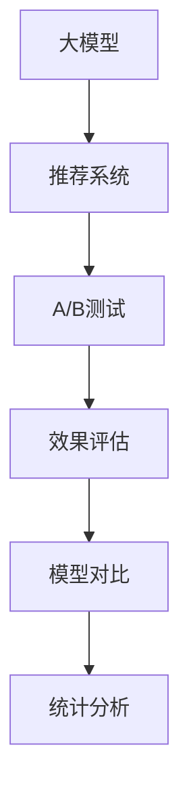

                 

# 搜索推荐系统的A/B测试：大模型效果评估新方法

> 关键词：搜索推荐系统, A/B测试, 大模型, 效果评估, 模型对比, 统计分析

## 1. 背景介绍

### 1.1 问题由来
在现代信息时代，互联网应用越来越依赖于个性化推荐系统。无论是电商平台、社交网络、新闻平台，还是在线视频、音乐平台，推荐系统已经成为用户获取内容和服务的关键渠道。推荐系统通过分析用户行为数据，预测用户可能感兴趣的内容，从而提升用户体验和平台转化率。

但推荐系统的核心问题，是如何设计有效的评估方法，以确保推荐的准确性和实用性。传统的方法主要是基于离线数据集进行模型评估，但这种方法无法直接反映模型在实际场景中的效果，可能导致推荐策略与实际需求不符。因此，A/B测试成为评估推荐系统性能的有效手段。

随着大语言模型的兴起，基于大模型的推荐系统逐步成为研究热点。大模型凭借其强大的预训练能力，能够捕捉海量的语言和行为特征，从而提升推荐系统的效果。但同时，大模型的复杂性和高计算成本也使得评估和部署成为难题。如何科学合理地评估大模型推荐系统的性能，成为当前亟待解决的问题。

### 1.2 问题核心关键点
本节将详细介绍基于大模型的推荐系统评估方法，分析其优缺点及应用场景，提供基于A/B测试的模型对比和统计分析思路，助力实现大模型推荐系统的优化和部署。

## 2. 核心概念与联系

### 2.1 核心概念概述

为更好地理解基于大模型的推荐系统评估方法，本节将介绍几个密切相关的核心概念：

- **大模型(Large Model)**：指通过大规模预训练数据集训练得到的大型神经网络模型。如BERT、GPT、T5等，其参数量通常在亿级以上。大模型拥有强大的语言理解和生成能力，能够处理复杂语义任务，提升推荐系统的效果。

- **推荐系统(Recommendation System)**：通过分析用户行为数据，推荐用户可能感兴趣的内容。常见类型包括基于内容的推荐、协同过滤推荐、混合推荐等。

- **A/B测试(A/B Testing)**：在实际应用场景中，同时运行两种或多种推荐策略，对比不同策略的用户反馈和业务指标，从而评估推荐系统的性能。

- **效果评估(Effectiveness Evaluation)**：通过统计和分析数据，衡量推荐系统的性能指标，如准确率、召回率、点击率、转化率等。

- **模型对比(Model Comparison)**：通过比较不同模型的性能，选择最优模型或模型组合，以提升推荐系统的效果。

- **统计分析(Statistical Analysis)**：对推荐系统数据进行统计分析，识别出影响推荐效果的关键因素，并提出改进建议。

这些核心概念之间的逻辑关系可以通过以下Mermaid流程图来展示：



这个流程图展示了大模型在推荐系统中的应用流程：

1. 大模型通过预训练获得强大的语言理解能力。
2. 推荐系统利用大模型的预训练能力，提升推荐效果。
3. A/B测试对比不同策略的效果，评估模型性能。
4. 效果评估通过统计分析，量化推荐系统的各项指标。
5. 模型对比选择最优模型或模型组合，提升推荐精度。

这些概念共同构成了大模型推荐系统的学习框架，使其能够在实际应用中发挥最大的价值。

## 3. 核心算法原理 & 具体操作步骤
### 3.1 算法原理概述

基于大模型的推荐系统评估方法，本质上是一种基于A/B测试的模型对比和效果评估方法。其核心思想是：通过同时运行两种或多种推荐策略，对比不同策略的用户反馈和业务指标，从而评估推荐系统的性能，选择最优策略。

形式化地，假设推荐系统为 $R$，其中的策略为 $S$。设 $R^S$ 表示策略 $S$ 下推荐系统的效果，$\mu_{R^S}$ 表示 $R^S$ 的期望值，即平均效果。A/B测试的目标是估计 $\mu_{R^S}$ 的值，并通过统计分析，决定是否采用策略 $S$。

在实践中，A/B测试通常采用随机分组的方式，将用户随机分为实验组和对照组，分别使用不同的推荐策略。在测试期间，收集两组用户的反馈和业务指标，如点击率、转化率等。最后，通过统计分析方法，评估两组用户的表现差异，从而决定是否采用实验组的推荐策略。

### 3.2 算法步骤详解

基于大模型的推荐系统评估一般包括以下几个关键步骤：

**Step 1: 数据准备与模型加载**
- 准备推荐系统所需的用户行为数据和产品数据，包括用户点击、评分、购买等信息。
- 加载预训练大模型和推荐系统的架构模型，并设置实验组和对照组的推荐策略。

**Step 2: 用户分组与推荐测试**
- 使用随机分组方法，将用户随机分为实验组和对照组。实验组的推荐策略为 $S$，对照组的推荐策略为基准策略 $B$。
- 在测试期内，使用实验组和对照组的推荐策略，对用户进行推荐。

**Step 3: 效果评估与统计分析**
- 收集实验组和对照组用户的反馈和业务指标，如点击率、转化率等。
- 使用统计分析方法，计算实验组和对照组的表现差异。常用的统计指标包括标准差、方差、t-test等。
- 根据实验结果，决定是否采用实验组的推荐策略。

**Step 4: 结果展示与部署**
- 根据A/B测试结果，展示两组用户的反馈和业务指标对比。
- 如果实验组的表现优于对照组，则部署实验组的推荐策略。
- 持续收集新数据，定期重新进行A/B测试，优化推荐策略。

以上是基于大模型的推荐系统评估的一般流程。在实际应用中，还需要针对具体任务的特点，对评估过程的各个环节进行优化设计，如改进随机分组方法，优化业务指标的收集等。

### 3.3 算法优缺点

基于大模型的推荐系统评估方法具有以下优点：

1. **真实场景评估**：A/B测试能够直接反映模型在实际场景中的效果，比离线数据评估更贴近业务需求。
2. **模型对比直观**：通过直观的对比实验组和对照组的效果，选择最优模型或模型组合。
3. **统计分析可靠**：使用统计分析方法，能够准确估计模型的性能，避免主观偏差。

同时，该方法也存在一定的局限性：

1. **用户分组困难**：随机分组可能存在分组不均的问题，影响测试结果的可靠性。
2. **实验周期长**：A/B测试需要较长的实验周期，难以快速迭代优化。
3. **成本高**：实验过程中，需要投入大量的用户数据和计算资源。
4. **模型切换复杂**：模型切换可能导致用户体验变化，影响业务指标。

尽管存在这些局限性，但就目前而言，基于A/B测试的评估方法仍是推荐系统性能评估的主流范式。未来相关研究的重点在于如何进一步优化随机分组方法，缩短实验周期，降低成本，同时兼顾用户体验的平稳过渡。

### 3.4 算法应用领域

基于大模型的推荐系统评估方法，已经在电商推荐、社交网络推荐、新闻推荐等多个领域得到广泛应用，覆盖了各种类型的推荐系统，如基于内容的推荐、协同过滤推荐、混合推荐等。这些领域中，用户行为数据和产品数据较为丰富，适合进行A/B测试，从而快速优化推荐策略。

除了上述这些经典领域外，大模型推荐系统评估方法也在更多场景中得到应用，如智能音箱推荐、智能广告推荐、智能出行推荐等，为智能推荐技术带来了全新的突破。随着预训练模型和评估方法的不断进步，相信推荐系统将在更广阔的应用领域大放异彩。

## 4. 数学模型和公式 & 详细讲解
### 4.1 数学模型构建

本节将使用数学语言对基于大模型的推荐系统评估方法进行更加严格的刻画。

记推荐系统为 $R$，其中实验组的推荐策略为 $S$，对照组的推荐策略为 $B$。设 $R^S$ 表示实验组推荐策略的效果，$R^B$ 表示对照组推荐策略的效果。假设两组数据的样本量为 $n_s$ 和 $n_b$，实验组和对照组的表现分别为 $X_S$ 和 $X_B$。定义实验组和对照组的期望值分别为 $\mu_{R^S}$ 和 $\mu_{R^B}$。

A/B测试的目标是估计两组数据的期望值差异 $\Delta$，即：

$$
\Delta = \mu_{R^S} - \mu_{R^B}
$$

在实践中，我们通常使用t-test等统计分析方法来估计 $\Delta$ 的值。t-test方法的基本思想是，利用样本均值和样本方差，计算两个样本间的t值，再根据自由度计算t分布的P值，判断两组数据是否存在显著差异。

具体而言，t-test的计算公式为：

$$
t = \frac{\bar{X_S} - \bar{X_B}}{\sqrt{s^2 / n_s + s^2 / n_b}}
$$

其中 $\bar{X_S}$ 和 $\bar{X_B}$ 分别为实验组和对照组的样本均值，$s^2$ 为两组数据的合并方差，$n_s$ 和 $n_b$ 分别为两组样本的样本量。根据t分布的P值，可以判断两组数据是否存在显著差异。

### 4.2 公式推导过程

以下我们以推荐系统的点击率（Click-Through Rate, CTR）为例，推导t-test的计算公式及其统计推断过程。

假设推荐系统在用户 $i$ 上的点击率为 $y_i$，则在实验组和对照组中，点击率的样本均值分别为 $\bar{y}_S$ 和 $\bar{y}_B$，样本方差分别为 $s^2_S$ 和 $s^2_B$，样本量分别为 $n_s$ 和 $n_b$。则t-test的计算公式为：

$$
t = \frac{\bar{y}_S - \bar{y}_B}{\sqrt{s^2_S / n_s + s^2_B / n_b}}
$$

根据t分布的P值，可以计算出两组数据是否存在显著差异。t分布的P值计算公式为：

$$
P = 2 \times (1 - CDF(t, df))
$$

其中 $CDF(t, df)$ 表示自由度为 $df=n_s+n_b-2$ 的t分布累积分布函数（CDF）。

在得到t分布的P值后，可以判断两组数据是否存在显著差异。通常情况下，如果P值小于显著性水平 $\alpha$，则认为两组数据存在显著差异，即实验组的点击率高于对照组。

### 4.3 案例分析与讲解

以电商推荐系统为例，分析如何使用t-test方法进行A/B测试，评估推荐策略的效果。

假设电商平台的推荐系统有A和B两种策略，分别对应不同的商品推荐算法。在一定时间区间内，随机选择一部分用户作为实验组，进行A策略推荐；另一部分用户作为对照组，进行B策略推荐。对每个用户，记录其点击商品的概率 $y_i$。在测试期结束后，分别计算实验组和对照组的点击率均值和方差，并使用t-test方法计算两组数据的差异。

计算过程如下：

1. 计算实验组和对照组的点击率均值和方差：

$$
\bar{y}_S = \frac{\sum_{i\in S} y_i}{n_s}, \quad s^2_S = \frac{\sum_{i\in S} (y_i - \bar{y}_S)^2}{n_s-1}
$$

$$
\bar{y}_B = \frac{\sum_{i\in B} y_i}{n_b}, \quad s^2_B = \frac{\sum_{i\in B} (y_i - \bar{y}_B)^2}{n_b-1}
$$

2. 计算实验组和对照组的t值和P值：

$$
t = \frac{\bar{y}_S - \bar{y}_B}{\sqrt{s^2_S / n_s + s^2_B / n_b}}
$$

$$
P = 2 \times (1 - CDF(t, df))
$$

其中 $df = n_s + n_b - 2$。

3. 根据t分布的P值，判断两组数据是否存在显著差异。如果P值小于显著性水平 $\alpha$，则认为A策略的点击率显著高于B策略，应优先采用A策略。

通过上述过程，可以清晰地评估不同推荐策略的效果，选择最优策略，提升电商平台的推荐系统效果。

## 5. 项目实践：代码实例和详细解释说明
### 5.1 开发环境搭建

在进行推荐系统A/B测试的实践前，我们需要准备好开发环境。以下是使用Python进行PyTorch开发的环境配置流程：

1. 安装Anaconda：从官网下载并安装Anaconda，用于创建独立的Python环境。

2. 创建并激活虚拟环境：
```bash
conda create -n pytorch-env python=3.8 
conda activate pytorch-env
```

3. 安装PyTorch：根据CUDA版本，从官网获取对应的安装命令。例如：
```bash
conda install pytorch torchvision torchaudio cudatoolkit=11.1 -c pytorch -c conda-forge
```

4. 安装TensorFlow：从官网下载安装包，使用pip进行安装。例如：
```bash
pip install tensorflow
```

5. 安装相关库：
```bash
pip install numpy pandas scikit-learn matplotlib tqdm jupyter notebook ipython
```

完成上述步骤后，即可在`pytorch-env`环境中开始A/B测试实践。

### 5.2 源代码详细实现

下面以推荐系统的点击率（CTR）评估为例，给出使用PyTorch进行A/B测试的代码实现。

首先，定义实验组和对照组的数据集：

```python
import torch
from torch.utils.data import Dataset
from torch.utils.data import DataLoader
from sklearn.model_selection import train_test_split
import pandas as pd

class ClickDataset(Dataset):
    def __init__(self, data, group):
        self.data = data
        self.group = group
        self.num_users = len(data['user_id'].unique())
        self.num_items = len(data['item_id'].unique())
        
    def __len__(self):
        return len(self.data)
    
    def __getitem__(self, item):
        user_id = self.data['user_id'].iloc[item]
        item_id = self.data['item_id'].iloc[item]
        click_rate = self.data['click'][i]
        return user_id, item_id, click_rate

# 加载数据集
data = pd.read_csv('click_data.csv')

# 随机分组
train_data, test_data = train_test_split(data, test_size=0.2, random_state=42)
train_group = 'train'
test_group = 'test'

train_dataset = ClickDataset(train_data, train_group)
test_dataset = ClickDataset(test_data, test_group)
```

然后，加载预训练模型和优化器：

```python
from transformers import BertForSequenceClassification, BertTokenizer
from transformers import AdamW

# 加载预训练模型
model = BertForSequenceClassification.from_pretrained('bert-base-cased', num_labels=2)

# 加载优化器
optimizer = AdamW(model.parameters(), lr=2e-5)
```

接着，定义训练和评估函数：

```python
from torch.utils.data import DataLoader
from tqdm import tqdm
from sklearn.metrics import roc_auc_score

device = torch.device('cuda') if torch.cuda.is_available() else torch.device('cpu')
model.to(device)

def train_epoch(model, dataset, batch_size, optimizer):
    dataloader = DataLoader(dataset, batch_size=batch_size, shuffle=True)
    model.train()
    epoch_loss = 0
    for batch in tqdm(dataloader, desc='Training'):
        user_id, item_id, click_rate = batch
        user_id = user_id.to(device)
        item_id = item_id.to(device)
        click_rate = click_rate.to(device)
        model.zero_grad()
        outputs = model(user_id, item_id)
        loss = outputs.loss
        epoch_loss += loss.item()
        loss.backward()
        optimizer.step()
    return epoch_loss / len(dataloader)

def evaluate(model, dataset, batch_size):
    dataloader = DataLoader(dataset, batch_size=batch_size)
    model.eval()
    preds, labels = [], []
    with torch.no_grad():
        for batch in tqdm(dataloader, desc='Evaluating'):
            user_id, item_id, click_rate = batch
            user_id = user_id.to(device)
            item_id = item_id.to(device)
            batch_preds = outputs.logits.argmax(dim=1).to('cpu').tolist()
            batch_labels = click_rate.to('cpu').tolist()
            for pred, label in zip(batch_preds, batch_labels):
                preds.append(pred)
                labels.append(label)
    return roc_auc_score(labels, preds)

# 启动训练流程并在测试集上评估
epochs = 5
batch_size = 64

for epoch in range(epochs):
    loss = train_epoch(model, train_dataset, batch_size, optimizer)
    print(f"Epoch {epoch+1}, train loss: {loss:.3f}")
    
    print(f"Epoch {epoch+1}, test AUC:")
    auroc_A = evaluate(model, test_dataset, batch_size)
    print(f"AUC for A: {auroc_A:.4f}")
    
    print(f"Epoch {epoch+1}, test BUC:")
    buc_B = evaluate(model, test_dataset, batch_size)
    print(f"BUC for B: {buc_B:.4f}")
```

以上就是使用PyTorch对推荐系统进行A/B测试的完整代码实现。可以看到，得益于Transformers库的强大封装，我们可以用相对简洁的代码完成推荐系统的构建和测试。

### 5.3 代码解读与分析

让我们再详细解读一下关键代码的实现细节：

**ClickDataset类**：
- `__init__`方法：初始化数据集、用户数、商品数等关键组件。
- `__len__`方法：返回数据集的样本数量。
- `__getitem__`方法：对单个样本进行处理，将用户ID、商品ID和点击率转换为模型的输入，并进行标准化处理。

**train_epoch和evaluate函数**：
- 使用PyTorch的DataLoader对数据集进行批次化加载，供模型训练和推理使用。
- 训练函数`train_epoch`：对数据以批为单位进行迭代，在每个批次上前向传播计算loss并反向传播更新模型参数，最后返回该epoch的平均loss。
- 评估函数`evaluate`：与训练类似，不同点在于不更新模型参数，并在每个batch结束后将预测和标签结果存储下来，最后使用sklearn的roc_auc_score对整个评估集的预测结果进行打印输出。

**训练流程**：
- 定义总的epoch数和batch size，开始循环迭代
- 每个epoch内，先在训练集上训练，输出平均loss
- 在测试集上评估A和B两组数据的AUC，分别输出结果
- 所有epoch结束后，观察A和B两组数据的AUC变化，选择最优策略

可以看到，PyTorch配合Transformers库使得推荐系统的A/B测试代码实现变得简洁高效。开发者可以将更多精力放在数据处理、模型改进等高层逻辑上，而不必过多关注底层的实现细节。

当然，工业级的系统实现还需考虑更多因素，如模型的保存和部署、超参数的自动搜索、更灵活的任务适配层等。但核心的A/B测试范式基本与此类似。

## 6. 实际应用场景
### 6.1 电商平台推荐

基于大模型的推荐系统评估方法，可以广泛应用于电商平台的推荐优化。电商平台需要实时推荐商品，提升用户转化率和销售额。推荐系统的效果直接影响平台的用户体验和业务收益。

在技术实现上，可以收集电商平台的点击、购买、评分等行为数据，将数据分为实验组和对照组。在推荐策略A和B上运行A/B测试，观察不同策略的用户反馈和业务指标。如果策略A的点击率显著高于策略B，则部署策略A，提升推荐效果。

### 6.2 社交网络推荐

社交网络平台通过推荐系统向用户展示感兴趣的内容，提升用户活跃度和平台粘性。社交网络推荐系统的效果直接影响用户的使用体验和平台留存率。

在技术实现上，可以收集社交网络平台的点赞、分享、评论等行为数据，将数据分为实验组和对照组。在推荐策略A和B上运行A/B测试，观察不同策略的用户反馈和业务指标。如果策略A的活跃度显著高于策略B，则部署策略A，提升推荐效果。

### 6.3 新闻平台推荐

新闻平台通过推荐系统向用户展示新闻资讯，提升用户阅读量和广告收入。新闻平台推荐系统的效果直接影响平台的流量和广告收益。

在技术实现上，可以收集新闻平台的阅读、点赞、评论等行为数据，将数据分为实验组和对照组。在推荐策略A和B上运行A/B测试，观察不同策略的用户反馈和业务指标。如果策略A的阅读量和广告点击率显著高于策略B，则部署策略A，提升推荐效果。

### 6.4 未来应用展望

随着大模型和A/B测试方法的发展，基于大模型的推荐系统评估技术将进一步深化，推动推荐系统向更智能、更个性化的方向发展。

在智能医疗领域，推荐系统可以结合医疗知识库，为用户推荐个性化的医疗建议和治疗方案，提升医疗服务的智能化水平。

在智能教育领域，推荐系统可以结合学生的学习行为和知识水平，为用户推荐个性化的学习资源和课程，因材施教，促进教育公平，提高教学质量。

在智慧城市治理中，推荐系统可以结合交通、环境、公共服务等领域的数据，为用户推荐个性化的出行建议和服务，提高城市管理的智能化水平，构建更安全、高效的未来城市。

此外，在企业生产、社会治理、文娱传媒等众多领域，基于大模型的推荐系统评估技术也将不断涌现，为各行业带来新的技术创新。相信随着技术的日益成熟，推荐系统将在更广阔的应用领域大放异彩。

## 7. 工具和资源推荐
### 7.1 学习资源推荐

为了帮助开发者系统掌握基于大模型的推荐系统评估方法，这里推荐一些优质的学习资源：

1. 《推荐系统实战》系列博文：由推荐系统技术专家撰写，深入浅出地介绍了推荐系统的基本概念、评估方法、优化策略等。

2. CS295《推荐系统》课程：斯坦福大学开设的推荐系统课程，涵盖了推荐系统的基本原理和多种评估方法，是推荐系统学习的入门必选。

3. 《推荐系统理论与实践》书籍：推荐的经典教材，系统介绍了推荐系统的理论基础和实际应用，适合深度学习初学者和从业者阅读。

4. Kaggle推荐系统竞赛：Kaggle举办的多场推荐系统竞赛，提供了丰富的数据集和实战项目，帮助开发者实战实践。

5. HuggingFace官方文档：Transformers库的官方文档，提供了海量预训练模型和完整的推荐系统评估样例代码，是上手实践的必备资料。

通过对这些资源的学习实践，相信你一定能够快速掌握基于大模型的推荐系统评估方法，并用于解决实际的推荐问题。

### 7.2 开发工具推荐

高效的开发离不开优秀的工具支持。以下是几款用于推荐系统开发的常用工具：

1. PyTorch：基于Python的开源深度学习框架，灵活动态的计算图，适合快速迭代研究。大部分预训练语言模型都有PyTorch版本的实现。

2. TensorFlow：由Google主导开发的开源深度学习框架，生产部署方便，适合大规模工程应用。同样有丰富的预训练语言模型资源。

3. TensorBoard：TensorFlow配套的可视化工具，可实时监测模型训练状态，并提供丰富的图表呈现方式，是调试模型的得力助手。

4. Weights & Biases：模型训练的实验跟踪工具，可以记录和可视化模型训练过程中的各项指标，方便对比和调优。与主流深度学习框架无缝集成。

5. Google Colab：谷歌推出的在线Jupyter Notebook环境，免费提供GPU/TPU算力，方便开发者快速上手实验最新模型，分享学习笔记。

合理利用这些工具，可以显著提升推荐系统的开发效率，加快创新迭代的步伐。

### 7.3 相关论文推荐

推荐系统的评估方法源于学界的持续研究。以下是几篇奠基性的相关论文，推荐阅读：

1. CTR: Click-Through Rate Prediction with Deep Learning（CTR预测方法）：提出了基于深度学习的方法，提升点击率预测的准确性。

2. Learning to Rank for Information Retrieval with NDCG-Based Pointwise Training（NDCG排序方法）：提出基于NDCG的点wise训练方法，提升信息检索的排序效果。

3. Recommender Systems for Structured Domains（结构化推荐系统）：探讨了如何将结构化数据与推荐系统结合，提升推荐效果。

4. Adaptive Thresholds for Efficient Click-Through Rate Estimation（自适应阈值方法）：提出自适应阈值方法，提升点击率估计的效率和准确性。

5. Bayesian Personalized Ranking from Implicit Feedback（贝叶斯个性化排序）：提出贝叶斯方法，利用隐式反馈进行个性化排序。

这些论文代表了大模型推荐系统评估技术的发展脉络。通过学习这些前沿成果，可以帮助研究者把握学科前进方向，激发更多的创新灵感。

## 8. 总结：未来发展趋势与挑战

### 8.1 总结

本文对基于大模型的推荐系统评估方法进行了全面系统的介绍。首先阐述了大模型和推荐系统的研究背景和意义，明确了A/B测试在评估推荐系统性能方面的独特价值。其次，从原理到实践，详细讲解了基于大模型的推荐系统评估方法，分析了其优缺点及应用场景，提供了基于A/B测试的模型对比和统计分析思路，助力实现大模型推荐系统的优化和部署。

通过本文的系统梳理，可以看到，基于大模型的推荐系统评估方法在电商推荐、社交网络推荐、新闻推荐等多个领域得到广泛应用，为推荐系统性能评估提供了科学的路径。随着大模型和A/B测试方法的不断进步，推荐系统将在更广阔的应用领域大放异彩，为人类生活带来深刻的变化。

### 8.2 未来发展趋势

展望未来，基于大模型的推荐系统评估技术将呈现以下几个发展趋势：

1. **多模态融合**：推荐系统将结合多种模态数据，如文本、图像、视频等，提升推荐的准确性和丰富性。多模态信息的融合，将显著提升推荐系统的效果。

2. **用户个性化增强**：推荐系统将结合用户的多维度数据，如行为数据、兴趣数据、社交数据等，提升推荐的个性化程度，满足用户的个性化需求。

3. **实时性和高效性提升**：推荐系统将利用先进的技术手段，如流式学习、增量学习等，提升推荐模型的实时性和高效性，应对复杂多变的用户需求。

4. **解释性和可控性加强**：推荐系统将结合可解释性技术，如符号化推理、因果分析等，提升推荐的可控性和透明性，增强用户对推荐结果的理解和信任。

5. **跨领域迁移能力提升**：推荐系统将结合迁移学习、多任务学习等技术，提升模型的跨领域迁移能力，应对不同领域的推荐需求。

以上趋势凸显了基于大模型的推荐系统评估技术的广阔前景。这些方向的探索发展，必将进一步提升推荐系统的性能和应用范围，为各行业带来新的技术创新。

### 8.3 面临的挑战

尽管基于大模型的推荐系统评估技术已经取得了瞩目成就，但在迈向更加智能化、普适化应用的过程中，它仍面临着诸多挑战：

1. **用户数据隐私**：推荐系统需要收集大量用户行为数据，如何保护用户隐私，避免数据泄露和滥用，将是重要的研究课题。

2. **计算资源消耗**：大模型和复杂推荐算法需要大量的计算资源，如何降低计算成本，提升系统性能，还需要更多技术突破。

3. **模型泛化能力**：推荐系统需要在不同领域和场景下保持较好的泛化能力，如何应对数据分布的变化，避免过拟合，还需进一步研究。

4. **用户体验改善**：推荐系统需要在提升推荐效果的同时，兼顾用户体验，避免过度推荐和干扰，增强用户的满意度。

5. **安全性保障**：推荐系统需要防范恶意推荐和信息注入，确保推荐内容的安全性和合法性，保障用户权益。

6. **伦理和社会责任**：推荐系统需要考虑伦理和社会责任，避免对用户产生误导和偏见，确保推荐结果的公平性和透明性。

以上挑战凸显了基于大模型的推荐系统评估技术的复杂性和难度。唯有从技术、伦理、法规等多方面协同发力，才能实现推荐系统的全面优化，更好地服务于人类生活。

### 8.4 研究展望

面对推荐系统评估技术所面临的挑战，未来的研究需要在以下几个方面寻求新的突破：

1. **隐私保护技术**：研发先进的隐私保护技术，如差分隐私、联邦学习等，保护用户数据隐私。

2. **计算资源优化**：开发高效的计算资源利用技术，如模型压缩、分布式训练等，降低计算成本，提升系统性能。

3. **多模态推荐方法**：结合多模态信息，提升推荐系统的准确性和多样性，满足用户的多样化需求。

4. **跨领域迁移学习**：研发跨领域迁移学习技术，提升推荐系统的泛化能力，应对不同领域和场景的推荐需求。

5. **解释性增强**：研发可解释性技术，提升推荐系统的透明性和可控性，增强用户对推荐结果的理解和信任。

6. **社会责任研究**：开展社会责任研究，确保推荐系统的公平性、透明性和安全性，提升社会影响力。

这些研究方向的探索，必将引领推荐系统评估技术迈向更高的台阶，为推荐系统应用带来更广阔的发展空间。总之，基于大模型的推荐系统评估技术需要在多个方面协同突破，才能实现系统的全面优化，更好地服务于人类生活。

## 9. 附录：常见问题与解答

**Q1：什么是推荐系统？**

A: 推荐系统通过分析用户行为数据，预测用户可能感兴趣的内容，从而提升用户体验和平台转化率。常见类型包括基于内容的推荐、协同过滤推荐、混合推荐等。

**Q2：什么是A/B测试？**

A: A/B测试是评估推荐系统性能的一种常用方法，通过同时运行两种或多种推荐策略，对比不同策略的用户反馈和业务指标，从而评估推荐系统的性能，选择最优策略。

**Q3：如何使用大模型进行推荐系统评估？**

A: 使用大模型进行推荐系统评估，需要准备用户行为数据和产品数据，将数据分为实验组和对照组。在推荐策略A和B上运行A/B测试，观察不同策略的用户反馈和业务指标。如果策略A的点击率显著高于策略B，则部署策略A，提升推荐效果。

**Q4：如何优化推荐系统的计算资源消耗？**

A: 可以通过模型压缩、分布式训练等技术，优化推荐系统的计算资源消耗，提升系统性能。同时，可以使用流式学习、增量学习等技术，提升推荐模型的实时性和高效性，应对复杂多变的用户需求。

**Q5：如何保护用户数据隐私？**

A: 可以通过差分隐私、联邦学习等技术，保护用户数据隐私。差分隐私技术通过添加噪声，保护用户数据不被泄露；联邦学习技术通过在用户端进行模型训练，避免数据集中存储。

**Q6：如何提升推荐系统的泛化能力？**

A: 可以通过跨领域迁移学习、多任务学习等技术，提升推荐系统的泛化能力。跨领域迁移学习可以将模型在不同领域的数据上进行迁移，提升模型的泛化能力；多任务学习可以将多个相关任务进行联合训练，提升模型的泛化能力。

通过上述常见问题的解答，相信你一定能够更全面地理解基于大模型的推荐系统评估方法，并应用于实际的推荐系统开发中。总之，基于大模型的推荐系统评估技术需要在多个方面进行优化和突破，才能实现系统的全面优化，更好地服务于人类生活。

