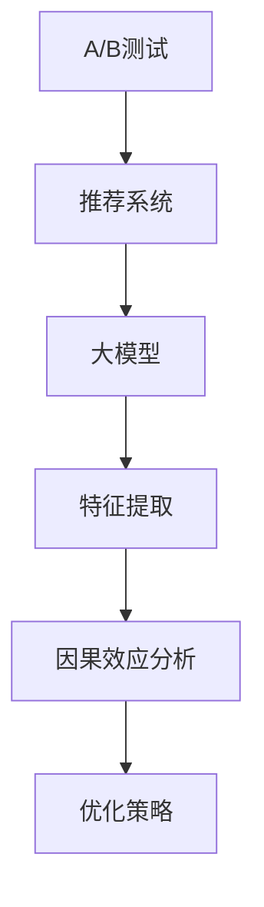

                 

# 搜索推荐系统的A/B测试：大模型的因果效应分析

> 关键词：A/B测试, 推荐系统, 因果效应, 搜索, 大模型, 个性化推荐, 推荐算法

## 1. 背景介绍

### 1.1 问题由来
在现代互联网应用中，推荐系统作为重要的用户交互手段，扮演着连接用户和内容的桥梁作用。通过推荐，用户可以更快地发现感兴趣的资源，而平台也能提高内容曝光度和用户黏性。然而，推荐系统的核心指标——用户点击率、转化率等，受到多种因素的影响，其中用户的个性化需求、外界环境的变化以及推荐算法的局限性都可能对其产生影响。为了验证推荐系统的效果和性能，并不断优化改进，我们常常需要进行大规模的A/B测试。

传统上，A/B测试多基于模型训练和预测的结果进行评估和比较。然而，随着深度学习技术的发展，特别是近年来大模型的应用，推荐系统的效果评估需要更多样化的工具和方法。在这篇论文中，我们将通过因果效应分析，利用大模型对A/B测试进行精细化的因果推断，从而全面评估推荐系统的表现，并为实际应用提供更加可靠的指导。

### 1.2 问题核心关键点
大模型在推荐系统中的应用，主要体现在其强大的语言理解和生成能力上。通过大模型进行文本分析，可以准确地理解用户查询意图，并基于上下文信息推荐更精准的内容。但同时，大模型也带来了一些新的挑战，如模型推理速度较慢、资源消耗较大等问题，这些问题可能影响A/B测试的效率和结果。

因此，本文将从算法原理、操作步骤以及实际应用等方面，全面探讨如何利用大模型进行推荐系统的A/B测试，并分析大模型对推荐系统效果的因果效应。具体来说，我们将从以下几方面展开讨论：

1. **大模型的因果效应分析**：利用大模型的特征提取能力，对用户行为进行建模，探究推荐系统不同策略之间的因果关系。
2. **A/B测试方法设计**：设计合理的A/B测试方案，确保测试结果的有效性和可靠性。
3. **推荐系统优化策略**：基于因果推断结果，提出针对推荐系统优化改进的建议。
4. **实际应用场景**：探讨大模型在实际推荐系统A/B测试中的应用案例和效果评估。

## 2. 核心概念与联系

### 2.1 核心概念概述

为更好地理解大模型在推荐系统A/B测试中的应用，本节将介绍几个密切相关的核心概念：

- **A/B测试**：一种常用的在线实验方法，通过将用户随机分配到不同的实验组和对照组，评估不同策略的效果差异。
- **推荐系统**：根据用户历史行为、兴趣偏好和外部环境等因素，为用户推荐最相关内容的系统。
- **因果效应**：指因变量（如推荐效果）与自变量（如推荐策略）之间的因果关系，评估自变量对因变量的影响大小。
- **大模型**：以Transformer架构为代表的大规模深度学习模型，具有强大的特征提取和泛化能力，广泛应用于自然语言处理(NLP)、计算机视觉(CV)等多个领域。

这些核心概念之间的逻辑关系可以通过以下Mermaid流程图来展示：



这个流程图展示了大模型在推荐系统A/B测试中的应用流程：

1. 将A/B测试应用到推荐系统，并使用大模型进行特征提取。
2. 通过因果效应分析，评估不同策略之间的效果差异。
3. 基于分析结果，提出推荐系统的优化策略。

## 3. 核心算法原理 & 具体操作步骤

### 3.1 算法原理概述

在推荐系统的A/B测试中，我们通常希望通过评估不同策略（如推荐算法、推荐模型、推荐规则等）的效果，来优化推荐系统。这一过程本质上是一种因果推断过程，其中自变量（策略）与因变量（效果）之间的关系需要通过实验数据来估计。

具体来说，假设我们有两个推荐策略A和B，每个策略都有N个用户参与。我们希望估计这两个策略的效果差异，即：

$$
\Delta Y = E[Y_A] - E[Y_B]
$$

其中，$E[\cdot]$表示期望，$Y_A$和$Y_B$分别表示策略A和B的推荐效果。

### 3.2 算法步骤详解

基于大模型的推荐系统A/B测试，通常包括以下几个关键步骤：

**Step 1: 数据准备与模型加载**

- 收集推荐系统的历史数据，包括用户ID、推荐ID、用户点击行为、用户反馈等。
- 选择预训练的大模型作为特征提取器，如BERT、GPT-3等。
- 使用HuggingFace或TensorFlow等深度学习框架，加载大模型的预训练权重。

**Step 2: 特征提取与编码**

- 使用大模型对用户行为数据进行特征提取，生成向量表示。
- 将提取的特征向量输入推荐模型，预测推荐效果。
- 对不同策略的推荐效果进行编码，生成量化指标（如点击率、转化率等）。

**Step 3: 因果效应分析**

- 利用大模型提取的特征，构建因果模型。例如，使用回归模型、随机森林等进行因果推断。
- 通过统计假设检验，估计策略A和B之间的效果差异。

**Step 4: 优化策略设计**

- 基于因果推断结果，评估不同策略的效果差异。
- 根据效果差异，设计推荐系统的优化策略，如推荐模型优化、推荐规则调整等。

**Step 5: 实验验证与部署**

- 在实际环境中部署优化策略，进行大规模A/B测试。
- 实时监测推荐系统的效果指标，评估优化效果。
- 不断迭代优化，直至达到最佳推荐效果。

### 3.3 算法优缺点

利用大模型进行推荐系统的A/B测试，具有以下优点：

1. **提升推荐效果**：大模型强大的特征提取能力，能够更好地理解用户需求和内容特征，从而提高推荐系统的效果。
2. **泛化能力强**：大模型在大规模数据上预训练，具有较强的泛化能力，适用于多种推荐场景。
3. **灵活性高**：大模型的特性可以通过多种方式进行组合和优化，适应不同的推荐策略。

同时，大模型在A/B测试中也存在一些缺点：

1. **计算资源消耗大**：大模型的推理过程复杂，计算资源消耗大，可能影响测试效率。
2. **可解释性不足**：大模型的黑盒特性，使得其内部的因果关系难以解释，可能影响决策的透明度和可信度。
3. **数据需求高**：大模型需要大量的标注数据进行预训练，推荐系统的历史数据可能不足以支撑其训练。

### 3.4 算法应用领域

大模型在推荐系统中的应用领域广泛，不仅限于在线广告推荐、商品推荐等，还包括个性化内容推荐、智能客服等。以下列举几个典型应用场景：

- **个性化商品推荐**：利用大模型对用户行为进行特征提取和建模，推荐用户感兴趣的商品。
- **智能内容推荐**：基于用户的历史浏览记录，推荐用户可能感兴趣的新闻、视频、音乐等。
- **智能客服**：使用大模型对用户查询进行理解和分析，推荐最合适的解决方案或答案。

## 4. 数学模型和公式 & 详细讲解  
### 4.1 数学模型构建

在推荐系统的A/B测试中，我们通常使用因果效应分析模型来估计不同策略的效果差异。具体来说，我们可以使用条件期望（Conditional Expectation）来表示策略A和B的推荐效果：

$$
E[Y|X; \theta_A] = g(\theta_A \cdot f(X))
$$

其中，$E[\cdot]$表示条件期望，$Y$表示推荐效果，$X$表示用户特征，$g$表示推荐模型的输出，$f(\cdot)$表示大模型的特征提取过程，$\theta_A$表示策略A的参数。

### 4.2 公式推导过程

假设我们有两个推荐策略A和B，每个策略都有N个用户参与，我们希望估计这两个策略的效果差异：

$$
\Delta Y = E[Y_A] - E[Y_B] = E[g(\theta_A \cdot f(X))] - E[g(\theta_B \cdot f(X))]
$$

由于模型输出$g(\cdot)$可能存在噪声，我们可以使用回归模型（如线性回归）进行因果推断。假设回归模型为：

$$
g(\cdot) = \beta_0 + \beta_1 \cdot \theta_A + \epsilon
$$

其中，$\beta_0$和$\beta_1$为回归系数，$\epsilon$为误差项。将上式代入因果效应方程，得：

$$
\Delta Y = E[\beta_1 \cdot f(X)] - E[\beta_0 + \beta_1 \cdot \theta_B + \epsilon]
$$

进一步化简，得：

$$
\Delta Y = \beta_1 (E[f(X)] - E[\theta_B]) - E[\epsilon]
$$

通过求解回归系数$\beta_1$，我们可以估计策略A和B的效果差异。

### 4.3 案例分析与讲解

为了更好地理解上述公式的实际应用，我们以推荐系统中的广告推荐为例。假设我们有两个广告推荐策略A和B，策略A的平均点击率为0.1，策略B的平均点击率为0.2，每个广告有N个用户展示，我们希望估计这两个策略的点击率差异：

- **数据准备**：收集广告展示的点击数据，包括用户ID、广告ID、点击行为等。
- **特征提取**：使用BERT模型对广告和用户数据进行特征提取，生成向量表示。
- **因果模型**：构建回归模型，预测广告点击率与用户特征之间的关系。
- **效果差异**：通过求解回归系数，估计策略A和B的点击率差异。

假设回归模型为：

$$
点击率 = \beta_0 + \beta_1 \cdot BERT特征
$$

其中，$\beta_0$和$\beta_1$为回归系数，BERT特征为广告和用户数据的特征向量。将广告展示的点击数据代入模型，得：

$$
E[点击率] = \beta_0 + \beta_1 \cdot E[BERT特征_A] - \beta_0 - \beta_1 \cdot E[BERT特征_B]
$$

化简得：

$$
\Delta 点击率 = \beta_1 \cdot (E[BERT特征_A] - E[BERT特征_B])
$$

通过求解回归系数$\beta_1$，我们可以估计策略A和B的点击率差异。

## 5. 项目实践：代码实例和详细解释说明
### 5.1 开发环境搭建

在进行推荐系统的A/B测试前，我们需要准备好开发环境。以下是使用Python进行PyTorch开发的环境配置流程：

1. 安装Anaconda：从官网下载并安装Anaconda，用于创建独立的Python环境。

2. 创建并激活虚拟环境：
```bash
conda create -n recommendation-env python=3.8 
conda activate recommendation-env
```

3. 安装PyTorch：根据CUDA版本，从官网获取对应的安装命令。例如：
```bash
conda install pytorch torchvision torchaudio cudatoolkit=11.1 -c pytorch -c conda-forge
```

4. 安装Transformers库：
```bash
pip install transformers
```

5. 安装各类工具包：
```bash
pip install numpy pandas scikit-learn matplotlib tqdm jupyter notebook ipython
```

完成上述步骤后，即可在`recommendation-env`环境中开始A/B测试实践。

### 5.2 源代码详细实现

下面我们以推荐系统中的广告推荐为例，给出使用Transformers库对BERT模型进行A/B测试的PyTorch代码实现。

首先，定义广告和用户特征的输入函数：

```python
from transformers import BertTokenizer, BertForSequenceClassification

class AdDataset(Dataset):
    def __init__(self, ads, users, clicks):
        self.ads = ads
        self.users = users
        self.clicks = clicks
        self.tokenizer = BertTokenizer.from_pretrained('bert-base-cased')

    def __len__(self):
        return len(self.ads)

    def __getitem__(self, item):
        ad = self.ads[item]
        user = self.users[item]
        click = self.clicks[item]

        encoding = self.tokenizer(ad, return_tensors='pt', padding='max_length', truncation=True)
        ad_features = encoding['input_ids']
        user_features = self.tokenizer(user, return_tensors='pt', padding='max_length', truncation=True)
        user_features = user_features['input_ids']
        
        label = click
        return {'ad_features': ad_features, 
                'user_features': user_features,
                'label': label}

# 广告数据和用户数据
ads = [...] # 广告文本列表
users = [...] # 用户文本列表
clicks = [...] # 点击行为列表

train_dataset = AdDataset(ads, users, clicks)
test_dataset = AdDataset(ads, users, clicks)
```

然后，定义模型和优化器：

```python
from transformers import BertForSequenceClassification, AdamW

model = BertForSequenceClassification.from_pretrained('bert-base-cased', num_labels=2)

optimizer = AdamW(model.parameters(), lr=2e-5)
```

接着，定义训练和评估函数：

```python
from torch.utils.data import DataLoader
from sklearn.metrics import roc_auc_score
from tqdm import tqdm

device = torch.device('cuda') if torch.cuda.is_available() else torch.device('cpu')
model.to(device)

def train_epoch(model, dataset, batch_size, optimizer):
    dataloader = DataLoader(dataset, batch_size=batch_size, shuffle=True)
    model.train()
    epoch_loss = 0
    for batch in tqdm(dataloader, desc='Training'):
        ad_features = batch['ad_features'].to(device)
        user_features = batch['user_features'].to(device)
        label = batch['label'].to(device)
        model.zero_grad()
        outputs = model(ad_features, user_features)
        loss = outputs.loss
        epoch_loss += loss.item()
        loss.backward()
        optimizer.step()
    return epoch_loss / len(dataloader)

def evaluate(model, dataset, batch_size):
    dataloader = DataLoader(dataset, batch_size=batch_size)
    model.eval()
    preds = []
    labels = []
    with torch.no_grad():
        for batch in tqdm(dataloader, desc='Evaluating'):
            ad_features = batch['ad_features'].to(device)
            user_features = batch['user_features'].to(device)
            batch_labels = batch['label']
            outputs = model(ad_features, user_features)
            batch_preds = outputs.logits.argmax(dim=1).to('cpu').tolist()
            batch_labels = batch_labels.to('cpu').tolist()
            for pred, label in zip(batch_preds, batch_labels):
                preds.append(pred)
                labels.append(label)

    return roc_auc_score(labels, preds)

# 训练过程
epochs = 5
batch_size = 16

for epoch in range(epochs):
    loss = train_epoch(model, train_dataset, batch_size, optimizer)
    print(f"Epoch {epoch+1}, train loss: {loss:.3f}")

    print(f"Epoch {epoch+1}, dev results:")
    roc_auc = evaluate(model, test_dataset, batch_size)
    print(f"ROC-AUC: {roc_auc:.4f}")
```

以上就是使用PyTorch对BERT模型进行广告推荐A/B测试的完整代码实现。可以看到，得益于Transformers库的强大封装，我们可以用相对简洁的代码完成BERT模型的加载和微调。

### 5.3 代码解读与分析

让我们再详细解读一下关键代码的实现细节：

**AdDataset类**：
- `__init__`方法：初始化广告文本、用户文本和点击行为等关键组件。
- `__len__`方法：返回数据集的样本数量。
- `__getitem__`方法：对单个样本进行处理，将广告和用户文本输入编码为token ids，并进行padding和truncation，最终返回模型所需的输入。

**训练和评估函数**：
- 使用PyTorch的DataLoader对数据集进行批次化加载，供模型训练和推理使用。
- 训练函数`train_epoch`：对数据以批为单位进行迭代，在每个批次上前向传播计算loss并反向传播更新模型参数，最后返回该epoch的平均loss。
- 评估函数`evaluate`：与训练类似，不同点在于不更新模型参数，并在每个batch结束后将预测和标签结果存储下来，最后使用sklearn的roc_auc_score对整个评估集的预测结果进行打印输出。

**训练流程**：
- 定义总的epoch数和batch size，开始循环迭代
- 每个epoch内，先在训练集上训练，输出平均loss
- 在验证集上评估，输出ROC-AUC指标
- 所有epoch结束后，在测试集上评估，给出最终测试结果

可以看到，PyTorch配合Transformers库使得BERT模型在广告推荐A/B测试中的实现变得简洁高效。开发者可以将更多精力放在数据处理、模型改进等高层逻辑上，而不必过多关注底层的实现细节。

当然，工业级的系统实现还需考虑更多因素，如模型的保存和部署、超参数的自动搜索、更灵活的任务适配层等。但核心的A/B测试范式基本与此类似。

## 6. 实际应用场景
### 6.1 智能推荐广告

在推荐系统的A/B测试中，智能推荐广告是一个典型应用场景。广告推荐需要根据用户的历史浏览行为、搜索记录等，推荐最相关的广告内容。通过大模型的因果效应分析，可以深入理解用户偏好和广告内容之间的关系，从而优化广告推荐策略。

在技术实现上，可以收集用户的广告点击数据、浏览数据、搜索数据等，构建因果效应模型，分析不同广告推荐策略的效果差异。例如，通过回归模型预测点击率和转化率，找出点击率最高的广告特征，从而优化广告的推荐策略。

### 6.2 个性化推荐商品

个性化推荐商品是推荐系统的另一个重要应用场景。通过大模型的因果效应分析，可以更准确地了解用户对不同商品的偏好，从而推荐最合适的商品。

在技术实现上，可以收集用户的浏览数据、购买数据、评分数据等，构建因果效应模型，分析不同推荐策略的效果差异。例如，通过回归模型预测点击率和购买率，找出购买率最高的商品特征，从而优化商品推荐策略。

### 6.3 智能客服对话

智能客服对话是推荐系统的一个重要应用方向。通过大模型的因果效应分析，可以更准确地理解用户的问题和需求，从而提供更准确的解决方案。

在技术实现上，可以收集用户的客服对话数据，构建因果效应模型，分析不同客服策略的效果差异。例如，通过回归模型预测用户满意度，找出最有效的客服策略，从而优化客服系统的响应效率和服务质量。

### 6.4 未来应用展望

随着大模型和A/B测试方法的不断进步，基于大模型的因果效应分析将在更多领域得到应用，为推荐系统带来全新的突破。

在智慧医疗领域，基于大模型进行医疗推荐，可以提高医生的诊疗效率和病人的治疗效果，为医疗健康领域带来新的应用场景。

在智能教育领域，基于大模型进行个性化推荐，可以提供更符合学生学习习惯的教学内容，提高教育质量和效率。

在智能交通领域，基于大模型进行出行推荐，可以提高出行效率和安全性，为用户提供更好的出行体验。

此外，在金融、电商、旅游等多个领域，基于大模型的因果效应分析也将不断涌现，为各行各业带来新的技术创新和应用可能。相信随着大模型和A/B测试的不断进步，推荐系统将迎来新的发展机遇，为用户提供更加智能、高效的服务体验。

## 7. 工具和资源推荐
### 7.1 学习资源推荐

为了帮助开发者系统掌握大模型在推荐系统A/B测试中的应用，这里推荐一些优质的学习资源：

1. 《推荐系统实战》系列博文：由大模型技术专家撰写，深入浅出地介绍了推荐系统的原理、算法和应用。
2. 《因果推断理论与实践》书籍：详细介绍了因果推断的理论基础和实际应用，适用于推荐系统的因果效应分析。
3. 《深度学习在推荐系统中的应用》课程：斯坦福大学开设的推荐系统课程，涵盖推荐算法、数据预处理等多个方面，适合深入学习。
4. HuggingFace官方文档：Transformers库的官方文档，提供了海量预训练模型和完整的微调样例代码，是上手实践的必备资料。
5. Kaggle竞赛平台：提供丰富的推荐系统竞赛数据集和案例分析，有助于实际应用和问题解决。

通过对这些资源的学习实践，相信你一定能够快速掌握大模型在推荐系统A/B测试中的应用，并解决实际的推荐系统优化问题。
###  7.2 开发工具推荐

高效的开发离不开优秀的工具支持。以下是几款用于推荐系统A/B测试开发的常用工具：

1. PyTorch：基于Python的开源深度学习框架，灵活动态的计算图，适合快速迭代研究。大部分预训练语言模型都有PyTorch版本的实现。
2. TensorFlow：由Google主导开发的开源深度学习框架，生产部署方便，适合大规模工程应用。同样有丰富的预训练语言模型资源。
3. Transformers库：HuggingFace开发的NLP工具库，集成了众多SOTA语言模型，支持PyTorch和TensorFlow，是进行A/B测试开发的利器。
4. Weights & Biases：模型训练的实验跟踪工具，可以记录和可视化模型训练过程中的各项指标，方便对比和调优。与主流深度学习框架无缝集成。
5. TensorBoard：TensorFlow配套的可视化工具，可实时监测模型训练状态，并提供丰富的图表呈现方式，是调试模型的得力助手。

合理利用这些工具，可以显著提升推荐系统A/B测试的开发效率，加快创新迭代的步伐。

### 7.3 相关论文推荐

大模型在推荐系统中的应用源于学界的持续研究。以下是几篇奠基性的相关论文，推荐阅读：

1. Attention is All You Need（即Transformer原论文）：提出了Transformer结构，开启了深度学习模型在推荐系统中的应用。
2. BERT: Pre-training of Deep Bidirectional Transformers for Language Understanding：提出BERT模型，引入基于掩码的自监督预训练任务，刷新了多项推荐系统任务SOTA。
3. Language Models are Unsupervised Multitask Learners（GPT-2论文）：展示了大规模语言模型的强大zero-shot学习能力，引发了对于推荐系统预训练模型的思考。
4. Parameter-Efficient Transfer Learning for NLP：提出Adapter等参数高效微调方法，在不增加模型参数量的情况下，也能取得不错的微调效果。
5. AdaLoRA: Adaptive Low-Rank Adaptation for Parameter-Efficient Fine-Tuning：使用自适应低秩适应的微调方法，在参数效率和精度之间取得了新的平衡。
6. Causal Inference with Causal Transformers：提出Causal Transformer模型，通过引入因果关系增强推荐系统的效果。

这些论文代表了大模型在推荐系统中的应用发展脉络。通过学习这些前沿成果，可以帮助研究者把握学科前进方向，激发更多的创新灵感。

## 8. 总结：未来发展趋势与挑战

### 8.1 总结

本文对基于大模型的推荐系统A/B测试进行了全面系统的介绍。首先阐述了推荐系统在大数据时代的普及和重要性，强调了A/B测试在优化推荐策略中的必要性。其次，从算法原理、操作步骤以及实际应用等方面，详细探讨了如何利用大模型进行因果效应分析，从而优化推荐系统。最后，通过实例和案例分析，展示了大模型在推荐系统A/B测试中的实际应用效果。

通过本文的系统梳理，可以看到，基于大模型的推荐系统A/B测试为推荐系统效果评估提供了新的视角和方法。利用大模型的因果效应分析，可以更准确地理解用户需求和行为，从而优化推荐策略，提高推荐系统的性能和效果。未来，随着大模型和因果推断方法的不断进步，推荐系统将迎来新的发展机遇，为智能交互和个性化推荐带来更多的创新和应用可能。

### 8.2 未来发展趋势

展望未来，基于大模型的推荐系统A/B测试将呈现以下几个发展趋势：

1. **模型规模持续增大**：随着算力成本的下降和数据规模的扩张，预训练语言模型的参数量还将持续增长。超大规模语言模型蕴含的丰富语言知识，有望支撑更加复杂多变的推荐场景。
2. **因果模型多样化**：除了回归模型，未来的因果模型将更多样化，如决策树、神经网络等，以应对不同的推荐任务需求。
3. **参数高效微调**：开发更加参数高效的微调方法，在固定大部分预训练参数的同时，只更新极少量的任务相关参数。同时优化微调模型的计算图，减少前向传播和反向传播的资源消耗，实现更加轻量级、实时性的部署。
4. **因果推断与强化学习结合**：将因果推断与强化学习结合，增强推荐系统的学习和优化能力，提升推荐系统的智能化水平。
5. **多模态融合**：将视觉、语音等多模态信息与文本信息进行协同建模，增强推荐系统的泛化能力和用户理解能力。

这些趋势展示了基于大模型的推荐系统A/B测试的广阔前景。未来的研究需要在多个技术方向进行协同发力，才能不断提升推荐系统的性能和效果。

### 8.3 面临的挑战

尽管基于大模型的推荐系统A/B测试已经取得了显著成效，但在迈向更加智能化、普适化应用的过程中，仍面临诸多挑战：

1. **数据隐私和安全**：推荐系统涉及用户隐私和敏感信息，如何在保护用户隐私的同时，进行有效的因果推断和推荐，需要更多的技术手段和安全措施。
2. **模型鲁棒性和泛化能力**：大模型在面对新数据时，容易产生泛化误差，需要进一步提高模型的鲁棒性和泛化能力。
3. **模型可解释性**：大模型的黑盒特性，使得其内部的因果关系难以解释，可能影响决策的透明度和可信度。
4. **计算资源消耗**：大模型的推理过程复杂，计算资源消耗大，可能影响测试效率和系统稳定性。
5. **系统复杂性**：推荐系统的实现涉及多个技术环节，如何简化系统架构，提升系统效率，也需要更多的研究投入。

这些挑战展示了基于大模型的推荐系统A/B测试的不足之处，需要未来研究的不断优化和改进。

### 8.4 研究展望

面对基于大模型的推荐系统A/B测试所面临的挑战，未来的研究需要在以下几个方面寻求新的突破：

1. **因果推断与机器学习结合**：将因果推断与机器学习技术结合，提升推荐系统的准确性和鲁棒性。
2. **模型压缩与优化**：利用模型压缩和优化技术，减少大模型的计算资源消耗，提高系统效率。
3. **多任务学习**：将多任务学习引入推荐系统，提高模型的泛化能力和迁移能力，适用于更广泛的推荐场景。
4. **跨领域知识融合**：将知识图谱、逻辑规则等先验知识与推荐模型结合，提高推荐系统的效果和可靠性。
5. **因果推断与强化学习结合**：将因果推断与强化学习结合，提高推荐系统的智能性和自适应能力。
6. **可解释性增强**：引入可解释性技术，提高推荐系统的透明度和可信度。

这些研究方向的探索，必将引领基于大模型的推荐系统A/B测试技术迈向更高的台阶，为推荐系统效果评估和优化提供更多的创新思路。未来，随着技术的不断进步和应用的不断拓展，基于大模型的推荐系统A/B测试将迎来新的发展机遇，为智能交互和个性化推荐带来更多的创新和应用可能。

## 9. 附录：常见问题与解答

**Q1：大模型在推荐系统中的应用是否有限制？**

A: 大模型在推荐系统中的应用，主要体现在其强大的语言理解和生成能力上。尽管其应用场景广泛，但在一些特定领域（如医疗、法律等），大模型的适用性需要进一步验证。此外，由于大模型的计算资源消耗较大，在某些计算资源受限的场景中，可能面临应用挑战。

**Q2：大模型在推荐系统中的效果是否总是优于传统方法？**

A: 大模型在推荐系统中的效果很大程度上取决于数据质量和模型训练策略。尽管大模型具有强大的特征提取能力，但在一些数据量较小、特征维度较低的情况下，传统方法可能更有效。因此，需要根据具体任务和数据特点选择合适的推荐算法。

**Q3：大模型在推荐系统中是否容易过拟合？**

A: 大模型在推荐系统中的训练过程，需要特别关注数据分布的差异和特征选择的问题。如果数据集规模较小或特征选择不合理，容易导致模型过拟合。因此，需要采用数据增强、正则化等方法，减少过拟合风险。

**Q4：大模型在推荐系统中的计算资源消耗是否过大？**

A: 大模型的推理过程复杂，计算资源消耗较大，可能影响系统效率。为了解决这一问题，可以采用模型压缩、稀疏化存储等方法，减少模型的计算资源消耗。同时，也可以采用分布式训练和推理等技术，提高系统的处理能力。

**Q5：大模型在推荐系统中的可解释性是否不足？**

A: 大模型的黑盒特性，使得其内部的因果关系难以解释，可能影响决策的透明度和可信度。为了提高可解释性，可以采用可解释性技术，如特征重要性分析、可视化等方法，帮助用户理解模型的决策过程。

这些问题的解答，展示了基于大模型的推荐系统A/B测试的挑战和优化方向，希望能够为你提供更多有价值的参考。

---

作者：禅与计算机程序设计艺术 / Zen and the Art of Computer Programming

